Java学习总结

<!-- START doctoc generated TOC please keep comment here to allow auto update -->
<!-- DON'T EDIT THIS SECTION, INSTEAD RE-RUN doctoc TO UPDATE -->
**Table of Contents**  *generated with [DocToc](https://github.com/thlorenz/doctoc)*

- [1 设计模式](#1-%E8%AE%BE%E8%AE%A1%E6%A8%A1%E5%BC%8F)
  - [1.1 单例设计模式](#11-%E5%8D%95%E4%BE%8B%E8%AE%BE%E8%AE%A1%E6%A8%A1%E5%BC%8F)
    - [1.1.1 懒汉模式](#111-%E6%87%92%E6%B1%89%E6%A8%A1%E5%BC%8F)
    - [1.1.2 饿汉模式](#112-%E9%A5%BF%E6%B1%89%E6%A8%A1%E5%BC%8F)
    - [1.1.3 静态内部类](#113-%E9%9D%99%E6%80%81%E5%86%85%E9%83%A8%E7%B1%BB)
  - [## 设计模式(HeadFirst)](#-%E8%AE%BE%E8%AE%A1%E6%A8%A1%E5%BC%8Fheadfirst)
    - [### 策略模式](#-%E7%AD%96%E7%95%A5%E6%A8%A1%E5%BC%8F)
    - [### 观察者模式](#-%E8%A7%82%E5%AF%9F%E8%80%85%E6%A8%A1%E5%BC%8F)
    - [### 装饰者模式](#-%E8%A3%85%E9%A5%B0%E8%80%85%E6%A8%A1%E5%BC%8F)
    - [### 工厂模式](#-%E5%B7%A5%E5%8E%82%E6%A8%A1%E5%BC%8F)
  - [## 设计模式（GURU）](#-%E8%AE%BE%E8%AE%A1%E6%A8%A1%E5%BC%8Fguru)
    - [### 单例模式⭐](#-%E5%8D%95%E4%BE%8B%E6%A8%A1%E5%BC%8F)
    - [### 工厂方法模式](#-%E5%B7%A5%E5%8E%82%E6%96%B9%E6%B3%95%E6%A8%A1%E5%BC%8F)
    - [### 抽象工厂模式⭐](#-%E6%8A%BD%E8%B1%A1%E5%B7%A5%E5%8E%82%E6%A8%A1%E5%BC%8F)
    - [### 建造者模式⭐](#-%E5%BB%BA%E9%80%A0%E8%80%85%E6%A8%A1%E5%BC%8F)
    - [### 原型模式](#-%E5%8E%9F%E5%9E%8B%E6%A8%A1%E5%BC%8F)
    - [### 适配器模式](#-%E9%80%82%E9%85%8D%E5%99%A8%E6%A8%A1%E5%BC%8F)
    - [### 桥接模式⭐](#-%E6%A1%A5%E6%8E%A5%E6%A8%A1%E5%BC%8F)
    - [### 组合模式](#-%E7%BB%84%E5%90%88%E6%A8%A1%E5%BC%8F)
    - [### 装饰模式⭐](#-%E8%A3%85%E9%A5%B0%E6%A8%A1%E5%BC%8F)
    - [### 外观模式](#-%E5%A4%96%E8%A7%82%E6%A8%A1%E5%BC%8F)
    - [### 享元模式⭐](#-%E4%BA%AB%E5%85%83%E6%A8%A1%E5%BC%8F)
    - [### 代理模式](#-%E4%BB%A3%E7%90%86%E6%A8%A1%E5%BC%8F)
    - [### 责任链模式⭐](#-%E8%B4%A3%E4%BB%BB%E9%93%BE%E6%A8%A1%E5%BC%8F)
    - [### 命令模式](#-%E5%91%BD%E4%BB%A4%E6%A8%A1%E5%BC%8F)
    - [### 迭代器模式](#-%E8%BF%AD%E4%BB%A3%E5%99%A8%E6%A8%A1%E5%BC%8F)
    - [### 中介者模式](#-%E4%B8%AD%E4%BB%8B%E8%80%85%E6%A8%A1%E5%BC%8F)
    - [### 备忘录模式⭐⭐](#-%E5%A4%87%E5%BF%98%E5%BD%95%E6%A8%A1%E5%BC%8F)
    - [### 观察者模式⭐](#-%E8%A7%82%E5%AF%9F%E8%80%85%E6%A8%A1%E5%BC%8F)
    - [### 状态模式](#-%E7%8A%B6%E6%80%81%E6%A8%A1%E5%BC%8F)
    - [### 策略模式⭐](#-%E7%AD%96%E7%95%A5%E6%A8%A1%E5%BC%8F)
    - [### 模板方法模式⭐](#-%E6%A8%A1%E6%9D%BF%E6%96%B9%E6%B3%95%E6%A8%A1%E5%BC%8F)
    - [### 访问者模式](#-%E8%AE%BF%E9%97%AE%E8%80%85%E6%A8%A1%E5%BC%8F)
  - [## UML类图](#-uml%E7%B1%BB%E5%9B%BE)
  - [## 绘制UML类图](#-%E7%BB%98%E5%88%B6uml%E7%B1%BB%E5%9B%BE)
- [2 多线程](#2-%E5%A4%9A%E7%BA%BF%E7%A8%8B)
  - [2.1 多线程基础](#21-%E5%A4%9A%E7%BA%BF%E7%A8%8B%E5%9F%BA%E7%A1%80)
    - [2.1.1 线程创建的三种方式](#211-%E7%BA%BF%E7%A8%8B%E5%88%9B%E5%BB%BA%E7%9A%84%E4%B8%89%E7%A7%8D%E6%96%B9%E5%BC%8F)
    - [2.1.2 线程的六种状态](#212-%E7%BA%BF%E7%A8%8B%E7%9A%84%E5%85%AD%E7%A7%8D%E7%8A%B6%E6%80%81)
    - [2.1.3 锁机制](#213-%E9%94%81%E6%9C%BA%E5%88%B6)
      - [2.1.3.1 同步](#2131-%E5%90%8C%E6%AD%A5)
      - [2.1.3.2 死锁](#2132-%E6%AD%BB%E9%94%81)
      - [2.1.3.3 Lock锁](#2133-lock%E9%94%81)
      - [2.1.3.4 典型应用](#2134-%E5%85%B8%E5%9E%8B%E5%BA%94%E7%94%A8)
      - [2.1.3.5 线程池](#2135-%E7%BA%BF%E7%A8%8B%E6%B1%A0)
  - [2.2 JUC](#22-juc)
    - [2.2.1 基础巩固](#221-%E5%9F%BA%E7%A1%80%E5%B7%A9%E5%9B%BA)
      - [2.2.1.1 多线程企业级开发](#2211-%E5%A4%9A%E7%BA%BF%E7%A8%8B%E4%BC%81%E4%B8%9A%E7%BA%A7%E5%BC%80%E5%8F%91)
      - [2.2.1.2 虚假唤醒问题](#2212-%E8%99%9A%E5%81%87%E5%94%A4%E9%86%92%E9%97%AE%E9%A2%98)
    - [2.2.2 JUC生产者消费者](#222-juc%E7%94%9F%E4%BA%A7%E8%80%85%E6%B6%88%E8%B4%B9%E8%80%85)
    - [2.2.3 Condition精准通知和唤醒](#223-condition%E7%B2%BE%E5%87%86%E9%80%9A%E7%9F%A5%E5%92%8C%E5%94%A4%E9%86%92)
    - [2.2.4 锁的本质](#224-%E9%94%81%E7%9A%84%E6%9C%AC%E8%B4%A8)
    - [2.2.5 集合类不安全](#225-%E9%9B%86%E5%90%88%E7%B1%BB%E4%B8%8D%E5%AE%89%E5%85%A8)
      - [2.2.5.1 CopyOnWriteArrayList](#2251-copyonwritearraylist)
      - [2.2.5.2 CopyOnWriteArraySet](#2252-copyonwritearrayset)
      - [2.2.5.3 ConcurrentHashMap](#2253-concurrenthashmap)
    - [2.2.6 Collable多线程](#226-collable%E5%A4%9A%E7%BA%BF%E7%A8%8B)
    - [2.2.7 常用辅助类](#227-%E5%B8%B8%E7%94%A8%E8%BE%85%E5%8A%A9%E7%B1%BB)
      - [2.2.7.1 CountDownLatch](#2271-countdownlatch)
      - [2.2.7.2 CyclicBarrier](#2272-cyclicbarrier)
      - [2.2.7.3 Semaphore](#2273-semaphore)
    - [2.2.8 ReadWriteLock读写锁](#228-readwritelock%E8%AF%BB%E5%86%99%E9%94%81)
    - [2.2.9 阻塞队列](#229-%E9%98%BB%E5%A1%9E%E9%98%9F%E5%88%97)
      - [2.2.9.1 BlockingQueue](#2291-blockingqueue)
      - [2.2.9.2 SynchronousQueue](#2292-synchronousqueue)
    - [2.2.10 线程池](#2210-%E7%BA%BF%E7%A8%8B%E6%B1%A0)
      - [2.2.10.1 三大方法](#22101-%E4%B8%89%E5%A4%A7%E6%96%B9%E6%B3%95)
      - [2.2.10.2 七大参数](#22102-%E4%B8%83%E5%A4%A7%E5%8F%82%E6%95%B0)
      - [2.2.10.3 四种拒绝策略](#22103-%E5%9B%9B%E7%A7%8D%E6%8B%92%E7%BB%9D%E7%AD%96%E7%95%A5)
    - [2.2.11 四大函数式接口](#2211-%E5%9B%9B%E5%A4%A7%E5%87%BD%E6%95%B0%E5%BC%8F%E6%8E%A5%E5%8F%A3)
      - [2.2.11.1 Function](#22111-function)
      - [2.2.11.2 Predicate](#22112-predicate)
      - [2.2.11.3 Consumer](#22113-consumer)
      - [2.2.11.4 Supplier](#22114-supplier)
    - [2.2.12 Stream流式计算](#2212-stream%E6%B5%81%E5%BC%8F%E8%AE%A1%E7%AE%97)
    - [2.2.13 ForkJoin](#2213-forkjoin)
    - [2.2.14 异步回调](#2214-%E5%BC%82%E6%AD%A5%E5%9B%9E%E8%B0%83)
    - [2.2.15 JMM](#2215-jmm)
    - [2.2.16 volatile](#2216-volatile)
    - [2.2.17 单例模式](#2217-%E5%8D%95%E4%BE%8B%E6%A8%A1%E5%BC%8F)
    - [2.2.18 深入理解CAS](#2218-%E6%B7%B1%E5%85%A5%E7%90%86%E8%A7%A3cas)
    - [2.2.19 原子引用解决ABA问题](#2219-%E5%8E%9F%E5%AD%90%E5%BC%95%E7%94%A8%E8%A7%A3%E5%86%B3aba%E9%97%AE%E9%A2%98)
    - [2.2.20 各种锁的理解](#2220-%E5%90%84%E7%A7%8D%E9%94%81%E7%9A%84%E7%90%86%E8%A7%A3)
      - [2.2.20.1 公平锁/非公平锁](#22201-%E5%85%AC%E5%B9%B3%E9%94%81%E9%9D%9E%E5%85%AC%E5%B9%B3%E9%94%81)
      - [2.2.20.2 可重入锁](#22202-%E5%8F%AF%E9%87%8D%E5%85%A5%E9%94%81)
      - [2.2.20.3 自旋锁](#22203-%E8%87%AA%E6%97%8B%E9%94%81)
      - [2.2.20.4 死锁](#22204-%E6%AD%BB%E9%94%81)
    - [2.2.21 关于中断](#2221-%E5%85%B3%E4%BA%8E%E4%B8%AD%E6%96%AD)
  - [2.3 并发编程实战](#23-%E5%B9%B6%E5%8F%91%E7%BC%96%E7%A8%8B%E5%AE%9E%E6%88%98)
    - [2.3.1 概述](#231-%E6%A6%82%E8%BF%B0)
    - [2.3.2 线程安全性](#232-%E7%BA%BF%E7%A8%8B%E5%AE%89%E5%85%A8%E6%80%A7)
      - [2.3.2.1 线程安全性](#2321-%E7%BA%BF%E7%A8%8B%E5%AE%89%E5%85%A8%E6%80%A7)
      - [2.3.2.2 原子性](#2322-%E5%8E%9F%E5%AD%90%E6%80%A7)
      - [2.3.2.3 加锁机制](#2323-%E5%8A%A0%E9%94%81%E6%9C%BA%E5%88%B6)
      - [2.3.2.4 用锁来保护状态](#2324-%E7%94%A8%E9%94%81%E6%9D%A5%E4%BF%9D%E6%8A%A4%E7%8A%B6%E6%80%81)
      - [2.3.2.5 活跃性与性能](#2325-%E6%B4%BB%E8%B7%83%E6%80%A7%E4%B8%8E%E6%80%A7%E8%83%BD)
    - [2.3.3 对象的共享](#233-%E5%AF%B9%E8%B1%A1%E7%9A%84%E5%85%B1%E4%BA%AB)
      - [2.3.3.1 可见性](#2331-%E5%8F%AF%E8%A7%81%E6%80%A7)
      - [2.3.3.2 发布与逸出](#2332-%E5%8F%91%E5%B8%83%E4%B8%8E%E9%80%B8%E5%87%BA)
      - [2.3.3.3 线程封闭](#2333-%E7%BA%BF%E7%A8%8B%E5%B0%81%E9%97%AD)
      - [2.3.3.4 不变性](#2334-%E4%B8%8D%E5%8F%98%E6%80%A7)
      - [2.3.3.5 安全发布](#2335-%E5%AE%89%E5%85%A8%E5%8F%91%E5%B8%83)
    - [2.3.4 对象的组合](#234-%E5%AF%B9%E8%B1%A1%E7%9A%84%E7%BB%84%E5%90%88)
      - [2.3.4.1 设计线程安全的类](#2341-%E8%AE%BE%E8%AE%A1%E7%BA%BF%E7%A8%8B%E5%AE%89%E5%85%A8%E7%9A%84%E7%B1%BB)
      - [2.3.4.2 实例封闭](#2342-%E5%AE%9E%E4%BE%8B%E5%B0%81%E9%97%AD)
      - [2.3.4.3 线程安全性的委托](#2343-%E7%BA%BF%E7%A8%8B%E5%AE%89%E5%85%A8%E6%80%A7%E7%9A%84%E5%A7%94%E6%89%98)
      - [2.3.4.4 在现有安全类中添加功能](#2344-%E5%9C%A8%E7%8E%B0%E6%9C%89%E5%AE%89%E5%85%A8%E7%B1%BB%E4%B8%AD%E6%B7%BB%E5%8A%A0%E5%8A%9F%E8%83%BD)
    - [2.3.5 基础构建模块](#235-%E5%9F%BA%E7%A1%80%E6%9E%84%E5%BB%BA%E6%A8%A1%E5%9D%97)
      - [2.3.5.1 同步容器](#2351-%E5%90%8C%E6%AD%A5%E5%AE%B9%E5%99%A8)
      - [2.3.5.2 并发容器](#2352-%E5%B9%B6%E5%8F%91%E5%AE%B9%E5%99%A8)
      - [2.3.5.3 阻塞队列和生产者消费者模式](#2353-%E9%98%BB%E5%A1%9E%E9%98%9F%E5%88%97%E5%92%8C%E7%94%9F%E4%BA%A7%E8%80%85%E6%B6%88%E8%B4%B9%E8%80%85%E6%A8%A1%E5%BC%8F)
      - [2.3.5.4 阻塞方法域中断方法](#2354-%E9%98%BB%E5%A1%9E%E6%96%B9%E6%B3%95%E5%9F%9F%E4%B8%AD%E6%96%AD%E6%96%B9%E6%B3%95)
      - [2.3.5.5 同步工具类](#2355-%E5%90%8C%E6%AD%A5%E5%B7%A5%E5%85%B7%E7%B1%BB)
      - [2.2.5.6 构建高效且可伸缩的结果缓存](#2256-%E6%9E%84%E5%BB%BA%E9%AB%98%E6%95%88%E4%B8%94%E5%8F%AF%E4%BC%B8%E7%BC%A9%E7%9A%84%E7%BB%93%E6%9E%9C%E7%BC%93%E5%AD%98)
    - [2.3.6 任务执行](#236-%E4%BB%BB%E5%8A%A1%E6%89%A7%E8%A1%8C)
      - [2.3.6.1 在线程中执行任务](#2361-%E5%9C%A8%E7%BA%BF%E7%A8%8B%E4%B8%AD%E6%89%A7%E8%A1%8C%E4%BB%BB%E5%8A%A1)
      - [2.3.6.2 Executor框架](#2362-executor%E6%A1%86%E6%9E%B6)
      - [2.3.6.3 找出可利用的并行性](#2363-%E6%89%BE%E5%87%BA%E5%8F%AF%E5%88%A9%E7%94%A8%E7%9A%84%E5%B9%B6%E8%A1%8C%E6%80%A7)
    - [2.3.7 取消与关闭](#237-%E5%8F%96%E6%B6%88%E4%B8%8E%E5%85%B3%E9%97%AD)
      - [2.3.7.1 任务取消](#2371-%E4%BB%BB%E5%8A%A1%E5%8F%96%E6%B6%88)
      - [2.3.7.2 停止基于线程的服务](#2372-%E5%81%9C%E6%AD%A2%E5%9F%BA%E4%BA%8E%E7%BA%BF%E7%A8%8B%E7%9A%84%E6%9C%8D%E5%8A%A1)
      - [2.3.7.3 处理非正常的线程关闭](#2373-%E5%A4%84%E7%90%86%E9%9D%9E%E6%AD%A3%E5%B8%B8%E7%9A%84%E7%BA%BF%E7%A8%8B%E5%85%B3%E9%97%AD)
      - [2.3.7.4 JVM关闭](#2374-jvm%E5%85%B3%E9%97%AD)
    - [2.3.8 线程池的使用](#238-%E7%BA%BF%E7%A8%8B%E6%B1%A0%E7%9A%84%E4%BD%BF%E7%94%A8)
      - [2.3.8.1 任务与执行策略隐形耦合](#2381-%E4%BB%BB%E5%8A%A1%E4%B8%8E%E6%89%A7%E8%A1%8C%E7%AD%96%E7%95%A5%E9%9A%90%E5%BD%A2%E8%80%A6%E5%90%88)
      - [2.3.8.2 设置线程池的大小](#2382-%E8%AE%BE%E7%BD%AE%E7%BA%BF%E7%A8%8B%E6%B1%A0%E7%9A%84%E5%A4%A7%E5%B0%8F)
      - [2.3.8.3 配置ThreadPoolExecutor](#2383-%E9%85%8D%E7%BD%AEthreadpoolexecutor)
      - [2.3.8.4 扩展ThreadPoolExecutor](#2384-%E6%89%A9%E5%B1%95threadpoolexecutor)
      - [2.3.8.5 递归运算的并行化](#2385-%E9%80%92%E5%BD%92%E8%BF%90%E7%AE%97%E7%9A%84%E5%B9%B6%E8%A1%8C%E5%8C%96)
    - [2.3.9避免活跃性危险](#239%E9%81%BF%E5%85%8D%E6%B4%BB%E8%B7%83%E6%80%A7%E5%8D%B1%E9%99%A9)
      - [2.3.9.1 死锁](#2391-%E6%AD%BB%E9%94%81)
      - [2.3.9.2 死锁的避免与诊断](#2392-%E6%AD%BB%E9%94%81%E7%9A%84%E9%81%BF%E5%85%8D%E4%B8%8E%E8%AF%8A%E6%96%AD)
      - [2.3.9.3 其他活跃性危险](#2393-%E5%85%B6%E4%BB%96%E6%B4%BB%E8%B7%83%E6%80%A7%E5%8D%B1%E9%99%A9)
    - [2.3.10 性能与可伸缩性](#2310-%E6%80%A7%E8%83%BD%E4%B8%8E%E5%8F%AF%E4%BC%B8%E7%BC%A9%E6%80%A7)
      - [2.3.10.1 对性能的思考](#23101-%E5%AF%B9%E6%80%A7%E8%83%BD%E7%9A%84%E6%80%9D%E8%80%83)
      - [2.3.10.2 Amdahl定律](#23102-amdahl%E5%AE%9A%E5%BE%8B)
      - [2.3.10.3 线程引入的开销](#23103-%E7%BA%BF%E7%A8%8B%E5%BC%95%E5%85%A5%E7%9A%84%E5%BC%80%E9%94%80)
      - [2.3.10.4 减少锁的竞争](#23104-%E5%87%8F%E5%B0%91%E9%94%81%E7%9A%84%E7%AB%9E%E4%BA%89)
      - [2.3.10.5 比较Map的性能](#23105-%E6%AF%94%E8%BE%83map%E7%9A%84%E6%80%A7%E8%83%BD)
    - [2.3.11 显示锁](#2311-%E6%98%BE%E7%A4%BA%E9%94%81)
      - [2.3.11.1 Lock与ReentrantLock](#23111-lock%E4%B8%8Ereentrantlock)
      - [2.3.11.2 性能考虑因素](#23112-%E6%80%A7%E8%83%BD%E8%80%83%E8%99%91%E5%9B%A0%E7%B4%A0)
      - [2.3.11.3 公平性](#23113-%E5%85%AC%E5%B9%B3%E6%80%A7)
      - [2.3.11.4 锁的选择](#23114-%E9%94%81%E7%9A%84%E9%80%89%E6%8B%A9)
      - [2.3.11.5 读-写锁](#23115-%E8%AF%BB-%E5%86%99%E9%94%81)
    - [2.3.12 原子变量与非阻塞同步机制](#2312-%E5%8E%9F%E5%AD%90%E5%8F%98%E9%87%8F%E4%B8%8E%E9%9D%9E%E9%98%BB%E5%A1%9E%E5%90%8C%E6%AD%A5%E6%9C%BA%E5%88%B6)
      - [2.3.12.1 锁的劣势](#23121-%E9%94%81%E7%9A%84%E5%8A%A3%E5%8A%BF)
      - [2.3.12.2 硬件对并发的支持](#23122-%E7%A1%AC%E4%BB%B6%E5%AF%B9%E5%B9%B6%E5%8F%91%E7%9A%84%E6%94%AF%E6%8C%81)
      - [2.3.12.3 原子变量类](#23123-%E5%8E%9F%E5%AD%90%E5%8F%98%E9%87%8F%E7%B1%BB)
      - [2.3.12.4 非阻塞算法](#23124-%E9%9D%9E%E9%98%BB%E5%A1%9E%E7%AE%97%E6%B3%95)
    - [2.3.13 java内存模型](#2313-java%E5%86%85%E5%AD%98%E6%A8%A1%E5%9E%8B)
      - [2.3.13.1 java的内存模型（JMM）](#23131-java%E7%9A%84%E5%86%85%E5%AD%98%E6%A8%A1%E5%9E%8Bjmm)
      - [2.3.13.2 发布](#23132-%E5%8F%91%E5%B8%83)
      - [2.3.13.3 初始化过程中的安全性](#23133-%E5%88%9D%E5%A7%8B%E5%8C%96%E8%BF%87%E7%A8%8B%E4%B8%AD%E7%9A%84%E5%AE%89%E5%85%A8%E6%80%A7)
- [3 BIO/NIO/AIO](#3-bionioaio)
  - [3.1 BIO](#31-bio)
    - [3.1.1 BIO流分类及使用总结](#311-bio%E6%B5%81%E5%88%86%E7%B1%BB%E5%8F%8A%E4%BD%BF%E7%94%A8%E6%80%BB%E7%BB%93)
    - [3.1.2 BIO框架总结](#312-bio%E6%A1%86%E6%9E%B6%E6%80%BB%E7%BB%93)
    - [3.1.3 BIO源码中的设计模式](#313-bio%E6%BA%90%E7%A0%81%E4%B8%AD%E7%9A%84%E8%AE%BE%E8%AE%A1%E6%A8%A1%E5%BC%8F)
  - [3.2 NIO/AIO](#32-nioaio)
    - [3.2.1 NIO](#321-nio)
      - [3.2.1.1 缓冲区(Buffer)](#3211-%E7%BC%93%E5%86%B2%E5%8C%BAbuffer)
      - [3.2.1.2 通道(Channel)](#3212-%E9%80%9A%E9%81%93channel)
      - [3.2.1.3 套接字(Socket)](#3213-%E5%A5%97%E6%8E%A5%E5%AD%97socket)
      - [3.2.1.4 选择器(Selector)](#3214-%E9%80%89%E6%8B%A9%E5%99%A8selector)
      - [3.2.1.5 NIO知识点](#3215-nio%E7%9F%A5%E8%AF%86%E7%82%B9)
    - [3.2.2 AIO](#322-aio)
- [4 集合源码](#4-%E9%9B%86%E5%90%88%E6%BA%90%E7%A0%81)
  - [4.1 基本面知识](#41-%E5%9F%BA%E6%9C%AC%E9%9D%A2%E7%9F%A5%E8%AF%86)
    - [4.1.1 List/Set/Map](#411-listsetmap)
    - [4.1.2 ArrayList/LinkedList](#412-arraylistlinkedlist)
    - [4.1.3 ArrayList/Vector](#413-arraylistvector)
    - [4.1.4 HashMap/Hashtable](#414-hashmaphashtable)
    - [4.1.5 HashMap/HashSet](#415-hashmaphashset)
    - [4.1.6 深入HashMap](#416-%E6%B7%B1%E5%85%A5hashmap)
      - [4.1.6.1 底层实现](#4161-%E5%BA%95%E5%B1%82%E5%AE%9E%E7%8E%B0)
      - [4.1.6.2 幂次方长度](#4162-%E5%B9%82%E6%AC%A1%E6%96%B9%E9%95%BF%E5%BA%A6)
      - [4.1.6.3 死循环问题](#4163-%E6%AD%BB%E5%BE%AA%E7%8E%AF%E9%97%AE%E9%A2%98)
    - [4.1.7 ConcurrentHashMap/Hashtable](#417-concurrenthashmaphashtable)
    - [4.1.8 Comparable/Comparator](#418-comparablecomparator)
    - [4.1.9 LinkedHashMap/HashMap](#419-linkedhashmaphashmap)
    - [4.1.10 LinkedHashSet/HashSet](#4110-linkedhashsethashset)
  - [4.2 进阶](#42-%E8%BF%9B%E9%98%B6)
    - [4.2.1 集合数据结构总结](#421-%E9%9B%86%E5%90%88%E6%95%B0%E6%8D%AE%E7%BB%93%E6%9E%84%E6%80%BB%E7%BB%93)
    - [4.2.2 HashMap七种遍历方式性能](#422-hashmap%E4%B8%83%E7%A7%8D%E9%81%8D%E5%8E%86%E6%96%B9%E5%BC%8F%E6%80%A7%E8%83%BD)
    - [4.2.3 fail-fast/fail-safe](#423-fail-fastfail-safe)
- [5 常用的工具类/包](#5-%E5%B8%B8%E7%94%A8%E7%9A%84%E5%B7%A5%E5%85%B7%E7%B1%BB%E5%8C%85)
  - [5.1 Math](#51-math)
  - [5.2 Arrays](#52-arrays)
  - [5.3 Collections](#53-collections)
  - [5.4 commons-io包](#54-commons-io%E5%8C%85)
  - [5.5 commons-lang包](#55-commons-lang%E5%8C%85)
    - [5.5.1 ArchUtils](#551-archutils)
    - [5.5.2 ArrayUtils](#552-arrayutils)
    - [5.5.3 BooleanUtils](#553-booleanutils)
    - [5.5.4 ClassPathUtils](#554-classpathutils)
    - [5.5.5 EnumUtils](#555-enumutils)
    - [5.5.6 ObjectUtils](#556-objectutils)
    - [5.5.7 RandomUtils](#557-randomutils)
    - [5.5.8 SystemUtils](#558-systemutils)
    - [5.5.9 StringUtils](#559-stringutils)
  - [5.6 commons-fileupload包](#56-commons-fileupload%E5%8C%85)
- [6 MySQL提高](#6-mysql%E6%8F%90%E9%AB%98)
  - [6.1 MySQL基础巩固](#61-mysql%E5%9F%BA%E7%A1%80%E5%B7%A9%E5%9B%BA)
    - [6.1.1 DISTINCT](#611-distinct)
    - [6.1.2 LIMIT](#612-limit)
    - [6.1.3 完全限定.](#613-%E5%AE%8C%E5%85%A8%E9%99%90%E5%AE%9A)
    - [6.1.4 ORDER BY](#614-order-by)
    - [6.1.5 where过滤](#615-where%E8%BF%87%E6%BB%A4)
    - [6.1.6 LIKE+通配符](#616-like%E9%80%9A%E9%85%8D%E7%AC%A6)
    - [6.1.7 正则表达式搜索](#617-%E6%AD%A3%E5%88%99%E8%A1%A8%E8%BE%BE%E5%BC%8F%E6%90%9C%E7%B4%A2)
    - [6.1.8 计算字段](#618-%E8%AE%A1%E7%AE%97%E5%AD%97%E6%AE%B5)
    - [6.1.9 使用数据处理函数](#619-%E4%BD%BF%E7%94%A8%E6%95%B0%E6%8D%AE%E5%A4%84%E7%90%86%E5%87%BD%E6%95%B0)
    - [6.1.10 汇总函数](#6110-%E6%B1%87%E6%80%BB%E5%87%BD%E6%95%B0)
    - [6.1.11 分组数据](#6111-%E5%88%86%E7%BB%84%E6%95%B0%E6%8D%AE)
    - [6.1.12 使用子查询](#6112-%E4%BD%BF%E7%94%A8%E5%AD%90%E6%9F%A5%E8%AF%A2)
    - [6.1.13 联结表](#6113-%E8%81%94%E7%BB%93%E8%A1%A8)
    - [6.1.14 组合查询](#6114-%E7%BB%84%E5%90%88%E6%9F%A5%E8%AF%A2)
    - [6.1.15 全文本搜索（"索引"）](#6115-%E5%85%A8%E6%96%87%E6%9C%AC%E6%90%9C%E7%B4%A2%E7%B4%A2%E5%BC%95)
    - [6.1.16 插入数据](#6116-%E6%8F%92%E5%85%A5%E6%95%B0%E6%8D%AE)
    - [6.1.17 更新和删除数据](#6117-%E6%9B%B4%E6%96%B0%E5%92%8C%E5%88%A0%E9%99%A4%E6%95%B0%E6%8D%AE)
    - [6.1.18 创建和操作表](#6118-%E5%88%9B%E5%BB%BA%E5%92%8C%E6%93%8D%E4%BD%9C%E8%A1%A8)
    - [6.1.19 使用视图（"虚拟表"）](#6119-%E4%BD%BF%E7%94%A8%E8%A7%86%E5%9B%BE%E8%99%9A%E6%8B%9F%E8%A1%A8)
    - [6.1.20 使用存储过程（"函数"）](#6120-%E4%BD%BF%E7%94%A8%E5%AD%98%E5%82%A8%E8%BF%87%E7%A8%8B%E5%87%BD%E6%95%B0)
    - [6.1.21 使用游标](#6121-%E4%BD%BF%E7%94%A8%E6%B8%B8%E6%A0%87)
    - [6.1.22 使用触发器](#6122-%E4%BD%BF%E7%94%A8%E8%A7%A6%E5%8F%91%E5%99%A8)
    - [6.1.23 管理事务](#6123-%E7%AE%A1%E7%90%86%E4%BA%8B%E5%8A%A1)
  - [6.2 MySQL性能优化](#62-mysql%E6%80%A7%E8%83%BD%E4%BC%98%E5%8C%96)
    - [6.2.1 并发控制的锁策略](#621-%E5%B9%B6%E5%8F%91%E6%8E%A7%E5%88%B6%E7%9A%84%E9%94%81%E7%AD%96%E7%95%A5)
    - [6.2.2 事务的ACID](#622-%E4%BA%8B%E5%8A%A1%E7%9A%84acid)
    - [6.2.3 事务的隔离级别](#623-%E4%BA%8B%E5%8A%A1%E7%9A%84%E9%9A%94%E7%A6%BB%E7%BA%A7%E5%88%AB)
    - [6.2.4 多版本并发控制（MVCC）](#624-%E5%A4%9A%E7%89%88%E6%9C%AC%E5%B9%B6%E5%8F%91%E6%8E%A7%E5%88%B6mvcc)
    - [6.2.5 MySQL的存储引擎](#625-mysql%E7%9A%84%E5%AD%98%E5%82%A8%E5%BC%95%E6%93%8E)
      - [6.2.5.1 InnoDB](#6251-innodb)
      - [6.2.5.2 MyISAM](#6252-myisam)
      - [6.2.5.3 MySQL内建的其他引擎](#6253-mysql%E5%86%85%E5%BB%BA%E7%9A%84%E5%85%B6%E4%BB%96%E5%BC%95%E6%93%8E)
    - [6.2.6 库表结构优化](#626-%E5%BA%93%E8%A1%A8%E7%BB%93%E6%9E%84%E4%BC%98%E5%8C%96)
      - [6.2.6.1 选择优化的数据类型](#6261-%E9%80%89%E6%8B%A9%E4%BC%98%E5%8C%96%E7%9A%84%E6%95%B0%E6%8D%AE%E7%B1%BB%E5%9E%8B)
      - [6.2.6.2 MySQL schema设计陷阱](#6262-mysql-schema%E8%AE%BE%E8%AE%A1%E9%99%B7%E9%98%B1)
      - [6.2.6.3 范式与反范式](#6263-%E8%8C%83%E5%BC%8F%E4%B8%8E%E5%8F%8D%E8%8C%83%E5%BC%8F)
      - [6.2.6.4 缓存表和汇总表](#6264-%E7%BC%93%E5%AD%98%E8%A1%A8%E5%92%8C%E6%B1%87%E6%80%BB%E8%A1%A8)
      - [6.2.6.5 加快ALTER TABLE速度](#6265-%E5%8A%A0%E5%BF%ABalter-table%E9%80%9F%E5%BA%A6)
    - [6.2.7 索引优化](#627-%E7%B4%A2%E5%BC%95%E4%BC%98%E5%8C%96)
      - [6.2.7.1 索引的类型](#6271-%E7%B4%A2%E5%BC%95%E7%9A%84%E7%B1%BB%E5%9E%8B)
        - [6.2.7.1.1 B-Tree索引（平衡搜索树）](#62711-b-tree%E7%B4%A2%E5%BC%95%E5%B9%B3%E8%A1%A1%E6%90%9C%E7%B4%A2%E6%A0%91)
        - [6.2.7.1.2 哈希索引](#62712-%E5%93%88%E5%B8%8C%E7%B4%A2%E5%BC%95)
        - [6.2.7.1.3 R-Tree索引](#62713-r-tree%E7%B4%A2%E5%BC%95)
        - [6.2.7.1.4 全文索引](#62714-%E5%85%A8%E6%96%87%E7%B4%A2%E5%BC%95)
      - [6.2.7.2 索引的优点](#6272-%E7%B4%A2%E5%BC%95%E7%9A%84%E4%BC%98%E7%82%B9)
      - [6.2.7.3 高性能的索引策略](#6273-%E9%AB%98%E6%80%A7%E8%83%BD%E7%9A%84%E7%B4%A2%E5%BC%95%E7%AD%96%E7%95%A5)
        - [6.2.7.3.1 独立的列](#62731-%E7%8B%AC%E7%AB%8B%E7%9A%84%E5%88%97)
        - [6.2.7.3.2 前缀索引和索引选择性](#62732-%E5%89%8D%E7%BC%80%E7%B4%A2%E5%BC%95%E5%92%8C%E7%B4%A2%E5%BC%95%E9%80%89%E6%8B%A9%E6%80%A7)
        - [6.2.7.3.3 多列索引](#62733-%E5%A4%9A%E5%88%97%E7%B4%A2%E5%BC%95)
        - [6.2.7.3.4 索引列顺序](#62734-%E7%B4%A2%E5%BC%95%E5%88%97%E9%A1%BA%E5%BA%8F)
        - [6.2.7.3.5 聚簇索引](#62735-%E8%81%9A%E7%B0%87%E7%B4%A2%E5%BC%95)
        - [6.2.7.3.6 覆盖索引](#62736-%E8%A6%86%E7%9B%96%E7%B4%A2%E5%BC%95)
        - [6.2.7.3.7 使用索引扫描来排序](#62737-%E4%BD%BF%E7%94%A8%E7%B4%A2%E5%BC%95%E6%89%AB%E6%8F%8F%E6%9D%A5%E6%8E%92%E5%BA%8F)
        - [6.2.7.3.8 压缩索引](#62738-%E5%8E%8B%E7%BC%A9%E7%B4%A2%E5%BC%95)
        - [6.2.7.3.9 冗余和重复索引](#62739-%E5%86%97%E4%BD%99%E5%92%8C%E9%87%8D%E5%A4%8D%E7%B4%A2%E5%BC%95)
        - [6.2.7.3.10 未使用的索引](#627310-%E6%9C%AA%E4%BD%BF%E7%94%A8%E7%9A%84%E7%B4%A2%E5%BC%95)
        - [6.2.7.3.11 索引和锁](#627311-%E7%B4%A2%E5%BC%95%E5%92%8C%E9%94%81)
      - [6.2.7.4 索引案例](#6274-%E7%B4%A2%E5%BC%95%E6%A1%88%E4%BE%8B)
      - [6.2.7.5 维护索引和表](#6275-%E7%BB%B4%E6%8A%A4%E7%B4%A2%E5%BC%95%E5%92%8C%E8%A1%A8)
      - [6.2.7.6 索引总结](#6276-%E7%B4%A2%E5%BC%95%E6%80%BB%E7%BB%93)
    - [6.2.8 查询优化](#628-%E6%9F%A5%E8%AF%A2%E4%BC%98%E5%8C%96)
      - [6.2.8.1 慢查询](#6281-%E6%85%A2%E6%9F%A5%E8%AF%A2)
      - [6.2.8.2 重构查询的方式](#6282-%E9%87%8D%E6%9E%84%E6%9F%A5%E8%AF%A2%E7%9A%84%E6%96%B9%E5%BC%8F)
      - [6.2.8.3 执行查询的基础](#6283-%E6%89%A7%E8%A1%8C%E6%9F%A5%E8%AF%A2%E7%9A%84%E5%9F%BA%E7%A1%80)
      - [6.2.8.4 查询优化器的局限](#6284-%E6%9F%A5%E8%AF%A2%E4%BC%98%E5%8C%96%E5%99%A8%E7%9A%84%E5%B1%80%E9%99%90)
      - [6.2.8.5 查询优化器提示（hint）](#6285-%E6%9F%A5%E8%AF%A2%E4%BC%98%E5%8C%96%E5%99%A8%E6%8F%90%E7%A4%BAhint)
      - [6.2.8.6 优化特定类型的查询](#6286-%E4%BC%98%E5%8C%96%E7%89%B9%E5%AE%9A%E7%B1%BB%E5%9E%8B%E7%9A%84%E6%9F%A5%E8%AF%A2)
        - [6.2.8.5.1 优化COUNT()查询](#62851-%E4%BC%98%E5%8C%96count%E6%9F%A5%E8%AF%A2)
        - [6.2.8.5.2 优化关联查询](#62852-%E4%BC%98%E5%8C%96%E5%85%B3%E8%81%94%E6%9F%A5%E8%AF%A2)
        - [6.2.8.5.3 优化子查询](#62853-%E4%BC%98%E5%8C%96%E5%AD%90%E6%9F%A5%E8%AF%A2)
        - [6.2.8.5.4 优化GROUP BY和DISTINCT](#62854-%E4%BC%98%E5%8C%96group-by%E5%92%8Cdistinct)
        - [6.2.8.5.5 优化LIMIT分页](#62855-%E4%BC%98%E5%8C%96limit%E5%88%86%E9%A1%B5)
        - [6.2.8.5.6 优化SQL_CALC_FOUND_ROWS](#62856-%E4%BC%98%E5%8C%96sql_calc_found_rows)
        - [6.2.8.6.7 优化UNION查询](#62867-%E4%BC%98%E5%8C%96union%E6%9F%A5%E8%AF%A2)
        - [6.2.8.6.8 静态查询分析](#62868-%E9%9D%99%E6%80%81%E6%9F%A5%E8%AF%A2%E5%88%86%E6%9E%90)
        - [6.2.8.6.9 使用用户自定义变量](#62869-%E4%BD%BF%E7%94%A8%E7%94%A8%E6%88%B7%E8%87%AA%E5%AE%9A%E4%B9%89%E5%8F%98%E9%87%8F)
      - [6.2.8.7 案例](#6287-%E6%A1%88%E4%BE%8B)
        - [6.2.8.7.1 地理位置信息](#62871-%E5%9C%B0%E7%90%86%E4%BD%8D%E7%BD%AE%E4%BF%A1%E6%81%AF)
- [7 分布式微服务](#7-%E5%88%86%E5%B8%83%E5%BC%8F%E5%BE%AE%E6%9C%8D%E5%8A%A1)
  - [7.1 SpringCloud](#71-springcloud)
    - [7.1.1 项目模块的创建](#711-%E9%A1%B9%E7%9B%AE%E6%A8%A1%E5%9D%97%E7%9A%84%E5%88%9B%E5%BB%BA)
    - [7.1.2 RestTemplate](#712-resttemplate)
    - [7.1.3 Hutool工具包](#713-hutool%E5%B7%A5%E5%85%B7%E5%8C%85)
    - [7.1.4 Eureka服务注册与发现](#714-eureka%E6%9C%8D%E5%8A%A1%E6%B3%A8%E5%86%8C%E4%B8%8E%E5%8F%91%E7%8E%B0)
      - [7.1.4.1 服务注册与发现](#7141-%E6%9C%8D%E5%8A%A1%E6%B3%A8%E5%86%8C%E4%B8%8E%E5%8F%91%E7%8E%B0)
      - [7.1.4.2 自我保护](#7142-%E8%87%AA%E6%88%91%E4%BF%9D%E6%8A%A4)
      - [7.1.4.3 Eureka停更](#7143-eureka%E5%81%9C%E6%9B%B4)
    - [7.1.5 Zookeeper服务注册与发现](#715-zookeeper%E6%9C%8D%E5%8A%A1%E6%B3%A8%E5%86%8C%E4%B8%8E%E5%8F%91%E7%8E%B0)
    - [7.1.6 Consul服务注册与发现](#716-consul%E6%9C%8D%E5%8A%A1%E6%B3%A8%E5%86%8C%E4%B8%8E%E5%8F%91%E7%8E%B0)
    - [7.1.7 三个注册中心的异同点](#717-%E4%B8%89%E4%B8%AA%E6%B3%A8%E5%86%8C%E4%B8%AD%E5%BF%83%E7%9A%84%E5%BC%82%E5%90%8C%E7%82%B9)
    - [7.1.8 Ribbon负载均衡服务调用](#718-ribbon%E8%B4%9F%E8%BD%BD%E5%9D%87%E8%A1%A1%E6%9C%8D%E5%8A%A1%E8%B0%83%E7%94%A8)
      - [7.1.8.1 RestTemplate的使用](#7181-resttemplate%E7%9A%84%E4%BD%BF%E7%94%A8)
      - [7.1.8.2 IRule负载均衡规则](#7182-irule%E8%B4%9F%E8%BD%BD%E5%9D%87%E8%A1%A1%E8%A7%84%E5%88%99)
      - [7.1.8.3 自定义负载均衡算法](#7183-%E8%87%AA%E5%AE%9A%E4%B9%89%E8%B4%9F%E8%BD%BD%E5%9D%87%E8%A1%A1%E7%AE%97%E6%B3%95)
    - [7.1.9 OpenFeign服务调用](#719-openfeign%E6%9C%8D%E5%8A%A1%E8%B0%83%E7%94%A8)
      - [7.1.9.1 负载均衡服务调用](#7191-%E8%B4%9F%E8%BD%BD%E5%9D%87%E8%A1%A1%E6%9C%8D%E5%8A%A1%E8%B0%83%E7%94%A8)
      - [7.1.9.2 超时控制](#7192-%E8%B6%85%E6%97%B6%E6%8E%A7%E5%88%B6)
      - [7.1.9.3 OpenFeign日志增强](#7193-openfeign%E6%97%A5%E5%BF%97%E5%A2%9E%E5%BC%BA)
    - [7.1.10 Hystrix服务降级/熔断/限流](#7110-hystrix%E6%9C%8D%E5%8A%A1%E9%99%8D%E7%BA%A7%E7%86%94%E6%96%AD%E9%99%90%E6%B5%81)
      - [7.1.10.1 服务降级](#71101-%E6%9C%8D%E5%8A%A1%E9%99%8D%E7%BA%A7)
      - [7.1.10.2 服务熔断](#71102-%E6%9C%8D%E5%8A%A1%E7%86%94%E6%96%AD)
      - [7.1.10.3 服务限流](#71103-%E6%9C%8D%E5%8A%A1%E9%99%90%E6%B5%81)
      - [7.1.10.4 Hystrix工作流程](#71104-hystrix%E5%B7%A5%E4%BD%9C%E6%B5%81%E7%A8%8B)
      - [7.1.10.5 图形化监控](#71105-%E5%9B%BE%E5%BD%A2%E5%8C%96%E7%9B%91%E6%8E%A7)
    - [7.1.11 Gateway网关](#7111-gateway%E7%BD%91%E5%85%B3)
      - [7.1.11.1 动态路由](#71111-%E5%8A%A8%E6%80%81%E8%B7%AF%E7%94%B1)
      - [7.1.11.2 常用断言](#71112-%E5%B8%B8%E7%94%A8%E6%96%AD%E8%A8%80)
      - [7.1.11.3 过滤](#71113-%E8%BF%87%E6%BB%A4)
    - [7.1.12 Config分布式服务配置](#7112-config%E5%88%86%E5%B8%83%E5%BC%8F%E6%9C%8D%E5%8A%A1%E9%85%8D%E7%BD%AE)
      - [7.1.12.1 服务端](#71121-%E6%9C%8D%E5%8A%A1%E7%AB%AF)
      - [7.1.12.2 客户端](#71122-%E5%AE%A2%E6%88%B7%E7%AB%AF)
      - [7.1.12.3 客户端动态刷新](#71123-%E5%AE%A2%E6%88%B7%E7%AB%AF%E5%8A%A8%E6%80%81%E5%88%B7%E6%96%B0)
    - [7.1.13 Bus消息总线](#7113-bus%E6%B6%88%E6%81%AF%E6%80%BB%E7%BA%BF)
      - [7.1.13.1 动态刷新之全局广播](#71131-%E5%8A%A8%E6%80%81%E5%88%B7%E6%96%B0%E4%B9%8B%E5%85%A8%E5%B1%80%E5%B9%BF%E6%92%AD)
      - [7.1.13.2 动态刷新之定点通知](#71132-%E5%8A%A8%E6%80%81%E5%88%B7%E6%96%B0%E4%B9%8B%E5%AE%9A%E7%82%B9%E9%80%9A%E7%9F%A5)
    - [7.1.14 Stream消息驱动](#7114-stream%E6%B6%88%E6%81%AF%E9%A9%B1%E5%8A%A8)
      - [7.1.14.1 生产者与消费者](#71141-%E7%94%9F%E4%BA%A7%E8%80%85%E4%B8%8E%E6%B6%88%E8%B4%B9%E8%80%85)
      - [7.1.14.2 重复消费](#71142-%E9%87%8D%E5%A4%8D%E6%B6%88%E8%B4%B9)
      - [7.1.14.3 消息的持久化](#71143-%E6%B6%88%E6%81%AF%E7%9A%84%E6%8C%81%E4%B9%85%E5%8C%96)
    - [7.1.15 Sleuth分布式请求链路跟踪](#7115-sleuth%E5%88%86%E5%B8%83%E5%BC%8F%E8%AF%B7%E6%B1%82%E9%93%BE%E8%B7%AF%E8%B7%9F%E8%B8%AA)
    - [7.1.16 SpringCloud Alibaba](#7116-springcloud-alibaba)
    - [7.1.17 Nacos服务注册和配置中心](#7117-nacos%E6%9C%8D%E5%8A%A1%E6%B3%A8%E5%86%8C%E5%92%8C%E9%85%8D%E7%BD%AE%E4%B8%AD%E5%BF%83)
      - [7.1.17.1 服务注册与发现](#71171-%E6%9C%8D%E5%8A%A1%E6%B3%A8%E5%86%8C%E4%B8%8E%E5%8F%91%E7%8E%B0)
      - [7.1.17.2 不同注册中心的对比](#71172-%E4%B8%8D%E5%90%8C%E6%B3%A8%E5%86%8C%E4%B8%AD%E5%BF%83%E7%9A%84%E5%AF%B9%E6%AF%94)
      - [7.1.17.3 配置中心](#71173-%E9%85%8D%E7%BD%AE%E4%B8%AD%E5%BF%83)
      - [7.1.17.4 分类管理](#71174-%E5%88%86%E7%B1%BB%E7%AE%A1%E7%90%86)
      - [7.1.17.5 Nacos集群和持久化](#71175-nacos%E9%9B%86%E7%BE%A4%E5%92%8C%E6%8C%81%E4%B9%85%E5%8C%96)
    - [7.1.18 Sentinel熔断与限流](#7118-sentinel%E7%86%94%E6%96%AD%E4%B8%8E%E9%99%90%E6%B5%81)
      - [7.1.18.1 基本使用](#71181-%E5%9F%BA%E6%9C%AC%E4%BD%BF%E7%94%A8)
      - [7.1.18.2 流控/降级/热点/系统](#71182-%E6%B5%81%E6%8E%A7%E9%99%8D%E7%BA%A7%E7%83%AD%E7%82%B9%E7%B3%BB%E7%BB%9F)
      - [7.1.18.3 @SentinelResource](#71183-sentinelresource)
      - [7.1.18.4 服务熔断](#71184-%E6%9C%8D%E5%8A%A1%E7%86%94%E6%96%AD)
      - [7.1.18.5 持久化](#71185-%E6%8C%81%E4%B9%85%E5%8C%96)
    - [7.1.19 Seata分布式事务](#7119-seata%E5%88%86%E5%B8%83%E5%BC%8F%E4%BA%8B%E5%8A%A1)
      - [7.1.19.1 Seata的工作原理](#71191-seata%E7%9A%84%E5%B7%A5%E4%BD%9C%E5%8E%9F%E7%90%86)
      - [7.1.19.2 本例的系统架构原理图](#71192-%E6%9C%AC%E4%BE%8B%E7%9A%84%E7%B3%BB%E7%BB%9F%E6%9E%B6%E6%9E%84%E5%8E%9F%E7%90%86%E5%9B%BE)
  - [7.2 SpringBoot](#72-springboot)
    - [7.2.1 加速依赖包的导入](#721-%E5%8A%A0%E9%80%9F%E4%BE%9D%E8%B5%96%E5%8C%85%E7%9A%84%E5%AF%BC%E5%85%A5)
    - [7.2.2 SpringBoot的配置](#722-springboot%E7%9A%84%E9%85%8D%E7%BD%AE)
      - [7.2.2.1 启动类配置](#7221-%E5%90%AF%E5%8A%A8%E7%B1%BB%E9%85%8D%E7%BD%AE)
    - [7.2.3 容器功能](#723-%E5%AE%B9%E5%99%A8%E5%8A%9F%E8%83%BD)
      - [7.2.3.1 组件添加](#7231-%E7%BB%84%E4%BB%B6%E6%B7%BB%E5%8A%A0)
      - [7.2.3.2 原生配置文件导入](#7232-%E5%8E%9F%E7%94%9F%E9%85%8D%E7%BD%AE%E6%96%87%E4%BB%B6%E5%AF%BC%E5%85%A5)
      - [7.2.3.3 配置绑定](#7233-%E9%85%8D%E7%BD%AE%E7%BB%91%E5%AE%9A)
    - [7.2.4 自动配置原理⭐](#724-%E8%87%AA%E5%8A%A8%E9%85%8D%E7%BD%AE%E5%8E%9F%E7%90%86)
      - [7.2.4.1 引导加载自动配置类](#7241-%E5%BC%95%E5%AF%BC%E5%8A%A0%E8%BD%BD%E8%87%AA%E5%8A%A8%E9%85%8D%E7%BD%AE%E7%B1%BB)
      - [7.2.4.2 按需开启自动配置](#7242-%E6%8C%89%E9%9C%80%E5%BC%80%E5%90%AF%E8%87%AA%E5%8A%A8%E9%85%8D%E7%BD%AE)
      - [7.2.4.3 修改默认的配置](#7243-%E4%BF%AE%E6%94%B9%E9%BB%98%E8%AE%A4%E7%9A%84%E9%85%8D%E7%BD%AE)
      - [7.2.4.4 项目的创建](#7244-%E9%A1%B9%E7%9B%AE%E7%9A%84%E5%88%9B%E5%BB%BA)
    - [7.2.5 热更新](#725-%E7%83%AD%E6%9B%B4%E6%96%B0)
      - [7.2.5.1 热重启](#7251-%E7%83%AD%E9%87%8D%E5%90%AF)
      - [7.2.5.1 热加载](#7251-%E7%83%AD%E5%8A%A0%E8%BD%BD)
    - [7.2.6 配置文件（yml）](#726-%E9%85%8D%E7%BD%AE%E6%96%87%E4%BB%B6yml)
    - [7.2.7 Web开发](#727-web%E5%BC%80%E5%8F%91)
      - [7.2.7.1 静态资源访问](#7271-%E9%9D%99%E6%80%81%E8%B5%84%E6%BA%90%E8%AE%BF%E9%97%AE)
        - [7.2.7.1.1 静态资源目录](#72711-%E9%9D%99%E6%80%81%E8%B5%84%E6%BA%90%E7%9B%AE%E5%BD%95)
        - [7.2.7.1.2 静态资源访问前缀](#72712-%E9%9D%99%E6%80%81%E8%B5%84%E6%BA%90%E8%AE%BF%E9%97%AE%E5%89%8D%E7%BC%80)
        - [7.2.7.1.3 jar包里的静态资源](#72713-jar%E5%8C%85%E9%87%8C%E7%9A%84%E9%9D%99%E6%80%81%E8%B5%84%E6%BA%90)
      - [7.2.7.2 欢迎页](#7272-%E6%AC%A2%E8%BF%8E%E9%A1%B5)
      - [7.2.7.3 网站小图标](#7273-%E7%BD%91%E7%AB%99%E5%B0%8F%E5%9B%BE%E6%A0%87)
      - [7.2.7.4 静态资源配置管理](#7274-%E9%9D%99%E6%80%81%E8%B5%84%E6%BA%90%E9%85%8D%E7%BD%AE%E7%AE%A1%E7%90%86)
      - [7.2.7.5 请求参数处理⭐](#7275-%E8%AF%B7%E6%B1%82%E5%8F%82%E6%95%B0%E5%A4%84%E7%90%86)
        - [7.2.7.5.1 RSET使用与原理](#72751-rset%E4%BD%BF%E7%94%A8%E4%B8%8E%E5%8E%9F%E7%90%86)
        - [7.2.7.5.2 请求映射原理](#72752-%E8%AF%B7%E6%B1%82%E6%98%A0%E5%B0%84%E5%8E%9F%E7%90%86)
        - [7.2.7.5.3 普通参数/基本注解](#72753-%E6%99%AE%E9%80%9A%E5%8F%82%E6%95%B0%E5%9F%BA%E6%9C%AC%E6%B3%A8%E8%A7%A3)
        - [7.2.7.5.4 数据响应](#72754-%E6%95%B0%E6%8D%AE%E5%93%8D%E5%BA%94)
      - [7.2.7.6 模板引擎](#7276-%E6%A8%A1%E6%9D%BF%E5%BC%95%E6%93%8E)
        - [7.2.7.6.1 thymeleaf语法](#72761-thymeleaf%E8%AF%AD%E6%B3%95)
        - [7.2.7.6.2 常见用法](#72762-%E5%B8%B8%E8%A7%81%E7%94%A8%E6%B3%95)
        - [7.2.7.6.3 使用方法](#72763-%E4%BD%BF%E7%94%A8%E6%96%B9%E6%B3%95)
        - [7.2.7.6.4 视图解析原理](#72764-%E8%A7%86%E5%9B%BE%E8%A7%A3%E6%9E%90%E5%8E%9F%E7%90%86)
      - [7.2.7.7 拦截器](#7277-%E6%8B%A6%E6%88%AA%E5%99%A8)
      - [7.2.7.8 文件上传](#7278-%E6%96%87%E4%BB%B6%E4%B8%8A%E4%BC%A0)
      - [7.2.7.9 异常处理](#7279-%E5%BC%82%E5%B8%B8%E5%A4%84%E7%90%86)
        - [7.2.7.9.1 错误处理](#72791-%E9%94%99%E8%AF%AF%E5%A4%84%E7%90%86)
        - [7.2.7.9.2 处理流程](#72792-%E5%A4%84%E7%90%86%E6%B5%81%E7%A8%8B)
      - [7.2.7.10 注入Web原生组件](#72710-%E6%B3%A8%E5%85%A5web%E5%8E%9F%E7%94%9F%E7%BB%84%E4%BB%B6)
        - [7.2.7.10.1 使用原生Servlet API](#727101-%E4%BD%BF%E7%94%A8%E5%8E%9F%E7%94%9Fservlet-api)
        - [7.2.7.10.2 使用RegistrationBean](#727102-%E4%BD%BF%E7%94%A8registrationbean)
      - [7.2.7.11 嵌入式Servlet容器](#72711-%E5%B5%8C%E5%85%A5%E5%BC%8Fservlet%E5%AE%B9%E5%99%A8)
        - [7.2.7.11.1 切换Web服务器](#727111-%E5%88%87%E6%8D%A2web%E6%9C%8D%E5%8A%A1%E5%99%A8)
        - [7.2.7.11.2 定制Web服务器信息](#727112-%E5%AE%9A%E5%88%B6web%E6%9C%8D%E5%8A%A1%E5%99%A8%E4%BF%A1%E6%81%AF)
      - [7.2.7.12 定制Web功能](#72712-%E5%AE%9A%E5%88%B6web%E5%8A%9F%E8%83%BD)
    - [7.2.8 数据访问](#728-%E6%95%B0%E6%8D%AE%E8%AE%BF%E9%97%AE)
      - [7.2.8.1 数据源的自动配置](#7281-%E6%95%B0%E6%8D%AE%E6%BA%90%E7%9A%84%E8%87%AA%E5%8A%A8%E9%85%8D%E7%BD%AE)
      - [7.2.8.2 使用Druid数据源](#7282-%E4%BD%BF%E7%94%A8druid%E6%95%B0%E6%8D%AE%E6%BA%90)
        - [7.2.8.2.1 自定义配置](#72821-%E8%87%AA%E5%AE%9A%E4%B9%89%E9%85%8D%E7%BD%AE)
        - [7.2.8.2.2 引入starter](#72822-%E5%BC%95%E5%85%A5starter)
      - [7.2.8.3 整合MyBatis](#7283-%E6%95%B4%E5%90%88mybatis)
        - [7.2.8.3.1 配置模式](#72831-%E9%85%8D%E7%BD%AE%E6%A8%A1%E5%BC%8F)
        - [7.2.8.3.2 注解模式](#72832-%E6%B3%A8%E8%A7%A3%E6%A8%A1%E5%BC%8F)
        - [7.2.8.3.3 混合模式](#72833-%E6%B7%B7%E5%90%88%E6%A8%A1%E5%BC%8F)
      - [7.2.8.4 整合MyBatis-Plus](#7284-%E6%95%B4%E5%90%88mybatis-plus)
      - [7.2.8.5 整合Redis](#7285-%E6%95%B4%E5%90%88redis)
    - [7.2.9 单元测试](#729-%E5%8D%95%E5%85%83%E6%B5%8B%E8%AF%95)
      - [7.2.9.1 常用注解](#7291-%E5%B8%B8%E7%94%A8%E6%B3%A8%E8%A7%A3)
      - [7.2.9.2 断言](#7292-%E6%96%AD%E8%A8%80)
      - [7.2.9.2 前置条件](#7292-%E5%89%8D%E7%BD%AE%E6%9D%A1%E4%BB%B6)
      - [7.2.9.3 嵌套测试](#7293-%E5%B5%8C%E5%A5%97%E6%B5%8B%E8%AF%95)
      - [7.2.9.4 参数化测试](#7294-%E5%8F%82%E6%95%B0%E5%8C%96%E6%B5%8B%E8%AF%95)
      - [7.2.9.5 迁移](#7295-%E8%BF%81%E7%A7%BB)
    - [7.2.10 指标监控](#7210-%E6%8C%87%E6%A0%87%E7%9B%91%E6%8E%A7)
      - [7.2.10.1 SpringBoot Actuator](#72101-springboot-actuator)
      - [7.2.10.2 Actuator Endpoint](#72102-actuator-endpoint)
      - [7.2.10.3 定制EndPoint](#72103-%E5%AE%9A%E5%88%B6endpoint)
      - [7.2.10.4 可视化](#72104-%E5%8F%AF%E8%A7%86%E5%8C%96)
    - [7.2.11 高级特性](#7211-%E9%AB%98%E7%BA%A7%E7%89%B9%E6%80%A7)
      - [7.2.11.1 Profile功能](#72111-profile%E5%8A%9F%E8%83%BD)
      - [7.2.11.2 配置文件优先级](#72112-%E9%85%8D%E7%BD%AE%E6%96%87%E4%BB%B6%E4%BC%98%E5%85%88%E7%BA%A7)
      - [7.2.11.3 自定义starter](#72113-%E8%87%AA%E5%AE%9A%E4%B9%89starter)
      - [7.2.11.4 SpringBoot启动原理](#72114-springboot%E5%90%AF%E5%8A%A8%E5%8E%9F%E7%90%86)
  - [7.3 WebFlux响应式编程](#73-webflux%E5%93%8D%E5%BA%94%E5%BC%8F%E7%BC%96%E7%A8%8B)
- [8 算法解题](#8-%E7%AE%97%E6%B3%95%E8%A7%A3%E9%A2%98)
- [9 JVM](#9-jvm)
  - [9.1 走近Java](#91-%E8%B5%B0%E8%BF%91java)
    - [9.1.1 Java技术体系](#911-java%E6%8A%80%E6%9C%AF%E4%BD%93%E7%B3%BB)
    - [9.1.2 Java虚拟机](#912-java%E8%99%9A%E6%8B%9F%E6%9C%BA)
    - [9.1.3 Java技术的未来](#913-java%E6%8A%80%E6%9C%AF%E7%9A%84%E6%9C%AA%E6%9D%A5)
    - [9.1.3 编译JDK](#913-%E7%BC%96%E8%AF%91jdk)
  - [9.2 Java内存区域与内存溢出异常](#92-java%E5%86%85%E5%AD%98%E5%8C%BA%E5%9F%9F%E4%B8%8E%E5%86%85%E5%AD%98%E6%BA%A2%E5%87%BA%E5%BC%82%E5%B8%B8)
    - [9.2.1 运行时数据区域](#921-%E8%BF%90%E8%A1%8C%E6%97%B6%E6%95%B0%E6%8D%AE%E5%8C%BA%E5%9F%9F)
    - [9.2.2 HotSpot虚拟机对象探秘](#922-hotspot%E8%99%9A%E6%8B%9F%E6%9C%BA%E5%AF%B9%E8%B1%A1%E6%8E%A2%E7%A7%98)
    - [9.2.3 实战：OutOfMemoryError异常](#923-%E5%AE%9E%E6%88%98outofmemoryerror%E5%BC%82%E5%B8%B8)
      - [9.2.3.1 Java堆溢出](#9231-java%E5%A0%86%E6%BA%A2%E5%87%BA)
      - [9.2.3.2 虚拟机栈和本地方法栈溢出](#9232-%E8%99%9A%E6%8B%9F%E6%9C%BA%E6%A0%88%E5%92%8C%E6%9C%AC%E5%9C%B0%E6%96%B9%E6%B3%95%E6%A0%88%E6%BA%A2%E5%87%BA)
      - [9.2.3.3 方法区和运行时常量池溢出](#9233-%E6%96%B9%E6%B3%95%E5%8C%BA%E5%92%8C%E8%BF%90%E8%A1%8C%E6%97%B6%E5%B8%B8%E9%87%8F%E6%B1%A0%E6%BA%A2%E5%87%BA)
      - [9.2.3.4 本机直接内存溢出](#9234-%E6%9C%AC%E6%9C%BA%E7%9B%B4%E6%8E%A5%E5%86%85%E5%AD%98%E6%BA%A2%E5%87%BA)
  - [9.3 垃圾收集器与内存分配策略](#93-%E5%9E%83%E5%9C%BE%E6%94%B6%E9%9B%86%E5%99%A8%E4%B8%8E%E5%86%85%E5%AD%98%E5%88%86%E9%85%8D%E7%AD%96%E7%95%A5)
    - [9.3.1 垃圾收集](#931-%E5%9E%83%E5%9C%BE%E6%94%B6%E9%9B%86)
    - [9.3.2 对象已死](#932-%E5%AF%B9%E8%B1%A1%E5%B7%B2%E6%AD%BB)
    - [9.3.3 垃圾收集算法](#933-%E5%9E%83%E5%9C%BE%E6%94%B6%E9%9B%86%E7%AE%97%E6%B3%95)
      - [9.3.3.1 分代收集理论](#9331-%E5%88%86%E4%BB%A3%E6%94%B6%E9%9B%86%E7%90%86%E8%AE%BA)
      - [9.3.3.2 标记-清除算法](#9332-%E6%A0%87%E8%AE%B0-%E6%B8%85%E9%99%A4%E7%AE%97%E6%B3%95)
      - [9.3.3.3 标记-复制算法](#9333-%E6%A0%87%E8%AE%B0-%E5%A4%8D%E5%88%B6%E7%AE%97%E6%B3%95)
      - [9.3.3.4 标记-整理算法](#9334-%E6%A0%87%E8%AE%B0-%E6%95%B4%E7%90%86%E7%AE%97%E6%B3%95)
    - [9.3.4 HotSpot的算法细节实现](#934-hotspot%E7%9A%84%E7%AE%97%E6%B3%95%E7%BB%86%E8%8A%82%E5%AE%9E%E7%8E%B0)
    - [9.3.5 经典垃圾收集器](#935-%E7%BB%8F%E5%85%B8%E5%9E%83%E5%9C%BE%E6%94%B6%E9%9B%86%E5%99%A8)
      - [9.3.5.1 Serial收集器](#9351-serial%E6%94%B6%E9%9B%86%E5%99%A8)
      - [9.3.5.2 ParNew收集器](#9352-parnew%E6%94%B6%E9%9B%86%E5%99%A8)
      - [9.3.5.3 Parallel Scavenge收集器](#9353-parallel-scavenge%E6%94%B6%E9%9B%86%E5%99%A8)
      - [9.3.5.4 Serial Old收集器](#9354-serial-old%E6%94%B6%E9%9B%86%E5%99%A8)
      - [9.3.5.5 Parallel Old收集器](#9355-parallel-old%E6%94%B6%E9%9B%86%E5%99%A8)
      - [9.3.5.6 CMS收集器](#9356-cms%E6%94%B6%E9%9B%86%E5%99%A8)
      - [9.3.5.7 G1收集器](#9357-g1%E6%94%B6%E9%9B%86%E5%99%A8)
    - [9.3.6 低延迟收集器](#936-%E4%BD%8E%E5%BB%B6%E8%BF%9F%E6%94%B6%E9%9B%86%E5%99%A8)
      - [9.3.6.1 Shenandoah收集器](#9361-shenandoah%E6%94%B6%E9%9B%86%E5%99%A8)
      - [9.3.6.2 ZGC收集器](#9362-zgc%E6%94%B6%E9%9B%86%E5%99%A8)
    - [9.3.7 选择合适的收集器](#937-%E9%80%89%E6%8B%A9%E5%90%88%E9%80%82%E7%9A%84%E6%94%B6%E9%9B%86%E5%99%A8)
      - [9.3.7.1 Epsilon收集器](#9371-epsilon%E6%94%B6%E9%9B%86%E5%99%A8)
      - [9.3.7.2 收集器的权衡](#9372-%E6%94%B6%E9%9B%86%E5%99%A8%E7%9A%84%E6%9D%83%E8%A1%A1)
      - [9.3.7.3 虚拟机及垃圾收集器日志](#9373-%E8%99%9A%E6%8B%9F%E6%9C%BA%E5%8F%8A%E5%9E%83%E5%9C%BE%E6%94%B6%E9%9B%86%E5%99%A8%E6%97%A5%E5%BF%97)
    - [9.3.8 实战：内存分配与回收策略](#938-%E5%AE%9E%E6%88%98%E5%86%85%E5%AD%98%E5%88%86%E9%85%8D%E4%B8%8E%E5%9B%9E%E6%94%B6%E7%AD%96%E7%95%A5)
- [10 Effective Java](#10-effective-java)
  - [10.1 引言](#101-%E5%BC%95%E8%A8%80)
  - [10.2 创建和销毁对象](#102-%E5%88%9B%E5%BB%BA%E5%92%8C%E9%94%80%E6%AF%81%E5%AF%B9%E8%B1%A1)
  - [10.3 对于所有对象都通用的方法](#103-%E5%AF%B9%E4%BA%8E%E6%89%80%E6%9C%89%E5%AF%B9%E8%B1%A1%E9%83%BD%E9%80%9A%E7%94%A8%E7%9A%84%E6%96%B9%E6%B3%95)
  - [10.4 类和接口](#104-%E7%B1%BB%E5%92%8C%E6%8E%A5%E5%8F%A3)
  - [10.5 泛型](#105-%E6%B3%9B%E5%9E%8B)
  - [10.6 枚举和注解](#106-%E6%9E%9A%E4%B8%BE%E5%92%8C%E6%B3%A8%E8%A7%A3)
  - [10.7 方法](#107-%E6%96%B9%E6%B3%95)
  - [10.8 通用程序设计](#108-%E9%80%9A%E7%94%A8%E7%A8%8B%E5%BA%8F%E8%AE%BE%E8%AE%A1)
  - [10.9 异常](#109-%E5%BC%82%E5%B8%B8)
  - [10.10 并发](#1010-%E5%B9%B6%E5%8F%91)
  - [10.11 序列化](#1011-%E5%BA%8F%E5%88%97%E5%8C%96)
- [11 Redis](#11-redis)
  - [11.1 背景](#111-%E8%83%8C%E6%99%AF)
    - [11.1.1 互联网项目的架构演进](#1111-%E4%BA%92%E8%81%94%E7%BD%91%E9%A1%B9%E7%9B%AE%E7%9A%84%E6%9E%B6%E6%9E%84%E6%BC%94%E8%BF%9B)
    - [11.1.2 NoSQL的四大分类](#1112-nosql%E7%9A%84%E5%9B%9B%E5%A4%A7%E5%88%86%E7%B1%BB)
    - [11.1.3 Redis介绍](#1113-redis%E4%BB%8B%E7%BB%8D)
  - [11.2 基本使用](#112-%E5%9F%BA%E6%9C%AC%E4%BD%BF%E7%94%A8)
    - [11.2.1 常用的命令](#1121-%E5%B8%B8%E7%94%A8%E7%9A%84%E5%91%BD%E4%BB%A4)
    - [11.2.2 五种基本数据类型](#1122-%E4%BA%94%E7%A7%8D%E5%9F%BA%E6%9C%AC%E6%95%B0%E6%8D%AE%E7%B1%BB%E5%9E%8B)
    - [11.2.3 三种特殊数据类型](#1123-%E4%B8%89%E7%A7%8D%E7%89%B9%E6%AE%8A%E6%95%B0%E6%8D%AE%E7%B1%BB%E5%9E%8B)
  - [11.3 事务](#113-%E4%BA%8B%E5%8A%A1)
    - [11.3.1 事务的处理](#1131-%E4%BA%8B%E5%8A%A1%E7%9A%84%E5%A4%84%E7%90%86)
    - [11.3.2 悲观锁/乐观锁](#1132-%E6%82%B2%E8%A7%82%E9%94%81%E4%B9%90%E8%A7%82%E9%94%81)
  - [11.4 操作Redis](#114-%E6%93%8D%E4%BD%9Credis)
    - [11.4.1 使用Jedis操作Redis](#1141-%E4%BD%BF%E7%94%A8jedis%E6%93%8D%E4%BD%9Credis)
    - [11.4.2 使用Springboot操作Redis](#1142-%E4%BD%BF%E7%94%A8springboot%E6%93%8D%E4%BD%9Credis)
      - [11.4.2.1 自定义redisTemplate](#11421-%E8%87%AA%E5%AE%9A%E4%B9%89redistemplate)
      - [11.4.3.2 自定义RedisUtils工具类](#11432-%E8%87%AA%E5%AE%9A%E4%B9%89redisutils%E5%B7%A5%E5%85%B7%E7%B1%BB)
  - [11.5 高级使用](#115-%E9%AB%98%E7%BA%A7%E4%BD%BF%E7%94%A8)
    - [11.5.1 Redis.conf](#1151-redisconf)
    - [11.5.2 持久化](#1152-%E6%8C%81%E4%B9%85%E5%8C%96)
      - [11.5.2.1 RDB（Redis DataBase）](#11521-rdbredis-database)
      - [11.5.2.2 AOF（Append Only File）](#11522-aofappend-only-file)
      - [11.5.2.3 总结](#11523-%E6%80%BB%E7%BB%93)
    - [11.5.3 发布订阅](#1153-%E5%8F%91%E5%B8%83%E8%AE%A2%E9%98%85)
    - [11.5.4 主从复制](#1154-%E4%B8%BB%E4%BB%8E%E5%A4%8D%E5%88%B6)
    - [11.5.5 哨兵模式](#1155-%E5%93%A8%E5%85%B5%E6%A8%A1%E5%BC%8F)
    - [11.5.6 缓存穿透与雪崩](#1156-%E7%BC%93%E5%AD%98%E7%A9%BF%E9%80%8F%E4%B8%8E%E9%9B%AA%E5%B4%A9)
- [12 消息中间件MQ](#12-%E6%B6%88%E6%81%AF%E4%B8%AD%E9%97%B4%E4%BB%B6mq)
  - [12.1 基本概念](#121-%E5%9F%BA%E6%9C%AC%E6%A6%82%E5%BF%B5)
  - [12.2 支持模式](#122-%E6%94%AF%E6%8C%81%E6%A8%A1%E5%BC%8F)
    - [12.2.1 简单模式](#1221-%E7%AE%80%E5%8D%95%E6%A8%A1%E5%BC%8F)
    - [12.2.2 工作队列模式](#1222-%E5%B7%A5%E4%BD%9C%E9%98%9F%E5%88%97%E6%A8%A1%E5%BC%8F)
    - [12.2.3 发布订阅模式](#1223-%E5%8F%91%E5%B8%83%E8%AE%A2%E9%98%85%E6%A8%A1%E5%BC%8F)
    - [12.2.4 路由模式](#1224-%E8%B7%AF%E7%94%B1%E6%A8%A1%E5%BC%8F)
    - [12.2.5 通配符模式](#1225-%E9%80%9A%E9%85%8D%E7%AC%A6%E6%A8%A1%E5%BC%8F)
    - [12.2.6 远程过程调用模式](#1226-%E8%BF%9C%E7%A8%8B%E8%BF%87%E7%A8%8B%E8%B0%83%E7%94%A8%E6%A8%A1%E5%BC%8F)
    - [12.2.7 发布确认模式](#1227-%E5%8F%91%E5%B8%83%E7%A1%AE%E8%AE%A4%E6%A8%A1%E5%BC%8F)
  - [12.3 整合SpringBoot](#123-%E6%95%B4%E5%90%88springboot)
  - [12.4 高级特性](#124-%E9%AB%98%E7%BA%A7%E7%89%B9%E6%80%A7)
    - [12.4.1 消息的可靠性投递](#1241-%E6%B6%88%E6%81%AF%E7%9A%84%E5%8F%AF%E9%9D%A0%E6%80%A7%E6%8A%95%E9%80%92)
    - [12.4.2 消息的可靠性消费](#1242-%E6%B6%88%E6%81%AF%E7%9A%84%E5%8F%AF%E9%9D%A0%E6%80%A7%E6%B6%88%E8%B4%B9)
    - [12.4.3 消费端限流](#1243-%E6%B6%88%E8%B4%B9%E7%AB%AF%E9%99%90%E6%B5%81)
    - [12.4.4 TTL](#1244-ttl)
    - [12.4.5 死信队列](#1245-%E6%AD%BB%E4%BF%A1%E9%98%9F%E5%88%97)
    - [12.4.6 延迟队列](#1246-%E5%BB%B6%E8%BF%9F%E9%98%9F%E5%88%97)
    - [12.4.8 消息追踪](#1248-%E6%B6%88%E6%81%AF%E8%BF%BD%E8%B8%AA)
  - [12.5 RabbitMq应用](#125-rabbitmq%E5%BA%94%E7%94%A8)
    - [12.5.1 消息可靠性保证](#1251-%E6%B6%88%E6%81%AF%E5%8F%AF%E9%9D%A0%E6%80%A7%E4%BF%9D%E8%AF%81)
    - [12.5.2 消息幂等性处理](#1252-%E6%B6%88%E6%81%AF%E5%B9%82%E7%AD%89%E6%80%A7%E5%A4%84%E7%90%86)
    - [12.5.3 集群](#1253-%E9%9B%86%E7%BE%A4)
  - [12.6 RabbitMq源码](#126-rabbitmq%E6%BA%90%E7%A0%81)
- [13 Nginx](#13-nginx)
  - [13.1 系统安装](#131-%E7%B3%BB%E7%BB%9F%E5%AE%89%E8%A3%85)
    - [13.1.1 配置yum源](#1311-%E9%85%8D%E7%BD%AEyum%E6%BA%90)
    - [13.1.2 Nginx的安装](#1312-nginx%E7%9A%84%E5%AE%89%E8%A3%85)
  - [13.2 常用命令](#132-%E5%B8%B8%E7%94%A8%E5%91%BD%E4%BB%A4)
  - [13.3 配置文件](#133-%E9%85%8D%E7%BD%AE%E6%96%87%E4%BB%B6)
  - [13.4 反向代理](#134-%E5%8F%8D%E5%90%91%E4%BB%A3%E7%90%86)
  - [13.5 负载均衡](#135-%E8%B4%9F%E8%BD%BD%E5%9D%87%E8%A1%A1)
  - [13.6 动静分离](#136-%E5%8A%A8%E9%9D%99%E5%88%86%E7%A6%BB)
  - [13.7 高可用](#137-%E9%AB%98%E5%8F%AF%E7%94%A8)
  - [13.8 工作原理](#138-%E5%B7%A5%E4%BD%9C%E5%8E%9F%E7%90%86)
- [14 Zookeeper](#14-zookeeper)
- [15 ElasticSearch](#15-elasticsearch)
- [16 面试点总结](#16-%E9%9D%A2%E8%AF%95%E7%82%B9%E6%80%BB%E7%BB%93)
  - [16.0 经典好文](#160-%E7%BB%8F%E5%85%B8%E5%A5%BD%E6%96%87)
  - [16.1 自增变量](#161-%E8%87%AA%E5%A2%9E%E5%8F%98%E9%87%8F)
  - [16.2 单例模式](#162-%E5%8D%95%E4%BE%8B%E6%A8%A1%E5%BC%8F)
  - [16.3 类初始化和实例初始化](#163-%E7%B1%BB%E5%88%9D%E5%A7%8B%E5%8C%96%E5%92%8C%E5%AE%9E%E4%BE%8B%E5%88%9D%E5%A7%8B%E5%8C%96)
  - [16.4 方法的参数传递机制](#164-%E6%96%B9%E6%B3%95%E7%9A%84%E5%8F%82%E6%95%B0%E4%BC%A0%E9%80%92%E6%9C%BA%E5%88%B6)
  - [16.5 递归与迭代](#165-%E9%80%92%E5%BD%92%E4%B8%8E%E8%BF%AD%E4%BB%A3)
  - [16.6 成员变量与局部变量](#166-%E6%88%90%E5%91%98%E5%8F%98%E9%87%8F%E4%B8%8E%E5%B1%80%E9%83%A8%E5%8F%98%E9%87%8F)
  - [16.7 Spring Bean作用域区别](#167-spring-bean%E4%BD%9C%E7%94%A8%E5%9F%9F%E5%8C%BA%E5%88%AB)
  - [16.8 Spring支持的事务传播属性和事务隔离级别](#168-spring%E6%94%AF%E6%8C%81%E7%9A%84%E4%BA%8B%E5%8A%A1%E4%BC%A0%E6%92%AD%E5%B1%9E%E6%80%A7%E5%92%8C%E4%BA%8B%E5%8A%A1%E9%9A%94%E7%A6%BB%E7%BA%A7%E5%88%AB)
  - [16.9 SpringMVC中如何解决POST请求中文乱码](#169-springmvc%E4%B8%AD%E5%A6%82%E4%BD%95%E8%A7%A3%E5%86%B3post%E8%AF%B7%E6%B1%82%E4%B8%AD%E6%96%87%E4%B9%B1%E7%A0%81)
  - [16.10 简述SpringMVC的工作流程](#1610-%E7%AE%80%E8%BF%B0springmvc%E7%9A%84%E5%B7%A5%E4%BD%9C%E6%B5%81%E7%A8%8B)
  - [16.11 MyBatis中当实体类的属性和表中的字段不一致时如何解决？](#1611-mybatis%E4%B8%AD%E5%BD%93%E5%AE%9E%E4%BD%93%E7%B1%BB%E7%9A%84%E5%B1%9E%E6%80%A7%E5%92%8C%E8%A1%A8%E4%B8%AD%E7%9A%84%E5%AD%97%E6%AE%B5%E4%B8%8D%E4%B8%80%E8%87%B4%E6%97%B6%E5%A6%82%E4%BD%95%E8%A7%A3%E5%86%B3)
  - [16.12 Linux常用服务类相关命令](#1612-linux%E5%B8%B8%E7%94%A8%E6%9C%8D%E5%8A%A1%E7%B1%BB%E7%9B%B8%E5%85%B3%E5%91%BD%E4%BB%A4)
  - [16.13 Git分支相关命令及实际应用](#1613-git%E5%88%86%E6%94%AF%E7%9B%B8%E5%85%B3%E5%91%BD%E4%BB%A4%E5%8F%8A%E5%AE%9E%E9%99%85%E5%BA%94%E7%94%A8)
  - [16.14 Redis持久化](#1614-redis%E6%8C%81%E4%B9%85%E5%8C%96)
  - [16.15 MySQL什么时候适合索引？](#1615-mysql%E4%BB%80%E4%B9%88%E6%97%B6%E5%80%99%E9%80%82%E5%90%88%E7%B4%A2%E5%BC%95)
  - [16.16 JVM垃圾回收机制](#1616-jvm%E5%9E%83%E5%9C%BE%E5%9B%9E%E6%94%B6%E6%9C%BA%E5%88%B6)
  - [16.17 Redis在项目中的使用场景](#1617-redis%E5%9C%A8%E9%A1%B9%E7%9B%AE%E4%B8%AD%E7%9A%84%E4%BD%BF%E7%94%A8%E5%9C%BA%E6%99%AF)
  - [16.18 ElasticSearch和Solr的区别](#1618-elasticsearch%E5%92%8Csolr%E7%9A%84%E5%8C%BA%E5%88%AB)
  - [16.19 单点登录的实现过程](#1619-%E5%8D%95%E7%82%B9%E7%99%BB%E5%BD%95%E7%9A%84%E5%AE%9E%E7%8E%B0%E8%BF%87%E7%A8%8B)
  - [16.20 购物车](#1620-%E8%B4%AD%E7%89%A9%E8%BD%A6)
  - [16.21 消息队列](#1621-%E6%B6%88%E6%81%AF%E9%98%9F%E5%88%97)
  - [16.22 谈谈你对volatile的理解](#1622-%E8%B0%88%E8%B0%88%E4%BD%A0%E5%AF%B9volatile%E7%9A%84%E7%90%86%E8%A7%A3)
  - [16.23 关于指令重排](#1623-%E5%85%B3%E4%BA%8E%E6%8C%87%E4%BB%A4%E9%87%8D%E6%8E%92)
  - [16.24 关于JMM](#1624-%E5%85%B3%E4%BA%8Ejmm)
  - [16.25 谈谈CAS](#1625-%E8%B0%88%E8%B0%88cas)
  - [16.26 ABA问题与原子戳引用](#1626-aba%E9%97%AE%E9%A2%98%E4%B8%8E%E5%8E%9F%E5%AD%90%E6%88%B3%E5%BC%95%E7%94%A8)
  - [16.27 List不安全之并发修改异常](#1627-list%E4%B8%8D%E5%AE%89%E5%85%A8%E4%B9%8B%E5%B9%B6%E5%8F%91%E4%BF%AE%E6%94%B9%E5%BC%82%E5%B8%B8)
  - [16.28 Set不安全之并发修改异常](#1628-set%E4%B8%8D%E5%AE%89%E5%85%A8%E4%B9%8B%E5%B9%B6%E5%8F%91%E4%BF%AE%E6%94%B9%E5%BC%82%E5%B8%B8)
  - [16.29 Map不安全之并发修改异常](#1629-map%E4%B8%8D%E5%AE%89%E5%85%A8%E4%B9%8B%E5%B9%B6%E5%8F%91%E4%BF%AE%E6%94%B9%E5%BC%82%E5%B8%B8)
  - [16.30 公平锁/非公平锁](#1630-%E5%85%AC%E5%B9%B3%E9%94%81%E9%9D%9E%E5%85%AC%E5%B9%B3%E9%94%81)
  - [16.31 可重入锁(递归锁)](#1631-%E5%8F%AF%E9%87%8D%E5%85%A5%E9%94%81%E9%80%92%E5%BD%92%E9%94%81)
  - [16.32 自旋锁的实现](#1632-%E8%87%AA%E6%97%8B%E9%94%81%E7%9A%84%E5%AE%9E%E7%8E%B0)
  - [16.33 独占锁(写锁)/共享锁(读锁)/互斥锁](#1633-%E7%8B%AC%E5%8D%A0%E9%94%81%E5%86%99%E9%94%81%E5%85%B1%E4%BA%AB%E9%94%81%E8%AF%BB%E9%94%81%E4%BA%92%E6%96%A5%E9%94%81)
  - [16.34 CountDownLatch(倒计时器/减法计数器)](#1634-countdownlatch%E5%80%92%E8%AE%A1%E6%97%B6%E5%99%A8%E5%87%8F%E6%B3%95%E8%AE%A1%E6%95%B0%E5%99%A8)
  - [16.35 CyclicBarrier(栅栏/加法计数器)](#1635-cyclicbarrier%E6%A0%85%E6%A0%8F%E5%8A%A0%E6%B3%95%E8%AE%A1%E6%95%B0%E5%99%A8)
  - [16.36 Semaphore(信号量)](#1636-semaphore%E4%BF%A1%E5%8F%B7%E9%87%8F)
  - [16.37 阻塞队列(3种生产者/消费者模式的实现)](#1637-%E9%98%BB%E5%A1%9E%E9%98%9F%E5%88%973%E7%A7%8D%E7%94%9F%E4%BA%A7%E8%80%85%E6%B6%88%E8%B4%B9%E8%80%85%E6%A8%A1%E5%BC%8F%E7%9A%84%E5%AE%9E%E7%8E%B0)
  - [16.38 synchronized和ReentrantLock的区别](#1638-synchronized%E5%92%8Creentrantlock%E7%9A%84%E5%8C%BA%E5%88%AB)
  - [16.39 Callable接口](#1639-callable%E6%8E%A5%E5%8F%A3)
  - [16.40 线程池使用及优势](#1640-%E7%BA%BF%E7%A8%8B%E6%B1%A0%E4%BD%BF%E7%94%A8%E5%8F%8A%E4%BC%98%E5%8A%BF)
  - [16.41 关于线程池](#1641-%E5%85%B3%E4%BA%8E%E7%BA%BF%E7%A8%8B%E6%B1%A0)
  - [16.42 死锁编码及定位分析](#1642-%E6%AD%BB%E9%94%81%E7%BC%96%E7%A0%81%E5%8F%8A%E5%AE%9A%E4%BD%8D%E5%88%86%E6%9E%90)
  - [16.43 关于GC Roots](#1643-%E5%85%B3%E4%BA%8Egc-roots)
  - [16.44 JVM参数类型](#1644-jvm%E5%8F%82%E6%95%B0%E7%B1%BB%E5%9E%8B)
  - [16.45 查看JVM初始默认值](#1645-%E6%9F%A5%E7%9C%8Bjvm%E5%88%9D%E5%A7%8B%E9%BB%98%E8%AE%A4%E5%80%BC)
  - [16.46 通过程序获得堆栈信息](#1646-%E9%80%9A%E8%BF%87%E7%A8%8B%E5%BA%8F%E8%8E%B7%E5%BE%97%E5%A0%86%E6%A0%88%E4%BF%A1%E6%81%AF)
  - [16.47 JVM常用的基本配置参数](#1647-jvm%E5%B8%B8%E7%94%A8%E7%9A%84%E5%9F%BA%E6%9C%AC%E9%85%8D%E7%BD%AE%E5%8F%82%E6%95%B0)
  - [16.48 强/软/弱/虚引用的理解](#1648-%E5%BC%BA%E8%BD%AF%E5%BC%B1%E8%99%9A%E5%BC%95%E7%94%A8%E7%9A%84%E7%90%86%E8%A7%A3)
  - [16.49 关于WeakHashMap](#1649-%E5%85%B3%E4%BA%8Eweakhashmap)
  - [16.50 关于OOM](#1650-%E5%85%B3%E4%BA%8Eoom)
  - [16.51 关于垃圾收集器](#1651-%E5%85%B3%E4%BA%8E%E5%9E%83%E5%9C%BE%E6%94%B6%E9%9B%86%E5%99%A8)
  - [16.52 七大默认垃圾收集器](#1652-%E4%B8%83%E5%A4%A7%E9%BB%98%E8%AE%A4%E5%9E%83%E5%9C%BE%E6%94%B6%E9%9B%86%E5%99%A8)
  - [16.53 JVM项目调优](#1653-jvm%E9%A1%B9%E7%9B%AE%E8%B0%83%E4%BC%98)
  - [16.54 生产环境服务器变慢，诊断思路和性能评估？](#1654-%E7%94%9F%E4%BA%A7%E7%8E%AF%E5%A2%83%E6%9C%8D%E5%8A%A1%E5%99%A8%E5%8F%98%E6%85%A2%E8%AF%8A%E6%96%AD%E6%80%9D%E8%B7%AF%E5%92%8C%E6%80%A7%E8%83%BD%E8%AF%84%E4%BC%B0)
  - [16.55 CPU占用过高的定位分析思路](#1655-cpu%E5%8D%A0%E7%94%A8%E8%BF%87%E9%AB%98%E7%9A%84%E5%AE%9A%E4%BD%8D%E5%88%86%E6%9E%90%E6%80%9D%E8%B7%AF)
  - [16.56 JVM监控和性能分析工具](#1656-jvm%E7%9B%91%E6%8E%A7%E5%92%8C%E6%80%A7%E8%83%BD%E5%88%86%E6%9E%90%E5%B7%A5%E5%85%B7)
  - [16.57 如何利用GitHub检索](#1657-%E5%A6%82%E4%BD%95%E5%88%A9%E7%94%A8github%E6%A3%80%E7%B4%A2)
  - [16.58 String.intern()返回引用](#1658-stringintern%E8%BF%94%E5%9B%9E%E5%BC%95%E7%94%A8)
  - [16.59 LockSupport](#1659-locksupport)
  - [16.60 AQS(AbstractQueuedSynchronizer)](#1660-aqsabstractqueuedsynchronizer)
  - [16.61 Spring AOP顺序](#1661-spring-aop%E9%A1%BA%E5%BA%8F)
  - [16.62 Spring循环依赖](#1662-spring%E5%BE%AA%E7%8E%AF%E4%BE%9D%E8%B5%96)
  - [16.63 Redis的落地应用](#1663-redis%E7%9A%84%E8%90%BD%E5%9C%B0%E5%BA%94%E7%94%A8)
  - [16.64 Redis分布式锁](#1664-redis%E5%88%86%E5%B8%83%E5%BC%8F%E9%94%81)
  - [16.65 Redis内存淘汰策略](#1665-redis%E5%86%85%E5%AD%98%E6%B7%98%E6%B1%B0%E7%AD%96%E7%95%A5)
  - [16.66 LRU算法的实现](#1666-lru%E7%AE%97%E6%B3%95%E7%9A%84%E5%AE%9E%E7%8E%B0)
  - [16.67 过滤器（Filter）与拦截器（Interceptor）](#1667-%E8%BF%87%E6%BB%A4%E5%99%A8filter%E4%B8%8E%E6%8B%A6%E6%88%AA%E5%99%A8interceptor)
  - [16.68 重定向与请求转发的区别](#1668-%E9%87%8D%E5%AE%9A%E5%90%91%E4%B8%8E%E8%AF%B7%E6%B1%82%E8%BD%AC%E5%8F%91%E7%9A%84%E5%8C%BA%E5%88%AB)
  - [16.69 Socket与Servlet区别](#1669-socket%E4%B8%8Eservlet%E5%8C%BA%E5%88%AB)
  - [16.70 雪花算法](#1670-%E9%9B%AA%E8%8A%B1%E7%AE%97%E6%B3%95)
- [17 Undertow+JMeter压力测试](#17-undertowjmeter%E5%8E%8B%E5%8A%9B%E6%B5%8B%E8%AF%95)
  - [17.1 JMeter](#171-jmeter)
- [18 Linux](#18-linux)
  - [18.1 上传下载文件](#181-%E4%B8%8A%E4%BC%A0%E4%B8%8B%E8%BD%BD%E6%96%87%E4%BB%B6)
  - [18.2 文件权限](#182-%E6%96%87%E4%BB%B6%E6%9D%83%E9%99%90)
    - [18.2.1 常用指令](#1821-%E5%B8%B8%E7%94%A8%E6%8C%87%E4%BB%A4)
      - [18.2.1.1 su指令](#18211-su%E6%8C%87%E4%BB%A4)
      - [18.2.1.2 exit指令](#18212-exit%E6%8C%87%E4%BB%A4)
      - [18.2.1.3 pwd指令](#18213-pwd%E6%8C%87%E4%BB%A4)
      - [18.2.1.4 touch指令](#18214-touch%E6%8C%87%E4%BB%A4)
      - [18.2.1.5 clear指令](#18215-clear%E6%8C%87%E4%BB%A4)
      - [18.2.1.6 date指令](#18216-date%E6%8C%87%E4%BB%A4)
      - [18.2.1.7 cal指令](#18217-cal%E6%8C%87%E4%BB%A4)
      - [18.2.1.8 bc指令](#18218-bc%E6%8C%87%E4%BB%A4)
      - [18.2.1.9 Tab键与快捷键](#18219-tab%E9%94%AE%E4%B8%8E%E5%BF%AB%E6%8D%B7%E9%94%AE)
      - [18.2.1.10 指令求助](#182110-%E6%8C%87%E4%BB%A4%E6%B1%82%E5%8A%A9)
      - [18.2.1.11 关机与重启](#182111-%E5%85%B3%E6%9C%BA%E4%B8%8E%E9%87%8D%E5%90%AF)
    - [18.2.2 ls指令](#1822-ls%E6%8C%87%E4%BB%A4)
    - [18.2.3 cp指令](#1823-cp%E6%8C%87%E4%BB%A4)
    - [18.2.4 chgrp/chown/chmod指令](#1824-chgrpchownchmod%E6%8C%87%E4%BB%A4)
    - [18.2.5 cd/mkdir/rmdir](#1825-cdmkdirrmdir)
    - [18.2.6 rm指令](#1826-rm%E6%8C%87%E4%BB%A4)
    - [18.2.7 mv指令](#1827-mv%E6%8C%87%E4%BB%A4)
    - [18.2.8 cat/tac/nl指令](#1828-cattacnl%E6%8C%87%E4%BB%A4)
    - [18.2.9 more/less指令](#1829-moreless%E6%8C%87%E4%BB%A4)
    - [18.2.10 head/tail指令](#18210-headtail%E6%8C%87%E4%BB%A4)
    - [18.2.11 od指令](#18211-od%E6%8C%87%E4%BB%A4)
    - [18.2.12 which/whereis/locate指令](#18212-whichwhereislocate%E6%8C%87%E4%BB%A4)
    - [18.2.13 find指令](#18213-find%E6%8C%87%E4%BB%A4)
    - [18.2.14 gzip/tar指令](#18214-gziptar%E6%8C%87%E4%BB%A4)
    - [18.2.15 echo指令](#18215-echo%E6%8C%87%E4%BB%A4)
    - [18.2.16 >/>>](#18216-)
    - [18.2.17 管线/cut/grep命令](#18217-%E7%AE%A1%E7%BA%BFcutgrep%E5%91%BD%E4%BB%A4)
  - [18.3 进程](#183-%E8%BF%9B%E7%A8%8B)
    - [18.3.1 ps指令](#1831-ps%E6%8C%87%E4%BB%A4)
    - [18.3.2 top指令](#1832-top%E6%8C%87%E4%BB%A4)
    - [18.3.2 pstree指令](#1832-pstree%E6%8C%87%E4%BB%A4)
    - [18.3.3 kill指令](#1833-kill%E6%8C%87%E4%BB%A4)
    - [18.3.4 killAll指令](#1834-killall%E6%8C%87%E4%BB%A4)
    - [18.3.5 free指令](#1835-free%E6%8C%87%E4%BB%A4)
    - [18.3.6 uname指令](#1836-uname%E6%8C%87%E4%BB%A4)
    - [18.3.7 uptime指令](#1837-uptime%E6%8C%87%E4%BB%A4)
    - [18.3.8 netstat指令](#1838-netstat%E6%8C%87%E4%BB%A4)
    - [18.3.9 dmesg指令](#1839-dmesg%E6%8C%87%E4%BB%A4)
    - [18.3.10 vmstat指令](#18310-vmstat%E6%8C%87%E4%BB%A4)
    - [18.3.11 lsof指令](#18311-lsof%E6%8C%87%E4%BB%A4)
    - [18.3.12 pidof指令](#18312-pidof%E6%8C%87%E4%BB%A4)
  - [18.4 服务](#184-%E6%9C%8D%E5%8A%A1)
    - [18.4.1 systemctl指令](#1841-systemctl%E6%8C%87%E4%BB%A4)
  - [18.5 软件安装](#185-%E8%BD%AF%E4%BB%B6%E5%AE%89%E8%A3%85)
    - [18.5.1 configure指令](#1851-configure%E6%8C%87%E4%BB%A4)
    - [18.5.2 make指令](#1852-make%E6%8C%87%E4%BB%A4)
    - [18.5.3 Tarball文件](#1853-tarball%E6%96%87%E4%BB%B6)
    - [18.5.4 安装软件](#1854-%E5%AE%89%E8%A3%85%E8%BD%AF%E4%BB%B6)
      - [18.5.4.1 RPM安装](#18541-rpm%E5%AE%89%E8%A3%85)
      - [18.5.4.2 RPM查询](#18542-rpm%E6%9F%A5%E8%AF%A2)
      - [18.5.3 RPM卸载](#1853-rpm%E5%8D%B8%E8%BD%BD)
      - [18.5.4.4 YUM查询](#18544-yum%E6%9F%A5%E8%AF%A2)
      - [18.5.4.5 YUM安装/升级](#18545-yum%E5%AE%89%E8%A3%85%E5%8D%87%E7%BA%A7)
      - [18.5.4.6 YUM卸载](#18546-yum%E5%8D%B8%E8%BD%BD)
      - [18.5.4.7 YUM配置](#18547-yum%E9%85%8D%E7%BD%AE)

<!-- END doctoc generated TOC please keep comment here to allow auto update -->

# 1 设计模式

## 1.1 单例设计模式

**模式定义**：保证一个类只有一个实例，并且提供一个全局访问点。

**应用场景**：重量级的对象，不需要多个实例，如线程池、数据库连接池。

### 1.1.1 懒汉模式

**概念**：延迟加载，只有在真正使用的时候，才开始实例化。

```java
public class LazySingletonTest {
    public static void main(String[] args) {
        // 单线程情况
        LazySingleton instance = LazySingleton.getInstance();
        LazySingleton instance1 = LazySingleton.getInstance();
        System.out.println(instance == instance1); // 输出 true
    }
}

class LazySingleton{
    private static LazySingleton instance;
    private LazySingleton(){

    }
    public static LazySingleton getInstance(){
        if (instance == null){
            instance = new LazySingleton();
        }
        return instance;
    }
}
```

**存在问题**：

- 多线程情况下会出现线程安全问题
- double check 加锁优化
- 编译器（JIT），CPU有可能对指令进行重新排序，导致使用到尚未初始化的实例，可以通过添加volatile关键字进行修饰；对于volatile修饰的字段，可以防止指令重排。

下面详细进行介绍：如下代码可以演示在多线程情况下会出现线程安全问题。

```java
public class LazySingletonTest {
    public static void main(String[] args) {
        //多线程情况
        new Thread( () -> {
            LazySingleton instance = LazySingleton.getInstance();
            System.out.println(instance); // 输出LazySingleton@51a22f1d
        }).start();
        new Thread( () -> {
            LazySingleton instance = LazySingleton.getInstance();
            System.out.println(instance); // 输出LazySingleton@6706a70b
        }).start();
    }
}

class LazySingleton{
    private static LazySingleton instance;
    private LazySingleton(){

    }
    public static LazySingleton getInstance(){
        if (instance == null){
            try {
                Thread.sleep(200);
            } catch (InterruptedException e) {
                e.printStackTrace();
            }
            instance = new LazySingleton();
        }
        return instance;
    }
}
```

> 解决方法一：在getInstance()方法上添加synchronized关键字可以解决这一问题，但是会导致性能降低。

```java
class LazySingleton{
    private static LazySingleton instance;
    private LazySingleton(){

    }
    public synchronized static LazySingleton getInstance(){ // 添加synchronized关键字
        if (instance == null){
            try {
                Thread.sleep(200);
            } catch (InterruptedException e) {
                e.printStackTrace();
            }
            instance = new LazySingleton();
        }
        return instance;
    }
}
```

> 解决方法二：为了解决方法一的性能问题，可以采用double check 加锁优化。

```java
class LazySingleton{
    private static LazySingleton instance;
    private LazySingleton(){

    }
    public static LazySingleton getInstance(){
        if (instance == null){
            synchronized(LazySingleton.class){ // double check 加锁优化
                if (instance == null){
                    instance = new LazySingleton();
                }
            }
        }
        return instance;
    }
}
```

> 解决办法三：方法二可能在编译层出现重排序问题，添加volatile关键字可以保证编译时先进行初始化，再引用赋值，否则可能会出现空指针问题。

```java
class LazySingleton{
    private volatile static LazySingleton instance; // 添加volatile关键字
    private LazySingleton(){

    }
    public static LazySingleton getInstance(){
        if (instance == null){
            synchronized(LazySingleton.class){
                if (instance == null){
                    // 字节码层运行细节
                    // 1.分配空间-->2.初始化-->3.引用赋值
                    // 添加volatile可以防止重排序（即先进行初始化，再引用赋值，保证二者不会颠倒执行），否则可能会出现空指针问题
                    instance = new LazySingleton();
                }
            }
        }
        return instance;
    }
}
```

### 1.1.2 饿汉模式

**概念**：类加载的初始化阶段就完成了实例的初始化，本质上就是借助于jvm类加载机制，保证实例的唯一性。

**类加载过程**：

1. 加载二进制数据到内存中，生成对应的Class数据结构。

2. 连接：a.验证；b.准备（给类的静态成员变量赋默认值）；c.解析。

3. 初始化：给类的静态变量赋初值。

   只有在真正使用对应的类时，才会触发初始化。（如当前类时启动类即main函数所在类，直接进行new操作、访问静态属性、访问静态方法、用反射访问类、初始化一个类的子类）

```java
public class HungrySingletonTest {
    public static void main(String[] args) {
        HungrySingleton instance = HungrySingleton.getInstance();
        HungrySingleton instance1 = HungrySingleton.getInstance();
        System.out.println(instance == instance1); // 输出true
    }
}
class HungrySingleton{
    private static HungrySingleton instance = new HungrySingleton();
    private HungrySingleton(){

    }
    public static HungrySingleton getInstance(){
        return instance;
    }
}s
```

### 1.1.3 静态内部类

**概念**：

1. 本质上是利用类的加载机制来保证线程安全。
2. 只有在实际使用的时候，才会触发静态内部类的初始化，所以也是懒加载的一种形式。

```java
class InnerClassSingleton{
    private static class InnerClassHolder{
        private static InnerClassSingleton instance = new InnerClassSingleton();
    }
    private InnerClassSingleton(){

    }
    public static InnerClassSingleton getInstance(){
        return InnerClassHolder.instance;
    }
}
```

> - 使用饿汉模式和静态内部类模式创建的单例类，在使用反射时不能保证单例性。
>
> ```java
> public class SingletonTest {
>     public static void main(String[] args) throws NoSuchMethodException, IllegalAccessException, InvocationTargetException, InstantiationException {
>         Constructor<InnerClassSingleton> declaredConstructor = InnerClassSingleton.class.getDeclaredConstructor();
>         declaredConstructor.setAccessible(true);
>         InnerClassSingleton innerClassSingleton = declaredConstructor.newInstance();
>         InnerClassSingleton instance = InnerClassSingleton.getInstance();
>         System.out.println(innerClassSingleton == instance); // 输出false
>     } 
> }
> ```
>
> - 可以在饿汉模式和静态内部类模式对该问题进行防护，**使用懒汉模式则不能进行防护**。
>
> ```java
> class InnerClassSingleton{
>     private static class InnerClassHolder{
>         private static InnerClassSingleton instance = new InnerClassSingleton();
>     }
>     private InnerClassSingleton(){
>         if(InnerClassHolder.instance!=null){
>             throw new RuntimeException("单例不允许多个实例");
>         }
>     }
>     public static InnerClassSingleton getInstance(){
>         return InnerClassHolder.instance;
>     }
> }
> ```

## ## 设计模式(HeadFirst)

**OO设计原则**：

1. 找出应用中可能需要变化之处，把它们独立出来，不要和那些不需要变化的代码混在一起。（策略模式）
2. 针对接口编程，而不是针对实现编程。（策略模式）
3. 多用组合，少用继承。（策略模式）
4. 为了交互对象之间的松耦合设计而努力。（观察者模式）
5. 类应该对扩展开放，对修改关闭。（装饰者模式）
6. 

### ### 策略模式

**策略模式（Strategy Pattern）**：定义了算法族，分别封装起来，让它们之间可以互相替换，此模式让算法的变化独立于使用算法的客户。

"模拟鸭子的世界"：

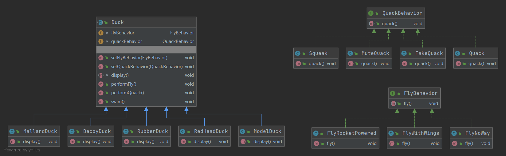

### ### 观察者模式

**观察者模式（Observer Pattern）**：定义了对象之间的一对多依赖，这样一来，当一个对象改变状态时，它的所有依赖者都会收到通知并自动更新。观察者模式提供了一种对象设计，让主题和观察者之间松耦合。松耦合的设计之所以能让我们建立有弹性的OO系统，能够应对变化，是因为对象之间的互相依赖降到了最低。

"气象检测站"：

**自定义观察者模式**：

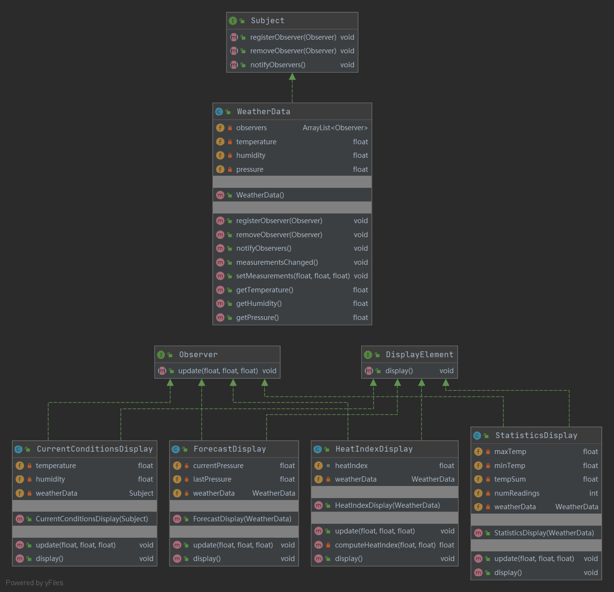

**JDK观察者模式**：Java提供的观察者模式：Observable类和Observer接口。

需要注意的是：Observable是一个类，**违反了OO设计原则（针对接口编程，而不是针对实现编程）**。由于java不支持多重继承，限制了Observable的复用潜力；此外，Observable的serChange方法被定义成protected，导致只有继承Observable类，才能将创建的Observable实例组合到自己的设计对象中来，**这违反了OO设计又一个原则（多用组合，少用继承）**。

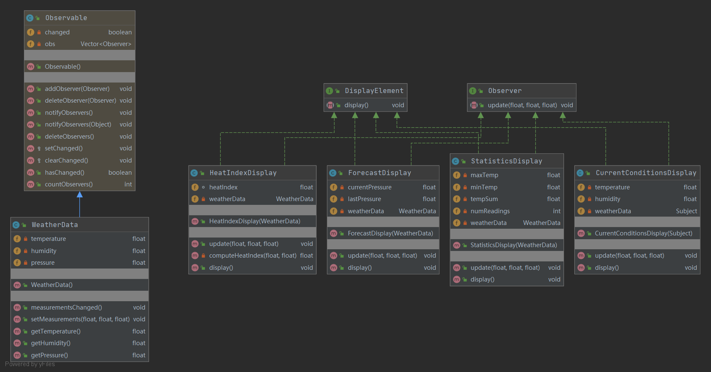

### ### 装饰者模式

**装饰者模式（Decorator Pattern）**：动态地将责任附加到对象上；若要扩展功能，装饰者提供了比继承更有弹性的替代方案。

"咖啡与调料"

**自定义装饰者模式**：

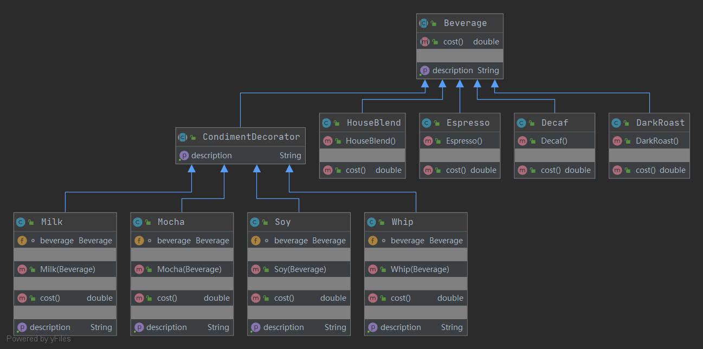

**增强Java I/O的装饰者模式**：

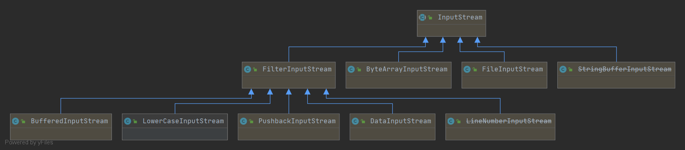

### ### 工厂模式

**工厂模式（Factory Pattern）**：

"比萨工厂"


## ## 设计模式（GURU）

**本部分图表使用IDEA+PlantUML+Graphviz制作**：

设计模式概览：

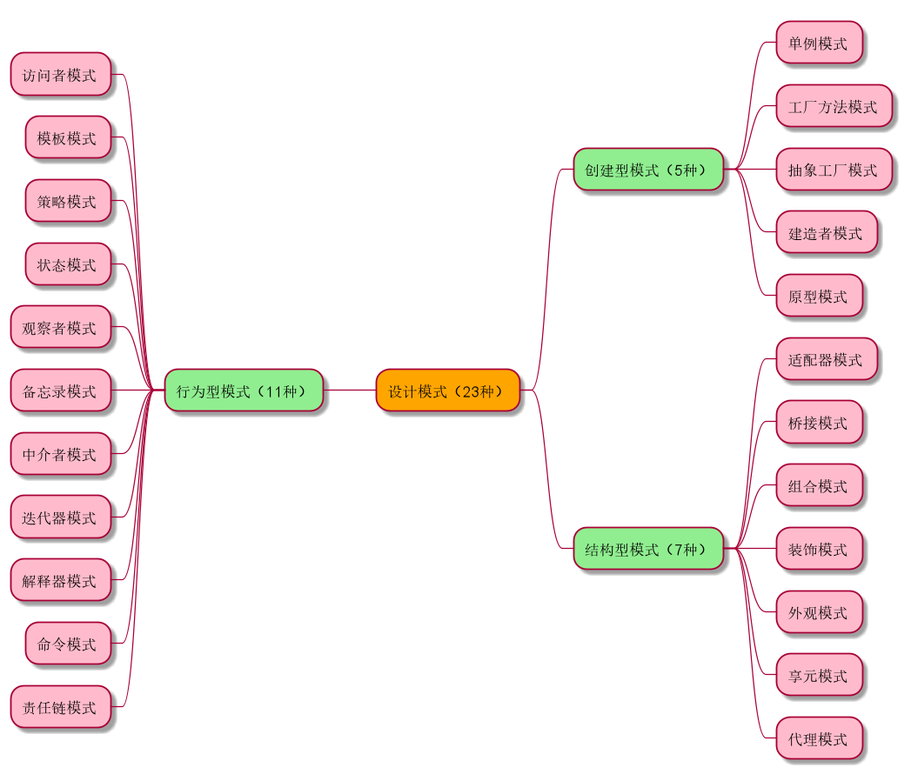

### ### 单例模式⭐

**单例模式**：一种创建型设计模式， 让你能够保证一个类只有一个实例， 并提供一个访问该实例的全局节点。

当系统中只需要一个实例对象或者系统中只允许一个公共访问点，除了这个公共访问点外，不能通过其他访问点访问该实例时，可以使用单例模式。单例模式的主要优点就是节约系统资源、提高了系统效率，同时也能够严格控制客户对它的访问。也许就是因为系统中只有一个实例，这样就导致了单例类的职责过重，违背了“单一职责原则”，同时也没有抽象类，所以扩展起来有一定的困难。其UML结构图非常简单，就只有一个类。

**Java类库中的应用**：

- `java.lang.Runtime#getRuntime()`
- `java.awt.Desktop#getDesktop()`
- `java.lang.System#getSecurityManager()`

**识别方法**： 单例可以通过返回相同缓存对象的静态构建方法来识别。

详见`1.1`。

### ### 工厂方法模式

**工厂方法模式**：一种创建型设计模式， 其在父类中提供一个创建对象的方法， 允许子类决定实例化对象的类型。

作为抽象工厂模式的孪生兄弟，工厂方法模式定义了一个创建对象的接口，但由子类决定要实例化的类是哪一个，也就是说工厂方法模式让实例化推迟到子类。工厂方法模式非常符合"开闭原则"，当需要增加一个新的产品时，我们只需要增加一个具体的产品类和与之对应的具体工厂即可，无须修改原有系统。同时在工厂方法模式中用户只需要知道生产产品的具体工厂即可，无须关系产品的创建过程，甚至连具体的产品类名称都不需要知道。虽然他很好的符合了“开闭原则”，但是由于每新增一个新产品时就需要增加两个类，这样势必会导致系统的复杂度增加。

**Java类库中的应用**：

- `java.util.Calendar#getInstance()`
- `java.util.ResourceBundle#getBundle()`
- `java.text.NumberFormat#getInstance()`
- `java.nio.charset.Charset#forName()`
- `java.net.URLStreamHandlerFactory#createURLStreamHandler(String)`
- `java.util.EnumSet#of()`
- `javax.xml.bind.JAXBContext#createMarshaller()`

**识别方法**： 工厂方法可通过构建方法来识别， 它会创建具体类的对象， 但以抽象类型或接口的形式返回这些对象。

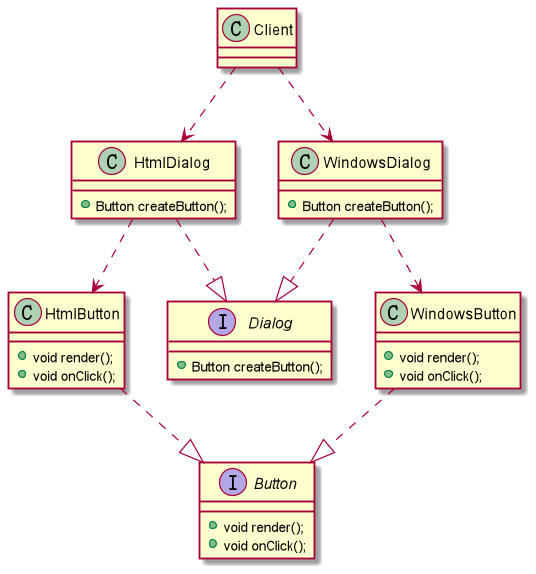

### ### 抽象工厂模式⭐

**抽象工厂模式**：一种创建型设计模式， 它能创建一系列相关的对象， 而无需指定其具体类。

提供一个接口，用于创建相关或者依赖对象的家族，而不需要明确指定具体类。他允许客户端使用抽象的接口来创建一组相关的产品，而不需要关系实际产出的具体产品是什么。这样一来，客户就可以从具体的产品中被解耦。它的优点是隔离了具体类的生成，使得客户端不需要知道什么被创建了，而缺点就在于新增新的行为会比较麻烦，因为当添加一个新的产品对象时，需要更加需要更改接口及其下所有子类。

**Java类库中的应用**：

- `javax.xml.parsers.DocumentBuilderFactory#newInstance()`
- `javax.xml.transform.TransformerFactory#newInstance()`
- `javax.xml.xpath.XPathFactory#newInstance()`

**识别方法**： 我们可以通过方法来识别该模式——其会返回一个工厂对象。 接下来， 工厂将被用于创建特定的子组件。

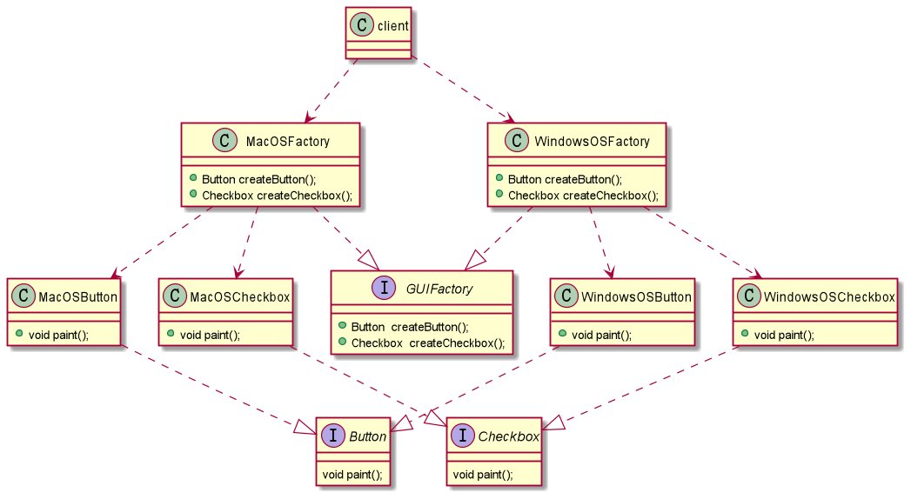

### ### 建造者模式⭐

**建造者模式（也称为生成器模式）**：一种创建型设计模式， 使你能够分步骤创建复杂对象。 该模式允许你使用相同的创建代码生成不同类型和形式的对象。

对于建造者模式而言，它主要是将一个复杂对象的构建与表示分离，使得同样的构建过程可以创建不同的表示。适用于那些产品对象的内部结构比较复杂。建造者模式将复杂产品的构建过程封装分解在不同的方法中，使得创建过程非常清晰，能够让我们更加精确的控制复杂产品对象的创建过程，同时它隔离了复杂产品对象的创建和使用，使得相同的创建过程能够创建不同的产品。但是如果某个产品的内部结构过于复杂，将会导致整个系统变得非常庞大，不利于控制，同时若几个产品之间存在较大的差异，则不适用建造者模式，毕竟这个世界上存在相同点大的两个产品并不是很多，所以它的使用范围有限。

**Java类库中的应用**：

- `java.lang.StringBuilder#append()`
- `java.lang.StringBuffer#append()`
- `java.nio.ByteBuffer#put()`
- `javax.swing.GroupLayout.Group#addComponent()`
- `java.lang.Appendable的所有实现`

**识别方法**： 生成器模式可以通过类来识别， 它拥有一个构建方法和多个配置结果对象的方法。 生成器方法通常支持方法链 （例如 `someBuilder->setValueA(1)->setValueB(2)->create()` ）。

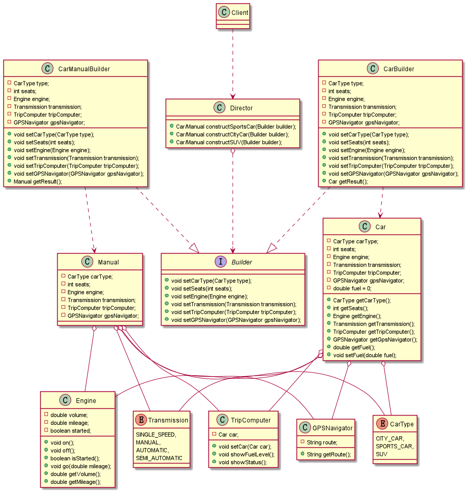

**建造者模式的一种简化（去掉Director）**：

```java
public class Car {
    private String carType;
    private int seats;
    private String engine;
    private String transmission;
    private String tripComputer;
    private String gpsNavigator;

    /* 禁止无参构造 */
    private Car(){
        throw new RuntimeException("Can't init...");
    }
    private Car(Builder builder){
        this.carType = builder.carType;
        this.seats = builder.seats;
        this.engine = builder.engine;
        this.transmission = builder.transmission;
        this.tripComputer = builder.tripComputer;
        this.gpsNavigator = builder.gpsNavigator;
    }

    @Override
    public String toString() {
        return "Car{" +
                "carType='" + carType + '\'' +
                ", seats=" + seats +
                ", engine='" + engine + '\'' +
                ", transmission='" + transmission + '\'' +
                ", tripComputer='" + tripComputer + '\'' +
                ", gpsNavigator='" + gpsNavigator + '\'' +
                '}';
    }

    public static final class Builder{
        private String carType;
        private int seats;
        private String engine;
        private String transmission;
        private String tripComputer;
        private String gpsNavigator;

        public Builder(){ }
        public Builder setCarType(String carType){
            this.carType = carType;
            return this;
        }
        public Builder setSeats(int seats){
            this.seats = seats;
            return this;
        }
        public Builder setEngine(String engine){
            this.engine = engine;
            return this;
        }
        public Builder setTransmission(String transmission){
            this.transmission = transmission;
            return this;
        }
        public Builder setTripComputer(String tripComputer){
            this.tripComputer = tripComputer;
            return this;
        }
        public Builder setGpsNavigator(String gpsNavigator){
            this.gpsNavigator = gpsNavigator;
            return this;
        }
        public Car build(){
            return new Car(this);
        }
    }

    public static void main(String[] args) {
        Car car = new Builder()
                .setCarType("SUV")
                .setSeats(6)
                .setEngine("1.6T")
                .setTransmission("混合动力")
                .setTripComputer("12.9寸液晶大屏")
                .setGpsNavigator("北斗")
                .build();
        System.out.println(car);
    }
}
```

### ### 原型模式

**原型模式**：一种创建型设计模式， 使你能够复制已有对象， 而又无需使代码依赖它们所属的类。

在我们应用程序可能有某些对象的结构比较复杂，但是我们又需要频繁的使用它们，如果这个时候我们来不断的新建这个对象势必会大大损耗系统内存的，这个时候我们需要使用原型模式来对这个结构复杂又要频繁使用的对象进行克隆。所以原型模式就是用原型实例指定创建对象的种类，并且通过复制这些原型创建新的对象。它主要应用与那些创建新对象的成本过大时。它的主要优点就是简化了新对象的创建过程，提高了效率，同时原型模式提供了简化的创建结构。

根据拷贝方式不同，原型模式又可以分为：浅克隆和深克隆。一般实现的是浅克隆方式。

**Java类库中的应用**：

- `java.lang.Object#clone() `

**识别方法**： 原型可以简单地通过 `clone`或 `copy`等方法来识别。

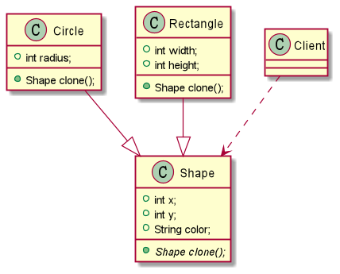

### ### 适配器模式⭐

**适配器模式**：一种结构型设计模式， 它能使接口不兼容的对象能够相互合作。

在应用程序中我们可能需要将两个不同接口的类来进行通信，在不修改这两个的前提下我们可能会需要某个中间件来完成这个衔接的过程。这个中间件就是适配器。所谓适配器模式就是将一个类的接口，转换成客户期望的另一个接口。它可以让原本两个不兼容的接口能够无缝完成对接。作为中间件的适配器将目标类和适配者解耦，增加了类的透明性和可复用性。

**Java类库中的应用**：

- `java.util.Arrays#asList()`
- `java.util.Collections#list()`
- `java.util.Collections#enumeration()`
- `java.io.InputStreamReader(InputStream) `
- `java.io.OutputStreamWriter(OutputStream)`
- `javax.xml.bind.annotation.adapters.XmlAdapter#marshal()`

**识别方法**：适配器可以通过以不同抽象或接口类型实例为参数的构造函数来识别。 当适配器的任何方法被调用时， 它会将参数转换为合适的格式， 然后将调用定向到其封装对象中的一个或多个方法。

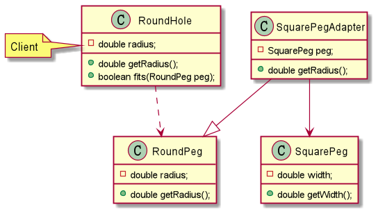

### ### 桥接模式⭐

**桥接模式**：一种结构型设计模式， 可将一个大类或一系列紧密相关的类拆分为抽象和实现两个独立的层次结构， 从而能在开发时分别使用。

如果说某个系统能够从多个角度来进行分类，且每一种分类都可能会变化，那么我们需要做的就是讲这多个角度分离出来，使得他们能独立变化，减少他们之间的耦合，这个分离过程就使用了桥接模式。所谓桥接模式就是讲抽象部分和实现部分隔离开来，使得他们能够独立变化。**桥接模式将继承关系转化成关联关系（关联优于继承）**，封装了变化，完成了解耦，减少了系统中类的数量，也减少了代码量。

**使用示例**： 桥接模式在处理跨平台应用、支持多种类型的数据库服务器或与多个特定种类（例如云平台和社交网络等）的API供应商协作时会特别有用。

**识别方法**： 桥接可以通过一些控制实体及其所依赖的多个不同平台之间的明确区别来进行识别。

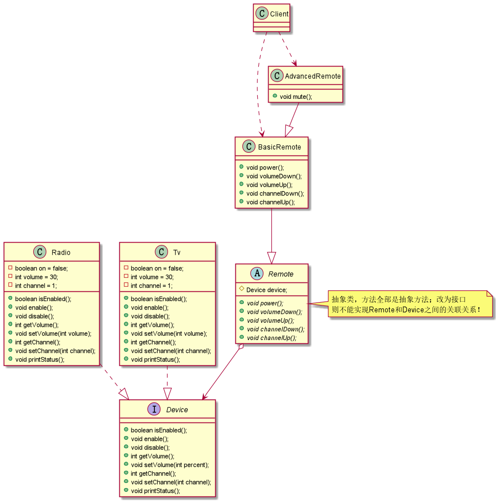

### ### 组合模式

**组合模式**：一种结构型设计模式， 你可以使用它将对象组合成树状结构， 并且能像使用独立对象一样使用它们。

组合模式组合多个对象形成树形结构以表示“整体-部分”的结构层次。它定义了如何将容器对象和叶子对象进行递归组合，使得客户在使用的过程中无须进行区分，可以对他们进行一致的处理。在使用组合模式中需要注意一点也是组合模式最关键的地方：叶子对象和组合对象实现相同的接口。这就是组合模式能够将叶子节点和对象节点进行一致处理的原因。

虽然组合模式能够清晰地定义分层次的复杂对象，也使得增加新构件也更容易，但是这样就导致了系统的设计变得更加抽象，如果系统的业务规则比较复杂的话，使用组合模式就有一定的挑战了。

**Java类库中的应用**：

- `java.awt.Container#add(Component)`
- `javax.faces.component.UIComponent#getChildren()`

**识别方法**： 组合可以通过将同一抽象或接口类型的实例放入树状结构的行为方法来轻松识别。

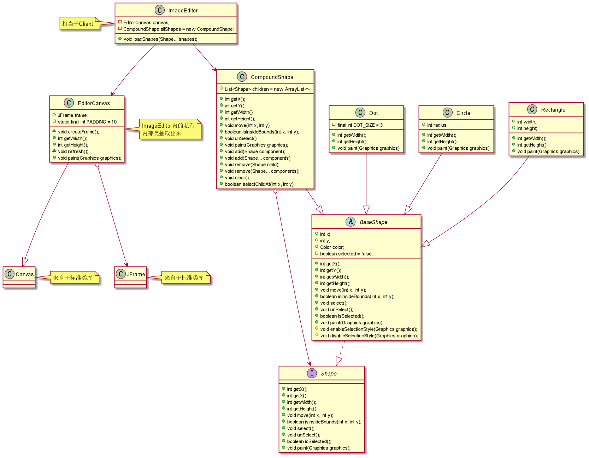

### ### 装饰模式⭐

**装饰模式**：一种结构型设计模式， 允许你通过将对象放入包含行为的特殊封装对象中来为原对象绑定新的行为。

我们可以通过继承和组合的方式来给一个对象添加行为，虽然使用继承能够很好拥有父类的行为，但是它存在几个缺陷：一、对象之间的关系复杂的话，系统变得复杂不利于维护。二、容易产生“类爆炸”现象。三、是静态的。在这里我们可以通过使用装饰者模式来解决这个问题。装饰者模式，动态地将责任附加到对象上。若要扩展功能，装饰者提供了比继承更加有弹性的替代方案。虽然装饰者模式能够动态将责任附加到对象上，但是他会产生许多的细小对象，增加了系统的复杂度。

**Java类库中的应用**：

- `java.io.InputStream、 Output­Stream、 Reader 和 Writer 的所有代码都有以自身类型的对象作为参数的构造函数。`
- `java.util.Collections； checked­XXX()、 synchronized­XXX() 和 unmodifiable­XXX() 方法。`
- `javax.servlet.http.HttpServletRequestWrapper 和 Http­Servlet­Response­Wrapper。`

**识别方法**：装饰可通过以当前类或对象为参数的创建方法或构造函数来识别。

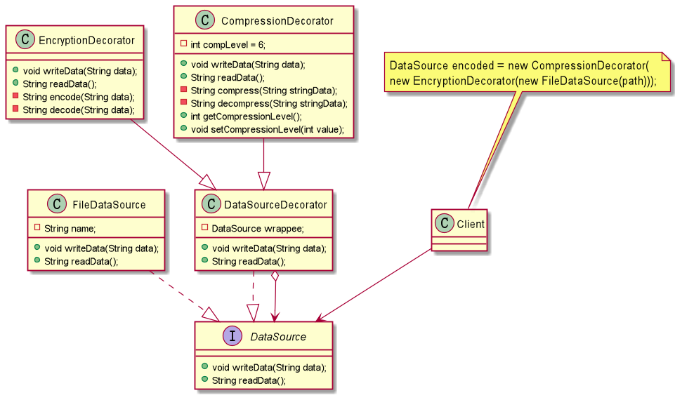

### ### 外观模式

**外观模式**：也称为"门面模式"。一种结构型设计模式， 能为程序库、 框架或其他复杂类提供一个简单的接口。

我们都知道类与类之间的耦合越低，那么可复用性就越好，如果两个类不必彼此通信，那么就不要让这两个类发生直接的相互关系，如果需要调用里面的方法，可以通过第三者来转发调用。外观模式非常好的诠释了这段话。外观模式提供了一个统一的接口，用来访问子系统中的一群接口。它让一个应用程序中子系统间的相互依赖关系减少到了最少，它给子系统提供了一个简单、单一的屏障，客户通过这个屏障来与子系统进行通信。通过使用外观模式，使得客户对子系统的引用变得简单了，实现了客户与子系统之间的松耦合。但是它违背了“开闭原则”，因为增加新的子系统可能需要修改外观类或客户端的源代码。

**Java类库中的应用**：

- `javax.faces.context.FacesContext在底层使用了Life­Cycle、View­Handler和Navigation­Handler这几个类，但绝大多数客户端不知道。`
- `javax.faces.context.ExternalContext在内部使用了Servlet­Context、Http­Session、Http­Servlet­Request、Http­Servlet­Response和其他一些类。`

**识别方法**：外观可以通过使用简单接口， 但将绝大部分工作委派给其他类的类来识别。 通常情况下， 外观管理着其所使用的对象的完整生命周期。

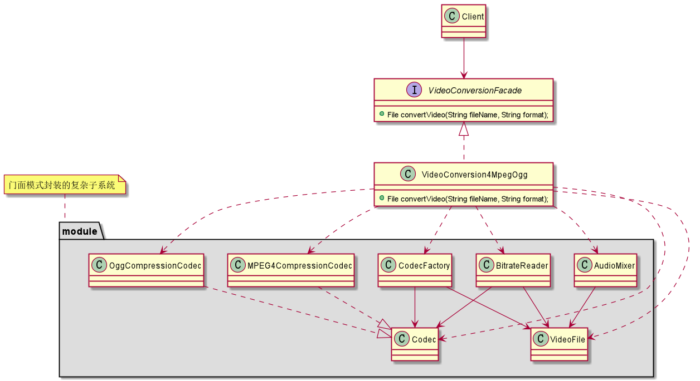

### ### 享元模式⭐

**享元模式**：一种结构型设计模式， 它摒弃了在每个对象中保存所有数据的方式， 通过共享多个对象所共有的相同状态， 让你能在有限的内存容量中载入更多对象。

在一个系统中对象会使得内存占用过多，特别是那些大量重复的对象，这就是对系统资源的极大浪费。享元模式对对象的重用提供了一种解决方案，它使用共享技术对相同或者相似对象实现重用。享元模式就是运行共享技术有效地支持大量细粒度对象的复用。系统使用少量对象,而且这些都比较相似，状态变化小，可以实现对象的多次复用。这里有一点要注意：享元模式要求能够共享的对象必须是细粒度对象。享元模式通过共享技术使得系统中的对象个数大大减少了，同时享元模式使用了内部状态和外部状态，同时外部状态相对独立，不会影响到内部状态，所以享元模式能够使得享元对象在不同的环境下被共享。同时正是分为了内部状态和外部状态，享元模式会使得系统变得更加复杂，同时也会导致读取外部状态所消耗的时间过长。

**Java类库中的应用**：

- `java.lang.Integer#valueOf(int)]以及Boolean、Byte、Character、Short、Long和Big­Decimal`

**识别方法**： 享元可以通过构建方法来识别， 它会返回缓存对象而不是创建新的对象。

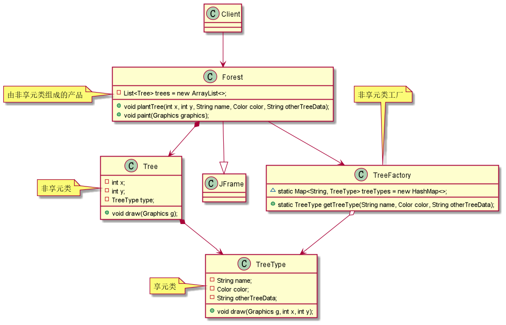

### ### 代理模式⭐

**代理模式**：一种结构型设计模式， 让你能够提供对象的替代品或其占位符。 代理控制着对于原对象的访问， 并允许在将请求提交给对象前后进行一些处理。

代理模式就是给一个对象提供一个代理，并由代理对象控制对原对象的引用。它使得客户不能直接与真正的目标对象通信。代理对象是目标对象的代表，其他需要与这个目标对象打交道的操作都是和这个代理对象在交涉。代理对象可以在客户端和目标对象之间起到中介的作用，这样起到了的作用不仅保护了目标对象，同时也在一定程度上面减少了系统的耦合度。

**Java类库中的应用**：

- `java.lang.reflect.Proxy`
- `java.rmi.*`
- `javax.ejb.EJB`
- `javax.inject.Inject`
- `javax.persistence.PersistenceContext`

**识别方法**：代理模式会将所有实际工作委派给一些其他对象。 除非代理是某个服务的子类， 否则每个代理方法最后都应该引用一个服务对象。

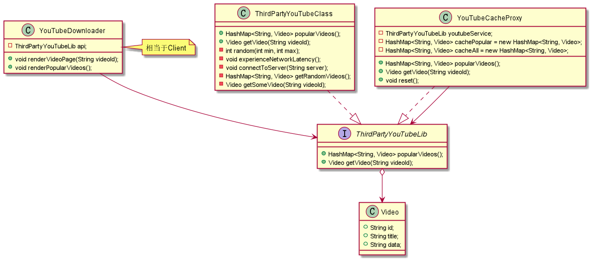

### ### 责任链模式⭐

**责任链模式**：亦称"职责链模式" 。一种行为设计模式， 允许你将请求沿着处理者链进行发送。 收到请求后， 每个处理者均可对请求进行处理， 或将其传递给链上的下个处理者。

职责链模式描述的请求如何沿着对象所组成的链来传递的。它将对象组成一条链，发送者将请求发给链的第一个接收者，并且沿着这条链传递，直到有一个对象来处理它或者直到最后也没有对象处理而留在链末尾端。避免请求发送者与接收者耦合在一起，让多个对象都有可能接收请求，将这些对象连接成一条链，并且沿着这条链传递请求，直到有对象处理它为止，这就是职责链模式。在职责链模式中，使得每一个对象都有可能来处理请求，从而实现了请求的发送者和接收者之间的解耦。同时职责链模式简化了对象的结构，它使得每个对象都只需要引用它的后继者即可，而不必了解整条链，这样既提高了系统的灵活性也使得增加新的请求处理类也比较方便。但是在职责链中我们不能保证所有的请求都能够被处理，而且不利于观察运行时特征。

**Java类库中的应用**：

- `javax.servlet.Filter#doFilter()`
- `java.util.logging.Logger#log()`

**识别方法**：该模式可通过一组对象的行为方法间接调用其他对象的相同方法来识别， 而且所有对象都会遵循相同的接口。

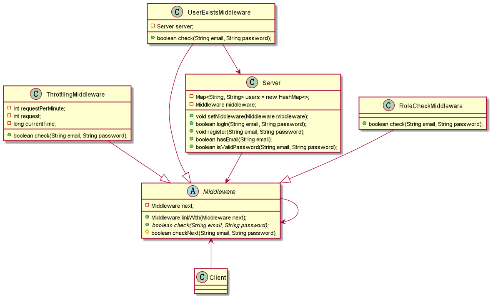

### ### 命令模式

**命令模式**：一种行为设计模式， 它可将请求转换为一个包含与请求相关的所有信息的独立对象。 该转换让你能根据不同的请求将方法参数化、 延迟请求执行或将其放入队列中， 且能实现可撤销操作。

有些时候我们想某个对象发送一个请求，但是我们并不知道该请求的具体接收者是谁，具体的处理过程是如何的，们只知道在程序运行中指定具体的请求接收者即可，对于这样将请求封装成对象的我们称之为命令模式。所以命令模式将请求封装成对象，以便使用不同的请求、队列或者日志来参数化其他对象。同时命令模式支持可撤销的操作。

命令模式可以将请求的发送者和接收者之间实现完全的解耦，发送者和接收者之间没有直接的联系，发送者只需要知道如何发送请求命令即可，其余的可以一概不管，甚至命令是否成功都无需关心。同时我们可以非常方便的增加新的命令，但是可能就是因为方便和对请求的封装就会导致系统中会存在过多的具体命令类。

**Java类库中的应用**：

- `java.lang.Runnable`

- `javax.swing.Action`

**识别方法**： 命令模式可以通过抽象或接口类型 （发送者） 中的行为方法来识别， 该类型调用另一个不同的抽象或接口类型 （接收者） 实现中的方法， 该实现则是在创建时由命令模式的实现封装。 命令类通常仅限于一些特殊行为。

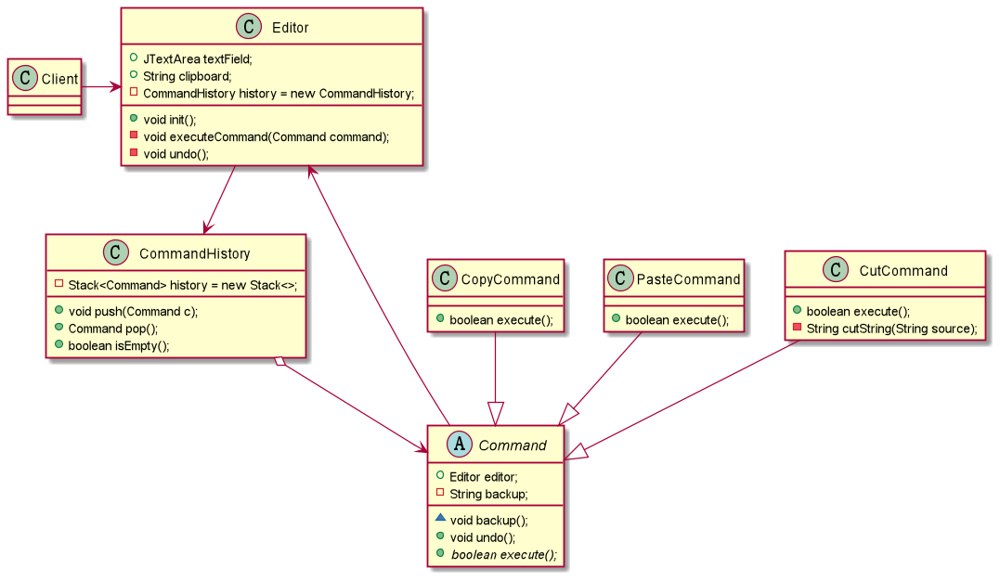

### ### 迭代器模式

**迭代器模式**：一种行为设计模式， 让你能在不暴露集合底层表现形式 （列表、 栈和树等） 的情况下遍历集合中所有的元素。

对于迭代在编程过程中我们经常用到，能够游走于聚合内的每一个元素，同时还可以提供多种不同的遍历方式，这就是迭代器模式的设计动机。在我们实际的开发过程中，我们可能会需要根据不同的需求以不同的方式来遍历整个对象，但是我们又不希望在聚合对象的抽象接口中充斥着各种不同的遍历操作，于是我们就希望有某个东西能够以多种不同的方式来遍历一个聚合对象，这时迭代器模式出现了。

何为迭代器模式？所谓迭代器模式就是提供一种方法顺序访问一个聚合对象中的各个元素，而不是暴露其内部的表示。迭代器模式是将迭代元素的责任交给迭代器，而不是聚合对象，我们甚至在不需要知道该聚合对象的内部结构就可以实现该聚合对象的迭代。通过迭代器模式，使得聚合对象的结构更加简单，它不需要关注它元素的遍历，只需要专注它应该专注的事情，这样就更加符合单一职责原则了。

**Java类库中的应用**：

- `java.util.Iterator`
- `java.util.Scanner`
- `java.util.Enumeration`

**识别方法**：迭代器可以通过导航方法 （例如 `next`和 `previous`等） 来轻松识别。 使用迭代器的客户端代码可能没有其所遍历的集合的直接访问权限。

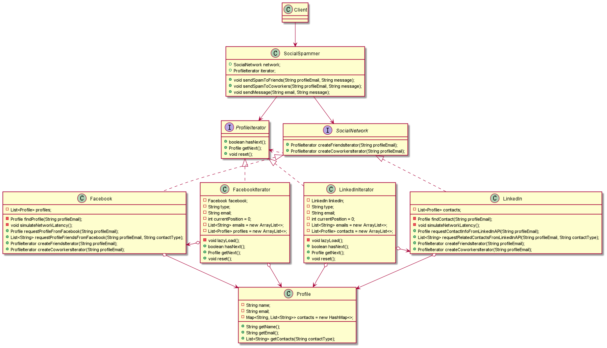

### ### 中介者模式

**中介者模式**：一种行为设计模式， 能让你减少对象之间混乱无序的依赖关系。 该模式会限制对象之间的直接交互， 迫使它们通过一个中介者对象进行合作。

租房各位都有过的经历吧！在这个过程中中介结构扮演着很重要的角色，它在这里起到一个中间者的作用，给我们和房主互相传递信息。在外面软件的世界里同样需要这样一个中间者。在我们的系统中有时候会存在着对象与对象之间存在着很强、复杂的关联关系，如果让他们之间有直接的联系的话，必定会导致整个系统变得非常复杂，而且可扩展性很差！在前面我们就知道如果两个类之间没有不必彼此通信，我们就不应该让他们有直接的关联关系，如果实在是需要通信的话，我们可以通过第三者来转发他们的请求。同样，这里我们利用中介者来解决这个问题。

所谓中介者模式就是用一个中介对象来封装一系列的对象交互，中介者使各对象不需要显式地相互引用，从而使其耦合松散，而且可以独立地改变它们之间的交互。在中介者模式中，中介对象用来封装对象之间的关系，各个对象可以不需要知道具体的信息通过中介者对象就可以实现相互通信。它减少了对象之间的互相关系，提供了系统可复用性，简化了系统的结构。

 在中介者模式中，各个对象不需要互相知道了解，他们只需要知道中介者对象即可，但是中介者对象就必须要知道所有的对象和他们之间的关联关系，正是因为这样就导致了中介者对象的结构过于复杂，承担了过多的职责，同时它也是整个系统的核心所在，它有问题将会导致整个系统的问题。所以如果在系统的设计过程中如果出现“多对多”的复杂关系群时，千万别急着使用中介者模式，而是要仔细思考是不是您设计的系统存在问题。

**Java类库中的应用**：

- `java.util.Timer`

- `java.util.concurrent.Executor#execute()`
- `java.util.concurrent.ExecutorService `
- `java.util.concurrent.ScheduledExecutorService（invoke­XXX()和submit­()方法）`
- `java.lang.reflect.Method#invoke()`

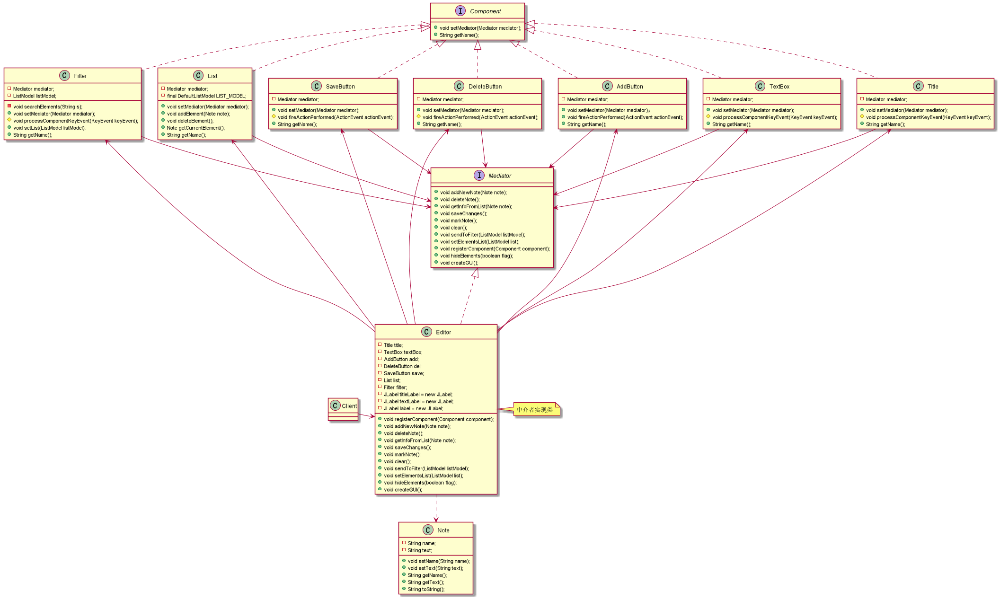

### ### 备忘录模式⭐⭐

**备忘录模式**：一种行为设计模式， 允许在不暴露对象实现细节的情况下保存和恢复对象之前的状态。

后悔药人人都想要，但是事实却是残酷的，根本就没有后悔药可买，但是也不仅如此，在软件的世界里就有后悔药！备忘录模式就是一种后悔药，它给我们的软件提供后悔药的机制，通过它可以使系统恢复到某一特定的历史状态。

所谓备忘录模式就是在不破坏封装的前提下，捕获一个对象的内部状态，并在该对象之外保存这个状态，这样可以在以后将对象恢复到原先保存的状态。它实现了对信息的封装，使得客户不需要关心状态保存的细节。保存就要消耗资源，所以备忘录模式的缺点就在于消耗资源。如果类的成员变量过多，势必会占用比较大的资源，而且每一次保存都会消耗一定的内存。

**Java类库中的应用**：

- 所有`java.io.Serializable`的实现都可以模拟备忘录
- 所有`javax.faces.component.StateHolder`的实现


### ### 观察者模式⭐

**观察者模式**：亦称"事件订阅者"/"监听者"/"Event-Subscriber"/"Listener"/"Observer"。是一种行为设计模式， 允许你定义一种订阅机制， 可在对象事件发生时通知多个"观察"该对象的其他对象。

何谓观察者模式？观察者模式定义了对象之间的一对多依赖关系，这样一来，当一个对象改变状态时，它的所有依赖者都会收到通知并且自动更新。在这里，发生改变的对象称之为观察目标，而被通知的对象称之为观察者。一个观察目标可以对应多个观察者，而且这些观察者之间没有相互联系，所以么可以根据需要增加和删除观察者，使得系统更易于扩展。所以观察者提供了一种对象设计，让主题和观察者之间以松耦合的方式结合。

**Java类库中的应用**：

- `java.util.Observer/java.util.Observable` （极少在真实世界中使用）
- `java.util.EventListener`的所有实现（几乎广泛存在于Swing组件中）
- `javax.servlet.http.HttpSessionBindingListener`
- `javax.servlet.http.HttpSessionAttributeListener`
- `javax.faces.event.PhaseListener`

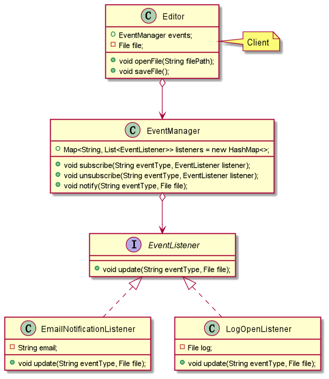

### ### 状态模式⭐

**状态模式**：一种行为设计模式， 让你能在一个对象的内部状态变化时改变其行为， 使其看上去就像改变了自身所属的类一样。

在很多情况下我们对象的行为依赖于它的一个或者多个变化的属性，这些可变的属性我们称之为状态，也就是说行为依赖状态，即当该对象因为在外部的互动而导致他的状态发生变化，从而它的行为也会做出相应的变化。对于这种情况，我们是不能用行为来控制状态的变化，而应该站在状态的角度来思考行为，即是什么状态就要做出什么样的行为。这个就是状态模式。

所以状态模式就是允许对象在内部状态发生改变时改变它的行为，对象看起来好像修改了它的类。

在状态模式中我们可以减少大块的if…else语句，它是允许态转换逻辑与状态对象合成一体，但是减少if…else语句的代价就是会换来大量的类，所以状态模式势必会增加系统中类或者对象的个数。同时，状态模式是将所有与某个状态有关的行为放到一个类中，并且可以方便地增加新的状态，只需要改变对象状态即可改变对象的行为。但是这样就会导致系统的结构和实现都会比较复杂，如果使用不当就会导致程序的结构和代码混乱，不利于维护。

**Java类库中的应用**：

- `javax.faces.lifecycle.LifeCycle#execute()`（由`Faces­Servlet`控制，行为依赖于当前`JSF`生命周期的阶段（状态））。

**识别方法**：状态模式可通过受外部控制且能根据对象状态改变行为的方法来识别。

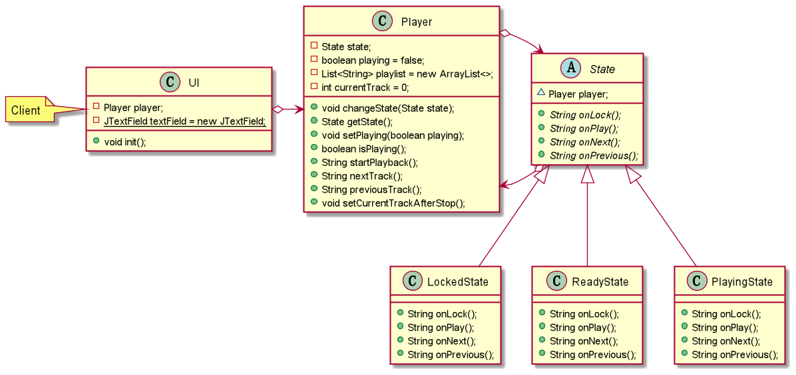

### ### 策略模式⭐

**策略模式**：一种行为设计模式， 它能让你定义一系列算法， 并将每种算法分别放入独立的类中， 以使算法的对象能够相互替换。

我们知道一件事可能会有很多种方式来实现它，但是其中总有一种最高效的方式，在软件开发的世界里面同样如此，我们也有很多中方法来实现一个功能，但是我们需要一种简单、高效的方式来实现它，使得系统能够非常灵活，这就是策略模式。

策略模式就是定义了算法族，分别封装起来，让他们之前可以互相转换，此模式然该算法的变化独立于使用算法的客户。在策略模式中它将这些解决问题的方法定义成一个算法群，每一个方法都对应着一个具体的算法，这里的一个算法我就称之为一个策略。虽然策略模式定义了算法，但是它并不提供算法的选择，即什么算法对于什么问题最合适这是策略模式所不关心的，所以对于策略的选择还是要客户端来做。客户必须要清楚的知道每个算法之间的区别和在什么时候什么地方使用什么策略是最合适的，这样就增加客户端的负担。同时，策略模式也非常完美的符合了"开闭原则"，用户可以在不修改原有系统的基础上选择算法或行为，也可以灵活地增加新的算法或行为。但是一个策略对应一个类将会是系统产生很多的策略类。

**Java类库中的应用**：

- 对`java.util.Comparator#compare() `的调用来自Collections#sort()。
- `javax.servlet.http.HttpServlet#service­()`方法， 还有接受`Http­Servlet­Request`和`Http­Servlet­Response`对象作为参数的`do­XXX()`方法。

- `javax.servlet.Filter#doFilter()`。

**识别方法**： 策略模式可以通过允许嵌套对象完成实际工作的方法以及允许将该对象替换为不同对象的设置器来识别。


### ### 模板方法模式⭐

**模板方法模式**：是一种行为设计模式， 它在超类中定义了一个算法的框架（**骨架**）， 允许子类在不修改结构的情况下重写算法的特定步骤。

有些时候我们做某几件事情的步骤都差不多，仅有那么一小点的不同，在软件开发的世界里同样如此，如果我们都将这些步骤都一一做的话，费时费力不讨好。所以我们可以将这些步骤分解、封装起来，然后利用继承的方式来继承即可，当然不同的可以自己重写实现嘛！这就是模板方法模式提供的解决方案。

所谓模板方法模式就是在一个方法中定义一个算法的骨架，而将一些步骤延迟到子类中。模板方法使得子类可以在不改变算法结构的情况下，重新定义算法中的某些步骤。模板方法模式就是基于继承的代码复用技术的。在模板方法模式中，我们可以将相同部分的代码放在父类中，而将不同的代码放入不同的子类中。也就是说我们需要声明一个抽象的父类，将部分逻辑以具体方法以及具体构造函数的形式实现，然后声明一些抽象方法让子类来实现剩余的逻辑，不同的子类可以以不同的方式来实现这些逻辑。所以模板方法的模板其实就是一个普通的方法，只不过这个方法是将算法实现的步骤封装起来的。

**Java类库中的应用**：

- `java.io.InputStream`、`java.io.OutputStream`、`java.io.Reader`和`java.io.Writer`的所有非抽象方法
- `java.util.AbstractList`、`java.util.AbstractSet`和`java.util.AbstractMap`的所有非抽象方法
- `javax.servlet.http.HttpServlet`，所有默认发送HTTP 405"方法不允许"错误响应的`do­XXX()`方法，你可随时对其进行重写

**识别方法**：模版方法可以通过行为方法来识别，该方法已有一个在基类中定义的"默认"行为。

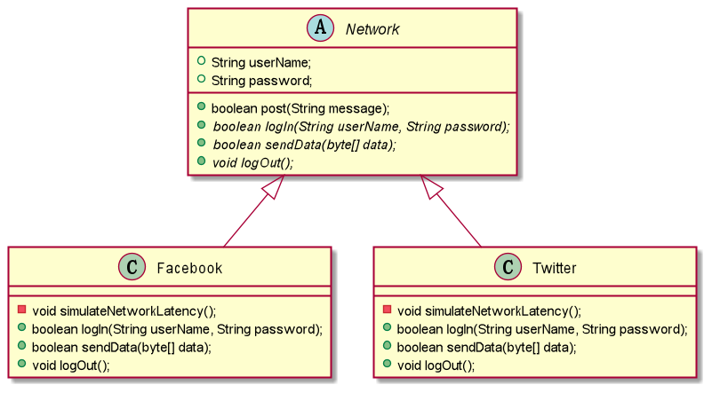

### ### 访问者模式


## ## UML类图

1. 泛化关系（继承关系）**：带三角箭头的实线，箭头指向父类**。

2. 实现关系**：带三角箭头的虚线，箭头指向接口**。

3. 关联关系：
   - 双向关联**：有两个普通箭头或者没有箭头的实线。**
   - 单向关联**：带普通箭头的实线，指向被拥有者。**

4. 聚合关系：是整体与部分的关系，且部分可以离开整体而单独存在。聚合是一种强的关联关系。
   - **带空心菱形的实心线，菱形指向整体**。

5. 组合关系：是整体与部分的关系，但部分不能离开整体而单独存在。组合是一种比聚合还要强的关联关系。
   - **带实心菱形的实线，菱形指向整体**。

6. 依赖关系：是一种使用的关系，即一个类的实现需要另一个类的协助。
   - **带普通箭头的虚线，指向被使用者**。

7. 可见性：
   - public：+
   - protected：#
   - private：-
   - package：~

## ## 绘制UML类图

1. IDEA安装PlantUML-integration插件。
2. 安装Graphviz软件。
3. 学习PlantUML语法。
   - 依赖关系：`..>`
   - 继承关系：`--|>`
   - 实现关系：`..|>`
   - 关联关系：`Computer --> Mouse`
   - 聚合关系：`Person o-- IDCard`
   - 组合关系：`Person *-- Head`

> 参考文章博客：[JDK里的设计模式](https://stackoverflow.com/questions/1673841/examples-of-gof-design-patterns-in-javas-core-libraries)、**[《HeadFirst设计模式》]()**、[UML类图](https://blog.csdn.net/qq_40138785/article/details/81065979)、[设计模式总结](https://www.cnblogs.com/pony1223/p/7608955.html)、[PlantUML使用教程](https://www.cnblogs.com/mikisakura/p/12978402.html)、**[PlantUML官方教程](https://plantuml.com/zh/class-diagram)**、**[设计模式的学习](https://refactoringguru.cn/design-patterns/)**、[设计模式英文教程](https://www.journaldev.com/1827/java-design-patterns-example-tutorial)

# 2 多线程

## 2.1 多线程基础

### 2.1.1 线程创建的三种方式

**程序**：是指令和数据的有序集合，本身没有任何运行含义，是一个静态的概念。

**进程**：程序执行的过程，是一个动态的概念。进程是系统资源分配的单位，一个进程中可以包含多个线程。

- 进程是操作系统分配资源的最小单元。
- 一个程序至少有一个进程，一个进程至少有一个线程。

**线程**：线程是CPU调度和执行的单位。Java默认有2个线程（main和gc）。Java本身并不能真正开启线程，底层通过native本地方法使用C语言开启线程。

- 线程是操作系统调度的最小单元。

**并发**：CPU一核，模拟出来多条线程，快速交替。（查看CPU的核数：`Runtime.getRuntime().availableProcessors()`）。并发编程的本质是充分利用CPU的资源。

**并行**：CPU多核，多个线程可以同时执行。（使用线程池提高性能）

**线程创建的三种方式**：

- Thread类

```yaml
# 1. 自定义线程类继承Thread类
# 2. 重写Run方法，编写线程执行体
# 3. 创建线程对象，调用start方法启动线程
```

- Runnable接口

```yaml
# 1. 实现Runnable接口
# 2. 实现重写Run方法，编写线程执行体
# 3. 创建线程对象，调用start方法启动线程
	 这里与Thread类有区别：Runnable实现类必须作为Thread类的构造参数；本质是Thread类实现了Runnable接口。

# 注意：避免单继承局限性，推荐使用Runnable接口
```

- Callable接口

```yaml
# 1. 实现Callable接口，需要返回值类型
# 2. 重写call方法，需要抛出异常
# 3. 创建目标对象
# 4. 创建执行服务（线程池）: ExecutorService service = Executors.newFixedThreadPool(1);
# 5. 提交执行（submit方法）: Future<返回值类型> result1 = service.submit(t1);
# 6. 获取结果: 返回值类型 r1 = result1.get();
# 7. 关闭服务: service.shutdownNow();

# Callable的好处：可以定义返回值；可以抛出异常
```

**静态代理模式**：

**Lamda表达式**：

### 2.1.2 线程的六种状态

**线程的六种状态**：

- 创建(NEW)：新创建了一个线程对象，但还没有调用start()方法。
- 运行(RUNNABLE)：Java线程中将就绪(READY)和运行中(RUNNING)两种状态笼统的称为"运行"。
- 阻塞(BLOCKED)：表示线程阻塞于锁。
- 等待(WAITING)：进入该状态的线程需要等待其他线程做出一些特定动作(通知或中断）。
- 超时等待(TIMED_WAITING)：该状态不同于WAITING，它可以在指定的时间后自行返回。
- 死亡(TERMINATED)：表示该线程已经执行完毕。

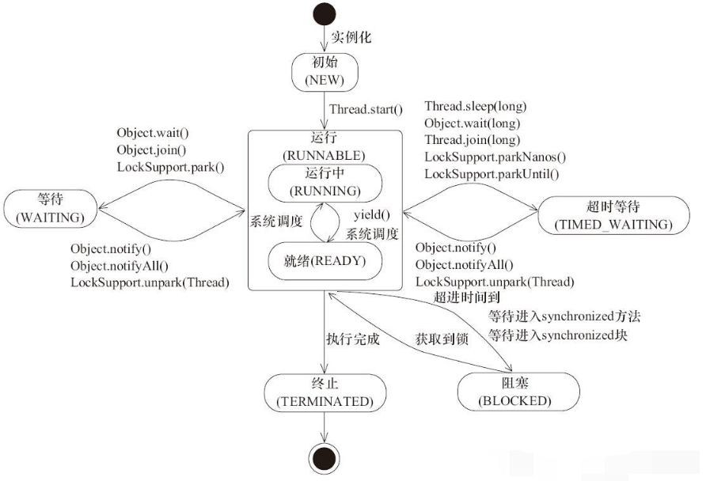

```yaml
# 1. 如何停止线程？
# 1.1 不建议使用stop方法（已废弃）
# 1.2 建议线程正常停止（可以利用循环次数控制，不建议死循环）
# 1.3 或者使用标志位

# 2. 线程休眠(sleep)
# 2.1 sleep(时间)指定当前线程阻塞的毫秒数
# 2.2 sleep存在异常InterruptedException
# 2.3 sleep时间达到后线程进入就绪状态
# 2.4 sleep可以模拟网络延时、倒计时等
# 2.5 每一个对象都有一个锁，sleep不会释放锁

# 3. 线程礼让(yield)
# 3.1 礼让线程，让当前正在执行的线程暂停，但不阻塞
# 3.2 将线程从运行状态转为就绪状态
# 3.3 让CPU重新调度，例如不一定成功，看CPU心情

# 4. 线程强制执行(join)
# 4.1 Join合并线程，待此线程执行完成后，再执行其他线程，其他线程阻塞（类似于插队）

# 5. 常见的与线程相关的方法
# 5.1 获取当前线程的名称：Thread.currentThread().getName()
# 5.2 获取线程状态的方法：thread.getState()
# 5.3 设置/获取线程的优先级：setPriority(int xxx),getPriority(),默认优先级是5
```

**守护线程**：

- 线程分为用户线程和守护线程（使用**setDaemon(true)**可以设置为守护线程）。
- 虚拟机必须确保用户线程执行完毕（如main方法为用户线程）。
- 虚拟机不用等待守护线程执行完毕（如gc方法为守护线程）。
- 守护线程的应用：后台记录操作日志、监控内存、垃圾回收...

### 2.1.3 锁机制

#### 2.1.3.1 同步

**使用锁机制（synchronized）解决同步必然会带来如下问题**：

1. 一个线程持有锁会导致其他所有需要此锁的线程挂起。
2. 在多线程竞争下，加锁、释放锁会导致比较多的上下文切换和调度延时，会引起性能问题。
3. 如果一个优先级高的线程等待一个优先级低的线程释放锁，会导致优先级倒置，引起性能问题。

**同步方法**：在方法上添加synchronized关键字。若将一个大的方法声明为synchronized将会影响效率。

**同步块**：

- 在代码块上添加synchronized(同步监视器)。
- 同步监视器可以是任何对象，但是推荐使用共享资源作为同步监视器。
- 同步方法中无需指定同步监视器，因为同步方法的同步监视器就是this。

#### 2.1.3.2 死锁

**死锁**：多个线程各自占有一些共享资源，并且互相等待其他线程占有的资源才能运行，而导致两个或者多个线程都在等待对方释放资源，都停止执行的情形。某一个同步块同时拥有"两个以上对象的锁"时，就可能会发生"死锁"问题。

**产生死锁的四个必要条件**：

1. 互斥条件：即当资源被一个线程使用（占有）时，别的线程不能使用。
2. 不可抢占：资源请求者不能强制从资源占有者手中夺取资源，资源只能由资源占用者主动释放。
3. 请求和保持：当资源的请求者在请求其他的资源的同时保持对原有资源的占有。
4. 循环等待：即存在一个等待队列， P1占有P2的资源，P2占有P3的资源，P3占有P1的资源。

#### 2.1.3.3 Lock锁

**关于Lock锁**：

- 从jdk5.0开始，Java提供了更强大的线程同步机制：通过显示定义同步锁对象来实现同步，同步锁使用Lock对象充当。
- java.util.concurrent.locks.Lock接口是控制多个线程对共享资源进行访问的工具。锁提供了对共享资源的独立访问，**每次只能有一个线程对Lock对象加锁**，线程开始访问共享资源之前应先获得Lock对象。
- ReentrantLock类实现了Lock，它拥有与synchronized相同的并发性和内存语义，在实现线程安全的控制中，比较常用的是ReentrantLock，**可以显示加锁（lock()方法）和释放锁（unlock()方法）**。

**synchronized与Lock的对比**：

1. **类型不同**：synchronized是内置的java关键字；Lock是一个类。
2. **使用灵活性不同**：synchronized无法判断获取锁的状态；Lock可以判断是否获取到了锁。
3. **使用方法不用**：synchronized是隐式锁，出了作用域自动释放；Lock是显示锁（需手动开启和释放锁，如果不释放锁，会造成死锁）。
4. **锁的限制不同**：synchronized加锁后，若线程没获取到锁，会一致等待下去；Lock锁不一定会等待下去（`lock.tryLock()方法`）。
5. **锁的类型不同**：synchronized是可重入锁，不可中断的，非公平锁；Lock锁是可重入锁，但是可以判断锁，是非公平锁（可以自己设置）。（公平锁与非公平锁：公平锁遵循先来后到；非公平锁可以"插队"（Java默认是非公平锁））
6. **使用范围不同**：synchronized有代码块锁和方法锁；Lock只有代码块锁。
7. **使用场景不同**：synchronized适合锁少量的代码同步问题；Lock适合锁大量的同步代码（JVM将花费较少的时间来调度线程），此外Lock锁具有更好的扩展性（提供更多的子类）。**优先使用顺序：Lock-->同步代码块-->同步方法。**

#### 2.1.3.4 典型应用

- 线程通信：生产者与消费者问题
  - 使用以下几个方法解决线程之间的通信问题：wait()/wait(long timeout)，notify()/notifyAll()。
  - 与sleep方法不同，wait方法会释放锁。
  - 有两种解决生产者与消费者问题的方法：管程法、信号灯法。

#### 2.1.3.5 线程池

常见的线程池技术：c3p0、Druid。

**volatile**： volatile修饰的变量不允许线程内部缓存和重排序，只能直接修改内存，所以对其他线程是**可见**的；但是，volatile只能让被他修饰的内容具有可见性，但不能保证它具有原子性。例如`volatile int a = 0;` ，之后有一个操作`a++;`，这个变量a具有可见性，但是`a++;`依然是一个非原子操作，也就是这个操作同样存在线程安全的问题。此外，volatile还可以**禁止指令重排序**，可以使用volatile和synchronized两个关键字来保证线程之间操作的有序性。

**transient**：将不需要序列化的属性前添加关键字transient，序列化对象的时候，这个属性就不会被序列化。

## 2.2 JUC

JUC，是指jdk里的三个与多线程有关的工具包：`java.util.concurrent`、`java.util.concurrent.atomic`、`java.util.concurrent.locks`。

### 2.2.1 基础巩固

#### 2.2.1.1 多线程企业级开发

**关于多线程开发**：企业级开发为了降低耦合度，线程就是一个单独的资源类，没有任何附属的操作。

```java
**
 * 真正的多线程开发，公司中的开发，降低耦合性。线程就是一个单独的资源类，没有任何附属的操作！
 * 
 */
public class SaleTicketDemo01 {
    public static void main(String[] args) {
        // 并发：多线程操作同一个资源类, 把资源类丢入线程
        Ticket ticket = new Ticket();

        // @FunctionalInterface 函数式接口，jdk1.8  lambda表达式 (参数)->{ 代码 }
        new Thread(()->{
            for (int i = 1; i < 40 ; i++) {
                ticket.sale();
            }
        },"A").start();

        new Thread(()->{
            for (int i = 1; i < 40 ; i++) {
                ticket.sale();
            }
        },"B").start();

        new Thread(()->{
            for (int i = 1; i < 40 ; i++) {
                ticket.sale();
            }
        },"C").start();
    }
}

// 资源类 OOP
class Ticket {
    // 属性、方法
    private int number = 30;
    
    // 卖票的方式
    // synchronized 本质: 队列，锁
    public synchronized void sale(){ // synchronized可以换成lock锁
        if (number>0){
            System.out.println(Thread.currentThread().getName()+"卖出了"+(number--)+"票,剩余："+number);
        }
    }
}
```

**面试高频点：单例模式、排序算法、生产者和消费者、死锁。**

#### 2.2.1.2 虚假唤醒问题

生产者消费者中的虚假唤醒问题：

```java
/**
 * 线程之间的通信问题：生产者和消费者问题，等待唤醒，通知唤醒
 * 线程交替执行:A、B 操作同一个变量num = 0
 * A num+1
 * B num-1
 */
public class A {
    public static void main(String[] args) {
        Data data = new Data();

        new Thread(()->{
            for (int i = 0; i < 10; i++) {
                try {
                    data.increment();
                } catch (InterruptedException e) {
                    e.printStackTrace();
                }
            }
        },"A").start();

        new Thread(()->{
            for (int i = 0; i < 10; i++) {
                try {
                    data.decrement();
                } catch (InterruptedException e) {
                    e.printStackTrace();
                }
            }
        },"B").start();

        new Thread(()->{
            for (int i = 0; i < 10; i++) {
                try {
                    data.increment();
                } catch (InterruptedException e) {
                    e.printStackTrace();
                }
            }
        },"C").start();

        new Thread(()->{
            for (int i = 0; i < 10; i++) {
                try {
                    data.decrement();
                } catch (InterruptedException e) {
                    e.printStackTrace();
                }
            }
        },"D").start();
    }
}

// 判断等待，业务，通知
class Data{ // 数字 资源类
    private int number = 0;
    
    public synchronized void increment() throws InterruptedException { //+1
        if (number!=0){  //0 （将if改为while即可解决虚假唤醒问题）
            this.wait(); // 等待
        }
        number++;
        System.out.println(Thread.currentThread().getName()+"=>"+number);     
        this.notifyAll(); // 通知其他线程，我+1完毕了
    }
  
    public synchronized void decrement() throws InterruptedException { //-1
        if (number==0){ // 1 （将if改为while即可解决虚假唤醒问题）       
            this.wait(); // 等待
        }
        number--;
        System.out.println(Thread.currentThread().getName()+"=>"+number);   
        this.notifyAll(); // 通知其他线程，我-1完毕了
    }
}
```

若有A、B、C、D四个线程，且Data类中increment和decrement在if条件中等待唤醒，则会出现**虚假唤醒**的问题。具体原因可以参见jdk文档中的解释：

```java
// 以下解释来源于jdk文档：
// 线程也可以唤醒，而不会被通知、中断或超时，即所谓的虚假唤醒。虽然这在实践中很少发生，但应用程序必须通过测试应该使线程被唤醒的条件来防范，并且如果条件不满足则继续等待。换句话说，等待应该总是出现在循环中，类似这样：
synchronized (obj) {
   while (<condition does not hold>){
      obj.wait(timeout);
   }
   ...
}

// 关于生产者消费者中的虚假唤醒问题：将if改为while即可解决虚假唤醒问题。
```

### 2.2.2 JUC生产者消费者

**关于Condition接口**：Condition接口位于`java.util.concurrent.locks`包下。jdk文档中是这么解释Condition接口的：Condition因素出Object监视器方法（ wait ， notify和notifyAll ）成不同的对象，以得到具有多个等待集的每个对象，通过将它们与使用任意的组合的效果Lock个实现。 Lock替换synchronized方法和语句的使用， Condition取代了对象监视器方法的使用。 

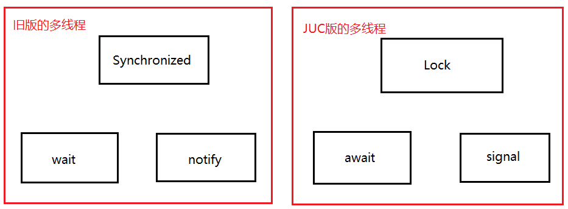

```java
public class B  {
    public static void main(String[] args) {
        Data2 data = new Data2();

        new Thread(()->{
            for (int i = 0; i < 10; i++) {
                try {
                    data.increment();
                } catch (InterruptedException e) {
                    e.printStackTrace();
                }
            }
        },"A").start();

        new Thread(()->{
            for (int i = 0; i < 10; i++) {
                try {
                    data.decrement();
                } catch (InterruptedException e) {
                    e.printStackTrace();
                }
            }
        },"B").start();

        new Thread(()->{
            for (int i = 0; i < 10; i++) {
                try {
                    data.increment();
                } catch (InterruptedException e) {
                    e.printStackTrace();
                }
            }
        },"C").start();

        new Thread(()->{
            for (int i = 0; i < 10; i++) {
                try {
                    data.decrement();
                } catch (InterruptedException e) {
                    e.printStackTrace();
                }
            }
        },"D").start();

    }
}

// 判断等待，业务，通知
class Data2{ // 数字 资源类

    private int number = 0;

    Lock lock = new ReentrantLock();
    Condition condition = lock.newCondition();

    //+1
    public void increment() throws InterruptedException {
        lock.lock();
        try {
            while (number!=0){  //0
                condition.await(); // 等待
            }
            number++;
            System.out.println(Thread.currentThread().getName()+"=>"+number);
            condition.signalAll(); // 通知其他线程，我+1完毕了
        } catch (Exception e) {
            e.printStackTrace();
        } finally {
            lock.unlock();
        }

    }

    //-1
    public synchronized void decrement() throws InterruptedException {
        lock.lock();
        try {
            while (number==0){ // 1
                condition.await(); // 等待
            }
            number--;
            System.out.println(Thread.currentThread().getName()+"=>"+number);
            condition.signalAll();  // 通知其他线程，我-1完毕了
        } catch (Exception e) {
            e.printStackTrace();
        } finally {
            lock.unlock();
        }
    }
}
```

### 2.2.3 Condition精准通知和唤醒

使用Condition可以实现精准通知和唤醒。

```java
/**
 * A 执行完调用B，B执行完调用C，C执行完调用A
 */
public class C {

    public static void main(String[] args) {
        Data3 data = new Data3();

        new Thread(()->{
            for (int i = 0; i <10 ; i++) {
                data.printA();
            }
        },"A").start();

        new Thread(()->{
            for (int i = 0; i <10 ; i++) {
                data.printB();
            }
        },"B").start();

        new Thread(()->{
            for (int i = 0; i <10 ; i++) {
                data.printC();
            }
        },"C").start();
    }
}

class Data3{ // 资源类 Lock

    private Lock lock = new ReentrantLock();
    private Condition condition1 = lock.newCondition();
    private Condition condition2 = lock.newCondition();
    private Condition condition3 = lock.newCondition();
    private int number = 1; // 1A  2B  3C

    public void printA(){
        lock.lock();
        try {
            // 业务，判断-> 执行-> 通知
            while (number!=1){
                // 等待
                condition1.await();
            }
            System.out.println(Thread.currentThread().getName()+"=>AAAAAAA");
            number = 2;
            condition2.signal(); // 唤醒，唤醒指定的人，B
        } catch (Exception e) {
            e.printStackTrace();
        } finally {
            lock.unlock();
        }
    }
    public void printB(){
        lock.lock();
        try {
            // 业务，判断-> 执行-> 通知
            while (number!=2){
                condition2.await();
            }
            System.out.println(Thread.currentThread().getName()+"=>BBBBBBBBB");
            number = 3;
            condition3.signal(); // 唤醒，唤醒指定的人，c
        } catch (Exception e) {
            e.printStackTrace();
        } finally {
            lock.unlock();
        }
    }
    public void printC(){
        lock.lock();
        try {
            // 业务，判断-> 执行-> 通知
            while (number!=3){
                condition3.await();
            }
            System.out.println(Thread.currentThread().getName()+"=>BBBBBBBBB");
            number = 1;
            condition1.signal(); // 唤醒，唤醒指定的人，A
        } catch (Exception e) {
            e.printStackTrace();
        } finally {
            lock.unlock();
        }
    }
}
```

### 2.2.4 锁的本质

synchronized 修饰方法：锁的是this对象（不唯一）。

static + synchronized 修饰方法：锁的是Class对象（唯一）。

### 2.2.5 集合类不安全

#### 2.2.5.1 CopyOnWriteArrayList

ArrayList：并发下`ArrayList`是不安全的，会抛出`java.util.ConcurrentModificationException`并发修改异常。解决方法有以下几种方式：

- 第1种解决方法：使用Vector代替ArrayList（Vector出现的比ArrayList早，那ArrayList存在的意义？）。

- 第2种解决方法：使用集合工具类`Collections.synchronizedList(List<T> list)`。
- 第3种解决方法：使用JUC下的CopyOnWriteArrayList类（CopyOnWrite写入时复制，简称COW，是计算机程序设计领域的一种优化策略，在写入的时候避免覆盖造成的数据问题）。CopyOnWriteArrayList使用Lock锁，效率更高；而Vector使用的是synchronized锁，效率低。

#### 2.2.5.2 CopyOnWriteArraySet

HashSet：并发下`HashSet`也是不安全的，会抛出`java.util.ConcurrentModificationException`并发修改异常。解决方法有以下几种方式：

- 第1种解决办法：使用集合工具类`Collections.synchronizedSet(Set<T> set)`。
- 第2种解决办法：使用JUC下的CopyOnWriteArraySet类（写入时复制）。

#### 2.2.5.3 ConcurrentHashMap

HashMap：并发下`HashMap`（**HashMap的加载因子与初始化容量？**）也是不安全的，会抛出`java.util.ConcurrentModificationException`并发修改异常。解决方法有以下几种方式：

- 第1种解决方法：使用集合工具类`Collections.synchronizedMap(Map<K,V> m) `。
- 第2种解决办法：使用JUC下的ConcurrentHashMap类（**ConcurrentHashMap的原理？**）。

### 2.2.6 Collable多线程

**Collable**：可以有返回值；可以抛出异常；call方法（类似于Runnable种的run方法）。

**注意事项**：

1. Collable的执行结果会被缓存。
2. 获取返回结果可能需要等待，从而会导致阻塞。

```java
public class CallableTest {
    public static void main(String[] args) throws ExecutionException, InterruptedException {
        // new Thread(new Runnable()).start();
        // new Thread(new FutureTask<V>()).start();
        // new Thread(new FutureTask<V>( Callable )).start();
        new Thread().start(); // 怎么启动Callable

        MyThread thread = new MyThread();
        FutureTask futureTask = new FutureTask(thread); // 适配类

        new Thread(futureTask,"A").start();
        new Thread(futureTask,"B").start(); // 结果会被缓存，效率高

        Integer o = (Integer) futureTask.get(); //这个get 方法可能会产生阻塞！把他放到最后；或者使用异步通信来处理！
        System.out.println(o);
    }
}

class MyThread implements Callable<Integer> {

    @Override
    public Integer call() {
        System.out.println("call()"); // 会打印几个call
        // 耗时的操作
        return 1024;
    }
}
```

### 2.2.7 常用辅助类

#### 2.2.7.1 CountDownLatch

**CountDownLatch（减法计数器，也称倒计时器）**：允许一个或多个线程等待直到在其他线程中执行的一组操作完成的同步辅助。

**原理**：每次有线程调用countDown方法，则数量减1；若计数器变为0，await方法就会被唤醒，继续执行。

1. countDownLatch.countDown()：数量-1；
2. countDownLatch.await()：等待计数器归0，然后再往下执行。

```java
// 计数器
public class CountDownLatchDemo {
    public static void main(String[] args) throws InterruptedException {
        // 总数是6，必须要执行任务的时候，再使用！
        CountDownLatch countDownLatch = new CountDownLatch(6);

        for (int i = 1; i <=6 ; i++) {
            new Thread(()->{
                System.out.println(Thread.currentThread().getName()+" Go out");
                countDownLatch.countDown(); // 数量-1
            },String.valueOf(i)).start();
        }

        countDownLatch.await(); // 等待计数器归零，然后再向下执行
        System.out.println("Close Door");
    }
}
```

#### 2.2.7.2 CyclicBarrier

**CyclicBarrier（加法计数器，也称栅栏）**：允许一组线程全部等待彼此达到共同屏障点的同步辅助。 循环阻塞在涉及固定大小的线程方的程序中很有用，这些线程必须偶尔等待彼此。 屏障被称为循环 ，因为它可以在等待的线程被释放之后重新使用。

```java
public class CyclicBarrierDemo {
    public static void main(String[] args) {
        /**
         * 集齐7颗龙珠召唤神龙
         */
        // 召唤龙珠的线程
        CyclicBarrier cyclicBarrier = new CyclicBarrier(8,()->{
            System.out.println("召唤神龙成功！");
        });

        for (int i = 1; i <=7 ; i++) {
            final int temp = i;
            // lambda能操作到 i 吗？不能，需要通过中间变量temp
            new Thread(()->{
                System.out.println(Thread.currentThread().getName()+"收集"+temp+"个龙珠");
                try {
                    cyclicBarrier.await(); // 等待
                } catch (InterruptedException e) {
                    e.printStackTrace();
                } catch (BrokenBarrierException e) {
                    e.printStackTrace();
                }
            }).start();
        }
    }
}
```

#### 2.2.7.3 Semaphore

**Semaphore（信号量，用于限流）**：一个计数信号量。 在概念上，信号量维持一组许可证。 如果有必要，每个acquire()都会阻塞，直到许可证可用，然后才能使用它。 每个release()添加许可证，潜在地释放阻塞获取方。 但是，没有使用实际的许可证对象；Semaphore只保留可用数量的计数，并相应地执行。 

**原理**：常用于多个共享资源的互斥（例如抢车位）。

1. semaphore.acquire()：获得，如果已经满了，等待被释放为止。
2. semaphore.release()：释放，会将当前的信号量释放+1，然后唤醒等待的线程。

```java
public class SemaphoreDemo {
    public static void main(String[] args) {
        // 线程数量：停车位! 限流！
        Semaphore semaphore = new Semaphore(3);

        for (int i = 1; i <=6 ; i++) {
            new Thread(()->{
                // acquire() 得到
                try {
                    semaphore.acquire();
                    System.out.println(Thread.currentThread().getName()+"抢到车位");
                    TimeUnit.SECONDS.sleep(2);
                    System.out.println(Thread.currentThread().getName()+"离开车位");
                } catch (InterruptedException e) {
                    e.printStackTrace();
                } finally {
                    semaphore.release(); // release() 释放
                }
            },String.valueOf(i)).start();
        }
    }
}
```

### 2.2.8 ReadWriteLock读写锁

**ReadWriteLock**：维护一对关联的locks，一个用于只读操作，一个用于写入操作。 read lock可以由多个阅读器线程同时进行，只要没有作者。 write lock是独家的。

**独占锁**：写锁。

**共享锁**：读锁。

```java
/**
 * 独占锁（写锁） 一次只能被一个线程占有
 * 共享锁（读锁） 多个线程可以同时占有
 * ReadWriteLock
 * 读-读  可以共存！
 * 读-写  不能共存！
 * 写-写  不能共存！
 */
public class ReadWriteLockDemo {
    public static void main(String[] args) {
        MyCache myCache = new MyCache();

        // 写入
        for (int i = 1; i <= 5 ; i++) {
            final int temp = i;
            new Thread(()->{
                myCache.put(temp+"",temp+"");
            },String.valueOf(i)).start();
        }

        // 读取
        for (int i = 1; i <= 5 ; i++) {
            final int temp = i;
            new Thread(()->{
                myCache.get(temp+"");
            },String.valueOf(i)).start();
        }

    }
}

// 加锁的
class MyCacheLock{

    private volatile Map<String,Object> map = new HashMap<>();
    // 读写锁： 更加细粒度的控制
    private ReadWriteLock readWriteLock = new ReentrantReadWriteLock();
    private Lock lock = new ReentrantLock();

    // 存，写入的时候，只希望同时只有一个线程写
    public void put(String key,Object value){
        readWriteLock.writeLock().lock();
        try {
            System.out.println(Thread.currentThread().getName()+"写入"+key);
            map.put(key,value);
            System.out.println(Thread.currentThread().getName()+"写入OK");
        } catch (Exception e) {
            e.printStackTrace();
        } finally {
            readWriteLock.writeLock().unlock();
        }
    }

    // 取，读，所有人都可以读！
    public void get(String key){
        readWriteLock.readLock().lock();
        try {
            System.out.println(Thread.currentThread().getName()+"读取"+key);
            Object o = map.get(key);
            System.out.println(Thread.currentThread().getName()+"读取OK");
        } catch (Exception e) {
            e.printStackTrace();
        } finally {
            readWriteLock.readLock().unlock();
        }
    }
}
```

### 2.2.9 阻塞队列

#### 2.2.9.1 BlockingQueue

**阻塞队列**：遵循FIFO。放入时若队列已满，则必须阻塞等待；取出时若队列是空的，则必须阻塞等待放入。

BlockingQueue（阻塞队列）的实现类：ArrayBlockingQueue（数组阻塞队列）、LinkedBlockingQueue（链表阻塞队列）、SynchronousQueue（同步阻塞队列）。

**阻塞队列的应用**：多线程并发处理、线程池。

**阻塞队列的四组API**：

|     方式     | 抛出异常 | 有返回值，不抛出异常 | 阻塞等待 | 超时等待  |
| :----------: | :------: | :------------------: | :------: | :-------: |
|     添加     |   add    |       offer()        |  put()   | offer(,,) |
|     移除     |  remove  |        poll()        |  take()  |  poll(,)  |
| 检测队首元素 | element  |         peek         |    -     |     -     |

1. 抛出异常。
2. 不会抛出异常。
3. 阻塞、一直等待。
4. 超时等待。

```java
public class Test {
    public static void main(String[] args) throws InterruptedException {
        test4();
    }
   
    public static void test1(){ // 抛出异常
        // 队列的大小
        ArrayBlockingQueue blockingQueue = new ArrayBlockingQueue<>(3);

        System.out.println(blockingQueue.add("a"));
        System.out.println(blockingQueue.add("b"));
        System.out.println(blockingQueue.add("c"));
        // IllegalStateException: Queue full 抛出异常！
        // System.out.println(blockingQueue.add("d"));

        System.out.println("=-===========");

        System.out.println(blockingQueue.element()); // 查看队首元素是谁
        System.out.println(blockingQueue.remove());


        System.out.println(blockingQueue.remove());
        System.out.println(blockingQueue.remove());

        // java.util.NoSuchElementException 抛出异常！
        // System.out.println(blockingQueue.remove());
    }

    public static void test2(){ // 有返回值，不会抛出异常
        // 队列的大小
        ArrayBlockingQueue blockingQueue = new ArrayBlockingQueue<>(3);

        System.out.println(blockingQueue.offer("a"));
        System.out.println(blockingQueue.offer("b"));
        System.out.println(blockingQueue.offer("c"));

        System.out.println(blockingQueue.peek());
        // System.out.println(blockingQueue.offer("d")); // false 不抛出异常！
        System.out.println("============================");
        System.out.println(blockingQueue.poll());
        System.out.println(blockingQueue.poll());
        System.out.println(blockingQueue.poll());
        System.out.println(blockingQueue.poll()); // null 不抛出异常！
    }

    public static void test3() throws InterruptedException { // 等待，阻塞（一直阻塞）
        // 队列的大小
        ArrayBlockingQueue blockingQueue = new ArrayBlockingQueue<>(3);

        // 一直阻塞
        blockingQueue.put("a");
        blockingQueue.put("b");
        blockingQueue.put("c");
        // blockingQueue.put("d"); // 队列没有位置了，一直阻塞
        System.out.println(blockingQueue.take());
        System.out.println(blockingQueue.take());
        System.out.println(blockingQueue.take());
        System.out.println(blockingQueue.take()); // 没有这个元素，一直阻塞

    }

    public static void test4() throws InterruptedException { // 等待，阻塞（等待超时）
        // 队列的大小
        ArrayBlockingQueue blockingQueue = new ArrayBlockingQueue<>(3);

        blockingQueue.offer("a");
        blockingQueue.offer("b");
        blockingQueue.offer("c");
        // blockingQueue.offer("d",2,TimeUnit.SECONDS); // 等待超过2秒就退出
        System.out.println("===============");
        System.out.println(blockingQueue.poll());
        System.out.println(blockingQueue.poll());
        System.out.println(blockingQueue.poll());
        blockingQueue.poll(2,TimeUnit.SECONDS); // 等待超过2秒就退出
    }
}
```

#### 2.2.9.2 SynchronousQueue

**SynchronousQueue队列**：同步队列，和其他BlockingQueue不一样，SynchronousQueue不存储元素，put了一个元素，必须从里面先take取出来，否则不能再put进去值。

```java
/**
 * 同步队列
 * 和其他的BlockingQueue 不一样， SynchronousQueue 不存储元素
 * put了一个元素，必须从里面先take取出来，否则不能再put进去值！
 */
public class SynchronousQueueDemo {
    public static void main(String[] args) {
        BlockingQueue<String> blockingQueue = new SynchronousQueue<>(); // 同步队列

        new Thread(()->{
            try {
                System.out.println(Thread.currentThread().getName()+" put 1");
                blockingQueue.put("1");
                System.out.println(Thread.currentThread().getName()+" put 2");
                blockingQueue.put("2");
                System.out.println(Thread.currentThread().getName()+" put 3");
                blockingQueue.put("3");
            } catch (InterruptedException e) {
                e.printStackTrace();
            }
        },"T1").start();


        new Thread(()->{
            try {
                TimeUnit.SECONDS.sleep(3);
                System.out.println(Thread.currentThread().getName()+"=>"+blockingQueue.take());
                TimeUnit.SECONDS.sleep(3);
                System.out.println(Thread.currentThread().getName()+"=>"+blockingQueue.take());
                TimeUnit.SECONDS.sleep(3);
                System.out.println(Thread.currentThread().getName()+"=>"+blockingQueue.take());
            } catch (InterruptedException e) {
                e.printStackTrace();
            }
        },"T2").start();
    }
}
```

### 2.2.10 线程池

线程池面试点**：三大方法、七大参数、四种拒绝策略**。

**池化技术**：事先准备好一些资源，有人要用，就来这里取，用完之后再还回来。池化技术的本质是优化资源的使用。例如：线程池、连接池、内存池、对象池...

**线程池的好处**：降低资源的消耗；提高响应速度；方便管理。（总结好处**：线程复用、可以控制最大并发数、管理线程**）

#### 2.2.10.1 三大方法

- Executors.newSingleThreadExecutor()：创建单个线程。
- Executors.newFixedThreadPool(5)：创建一个固定大小的线程池。
- Executors.newCachedThreadPool()：创建一个可伸缩的（遇强则强、遇弱则弱）线程池。

**阿里巴巴开发手册规定**：线程池不允许使用Executors去创建，而是通过ThreadPoolExecutor的方式，这样的处理方式让写的同学更加明确线程池的运行规则，规避资源耗尽的风险。

- FixedThreadPool和SingleThreadExecutor：允许的请求队列长度为Integer.MAX_VALUE，可能会堆积大量的请求，从而导致OOM。
- CachedThreadPool和ScheduledThreadPool：允许创建线程数量为Integer.MAX_VALUE，可能会创建大量的线程，从而导致OOM。

#### 2.2.10.2 七大参数

三大方法的本质均是调用ThreadPoolExecutor创建线程池，ThreadPoolExecutor的构造器有七大参数：

- int corePoolSize：核心线程的数量。
- int maximumPoolSize：最大核心线程池大小。

> **最大线程池大小如何设置？**：
>
> 1. 若是CPU密集型应用：最大线程数=CPU的核数。
>
> 2. 若是IO密集型应用：最大线程数>IO线程的数量（一般最大线程数取IO线程的2倍即可）。

- long keepAliveTime：超时了但没有人调用就会释放。
- TimeUnit unit ： 超时时间。
- BlockingQueue<Runnable> workQueue：阻塞队列。
- ThreadFactory threadFactory：线程工厂，创建线程的，一般不用动。
- RejectedExecutionHandler handler：拒绝策略。

#### 2.2.10.3 四种拒绝策略

- new ThreadPoolExecutor.AbortPolicy() ：银行满了，还有人进来，不处理这个人的，抛出异常。
-  new ThreadPoolExecutor.CallerRunsPolicy()：哪来的回哪去，不会抛出异常。
- new ThreadPoolExecutor.DiscardPolicy()：队列满了，丢掉任务，不会抛出异常。
- new ThreadPoolExecutor.DiscardOldestPolicy() ：队列满了，尝试去和最早的竞争（若竞争四百则丢掉任务），也不会抛出异常。

```java
/**
 * new ThreadPoolExecutor.AbortPolicy() // 银行满了，还有人进来，不处理这个人的，抛出异常
 * new ThreadPoolExecutor.CallerRunsPolicy() // 哪来的去哪里！
 * new ThreadPoolExecutor.DiscardPolicy() //队列满了，丢掉任务，不会抛出异常！
 * new ThreadPoolExecutor.DiscardOldestPolicy() //队列满了，尝试去和最早的竞争，也不会抛出异常！
 */
public class Demo01 {
    public static void main(String[] args) {
        // 自定义线程池！工作 ThreadPoolExecutor

        // 最大线程到底该如何定义
        // 1、CPU 密集型，几核，就是几，可以保持CPu的效率最高！
        // 2、IO  密集型   > 判断你程序中十分耗IO的线程，
        // 程序  15个大型任务  io十分占用资源！

        // 获取CPU的核数
        System.out.println(Runtime.getRuntime().availableProcessors());

        List  list = new ArrayList();

        ExecutorService threadPool = new ThreadPoolExecutor(
                2,
                Runtime.getRuntime().availableProcessors(), // 获取电脑的核数（最大线程数=CPU的核数）
                3,
                TimeUnit.SECONDS,
                new LinkedBlockingDeque<>(3),
                Executors.defaultThreadFactory(),
                new ThreadPoolExecutor.DiscardOldestPolicy());  //队列满了，尝试去和最早的竞争，也不会抛出异常！
        try {
            // 最大承载：Deque + max
            // 超过 RejectedExecutionException
            for (int i = 1; i <= 9; i++) {
                // 使用了线程池之后，使用线程池来创建线程
                threadPool.execute(()->{
                    System.out.println(Thread.currentThread().getName()+" ok");
                });
            }

        } catch (Exception e) {
            e.printStackTrace();
        } finally {
            // 线程池用完，程序结束，关闭线程池
            threadPool.shutdown();
        }

    }
}
```

### 2.2.11 四大函数式接口

需要重点掌握**：函数式接口、Lambda表达式、链式编程、Stream流式计算**。

**函数式接口**：只有一个方法的接口（主要用于简化编程模型，在新版本的框架底层大量应用）。**只要是函数式接口就可以用Lambda表达式简化**。

#### 2.2.11.1 Function

**Function函数式接口**：有一个输入参数，有一个输出参数。

```java
/**
 * Function 函数型接口, 有一个输入参数，有一个输出
 * 只要是函数型接口,就可以用Lambda表达式简化
 */
public class Demo01 {
    public static void main(String[] args) {
        //
//        Function<String,String> function = new Function<String,String>() {
//            @Override
//            public String apply(String str) {
//                return str;
//            }
//        };

        Function<String,String> function = str->{return str;};
        System.out.println(function.apply("asd"));
    }
}
```

#### 2.2.11.2 Predicate

**Predicate断定式接口**：有一个输入参数，返回一个boolean类型。

```java
/**
 * 断定型接口：有一个输入参数，返回值只能是 布尔值！
 */
public class Demo02 {
    public static void main(String[] args) {
        // 判断字符串是否为空
//        Predicate<String> predicate = new Predicate<String>(){
////            @Override
////            public boolean test(String str) {
////                return str.isEmpty();
////            }
////        };

        Predicate<String> predicate = (str)->{return str.isEmpty(); };
        System.out.println(predicate.test(""));
    }
}
```

#### 2.2.11.3 Consumer

**Consumer消费型接口**：只有输入，没有返回值。

```java
/**
 * Consumer 消费型接口: 只有输入，没有返回值
 */
public class Demo03 {
    public static void main(String[] args) {
//        Consumer<String> consumer = new Consumer<String>() {
//            @Override
//            public void accept(String str) {
//                System.out.println(str);
//            }
//        };
        Consumer<String> consumer = (str)->{System.out.println(str);};
        consumer.accept("sdadasd");
    }
}
```

#### 2.2.11.4 Supplier

**Supplier供给型接口**：没有输入，只有返回值。

```java
/**
 * Supplier 供给型接口 没有参数，只有返回值
 */
public class Demo04 {
    public static void main(String[] args) {
//        Supplier supplier = new Supplier<Integer>() {
//            @Override
//            public Integer get() {
//                System.out.println("get()");
//                return 1024;
//            }
//        };

        Supplier supplier = ()->{ return 1024; };
        System.out.println(supplier.get());
    }
}
```

### 2.2.12 Stream流式计算

大数据：存储 + 计算。集合、MySQL本质是存储，计算都应该交给流来操作。

```java
/**
 * 题目要求：一分钟内完成此题，只能用一行代码实现！
 * 现在有5个用户！筛选：
 * 1、ID 必须是偶数
 * 2、年龄必须大于23岁
 * 3、用户名转为大写字母
 * 4、用户名字母倒着排序
 * 5、只输出一个用户！
 */
public class Test {
    public static void main(String[] args) {
        User u1 = new User(1,"a",21);
        User u2 = new User(2,"b",22);
        User u3 = new User(3,"c",23);
        User u4 = new User(4,"d",24);
        User u5 = new User(6,"e",25);
        // 集合就是存储
        List<User> list = Arrays.asList(u1, u2, u3, u4, u5);

        // 计算交给Stream流
        // lambda表达式、链式编程、函数式接口、Stream流式计算
        list.stream()
                .filter(u->{return u.getId()%2==0;})
                .filter(u->{return u.getAge()>23;})
                .map(u->{return u.getName().toUpperCase();})
                .sorted((uu1,uu2)->{return uu2.compareTo(uu1);})
                .limit(1)
                .forEach(System.out::println);
    }
}
```

### 2.2.13 ForkJoin

**ForkJoin**： ForkJoin在jdk1.7中引入的，并行执行任务，提高效率。

**ForkJoin特点**：工作窃取。原因是底层是采用**双端队列**实现的。（**ForkJoin的具体使用？Stream并行流的具体使用？**）

```java
/**
 * 求和计算的任务！
 * 3000   6000（ForkJoin）  9000（Stream并行流）
 * // 如何使用 forkjoin
 * // 1、forkjoinPool 通过它来执行
 * // 2、计算任务 forkjoinPool.execute(ForkJoinTask task)
 * // 3. 计算类要继承 ForkJoinTask
 */
public class ForkJoinDemo extends RecursiveTask<Long> {

    private Long start;  // 1
    private Long end;    // 1990900000

    // 临界值
    private Long temp = 10000L;

    public ForkJoinDemo(Long start, Long end) {
        this.start = start;
        this.end = end;
    }

    // 计算方法
    @Override
    protected Long compute() {
        if ((end-start)<temp){
            Long sum = 0L;
            for (Long i = start; i <= end; i++) {
                sum += i;
            }
            return sum;
        }else { // forkjoin 递归
            long middle = (start + end) / 2; // 中间值
            ForkJoinDemo task1 = new ForkJoinDemo(start, middle);
            task1.fork(); // 拆分任务，把任务压入线程队列
            ForkJoinDemo task2 = new ForkJoinDemo(middle+1, end);
            task2.fork(); // 拆分任务，把任务压入线程队列

            return task1.join() + task2.join();
        }
    }
}

// 比较几种不同方法的计算速度
public class Test {
    public static void main(String[] args) throws ExecutionException, InterruptedException {
        // test1(); // 12224ms
        // test2(); // 10038ms
        // test3(); // 153ms
    }

    // 普通程序员
    public static void test1(){
        Long sum = 0L;
        long start = System.currentTimeMillis();
        for (Long i = 1L; i <= 10_0000_0000; i++) {
            sum += i;
        }
        long end = System.currentTimeMillis();
        System.out.println("sum="+sum+" 时间："+(end-start));
    }

    // 会使用ForkJoin
    public static void test2() throws ExecutionException, InterruptedException {
        long start = System.currentTimeMillis();

        ForkJoinPool forkJoinPool = new ForkJoinPool();
        ForkJoinTask<Long> task = new ForkJoinDemo(0L, 10_0000_0000L);
        ForkJoinTask<Long> submit = forkJoinPool.submit(task);// 提交任务
        Long sum = submit.get();

        long end = System.currentTimeMillis();
        System.out.println("sum="+sum+" 时间："+(end-start));
    }

    public static void test3(){
        long start = System.currentTimeMillis();
        // Stream并行流 ()  (]
        long sum = LongStream.rangeClosed(0L, 10_0000_0000L).parallel().reduce(0, Long::sum);
        long end = System.currentTimeMillis();
        System.out.println("sum="+"时间："+(end-start));
    }
}
```

### 2.2.14 异步回调

**Future的设计初衷**：对将来的某个事件的结果进行建模。**使用Future的实现类CompletableFuture可以实现异步调用**。

```java
/**
 * 异步调用： CompletableFuture
 * // 异步执行
 * // 成功回调
 * // 失败回调
 */
public class Demo01 {
    public static void main(String[] args) throws ExecutionException, InterruptedException {
        // 没有返回值的 runAsync 异步回调
//        CompletableFuture<Void> completableFuture = CompletableFuture.runAsync(()->{
//            try {
//                TimeUnit.SECONDS.sleep(2);
//            } catch (InterruptedException e) {
//                e.printStackTrace();
//            }
//            System.out.println(Thread.currentThread().getName()+"runAsync=>Void");
//        });
//
//        System.out.println("1111");
//
//        completableFuture.get(); // 获取阻塞执行结果

        // 有返回值的 supplyAsync 异步回调
        // ajax，成功和失败的回调
        // 返回的是错误信息；
        CompletableFuture<Integer> completableFuture = CompletableFuture.supplyAsync(()->{
            System.out.println(Thread.currentThread().getName()+"supplyAsync=>Integer");
            int i = 10/0;
            return 1024;
        });

        System.out.println(completableFuture.whenComplete((t, u) -> {
            System.out.println("t=>" + t); // 正常的返回结果
            System.out.println("u=>" + u); // 错误信息：java.util.concurrent.CompletionException: java.lang.ArithmeticException: / by zero
        }).exceptionally((e) -> {
            System.out.println(e.getMessage());
            return 233; // 可以获取到错误的返回结果
        }).get());
    }
}
```

### 2.2.15 JMM

**JMM**： Java Memory Model，Java内存模型。

**关于JMM的一些同步的约定**：

1. 线程解锁前，必须把共享变量立刻刷回主存。
2. 线程加锁前，必须读取主存中的最新值到工作内存中。
3. 加锁和解锁是同一把锁。

**线程的工作内存与主内存之间有8种操作**：

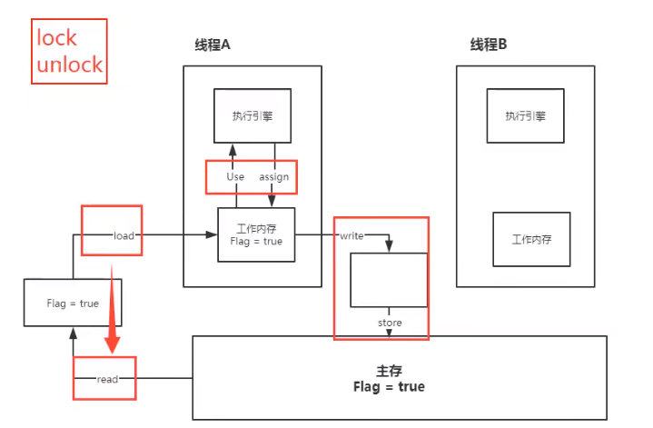

1. lock（锁定）：作用于主内存的变量，把一个变量标识为线程独占状态。
2. unlock（解锁）：作用于主内存的变量，它把一个处于锁定状态的变量释放出来，释放后的变量才可以被其他线程锁定。
3. read（读取）：作用于主内存变量，它把一个变量的值从主内存传输到线程的工作内存中，以便随后的load动作使用。
4. load（载入）：作用于工作内存的变量，它把read操作从主存中变量放入工作内存中。
5. use（使用）：作用于工作内存中的变量，它把工作内存中的变量传输给执行引擎，每当虚拟机遇到一个需要使用到变量的值，就会使用到这个指令。
6. assign（赋值）：作用于工作内存中的变量，它把一个从执行引擎中接受到的值放入工作内存的变量副本中。
7. store（存储）：作用于主内存中的变量，它把一个从工作内存中一个变量的值传送到主内存中，以便后续的write使用。
8. write（写入）：作用于主内存中的变量，它把store操作从工作内存中得到的变量的值放入主内存的变量中。

**JMM对这八种指令的使用，制定了如下规则**：

1. 不允许read和load、store和write操作之一单独出现。即使用了read必须load，使用了store必须write。
2. 不允许线程丢弃他最近的assign操作，即工作变量的数据改变了之后，必须告知主存。
3. 不允许一个线程将没有assign的数据从工作内存同步回主内存。
4. 一个新的变量必须在主内存中诞生，不允许工作内存直接使用一个未被初始化的变量。就是怼变量实施use、store操作之前，必须经过assign和load操作。
5. 一个变量同一时间只有一个线程能对其进行lock。多次lock后，必须执行相同次数的unlock才能解锁。
6. 如果对一个变量进行lock操作，会清空所有工作内存中此变量的值，在执行引擎使用这个变量前，必须重新load或assign操作初始化变量的值。
7. 如果一个变量没有被lock，就不能对其进行unlock操作。也不能unlock一个被其他线程锁住的变量。
8. 对一个变量进行unlock操作之前，必须把此变量同步回主内存。

**针对多个线程修改共享变量的情况**：若不引入volatile，会出现问题。（**引出下节的volatile可以解决这一问题**）

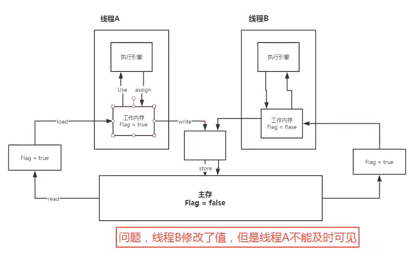

### 2.2.16 volatile

**volatile**：是java虚拟机提供的轻量级的同步机制。有如下三大特性：

1. **保证可见性**。

```java
public class JMMDemo {
    // 不加volatile程序就会死循环
    // 加volatile可以保证可见性
    private volatile static int num = 0;

    public static void main(String[] args) { // main

        new Thread(()->{ // 线程 1 对主内存的变化不知道的
            while (num==0){

            }
        }).start();

        try {
            TimeUnit.SECONDS.sleep(1);
        } catch (InterruptedException e) {
            e.printStackTrace();
        }

        num = 1;
        System.out.println(num);
    }
}
```

2. **不保证原子性**（原子性即不可分割，表示线程在执行任务的时候，不能被打扰，也不能被分割，要么同时成功，要么同时失败）。

   （**数据库里的ACID四大原则？**）

   **如果不加lock和synchronized，怎么保证原子性？**使用原子类可以保证原子性。原子类的底层直接和操作系统挂钩，会直接在内存中修改值（Unsafe类是一个很特殊的存在）。

   **那为什么原子类可以保证原子性？**原子类的底层用的CAS，详见`2.2.18`节。

```java
// volatile 不保证原子性
public class VDemo02 {
    // volatile 不保证原子性
    // 原子类的 Integer
    private volatile static AtomicInteger num = new AtomicInteger();
    public static void add(){
        // num++; // 不是一个原子性操作
        num.getAndIncrement(); // AtomicInteger + 1 方法， CAS
    }

    public static void main(String[] args) {
        //理论上num结果应该为 2 万
        for (int i = 1; i <= 20; i++) {
            new Thread(()->{
                for (int j = 0; j < 1000 ; j++) {
                    add();
                }
            }).start();
        }

        while (Thread.activeCount()>2){ // main  gc
            Thread.yield();
        }

        System.out.println(Thread.currentThread().getName() + " " + num);
    }
}
```

3. **禁止指令重排**。

**什么是指令重排？**你写的程序，计算机并不是按照你写的那样去执行的。

**源代码到程序的过程**：源代码-->编译器优化的重排-->指令并行也可能重排-->内存系统也会重排-->执行。

**处理器在进行指令重排的时候，会考虑数据之间的依赖性，这在多线程情况下会出现问题（例如：A线程没有出现数据依赖，B线程也没有出现数据依赖，但B线程的指令重排后的结果对线程出现了依赖，就可能会出现问题）。**

举个例子：a、b、x、y默认值都是0

| 线程A | 线程B |
| ----- | ----- |
| x=a   | y=b   |
| b=1   | a=2   |

正常的结果：x = 0; y = 0; 但是可能由于指令重排：

| 线程A | 线程B |
| ----- | ----- |
| b=1   | a=2   |
| x=a   | y=b   |

指令重排导致的诡异结果：x = 2; y = 1; **volatile关键字就可以避免指令重排**。

**那为什么volatile可以避免指令重排呢？**添加volatile之后，在volatile写的时候，会在指令前后添加内存屏障，以禁止上下指令之间的交换。

普通读-->普通写-->内存屏障（禁止上下指令顺序交换）-->volatile写-->内存屏障（禁止上下指令顺序交换）。

**那volatile在那里应用最多呢？**在单例模式的饿汉模式使用最多。

### 2.2.17 单例模式

1. 饿汉模式：详见`1.1`节。
2. 懒汉模式：详见`1.1`节。（双重检测 + volatile，简称DCL模式）
3. 静态内部类：详见`1.1`节。

**注意**：饿汉模式、懒汉模式及静态内部类都是不安全的，使用**反射**可以破解这种单例模式。

```java
// 例子1：使用反射破坏原有的单例模式（饿汉/懒汉模式）
public static void main(String[] args) throws Exception {
	LazyMan instance = LazyMan.getInstance();

	Constructor<LazyMan> declaredConstructor = LazyMan.class.getDeclaredConstructor(null);
	declaredConstructor.setAccessible(true);
	LazyMan instance2 = declaredConstructor.newInstance();

	System.out.println(instance);
	System.out.println(instance2); // 输出instance与instance2不相等（反射可以破坏单例）
}


// 例子2：升级为三重判断，依然可以使用反射破坏单例模式
public class LazyMan {

    private LazyMan(){
        synchronized (LazyMan.class){
            if (lazyMan!=null){ // 使用三重判断
                throw new RuntimeException("不要试图使用反射破坏异常");
            }
        }
    }

    private volatile static LazyMan lazyMan;

    // 双重检测锁模式的 懒汉式单例  DCL懒汉式
    public static LazyMan getInstance(){
        if (lazyMan==null){
            synchronized (LazyMan.class){
                if (lazyMan==null){
                    lazyMan = new LazyMan(); // 不是一个原子性操作
                }
            }
        }
        return lazyMan;
    }

    // 反射！
    public static void main(String[] args) throws Exception {
        Constructor<LazyMan> declaredConstructor = LazyMan.class.getDeclaredConstructor(null);
        declaredConstructor.setAccessible(true);
        LazyMan instance = declaredConstructor.newInstance();
        LazyMan instance2 = declaredConstructor.newInstance();
        System.out.println(instance);
        System.out.println(instance2); // 输出instance2依然不等于instance
    }
}

// 例子3：使用红绿灯模式，通过反射依然可以破坏单例模式
public class LazyMan {

    private static boolean qinjiang = false;

    private LazyMan(){
        synchronized (LazyMan.class){
            if (qinjiang == false){
                qinjiang = true;
            }else {
                throw new RuntimeException("不要试图使用反射破坏异常");
            }
        }
    }

    private volatile static LazyMan lazyMan;

    // 双重检测锁模式的 懒汉式单例  DCL懒汉式
    public static LazyMan getInstance(){
        if (lazyMan==null){
            synchronized (LazyMan.class){
                if (lazyMan==null){
                    lazyMan = new LazyMan(); // 不是一个原子性操作
                }
            }
        }
        return lazyMan;
    }

    // 反射！
    public static void main(String[] args) throws Exception {

        Field qinjiang = LazyMan.class.getDeclaredField("qinjiang");
        qinjiang.setAccessible(true);

        Constructor<LazyMan> declaredConstructor = LazyMan.class.getDeclaredConstructor(null);
        declaredConstructor.setAccessible(true);
        LazyMan instance = declaredConstructor.newInstance();

        qinjiang.set(instance,false);

        LazyMan instance2 = declaredConstructor.newInstance();

        System.out.println(instance);
        System.out.println(instance2); // 输出instance2依然不等于instance
    }
}

// 例子4: 使用枚举（反射不会破坏枚举）单例模式，这种情况下才不可以被破坏
public enum EnumSingle {

    INSTANCE;

    public EnumSingle getInstance(){
        return INSTANCE;
    }

}

class Test{
    public static void main(String[] args) throws NoSuchMethodException, IllegalAccessException, InvocationTargetException, InstantiationException {
        EnumSingle instance1 = EnumSingle.INSTANCE;
        Constructor<EnumSingle> declaredConstructor = EnumSingle.class.getDeclaredConstructor(String.class,int.class);
        declaredConstructor.setAccessible(true);
        EnumSingle instance2 = declaredConstructor.newInstance();

        // NoSuchMethodException: com.progzc.single.EnumSingle.<init>()
        System.out.println(instance1);
        System.out.println(instance2);
    }
}
```

### 2.2.18 深入理解CAS

**CAS**： Compare and Swap，即比较再交换。比较当前工作中的值和主内存中的值，如果这个值是期望的，那么则执行操作；如果不是则一直循环（底层是自旋锁）。

**CAS原理**：CAS底层使用`Unsafe`的本地方法（C语言）去操作内存（保证了很高的效率），操作的底层采用了自旋锁。

**CAS缺点**：

1. 循环会耗事。
2. 一次性只能保证一个共享变量的原子性。
3. ABA问题。

### 2.2.19 原子引用解决ABA问题

**什么是ABA问题？**

**解决ABA问题**：引入待版本号的原子引用，对应的思想是乐观锁。

```java
public class CASDemo {
    //AtomicStampedReference 注意，如果泛型是一个包装类，注意对象的引用问题
    // 正常在业务操作，这里面比较的都是一个个对象
    static AtomicStampedReference<Integer> atomicStampedReference = new AtomicStampedReference<>(1,1);
    // CAS  compareAndSet : 比较并交换！
    public static void main(String[] args) {
        new Thread(()->{
            int stamp = atomicStampedReference.getStamp(); // 获得版本号
            System.out.println("a1=>"+stamp);
            try {
                TimeUnit.SECONDS.sleep(1);
            } catch (InterruptedException e) {
                e.printStackTrace();
            }

            Lock lock = new ReentrantLock(true);

            atomicStampedReference.compareAndSet(1, 2,
                    atomicStampedReference.getStamp(), atomicStampedReference.getStamp() + 1);
            System.out.println("a2=>"+atomicStampedReference.getStamp());
            
            System.out.println(atomicStampedReference.compareAndSet(2, 1,
                    atomicStampedReference.getStamp(), atomicStampedReference.getStamp() + 1));
            System.out.println("a3=>"+atomicStampedReference.getStamp());
        },"a").start();

        // 乐观锁的原理相同！
        new Thread(()->{
            int stamp = atomicStampedReference.getStamp(); // 获得版本号
            System.out.println("b1=>"+stamp);
            try {
                TimeUnit.SECONDS.sleep(2);
            } catch (InterruptedException e) {
                e.printStackTrace();
            }
            System.out.println(atomicStampedReference.compareAndSet(1, 6, stamp, stamp + 1));
            System.out.println("b2=>"+atomicStampedReference.getStamp());
        },"b").start();
    }
}
```

**注意事项**：Integer使用了对象缓存机制，默认范围是-128~127，推荐使用静态工厂方法valueOf获取对象实例，而不是New，因为valueOf使用缓存，而New一定会创建新的对象，分配新的内存空间。

**阿里巴巴开发手册**：所有相同类型的包装类对象之间值得比较，全部使用equals方法比较。这是因为：对于Integer var = ? 在-128~127之间的赋值，Integer对象是在IntegerCache.cache产生，会复用已有对象，这个区间内的Integer值可以直接使用==进行判断，但是这个区间之外的所有数据，都会在堆上产生，并不会复用已有对象。**这是一个大坑，推荐使用equals方法进行判断。**

### 2.2.20 各种锁的理解

#### 2.2.20.1 公平锁/非公平锁

**公平锁**：不能插队，必须先来后到。

**非公平锁**：可以插队（默认都是非公平锁）。

```java
public ReentrantLock() { // 默认都是非公平锁
	sync = new NonfairSync();
}

public ReentrantLock(boolean fair) {
	sync = fair ? new FairSync() : new NonfairSync();
}

// 例子：非公平锁
public class FairLocked implements Runnable {
	private int seatNumber = 100;
	// 公平锁实现 ReentrantLock构造方法中设置为true:代表公平锁
	// 设置为false：代表非公平锁 默认也是非公平锁
	private ReentrantLock lock = new ReentrantLock(); 
	@Override
	public void run() {
		while (true) {
			try {
				lock.lock();
				if (seatNumber > 0) {
					Thread.sleep(100);
					--seatNumber;
					System.out.println(Thread.currentThread().getName() + "占用1个座位，还剩余 " + seatNumber + "个座位");
				} else {
					System.out.println(Thread.currentThread().getName() + ":不好意思，票卖完了！");
					break;
				}
			} catch (InterruptedException e) {
				e.printStackTrace();
			} finally {
				lock.unlock();
			}
		}
	}
 
	public static void main(String[] args) {
		FairLocked rlbr = new FairLocked();
		Thread t1 = new Thread(rlbr, "A窗口");
		Thread t2 = new Thread(rlbr, "B窗口");
		t1.start();
		t2.start();
	}
}
```

#### 2.2.20.2 可重入锁

**可重入锁**：可以理解为递归锁（拿到了外面的锁，才能获取里面的锁）。

Synchronized版的可重入锁：

```java
// Synchronized
public class Demo01 {
    public static void main(String[] args) {
        Phone phone = new Phone();

        new Thread(()->{
            phone.sms();
        },"A").start();

        new Thread(()->{
            phone.sms();
        },"B").start(); // 先输出A的sms和call，再输出B的sms和call
    }
}

class Phone{
    public synchronized void sms(){
        System.out.println(Thread.currentThread().getName() + "sms");
        call(); // 这里也有锁
    }
    public synchronized void call(){
        System.out.println(Thread.currentThread().getName() + "call");
    }
}
```

Lock版的可重入锁：

```java
public class Demo02 {
    public static void main(String[] args) {
        Phone2 phone = new Phone2();

        new Thread(()->{
            phone.sms();
        },"A").start();

        new Thread(()->{
            phone.sms();
        },"B").start();
    }
}

class Phone2{
    Lock lock = new ReentrantLock();

    public void sms(){
        lock.lock(); // 细节问题：lock.lock(); lock.unlock(); // lock 锁必须配对，否则就会死在里面
        lock.lock();
        try {
            System.out.println(Thread.currentThread().getName() + "sms");
            call(); // 这里也有锁
        } catch (Exception e) {
            e.printStackTrace();
        } finally {
            lock.unlock();
            lock.unlock();
        }
    }

    public void call(){
        lock.lock();
        try {
            System.out.println(Thread.currentThread().getName() + "call");
        } catch (Exception e) {
            e.printStackTrace();
        } finally {
            lock.unlock();
        }
    }
}
```

#### 2.2.20.3 自旋锁

**自旋锁**：加锁后陷入无限循环。自旋锁是计算机科学用于多线程同步的一种锁，线程反复检查锁变量是否可用。由于线程在这一过程中保持执行，因此是一种忙等待。

```java
// 利用CAS实现自定义自旋锁
public class SpinlockDemo {
    // int   0
    // Thread  null
    AtomicReference<Thread> atomicReference = new AtomicReference<>();
    
    public void myLock(){ // 加锁
        Thread thread = Thread.currentThread();
        System.out.println(Thread.currentThread().getName() + "==> mylock");
        
        while (!atomicReference.compareAndSet(null,thread)) { // 自旋锁
        }
    }
    
    public void myUnLock(){ // 解锁
        Thread thread = Thread.currentThread();
        System.out.println(Thread.currentThread().getName() + "==> myUnlock");
        atomicReference.compareAndSet(thread,null);
    }
}

// 测试自旋锁
public class TestSpinLock {
    public static void main(String[] args) throws InterruptedException {

        // 底层使用的自旋锁CAS
        SpinlockDemo lock = new SpinlockDemo();

        new Thread(()-> {
            lock.myLock();
            try {
                TimeUnit.SECONDS.sleep(5);
            } catch (Exception e) {
                e.printStackTrace();
            } finally {
                lock.myUnLock();
            }
        },"T1").start();

        TimeUnit.SECONDS.sleep(1);

        new Thread(()-> {
            lock.myLock();
            try {
                TimeUnit.SECONDS.sleep(1);
            } catch (Exception e) {
                e.printStackTrace();
            } finally {
                lock.myUnLock();
            }
        },"T2").start();
    }
}
```

#### 2.2.20.4 死锁

**死锁的例子**：

```java
public class DeadLockDemo {
    public static void main(String[] args) {

        String lockA = "lockA";
        String lockB = "lockB";

        new Thread(new MyThread(lockA, lockB), "T1").start();
        new Thread(new MyThread(lockB, lockA), "T2").start();

    }
}


class MyThread implements Runnable{
    private String lockA;
    private String lockB;
    
    public MyThread(String lockA, String lockB) {
        this.lockA = lockA;
        this.lockB = lockB;
    }

    @Override
    public void run() {
        synchronized (lockA){
            System.out.println(Thread.currentThread().getName() + "lock:"+lockA+"=>get"+lockB);

            try {
                TimeUnit.SECONDS.sleep(2);
            } catch (InterruptedException e) {
                e.printStackTrace();
            }
            
            synchronized (lockB){
                System.out.println(Thread.currentThread().getName() + "lock:"+lockB+"=>get"+lockA);
            }
        }
    }
}
```

**怎么排查解决死锁？**

1. 第一步：使用jps定位进程号（使用命令`jps -l`）。
2. 第二步：使用jstack查看进程信息（使用命令`jstack 进程号`）

**面试中问怎么排除问题？**

1. 查看日志。
2. 查看堆栈信息。（这样比较专业）

### 2.2.21 关于中断

结束线程的方法：

1. Thread类的`public final void stop()`方法，但这个方法被标记为了过时，简单的说，我们不应该使用它，可以忽略它。

2. 使用中断机制：中断并不是强迫终止一个线程，它是一种协作机制，是给线程传递一个取消信号，但是由线程来决定如何以及何时退出。

   - Thread类的`public boolean isInterrupted()`方法
     - 属于实例方法，需要通过线程对象调用。
     - 返回对应线程的中断标志位是否为true。
   - Thread类的`public void interrupt()`方法
     - 属于实例方法，需要通过线程对象调用。
     - 调用该方法的线程的状态将被置为"中断"状态。注意：线程中断仅仅是设置线程的中断状态位，不会停止线程。需要用户自己去监视线程的状态为并做处理。支持线程中断的方法（也就是线程中断后会抛出InterruptedException的方法，比如这里的sleep，以及Object.wait等方法）就是在监视线程的中断状态，一旦线程的中断状态被置为"中断状态"，就会抛出中断异常。

   - Thread类的`public static boolean interrupted()`方法
     - 属于静态方法，实际会调用Thread.currentThread()操作当前线程。
     - 返回当前线程的中断标志位是否为true，但它还有一个重要的副作用，就是清空中断标志位，也就是说，连续两次调用interrupted()，第一次返回的结果为true，第二次一般就是false (除非同时又发生了一次中断)。

   ```java
   public class Interrupt  {
       public static void main(String[] args) throws Exception {
           Thread t = new Thread(new Worker());
           t.start();
           
           Thread.sleep(200);
           t.interrupt();
           
           System.out.println("Main thread stopped.");
       }
       
       public static class Worker implements Runnable {
           public void run() {
               System.out.println("Worker started.");
               
               try {
                   Thread.sleep(500);
               } catch (InterruptedException e) {
                   Thread curr = Thread.currentThread();
                   //再次调用interrupt方法中断自己，将中断状态设置为“中断”
                   curr.interrupt();
                   System.out.println("Worker IsInterrupted: " + curr.isInterrupted());
                   System.out.println("Worker IsInterrupted: " + curr.isInterrupted());
                   System.out.println("Static Call: " + Thread.interrupted());//clear status
                   System.out.println("---------After Interrupt Status Cleared----------");
                   System.out.println("Static Call: " + Thread.interrupted());
                   System.out.println("Worker IsInterrupted: " + curr.isInterrupted());
                   System.out.println("Worker IsInterrupted: " + curr.isInterrupted());
               }
               
               System.out.println("Worker stopped.");
           }
       }
   }
   // 输出
   Worker started.
   Main thread stopped.
   Worker IsInterrupted: true
   Worker IsInterrupted: true
   Static Call: true
   ---------After Interrupt Status Cleared----------
   Static Call: false
   Worker IsInterrupted: false
   Worker IsInterrupted: false
   Worker stopped.
   ```

   

   

> [B站多线程教程](https://www.bilibili.com/video/BV1B7411L7tE)、[线程的六种状态及切换](https://blog.csdn.net/qq_22771739/article/details/82529874)、[volatile关键字](https://www.cnblogs.com/zhengbin/p/5654805.html#_label0)、[transient关键字](https://baijiahao.baidu.com/s?id=1636557218432721275&wfr=spider&for=pc)、[B站并发编程](https://www.bilibili.com/video/BV1B7411L7tE)、[Java内存模型](https://www.cnblogs.com/null-qige/p/9481900.html)、[CAS](https://blog.csdn.net/v123411739/article/details/79561458)、[周明志-深入理解JAVA虚拟机]()、**[中断线程的几种方法对比](https://www.cnblogs.com/Hermioner/p/9860511.html)**

## 2.3 并发编程实战

### 2.3.1 概述

**操作系统的作用**：

1. 为各个独立的进程分配资源，如内存、文件句柄、安全证书等。
2. 在进程中通过一些通信机制来交换数据，如套接字、信号处理器、共享内存、信号量、文件等。

**并发的作用**：

1. 提高系统的**资源利用率**。
2. **公平性**。使不同的用户和程序对计算机上的资源有着同等的使用权。
3. **便利性**。可以使用多个程序来执行一个任务。

**线程与进程**：

1. 线程是轻量级的进程。
2. 线程会共享进程范围内的资源（如内存句柄、文件句柄），但是每个线程都有各自的程序计数器、栈以及局部变量。

**线程的优势**：

1. 发挥多核处理器的强大能力。
2. 建模的简单性。
3. 异步事件的简化处理。
4. 响应更灵敏的用户界面。

**线程带来的风险**：

1. 安全性问题（"永远不发生糟糕的事情"）：如自增不是一个原子性操作（读/自增/写）。

   竞态条件是一种常见的并发安全问题，可以采用同步机制（synchronized）来解决。

2. 活跃性问题（"某件正确的事情最终会发生"）：如死锁、饥饿、活锁问题。

3. 性能问题：上下文切换带来的系统开销。

总结：线程无处不在：JVM、各种框架（框架通过在框架线程中调用应用程序代码将并发性引入到程序中）。

### 2.3.2 线程安全性

#### 2.3.2.1 线程安全性

**共享**：变量可以由多个线程同时访问。

**可变**：变量的值在其生命周期内可以发生变化。

当多个线程访问同一个可变的状态变量时没有使用合适的同步，那么程序可能会出现错误，解决方法有三种：

1. 不在线程之间共享该状态变量。
2. 将状态变量修改为不可变的变量。
3. 在访问状态变量时使用同步。

**线程安全性**：

1. 当多个线程访问某个类时，这个类始终都能表现出正确的行为，那么就称这个类是线程安装的。
2. 无状态对象一定是线程安全的。

#### 2.3.2.2 原子性

**竞态条件**：在并发编程中，由于不恰当的执行时序而出现不正确的结果。当某个计算的正确性取决于多个线程的交替执行时序时，就会发生竞态条件。竞态条件的本质是基于一种可能失效的观察结果来做出判断或执行某个计算。

- "先检查后执行"的一种常见情况就是延迟初始化（例如单例模式），延迟初始化中包含一个竞态条件。
- 要避免竞态条件，就必须在某个线程修改该变量时，通过某种方式防止其他线程使用这个变量。

**原子操作**：对于访问同一个状态的所有操作（包括该操作本身）来说，这个操作是一个以原子方式执行的操作。

**复合操作**：包含了**一组**必须以原子方式执行的操作，如"先检查后执行"、"读取-修改-写入"（如自增）都是复合操作。

**将复合操作变成线程安全的方法**：

1. 使用`java.util.concurrent.atomic`包下的原子变量类（线程安全状态变量，如AtomicLong），这些原子变量类用于实现在数值和对象引用上的原子状态转换（如AtomicLong的incrementAndGet方法是一种原子操作的自增）。在实际情况中，应尽可能地使用现有的线程安全对象（如AtomicLong）来管理类的状态。
2. 在方法上加锁。
3. 使用不可变对象。

#### 2.3.2.3 加锁机制

**为什么要加锁解决线程安全问题，难道使用原子变量类不行吗？**

当在不变性条件中涉及多个变量时，各个变量之间并不是彼此独立的，而是某个变量的值会对其他变量的值产生约束。因此，当更新某一个变量时，需要在同一个原子操作中对其他变量同时进行更新。这个时候锁登场了。

**内置锁**：同步代码块（Synchronized Block）。同步代码块由两部分组成：锁的对象引用+锁保护的代码块。

- 若以关键字Synchronized修饰普通方法，则该同步代码块的锁就是方法调用所在对象。
- 若以关键字Synchronized修饰静态方法，则该同步代码块的锁就是Class对象。
- 每个java对象都可以当作锁，这种锁称之为**内置锁或监视器锁**。
- java的内置锁是一种互斥锁。
- 在方法上使用同步代码块，往往可以解决线程安全问题，但是又会带来性能问题。

**重入**：

- 内置锁是可重入的。若某个线程试图获得一个已经由它自己持有的锁，那么这个请求就会成功。
- "重入"意味着获取锁的操作粒度是"线程"，而不是"调用"。
- "重入"的实现方式是为每个锁关联一个获取计数值和一个所有者线程。
- "重入"提升了加锁行为的封装性，简化了面向对象并发代码的开发。如父类有一个Synchronized方法，而子类也继承并重写了这个方法，同时也添加了Synchronized，当调用子类的Synchronized方法时，**重入避免了死锁的发生**。需要注意的是，调用子类的Synchronized方法时加的锁是父类的锁。

#### 2.3.2.4 用锁来保护状态

**用锁来保护状态**：

- 对于可能被多个线程同时访问的可变状态变量，在访问它时都需要持有同一个锁；每个共享的可变变量都应该只由一个锁来保护。
- **常见的加锁约定**：将所有的可变状态都封装在对象内部，并通过对象的内置锁对所有访问可变状态的代码路径进行同步，使得在该对象上不会发生并发访问（如Vector类）。

#### 2.3.2.5 活跃性与性能

- 通过缩小同步代码块的作用范围，可以既确保并发性，又提高性能。
- 同时使用同步代码块和原子变量，不仅会带来混乱，还会降低性能。

### 2.3.3 对象的共享

线程的安全性和对象的共享形成了构建线程安全类以及通过`java.util.concurrent`类库来构建并发应用程序的重要基础。

#### 2.3.3.1 可见性

- 为了确保多个线程之间对内存写入操作的可见性，必须使用同步机制（如在获取或改变变量的代码块上添加Synchronized关键字）。
- **重排序**：在没有同步的情况下，编译器、处理器以及运行时等都可能对操作的执行顺序进行一些意想不到的调整。
- 只要有数据在多个线程之间共享，就使用正确的同步。
- 在多线程程序中使用共享且可变的非volatile类型的long和double变量是不安全的。

**使变量可见性的方法**：

1. 在获取或改变变量的代码块上添加Synchronized关键字（效率低）。
2. 将变量声明为volatile类型（在访问volatile变量时不会执行加锁操作，因此不会导致线程阻塞；volatile变量是一种比Synchronized更轻量级的同步机制）。

**volatile的作用**：

- 使变量可见，确保将变量的更新操作通知到其他线程（volatile变量不会被缓存在寄存器或者其他处理器不可见的地方，因此在读取volatile类型的变量时总会返回最新写入的值）。
- 防止编译器对该变量进行重排序。
- volatile不能保证原子性。

**volatile本质**：在写入volatile变量之前对A可见的**所有**变量（包括非volatile修饰的变量）的值，在B读取了volatile变量之后，对B也是可见的。**从内存角度来看，写入volatile变量相当于退出了同步代码块，而读取volatile变量相当于进入了同步代码块。**不建议过度依赖volatile变量控制状态的可见性，这会比锁大的代码更脆弱，也更加难以理解。

**volatile的使用场景**：volatile变量通常用作某个操作完成、发生中断或者状态的标志。

#### 2.3.3.2 发布与逸出

**发布**：使对象能在当前作用域之外的代码中使用。

发布对象的方法：

1.  将对象的引用保存到一个公有的静态变量中，以便任何类和线程都能看到该对象。
2. 如果从非私有方法中返回一个引用，那么同样会发布返回的对象。
3. 发布一个内部的类实例。

**逸出**：某个不应该发布的对象被发布。

- 不要在构造过程中使this引用逸出。

#### 2.3.3.3 线程封闭

**线程封闭**：如果仅在单线程内访问数据，就不需要同步。

**线程封闭的例子**：

1. Swing
2. JDBC的Connection对象。

**Ad-hoc线程封闭**：指维护线程封闭性的职责完全由程序实现来承担。在程序中尽量少用Ad-hoc线程封闭。

**栈封闭**：是线程封闭的一种，在栈封闭中，只能通过局部变量才能访问对象。

1. 基本类型的局部变量始终封闭在线程内。

**ThreadLocal类**：维持线程封闭性的一种更规范方法是使用ThreadLocal，这个类能使线程中的某个值与保存值的对象关联起来。

1. ThreadLocal变量类似于全局变量，能降低代码的可重用性，并在类之间引入隐含的耦合性，因此在使用时要格外小心。

#### 2.3.3.4 不变性

**不可变对象**：使用不可变对象可以满足同步需求。

1. 不可变对象一定是状态安全的。
2. 不可变对象由构造函数来控制。
3. 在某些情况下，不可变对象能提供一种弱形式的原子性。

**不可变对象的必备条件**：

1. 对象创建以后其状态就不能修改。
2. 对象的所有域都是final类型（**String是不可变对象，StringBuilder是可变对象**）。
3. 对象是正确创建的（在对象的创建期间，this引用没有逸出）。

**final关键字**：除非需要某个域是可变的，否则应将其声明为final域。

1. final类型的域不能修改（指引用地址不变），但是域引用的对象是可变的。

2. 在java内存模型中，final域能确保初始化过程的安全性，可以不受限制地访问不可变对象，并在共享这些对象时无须同步。

#### 2.3.3.5 安全发布

安全发布的方法：

1. 在静态初始化函数中初始化一个对象引用。
2. 将对象的引用保存到volatile类型的域或者AtomicReference对象中。
3. 将对象的引用保存到某个正确构造对象的final类型域中。
4. 将对象的引用保存到一个由锁保护的域中（包括线程安装容器内部的同步）。

对象的发布需求取决于它的可变性：

1. 不可变对象可以通过任意机制来发布。
2. 事实不可变对象必须通过安全方式来发布。
3. 可变对象必须通过安全方式来发布，并且必须是线程安全的或者由某个锁保护起来。

### 2.3.4 对象的组合

#### 2.3.4.1 设计线程安全的类

在设计线程安全类的过程中，需要包含以下三个基本要素：

1. 找出构成对象状态的所有变量。
2. 找出约束状态变量的不变性条件。
3. 建立对象状态的并发访问管理策略。

#### 2.3.4.2 实例封闭

实例封闭要满足两个条件：

1. 保证被封闭对象不能超出它们既定的作用域。
2. 对象本身不会逸出。

实例封闭举例：

- 使用一些包装器的工厂方法（如：Collections.synchronizedXxx方法（装饰器模式））来进行实例封闭
- 使用监视器模式进行实例封闭（如：Vector、Hashtable）

#### 2.3.4.3 线程安全性的委托

- 将线程安全委托给其他状态变量（要求其他状态变量之间不存在耦合关系，否则（存在复合操作）委托会失效）

#### 2.3.4.4 在现有安全类中添加功能

- 扩展类加锁
- 客户端加锁机制
- 通过组合（采用java监视器模式）

### 2.3.5 基础构建模块

#### 2.3.5.1 同步容器

同步容器类包括：Vector、Hashtable以及Collections.synchronizedXxx等工厂方法创建的同步封装器类。

**同步容器类实现线程安全的原理**：将类的状态封装起来，并对每个公有方法都进行同步，使得每次只有一个线程能访问容器的状态。

注意事项：

- 同步容器上常见的复合操作：迭代（即使使用迭代器迭代）、跳转、条件运算、"若没有则添加"...

- 虽然同步容器类的单个操作是原子性的，但是对于复合操作要采用客户端加锁（一般使用同步容器类本身的锁）来保证线程安全性。

- 使用迭代器也无法避免在迭代期间对容器加锁。设计同步容器类的迭代器时并未考虑到并发修改的问题，其行为表现出是"即时失败"（当容器在迭代过程中被修改时，会抛出`ConcurrentModificationException`异常）。
- 同步容器类在进行迭代时，为了保证安全性，有两种方案：
  - 一种方案是迭代期间对同步容器加锁（性能很低）
  - 另一种方案是克隆容器，在副本上迭代（以空间换时间）

- 注意隐藏迭代器带来的线程安全问题
  - 例如：`System.out.println(set);`，其中set是一个Set集合，而set的toString方法会迭代集合。
  - 同步容器的hashCode、equals、containsAll、removeAll、和retainAll等方法以及把容器作为参数的构造方法同样也会间接执行迭代操作。

#### 2.3.5.2 并发容器

**同步容器的局限**：同步容器将所有对容器状态的访问都串行化，以实现它们的线程安全性，但代价是严重降低并发性。

**并发容器**：针对多个线程并发访问而设计，增加了对一些常见复合操作的支持（如："若没有则添加"、替换以及有条件删除等）。对比同步容器而言，并发容易可以极大地提高伸缩性并降低风险。

**对比ConcurrentHashMap与synchronizedMap**：

1. 与同步容器类不同，ConcurrentHashMap采用粒度更细的`分段锁`机制来实现更大程度的共享。分段锁机制使得ConcurrentHashMap在并发下实现更高的吞吐量，而在单线程下只损失非常小的性能。

   分段锁机制：

   - 任意数量的读线程可以并发访问Map；
   - 读线程和写线程可以并发访问Map；
   - 一定线程的写线程可以并发修改Map。

2. ConcurrentHashMap提供的迭代器不会抛出`ConcurrentModificationException`异常，因此无须在迭代过程中对容器加锁。ConcurrentHashMap的迭代器具有"弱一致性"。
3. 由于ConcurrentHashMap的"弱一致性"，在并发下其size和isEmpty方法方法一个近似值而非精确值。
4. 与Hashtable、synchronizedMap相比，ConcurrentHashMap中没有实现对Map加锁以提供独占访问（这会带来一些劣势，但是却带来性能上的巨大提升）。**总而言之，除非应用程序需要加锁Map进行独占访问才应该放弃使用ConcurrentHashMap**。
5. 由于ConcurrentHashMap中没有实现对Map加锁以提供独占访问，所以无法使用客户端加锁来创建新的原子操作，但是一些常见的复合操作，如"若没有则添加"（putIfAbsent方法）、"若相等则移除"（remove方法）、"若相等则替换"（replace方法）都以及实现了原子操作并在ConcurrentMap的接口中进行了声明。

**对比CopyOnWriteArrayList与synchronizedList**： CopyOnWriteArraySet与synchronizedSet同理。

1. CopyOnWriteArrayList在迭代时不需对容器进行加锁和复制，但是CopyOnWriteArrayList在每次迭代时都会对底层数组进行复制（这会提供更好的并发性能；但当容器特别大时，会带来空间和复制的开销）。
2. CopyOnWriteArrayList不会抛出`ConcurrentModificationException`异常，并且返回的元素与迭代器创建时的元素完全一致，而不必考虑之后修改操作所带来的影响。
3. **只有当迭代操作远远多于修改操作时，才应该使用"写入时复制"容器（即CopyOnWriteArrayList并发容器）**，典型的例子例子是事件监听器。

#### 2.3.5.3 阻塞队列和生产者消费者模式

阻塞队列（BlockingQueue）支持生成者-消费者这种设计模式，且支持任意数量的生产者和消费者。

- put方法：生产者方法；take方法：消费者方法。
- offer方法：定时的生产者方法；poll方法：定时的消费者方法。
- 实现类：LinkedBlockingQueue、ArrayBlockingQueue、PriorityBlockingQueue（可以实现排序）、SynchronousQueue（实际上不是一个真正的队列，没有存储功能，侧重"直接交付"）。

典型应用：

- 线程池与工作队列组合（如Executor任务执行框架）
- 构建资源管理机制。

Deque、BlockingDeque（双端阻塞队列）分别对Queue、BlockingQueue进行了扩展，具体实现是ArrayDeque和LinkedBlockingDeque。

> 参考博客文章：[使用BlockingQueue实现生产者-消费者模式](https://blog.csdn.net/makersy/article/details/90203587)

#### 2.3.5.4 阻塞方法域中断方法

恢复被中断的状态：`Thread.currentThread().interrupt();`

#### 2.3.5.5 同步工具类

同步工具类：可以是任何对象，只要它根据其自身的状态来协调线程的控制流。同步工具类包括阻塞队列、信号量、栅栏、闭锁。

**闭锁**：可以延迟线程的进度直到其到达终止状态。闭锁可以确保某些活动直到其他活动都完成后才继续执行。典型的闭锁有CountDownLatch。另外，FutureTask（异步任务）也可以实现闭锁。

**计数信号量**：作用是限流，可以控制任务的到达率。用来控制同时访问某个特定资源的操作数量，或者同时执行某个指定操作的数量。

**栅栏**：类似于闭锁。二者的关键区别在于，所以线程必须同时到达栅栏位置，才能继续执行。闭锁用于等待事件，而栅栏用于等待其他线程。典型的栅栏有CyclicBarrier、Exchanger。

#### 2.2.5.6 构建高效且可伸缩的结果缓存

构建高效且可伸缩的结果缓存的关键点：

1. 使用ConcurrentHashMap；
2. 使用FutureTask;
3. 使用ConcurrentHashMap的putIfAbsent方法而不是put方法。

> 参考博客文章：[Future与FutureTask](https://blog.csdn.net/sx1119183530/article/details/79735348)

### 2.3.6 任务执行

#### 2.3.6.1 在线程中执行任务

无限制创建线程的不足：

1. 线程生命周期的开销非常高。
2. 资源消耗。
3. 稳定性。

#### 2.3.6.2 Executor框架

**Executors静态工厂方法创建线程池的方法**：

- newFixedThreadPool：创建一个固定长度的线程池，每当提交一个任务时就创建一个线程，直到达到线程池的最大数量。
- newCachedThreadPool：创建一个可缓存的线程池，如果线程池的规模超过了处理需求时，那么将收回空闲的线程。
- newSingleThreadExecutor：一个单线程的Executor，它创建单个工作者线程来执行任务，如果这个线程异常结束，会创建另一个线程来替代。
- newScheduledThreadPool：创建一个固定长度的线程池，而且以延迟或定时的方式来执行任务，类似于Timer。

其中，newFixedThreadPool和newCachedThreadPool这两个工厂方法返回通用的ThreadPoolExecutor实例，这些实例可以直接用来构造专门用途的executor。

**ExecutorService接口**：解决执行服务的生命周期问题，同时还有一些用于提交的便利方法。

ExecutorService的生命周期有3种状态：运行、关闭和已终止

1. shutdown方法将执行平稳的关闭过程：不再接受新的任务，同时等待已经提交的任务执行完成，包括那些还未开始执行的任务。
2. shutdownNow方法将执行粗暴的关闭过程：它将尝试取消所有运行中的任务，并且不再启动队列中尚未开始执行的任务。

**Timer**：负责管理延迟任务（"在100ms后执行该任务"）以及周期任务（"每10ms执行一次任务"）。然而，Timer存在一些缺陷（**Timer支持基于绝对时间而不是相对时间的调度机制，因此任务的执行对系统时钟非常敏感；而ScheduledThreadPoolExecutor只支持基于相对时间的调度**），因此，实际中推荐使用ScheduledThreadPoolExecutor的构造函数或newScheduledThreadPool工厂方法来创建ScheduledThreadPoolExecutor对象。

1. Timer在执行所有定时任务时只会创建一个线程。如果某个任务的执行时间过长，那么将破坏其他TimerTask的定时精确性。
2. 若TimerTask抛出了一个未检查的异常，那么Timer将表现出糟糕的行为。Timer并不会捕获异常，当TimerTask抛出未检查的异常时将终止定时线程（已经被调度旦但尚未执行的TimerTask将不会再执行，新的任务也不能被调度）。
3. 在java5.0或更高的JDK中，将很少使用Timer。

#### 2.3.6.3 找出可利用的并行性

**Callable**：

1. Callable能返回结果并抛出异常。
2. `java.security.PrivilegedAction`能将Runnable封装为一个Callable。
3. Executor执行的任务有4个生命周期**：创建、提交、开始和完成**。

**Future**：表示一个任务的生命周期，并提供了相应的方法来判断是否已经完成或取消，以及获取任务的结果和取消任务等。

1. get方法会**阻塞**直到任务完成（或抛出异常）。
2. getCause方法获取抛出的异常。
3. 任务提交和获取结果中包含的安全发布属性确保了这个方法是线程安全的（另外，在将Runnable或Callable提交到Executor的过程中，也包含了一个安全发布过程）。

**并行任务的局限性**：

1. 通过对异构任务进行并行化来获得重大的性能提升是很困难的（**如：并行执行两个不同类型的任务获得性能提升很困难**）。
2. 如果没有在相似任务之间找出细粒度的并行性，那么这种方法带来的好处将减少（**如：任务A的执行时间是任务B的10倍**）。
3. 并行任务的适用场景**：大量相互独立且同构的任务**。

**CompletionService**：将Executor和BlockingQueue的功能融合在了一起，实现类是ExecutorCompletionService。

```java
// 从以下两点优化：
// 1. 为每幅图片的下载都创建一个独立任务，并在线程池中执行它们，从而将串行的下载过程转换为并行的过程
// 2. 通过从CompletionService中获取结果（take方法）以及使每张图片在下载完成后立刻显示出来，能使用户获得一个更加动态和更高响应性的用户界面
public abstract class Renderer {
    private final ExecutorService executor;
    Renderer(ExecutorService executor) {
        this.executor = executor;
    }

    void renderPage(CharSequence source) {
        final List<ImageInfo> info = scanForImageInfo(source);
        CompletionService<ImageData> completionService =
                new ExecutorCompletionService<ImageData>(executor);
        for (final ImageInfo imageInfo : info)
            completionService.submit(new Callable<ImageData>() {
                public ImageData call() {
                    return imageInfo.downloadImage();
                }
            });

        renderText(source);

        try {
            for (int t = 0, n = info.size(); t < n; t++) {
                Future<ImageData> f = completionService.take();
                ImageData imageData = f.get();
                renderImage(imageData);
            }
        } catch (InterruptedException e) {
            Thread.currentThread().interrupt();
        } catch (ExecutionException e) {
            throw launderThrowable(e.getCause());
        }
    }
}
```

**为任务设置定时**：

1. 在支持时间限制的Future.get中支持这种需求：当结果可用时，它将立即返回；如果在指定时限内没有计算出结果，那么将抛出TimeoutException。
2. 当任务超时后应该立即停止（cancel方法），避免为继续计算一个不再使用的结果而浪费计算资源。
3. 使用限时的invokeAll：当超过指定时限后，任何未完成的任务都会取消。

### 2.3.7 取消与关闭

#### 2.3.7.1 任务取消

任务取消的原因：用户请求取消、有时间限制的操作、应用程序事件、错误、关闭。

**中断**：它并不会真正地中断一个正在运行的线程，而只是发出中断请求，然后由线程在下一个合适的时刻（取消点）中断自己（如：wait、sleep、join）。

- 解决阻塞队列中的中断问题：使用中断（如：Thread.currentThread().isInterrupted()）而不是boolean标志来请求取消。

**中断策略**：尽快退出，在必要时进行清理，通知某个所有者该线程已经退出。

**响应中断的两种策略**：传递异常、恢复中断状态。

注意事项：

- 除非清楚线程的中断策略，否则不要中断线程。当执行任务的线程是由标准的Executor创建的，它实现了一种中断策略使得任务可以通过中断被取消（此时，可以通过Future来取消中断，并设置cancel方法的参数mayInterruptIfRunning为true，表示这个线程能被中断）。
- 对于执行不可中断操作而被阻塞的线程，可以使用类似于中断的手段来停止这些线程，但这要求我们必须知道线程阻塞的原因。
- 封装非标准的取消。

#### 2.3.7.2 停止基于线程的服务

注意事项：

- 关闭ExecutorService： shutdown或shutdownNow

- 通过ExecutorService（newSingleThreadExecutor方法产生）封装单个线程。
- 使用"毒丸现象"（**毒丸是指一个放在队列上的对象，当得到这个对象时，立即停止**）关闭生产者-消费者服务。只有在生产者和消费者的数量都已知的情况下，才可以使用"毒丸"现象。
- 只执行一次的服务的生命周期受限于方法调用。
- 解决shutdownNow的局限性（shutdownNow只会返回所有已提交但尚未开始的任务）：封装ExecutorService跟踪Executor关闭时哪些任务正在执行。

#### 2.3.7.3 处理非正常的线程关闭

注意事项：

- 使用try...catch或try...catch...finally捕获非正常关闭的线程的异常。
- 使用UncaughtExceptionHandler异常处理器处理未捕获的异常（**只有通过execute提交的任务，它抛出的异常才会交给UncaughtExceptionHandler处理；而submit抛出的异常会被认为是任务返回状态的一部分**）。

#### 2.3.7.4 JVM关闭

JVM正常关闭的触发方式：

1. 线程（非守护）正常关闭时。
2. 调用了System.exit。
3. 其他平台方法：如Ctrl+C。

关闭钩子：通过Runtime.addShutdownHook注册的但尚未开始的线程。

### 2.3.8 线程池的使用

#### 2.3.8.1 任务与执行策略隐形耦合

**饥饿死锁**：只要线程池中的任务需要无限期地等待一些必须由池中其他任务才能提供的资源或条件（例如某个任务等待另一个任务的返回值或执行结果），那么除非线程池足够大，否则将发生线程饥饿死锁。

**解决无限制等待**：限定任务等待资源的时间。

#### 2.3.8.2 设置线程池的大小

**线程池的最优大小**：N_threads = N_cpu * U_cpu *  (1+W/C)，其中N_cpu为CPU的核数，U_cpu为CPU的利用率，W为等待时间，C为计算时间。

#### 2.3.8.3 配置ThreadPoolExecutor

**ThreadPoolExecutor的七大参数**：

1. corePoolSize：线程池的大小。
2. maximumPoolSize：线程池的最大大小。
3. keepAliveTime：线程的存活时间（超时了没人调用就会释放）

4. TimeUnit：存活时间的单位
5. BlockingQueue<Runnable>：阻塞队列，保存等待执行的任务（基本的任务有三种：无界队列、有界队列和同步移交），队列的选择与其他的配置参数有关（如线程池的大小）。
   - newFixedThreadPool和newSingleThreadExecutor在默认情况下将使用一个无界的LinkedBlockingQueue。
   - 有界队列（如ArrayBlockingQueue（FIFO）、有界的LinkedBlockingQueue（FIFO）、PriorityBlockingQueue（可以按照优先级处理任务））有助于避免资源耗尽的情况发生。队列的大小与线程池的大小必须一起调节，若线程池较小而队列较大，那么有助于减少内存使用量、降低CPU的使用率，同时还可以减少上下文切换，缺点是会限制吞吐量。
   - 对于非常大或者无界的线程池，可以使用SynchronousQueue来避免任务排队，直接将任务从生产者移交给工作者线程。只有当线程池是无界的或者可以拒绝任务时，SynchronousQueue才有实际价值。newCachedThreadPool工厂方法中就使用了SynchronousQueue。
6. ThreadFactory：线程工厂。每当线程池需要创建一个线程时，都是通过线程工厂方法来完成的。
   - ThreadFactory接口只有一个newThread方法。
7. RejectedExecutionHandler：饱和策略（当有界队列填满后，饱和策略开始发挥作用）。
   - AbortPolicy**：中止策略（默认的饱和策略）**，队列满了会抛出RejectedExecutionException异常。
   - CallerRunsPolicy**：调用者运行策略**（既不会抛弃任务，也不会抛出异常，而是将任务退回到调用者）
   - DiscardOldestPolicy**：抛弃最旧的策略**（队列满了就会尝试去和最早的竞争，竞争失败就会丢掉任务，且不会抛出异常）。
     - 若阻塞队列是一个优先级队列，那么抛弃最旧的策略将导致抛弃优先级最高的任务，因此不要将抛弃最旧的策略与优先级队列一起使用。
   - DiscardPolicy**：抛弃策略**（队列满了就会丢掉任务，且不会抛出异常）。

注意事项：

- corePoolSize、maximumPoolSize和keepAliveTime共同负责线程的创建与销毁。
- newFixedThreadPool工厂方法将线程池的基本大小和最大大小设置为参数中指定的值，而且创建的线程池不会超时。
- newCachedThreadPool工厂方法将线程池的最大大小设置为Integer.MAX_VALUE，而将其基本大小设置为0，超时设置为1分钟，这种线程池可以无限扩展，需求降低时会自动收缩。

#### 2.3.8.4 扩展ThreadPoolExecutor

以下方法可以扩展ThreadPoolExecutor的行为：

- beforeExecute：若beforeExecute抛出一个RuntimeException，任务将不会被执行，afterExecute也不会被调用。
- afterExecute：无论任务是从run中正常返回，还是抛出一个异常而返回，afterExecute都会被调用；若任务在完成后带有一个Error，则afterExecute不会被调用。
- terminated：在线程池完成关闭操作时调用terminated。terminated可以用来释放Executor在其生命周期里分配的各种资源，此外，还可以执行发送通知、记录日志或者收集finalize统计信息等操作。

#### 2.3.8.5 递归运算的并行化

- 若循环中的迭代操作都是独立的，并且不需要等待所有的迭代操作都完成再继续执行，那么就可以使用Executor将串行循环转化为并行循环。

### 2.3.9避免活跃性危险

#### 2.3.9.1 死锁

**死锁**：在线程A持有锁L并想获得锁M的同时，线程B持有锁M并尝试获得锁L，那么这两个线程将永远地等待下去。

- 锁顺序死锁：如果所有线程以固定的顺序来获得锁，那么在程序中就不会出现锁顺序死锁问题。
- 动态的锁顺序死锁：可以使用`System.identityHashCode`方法来**指定锁的顺序**和**加时赛锁**以解决死锁问题。
- 在协作对象之间发生死锁：通过**开放调用((解决协作对象之间的死锁。
- 资源死锁：

#### 2.3.9.2 死锁的避免与诊断

- 支持定时的锁
- 通过线程转储信息来分析死锁

#### 2.3.9.3 其他活跃性危险

- 饥饿：当线程由于无法访问它所需要的资源而不能继续执行时，就发生了"饥饿"，引发饥饿的最常见资源就是CPU时钟频率。
  - 要避免使用线程优先级，因为这回增加平台的依赖性，并可能导致活跃性问题。
- 糟糕的响应性：
- 活锁：线程将不断重复执行相同的操作，而且总会失败。

### 2.3.10 性能与可伸缩性

#### 2.3.10.1 对性能的思考

多线程带来的性能开销：

1. 线程之间的切换
2. 增加的上下文切换
3. 线程的创建和销毁
4. 线程的调度

应用程序性能的衡量指标：服务时间、延迟时间、吞吐率、效率、可伸缩性、容量...

可伸缩性：当增加计算资源时（如CPU、内存、存储容量或I/O带宽），程序的吞吐量或者处理能力能相应地增加。

#### 2.3.10.2 Amdahl定律

Amdahl定律：在增加计算资源的情况下，程序在理论上能够实现最高加速比，这个值取决于程序中可并行组件与串行组件所占的比重。

最高加速比：
$$
S<=1/(F+(1-F)/N)
$$
其中N为处理器的数量，F为串行执行的部分。

两种降低锁粒度的计数：锁分解（将一个锁分解为两个锁）、锁分段（把一个锁分解为多个锁）。

#### 2.3.10.3 线程引入的开销

1. 上下文切换：在JVM和操作系统的代码中消耗越多的CPU时钟周期，应用程序的可用CPU时钟周期就越少；但上下文切换的开销并不只包含JVM和操作系统的开销。
2. 内存同步：在synchronized和volatile提供的可见性保证中可能会使用一些特殊指令，即**内存栅栏**。内存栅栏可以刷新缓存，使缓存无效，刷新硬件的写缓冲，以及停止执行管道。在内存栅栏中，大多数操作都是不能被重排序的。
3. 阻塞：自旋等待或挂起

#### 2.3.10.4 减少锁的竞争

降低锁竞争的三种方式：

1. 减少锁的持有时间：缩小锁的范围（"快进快出"）
2. 降低锁的请求频率：减小锁的粒度（"锁分解"、"锁分段"）
   - 若程序采用锁分段技术，那么一定要表现出在锁上的竞争频率高于在锁保护的数据上发生竞争的频率。
   - 放弃独占锁，使用并发容器、读-写锁、不可变对象以及原子变量。
3. 使用带有协调机制的独占锁，这些机制允许更高的并发性

CPU没有得到充分利用的原因有：

1. 负载不充足
2. I/O密集
3. 外部限制
4. 锁竞争

#### 2.3.10.5 比较Map的性能

Map的性能的比较：

ConcurrentHashMap（锁分段+读写锁）>ConcurrentSkipListMap>synchronized HashMap（独占锁） >synchronized TreeMap

### 2.3.11 显示锁

#### 2.3.11.1 Lock与ReentrantLock

Lock：提供了一种无条件的、可轮询的、定时的以及可中断的锁获取操作，所有加锁和解锁的方式都是显式的。

ReentrantLock：实现了Lock，并提供了与synchronized相同的互斥性和内存可见性。

- 使用ReentrantLock时，一定要在finally块中释放锁。(**使用FindBugs插件可以检查这种错误**)
- 使用可定时（定时的tryLock）的与可轮询（tryLock）的锁可以避免死锁的发生
- 定时的tryLock同样能响应中断，因此当需要实现一个定时的和可中断（lockInterruptibly）的锁获取操作时，可使用tryLock方法

#### 2.3.11.2 性能考虑因素

JDK的版本也会影响锁的性能。

- JDK5.0中，从单线程变为多线程时，内置锁的性能急剧下降，而ReentrantLock的性能下降则比较平稳。
- JDK6.0中，从单线程变为多线程时，内置锁的性能不会由于竞争而急剧下降，内置锁和ReentrantLock的可伸缩性基本相当。

#### 2.3.11.3 公平性

ReentrantLock：有两种构造函数（公平锁和非公平锁）

- 公平锁：线程按照它们发出请求的顺序来获得锁。当持有锁的时间相对较长，或者请求锁的平均时间间隔较长，那么应该使用公平锁。
- 非公平锁：允许"插队"
- Semaphore也有公平锁和非公平锁
- 大多数情况下，非公平锁的性能要高于公平锁的性能

#### 2.3.11.4 锁的选择

ReentrantLock与synchronized的选择：

1. ReentrantLock提供可定时的、可轮询的与可中断的锁获取操，公平队列、以及非块结构的锁。
2. ReentrantLock使用更复杂，需要在finally块中释放锁。
3. synchronized更容易使jvm发现死锁。

#### 2.3.11.5 读-写锁

**读写锁（ReadWriteLock接口）**：一个资源可以被多个读操作访问、或者被一个写操作访问，但两者不能同时进行。

读写锁的两者实现：

- ReentrantReadWriteLock
- ReadWriteLockView

### 2.3.12 原子变量与非阻塞同步机制

#### 2.3.12.1 锁的劣势

锁与volatile：

1. 与锁相比，volatile变量是一种更轻量级的同步机制，因为在使用这些变量时**不会发生上下文切换或线程调度**等操作。
2. volatile不能构建原子的复合操作。

#### 2.3.12.2 硬件对并发的支持

现代处理器：支持**比较并交换（CAS）**或**关联加载/条件存储**指令。

比较并交换（CAS，相当于乐观锁）：包含3个操作数，需要读写的内存位置V、进行比较的值A和拟写入的新值B。

- 当且仅当V的值等于A时，CAS才会通过原子方式用新值来更新V的值，否则不会执行任何操作。
- 无论位置V的值是否等于A，都将返回V原有的值。
- 线程在竞争CAS失败时不会阻塞。
- 基于CAS的计数器在性能上远远好于基于锁的计数器。
- 在程序内部执行CAS时不需要执行JVM代码、系统调用或线程调度操作。
- CAS的缺点是需要调用者处理竞争问题（如重试、回退或放弃），而锁能够自动处理竞争问题（线程在获得锁之前一直阻塞）

#### 2.3.12.3 原子变量类

原子变量类：比锁的粒度更细、量级更轻，更适合于在多处理器系统上实现高性能的并发代码。

- 更新原子变量类不需要挂起或重新调度线程。
- 原子变量类相当于一种泛化的volatile变量，能够支持原子的和有条件的读-改-写操作。
- 在高度竞争的情况下，锁的性能会超过原子变量的性能；但由于在实际中，锁在发生竞争时会挂起线程，会降低CPU的使用率和共享内存总线上的同步通信量，从而导致在真实环境下，原子变量的性能反而会更好。

#### 2.3.12.4 非阻塞算法

非阻塞算法：一个线程的失败或挂起不会导致其他线程也失败或挂起。

### 2.3.13 java内存模型

#### 2.3.13.1 java的内存模型（JMM）


#### 2.3.13.2 发布


#### 2.3.13.3 初始化过程中的安全性


> 参考博客文章：[《JAVA并发编程实战》]()


# 3 BIO/NIO/AIO

## 3.1 BIO

### 3.1.1 BIO流分类及使用总结

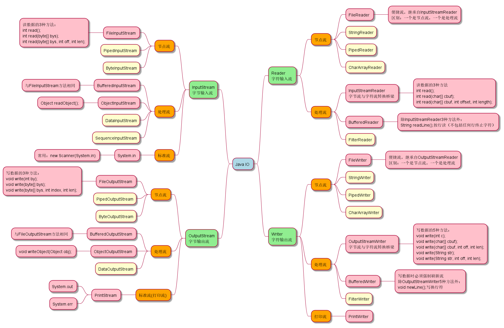

### 3.1.2 BIO框架总结

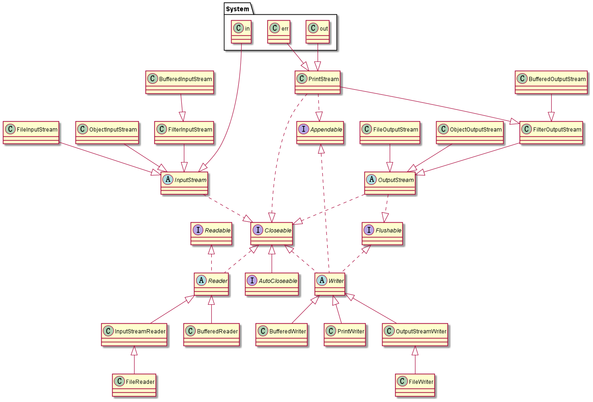

### 3.1.3 BIO源码中的设计模式

- 模板方法模式：

- 策略模式：File+FilenameFilter
- 装饰模式：new BufferedWriter(new OutputStreamWriter(new FileInputStream("文件路径")))
- 适配器模式：

## 3.2 NIO/AIO

**几个概念的理解（以"银行取款"为例）**：

- **同步**：使用同步IO时，Java自己处理IO读写。
  - 例：自己亲自出马持银行卡到银行取钱。
- **异步**：使用异步IO时，Java将IO读写委托给OS处理，需要将数据缓冲区地址和大小传给OS处理，需要将数据缓冲区地址和大小传给OS，OS需要支持异步IO操作API。
  - 例：委托一个小弟拿银行卡到银行取钱，然后给你，前提当然是需要将银行卡和密码交给小弟。

- **阻塞**：使用阻塞IO时，Java调用会一直阻塞到读写完成才返回。
  - 例： ATM排队取款，你只能等待。

- **非阻塞**：使用非阻塞IO时，如果不能读写Java调用会马上返回，当IO事件分发器会通知可读写时再继续进行读写，不断循环直到读写完成。
  - 例：柜台取款，取个号，然后坐在椅子上做其它事，等号期间广播会通知你办理，没到号你就不能去，你可以不断问大堂经理排到了没有，大堂经理如果说还没到你就不能去。

```bash
-- 综合举例
-- 同步阻塞：自己去银行ATM取款
-- 异步阻塞：委托小弟去银行ATM取款
-- 异步非阻塞：委托小弟去银行柜台拿号取款
```

**Java对BIO、NIO、AIO的支持**：

- Java BIO (blocking I/O)**：同步并阻塞**，服务器实现模式为**一个连接一个线程**，即客户端有连接请求时服务器端就需要启动一个线程进行处理，如果这个连接不做任何事情会造成不必要的线程开销，当然可以通过线程池机制改善。
- Java NIO (non-blocking I/O)： **同步非阻塞**，服务器实现模式为**一个请求一个线程**，即客户端发送的连接请求都会注册到多路复用器上，多路复用器轮询到连接有I/O请求时才启动一个线程进行处理。
- Java AIO(NIO 2) (Asynchronous I/O) ： **异步非阻塞**，服务器实现模式为**一个有效请求一个线程**，客户端的I/O请求都是由OS先完成了再通知服务器应用去启动线程进行处理。

**BIO、NIO、AIO适用场景分析**：

- BIO方式适用于连接数目比较小且固定的架构，对服务器资源要求比较高，并发局限于应用中，JDK1.4以前的唯一选择，但程序直观简单易理解。
- NIO方式适用于连接数目多且连接比较短（轻操作）的架构，比如聊天服务器，并发局限于应用中，编程比较复杂，JDK1.4开始支持。
- AIO方式使用于连接数目多且连接比较长（重操作）的架构，比如相册服务器，充分调用OS参与并发操作，编程比较复杂，JDK7开始支持。

### 3.2.1 NIO 

**NIO与IO的主要区别**：NIO的核心在于通道（Channel，打开到IO设备（如文件、套接字）的连接，**负责传输**）、缓冲区（Buffer，**负责存储**）和选择器（NIO的核心，作用是实现**非阻塞**）。

|                IO                 |                  NIO                  |
| :-------------------------------: | :-----------------------------------: |
| 面向流（Stream Oriented）：单向的 | 面向缓冲区（Buffer Oriented）：双向的 |
|     同步阻塞IO（Blocking IO）     |    同步非阻塞IO（Non Blocking IO）    |
|                 -                 |          选择器（Selectors）          |

#### 3.2.1.1 缓冲区(Buffer)

缓冲区(Buffer)用法总结：

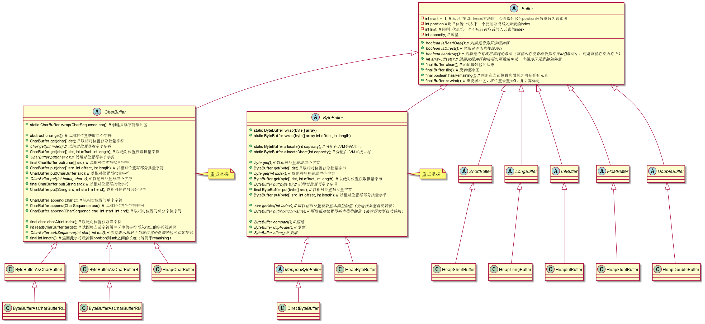

#### 3.2.1.2 通道(Channel)

通道(Channel)用法总结：

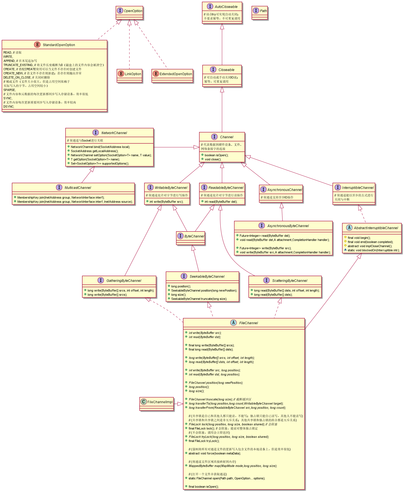

#### 3.2.1.3 套接字(Socket)

套接字(Socket)用法总结：

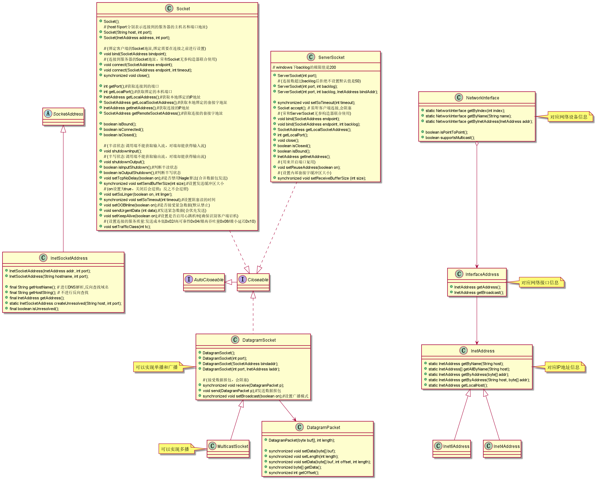

#### 3.2.1.4 选择器(Selector)

选择器(Selector)用法总结：

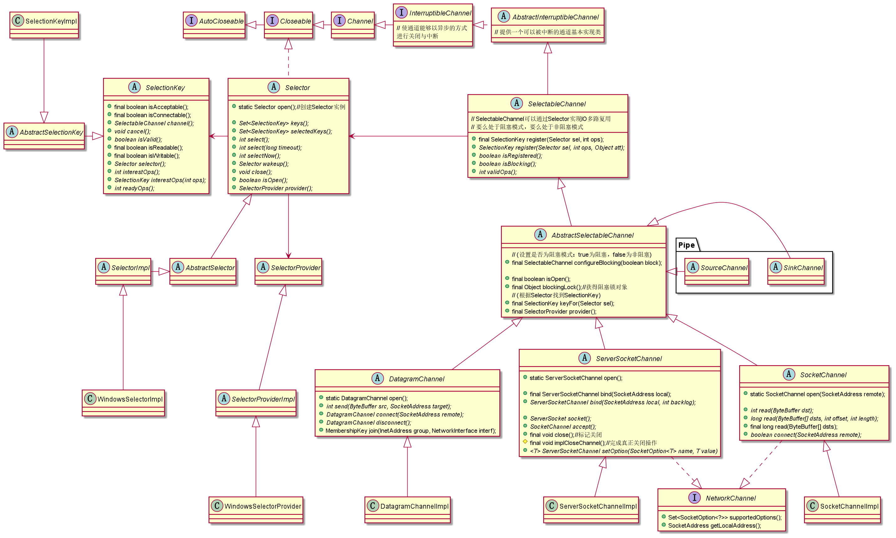

#### 3.2.1.5 NIO知识点

**NIO的三大核心**：Channel通道、Buffer缓冲区、Selector选择器

**直接缓冲区与非直接缓冲区**：字节缓冲区要么时直接的，要么是非直接的。如果为直接字节缓冲区，则Java虚拟机会尽最大努力直接在此缓冲区上执行本机IO操作。也就是说，在每次调用基础操作系统的一个本机I/O操作之前（或之后），虚拟机都会尽量避免将缓冲区的内容复制到中间缓冲区中（或从中间缓冲区中复制内容）。

1. 非直接缓冲区通过allocate()方法分配缓冲区，将缓冲区建立在JVM内存中。
2. 直接缓冲区通过allocateDirect()方法分配直接缓冲区，将缓冲区建立在操作系统的物理内存中，可以提供效率。
   - allocateDirect()方法返回的缓冲区进**行分配和取消分配所需成本**通常高于非直接缓冲区。
   - 直接缓冲区的内容可以**驻留在常规的垃圾回收堆之外**，因此对应用程序的内存需求量造成的影响可能并不明显。建议将直接缓冲区主要分配给那些易受基础系统的本机I/O操作影响的大型、持久的缓冲区。一般情况下，最好仅在直接缓冲区能在程序性能方面带来明显好处时分配它们。
   - 直接字节缓冲区还可以通过FileChannel的map()方法（返回MappedByteBuffer）将文件区域直接映射到内存中来创建。Java平台的实现有助于通过JNI从本机代码创建直接字节缓冲区。如果以上这些缓冲区中的某个缓冲区实例指的是不可访问的内存区域，则试图访问该区域不会更改该缓冲区的内容，并且将会在访问期间或稍后的某个时间导致抛出不确定的异常。

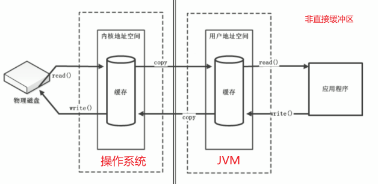


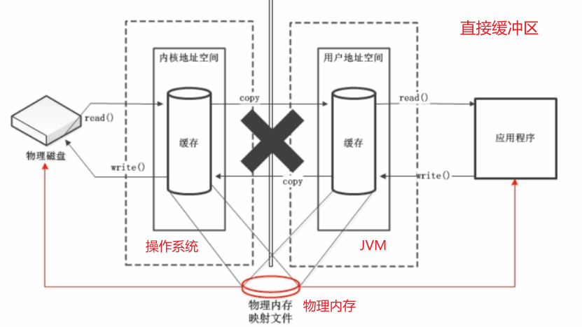

**通道与DMA**：

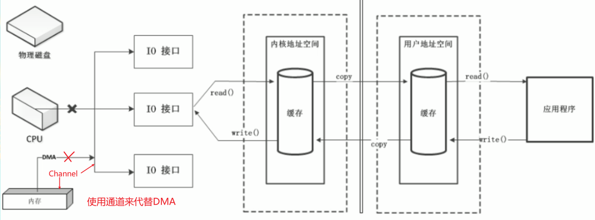

通道的主要实现类：FileChannel、SocketChannel、ServerSocketChannel、DatagramChannel...

获取通道的几种方法：

1. 使用getChannel()方法：FileInputStream/FileOutputStream/RandomAccessFile（针对本地IO）、Socket/ServerSocket/DatagramSocket（针对网络IO）。
2. 在NIO中针对各个通道的静态open()方法。
3. 在NIO中的Files工具类的newByteChannel()方法。

**select/poll/epoll的区别**：

select缺点：

1. bitmap数组默认大小为1024，虽然可以自己设置，但还是大小有限。
2. FD_SET不可重用。
3. 用户态到内核态切换存在开销。
4. 判断哪一个socket有数据需要进行遍历（轮询），时间复杂度为O(n)。

poll：解决了缺点1（因为基于链表处理）和缺点2。

epoll：解决了select的缺点1、2、3、4，具有广泛的应用（Redis/Nginx/Java NIO(Linux下)）。

### 3.2.2 AIO

AIO的用法总结：

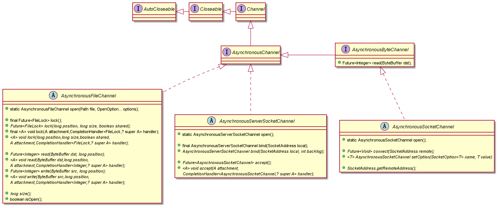


> 参考博客文章：[Java IO中的设计模式](https://www.cnblogs.com/wxgblogs/p/5649933.html)、[BIO/NIO/AIO整理](https://blog.csdn.net/guanghuichenshao/article/details/79375967)、[select/poll/epoll的区别](https://www.cnblogs.com/aspirant/p/9166944.html)、[**<<NIO与Socket编程技术指南>>**]()、[直接缓冲区与非直接缓冲区的区别](https://www.cnblogs.com/shamo89/p/9612794.html)、[JVM直接内存的使用与回收](https://blog.csdn.net/weixin_45505313/article/details/105310477)

# 4 集合源码

集合的框架一栏：

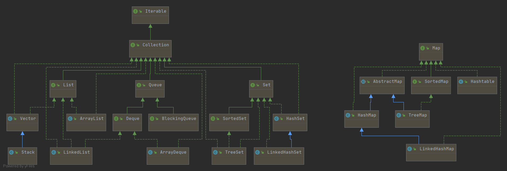

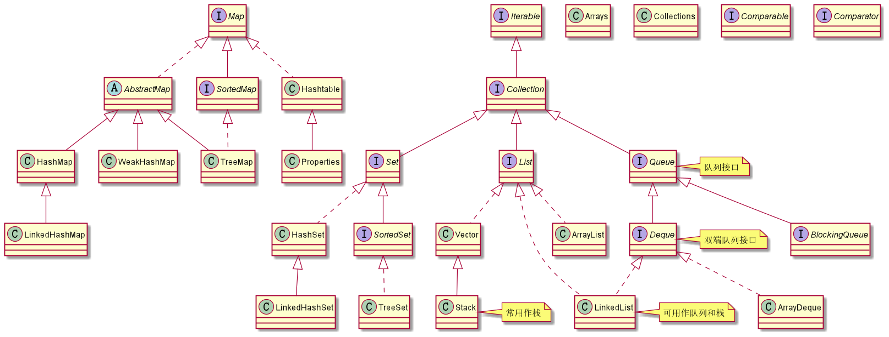

## 4.1 基本面知识

### 4.1.1 List/Set/Map

**List/Set/Map的比较**：

- **List**：可以有顺序地存取对象。
- **Set**：不允许重复对象存放到集合中。
- **Map**：采用键值对存储对象，使用哈希码来进行快速搜素。

### 4.1.2 ArrayList/LinkedList

**ArrayList/LinkedList的比较**：

- **是否保证线程安全**：均不同步，即不保证线程安全。

- **底层数据结构不同**：ArraytList底层是数组，LinkedList底层是双向链表（JDK1.6之前为双向循环链表；JDK1.7则取消了循环，变成了双向链表）。

- **插入和删除操作**：插入和删除的时间复杂度均受元素位置的影响。

  - ArrayList底层采用数组结构，插入和删除的性能较低，但是查询性能较高。

  - ListedList底层采用双向链表，插入和删除的性能较高，但是查询性能较低。

- **查询操作**：LinkedList不支持高效的随机元素访问；而ArraytList支持按元素索引快速获取元素对象。

  - 由于ArraytList支持按索引随机获取元素，所以ArrayList实现了RandomAccess接口（标识接口），而LinkedList没有实现RandomAccess接口。

  - 在Collections工具类的binarySearch方法中，会根据list判断是否是RandomAccess接口的实例。若是，则调用Collections的indexedBinarySearch方法进行搜索；反之，则调用Collections的iteratorBinarySearch方法来搜索。

  - 实现了RandomAccess接口（如ArrayList）的List，优先选择fori遍历，其次是forEach遍历；未实现RandomAccess接口（如LinkedList）的List，优先选择iterator进行遍历（forEach底层也是iterator实现遍历），**当size很大时，禁止使用fori遍历**。

    ```java
    // 当List的size=200000时，ArrayList和LinkedList使用不同方式遍历的耗时如下：
    // ArrayList使用fori遍历，耗时：1ms
    // ArrayList使用iterator遍历，耗时：3ms
    // LinkedList使用fori遍历，耗时：21805ms
    // LinkedList使用iterator遍历，耗时：5ms
    public class TraverseMethodTest {
        public static void main(String[] args) {
            List<Integer> list1 = new ArrayList<>();
            List<Integer> list2 = new LinkedList<>();
            for (int i = 0; i < 200000; i++) {
                list1.add(i);
                list2.add(i);
            }
    
            // ArrayList使用fori遍历，耗时：5ms
            int size = list1.size();
            long start1 = System.currentTimeMillis();
            for (int i = 0; i < size; i++) {
                list1.get(i);
            }
            long end1 = System.currentTimeMillis();
            System.out.println("ArrayList使用fori遍历，耗时：" + (end1 - start1) + "ms");
    
            // ArrayList使用iterator遍历，耗时：25ms
            long start2 = System.currentTimeMillis();
            Iterator<Integer> it1 = list1.iterator();
            while (it1.hasNext()) {
                Integer next = it1.next();
            }
            long end2 = System.currentTimeMillis();
            System.out.println("ArrayList使用iterator遍历，耗时：" + (end2 - start2) + "ms");
    
            // LinkedList使用fori遍历，耗时：ms
            int size2 = list2.size();
            long start3 = System.currentTimeMillis();
            for (int i = 0; i < size2; i++) {
                list2.get(i);
            }
            long end3 = System.currentTimeMillis();
            System.out.println("LinkedList使用fori遍历，耗时：" + (end3 - start3) + "ms");
    
            // LinkedList使用iterator遍历，耗时：ms
            long start4 = System.currentTimeMillis();
            Iterator<Integer> it2 = list2.iterator();
            while (it2.hasNext()) {
                Integer next = it2.next();
            }
            long end4 = System.currentTimeMillis();
            System.out.println("LinkedList使用iterator遍历，耗时：" + (end4 - start4) + "ms");
        }
    }
    ```

- **内存空间占用不同**：LinkedList则需要存储指向下个元素的引用；ArrayList会在List的结尾预留一定的容量空间。ArrayList的扩容机制如下：

  - ArrayList默认容量是10；

  - 每次扩容按照1.5倍进行增长；
  - 允许的最大容量就是Integer的最大值。

**使用ArrayList的注意事项**：

1. 在forEach/iterator迭代时，不能使用集合本身进行添加或删除元素（否则会出现ConcurrentModificationException）。
2. 在forEach/iterator迭代时，可以使用迭代器可以进行删除元素，但仍然不能进行添加元素。
3. 在fori迭代时，可以使用集合本身进行添加或删除元素。
4. 若使用CopyOnWriteArrayList替代ArrayList，则在迭代（forEach/iterator/fori）时，可以使用集合本身进行添加或删除元素。

```java
// 测试iterator迭代
@Test
public void test1() {
    List<Integer> list = new ArrayList<>();
    for (int i = 0; i < 10; i++) {
        list.add(i);
    }

    Iterator<Integer> it = list.iterator();
    while (it.hasNext()) {
        int i = (int) it.next();
        // 在iterator迭代时，不能使用ArrayList集合本身进行添加或删除元素
        list.add(i); // java.util.ConcurrentModificationException
        list.remove(i); // java.util.ConcurrentModificationException
    }

}

// 测试forEach迭代
@Test
public void test2() {
    List<Integer> list = new ArrayList<>();
    for (int i = 0; i < 10; i++) {
        list.add(i);
    }

    for (Integer i : list) {
        // 在forEach迭代时，不能使用ArrayList集合本身进行添加或删除元素
        list.add(i); // java.util.ConcurrentModificationException
        list.remove(i); // java.util.ConcurrentModificationException
    }
}

// 测试fori迭代
@Test
public void test3() {
    List<Integer> list = new ArrayList<>();
    for (int i = 0; i < 10; i++) {
        list.add(i);
    }

    for (int i = 0; i < 5; i++) {
        // 在fori迭代时，可以使用ArrayList集合本身进行添加或删除元素
        list.add(i);
        list.remove(i);
    }
    System.out.println(list); // [1, 3, 5, 7, 9, 0, 1, 2, 3, 4]
}

// 测试使用迭代器删除元素
@Test
public void test4() {
    List<Integer> list = new ArrayList<>();
    for (int i = 0; i < 10; i++) {
        list.add(i);
    }
    Iterator<Integer> it = list.iterator();
    while (it.hasNext()) {
        it.next();
        // 在forEach/iterator迭代时，可以使用迭代器可以进行删除元素，但仍然不能进行添加元素
        it.remove();
    }
    System.out.println(list); // 输出[]
}

// 测试使用CopyOnWriteArrayList
@Test
public void test5() {
    CopyOnWriteArrayList<Integer> list = new CopyOnWriteArrayList<>();
    for (int i = 0; i < 10; i++) {
        list.add(i);
    }

    Iterator<Integer> it = list.iterator();
    while (it.hasNext()) {
        int i = (int) it.next();
        // 在iterator迭代时，可以使用CopyOnWriteArrayList集合本身进行添加或删除元素
        list.add(i);
        list.remove(i);
    }
    System.out.println(list); // [1, 3, 5, 7, 9, 1, 3, 5, 7, 9]
}
```

### 4.1.3 ArrayList/Vector

**ArrayList/Vector的比较**：

- Vector和ArrayList的底层均采用数组结构实现。

- Vector的所有方法都是同步方法（添加了synchronized关键字）。多线程下可以安全地访问同一个Vector对象，缺点是在整个方法上添加了同步锁，导致性能很低。**由于Vector的性能低下，因此多线程下也不推荐使用Vector，应使用CopyOnWriteArrayList**。
- ArrayList的方法不是同步的，无法在多线程下保证安全性。

### 4.1.4 HashMap/Hashtable

**HashMap/Hashtable的比较**：

- **线程是否安全**：HashMap线程不安全，HashTable是线程安全的（Hashtable内部的方法基本都使用synchronized修饰）。

- **效率**：由于线程安全的问题，HashMap的效率比HashTable要高。HashTable由于性能较低，已经被淘汰，多线程下使用ConcurrentHashMap 。

- **对null Key 和null Value的支持**：

  - HashMap中，null可以作为Key，且只能存在一个null Key，但可以存在多个Key对应的Value为null；
  - Hashtable的Key和Value均不能为null（否则会抛出NullPointerException异常）。

  |      集合类       |     Key      |    Value     |    super    |          说明          |
  | :---------------: | :----------: | :----------: | :---------: | :--------------------: |
  |     Hashtable     | 不允许为null | 不允许为null | Dictionary  |        线程安全        |
  | ConcurrentHashMap | 不允许为null | 不允许为null | AbstractMap | 锁分段技术（JDK8:CAS） |
  |      TreeMap      | 不允许为null |  允许为null  | AbstractMap |       线程不安全       |
  |      HashMap      |  允许为null  |  允许为null  | AbstractMap |       线程不安全       |

- **初始容量及扩容机制不同**：
  - Hashtable默认的初始容量为11（之所以设计为11，是因为11是一个素数，发生哈希碰撞的概率要小于合数），之后每次扩容为2n+1（n为原来的容量大小），默认负载因子为0.75（负载因子太小了浪费空间并且会发生更多次数的resize，太大了哈希冲突增加会导致性能不好。负载因子取0.75本质是空间与时间成本的一种折中）。
  - HashMap默认的初始容量为16（16为合数，2^n也为合数），之后每次扩容为2n（n为原来的容量大小），默认负载因子为0.75。
  - 若创建时制定了初始容量，Hashtable会直接使用给定的大小，而HashMap会将其扩充为2的幂次方大小（HashMap总是使用2的幂次方作为哈希表的大小）。

- **底层数据结构不同**：
  - JDK1.8之前，HashMap底层由数组+链表组成，数组是HashMap的主体，链表则是为了解决哈希冲突而存在的（"拉链法"解决冲突）；JDK1.8之后，在解决Hash冲突时有了较大的变化，当链表的长度大于阈值（默认是8）时，将链表转化为红黑树，以减少搜索时间。
  - Hashtable底层仍然采用数组+链表组成。

### 4.1.5 HashMap/HashSet

**HashMap/HashSet的比较**：HashSet底层是使用HashMap实现的。

|           HashMap            |                           HashSet                            |
| :--------------------------: | :----------------------------------------------------------: |
|        实现了Map接口         |                        实现了Set接口                         |
|          存储键值对          |                          仅存储对象                          |
|  调用put方法向map中添加元素  | 调用add方法向Set中添加元素（**底层使用HashMap实现，value是一个Object常量**） |
| HashMap使用键(Key)计算哈希码 | HashSet使用对象计算哈希码，若两个对象的哈希码相同，再使用equals方法用来判断对象的相等性 |

**HashSet检查重复的步骤**：

1. 检查对象哈希码。若哈希码不同，则没有重复的对象；若哈希码相同，则下一步使用equals方法进行比较。
2. 使用equals方法进行比较，若为true则表示有重复的对象，反之则没有重复的对象。

### 4.1.6 深入HashMap

#### 4.1.6.1 底层实现

**HashMap的底层实现**：

1. JDK1.8之前，HashMap底层采用数组和链表组成的**链表数组**结构（即"哈希桶"数组，底层对应的是Node[]）。

```java
// JDk1.7的计算散列码的方法
static int hash(int h) {
    h ^= (h >>> 20) ^ (h >>> 12);
    return h ^ (h >>> 7) ^ (h >>> 4);
}
```

2. JDK1.8之后，HashMap在解决哈希冲突时有了较大的变化，当链表长度大于阈值（默认为 8）（将链表转换成红黑树前会判断，如果当前数组的长度小于 64，那么会选择先进行数组扩容，而不是转换为红黑树）且数组容量大于64时，将链表转化为**红黑树**，以减少搜索时间。

```java
// JDk1.8的计算散列码的方法
// JDK1.8的哈希码计算只经过了一次扰动，性能比JDk1.7要高
static final int hash(Object key) {
      int h;
      // key.hashCode(): 返回散列值也就是hashcode
      // ^: 按位异或
      // >>>:无符号右移, 忽略符号位, 空位都以0补齐
      return (key == null) ? 0 : (h = key.hashCode()) ^ (h >>> 16);
}
```

3. TreeMap、TreeSet 以及 JDK1.8 之后的HashMap 底层都用到了红黑树结构，红黑树可以解决二叉查找树在某些情况下会退化成线性结构的缺陷。

#### 4.1.6.2 幂次方长度

**HashMap的长度为什么是2的幂次方？**

为了能让 HashMap 存取高效，尽量减少碰撞，也就是要尽量把数据分配均匀。Hash 值的范围值-2147483648 到 2147483647，前后加起来大概 40 亿的映射空间，只要哈希函数映射得比较均匀松散，一般应用是很难出现碰撞的。但问题是一个 40 亿长度的数组，内存是放不下的。所以这个散列值是不能直接拿来用的。用之前还要先做对数组的长度取模运算，得到的余数才能用来要存放的位置也就是对应的数组下标。这个数组下标的计算方法是`(n - 1) & hash（n 代表数组长度）`。这也就解释了HashMap 的长度为什么是2的幂次方。

这个算法应该如何设计呢？我们首先可能会想到采用%取余的操作来实现。但是：取余(%)操作中如果除数是 2 的幂次则等价于与其除数减一的与(&)操作（也就是说hash%length==hash&(length-1)的前提是 length是2的n次方）；并且采用二进制位操作&，相对于%能够提高运算效率，这就解释了HashMap的长度为什么是2的幂次方。

#### 4.1.6.3 死循环问题

在多线程下使用HashMap可能会由于rehash造成元素之间形成一个循环链表，导致HashMap在get元素时出现死循环问题。不过，好在JDK1.8后解决这个问题（JDK8依然存在该问题）。但是正如Sun设计的初衷一样，多线程下应该使用ConcurrentHashMap来代替HashMap。

### 4.1.7 ConcurrentHashMap/Hashtable

**ConcurrentHashMap/Hashtable的比较**：

- **底层数据结构不同**：
  - JDK1.7的ConcurrentHashMap底层采用**分段的数组+链表**实现；JDK1.8采用和HashMap一样的结构，即数组+链表/红黑树实现。
  - Hashtable采用**数组+链表**实现。

- **实现线程安全的方式不同**：
  - JDK1.7时，ConcurrentHashMap采用**分段锁**策略对整个桶数进行了分割分段（Segment，Segment是一种可重入锁），每一把锁只锁容器其中一部分数据，多线程访问容器里不同数据段的数据，就不会存在锁竞争，提高并发访问率；JDK1.8时，抛弃了Segment的概念，而是直接用**Node数组+链表+红黑树**的数据结构来实现，并发控制使用**synchronized+CAS**来操作。
    - JDK1.8的实现降低了锁的粒度，JDK1.7版本锁的粒度是基于Segment的，包含多个HashEntry，而JDK1.8锁的粒度就是HashEntry（首节点）。
  - Hashtable使用同步方法（在方法上添加synchronized关键字）保证线程安全（"**全表锁**"），效率非常低下（例如：当put的时候，也不能get）。

> 参考博客文章：[ConcurrentHashMap底层实现原理(JDK1.7 & 1.8)](https://www.jianshu.com/p/865c813f2726)

### 4.1.8 Comparable/Comparator

**Comparable/Comparator的比较**：

- 出处不同：
  - Comparable接口出自`java.lang`包，Comparable的`compareTo(Object obj)`方法用来排序。
  - Comparator接口出自 `java.util`包，Comparator的`compare(Object obj1, Object obj2)`方法用来排序。
- 使用不同：Comparator具有更大的灵活性。
  - 当需要对一个集合使用自定义排序时，我们就要重写`compareTo()`方法或`compare()`方法。
  - 当需要对一个集合实现两种排序方式时，比如一个 song 对象中的歌名和歌手名分别采用一种排序方法的话，我们可以重写compareTo()方法和使用自制的Comparator方法、或以两个Comparator来实现歌名排序和歌星名排序，第二种代表我们只能使用两个参数版的`Collections.sort()`。

### 4.1.9 LinkedHashMap/HashMap

**LinkedHashMap/HashMap比较**：

- 类的关系：LinkedHashMap继承自HashMap。
- 对null Key 和null Value的支持：与HashMap相同，Key和Value都允许为空。
- 底层数据结构：
  - HashMap：数组+链表/红黑树。
  - LinkedMap：数组+链表/红黑树+双向链表。
- 线程是否安全：都属于线程不安全的集合。
- 是否有序：HashMap无序；LinkedHashMap有序（分为插入顺序和访问顺序两种），若是访问顺序，当put和get操作已经存在的Entry时，都会把Entry移动到双向链表的末尾（其实是先删除再插入）。

### 4.1.10 LinkedHashSet/HashSet

**LinkedHashSet/HashSet比较**：

- 类的关系：LinkedHashSet继承自HashSet。
- 对null Key 和null Value的支持：HashSet、LinkedHashSet均只可以存储一个null。
- 底层数据结构：
  - HashSet：底层使用HashMap实现，采用数组+链表/红黑树结构。
  - LinkedHashSet：采用数组+链表/红黑树+双向链表结构。

- 线程是否安全：都属于线程不安全的集合。
- 是否有序：HashSet无序；LinkedHashSet有序。

## 4.2 进阶

### 4.2.1 集合数据结构总结

集合数据结构总结：

- List
  - ArrayList： Object数组。
  - Vector： Object数组。
  - LinkedList： 双向链表（JDK1.6之前为双向循环链表，JDK1.7则取消了循环，变成了双向链表）。

- Set
  - HashSet（无序唯一）：底层采用HashMap实现。
  - TreeSet（有序唯一）：红黑树（自平衡的排序二叉树）。
  - LinkedHashSet：底层采用LinkedHashMap来实现，而LinkedHashMap内部又是基于HashMap实现。

- Map
  - HashMap： JDK1.8之前由数组+链表实现，JDK1.8采用数组+链表/红黑树实现。
  - Hashtable：数组+链表。
  - TreeMap：红黑树（自平衡的排序二叉树）。
  - LinkedHashMap：继承自HashMap，底层采用数组+链表/红黑树实现；此外，还增加了一条双向链表，从而保证键值对的插入顺序。

### 4.2.2 HashMap七种遍历方式性能

**HashMap七种遍历方式如下**：

1. 迭代器（Iterator）EntrySet的方式。
2. 迭代器（Iterator）KeySet的方式。
3. forEach EntrySet的方式。
4. forEach KeySet的方式。
5. Lambda表达式的方式。
6. Stream API单线程的方式。
7. Stream API多线程的方式。

```java
// 使用JMH对以上七种遍历方式进行测试
// Benchmark                       Mode  Cnt  Score   Error   Units
// HashMapTest.entrySet           thrpt    5  4.181 ± 0.170  ops/ms
// HashMapTest.forEachEntrySet    thrpt    5  4.224 ± 0.837  ops/ms
// HashMapTest.forEachKeySet      thrpt    5  4.334 ± 0.297  ops/ms
// HashMapTest.keySet             thrpt    5  4.304 ± 0.440  ops/ms
// HashMapTest.lambda             thrpt    5  4.237 ± 0.179  ops/ms
// HashMapTest.parallelStreamApi  thrpt    5  2.426 ± 0.273  ops/ms
// HashMapTest.streamApi          thrpt    5  4.525 ± 2.226  ops/ms
@BenchmarkMode(Mode.Throughput) // 测试类型：吞吐量
@OutputTimeUnit(TimeUnit.MILLISECONDS)
@Warmup(iterations = 2, time = 1, timeUnit = TimeUnit.SECONDS) // 预热 2 轮，每次 1s
@Measurement(iterations = 5, time = 3, timeUnit = TimeUnit.SECONDS) // 测试 5 轮，每次 3s
@Fork(1) // fork 1 个线程
@State(Scope.Thread) // 每个测试线程一个实例
public class HashMapTest {
    static Map<Integer, String> map = new HashMap() {{
        // 添加数据
        for (int i = 0; i < 10; i++) {
            put(i, "val:" + i);
        }
    }};

    public static void main(String[] args) throws RunnerException {
        // 启动基准测试
        Options opt = new OptionsBuilder()
                .include(HashMapTest.class.getSimpleName()) // 要导入的测试类
                .output("C:/Users/zcpro/Desktop/jmh-map.log") // 输出测试结果的文件
                .build();
        new Runner(opt).run(); // 执行测试
    }

    @Benchmark
    public void entrySet() {
        // 使用迭代器（Iterator）EntrySet的方式进行遍历
        Iterator<Map.Entry<Integer, String>> iterator = map.entrySet().iterator();
        while (iterator.hasNext()) {
            Map.Entry<Integer, String> entry = iterator.next();
            System.out.println(entry.getKey());
            System.out.println(entry.getValue());
        }
    }

    @Benchmark
    public void keySet() {
        // 使用迭代器（Iterator）KeySet的方式进行遍历
        Iterator<Integer> iterator = map.keySet().iterator();
        while (iterator.hasNext()) {
            Integer key = iterator.next();
            System.out.println(key);
            System.out.println(map.get(key));
        }
    }

    @Benchmark
    public void forEachEntrySet() {
        // 使用ForEach EntrySet的方式进行遍历
        for (Map.Entry<Integer, String> entry : map.entrySet()) {
            System.out.println(entry.getKey());
            System.out.println(entry.getValue());
        }
    }

    @Benchmark
    public void forEachKeySet() {
        // 使用ForEach KeySet的方式进行遍历
        for (Integer key : map.keySet()) {
            System.out.println(key);
            System.out.println(map.get(key));
        }
    }

    @Benchmark
    public void lambda() {
        // 使用Lambda表达式的方式进行遍历
        map.forEach((key, value) -> {
            System.out.println(key);
            System.out.println(value);
        });
    }

    @Benchmark
    public void streamApi() {
        // 使用Stream API单线程的方式进行遍历
        map.entrySet().stream().forEach((entry) -> {
            System.out.println(entry.getKey());
            System.out.println(entry.getValue());
        });
    }

    @Benchmark
    public void parallelStreamApi() {
        // 使用Stream API多线程的方式进行遍历
        map.entrySet().parallelStream().forEach((entry) -> {
            System.out.println(entry.getKey());
            System.out.println(entry.getValue());
        });
    }
}
```

**总结**：

1. **HashMap除了Stream API多线程（并行循环parallelStream）的方式性能比较高之外，其他的遍历方式在性能方面几乎没有任何差别**。
2. 无论是forEach遍历还是迭代器遍历，EntrySet的遍历性能都要略高于KeySet（相差不大）。
3. 从`HashMapTest.class`字节码文件可以看出：
   - 使用迭代器和forEach遍历的底层实现一致（相当于forEach是一种语法糖）。
   - Lambda表达式采用Key-Value对遍历，类似于KeySet遍历。
   - Stream单线程和Stream多线程均采用EntrySet遍历，多线程遍历性能提升极大。
4. 从安全性角度：
   - 在迭代器遍历中使用迭代器本身删除元素安全。
   - 在forEach遍历中使用集合本身操作（增加/删除/修改）元素不安全，会出现`ConcurrentModificationException`异常。
   - 在Lambda遍历中使用集合本身操作（增加/删除/修改）元素不安全，会出现`ConcurrentModificationException`异常；可以先使用Lambda的 removeIf方法删除多余的数据，再进行循环才是一种正确操作集合的方式。
   - 在Stream遍历中使用集合本身操作（增加/删除/修改）元素不安全，会出现`ConcurrentModificationException`异常；可以在流中使用filter对集合元素进行过滤达到"删除"的效果。

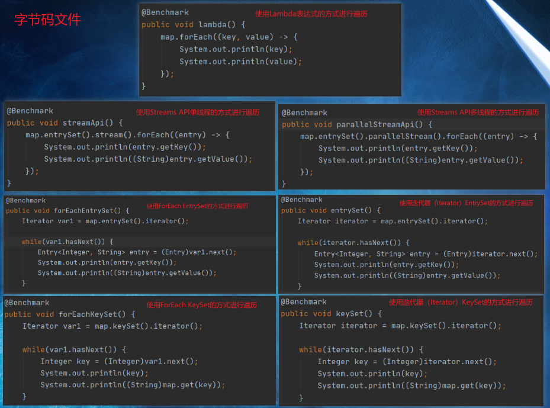

### 4.2.3 fail-fast/fail-safe

**快速失败（fail-fast）**：Java集合的一种错误检测机制。在使用迭代器对集合进行遍历时，若在多线程下操作（增加/删除/修改）非安全失败的集合可能就会触发fail-fast机制，导致抛出`ConcurrentModificationException`异常；此外，在单线程下，若在遍历时对集合对象的内容进行了操作（增加/删除/修改）也会触发fail-fast机制；值得注意的是，forEach循环也是借助于迭代器进行遍历。

**原因**：每当迭代器使用`hashNext/next`遍历下一个元素前，都会检测`modCount`变量是否为`expectedModCount`值，确认OK就返回遍历，否则抛出异常，终止遍历。若在集合被遍历期间对其进行修改（增加/删除/修改，修改为什么会改变`modCount`的值）的话，就会改变`modCount`的值，进而导致`modCount≠expectedModCount`，进而抛出`ConcurrentModificationException`异常。

```java
final void checkForComodification() {
	if (modCount != expectedModCount)
		throw new ConcurrentModificationException();
}
```

**安全失败（fail-safe）**：采用安全失败机制的集合容器，在遍历时不是直接在集合内容上访问，而是先复制原有集合内容，在拷贝的集合上进行遍历。所以。在遍历过程中对原集合所作的修改并不能被迭代器检测到，故不会抛出`ConcurrentModificationException`异常。

**`Arrays.asList()`避坑指南**：

- Arrays.asList()方法：返回由指定数组支持的固定大小列表（数组与集合之间转化的桥梁），返回的List是可序列化并实现了RandomAccess接口。

  - 需要注意，转换后的List集合，不能使用其修改集合相关的方法，其add/remove/clear方法会抛出`UnsupportedOperationException`异常。这是因为asList的返回对象是一个Arrays内部类，并未实现集合的修改方法。Arrays.asList体现的是适配器模式，只是转换接口，后台的数据仍是数组。

    ```java
    String[] str = new String[]{"you", "wu"};
    List list = Arrays.asList(str);
    // 第一种情况：list.add("yangguanbao");运行时异常
    // 第二种情况：str[0]="gujin";那么list.get(0)也会随之修改
    ```

- 集合的toArray()方法：将集合转化为数组。

**`Arrays.asList()`注意事项**：

1. 传入的数组必须是对象数组，而不是基本类型。

   ```java
   // 当传入一个基本数据类型数组时，Arrays.asList()的真正得到的参数就不是数组中的元素，而是数组对象本身，此时List的唯一元素就是这个数组
   public void test8() {
       // 改成Integer[] myArray = {1, 2, 3};可以避免出现异常
       int[] myArray = {1, 2, 3};
       List myList = Arrays.asList(myArray);
       System.out.println(myList.size()); // 1
       System.out.println(myList.get(0)); // 数组地址值
   //        System.out.println(myList.get(1)); // 报错： ArrayIndexOutOfBoundsException
       int[] array = (int[]) myList.get(0);
       System.out.println(Arrays.toString(array)); // [1, 2, 3]
   }
   ```

2. 转换后的List集合，不能使用其修改集合相关的方法，其add/remove/clear方法会抛出`UnsupportedOperationException`异常。Arrays.asList()⽅法返回的并不是`java.util.ArrayList`，而是`java.util.Arrays`的⼀个内部类，这个内部类并没有实现集合的修改⽅法或者说并没有重写这些⽅法。

   ```java
   public void test9() {
       List myList = Arrays.asList(1, 2, 3);
       System.out.println(myList.getClass()); // class java.util.Arrays$ArrayList
       myList.add(4); // 运⾏时报错： UnsupportedOperationException
       myList.remove(1); // 运⾏时报错： UnsupportedOperationException
       myList.clear(); // 运⾏时报错： UnsupportedOperationException
   }
   ```

> [ArrayList源码分析](https://www.cnblogs.com/zhangyinhua/p/7687377.html)、[LinkedList源码分析](https://www.cnblogs.com/zhangyinhua/p/7688304.html)、[HashMap源码分析](https://www.cnblogs.com/zhangyinhua/p/7698642.html)、[Vector和Stack源码分析](https://www.cnblogs.com/zhangyinhua/p/7688722.html)、[深入理解Java集合框架](https://zhuanlan.zhihu.com/p/24687801)、[哈希表解决冲突的两种方式](https://blog.csdn.net/zkangaroo/article/details/64918956)、[JDK1.8ArrayList主要方法和扩容机制(源码解析)](https://blog.csdn.net/u010890358/article/details/80515284)、[Java8系列之重新认识HashMap](https://zhuanlan.zhihu.com/p/21673805)、[HashMap的7种遍历方式与性能分析](https://mp.weixin.qq.com/s/Zz6mofCtmYpABDL1ap04ow)、[HashMap的死循环](https://coolshell.cn/articles/9606.html)、[LinkedHashMap源码详细分析](https://www.imooc.com/article/22931)、[Java Array to List Examples](https://javadevnotes.com/java-array-to-list-examples)、[fail-fast和fail-safe](https://www.cnblogs.com/u013533289/p/11637885.html)

# 5 常用的工具类/包

## 5.1 Math

- Math.round()："四舍五入"， 该函数返回的是一个四舍五入后的的整数。 
  - **注意**：负数，小数点第一位是5时，直接舍去，整数部分不+1； 正数，小数点第一位是5时，往整数部分+1。

- Math.ceil()："向上取整"，即小数部分直接舍去，并向正数部分进1。

- Math.floor()："向下取整"，即小数部分直接舍去。
  - **注意**：Math.floor()容易出现精度问题。例如，对小数8.54保留两位小数（虽然它已经保留了2位小数），`Math.floor(8.54*100)/100  // 输出结果为 8.53, 注意是 8.53 而不是 8.54`。**Math.floor()慎用！**

## 5.2 Arrays

```java
// 排序
sort()
// 查找
binarySearch()
// 比较
equals()
// 填充
fill()
// 将数组转换为列表
asList()
// 转换为字符串
Arrays.toString()
// 复制
copyOf()
// 截取复制
copyRangeOf()
```

## 5.3 Collections

- 排序

```java
// 反转
void reverse(List list)
// 随机排序
void shuffle(List list)
// 按自然排序的升序排序
void sort(List list)
// 定制排序，由Comparator控制排序逻辑
void sort(List list, Comparator c)
// 交换两个索引位置的元素
void swap(List list, int i , int j)
// 旋转。当distance为正数时，将list后distance个元素整体移到前面。当distance为负数时，将 list的前distance个元素整体移到后面。
void rotate(List list, int distance)
```

- 查找与替换操作

```java
// 对List进行二分查找，返回索引，注意List必须是有序的
int binarySearch(List list, Object key)
// 根据元素的自然顺序，返回最大的元素
int max(Collection coll)
// 根据定制排序，返回最大元素
int max(Collection coll, Comparator c)
// 用指定的元素代替指定list中的所有元素
void fill(List list, Object obj)
// 统计元素出现次数
int frequency(Collection c, Object o)
// 统计target在list中第一次出现的索引，找不到则返回-1
int indexOfSubList(List list, List target)
// 用新元素替换旧元素
boolean replaceAll(List list, Object oldVal, Object newVal)
```

- 同步控制：禁止使用，效率很低，**需要线程安全的集合类型时请考虑使用 JUC 包下的并发集合**。

```java
// 返回指定Collection支持的同步（线程安全的）Collection
synchronizedCollection(Collection<T>  c)
// 返回指定列表支持的同步（线程安全的）List
synchronizedList(List<T> list)
// 返回由指定映射支持的同步（线程安全的）Map
synchronizedMap(Map<K,V> m)
// 返回指定Set支持的同步（线程安全的）Set
synchronizedSet(Set<T> s)
```

- 设置不可变集合

```java
// 下面三类方法的参数是原有的集合对象，返回值是该集合的"只读"版本
// 返回一个空的、不可变的集合对象，此处的集合既可以是List/Set/Map
emptyXxx()
// 返回一个只包含指定对象（只有一个或一个元素）的不可变的集合对象，此处的集合可以是List/Set/Map
singletonXxx()
// 返回指定集合对象的不可变视图，此处的集合可以是List/Set/Map
unmodifiableXxx()
```

## 5.4 commons-io包


## 5.5 commons-lang包

`commons-lang`可能是最常用的java工具包之一。commons-lang包的基本组织结构如下：

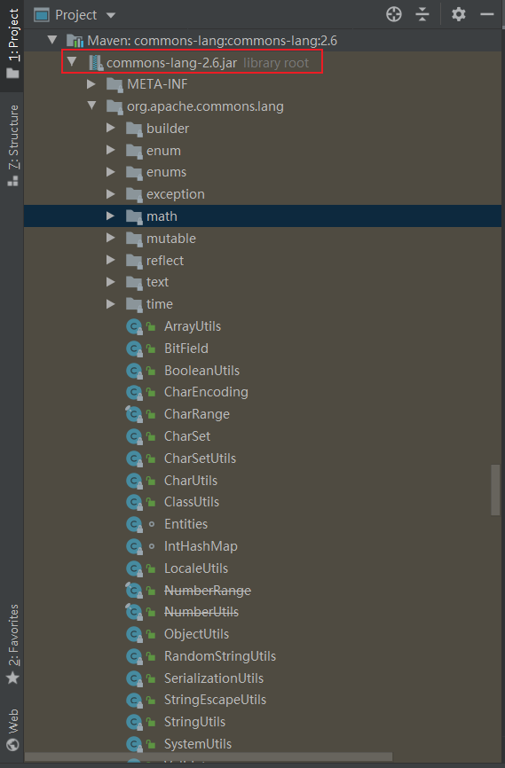

### 5.5.1 ArchUtils

**ArchUtils**：java运行环境的系统信息工具类。

```java
getArch();// 获取电脑处理器体系结构 32 bit、64 bit、unknown
getType();// 返回处理器类型 x86、ia64、ppc、unknown
is32Bit();// 检查处理器是否为32位
is64Bit();// 检查处理器是否为64位
isIA64();// 检查是否是英特尔安腾处理器类型
isPPC();// 检查处理器是否是电源PC类型
isX86();// 检查处理器是否是x86类型
```

### 5.5.2 ArrayUtils

**ArrayUtils**：数组工具类。

```java
// add(boolean[] array, boolean element) 将给定的数据添加到指定的数组中，返回一个新的数组
ArrayUtils.add(null, true)          = [true]
ArrayUtils.add([true], false)       = [true, false]
ArrayUtils.add([true, false], true) = [true, false, true]
// add(boolean[] array, int index, boolean element) 将给定的数据添加到指定的数组下标中，返回一个新的数组
ArrayUtils.add(null, 0, true)          = [true]
ArrayUtils.add([true], 0, false)       = [false, true]
ArrayUtils.add([false], 1, true)       = [false, true]
ArrayUtils.add([true, false], 1, true) = [true, true, false]
// addAll(boolean[] array1, boolean... array2) 将给定的多个数据添加到指定的数组中，返回一个新的数组
ArrayUtils.addAll(array1, null)   = cloned copy of array1
ArrayUtils.addAll(null, array2)   = cloned copy of array2
ArrayUtils.addAll([], [])         = []
// clone(boolean[] array) 复制数组并返回 结果数组为空将返回空
// contains(boolean[] array, boolean valueToFind) 检查该数据在该数组中是否存在，返回一个boolean值
// getLength(Object array) 返回该数组长度
ArrayUtils.getLength(null)            = 0
ArrayUtils.getLength([])              = 0
ArrayUtils.getLength([null])          = 1
ArrayUtils.getLength([true, false])   = 2
ArrayUtils.getLength([1, 2, 3])       = 3
ArrayUtils.getLength(["a", "b", "c"]) = 3
// hashCode(Object array) 返回该数组的哈希Code码
// indexOf(boolean[] array, boolean valueToFind) 从数组的第一位开始查询该数组中是否有指定的数值，存在返回index的数值，否则返回-1
// indexOf(boolean[] array, boolean valueToFind, int startIndex) 从数组的第startIndex位开始查询该数组中是否有指定的数值，存在返回index的数值，否则返回-1
// insert(int index, boolean[] array, boolean... values) 向指定的位置往该数组添加指定的元素，返回一个新的数组
ArrayUtils.insert(index, null, null)      = null
ArrayUtils.insert(index, array, null)     = cloned copy of 'array'
ArrayUtils.insert(index, null, values)    = null
// isEmpty(boolean[] array) 判断该数组是否为空，返回一个boolean值
// isNotEmpty(boolean[] array) 判断该数组是否为空，而不是null
// isSameLength(boolean[] array1, boolean[] array2) 判断两个数组的长度是否一样，当数组为空视长度为0。返回一个boolean值
// isSameType(Object array1, Object array2) 判断两个数组的类型是否一样，返回一个boolean值
// isSorted(boolean[] array) 判断该数组是否按照自然排列顺序排序，返回一个boolean值
// isSorted(T[] array, Comparator<T> comparator) 判断该数组是否按照比较器排列顺序排序，返回一个boolean值
// lastIndexOf(boolean[] array, boolean valueToFind) 从数组的最后一位开始往前查询该数组中是否有指定的数值，存在返回index的数值，否则返回-1
// lastIndexOf(boolean[] array, boolean valueToFind, int startIndex) 从数组的最后startIndex位开始往前查询该数组中是否有指定的数值，存在返回index的数值，否则返回-1
// nullToEmpty(boolean[] array) 将null转换为空的数组,如果数组不为null,返回原数组,如果数组为null,返回一个空的数组
// remove(boolean[] array, int index) 删除该数组指定位置上的元素，返回一个新的数组，所有后续元素左移（下标减1）
ArrayUtils.remove([true], 0)              = []
ArrayUtils.remove([true, false], 0)       = [false]
ArrayUtils.remove([true, false], 1)       = [true]
ArrayUtils.remove([true, true, false], 1) = [true, false]
// removeAll(boolean[] array, int... indices) 删除该数组多个指定位置上的元素，返回一个新的数组，所有后续元素左移（下标减1）
ArrayUtils.removeAll([true, false, true], 0, 2) = [false]
ArrayUtils.removeAll([true, false, true], 1, 2) = [true]
// removeAllOccurences(boolean[] array, boolean element) 从该数组中删除指定的元素，返回一个新的数组
// removeElement(boolean[] array, boolean element) 从该数组中删除指定的元素，返回一个新的数组
// removeElements(boolean[] array, boolean... values) 从该数组中删除指定数量的元素，返回一个新的数组
// reverse(boolean[] array) 数组反转
// reverse(boolean[] array, int startIndexInclusive, int endIndexExclusive) 数组从指定位置区间进行反转
// shuffle(boolean[] array) 把数组中的元素按随机顺序重新排列
// subarray(boolean[] array, int startIndexInclusive, int endIndexExclusive) 截取数组，按指定位置区间截取并返回一个新的数组
// swap(boolean[] array, int offset1, int offset2) 指定该数组的两个位置的元素交换进行交换
ArrayUtils.swap([1, 2, 3], 0, 2) -> [3, 2, 1]
ArrayUtils.swap([1, 2, 3], 0, 0) -> [1, 2, 3]
ArrayUtils.swap([1, 2, 3], 1, 0) -> [2, 1, 3]
ArrayUtils.swap([1, 2, 3], 0, 5) -> [1, 2, 3]
ArrayUtils.swap([1, 2, 3], -1, 1) -> [2, 1, 3]
// toArray(T... items) 创建数组
String[] array = ArrayUtils.toArray("1", "2");
String[] emptyArray = ArrayUtils.<String>toArray();
// toMap(Object[] array) 将二维数组转换成Map并返会Map
Map colorMap = ArrayUtils.toMap(new String[][] {
    {"RED", "#FF0000"},
    {"GREEN", "#00FF00"},
    {"BLUE", "#0000FF"}}
);
// toObject(boolean[] array) 将基本类型数组转换成对象类型数组并返回
// toPrimitive(Boolean[] array) 将对象类型数组转换成基本类型数组并返回
// toString(Object array) 将数组转换为string字符串并返回
// toStringArray(Object[] array) 将Object数组转换为String数组类型
```

### 5.5.3 BooleanUtils

**BooleanUtils**：布尔工具包。

```java
// and(boolean... array) 逻辑与
// compare(boolean x, boolean y) 比较两个布尔值并返回int类型 如果x == y返回0， !x && y 返回小于 0 ，x && !y 返回大于0
// isFalse(Boolean bool) 是否是假并返回boolean
// isTrue(Boolean bool) 是否是真并返回boolean
// negate(Boolean bool) 逻辑非
// or(boolean... array) 逻辑或
// toBoolean(Boolean bool) 将对象类型转换为基本数据类型并返回
// toBoolean(int value) 将int类型转换为boolean类型并返回
// toBoolean(String str) 将string类型转换为boolean类型并返回
// toInteger(boolean bool) 将boolean类型数据转换为int类型并返回
// toStringOnOff(boolean bool) 将boolean类型数据转换为String类型'on' or 'off'并返回
// toStringTrueFalse(Boolean bool) 将boolean类型数据转换为String类型''true' or 'false'并返回
// toStringYesNo(boolean bool) 将boolean类型数据转换为String类型'yes' or 'no'并返回
// xor(boolean... array) 异或
```

### 5.5.4 ClassPathUtils

**ClassPathUtils**： class路径工具。

```java
// toFullyQualifiedName(Class<?> context, String resourceName) 返回一个由class包名+resourceName拼接的字符串
ClassPathUtils.toFullyQualifiedName(StringUtils.class, "StringUtils.properties") = "org.apache.commons.lang3.StringUtils.properties"
// toFullyQualifiedName(Package context, String resourceName) 返回一个由class包名+resourceName拼接的字符串
ClassPathUtils.toFullyQualifiedName(StringUtils.class.getPackage(), "StringUtils.properties") = "org.apache.commons.lang3.StringUtils.properties"
// toFullyQualifiedPath(Class<?> context, String resourceName) 返回一个由class包名+resourceName拼接的字符串
ClassPathUtils.toFullyQualifiedPath(StringUtils.class, "StringUtils.properties") = "org/apache/commons/lang3/StringUtils.properties"
// toFullyQualifiedPath(Package context, String resourceName) 返回一个由class包名+resourceName拼接的字符串
ClassPathUtils.toFullyQualifiedPath(StringUtils.class, "StringUtils.properties") = "org/apache/commons/lang3/StringUtils.properties"
```

### 5.5.5 EnumUtils

**EnumUtils**：枚举工具类。

```java
// getEnum(Class<E> enumClass, String enumName) 通过类返回一个枚举，可能返回空
// getEnumList(Class<E> enumClass) 通过类返回一个枚举集合
// getEnumMap(Class<E> enumClass) 通过类返回一个枚举map
// isValidEnum(Class<E> enumClass, String enumName) 验证enumName是否在枚举中，返回true false
```

### 5.5.6 ObjectUtils

**ObjectUtils**： Object工具类。

```java
// allNotNull(Object... values) 检查所有元素是否为空,返回一个boolean
// anyNotNull(Object... values) 检查元素是否为空,返回一个boolean,如果有一个元素不为空返回true
// clone(T obj) 拷贝一个对象并返回
// compare(T c1, T c2) 比较两个对象,返回一个int值
// defaultIfNull(T object, T defaultValue) 如果对象为空返回一个默认值
// firstNonNull(T... values) 返回数组中第一个不为空的值
// notEqual(Object object1, Object object2) 判断两个对象不相等，返回一个boolean
```

### 5.5.7 RandomUtils

**RandomUtils**：随机工具类。

```java
// nextBoolean() 返回一个随机boolean值
// nextBytes(int count) 返回一个指定大小的随机byte数组
// nextDouble() 返回一个随机double值
// nextDouble(double startInclusive, double endInclusive) 返回一个指定范围的随机double值
// nextFloat() 返回一个随机float值
// nextFloat(float startInclusive, float endInclusive) 返回一个指定范围的随机float值
// nextInt() 返回一个随机int值
// nextInt(int startInclusive, int endExclusive) 返回一个指定范围的随机int值
// nextLong() 返回一个随机long值
// nextLong(long startInclusive, long endExclusive) 返回一个指定范围的随机long值
```

### 5.5.8 SystemUtils

**SystemUtils**：操作系统工具类。

```java
// FILE_ENCODING 返回系统编码
// IS_JAVA_1_1、...、IS_JAVA_1_8、IS_JAVA_10、IS_JAVA_9 判断java版本,返回一个boolean
// IS_OS_LINUX 判断系统是否是linux,返回一个boolean
// IS_OS_MAC 判断系统是否是mac,返回一个boolean
// IS_OS_LINUX 判断系统是否是linux,返回一个boolean
// JAVA_CLASS_PATH 返回系统CLASS_PATH值
// JAVA_CLASS_VERSION 返回系统java版本
// JAVA_HOME 返回系统java home
// JAVA_RUNTIME_VERSION 返回java运行版本
// JAVA_VERSION 返回java版本
// OS_NAME 返回系统名
// OS_VERSION 返回系统版本
// USER_COUNTRY 返回用户国家编号
// USER_DIR 返回项目文件夹
// USER_HOME 返回系统用户主文件夹
// USER_LANGUAGE 返回系统用户语言
// USER_NAME 返回系统用户名
```

### 5.5.9 StringUtils

**StringUtils**：字符串工具类。

```java
// abbreviate(String str, int maxWidth) 返回一个指定长度加省略号的字符串，maxWidth必须大于3
StringUtils.abbreviate(null, *)      = null
StringUtils.abbreviate("", 4)        = ""
StringUtils.abbreviate("abcdefg", 6) = "abc..."
StringUtils.abbreviate("abcdefg", 7) = "abcdefg"
StringUtils.abbreviate("abcdefg", 8) = "abcdefg"
StringUtils.abbreviate("abcdefg", 4) = "a..."
StringUtils.abbreviate("abcdefg", 3) = IllegalArgumentException
// abbreviate(String str, int offset, int maxWidth) 返回一个指定长度加省略号的字符串，maxWidth必须大于3
// abbreviate(String str, String abbrevMarker, int maxWidth) 返回一个自定义省略号的指定长度字符串，maxWidth必须大于3
StringUtils.abbreviate(null, "...", *)      = null
StringUtils.abbreviate("abcdefg", null, *)  = "abcdefg"
StringUtils.abbreviate("", "...", 4)        = ""
StringUtils.abbreviate("abcdefg", ".", 5)   = "abcd."
StringUtils.abbreviate("abcdefg", ".", 7)   = "abcdefg"
StringUtils.abbreviate("abcdefg", ".", 8)   = "abcdefg"
StringUtils.abbreviate("abcdefg", "..", 4)  = "ab.."
StringUtils.abbreviate("abcdefg", "..", 3)  = "a.."
StringUtils.abbreviate("abcdefg", "..", 2)  = IllegalArgumentException
StringUtils.abbreviate("abcdefg", "...", 3) = IllegalArgumentException
// abbreviateMiddle(String str, String abbrevMarker, int maxWidth) 将字符串缩短到指定长度（length），字符串的中间部分用替换字符串（middle）显示
StringUtils.abbreviateMiddle("abc", null, 0)      = "abc"
StringUtils.abbreviateMiddle("abc", ".", 0)      = "abc"
StringUtils.abbreviateMiddle("abc", ".", 3)      = "abc"
StringUtils.abbreviateMiddle("abcdef", ".", 4)     = "ab.f"
// appendIfMissing(String str, CharSequence suffix, CharSequence... suffixes) 如果str不是以任何suffixes结尾，将字符串suffix拼接到字符串str后面
StringUtils.appendIfMissing(null, null) = null
StringUtils.appendIfMissing("abc", null) = "abc"
StringUtils.appendIfMissing("", "xyz") = "xyz"
StringUtils.appendIfMissing("abc", "xyz") = "abcxyz"
StringUtils.appendIfMissing("abcxyz", "xyz") = "abcxyz"
StringUtils.appendIfMissing("abcXYZ", "xyz") = "abcXYZxyz"
// appendIfMissingIgnoreCase(String str, CharSequence suffix, CharSequence... suffixes) 同上 不区分大小写
// capitalize(String str) 将字符串第一个字符大写并返回
// center(String str, int size) 用空格字符填充使字符串str位于长度为size的大字符串中间
StringUtils.center(null, *)   = null
StringUtils.center("", 4)     = "    "
StringUtils.center("ab", -1)  = "ab"
StringUtils.center("ab", 4)   = " ab "
StringUtils.center("abcd", 2) = "abcd"
StringUtils.center("a", 4)    = " a  "
// center(String str, int size, char padChar) 用指定字符填充使字符串str位于长度为size的大字符串中间
// chomp(String str) 删除字符串末尾的一个换行符,返回一个新的字符串（换行符"n", "r", or "rn"）
StringUtils.chomp(null)          = null
StringUtils.chomp("")            = ""
StringUtils.chomp("abc \r")      = "abc "
StringUtils.chomp("abc\n")       = "abc"
StringUtils.chomp("abc\r\n")     = "abc"
StringUtils.chomp("abc\r\n\r\n") = "abc\r\n"
StringUtils.chomp("abc\n\r")     = "abc\n"
StringUtils.chomp("abc\n\rabc")  = "abc\n\rabc"
StringUtils.chomp("\r")          = ""
StringUtils.chomp("\n")          = ""
StringUtils.chomp("\r\n")        = ""
// chop(String str) 删除字符串末尾的一个字符，返回一个新的字符串
// compare(String str1, String str2) 比较两个字符串，返回一个int值:str1等于str2（或都为空）返回0;str1小于str2返回小于0;str1大于str2返回大于0
StringUtils.compare(null, null)   = 0
StringUtils.compare(null , "a")   < 0
StringUtils.compare("a", null)    > 0
StringUtils.compare("abc", "abc") = 0
StringUtils.compare("a", "b")     < 0
StringUtils.compare("b", "a")     > 0
StringUtils.compare("a", "B")     > 0
StringUtils.compare("ab", "abc")  < 0
// contains(CharSequence seq, CharSequence searchSeq) 检查字符串中是否包含指定字符，返回boolean
// containsAny(CharSequence cs, CharSequence... searchCharSequences) 检查字符串中是否包含任一字符，返回boolean
// containsNone(CharSequence cs, String invalidChars) 检查字符串不包含指定字符，返回boolean
// containsOnly(CharSequence cs, String validChars) 检查字符串只包含特定的字符，返回boolean
// containsWhitespace(CharSequence seq) 检查字符串中是否包含空格字符，返回boolean
// countMatches(CharSequence str, CharSequence sub) 检查字符串中出现指定字符的次数，返回一个int值
// defaultIfBlank(T str, T defaultStr) 如果字符串为null、空（""），或全是空格，将返回指定字符串，否则返回原值
// defaultIfEmpty(T str, T defaultStr) 如果字符串为null、空（""），将返回指定字符串，否则返回原值
// defaultString(String str) 如果字符串为null，将返回空的字符串（""），否则返回原值
// defaultString(String str, String defaultStr) 如果字符串为null，将返回指定字符，否则返回原值
// deleteWhitespace(String str) 删除字符串中的空格字符，并返回新的字符串
// difference(String str1, String str2) 比较两个字符串差异，并返回差异的字符，返回第二个字符串的剩余部分，这意味着“ABC”和“AB”之间的区别是空字符串而不是“C”。
// endsWith(CharSequence str, CharSequence suffix) 检查字符串是否以指定字符结尾，返回一个boolean
// endsWithAny(CharSequence sequence, CharSequence... searchStrings) 检查字符串是否以指定字符数组结尾，返回一个boolean
// endsWithIgnoreCase(CharSequence str, CharSequence suffix) 检查字符串是否以指定字符（不区分大小写）结尾，返回一个boolean
// equals(CharSequence cs1, CharSequence cs2) 比较两个字符串是否相等，返回一个boolean
// equalsAnyIgnoreCase(CharSequence string, CharSequence... searchStrings) 比较两个字符串是否相等（不区分大小写），返回一个boolean
// equalsAny(CharSequence string, CharSequence... searchStrings) 比较字符串是否与指定字符串数组中某一值相等，返回一个boolean
// equalsAnyIgnoreCase(CharSequence string, CharSequence... searchStrings) 比较字符串是否与指定字符串数组中某一值相等（不区分大小写），返回一个boolean
// getCommonPrefix(String... strs) 获取字符串数组元素公共字符，返回string
// indexOf(CharSequence seq, CharSequence searchSeq) 检查指定字符在字符串中出现的位置，返回一个int值
// indexOfIgnoreCase(CharSequence seq, CharSequence searchSeq) 检查指定字符在字符串中出现的位置（不区分大小写），返回一个int值
// isAllBlank(CharSequence... css) 检查数组所有字符是否为null、empty、或全是空格字符，返回一个boolean
// isAllEmpty(CharSequence... css) 检查数组所有字符是否为null、empty，返回一个boolean
// isAllLowerCase(CharSequence cs) 检查字符串中所有字符是否是小写，返回一个boolean
// isAllUpperCase(CharSequence cs) 检查字符串中所有字符是否是大写，返回一个boolean
// isAnyBlank(CharSequence... css) 检查数组中字符串是否有一个为null、empty或全是空格字符，返回一个boolean
// isAnyEmpty(CharSequence... css) 检查数组中字符串是否有一个为null、empty，返回一个boolean
// isBlank(CharSequence cs) 检查字符串是否为null、empty或空格字符，返回一个boolean
StringUtils.isBlank(null)      = true
StringUtils.isBlank("")        = true
StringUtils.isBlank(" ")       = true
StringUtils.isBlank("bob")     = false
StringUtils.isBlank("  bob  ") = false
// isEmpty(CharSequence cs) 检查字符串是否为null、empty，返回一个boolean
StringUtils.isEmpty(null)      = true
StringUtils.isEmpty("")        = true
StringUtils.isEmpty(" ")       = false
StringUtils.isEmpty("bob")     = false
StringUtils.isEmpty("  bob  ") = false
// isNotBlank(CharSequence cs) 检查字符串是否不为null、empty或空格字符，返回一个boolean
// isNotEmpty(CharSequence cs) 检查字符串是否不为null、empty，返回一个boolean
// isNumeric(CharSequence cs) 检查字符串是否是数字，返回一个boolean
// isWhitespace(CharSequence cs) 检查字符串是否是空格字符，返回一个boolean
// join(byte[] array, char separator) 将字节数组转换成string，以指定字符分隔
StringUtils.join(null, *)               = null
StringUtils.join([], *)                 = ""
StringUtils.join([null], *)             = ""
StringUtils.join([1, 2, 3], ';')  = "1;2;3"
StringUtils.join([1, 2, 3], null) = "123"
// joinWith(String separator, Object... objects) 将多个元素已指定字符分隔拼接成String
StringUtils.joinWith(",", {"a", "b"})        = "a,b"
StringUtils.joinWith(",", {"a", "b",""})     = "a,b,"
StringUtils.joinWith(",", {"a", null, "b"})  = "a,,b"
StringUtils.joinWith(null, {"a", "b"})       = "ab"
// lastIndexOf(CharSequence seq, CharSequence searchSeq) 获取指定字符在字符串中的最后一个索引位置
StringUtils.lastIndexOf(null, *)          = -1
StringUtils.lastIndexOf(*, null)          = -1
StringUtils.lastIndexOf("", "")           = 0
StringUtils.lastIndexOf("aabaabaa", "a")  = 7
StringUtils.lastIndexOf("aabaabaa", "b")  = 5
StringUtils.lastIndexOf("aabaabaa", "ab") = 4
StringUtils.lastIndexOf("aabaabaa", "")   = 8
// left(String str, int len) 返回从左边开始指定大小的字符串
StringUtils.left(null, *)    = null
StringUtils.left(*, -ve)     = ""
StringUtils.left("", *)      = ""
StringUtils.left("abc", 0)   = ""
StringUtils.left("abc", 2)   = "ab"
StringUtils.left("abc", 4)   = "abc"
// right(String str, int len) 同上相反
// length(CharSequence cs) 获取字符串大小，返回一个int
// lowerCase(String str) 将字符串转换为小写，返回一个string
// upperCase(String str) 同上相反
// mid(String str, int pos, int len) 获取字符串指定位置区间的字符，返回一个string
// overlay(String str, String overlay, int start, int end) 在字符串位置区间插入指定字符，返回一个string
// prependIfMissing(String str, CharSequence prefix, CharSequence... prefixes) 在字符串最左边插入指定字符，如果已存在，将不插入，返回一个string
// prependIfMissingIgnoreCase(String str, CharSequence prefix, CharSequence... prefixes) 同上，只是不区分大小写
// remove(String str, char remove) 删除字符串中指定字符，返回一个string
// removeIgnoreCase(String str, String remove) 同上，只是不区分大小写
// removeAll(String text, String regex) 根据匹配规则删除所有字符，返回一个string
StringUtils.removeAll(null, *)      = null
StringUtils.removeAll("any", null)  = "any"
StringUtils.removeAll("any", "")    = "any"
StringUtils.removeAll("any", ".*")  = ""
StringUtils.removeAll("any", ".+")  = ""
StringUtils.removeAll("abc", ".?")  = ""
StringUtils.removeAll("A<__>\n<__>B", "<.*>")      = "A\nB"
StringUtils.removeAll("A<__>\n<__>B", "(?s)<.*>")  = "AB"
StringUtils.removeAll("ABCabc123abc", "[a-z]")     = "ABC123"
// removeEnd(String str, String remove) 删除字符串结尾指定字符，返回一个string
StringUtils.removeEnd(null, *)      = null
StringUtils.removeEnd("", *)        = ""
StringUtils.removeEnd(*, null)      = *
StringUtils.removeEnd("www.domain.com", ".com.")  = "www.domain.com"
StringUtils.removeEnd("www.domain.com", ".com")   = "www.domain"
StringUtils.removeEnd("www.domain.com", "domain") = "www.domain.com"
StringUtils.removeEnd("abc", "")    = "abc"
// removeStart(String str, String remove) 同上相反
// removeEndIgnoreCase(String str, String remove) 同上，只是不区分大小写
// removeFirst(String text, String regex) 根据匹配规则删除第一次出现的字符，返回一个string
// repeat(String str, int repeat) 将字符重复指定次数拼接成新的字符串，返回一个string
// replace(String text, String searchString, String replacement) 用replacement替换字符串中的所有searchString，返回一个string
// reverse(String str) 将字符串反转，返回一个string
// reverseDelimited(String str, char separatorChar) 将字符串指定分隔符出的字符反转
StringUtils.reverseDelimited(null, *)      = null
StringUtils.reverseDelimited("", *)        = ""
StringUtils.reverseDelimited("a.b.c", 'x') = "a.b.c"
StringUtils.reverseDelimited("a.b.c", ".") = "c.b.a"
// split(String str, String separatorChars) 将字符串以指定字符分隔，返回数组
StringUtils.split(null, *)         = null
StringUtils.split("", *)           = []
StringUtils.split("abc def", null) = ["abc", "def"]
StringUtils.split("abc def", " ")  = ["abc", "def"]
StringUtils.split("abc  def", " ") = ["abc", "def"]
StringUtils.split("ab:cd:ef", ":") = ["ab", "cd", "ef"]
// substring(String str, int start) 将字符串从指定位置区间截取，返回string
// swapCase(String str) 将字符串大小写互转，返回一个string
StringUtils.swapCase(null)                 = null
StringUtils.swapCase("")                   = ""
StringUtils.swapCase("The dog has a BONE") = "tHE DOG HAS A bone"
// toEncodedString(byte[] bytes, Charset charset) 将字符串转为指定编码格式，返回一个string
// trim(String str) 去除字符串空格
// trimToEmpty(String str) 去除字符串空格，null转为empty，返回一个string
StringUtils.trimToEmpty(null)          = ""
StringUtils.trimToEmpty("")            = ""
StringUtils.trimToEmpty("     ")       = ""
StringUtils.trimToEmpty("abc")         = "abc"
StringUtils.trimToEmpty("    abc    ") = "abc"
```


> 参考博客文章：[commons-lang3工具类学习（一）](https://blog.csdn.net/u012240455/article/details/79014161?ops_request_misc=%257B%2522request%255Fid%2522%253A%2522160683981119724818097015%2522%252C%2522scm%2522%253A%252220140713.130102334.pc%255Fblog.%2522%257D&request_id=160683981119724818097015&biz_id=0&utm_medium=distribute.pc_search_result.none-task-blog-2~blog~first_rank_v2~rank_blog_default-2-79014161.pc_v2_rank_blog_default&utm_term=commons-lang3&spm=1018.2118.3001.4450)、[commons-lang3工具类学习（二）](https://blog.csdn.net/u012240455/article/details/79014192?ops_request_misc=%257B%2522request%255Fid%2522%253A%2522160683981119724818097015%2522%252C%2522scm%2522%253A%252220140713.130102334.pc%255Fblog.%2522%257D&request_id=160683981119724818097015&biz_id=0&utm_medium=distribute.pc_search_result.none-task-blog-2~blog~first_rank_v2~rank_blog_default-3-79014192.pc_v2_rank_blog_default&utm_term=commons-lang3&spm=1018.2118.3001.4450)、[commons-lang3工具类学习（三）](https://blog.csdn.net/u012240455/article/details/79014224?ops_request_misc=%257B%2522request%255Fid%2522%253A%2522160683981119724818097015%2522%252C%2522scm%2522%253A%252220140713.130102334.pc%255Fblog.%2522%257D&request_id=160683981119724818097015&biz_id=0&utm_medium=distribute.pc_search_result.none-task-blog-2~blog~first_rank_v2~rank_blog_default-1-79014224.pc_v2_rank_blog_default&utm_term=commons-lang3&spm=1018.2118.3001.4450)、[commons-lang3常用工具类api整理](https://blog.csdn.net/qq_37334135/article/details/95480230?ops_request_misc=%257B%2522request%255Fid%2522%253A%2522160683970819195271630309%2522%252C%2522scm%2522%253A%252220140713.130102334..%2522%257D&request_id=160683970819195271630309&biz_id=0&utm_medium=distribute.pc_search_result.none-task-blog-2~blog~top_click~default-1-95480230.pc_v2_rank_blog_default&utm_term=commons-lang3&spm=1018.2118.3001.4450)

## 5.6 commons-fileupload包


# 6 MySQL提高

## 6.1 MySQL基础巩固

### 6.1.1 DISTINCT

**注意事项**：不能部分使用DISTINCT，DISTINCT关键字应用于所有列而不仅仅是前置它的列。如果给出`SELECT DISTINCT 字段1,字段2`，除非指定的两个列都不同，否则所有行都将被检索出来。

### 6.1.2 LIMIT

**注意事项**：

1. `LIMIT 5`：表示返回数据不多于5行（带一个值的LIMIT总是从第一行开始，给出的数为返回的行数）。
2. `LIMIT 5, 5`：表示返回从行5开始的5行（带二个值的LIMIT，第一个数为开始位置，第二个数为要检索的行数）。
3. 行0：检索出来的第一行为行0而不是行1（如LIMIT 1, 1将检索出第二行而不是第一行）。
4. `LIMIT 4 OFFSET 3 等价于 LIMIT 3, 4`： MySQL 5版本之后。

### 6.1.3 完全限定.

1. 表名.字段名：完全限定列。
2. 数据库名.表名：完全限定表。

### 6.1.4 ORDER BY

1. `ORDER BY 字段1,字段2`：表示先按字段1排序，再按照字段2排序。
2. `DESC`：降序。
3. `ASC`：升序（很少使用，因为升序是默认的）。
4. MySQL中默认字典排序中的A和a视为相同，但是数据库管理员可以变更这种行为。
5. 顺序问题：ORDER BY 需位于FROM之后，LIMIT需位于ORDER BY之后，即`FROM...ORDER BY...LIMIT...`。

### 6.1.5 where过滤

1. 顺序问题：`FROM...where...ORDER BY...LIMIT...`。
2. 过滤：也可以在应用层过滤数据。
3. 关于!=与<>：
4. BETWEEN...AND：包含开始值与结束值。
5. IS NULL： NULL与不匹配含义不同。
6. 优先级：AND>OR。
7. IN与OR能实现相同的功能，但是IN**更优雅**、**效率更快**、**计算次序更易管理**，且**IN中可以包含其他SELECT语句**。
8. 关于NOT： MySQL支持使用NOT对IN、BETWEEN、和EXISTS子句取反，这与多数其他DBMS允许使用NOT对各种条件取反有很大的差别。

### 6.1.6 LIKE+通配符

1. %：表示任何字符出现任意次数（包含0个字符）；但是%不能匹配NULL，%可以匹配空格，但一般不这样使用（一般采用函数去掉首尾空格）。
2. _：只能匹配单个字符（不能是0个字符）。
3. 通配符效率很低，尽量少使用。

### 6.1.7 正则表达式搜索

1. REGEXP + 正则表达式
2. LIKE与REGEXP： LIKE是整个匹配，REGEXP是只要出现就算匹配；REGEXP配合使用^和$可以实现与LIKE相同的功能（可以比LIKE更精确）。

3. 正则表达式匹配默认不区分大小写，若要区分，则使用`REGEXP BINARY + 正则表达式`。

4. |：类似于OR匹配。注意`'1|2|3 Ton'`和`'(1|2|3) Ton'`的区别，时刻不要忘记加括号（务必避免歧义的出现）。
5. []：类似于枚举，另一种形式的OR匹配。
6. [a-z]：匹配范围。
7. [^a-z]：反向匹配。
8. `\\.`：匹配.特殊字符（\\\类似于转义字符）。

9. 匹配字符类：

   ```SQL
   [:alnum:]：同[a-zA-Z0-9]
   [:alpha:]：同[a-zA-Z]
   [:blank:]：同[\\t]
   [:cntrl:]：匹配ASCII控制字符（ASCII 0到31和127）
   [:digit:]：同[0-9]，例如[[:digit:]]{4}等价于[0-9]{4}
   [:lower:]：同[a-z]
   [:upper:]：同[A-Z]
   [:xdigit:]：同[a-fA-F0-9]
   ```

10. 匹配多个实例：

    ```SQL
    *  0个或多个匹配
    +  1个或多个匹配，同{1,}
    ?  0个或1个匹配，同{0,1}
    {n}  指定数目的匹配
    {n,}  不少于指定数目的匹配
    {n,m}  匹配数目的范围（m不超过255）
    ```

11. 定位符：

    ```SQL
    ^  文本的开始
    $  文本的结束
    [[:<:]]  词的开始
    [[:>:]]  词的结尾
    ```

### 6.1.8 计算字段

1. Concat()：拼接字段。
2. RTrim()： 去掉右边所有的空格。
3. AS：设置别名。
4. 执行算术计算。

### 6.1.9 使用数据处理函数

1. 文本处理函数：

   ```SQL
   RTrim()  去除列值右边的空格
   LTrim()  去除列值左边的空格
   Upper()  将文本转化为大写
   Lower()  将串转换为小写
   Length() 串的长度
   Locate()  找出串的一个字串
   Right()  返回串右边的字符
   SubString() 返回字串的字符
   Soundex()  返回串的SOUNDEX值，可以匹配发音相同的值
   ```

2. 日期和时间处理函数：

   ```SQL
   AddDate()  增加一个日期（天、周等）
   AddTime()  增加一个时间（时、分等）
   CurDate()  返回当前日期
   CurTime()  返回当前时间
   Date()  返回日期时间的日期部分（很重要）
   Time()  返回日期事件的时间部分（很重要）
   Date_Format()  返回一个格式化的日期或时间串
   Year()  返回一个日期的年份部分（很重要）
   Month()  返回一个日期的月份部分（很重要）
   MySQL默认使用的日期格式为yyyy-mm-dd
   -- 以下函数使用频率较高
   now()：显示当前年份、月份、日期、小时、分钟和秒
   current_date()：仅显示当前年份、月份、日期
   datadiff(A,B)：确定两个日期之间的差异、通常用于计算年龄
   subtimes(A,B)：确定两次之间的差异
   ```

3. 数值处理函数：

   ```SQL
   Abs()  返回绝对值
   Mod()  但会除操作数的余数
   Rand()  返回一个随机数
   ```

### 6.1.10 汇总函数

1. 聚集函数：

   ```SQL
   AVG()  返回某列的平均值（会忽略列值为NULL的行）
   COUNT()  返回某列的行数（会忽略列值为NULL的行）
   COUNT(*)  返回某列的行数（不会忽略列值为NULL的行）
   MAX()  返回某列的最大值（会忽略列值为NULL的行）
   MIN()  返回某列的最小值（会忽略列值为NULL的行）
   SUM()  返回某列值之和（会忽略列值为NULL的行）
   ```

### 6.1.11 分组数据

使用GROUP BY创建分组：

1. 顺序问题：`FROM...WHERE...GROUP BY...ORDER BY...LIMIT...`。
2. GROUP BY子句中不能使用聚集函数和别名。

3. 如果列中有多行NULL值，将被分为一组。

4. 使用WITH ROLLUP可以得到每个分组以及每个分组汇总级别。

使用HAVING过滤分组：

1. HAVING与WHERE的区别：WHERE过滤行，HAVING过滤分组。
2. 顺序问题：`FROM...WHERE...GROUP BY...HAVING...ORDER BY...LIMIT...`。

### 6.1.12 使用子查询

1. 子查询非常难以阅读，尽量少用。

### 6.1.13 联结表

1. 建立联结关系时，再引用的列可能出现二义性时，必须用完全限定列名。
2. 不使用where条件建立联结表时，会使用笛卡尔积建立联结表。
3. INNER JOIN...ON：注意这里使用ON而不是where。
4. 联结表非常耗费资源，尽量少使用或者使用联结的表越少越好。

5. 联结的种类：自联结/自然联结/外部联结。
6. 外部联结：LEFT OUTER JOIN...ON：左外联结；RIGHT OUTER JOIN...ON：右外联结。

### 6.1.14 组合查询

1. 使用UNION关键字。
2. UNION规则：
   - 必须由两条或两条以上的SELECT语句组成，语句之间用关键字UNION分隔。
   - UNION中的每个查询必须包含相同的列、表达式或聚集函数（不过各个列不需要以相同的次序列出）。
   - 列数据类型必须兼容。

3. UNION会自动去除重复的行；若不想去除重复的行，可以使用UNION ALL。
4. 对组合结果进行排序：`SELECT...WHERE...UNION...SELECT...WHERE...ORDER BY...`；组合查询时，ORDER BY只能出现在最后一条SELECT语句之后，但可以对所有组合结果进行排序。

### 6.1.15 全文本搜索（"索引"）

1. **MyISAM支持全文本搜索(MySQL的默认引擎是MyISAM)；InnoDB不支持全文本搜索**。
2. 采用通配符+正则表达式可以实现全文本搜索，有以下缺点（**正是这些缺点的存在，才会引入全文本搜索**）：
   - 性能非常低（匹配表中所有行+极少使用表索引）。
   - 不能明确控制匹配什么和不匹配什么。
   - 不能提供一种智能化的选择结果的方法（不能对结果进行优先级排序）。

3. 启用全文本搜索支持：创建表时，添加`FULLTEXT(字段名)`子句。
4. 进行全文本搜索：`SELECT...FROM...WHERE Match(字段名) Against('指定要搜索的表达式')`
5. 除非使用BINARY方式，否则全文本搜索不区分大小写。
6. 使用查询拓宽：`SELECT...FROM...WHERE Match(字段名) Against('指定要搜索的表达式' WITH QUERY EXPANSION)`。（使用查询拓展时，MySQL会进行两遍扫描来完成搜索：第一遍找出与搜索条件匹配的所有行，第二遍使用所有有用的词再次进行全文本搜索）。
7. 布尔文本搜索：`SELECT...FROM...WHERE Match(字段名) Against('指定要搜索的表达式,包含布尔操作符+(包含词)>(包含且增加等级值)-(排除词)<(排除且减少等级值)~(取消一个词的排序值)和(截断操作符，类似于词尾的通配符)' IN BOOLEAN MODE)`。

**全文本搜索的注意事项**：

- 在索引全文本数据时，短词（3个及以下字符的词，数目可以更改）被忽略且从索引中排除。

- MySQL自带一个内建的非用词列表（可以更改覆盖这个表），这字额词在索引全文本数据时总是被忽略。

- 如果一个词出现在50%以上的行中，那么它将作为一个非用词忽略；50%规则不用于IN BOOLEAN MODE。

- 若表中的行数少于3行，则全文本搜索不返回结果（因为每个词或者不出现，或者至少出现在50%的行中）。

- 忽略词中的单引号，如don't索引为dont。

- **不具有词分隔符（包括日语和汉语）的语言不能恰当地返回全文文搜索结果**。
- 仅在MyISAM数据库引擎中支持全文本搜索。

### 6.1.16 插入数据

1. 插入完整的行：`INSERT INTO 表名 VALUES(字段1值,字段2值,...);`（高度依赖表中列的定义次序，不推荐）。
2. 插入行的一部分：`INSERT INTO 表名(字段1, 字段2..) VALUES(字段1值,字段2值,...);`。
3. 插入多行：`INSERT INTO 表名(字段1, 字段2..) VALUES(字段1值,字段2值,...),(字段1值,字段2值,...)...;`（比每次插入一行效率更高）。
4. 插入某些查询的结果：`INSERT INTO 表名(字段1, 字段2..) SELECT...FROM...WHERE...;`

### 6.1.17 更新和删除数据

1. 更新特定行：`UPDATE 表名 SET...WHERE...;`
2. 使用子查询更新：`UPDATE 表名 SELECT子查询 WHERE...;`
3. 更新表中所有的行：`UPDATE 表名 SET...;`
4. 若更新时出错即要全部撤销更新可以使用`UPDATE IGNORE`关键字。
5. 删除特定的行：`DELETE FROM 表名 WHERE...;`
6. 删除所有行：`DELETE FROM 表名;`或者`TRUNCATE 表名`（后者速度更快，因为后者的本质是删除原来的表，并重新新建一张表，而前者是逐行删除表中的数据）。

**注意事项**：

- 除非确实打算更新和删除每一行，否则绝对不要使用不带WHERE子句的UPDATE或DELETE语句。
- 保证每个表都由主键，尽可能像WHERE子句那样使用它。
- 在对UPDATE或DELETE语句使用WHERE子句前，应该先使用SELECT进行测试，保证它过滤的是正确的记录，以防编写的WHERE子句不正确。
- 使用强制实施引用完整性的数据库，这样MySQL将不允许删除具有与其他表相关联的数据的行。

### 6.1.18 创建和操作表

1. 创建表：`CREATE TABLE 表名 IF NOT EXISTS(字段1 类型, 字段2 类型,...,PRIMARY KEY(字段名))ENGINE=InnoDB;`
2. 使用多个列构成的主键：`CREATE TABLE 表名 IF NOT EXISTS(字段1 类型, 字段2 类型,...,PRIMARY KEY(字段1,字段2...))ENGINE=InnoDB;`

3. 确定AUTO_INCREMENT的值：让MySQL生成主键的一个缺点是你不知道这些值都是谁，而使用`SELECT last_insert_id()`函数可以获得这个值。
4. **引擎类型**：引擎类型可以混用（**缺点是外键不能跨引擎，即使用一个引擎的表不能引用具有使用不同引擎的表的外键**），不同表可以使用不同的引擎类型。
   - **InnoDB：一个可靠的事务处理引擎，但不支持全文本搜索**。
   - **MEMORY：在功能上等同于MyISAM，但由于数据存储在内存中，速度很快（适合于临时表）**。
   - **MyISAM：一个性能极高的引擎，不支持事务处理，但支持全文本搜索**。

5. 更改表：
   - 给表增加一个列：`ALTER TABLE 表名 ADD 字段1 数据类型;`
   - 删除表的一个列：`ALTER TABLE 表名 DROP COLUMN 字段1;`
   - 定义外键：`ALTER TABLE 表1 ADD CONSTRAINT 外键名 FOREIGN KEY(表1的字段) REFERENCES 表2 (表2的字段);`

6. 删除表：`DROP TABLE 表名`
7. 重命名表：`RENAME TABLE 表名 TO 新表名;`、`RENAME TABLE 表名1 TO 新表名1, 表名2 TO 新表名2, 表名3 TO 新表名3;`

### 6.1.19 使用视图（"虚拟表"）

**视图**：虚拟的表（**本质是一个SQL查询的结果集形成的一个虚拟表**），不包含表中应该有的任何列或数据。

**视图的作用**：

- 重用SQL语句。
- 简化复杂的SQL操作。
- 使用表的组成部分而不是整个表。
- 保护数据。可以给用户授权表的特定部分的访问权限而不是整个表的访问权限。
- 更改数据格式和表示，视图可返回与底层表的表示和格式不同的数据。

**视图的规则**：

- 唯一命名。
- 视图数目无限制。
- 创建视图需要足够的访问权限。
- 视图可以嵌套。
- 视图不能索引，也不能有关联的触发器或默认值。
- ORDER BY可以用在视图中，但如果从该视图检索数据SELECT中也包含ORDER BY，那么该视图中的ORDER BY将被覆盖。
- 视图可以和表一起使用。

**使用视图**：

1. 创建视图：`CREATE VIEW 视图名 AS SELECT语句;`。
2. 查看创建视图的语句：`SHOW CREATE VIEW 视图名;`。
3. 删除视图：`DROP VIEW 视图名;`。
4. 更新视图：`CREATE OR REPLACE VIEW 视图名 AS SELECT语句; `（也可以分两步，先DROP，再CREATE）。
5. 过滤视图：`CREATE VIEW 视图名 AS SELECT语句 视图的WHERE语句;`。
6. 更新视图：对视图增加或删除行，实际上是对其基表增加或删除行；但如果视图定义中有以下操作：分组（使用GROUP BY 或HAVING）、联结、子查询、并、聚集函数、DISTINCT、导出（计算）列，则不能进行视图的更新。

### 6.1.20 使用存储过程（"函数"）

**存储过程**：为以后的使用而保存的一条或多条MySQL语句的集合（可将其视为批文件，**本质是一种函数**）。

**存储过程的作用**：简单、安全、高性能。

- 简化复杂的操作。
- 防止错误并保证了数据的一致性。
- 简化对变动的管理。
- 提高性能（使用存储过程比使用单独的SQL语句更快）。

**存储过程的缺点**：

- 编写存储过程需要更高的技能，更丰富的经验。
- 创建存储过程需要一定的访问权限。

**使用存储过程**：

1. 执行（也称之为调用）存储过程：`CALL 存储过程名(参数1, 参数2, 参数3...);`（类似于调用函数）
2. 创建存储过程：

```SQL
# 1. 定义带参的存储过程
# OUT表示从存储过程传出值，IN表示传入值，INOUT表示传入传出
CREATE PROCEDURE 存储过程名(OUT 参数1 参数1类型, OUT 参数2 参数2类型, IN 参数3 参数3类型) 
BEGIN
	SELECT语句;
END; // 注意这里：存储过程的分隔符默认是;，可以使用DELEMITER指定分割符，如DELEMITER // 即指定// 为存储火车的分隔符

# 2. 调用存储过程
CALL 存储过程名(@参数1, @参数2, 2005)
# 3. 显示调用时传出的值
SELECT @参数值
```

3. 删除存储过程：`DROP PROCEDURE 存储过程名;`

4. 建立智能化存储过程：
   - 使用注释： `--空格 `。
   - 使用DECLARE定义变量：`DECLARE 变量名 变量类型 DEFAULT 变量默认值;`。
   - 加入程序流程语句：`IF...END IF;`。

5. 显示存储过程创建的语句：`SHOW CREATE PROCEDURE 存储过程名;`

6. 获得何时、由谁创建等详细信息：`SHOW PROCEDURE STATUS 存储过程名;`

### 6.1.21 使用游标

**游标**：是一个存储在MySQL服务器上的数据库查询，不是一条SELECT语句，而是被该语句检索出来的结果集。在存储了游标之后，应用程序可以根据需要滚动或浏览其中的数据（**MySQL游标只能用于存储过程（和函数）**）。

**游标的注意事项**：

- 使用前必须先声明定义游标（**使用声明过的游标不需要再次声明，用OPEN语句打开它就可以了**）。
- 一旦声明后，必须打开游标以供使用。
- 对于添有数据的游标，根据需要取出（检索）各行。
- 在结束游标使用时，必须关闭游标（**一个游标关闭后，若未重新打开，则不能使用它**）。

**游标的使用**：

1. 创建游标：

```sql
CREATE PROCEDURE 存储过程名()
BEGIN
	# 定义游标
	DECLARE 游标名 CURSOR
	FOR
	SELECT语句;
	OPEN 游标名;
	CLOSE 游标名;
END; # 若此前未关闭游标，到END这里，MySQL会自动帮助关闭游标
```

2. 打开游标：`OPEN 游标名;`
3. 关闭游标：`CLOSE 游标名;`
4. 使用游标数据：

### 6.1.22 使用触发器

**触发器**：MySQL响应DELETE/INSERT/UPDATE语句而自动执行的某种处理。

场景：

1. 每当增加一个顾客到某个数据库表时，都检查其电话号码格式是否正确，州的缩写是否为大写。
2. 每当订购一个产品时，都从库存数量中减去订购的数量。
3. 无论何时删除一行，都在某个存档表中保留一个副本。

**触发器的4各必要条件**：

- 唯一的触发器名（**数据库中唯一，虽然MySQL 5中要求每个表中唯一即可**）
- 触发器关联的表
- 触发器应该响应的活动（DELETE、INSERT、UPDATE）
- 触发器何时执行（处理之前或之后）

**触发器的使用**：

1. 创建触发器：`CREATE TRIGGER 触发器名 AFTER/BEFORE 响应活动(DELETE/INSERT/UPDATE) ON 表名 FOR EACH ROW SELECT '消息'; `
2. 删除触发器：`DROP TRIGGER 触发器名;`
3. 使用触发器：
   - INSERT触发器：（例：自动填充创建时间）
   - DELETE触发器：（例：逻辑删除）
   - UPDATE触发器：（例：自动填充更新时间）

```sql
-- 例子：自动给zcprog数据库中的article表中的记录插入创建时间
DELIMITER $$
CREATE
    TRIGGER `zcprog`.`auto_insert_datetime` BEFORE INSERT
    ON `zcprog`.`article`
    FOR EACH ROW BEGIN
		SET new.create_time=NOW();
    END$$
DELIMITER ;
```

**注意事项**：

1. 每个表每个事件每次只允许一个触发器（因此，每个表最多支持6个触发器，每条INSERT/UPDATE/DELETE的之前和之后）。
2. 单一触发器不能与多个事件或多个表关联。
3. 若BEFORE触发器失败，则请求操作将不被执行；若BEFORE触发器或语句本身失败，MySQL将不执行AFTER触发器（如果有的话）。

### 6.1.23 管理事务

**几个概念**：

1. 事务(transaction)：指一组SQL语句。
2. 回退(rollback)：指撤销指定SQL语句的过程。
3. 提交(commit)：指将未存储的SQL语句结果写入数据库表。
4. 保留点(savepoint)：指事务处理中设置的临时占位符，你可以对它发布回退。

**使用事务处理**：

1. 开启事务：`START TRANSACTION;`
2. 回退：`ROLLBACK;`（**当COMMIT和ROLLBACK语句执行后，事务会自动关闭，将来的更改会隐含提交**）
3. 提交事务：`COMMIT;`（**当COMMIT和ROLLBACK语句执行后，事务会自动关闭，将来的更改会隐含提交**）

4. 使用保留点：`SAVEPOINT 保留点名称;`、`ROLLBACK TO 保留点名称;`
5. 更该默认的提交行为：`SET autocommit=0;`（默认的MySQL是自动提交所有修改，这里设置为不自动提交更改）。

## 6.2 MySQL性能优化

MySQL性能优化的几个方向**：库表结构优化**、**索引优化**、**查询优化**、分区优化（与索引类似）、查询缓存优化。

### 6.2.1 并发控制的锁策略

**MySQL并发控制的锁策略**：

- **表锁**：最基本的锁策略，是开销最小的策略**（举例：MyISAM）**
  1. 会锁定整张表，当对表进行写操作（插入/删除/更新）前，需要先获取锁，这会阻塞其他用户对该表的所有读写操作；
  2. 只有没有写锁时，其他读取的用户才能获得读锁；
  3. 读锁之间是不相互阻塞的。
- **行级锁**：最大程度地支持并发处理，同时也带来了最大的锁开销**（举例：InnoDB）**
  1. 行级锁只在存储引擎层实现，而在MySQL服务器层没有实现
  2. 所有的存储引擎都以自己的方式显现了锁机制。
  3. 典型的，InnoDB引擎和XtraDB引擎实现了行级锁。

### 6.2.2 事务的ACID

1. 原子性（Atomicity）：事务不可分隔，要么全部成功，要么全部失败。
2. 一致性（Consistency）：事务必须使数据库从一个一致性状态变换到另外一个一致性状态。
3. 隔离性（Isolation）：事务的隔离性是指一个事务的执行不能被其他事务干扰（即对其他事务不可见）。
4. 持久性（Durability）：持久性是指一个事务一旦被提交，它对数据库中数据的改变就是永久性的。即使系统重启也不会丢失。

### 6.2.3 事务的隔离级别

**关于隔离级别**：较低的隔离级别（**SQL标准中定义了四种隔离级别**）可以执行更高的并发，系统的开销也越低。

1. 未提交读（READ UNCOMMITTED）：

   - 事务中的修改，即使没有提交，对其他事务也都是可见的。
   - 事务可以读取未提交的数据，称之为**脏读**。

   - 从性能上来说，不会比其他级别好太多，**实际中一般很少使用**。

2. 提交读（READ COMMITTED）：

   - **大多数数据库系统的默认隔离级别都是READ COMMITTED（但MySQL不是），READ COMMITTED满足ACID中隔离性的定义**。
   - 一个事务从开始直到提交之前，所做的任何修改对其他事务都不可见。这个级别也称之为**不可重复读**。通俗点说，就是指在⼀个事务内多次读同⼀数据；在这个事务还没有结束时，另⼀个事务也访问该数据。那么，在第⼀个事务中的两次读数据之间，由于第⼆个事务的修改导致第⼀个事务两次读取的数据可能不⼀样。
   - 两次执行同样的查询，可能会得到不一样的结果。

3. 可重复读（REPEATABLE READ）：

   - 解决了脏读的问题；保证了在同一个事务中多次读取同样记录的结果是一致的。
   - 无法解决**幻读问题**。所谓幻读，是指当某个事务在读取某个范围内的记录时，另外一个事务又在该范围内插入了新的记录，当之前的事务再次读取该范围的记录时，会产生幻读。
   - **REPEATABLE READ是MySQL的默认事务隔离级别**。InnoDB和XtraDB存储引擎通过多版本并发控制解决了幻读的问题。

4. 可串行化（SERIALIZABLE）：

   - 是最高的隔离级别，通过强制事务串行执行，避免了幻读的问题。
   - SERIALIZABLE会在读取的每一行数据上都加锁，可能导致大量的超时和锁争用问题。
   - 实际中很少使用，只有在非常需要确保数据的一致性而且可以接受没有并发的情况下，才考虑该级别。

下面是总结：

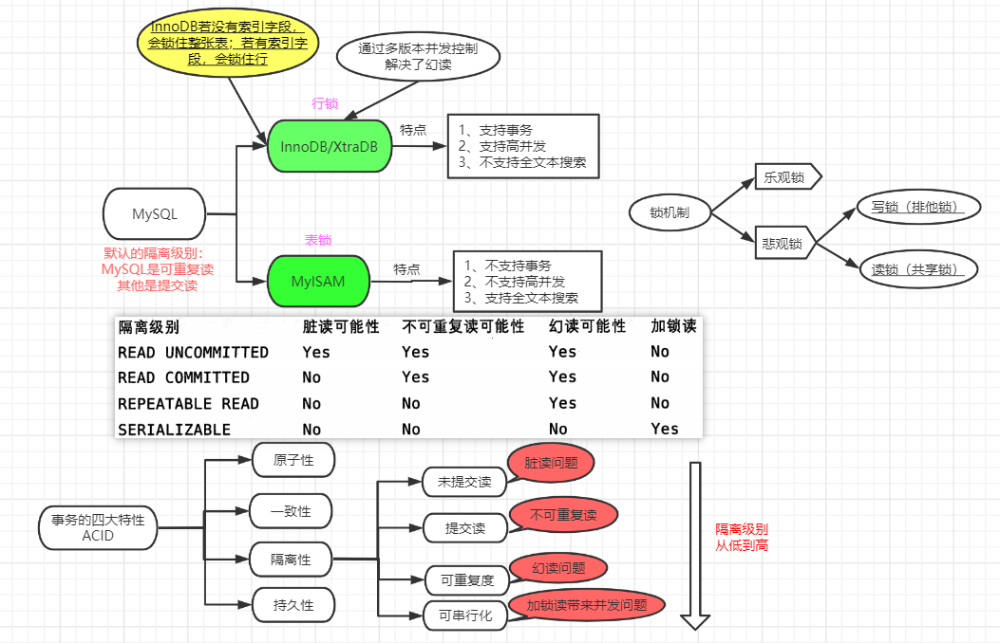

### 6.2.4 多版本并发控制（MVCC）

**InnoDB的MVCC原理**：通过在每行记录后面保存两个隐藏的列来实现MVCC。一个列是保存行的创建时间，一个是保存行的过期时间（或删除时间）。当然，存储的并不是实际的时间指，而是系统版本号。每开始一个新的事务，系统版本号会自动递增；事务开始时刻的系统版本号会作为事务的版本号，用来和查询到的每行记录的版本号进行比较。

在可重复读隔离级别下，MVCC的操作：

1. SELECT： InnoDB只查找版本早于当前事务版本的数据行，这样可以确保事务读取的行，要么是事务开始前已存在，要么是事务自身插入或修改的；行的删除版本要么未定义，要么大于当前事务版本号，可以确保事务读取到的行。在事务开始之前未被删除。
2. INSERT：为新插入的每一行保存当前系统版本号作为行版本号。
3. DELETE：为删除的每一行保存当前系统版本号作为删除标识。
4. UPDATE： InnoDB为插入一行新记录，保存当前系统版本号作为行版本号，同时保存当前系统原来的行作为行删除标识。

MVCC只在可重复读和提交读两个隔离级别下工作。

### 6.2.5 MySQL的存储引擎

查看表的信息：`SHOW TABLE STATUS LIKE '表名'`

#### 6.2.5.1 InnoDB

**InnoDB的特性**：事务型引擎

- 数据存储在表空间中。
- 采用MVCC来支持高并发，实现了四个标准的隔离级别，默认级别是可重复读，并且通过间隙锁策略防止幻读的出现。
- InnoDB表是基于聚族索引建立的。

存储引擎的对比：

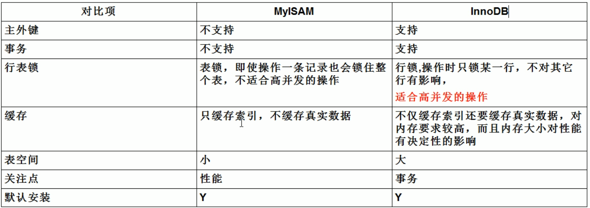

MyISAM与InnoDB的区别：

1. InnoDB支持事务，MyISAM不支持，对于InnoDB每一条SQL语言都默认封装成事务，自动提交，这样会影响速度，所以最好把多条
   SQL语言放在begin和commit之间，组成一个事务。
2. InnoDB支持外键，而MyISAM不支持。对一个包含外键的InnoDB表转为MYISAM会失败。
3. InnoDB是聚集索引，数据文件是和索引绑在一起的，必须要有主键，通过主键索引效率很高。但是辅助索引需要两次查询，先查询到
   主键，然后再通过主键查询到数据。因此，主键不应该过大，因为主键太大，其他索引也都会很大。而MyISAM是非聚集索引，数据文
   件是分离的，索引保存的是数据文件的指针。主键索引和辅助索引是独立的。
4. InnoDB不保存表的具体行数，执行select count(*) from table时需要全表扫描。而MyISAM用一个变量保存了整个表的行数，执行上
   述语句时只需要读出该变量即可，速度很快。
5. Innodb不支持全文索引，而MyISAM支持全文索引，查询效率上MyISAM要高。

#### 6.2.5.2 MyISAM

**MyISAM的特性**：非事务型引擎

- 不支持事务和行级锁，崩溃后无法完全修复。
- 将表存储在两个文件中：数据文件和索引文件。
- **采用表锁策略**。读取时会对所有表加共享锁，写入时则对表加排他锁。
- 可以手工或者自动执行检查和修复操作。
- **支持全文索引（基于分词创建的索引），可以支持复杂的查询**。
- 延迟更新索引键，将索引写入到内存缓冲区中，提升写入性能，缺点是崩溃时会造成索引损坏。

#### 6.2.5.3 MySQL内建的其他引擎

**Archive引擎**：非事务型引擎

- 只支持INSERT和SELECT操作，每次SELECT查询都需要执行全表扫描，但是INSERT时会缓存所有的写，插入时非常快速。
- 支持行级锁和专用的缓冲区，可以实现高并发的插入。

**Memory引擎**：

- 所有的数据都保存在内存中，不需要进行磁盘IO。
- Memory表的结构在重启后还会保留，但数据会丢失。
- Memory表支持Hash索引，查找操作非常快。
- Memory是表级锁，并发写入的性能较低。

### 6.2.6 库表结构优化

#### 6.2.6.1 选择优化的数据类型

**遵循原则**：

1. **尽量选择使用可以正确存储数据的最小数据类型**。
2. **简单数据类型的操作通常需要更少的CPU周期**。
   
   - 整型比字符操作代价更低；
   - 应该使用MySQL内建的类型而不是字符串来存储日期和时间；
   - 应该用整型存储IP地址...
3. **尽量避免NULL（最后指定列为NOT NULL，除非真的需要存储NULL值）**。
   
   - 可为NULL的列使得索引、索引统计和值比较都更复杂；
   - 可为NULL的列会使用更多的存储空间；
   - 通常把可为NULL的列改为NOT NULL带来的性能提升比较小，调优时没有必要首先修改掉这种情况，除非确定这会导致问题；
   - 若计划在列上建索引，应尽量避免设计成可为NULL的列；
- 有一点例外：InnoDB使用单独的位(bit)存储NULL值，故对于稀疏数据有很好的空间效率。
  
4. **选择合理的数据类型**

   4.1 整数类型

   - **MySQL可以为整数类型指定宽度，例如INT(11)，对于大多数应用这是没有意义的**，它不会限制值的合法范围，只是规定了MySQL的一些交互工具用来显示字符的个数。对于存储和计算来说，INT(1)和INT(20)是相同的。

   4.2 实数类型

   - 因为需要额外的空间和计算开销，应该尽量只在对小数进行精确计算时才使用DECIMAL，例如存储财务数据。但在数据量比较大的时候，可以考虑使用BIGINT代替DECIMAL，将需要存储的货币单位根据小数的位数乘以相应的倍数即可，这样可以同时避免浮点存储计算不精确和DECIMAL精确计算代价高的问题。

   4.3 字符串类型

   - **VARCHAR比定长类型更节省空间，它仅使用必要的空间**。有一种例外：若MySQL表使用ROW_FORMAT=FIXED创建的话，每一行都会使用定长存储，这会很浪费空间。
   - **VARCHAR需要使用1或2个额外字节记录字符串的长度**：若列的最大长度小于或等于255个字节，则只使用1个字节标识，否则使用2个字节。如假设采用latin1字符集，一个VARCHAR(10)的列需要11个字节的存储空间；一个VARCHAR(1000)的列则需要1002个字节的存储空间。
   - **VARCHAR由于行是变长的，在UPDATE时可能会带来额外的开销**。VARCHAR适合于以下情形：若字符串的最大长度比平均长度大很多，列的更新很少，所以碎片不是问题；若使用了像UTF-8这样复杂的字符集，每个字符都使用不同的字节数进行存储。
   - **CHAR适合存储很短的字符串，或者所有值都接近同一个长度**。CHAR适用于以下情形：适合存储密码的MD5值；对于经常需要变更的数据，定长的CHAR不容易产生碎片；对于很短的列，CHAR比VARCHAR在存储空间上更有效率，因为VARCHAR需要额外的字节记录字符串的长度。
   - **CHAR会截断（MySQL服务器层进行处理）末尾的空格，而VARCHAR不会**。
   - **使用枚举（ENUM）代替字符串类型**。MySQL在存储枚举时非常紧凑，会根据列表值的数量压缩到一个或者两个字节中；MySQL在内部会将每个值在列表中的位置保存为整数，并且在表的.frm文件中保存"数字-字符串"映射关系的"查找表"。此外，**枚举字段是按照内部存储的整数而不是定义的字符串进行排序的**，绕过这种限制的方式是按照需要的顺序来定义枚举列。

   4.4 日期类型

   - DATETIME和TIMESTAMP列都可以存储相同类型的数据：时间和日期，精确到秒；而**TIMESTAMP只使用DATETIME一半的存储空间**，并且会根据时区变化，具有特殊的自动更新能力；但**TIMESTAMP允许的时间范围要小的多**（TIMESTAMP存储范围为1970-2038年，而DATETIME存储范围为1001-9999年），这有时候会成为障碍。由于空间效率更高，通常应该尽量使用TIMESTAMP。
   - **TIMESTAMP显示的值依赖于时区**。若在多个时区存储或访问数据，TIMESTAMP和DATETIME的行为将很不一样，前者提供的值与时区有关系，后者则保留文本表示的日期和时间。
   - TIMESTAMP有DATETIME没有的特殊行为，在插入时若未指定值，则MySQL会设置值为当前时间。
   - TIMESTAMP列默认为NOT NULL，这也和其他数据类型不一样。

   4.5 位数据类型

   - MySQL 5.0以后，**可以使用BIT列在一列中存储一个或多个true/false值**；BIT(1)定义一个包含单个位的字段，BIT(2)存储2个位...BIT列的最大长度是64个位。
   - MySQL把BIT当作字符串类型，而不是数字类型；当检索BIT(1)的值时，结果是一个包含二进制0或1值的字符串，而不是ASCII码的"0"或"1"。例如，若存储一个值b '00111001'(二进制值等于57)到BIT(8)的列并且检索它，得到的内容是字符码为57的字符串，即得到ASCII码为57的字符串9，但是在数字上下文场景中，得到的是数字57。这令人费解，**应尽可能避免使用BIT数据类型**。

   4.6 选择标识符

   4.7 特殊类型数据

   - 例如IPv4地址，人们经常使用VARCHAR(15)列来存储IP地址；然而，IPv4实际上是32位无符号整数，不是字符串。使用小数点将地址分成4段的表示方法只是为了让人们更易于阅读，故**应该使用无符号整数存储IP地址**，MySQL提供INET_ATON()和INET_NTOA()函数在两种表示方法之间转换。

#### 6.2.6.2 MySQL schema设计陷阱

1. 不要使用太多的列。MySQL存储时需要在服务器层和存储引擎层之间通过行缓冲格式拷贝数据，然后在服务器层将缓冲内容解码成各个列，从行缓冲中将编码过的列传换成行数据结构的操作代价非常高。
2. 不要使用太多的关联。**MySQL限制了每个关联操作最多只能有61张表**。一个经验法则是**：如果希望查询执行得快速且并发性好，单个查询最好在12个表以内做关联**。

3. 不要过度使用枚举。例如：country enum('','0', '1', '2',...,'31')这种设计不可取。
4. 尽可能使用枚举代替SET集合。
5. 尽量避免使用NULL，但是实际业务需求要求使用NULL，那就大胆使用，因为使用神奇常数会导致代码更复杂，也越容易引入Bug。

#### 6.2.6.3 范式与反范式

**范式化的优点**：

1. 更新操作通常比反范式更快。
2. 当数据较好地范式化时，就只有很少或者没有重复数据，故只需修改更少得数据。
3. 范式化得表通常更小，可以更好地放在内存中，故执行操作会更快。
4. 很少有多余的数据意味着检索列表数据时更少需要DISTINCT或者GROUP BY语句。

**范式化的缺点**：

1. 通常需要关联，复杂查询代价昂贵。

**反范式化的优点**：

1. 当数据比内存大时会比关联要快得多，可以避免随机IO。
2. 反范式化的表也能使用更有效的索引策略。

**反范式化的缺点**：

1. 表结构不清晰，有很多重复数据。
2. 插入和删除代价昂贵。

**实际应用：混用范式化与反范式化**：

1. 最常见的反范式化数据的方法是复制或者缓存，在不同的表中存储相同的特定列。
2. 避免完全反范式化带来的插入和删除问题。

#### 6.2.6.4 缓存表和汇总表

**缓存表**：表示存储哪些可以比较简单地从其他表获取（但是每次获取的速度比较慢）数据的表（例如，逻辑上冗余的数据）。

**汇总表**：保存的是使用GROUP BY语句聚合数据的表（例如，数据不是逻辑上冗余的）。

#### 6.2.6.5 加快ALTER TABLE速度

1. 主库切换
2. 影子拷贝
3. 使用ALTER COLUMN
4. 只修改.frm文件
5. 快速创建MyISAM索引

### 6.2.7 索引优化

**索引**：在MySQL中也叫做key，是存储引擎用于快速找到记录的一种数据结构。

**索引的特点**：

- 索引优化应该是对查询性能优化最有效的手段，能够轻易将查询性能提高几个数量级。
- 最优的索引有时比一个好的索引性能要好两个数量级。
- 创建一个真正最优的索引经常需要重写查询。
- 索引可以包含一个或多个列的值。若索引包含多个列，那么列的顺序也十分重要，因为MySQL只能高效地使用索引的最左前缀列。

#### 6.2.7.1 索引的类型

MySQL支持的索引类型：B-Tree索引、哈希索引、R-Tree索引、全文索引...

##### 6.2.7.1.1 B-Tree索引（平衡搜索树）

B-Tree索引（**多路搜索树结构**）适用于全键值、键值范围或键前缀查找，其中键前缀查找只适用于根据最左前缀的查找。**InnoDB引擎使用的是B-Tree索引**。

**B-Tree原理**：多路搜索树结构的实现。

**B-Tree索引的应用**：

1. 全值匹配：指和索引中的所有列进行匹配。
2. 匹配最左前缀。
3. 匹配列前缀。
4. 匹配范围值。
5. 精确匹配某一列并范围匹配另外一列。
6. 只访问索引的查询。
7. 用于查询中的ORDER BY操作（即可用于排序）。
8. 索引中存储了实际的列值，查询获取速度非常快。

**B-Tree索引的限制**：索引列的顺序很重要！

1. 若不是按照索引的最左列开始查找，则无法使用索引。
2. 不能跳过索引中的列。
3. 若查询中有某个列的范围查询，则其右边所有列都无法使用索引优化查询。

##### 6.2.7.1.2 哈希索引

**哈希索引**：基于哈希表实现，只有精确匹配索引所有列的查询才有效。**在MySQL中只有Memory引擎支持哈希索引（如果哈希值相同，会以链表的方式存储），Memory引擎也支持B-Tree索引**。

**哈希索引的原理**：对每一行数据，存储引擎都会对所有的索引列计算出一个哈希码（不同键值的行计算出的哈希码不同）；哈希索引将所有的哈希码存储在索引中，同时在哈希索引表中保存指向每个数据行的指针。

**哈希索引的优点**：结构紧凑、查询速度快。

**哈希索引的限制**：

1. 哈希索引只包含哈希值和行指针，而不存储字段值，**不能使用索引中的值来避免读取行**；但由于访问内存中的行速度很快，故这一点对性能影响并不明显。
2. 哈希索引数据并不是按照索引值顺序存储的，**无法用于排序**。
3. 哈希索引**不支持部分索引列匹配查找**，因为哈希索引始终是使用索引列的全部内容来计算哈希值的。
4. 哈希索引只支持等值比较查询，**不支持任何范围查询**。
5. 当出现哈希冲突时，存储引擎必须遍历**链表**中所有的行指针，逐行进行比较，直到找到所有符合条件的行。
6. 若哈希冲突很多，则索引维护操作的代价会很高。

**自适应哈希索引**：属于InnoDB的一种功能，当InnoDB注意到某些索引值被使用的非常频繁时，会在内存中基于B-Tree索引之上再创建一个哈希索引，这样就让B-Tree索引也具有哈希索引的一些优点，比如快速的哈希查找。但这是一种完全自动的、内部的行为，用户无法控制或配置。

**创建自定义哈希索引**：在B-Tree基础上创建一个伪哈希索引，使用B-Tree进行查找时，是使用哈希值而不是键本身进行索引查找，需要做的就是在WHERE子句中手动指定使用哈希函数，然后采用触发器维护哈希值。常用的生成哈希的函数有CRC32（**若数据表太大，CRC32会产生大量的哈希冲突**），不要使用SHA1和MD5函数来生成哈希值（**字符串太长，会浪费大量空间**），可以使用MD5函数的部分返回值作为哈希值（**会比自己写一个哈希算法的性能要差**），还可以使用FNV64作为哈希函数，其哈希值为64位，速度快，且冲突比CRC32要少很多。

**处理哈希冲突的方法**：为了处理哈希冲突，必须在WHERE子句中带入哈希值和对应列值；若只是进行不精确的统计计数，那可以不带对应列值。

##### 6.2.7.1.3 R-Tree索引

**R-Tree索引**：即空间索引，可以用作地理数据存储。**MyISAM引擎支持空间索引**。

**R-Tree特点**：

1. 无须前缀查询，空间索引会从所有维度来索引数据；
2. 查询时，可以有效地使用任意维度来组合查询；
3. 必须使用MySQL的GIS相关函数如MBRCONTAINS()等来维护数据。

##### 6.2.7.1.4 全文索引

**全文索引**：一种特殊类型的索引，查找的是文本中的关键词，而不是直接比较索引的值。全文索引需要注意的细节有：停用词、词干和复数、布尔搜索等。全文索引更类似于搜索引擎做的事情，而不是简单的WHERE条件匹配。

#### 6.2.7.2 索引的优点

1. 索引大大减少了服务器需要扫描的数据量，可以让服务器快速地定位到表的指定位置。
2. 索引可以帮助服务器避免排序和临时表。
3. 索引可以将随机I/O变为顺序I/O。

#### 6.2.7.3 高性能的索引策略

##### 6.2.7.3.1 独立的列

"独立的列"是指索引列不能是表达式的一部分，也不能是函数的参数；应该始终将索引列单独放在比较符号的一侧。

##### 6.2.7.3.2 前缀索引和索引选择性

- 通过索引开始的部分字符，可以大大节约索引空间，从而提高索引效率，但是会降低**索引的选择性**（不重复的索引值和数据表的记录总数的比值；唯一索引的选择性是1，这是最好的索引选择性，性能也最好）。

- 前缀索引的关键是：保证前缀索引的选择性接近于索引整个列的选择性。

- 确定前缀索引合适长度的方法：

  - 方法一：找到组最常见的值列表，然后和最常见的前缀列表进行比较。
  - 方法二：计算完整列的选择性，并使前缀的选择性接近于完整列的选择性。

  ```sql
  -- 创建前缀索引的方法：以city字段的前7个字符作为前缀索引
  ALTER TABLE sakila.city_demo ADD KEY(city(7))
  ```

- "后缀索引"：例如找到某个域名的所有电子邮件地址。MySQL原生并不支持反向索引，但是可以把字符串反转后存储，并基于此建立前缀索引，可以通过触发器来维护这种索引。
- 前缀索引的优缺点
  - 优点：能使索引更小、更快。
  - 缺点：MySQL无法使用前缀索引做ORDER BY和GROUP BY，也无法使用前缀索引做覆盖扫描。

##### 6.2.7.3.3 多列索引

- 在多个列上建立独立的单列索引大部分情况下并不能提高MySQL的查询性能。
- MySQL 5.0 的索引合并策略**：OR条件的联合**、**AND条件的相交**、**组合前面两种情况的联合及相交**。
- 索引合并策略的使用，恰恰说明表上的索引建得很糟糕，应尽可能避免使用索引合并：
  -  当出现多个AND条件的索引合并时，通常意味着需要一个包含所有相关列的多列索引。
  - 当出现多个OR条件的索引合并时，通常意味着需要耗费大量CPU和内存资源在算法的缓存、排序和合并操作上。

##### 6.2.7.3.4 索引列顺序

- 多列B-Tree索引可以实现精确排序。
- 选择索引列顺序的经验法则：当不考虑排序和分组时，将选择性最高的列放到索引最前列。
- 性能不只依赖于索引索引列的选择性，也和查询条件的具体值有关（也就是和值的分布有关），故可能需要根据那些运行频率最高的查询来调整索引列的顺序，让这种情况下索引的选择性最高。
- 不要假设平均情况下的性能也能代表特殊情况下的性能，特殊情况可能会摧毁整个应用的性能。
- 不要忘记WHERE子句中的排序、分组和范围条件等因素，这些也可对查询的性能造成非常大的影响。

##### 6.2.7.3.5 聚簇索引

**聚簇索引**：并不是一种单独的索引类型，而是一种数据存储方式。**InnoDB的聚簇索引实际上在同一个结构中保存了B-Tree索引和数据行**。当表有聚簇索引时，它的数据行实际上存放在索引的叶子页中，而节点页则只包含索引列（**InnoDB的索引列就是主键列；若没有主键，则InnoDB会选择一个唯一的非空索引代替；若没有唯一的非空索引，则InnoDB会隐式定义一个主键来作为聚簇索引**）。因无法把数据行存放在两个不同的地方，故一个表只能有一个聚簇索引。

**聚簇索引的优缺点**：

- 优点：
  - **可以把相关数据保存在一起**。如实现电子邮箱时，可根据用户ID来聚集数据，这样只需从磁盘读取少数数据页就能获取某个用户的全部邮件；若没有聚簇索引，则每封邮件都可能导致依次磁盘I/O。
  - 数据访问更快。
  - 使用覆盖索引扫描的查询可以直接使用页节点中的主键值。

- 缺点：
  - 聚簇数据最大限度提高了I/O密集型应用的性能，若将数据全部存放在内存中，则聚簇索引就没什么优势了。
  - 插入速度严重依赖于插入顺序。
  - 更新聚簇索引列的代价高昂。
  - 插入新行时，可能会导致"页分裂"问题，而页分裂会导致表占用更多的磁盘空间。
  - 聚簇索引可能会导致全表扫描变慢，对于稀疏表尤其如此。
  - 二级索引访问需要两次索引查找。二级索引叶子节点保存的不是指向行的物理位置的指针，而是行的主键值。对于InnoDB，自适应哈希索引能够减少这样的重复工作。

**注意事项**：

1. 最好避免随机的（不连续且值的分布范围非常大）聚簇索引，特别是对于I/O密集型的应用。如使用UUID（对比AUTO_INCREMENT自增，UUID不仅耗时多，而且占用空间也更大）来作为聚簇索引就会很糟糕，它使得聚簇索引的插入变得完全随机，使得数据没有任何聚集特性。最简单的方法是使用AUTO_INCREMENT自增列作为聚簇索引。

##### 6.2.7.3.6 覆盖索引

**覆盖索引**：如果一个索引包含（或者说覆盖）所有需要查询的字段的值，我们就称之为"覆盖索引"。

**覆盖索引的优点**：

- 索引条目通常远小于数据行的大小，若只需读取索引，那MySQL就会极大地减少数据访问量。
- 索引是按照列值顺序存储的，对于I/O密集型的范围查询会比随机从磁盘读取每一行数据的I/O要少得多。
- 由于InnoDB的聚簇索引，覆盖索引对InnoDB表（特别是InnoDB的二级主键若能够覆盖查询，则可以避免对主键索引的二次查询）特别有用。

**注意事项**：

1. 覆盖索引必须存储索引列的值，而哈希索引、空间索引和全文索引等都不存储索引列的值，所以**MySQL只能使用B-Tree索引做覆盖索引**。
2. MySQL不能在索引中执行LIKE操作，但可以使用延迟关联来解决这一问题。

##### 6.2.7.3.7 使用索引扫描来排序

**索引排序**：若EXPLAIN出来的type列的值为"index"，则说明MySQL使用了索引扫描来做排序。

**注意事项**：

1. MySQL可以使用同一个索引既满足排序，又用于查找行。
2. 只有当索引的列排序和ORDER BY子句的顺序完全一致，并且所有列的排序方向（倒序或正序）都一样时，MySQL才能使用索引来对结果做排序。
3. 若查询需要关联多张表，则只有当ORDER BY子句引用的字段全部为第一个表时，才能使用索引做排序。
4. 索引排序不支持范围查询。
5. 索引排序要么要么都是正序，要么都是逆序。

##### 6.2.7.3.8 压缩索引

**压缩索引**：MyISAM使用前缀压缩来减少索引的大小，从而让更多的索引可以放入内存中，这在某些情况下能极大地提高性能。默认之压缩字符串，可以在CREATE TABLE语句中指定PACK_KEYS参数来控制索引压缩的方式。

**压缩索引原理**：先完全保存索引块中的第一个值，然后将其他值和第一个值进行比较得到相同前缀的字节数和剩余不同后缀的部分，把这部分存储起来即可。

**压缩索引的优缺点**：

- 优点：占用更少的空间。
- 缺点：
  1. 由于每个值的压缩前缀依赖于前面的值，所以MyISAM查找时**无法在索引块使用二分查找**而只能从头开始扫描。
  2. 倒序扫描的速度很慢。
  3. 在块中查找某一行的操作平均都需要扫描半个索引块。

##### 6.2.7.3.9 冗余和重复索引

**重复索引**：指在相同的列上按照相同的顺序创建的相同类型的索引。应该避免这样创建重复索引，发现以后也应该立即移除。

```SQl
-- 举例：用户可能是想创建一个主键，先加上唯一限制，然后再加上索引以供查询使用，但是却在不经意间造成了重复索引
-- 因为MySQL的唯一限制和主键限制都是通过索引实现的，因此下面的写法实际上在相同的列上创建了三个重复的索引（通常这样做没有意义，除非是在同一列上创建不同类型的索引来满足不同的查询需求）
CREATE TABLE test(
	ID INT NOT NULL PRIMARY KEY,
    A INT NOT NULL,
    UNIQUE(ID),
    INDEX(ID)
)ENGINE=InnoDB;
```

**冗余索引**：例如，如创建了索引(A,B)：若再创建索引(A)（**针对B-Tree索引而言，索引(A)是索引(A,B)的前缀索引**）就是冗余索引；若再创建索引(B,A)则不是冗余索引；若再创建索引(B)也不是冗余索引；其他不同类型的索引（如哈希索引或者全文索引）也不会是B-Tree的冗余索引（无论覆盖的索引列是什么）。

**注意事项**：

- 冗余索引通常发生在为表添加新索引的时候。
- 大多数情况下都不需要冗余索引，应该尽量扩展已有索引而不是创建新索引；但若扩展已有索引会导致其变得很大，出于性能考虑也可使用冗余索引。
- 冗余索引会造成INSERT/UPDATE/DELETE速度很慢。

##### 6.2.7.3.10 未使用的索引

分析未使用索引的工具：MariaDB、Percona Toolkit中的pt-index-usage。

##### 6.2.7.3.11 索引和锁

- InnoDB 只有在访问行的时候才会对其加锁，而索引能够减少InnoDB访问的次数，从而减少锁的数量。
- 即使使用了索引，InnoDB也可能锁定一些不需要的数据。

#### 6.2.7.4 索引案例

考虑点：

1. 首先要考虑的事情是需要使用索引来排序，还是先检索数据再排序，使用索引排序会严格限制索引和查询的设计（例如**：如果MySQL使用某个索引进行范围查询，也就无法再使用另一个索引进行排序了**）。
2. 可以在索引中加入更多的列，并通过IN()的方式覆盖那些不在WHERE子句中的列（但不可滥用，因为每增加一个IN()条件，优化器需要做的组合都将以指数形式增长，而这会极大地降低查询性能）。
3. 考虑表上所有的选项，要有大局观。
4. 尽可能将需要做范围查询的列放到索引的后面，以便优化器能使用尽可能多的索引列。
5. 对于范围条件查询（如WHERE...>...），MySQL无法再使用范围后面的其他索引列了，但是对于多个等值条件查询（如WHERE..IN...），则没有限制。

6. 为了实现多个范围条件查询，可以将其他范围条件查询（只保留一个范围条件查询）转换为多个等值条件查询。
7. 使用延迟关联优化排序。

#### 6.2.7.5 维护索引和表

维护表的三个目的：

- 找到并修复损坏的表

  1. 检查是否发生了表损坏：`CHECK TABLE`
  2. 修复损坏的表：`REPAIR TABLE`
  3. 不做任何操作的ALTER操作重建表：`ALTER TABLE 表名 ENGINE=INNODB`（INNODB为当前存储引擎）

- 更新索引统计信息

  1. 获取存储引擎的索引值的分布信息：
     - records_in_range()：通过向存储引擎传入两个边界值获取在这个范围大概有多少条记录（InnoDB是预估值）。
     - info()：返回各种类型的数据，包括索引的基数（每个键值有多少条记录）。

  2. 重新生成信息统计：`ANALYZE TABLE`（MyISAM在分析时需要锁表，InnoDB采用的时取样分析）
  3. 查看索引的基数：`SHOW INDEX FROM 表名`

- 减少索引和数据的碎片

  1. B-Tree索引的碎片化。
  2. 表存储碎片化的三种类型**：行碎片**（数据行被存储为多个地方的多个片段中；InnoDB不会出现行碎片，因为其会移动短小的行并重写到一个片段中）、**行间碎片**（指逻辑上顺序的页、或者行在磁盘上不是顺序存储的）、**剩余空间碎片**（指数据页中有大量的空余空间）。
  3. 减少碎片化的方式：
     - 重新整理数据：`OPTIMIZE TABLE`
     - 先删除、再重新创建索引
     - 不做任何操作的ALTER操作重建表：`ALTER TABLE 表名 ENGINE=INNODB`（INNODB为当前存储引擎）

#### 6.2.7.6 索引总结

选择和编写利用索引的查询时，有以下**三个原则**：

1. 单行访问很慢：可以选择合适的索引避免单行查找
2. 按顺序访问范围数据是很快的：尽可能使用原生顺序从而避免额外的排序操作
3. 索引覆盖查询是很快的：尽可能使用索引覆盖

### 6.2.8 查询优化

#### 6.2.8.1 慢查询

慢查询的分析方向：

1. **确认是否向数据库请求了不需要的数据**。

   典型案例：

   - 查询不需要的记录。解决方法：在查询后面加上LIMIT。

   - 多表关联时返回全部列。解决办法：不要使用未加限定的*。

   - 总是取出全部列。解决办法：严禁使用SELECT *，这会让优化器无法完成索引覆盖，也会带来额外的I/O、内存和CPU的消耗。

   - 重复查询相同的数据。解决方法：使用缓存。

2. **确认MySQL服务层是否在分析大量超过需要的数据行**。

   - 衡量查询开销的3个指标**：响应时间**、**扫描的行数**（检查慢日志是找出扫描行数过多的查询的好办法）、**返回的行数**。
   - 响应时间：服务时间和排队时间之和。
   - 访问类型(type)由慢到快：全表扫描(ALL)、索引扫描(index)、范围扫描(range)、唯一索引扫描(ref)、单值访问(const)...
   - 应用WHERE条件的三种方式（从好到坏依次是）
     - 在索引中使用WHERE条件来过滤不匹配的记录，这是在MySQL存储引擎层完成的。
     - 使用索引覆盖扫描来返回记录，这是在MySQL服务器层完成的，但无须再回表查询记录。
     - 从数据表中返回数据，然后过滤不满足条件的记录，这是在MySQL服务器层完成的。

#### 6.2.8.2 重构查询的方式

1. 一个复杂查询还是多个简单查询：不要害怕使用简单查询，MySQL从设计上让连接和断开连接都很轻量级；在通用服务器上，能够运行每秒超过10万的查询。
2. 切分查询：例如分页查询、分割成小事务。
3. 分解关联查询的优点：
   - 可以让缓存更高效（缓存更精细），减少冗余记录的查询（会减少网络和数据库服务器内存的消耗）
   - 执行单个查询可以减少锁的竞争
   - 在应用层做关联，可以更容易对数据库进行拆分、可扩展性更强
   - 分解后的查询往往效率会更高

#### 6.2.8.3 执行查询的基础

**查询执行路径**：

​		客户端-->MySQL查询缓存-->MySQL解析器-->生成解析树-->预处理器-->解析树-->查询优化器-->查询执行计划-->查询执行引擎-->API调用接口-->存储引擎-->数据。

**查询状态**：`SHOW FULL PROCESSLIST`

1. Sleep：线程正在等待客户端发送新的请求。
2. Query：线程正在执行查询或者正在将结果发送给客户端。
3. Locked：在MySQL服务器层，该线程正在等待表锁（在存储引擎级别实现的锁，如InnoDB的行锁，并不会体现在线程状态中）。
4. Analyzing and statistics：线程正在收集存储引擎的统计信息，并生成查询的执行计划。
5. Copy to temp table：线程正在执行查询，并将其结果集都复制到一个临时表中（这种状态一般要么是在做GROUP BY操作、要么是文件排序操作、或者是UNION操作）。
6. Sorting result：线程正在对结果集进行排序。
7. Sending data：线程可能在多个状态之间传送数据、或者在生成结果集、或者在向客户端返回数据。

**查询缓存**：通过一个对大小写敏感的哈希查找实现的。

**查询优化处理**：

1. 语法解析器和预处理

2. 查询优化器（基于成本预测的优化器）：找出最好的执行计划（此时假设读取任何数据只需依次磁盘I/O）

   MySQL中能够处理的优化类型：

   - 重新定义关联表的顺序

   - 将外连接转化成内连接

   - 使用等价变换规则

   - 优化COUNT()、MIN()、MAX()

   - 预估并转化成为常数表达式

   - 覆盖索引扫描

   - 子查询优化

   - 提前终止查询

   - 等值传播

   - 列表IN()的比较：MySQL中的IN()并不等同于多个OR()子句；**MySQL将IN()列表中的数据先进行排序，然后通过二分查找的方式来确定列表中的值是否满足要求，这是一个O(log n)的操作，等价地转换为OR查询的复杂度为O(n)**，对于IN()列表中有大量取值的时候，MySQL的处理速度将更快。

     ......

**执行计划**：MySQL并不会生成查询字节码来执行查询，而是会生成一颗指令树，然后通过存储引擎执行完成这颗指令树并返回结果，最终的执行树包含了重构查询的全部信息。若对某个查询执行`EXPLAIN EXTENDED`后，再执行`SHOW WARNINGS`就可以看到重构出的查询。**MySQL的执行计划是一颗左侧深度优先的树**。

**关联查询优化器**：通过评估不同顺序的成本来选择一个代价最小的关联顺序。

**排序优化**：排序操作成本高昂，从性能角度考虑，应尽可能避免排序或者尽可能避免对大量数据进行排序。当不能使用索引排序时，MySQL会自己进行排序，数据量小时会在内存中进行，数据量大时会使用磁盘，不过MySQL将这个过程统一称之为**文件排序**。

- MySQL的两种排序算法：
  - 两次传输排序（旧版本使用）
  - 单词传输排序（新版本使用）

**查询执行引擎**：根据执行计划完成整个查询。

#### 6.2.8.4 查询优化器的局限

1. 关联子查询：

   - 不要使用WHERE...IN...嵌套子查询，应该使用JOIN(`INNER JOIN ON`/`LEFT JOIN ON`/`RIGHT JOIN ON`)来进行关联查询，JOIN的执行效率更高。
   - 并不是所有关联查询的性能都会很差；很多时候，关联查询是一种非常合理、自然、甚至是性能最好的写法。
   - 针对含DISTINCT/GROUP BY（会产生临时表）的关联查询，子查询的效果会更高。

2. UNION的限制**：UNION会进行重复值扫描并删除重复值，而UNION ALL不会**

   - 若希望UNION的各个子句能根据LIMIT只取部分结果集，或者希望能先排好序再合并结果集，就需要在UNION的各个子句中分别使用这些子句。

   - 使用UNION时，需要注意从临时表中取出数据的顺序并不是一定的，若想获得正确的顺序，还需加上一个全局的ORDER BY和LIMIT操作。

3. 索引合并优化
4. 等值传递：避免产生一个非常大的IN()列表。
5. 并行执行：MySQL无法利用多核特性来并行执行查询。
6. 哈希关联：MySQL并不支持哈希关联，但是可以创建自定义哈希索引。
7. 松散索引扫描：MySQL不支持松散索引扫描，无法按照不连续的方式扫描一个索引。

```SQL
-- 例如：假设有如下索引(a,b)
-- 有下面的查询：因索引的前导字段是列a,但是在查询中只指定了字段b，导致MySQL无法使用索引，只能通过全表扫描找到匹配的行
SELECT ... FROM tb1 WHERE b BETWEEN 2 AND 3
```

8. 最大值和最小值优化

9. 在同一个表上查询和更新：通过使用生成表的形式达到对同一张表同时进行查询和更新。

```SQL
-- 使用生成表der来达到对同一张表同时进行查询和更新的操作
UPDATE tb1
	INNER JOIN(
    	SELECT type, count(*) AS cnt
        FROM tb1
        GROUP BY type
    ) AS der USING(type)
SET tb1.cnt = der.cnt;
```

#### 6.2.8.5 查询优化器提示（hint）

**查询优化器的提示**：通过在查询中加入相应的提示，可以控制该查询的执行计划。具体请查询MySQL官方手册。

#### 6.2.8.6 优化特定类型的查询

值得指出的是，优化技巧和特定的版本有关，对于未来的MySQL版本未必适用。

##### 6.2.8.5.1 优化COUNT()查询

COUNT()的作用：

1. 统计某个列值的数量（列值非空）
2. 统计行数：使用COUNT(*)的时候，这种情况下通配符\*并不会像我们猜想的那样扩展成所有的列，它会忽略所有的列而直接统计所有的行数。

**常见的错误**：在括号内指定了一个列，却希望统计结果集的行数。若希望知道结果集的行数，最好使用COUNT(*)，这样写意义清晰，性能也会更好。

**注意事项**：

1. 若MySQL知道某列col不可能为NULL值，那么MySQL内部会将COUNT(col)表达式优化为COUNT(*)。
2. 可以使用MyISAM在COUNT(*)全表非常快的整个特性，来加速一些特定条件的COUNT()查询。

```SQL
-- 查询所有ID大于5的城市
SELECT COUNT(*) FROM world.City WHERE ID>5
-- 优化:将扫描行数减少到5行以内
SELECT (SELECT COUNT(*) FROM world.City) - COUNT(*) FROM world.City WHERE ID <= 5

-- 在同一个查询中统计同一个列的不同值的数量，以减少查询的语句量
```

3. 使用COUNT()在同一个查询中统计同一个列的不同值的数量，以减少查询的语句量。

```sql
-- 如统计不同颜色的商品数量
SELECT COUNT(color = 'blue' OR NULL) AS blue, COUNT(color = 'red' OR NULL) AS red FROM items;

-- 使用SUM函数也可以实现同样的功能
SELECT SUM(IF(color = 'blue', 1, 0)) AS blue, SUM(IF(color = 'red', 1, 0)) AS red FROM items;
```

4. 使用近似值;
   - 若业务场景不需要完全精确的COUNT值，可以使用近似值来代替。EXPLAIN出来的优化器估算的行数就是一个不错的近似值，执行EXPLAIN并不需要真正地去执行查询，所以成本很低。
   - 某些场景，可以尝试删除DISTINCT这样的约束来避免文件排序，这样重写后的查询要比精确统计的查询快得多，返回结果近似。

##### 6.2.8.5.2 优化关联查询

1. 确保ON或USING子句中的列上有索引，并且创建索引的时候就要考虑到关联的顺序。一般来说，除非有其他利用，一般只在关联顺序中的第2个表的相应列上创建索引。

```SQL
-- 例如：当表A和表B用列C关联时，如果优化器的关联顺序是B,A，那么就不需在B表的对应列上创建索引。
```

2. 确保任何GROUP BY和ORDER BY中的表达式只涉及到一个表中的列，这样MySQL才有可能使用索引来优化这个过程。
3. 当升级MySQL时需要注意：关联语法、运算符优先级等其他可能会发生变化的地方。

##### 6.2.8.5.3 优化子查询

1. 尽可能（不绝对）使用关联查询替代子查询。

##### 6.2.8.5.4 优化GROUP BY和DISTINCT

1. 最有效的方法是采用索引来优化。
2. 无法使用索引时，在MySQL中，GROUP BY使用两种策略来完成：使用临时表、或者使用文件排序来做分组。这两种策略都可以通过使用提示SQL_BIG_RESULT和SQL_SMALL_RESULT来让优化器按照所希望的方式运行。
3. 若需要对关联查询做分组（GROUP BY），并且是按照查找表中的某个列进行分组，通常采用查找表的标识列分组的效率会比其他列更高。
4. 若没有通过ORDER BY显示指定排序列，当查询使用GROUP BY时，结果集会自动按照分组的字段进行排序；**若不关心结果集的顺序，而这种默认排序又导致了需要文件排序，则可以使用`ORDER BY NULL`，达到让MySQL不再进行文件排序的效果**；也可以在GROUP BY子句中直接使用DESC或ASC关键字，使分组的结果集按需要的方向排序。
5. GROUP BY WITH ROLLUP可以对GROUP BY的结果再做一次超级聚合，但是这会导致文件排序或临时表的产生，最好的办法是**尽可能将WITH ROLLUP功能转移到应用程序中处理**。

##### 6.2.8.5.5 优化LIMIT分页

1. 一个常见又令人头疼的问题是，使用LIMIT分页时，若偏移量非常大（如LIMIT 10000, 20），这时MySQL需要查询10020条记录然后只返回最后20条，前面10000条记录都将被抛弃，这样的代价非常高。一个最简单的优化方法是尽可能地**使用索引覆盖扫描**，而不是查询所有的列，然后根据需要做一次**延迟关联操作**再返回所需的列，对于偏移量很大的分页查询效率提升会非常大。

```SQL
-- LImIT分页优化前
SELECT film_id, description FROM sakila.film ORDER BY title LIMIT 10000, 20;

-- LIMIT分页优化后
SELECT film.film_id, film.description
FROM sakila.film
	INNER JOIN (
    	SELECT film_id FROM sakila.film
        ORDER BY title LIMIT 10000, 20
    ) AS lim USING(film_id);
```

2. 也可以将LIMIT查询转换为已知位置的查询，让MySQL通过**范围扫描**获得到对应的结果。

```sql
-- 若在一个位置列上有索引，并且预先计算出了边界值，则分页查询可以优化为
SELECT film_id, description FROM sakila.film WHERE position BETWEEN 10000 AND 10019 ORDER BY position;
```

3. LIMIT的问题本质上是OFFSET的问题，可以**使用书签记录上次取数据的位置**，下次就可以直接从该书签记录的位置开始扫描，这样就可以避免使用OFFSET（即增加一个where条件查询）。

```SQL
-- 通过记录位置优化LIMIT分页：16030为上一次查询的主键
SELECT * FROM sakila.rental WHERE rental_id < 16030 ORDER BY rental_id DESC LIMIT 20;
```

4. 采用冗余表。

##### 6.2.8.5.6 优化SQL_CALC_FOUND_ROWS

1. 分页时，可以再LIMIT语句中加上SQL_CALC_FOUND_ROWS提示（hint），这样就可以获得去掉LIMIT以后满足条件的行数，因此可以作为分页的总数。将扫描到的所有满足条件的数据存储到缓存中，提升后续的查询速度。

##### 6.2.8.6.7 优化UNION查询

1. MySQL总是通过**创建并填充临时表**的方式来执行UNION查询，因此很多优化策略在UNION查询中都没法很好地使用。经常需要手动地将WHERE、LIMIT、ORDER BY等子句"下推"到UNION的各个子查询中，以便优化器可以充分利用这些条件进行优化。
2. **除非确实需要服务器消除重复的行，否则就一定要使用UNION ALL**；若没有ALL，MySQL会给临时表加上DISTINCT选项，这会导致对整个临时表的数据做唯一性检查，代价非常高昂。

##### 6.2.8.6.8 静态查询分析

使用`Percona Toolkit的pt-query-advisor`能够解析查询日志、分析查询模式，然后给出所有可能存在潜在问题的查询及建议。

##### 6.2.8.6.9 使用用户自定义变量

用户自定义变量是一个用来存储内容的临时容器，在连接MySQL的整个过程中都存在。可以使用SET和SELECT语句来定义它们。

```sql
-- 自定义变量
@one:=1;
@min_actor:=(SELECT MIN(actor_id) FROM sakila.actor);
@last_week:=CURRENT_DATE-INTERVAL 1 WEEK;

-- 使用变量
SELECT ... WHERE col <= @last_week;
```

下面这些场景不能使用用户自定义变量：

1. 使用自定义变量的查询，**无法使用查询缓存**。
2. 不能在使用**常量或标识符**的地方使用自定义变量，例如表名、列名和LIMIT子句中。
3. 自定义变量的生命周期是一个连接中有效，**不能用来做连接间的通信**。
4. 若使用连接池或持久化连接，**自定义变量可能让看起来毫无关系的代码发生交互**。
5. 在MySQL 5.0之前，**大小写敏感**。
6. **不能显式地声明自定义变量的类型**。
7. MySQL优化器在某些场景下可能会将这些**变量优化掉**。
8. 赋值的顺序和赋值的时间点**不固定**，依赖于优化器的决定。
9. 赋值符号:=的**优先级非常低**，所以赋值表达式应该使用明确的括号。
10. **使用未定义变量不会产生任何语法错误**。

**使用场景**：

1. 优化排名语句

```sql
-- 使用变量优化排名语句
SET @curr_cnt := 0, @prev_cnt := 0, @rank := 0;
SELECT actor_id,
	@curr_cnt := cnt AS cnt,
	@rank := IF(@prev_cnt <> @curr_cnt, @rank + 1, @rank) AS rank,
	@prev_cnt := @curr_cnt AS dummy
FROM(
	SELECT actor_id, COUNT(*) AS cnt
    FROM sakila.film_actor
    GROUP BY actor_id
    ORDER BY cnt DESC
    LIMIT 10
) AS der;
```

2. **避免重复查询刚刚更新的数据**

```sql
-- 更新行的同时又希望获得行的信息
UPDATE t1 SET lastUpdated = NOW() WHERE id =1;
SELECT lastUpdated FROM t1 WHERE id = 1;

-- 使用变量优化
UPDATE t1 SET lastUpdated = NOW() WHERE id = 1 AND @now := NOW();
SELECT @now;
```

3. **统计更新和插入的数量**

```sql
-- 这里只是演示变量的用法，MySQL的协议会返回被更改的总行数，所以不需要单独统计这个值
INSERT INTO t1(c1, c2) VALUES(4, 4), (2, 1), (3, 1)
ON DUPLICATE KEY UPDATE
	c1 = VALUES(c1) + ( 0 * ( @x := @x + 1 ))
```

4. 确定取值的顺序

```sql
-- 让变量的赋值和取值发生在执行查询的同一阶段
SET @rownum := 0;
SELECT actor_id, @rownum AS rownum
FROM sakila.actor
WHERE (@rownum := @rownum +1) <= 1;
```

5. **编写偷懒的UNION**

```sql
-- 将第一个子查询作为分支条件先执行，如果找到了匹配的行，则跳过第二个分支
SELECT GREATEST(@found := -1, id) AS id, 'users' AS which_tb1
FROM users WHERE id = 1
UNION ALL
	SELECT id, 'users_archived'
	FROM users_archived WHERE id = 1 AND @found IS NULL
UNION ALL
	SELECT 1, 'reset' 
	FROM DUAL WHERE (@found := NULL) IS NOT NULL;
```

6. 用户自定义变量的其他应用
   - 查询运行时计算总数和平均值
   - 模拟GROUP语句中的函数FIRST()和LAST()
   - 对大量数据做一些数据计算
   - 计算一个大表的MD5散列值
   - 编写一个样本处理函数，当样本中的数值超过某个边界值的时候将其变成0
   - 模拟读/写游标
   - 在SHOW语句的WHERE子句中加入变量值

#### 6.2.8.7 案例

##### 6.2.8.7.1 地理位置信息

MySQL也可以实现地理位置信息，同样，Redis也实现了地理位置信息计算。

```sql
-- 地理位置坐标：(经度, 维度)
-- 现有坐标A(latA, lonA)、B(latB, lonB)，则A和B两点之间的距离计算公式如下(前提假设地球是圆的)
-- R为地球的半径：R=6371km
ACOS( COS(latA) * COS(latB) * COS(lonA-lonB) + SIN(latA) * SIN(latB) ) * R
```

- 附近的人...

解决思路：

1. 先建一个索引过过滤出近似值。
2. 再使用精确条件匹配所有的记录并移除不满足条件的记录。
3. 根据毕达哥拉斯定理来计算地理位置空间距离。

## 6.3 SQL笔试题

### 6.3.1 三大排名函数

1. `dense_rank()`：语法结构为`dense_rank() over(partition by 分组列 order by 排序列 desc)`

2. `row_number()`：语法结构为`row_number() over(partition by 分组列 order by 排序列 desc)`

3. `rank()`：语法结构为`row_number() over(partition by 分组列 order by 排序列 desc)`
   - 在使用`dense_rank()`、`row_number()`、`rank()`函数的时候，over()里头的分组以及排序的执行晚于where、group by、order by的执行。

三种排名函数的区别：以给定的五个成绩为例（99，99，85，80，75）

| 函数名       | 关键词 | 作用                                                         | 排序输出效果  |
| ------------ | ------ | ------------------------------------------------------------ | ------------- |
| dense_rank() | 连续   | 当出现并列结果时，下一个排名应该是下一个连续的整数值，名次之间没有间隔 | 1，1，2，3，4 |
| row_number() | 行号   | 按顺序输出表的行号                                           | 1，2，3，4，5 |
| rank()       | 间隔   | 当出现并列结果时，下一个排名应该像后递增一位，名次之间有间隔 | 1，1，3，4，5 |

> 参考题目：[分数排名问题](https://leetcode-cn.com/problems/rank-scores/)

### 6.3.2 使用IFNULL和LIMIT子句

IFNULL(expression, alt_value)：用于判断第一个表达式是否为NULL，如果为NULL则返回第二个参数的值，如果不为NULL则返回第一个参数的值。

解决第N高的问题：

- 方法一：使用IFNULL+LIMIT
- 方法二：使用临时表+LIMIT
- 方法三：使用DISTINCT+LIMIT

> 参考题目：[第二高的薪水](https://leetcode-cn.com/problems/second-highest-salary/solution/di-er-gao-de-xin-shui-by-leetcode/)

### 6.3.3 自定义函数

定义变量的几种方式：

1. 用户定义的变量（前缀为@）
2. 局部变量（无前缀）
3. 服务器系统变量（以@@为前缀）

`:=`与`=`的区别：

- :=主要用在select中显示行号（循环赋值）
- =主要用于set中赋值

> 参考题目：[第N高的薪水](https://leetcode-cn.com/problems/nth-highest-salary/)

### 6.3.4 join多表连接

join=inner join=from table1, table2

> 参考题目：[连续出现的数字](https://leetcode-cn.com/problems/consecutive-numbers/)、[超过经理收入的员工](https://leetcode-cn.com/problems/employees-earning-more-than-their-managers/)、[上升的温度](https://leetcode-cn.com/problems/rising-temperature/)

### 6.3.5 查找重复的列

解决查找重复项的问题：

- 方法一：使用join自联结
- 方法二：使用group by+临时表
- 方法三：使用group by +having（推荐）

> 参考题目：[查找重复的电子邮箱](https://leetcode-cn.com/problems/duplicate-emails/)

### 6.3.6 in和not in

解决存在/不存在问题：

- 存在：in
- 不存在：not in
- **两个字段的in**

> 参考题目：[从不订购的客户](https://leetcode-cn.com/problems/customers-who-never-order/)、**[部门工资最高的员工](https://leetcode-cn.com/problems/department-highest-salary/)**、

### 6.3.7 delete的语法

delete的新的用法：`DELETE t1 FROM t1 LEFT JOIN t2 ON t1.id=t2.id WHERE t2.id IS NULL;`，官方sql中，`DELETE p1`就表示从p1表中删除满足`WHERE`条件的记录。

> 参考题目：[删除重复的电子邮箱](https://leetcode-cn.com/problems/delete-duplicate-emails/)

### 6.3.8 日期函数

日期相差1：datediff(date1,date2)=1

> 参考题目：[上升的温度](https://leetcode-cn.com/problems/rising-temperature/)


## 6.4 中间件MyCat

分库（垂直拆分）分表（水平拆分）


> 参考博客文章**：[《MySQL必知必会》-已读完](www.highperfmySQL)**、[《正则表达式必知必会》]()、**[关于MySQL可重复读的理解](https://blog.csdn.net/qq_32573109/article/details/98610368)**、**[《高性能MySQL》-已读完前六章]()**、[数据库之六大范式详解](https://blog.csdn.net/weixin_43433032/article/details/89293663)、[MySQL中key和index的区别](https://www.cnblogs.com/zjfjava/p/6922494.html)、[MySQL EXPLAIN type类型说明](https://blog.csdn.net/qq_27676247/article/details/79387637)

# 7 分布式微服务

## 7.1 SpringCloud

本篇是关于SpringCloud+SpringCloud Alibaba的学习总结。

**微服务内容**：

- 服务注册中心：Eureka(已停更)/Zookeeper/Consul/**Nacos**
- 服务调用：Ribbon/LoadBalancer
- 服务调用2： Feign(已停更)/**OpenFeign**
- 服务降级：Hystrix(已停更)/Resilience4j(国外)/**Alibaba Sentinel**(国内)
- 服务网关：Zuul(已停更)/**GateWay**
- 配置中心管理：Config(已停更)/**Nacos**
- 服务总线：Bus(已停更)/**Nacos**
- ...

**SpringCloud**：分布式微服务架构的一站式解决方案，是多种微服务架构落地技术的集合体，俗称微服务全家桶。 微服务一般分为**无业务基础服务**（如全局配置、ID自增器、短链接服务、文件存储服务、身份验证、邮件短信平台、语言回拨...）和业务型基础服务（如：用户中心、账户中心、支付中心、信审系统、信息抓取系统、消息中心、活动广告(CMS)...）。

**版本选型**：SpringBoot 2.2.2+SpringCloud Hoxton SR1+SpringCloud Alibaba 2.1.0+Java 8+Maven 3.5以上+MySql 5.7以上。

1. 查看SpringCloud与SpringBoot大版本对应关系：https://spring.io/projects/spring-cloud#overview

2. 查看SpringCloud与SpringBoot小版本的对应关系：https://start.spring.io/actuator/info。

**参考文档**：

1. https://cloud.spring.io/spring-cloud-static/Hoxton.SR1/reference/htmlsingle/
2. https://www.bookstack.cn/read/spring-cloud-docs/docs-index.md

**设置编码设置**：IDEA-->Settings-->File Encodings

**注解生效激活**：IDEA-->Settings-->Annotation Processors-->Enable annotation processing

**设置编译版本**：java 8

### 7.1.1 项目模块的创建

**项目模块的创建步骤如下**：建Module-->改POM-->写YML-->主启动-->业务类

### 7.1.2 RestTemplate

[官方地址](https://docs.spring.io/spring-framework/docs/5.2.2.RELEASE/javadoc-api/org/springframework/web/client/RestTemplate.html)

RestTemplate：提供了多种便捷访问远程HTTP服务的方法，是一种简单便捷的访问restFul服务模块类，是Spring提供的用于访问rest服务的客户端模板工具集。

### 7.1.3 Hutool工具包

[官方地址](https://hutool.cn/)

Hutool：一个Java工具包类库，对文件、流、加密解密、转码、正则、线程、XML等JDK方法进行封装，组成各种Util工具类。

- 日期工具：通过DateUtil类，提供高度便捷的日期访问、处理和转换方式。
- HTTP客户端：通过HttpUtil对HTTP客户端的封装，实现便捷的HTTP请求，并简化文件上传操作。
- 转换工具：通过Convert类中的相应静态方法，提供一整套的类型转换解决方案，并通过ConverterRegistry工厂类自定义转换。
- 配置文件工具：通过Setting对象，提供兼容Properties文件的更加强大的配置文件工具，用于解决中文、分组等JDK配置文件存在的诸多问题。
- 日志工具：Hutool的日志功能，通过抽象Log接口，提供对Slf4j、LogBack、Log4j、JDK-Logging的全面兼容支持。
- JDBC工具类：通过db模块，提供对MySQL、Oracle等关系型数据库的JDBC封装，借助ActiveRecord思想，大大简化数据库操作。

### 7.1.4 Eureka服务注册与发现

#### 7.1.4.1 服务注册与发现

**服务治理**：SpringCloud封装了Netflix公司开发的Eureka模块来实现服务治理。在传统的RPC远程调用框架中，管理每个服务与服务之间依赖关系比较复杂，所以需要使用服务治理来管理服务与服务之间的依赖关系，可以实现服务调用、负载均衡、容错等，实现服务发现与注册。

**服务注册与发现**：Eureka采用了CS的设计架构，Eureka Server作为服务注册功能的服务器，它是服务注册的中心，而系统中的其他微服务，使用Eureka的客户端连接到Eureka Server并维持心跳连接。这样系统的维护人员就可以通过Eureka Server来监控系统中各个微服务是否正常运行。

在服务注册与发现中，有一个注册中心。当服务器启动的时候，会把当前自己服务器的信息（比如服务地址、通讯地址等）以别名方式注册到注册中心；另一方（消费者|服务提供者）以该别名的方式去注册中心上获取到实际的服务通讯地址，然后再实现本地RPC调用RPC远程调用框架。核心设计思想在于注册中心，因为使用注册中心管理每个服务与服务之间的一个依赖关系（服务治理概念）。在任何RPC远程框架中，都会有一个注册中心（存放服务地址相关信息（接口地址））。

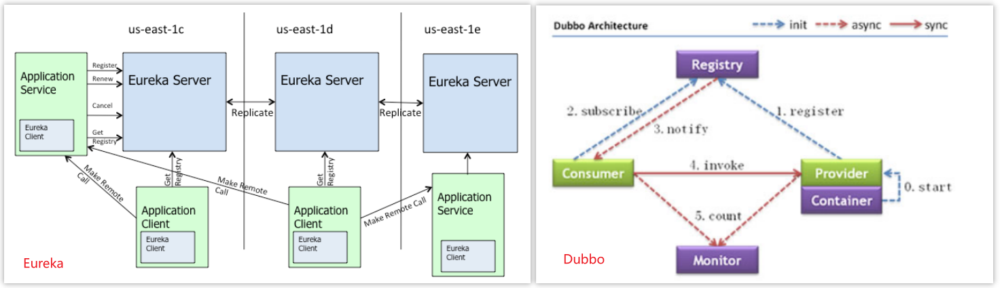

- **Eureka Server**：提供服务注册服务。各个微服务节点通过配置启动后，会在EurekaServer中进行注册，这样EurekaServer中的服务注册表中将会存储所有可用服务节点的信息，服务节点的信息可以在界面中直观看到。

  作用：

  - 服务注册：将服务信息注册进注册中心
  - 服务发现：从注册中心上获取服务信息
  - 实质：存key（服务名），取value（调用地址）

  步骤：

  - 引入依赖`spring-cloud-starter-netflix-eureka-server`

  - 启动类上使用注解@EnableEurekaServer（用于服务注册中心）

  - 配置项：

    ```yaml
    eureka:
      instance:
        hostname: eureka7002.com # Eureka服务端的实例名称
      client:
        register-with-eureka: false # false表示不向注册中心注册自己
        fetch-registry: false # false表示自己就是注册中心，我的职责就是维护服务实例，并不需要去检索服务
        service-url:
          # 设置与Eureka Server交互的地址查询服务和注册服务都需要依赖整个地址
          defaultZone: http://eureka7001.com:7001/eureka/
    ```

- **Eureka Client**：通过注册中心进行访问。一个Java客户端，用于简化Eureka Server的交互，客户端同时也具备一个内置的、使用轮询（round-robin）负载算法的负载均衡器。在应用启动后，将会向Eureka Server发送心跳（默认周期为30秒）。如果Eureka Server在多个心跳周期内没有接收到某个节点的心跳，Eureka Server将会从服务注册表中把整个服务节点移除（默认90秒）。

  - 引入依赖`spring-cloud-starter-netflix-eureka-client`

  - 启动类上使用注解@EnableEurekaClient（用于服务消费者和服务生产者）

  - RestTemplate上使用@LoadBalanced赋予其负载均衡（**默认是轮询**）的能力

  - @EnableDiscoveryClient+`org.springframework.cloud.client.discovery.DiscoveryClient`可用于服务发现（获取服务信息）

  - 配置项：

    ```yml
    eureka:
      client:
        # 表示是否将自己注册进Eureka Server,默认为true
        register-with-eureka: true
        # 是否从Eureka Server抓取已有的注册信息,默认为true。单节点无所谓,集群必须设置为true才能配合Ribbon使用负载均衡
        fetchRegistry: true
        service-url:
          defaultZone: http://eureka7001.com:7001/eureka,http://eureka7002.com:7002/eureka
      # actuator微服务信息完善
      instance:
        instance-id: payment8002 # 主机名称:服务名称修改
        prefer-ip-address: true # 访问信息有IP地址显示（需要引入spring-boot-starter-actuator）
    ```

#### 7.1.4.2 自我保护

**Eureka自我保护**：保护模式主要用于一组客户端和Eureka Server之间存在网络分区场景下的保护。一旦进入保护模式，Eureka Server将会尝试保护其服务注册表中的信息，不再删除服务注册表中的数据，也就是不会注销任何微服务。**简言之**，某时刻某一个微服务不可用了，Eureka不会立刻清理，依旧会对该微服务的信息进行保存（**属于CAP里的AP分支**）。

```properties
# 下面这句话表示Eureka进入了自我保护模式
EMERGENCY! EUREKA MAY BE INCORRECTLY CLAIMING INSTANCES ARE UP WHEN THEY'RE NOT. RENEWALS ARE LESSER THAN THRESHOLD AND HENCE THE INSTANCES ARE NOT BEING EXPIRED JUST TO BE SAFE.
```

**为什么会产生Eureka自我保护机制**？为了防止Eureka Client可以正常运行，但是与Eureka Server网络不通情况下，Eureka Server不会立刻将Eureka Client服务剔除。

**什么是自我保护模式**？默认情况下，若Eureka Server在一定时间内没有接收到某个微服务实例的心跳，Eureka Server将会注销该实例（**默认90秒**）。但是当网络分区故障发生（延时、卡顿、拥挤）时，微服务与Eureka Server之间无法正常通信，以上行为可能变得非常危险了，因为微服务本身其实是健康的，此时本不应该注销这个微服务。Eureka通过"自我保护模式"来解决这个问题——当Eueka Server节点在**短时间内丢失过多客户端**时（可能发生了网络分区故障），那么这个节点就会进入自我保护模式。**自我保护模式是一种应对网络异常的安全保护措施，它的设计哲学是宁可同时保留所有微服务（健康的微服务和不健康的微服务都会保留）也不会盲目注销任何健康的微服务。使用自我保护模式，可以让Eureka Server集群更加的健壮、稳定。**

**怎么禁止自我保护**？

- 自我保护默认是开启的

  ```properties
  # 注册中心Eureka Server将enable-self-preservation设置为false，可以关闭自我保护
  eureka.server.enable-self-preservation=true
  ```

- 客户端向注册中心发送心跳的时间间隔

  ```properties
  # 客户端Eureka Client中可以设置向注册中心Eureka Server发送心跳的时间间隔（默认为30s）
  eureka.instance.lease-renewal-interval-in-seconds=30
  ```

- 注册中心剔除服务的超时时间

  ```properties
  # 客户端Eureka Client中可以设置注册中心Eureka Server剔除服务的时间（默认为90s）
  eureka.instance.lease-expiration-duration-in-seconds
  ```

#### 7.1.4.3 Eureka停更

Netflix公司表示Eureka 2.X停更了。

### 7.1.5 Zookeeper服务注册与发现

Eureka停止更新后，可以使用Zookeeper替代Eureka。

关于Zookeeper注册中心：

- Zookeeper是一个分布式协调工具，可以实现注册中心功能
- 关闭Linux服务器防火墙后启动Zookeeper服务器
- Zookeeper服务器取代Eureka服务器，作为服务注册中心

**使用Zookeeper作为注册中心的步骤**：

- 引入Zookeeper依赖：

  ```xml
  <dependency>
  	<groupId>org.springframework.cloud</groupId>
  	<artifactId>spring-cloud-starter-zookeeper-discovery</artifactId>
  </dependency>
  ```

- 启动类上使用@EnableDiscoveryClient用于向Zookeeper注册服务
  - Zookeeper的服务节点默认是临时的（非持久性的）
  - Zookeeper**属于CAP里的AP分支**

- 配置yml

  ```yml
  server:
    port: 8004 # 8004表示注册到Zookeeper服务器的支付服务提供者端口号
  
  spring:
    application:
      name: cloud-provider-payment # 服务别名，注册Zookeeper到注册中心名称
    cloud:
      zookeeper:
        connect-string: 8.129.65.158:2181 # Zookeeper的IP地址加端口号
  ```

- 服务调用：在RestTemplate上使用@LoadBalanced注解

- 搭建Zookeeper集群？

### 7.1.6 Consul服务注册与发现

[官方地址](https://www.consul.io/)、[中文网站](https://www.springcloud.cc/spring-cloud-consul.html)

**Consul**：一套开源的分布式服务发现和配置管理系统，由HashiCorp公司**用Go语言开发**。提供了微服务系统中的服务治理、配置中心、控制总线等功能，这些功能中的每一个都可以根据需要单独使用，也可以一起使用以构建全方位的服务网络，总之Consul提供了一种完整的服务网格解决方案。它具有很多优点，包括基于raft协议，比较简洁；支持健康检查，**同时支持HTTP和DNS协议支持跨数据中心的WAN集群**，提供图形界面，跨平台，支持Linux、Mac、Windows。Consul的作用：

- 服务发现：提供HTTP和DNS两种发现方式
- 健康检查：支持多种方式，HTTP、TCP、Docker、Shell脚本定制化
- KV存储：Key、Value的存储方式
- 多数据中心：Consul支持多数据中心
- 可视化Web界面

**使用Consul作为注册中心的步骤**：

- 引入依赖

  ```xml
  <dependency>
      <groupId>org.springframework.cloud</groupId>
      <artifactId>spring-cloud-starter-consul-discovery</artifactId>
  </dependency>
  ```

- 下载Consul，启动Consul：`consul agent -dev`

- 启动类上使用@EnableDiscoveryClient用于向Zookeeper注册服务

- 配置yml

  ```yml
  server:
    port: 8006 # Consul服务端口号
  
  spring:
    application:
      name: consul-provider-payment # 服务名称
    cloud:
      consul:
        host: localhost # Consul注册中心地址
        port: 8500
        discovery:
          service-name: ${spring.application.name}
  ```

- 服务调用：在RestTemplate上使用@LoadBalanced注解
- 搭建Consul集群？

### 7.1.7 三个注册中心的异同点

三个注册中心的异同点：

| 组件名    | 语言 | CAP  | 服务健康检查 | 对外暴露接口 | SpringCloud集成 | 社区活跃度        |
| :-------- | :--- | :--- | ------------ | ------------ | --------------- | ----------------- |
| Eureka    | Java | AP   | 可配支持     | HTTP         | 已集成          | 低（2.x版本闭源） |
| Consul    | Go   | CP   | 支持         | HTTP/DNS     | 已集成          | 高                |
| Zookeeper | Java | CP   | 支持         | 客户端       | 已集成          | 中                |
| Nacos     | Java | AP   | 支持         | HTTP         | 已集成          | 高                |

**CAP理论**：即Consistency（强一致性）、Availability（可用性）、Partition tolerance（分区容错性）；CAP理论关注粒度是数据，而不是整体系统设计的策略。一个分布式系统不可能同时很好的满足一致性、可用性及分区容错性这三个需求。因此，根据CAP原理将NoSQL数据库分成了满足CA原则、满足CP原则和满足AP原则三大类。

- CA：单点集群，满足一致性、可用性的系统，通常在可扩展性上不太强大。
- CP：满足一致性，分区容错性的系统，通常性能不是特别高。
- AP：满足可用性、分区容错性的系统，通常可能对一致性要求低一些。

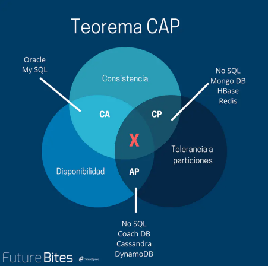

### 7.1.8 Ribbon负载均衡服务调用

**Ribbon**：是Netflix Ribbon实现的一套客户端，用作负载均衡的工具。简单来说，Ribbon是Netflix发布的开源项目，主要功能是提供客户端的软件负载算法和服务调用。Ribbon客户端组件提供一系列完善的配置项如**连接超时**、**重试**等。简言之，就是在配置文件中列出**Load Balancer**（简称LB）后面所有的机器，Ribbon会自动的帮助你基于某种规则（如简单的**轮询**，**随机连接**等）去连接这些机器我们很容里使用Ribbon实现自定义的负载均衡算法。

**Ribbon目前进入了维护模式**。

**负载均衡（Load Balance，简称LB）是什么**？就是将用户的请求平摊的分配到多个服务上，从而达到系统的HA（高可用）；常见的负载均衡软件有Nginx、LVS、硬件F5等。

**Ribbon本地负载均衡客户端 VS Nginx服务端负载均衡的区别**：

- Nginx是服务端负载均衡（**集中式LB**）：客户端所有的请求都会交给Nginx，然后由Nginx实现请求转发，即负载均衡是由服务端实现的。
- Ribbon本地负载均衡（**进程内LB**）：在调用微服务接口的时候，会在注册中心上获取注册信息服务列表之后缓存到JVM本地，从而在本地实现RPC远程服务调用技术。

**集中式LB与进程内LB**：

- 集中式LB：即在服务的消费方和提供方之间使用独立的LB设施（可以是硬件，如F5，也可以是软件，如Nginx），由该设施负责把访问请求通过某种策略转发至服务的提供方。
- 进程内LB：将LB逻辑集成到消费方，消费方从服务注册中心获知有哪些地址可用，然后自己再从这些地址中选择出一个合适的服务器。Ribbon就属于进程内LB，它只是一个类库，集成于消费方进程，消费方通过它来获取到服务提供方的地址。

Ribbon在工作时分为两步：

1. 先选择Eureka Server，它优先选择在同一个区域内负载较少的Server。
2. 再根据用户指定的策略，在从Server取到的服务注册列表中选择一个地址。其中Ribbon提供了多种策略（比如轮询、随机和根据响应时间加权）。

引入依赖：

```xml
<!--spring-cloud-starter-netflix-eureka-client中已经引入了Ribbon（spring-cloud-starter-netflix-ribbon）-->
<dependency>
	<groupId>org.springframework.cloud</groupId>
	<artifactId>spring-cloud-starter-netflix-eureka-client</artifactId>
</dependency>
```

#### 7.1.8.1 RestTemplate的使用

关于RestTemplate的使用：

- 返回对象为响应体中数据转化成的对象，基本上可以理解为Json

  ```java
  @GetMapping("/consumer/payment/get/{id}")
  public ComonResult<Payment> getPayment(@PathVariable("id") Long id){
      return restTemplate.getForObject(PAYMENT_SRV+"/payment/get/"+id, CommonResult.class); 
  }
  ```

- 返回对象为ResponseEntity对象，包含了响应中的一些重要信息，比如响应头、响应状态码、响应体等

  ```java
  @GetMapping("/consumer/payment/getForEntity/{id}")
  public CommonResult<Payment> getPayment2(@PathVariable("id") Long id){
      ResponseEntity<CommonResult> entity = restTemplate.getForEntity(PAYMENT_URL + "/payment/get/" + id, CommonResult.class);
      if (entity.getStatusCode().is2xxSuccessful()){
          return entity.getBody();
      }else{
          return new CommonResult<>(444, "操作失败");
      }
  }
  ```

#### 7.1.8.2 IRule负载均衡规则

**IRule**：根据特定算法从服务列表中选取一个要访问的服务。常用的算法如下：

- RoundRobinRule：轮询
- RandomRule：随机
- RetryRule：先按照RoundRobinRule的策略获取服务，如果获取服务失败则在指定时间内会进行重试
- WeightedResponseTimeRule：对RoundRobinRule的扩展，响应速度越快的实例选择权重越大，越容易被选择
- BestAvailableRule：会先过滤掉由于多次访问故障而处于断路器跳闸状态的服务，然后选择一个并发量最小的服务
- AvailabilityFilteringRule：先过滤掉故障实例，再选择并发较小的实例
- ZoneAvoidanceRule：默认规则，复合判断server所在区域的性能和server的可用性选择服务器

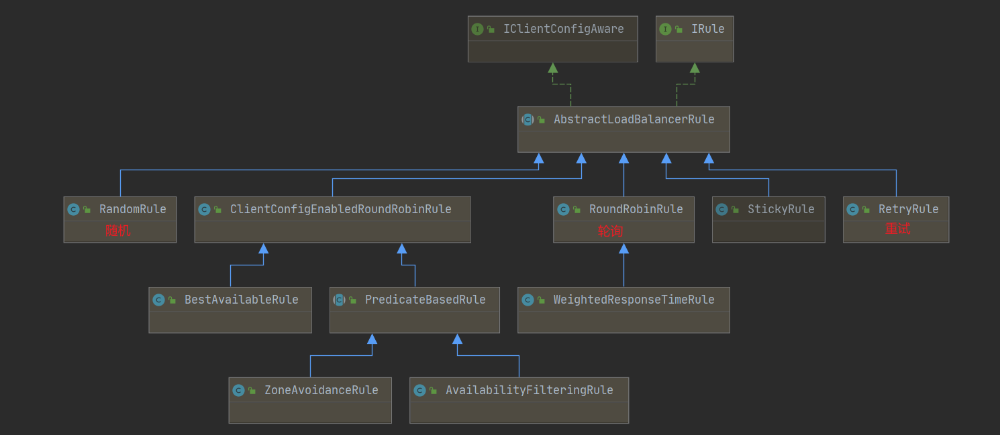

如何替换默认的负载均衡规则？

1. 负载均衡配置类不能放在@ComponentScan所扫描的当前包下以及子包下，否则我们自定义的这个配置类就会被所有的Ribbon客户端所共享，达不到特殊化定制的目的。

2. 新建MySelfRule类

   ```java
   @Configuration
   public class MySelfRule {
       @Bean
       public IRule myRule(){
           //定义为随机
           return new RandomRule();
       }
   }
   ```

3. 主启动类上添加@RibbonClient注解

   ```java
   @RibbonClient(name = "CLOUD-PAYMENT-SERVICE", configuration = MySelfRule.class)
   ```

#### 7.1.8.3 自定义负载均衡算法

**轮询负载均衡算法的原理**：rest接口第几次请求数%服务器集群总数量=实际调用服务器位置下标

- 每次服务重启动后rest接口计数从1开始
- 服务器位置下标从0开始

**自定义负载均衡算法的步骤**：关键是原子变量+CAS+自旋锁

1. 在RestTemplate上去掉@LoadBalanced注解

2. 采用原子变量+CAS+自旋锁定义负载均衡算法

   ```java
   // 定义接口
   public interface LoadBalancer {
       ServiceInstance instances(List<ServiceInstance> serviceInstances);
   }
   
   // 采用原子变量+CAS+自旋锁定义负载均衡算法
   @Component
   public class MyLB implements LoadBalancer {
       private AtomicInteger atomicInteger = new AtomicInteger(0);
       public final int getAndIncrement() {
           int current;
           int next;
           do {
               current = this.atomicInteger.get();
               next = current >= Integer.MAX_VALUE ? 0 :current+1;
           }while (!this.atomicInteger.compareAndSet(current, next));
           System.out.println("*****第几次访问,次数next: "+next);
           return next;
       }
   
       @Override
       public ServiceInstance instances(List<ServiceInstance> serviceInstances) {
           int index = getAndIncrement() % serviceInstances.size();
           return serviceInstances.get(index);
       }
   }
   ```

3. 服务消费者Controller的编写

   ```java
   @GetMapping(value = "/consumer/payment/lb")
   public String getPaymentLB() {
       List<ServiceInstance> instances = discoveryClient.getInstances("CLOUD-PAYMENT-SERVICE");
       if (CollectionUtils.isEmpty(instances)) {
           return null;
       }
       ServiceInstance serviceInstance = loadBalancer.instances(instances);
       URI uri = serviceInstance.getUri();
       System.out.println(uri);
       return restTemplate.getForObject(uri + "/payment/lb", String.class);
   }
   ```

### 7.1.9 OpenFeign服务调用

[官方地址](https://cloud.spring.io/spring-cloud-static/Hoxton.SR1/reference/htmlsingle/#spring-cloud-openfeign)

**OpenFeign**：Feign是一个声明式的web服务客户端，让编写web服务客户端变得非常容易，只需创建一个接口并在接口上添加注解即可。

- Feign指在使编写Java HTTP客户端变得更容易。前面在使用Ribbon+RestTemplate时，利用RestTemplate对HTTP请求的封装处理，形成了一套模板化的调用方法。但是在实际开发中，由于对服务的调用可能不止一处，往往一个接口会被多处调用，所以通常都会针对每个微服务自行封装一些客户端类来包装这些依赖服务的调用。所以，Feign在此基础上做了进一步封装，由它来帮助我们定义和实现依赖服务接口的定义。在Feign的实现下，我们只需创建一个接口并使用注解的方式来配置它（以前是Dao接口上面标注Mapper注解，现在是一个微服务接口上面标注一个Feign注解即可），即可完成对服务提供方的接口绑定，简化了使用SpringCloud Ribbon时，自动封装服务调用客户端的开发量。
- Feign集成了Ribbon，利用Ribbon维护了Payment的服务列表信息，并且通过轮询实现了客户端的负载均衡；而与Ribbon不同的是，通过Feign只需要定义服务绑定接口且以声明式的方法，优雅而简单的实现了服务调用。

**Feign与OpenFeign的区别**：

| Feign                                                        | OpenFeign                                                    |
| ------------------------------------------------------------ | ------------------------------------------------------------ |
| Feign是SpringCloud组件中的一个轻量级RestFul的HTTP服务客户端；Feign内置了Ribbon，用来做客户端负载均衡，去调用服务注册中心的服务。Feign的使用方式是：使用Feign的注解定义接口，调用这个接口，就可以调用服务注册中心的服务。 | OpenFeign是SpringCloud在Feign的基础上支持了SpringMVC的注解，如@RequestMapping等等，OpenFeign的@FeignClient可以解析SpringMVC的@RequestMapping注解下的接口，并通过动态代理的方式产生实现类，实现类中做负载均衡并调用其他服务。 |
| <dependency><br/>    <groupId>org.springframework.cloud</groupId><br/>    <artifactId>spring-cloud-starter-feign</artifactId><br/></dependency> | <dependency><br/>    <groupId>org.springframework.cloud</groupId><br/>    <artifactId>spring-cloud-starter-openfeign</artifactId><br/></dependency> |

#### 7.1.9.1 负载均衡服务调用

**采用OpenFeign实现服务调用的步骤**：

1. 引入依赖

2. 主启动类上添加@EnableFeignClients

3. 编写服务消费者的service层接口：使用@FeignClient注解（**OpenFeign底层采用Ribbon，自带负载均衡配置项，负载均衡切换方法与Ribbon相同**）

   ```java
   @Service
   @FeignClient(value = "CLOUD-PAYMENT-SERVICE")
   public interface PaymentFeignService {
       @GetMapping(value = "/payment/get/{id}")
       public CommonResult<Payment> getPaymentById(@PathVariable("id") Long id);
   }
   ```

4. 编写服务消费者的controller

#### 7.1.9.2 超时控制

超时控制：

- OpenFeign**默认等待1秒钟**，服务端处理超时，会导致Feign客户端报错`java.net.SocketTimeoutException: Read timed out`

- 在配置文件中设置超时控制

  ```yml
  # 设置Feign客户端超时时间（OpenFeign默认支持ribbon）
  ribbon:
  # 指的是建立连接所用的时间，适用于网络状况正常的情况下，两端连接所用的时间
    ReadTimeout: 5000
    # 指的是建立连接后从服务器读取到可用资源所用的时间
    ConnectTimeout: 5000
  ```

#### 7.1.9.3 OpenFeign日志增强

日志增强：OpenFeign提供了日志打印功能，可以通过配置来调整日志级别，从而了解OpenFeign中HTTP请求的细节。简言之，**对Feign接口的调用情况进行监控和输出**。OpenFeign的日志级别：

- NONE：默认的，不显示任何日志
- BASIC：仅记录请求方法、URL、响应状态码及执行时间
- HEADERS：除了BASIC中定义的信息之外，还有请求和响应的头信息

- FULL：除了HEADERS中定义的信息之外，还有请求和响应的正文及元数据

开启日志增强的步骤：

1. 创建配置类

   ```java
   @Configuration
   public class FeignConfig {
       @Bean
       Logger.Level feignLoggerLevel(){
           return Logger.Level.FULL;
       }
   }
   ```

2. 配置yml

   ```yml
   logging:
     level:
       # OpenFeign日志以什么级别监控哪个接口
       com.zcprog.springcloud.service.PaymentFeignService: debug
   ```

### 7.1.10 Hystrix服务降级/熔断/限流

[官方地址](https://github.com/Netflix/Hystrix/wiki/How-To-Use)

**Hystrix已停止更新，进入维护阶段**

**服务雪崩**：多个微服务之间调用的时候，假设微服务A调用微服务B和微服务C，微服务B和微服务C又调用其他的微服务，这就是所谓的"扇出"。如果扇出的链路上某个微服务的调用响应时间过长或者不可用，对微服务A的调用就会占用越来越多的系统资源，进而引起系统崩溃，造成"雪崩效应"。

对于高流量的应用来说，单一的后端依赖可能会导致所有服务器上的所有资源都在几秒钟内饱和。比失败更糟糕的是，这些应用程序还可能导致服务之间的延迟增加，备份队列，线程和其他系统资源紧张，导致整个系统发生更多的级联故障。这些都表示需要对故障和延迟进行隔离和管理，以便单个依赖关系的失败，不能取消整个应用程序或系统。

**雪崩**：通常当你发现一个模块下的某个实例失败后，这时候这个模块依然还会接收流量，然后这个有问题的模块还调用了其他的模块，这样就会发生**级联故障**，或者称为雪崩。

**Hystrix**：一个用于处理分布式系统的延迟和容错的开源库，在分布式系统里，许多依赖不可避免的会调用失败，比如超时、异常等，Hystrix能够保证在一个依赖出问题的情况下，**不会导致整体服务失败，避免级联故障，以提高分布式系统的弹性**。

"断路器"本身是一种开关装置，当某个服务单元发生故障之后，通过断路器的故障监控（类似熔断保险丝），**向调用方返回一个符合预期的、可处理的备选响应（FallBack），而不是长时间的等待或者抛出调用方无法处理的异常**，这样就保证了服务调用方的线程不会被长时间、不必要地占用，从而避免了故障在分布式系统中的蔓延，乃至雪崩。

**Hystrix的用途**：服务降级、服务熔断、服务限流、接近实时的监控...

- **服务降级**：服务器忙，请稍候再试，不让客户端等待并立刻返回一个友好提示，fallback。下面这些情况会发出降级：
  - 程序运行异常
  - 超时
  - 服务熔断触发服务降级
  - 线程池/信号量打满也会导致服务降级

- **服务熔断**：类比保险丝达到最大服务访问后，直接拒绝访问，拉闸限电，然后调用服务降级的方法并返回友好提示。
  - 服务的降级-->进而熔断-->恢复调用链路

- **服务限流**：秒杀高并发等操作，严禁一窝蜂的过来拥挤，大家排队，一秒钟N个，有序进行。

Hystrix的使用：

1. 引入依赖：

   ```xml
   <dependency>
   	<groupId>org.springframework.cloud</groupId>
   	<artifactId>spring-cloud-starter-netflix-hystrix</artifactId>
   </dependency>
   ```

2. 配置yml

   ```yml
   server:
     port: 8001
   
   spring:
     application:
       name: cloud-provider-hystrix-payment
   #    eviction-interval-timer-in-ms: 2000
   
   eureka:
     client:
       register-with-eureka: true # 表示向注册中心注册自己
       fetch-registry: true # 表示需要去检索服务
       service-url:
         #设置与eureka server交互的地址查询服务和注册服务都需要依赖这个地址
   #      defaultZone: http://eureka7001.com:7001/eureka/,http://eureka7002.com:7002/eureka/ # 集群模式
         defaultZone: http://eureka7001.com:7001/eureka/ # 单机模式
   #  server:
   #    enable-self-preservation: false # 关闭自我保护
   ```

3. 在启动类上使用@EnableEurekaClient注解

高并发下导致服务器变慢或宕机/出错的解决方法：

1. 对方服务（8001）超时了，调用者（80）不能一直卡死等待，必须有服务降级
2. 对方服务（8001）宕机了，调用者（80）不能一直卡死等待，必须有服务降级
3. 对方服务（8001）OK，调用者（80）自己出故障或有自我要求（自己的等待时间小于服务提供者），自己处理降级

#### 7.1.10.1 服务降级

**服务降级**：既可以放在客户端，也可以放在服务端；一般建议放在客户端。

**服务端进行服务降级的步骤**：

1. 启动类上添加@EnableCircuitBreaker（或使用@EnableHystrix，@EnableHystrix本质是对@EnableCircuitBreaker的封装）、@EnableEurekaClient

2. Service方法上使用@HystrixCommand（**其对热部署支持不太友好，有时需要重新启动**）

   ```java
   // fallbackMethod：出现异常或者超时后跳转的方法
   @HystrixCommand(fallbackMethod = "paymentInfo_TimeOutHandler", commandProperties = {
           @HystrixProperty(name = "execution.isolation.thread.timeoutInMilliseconds", value = "5000")
   })
   ```

**客户端进行服务降级的步骤**：

1. 开启feign-hystrix

   ```yml
   feign:
     hystrix:
       enabled: true # 开启feign的hystrix支持
   ```

2. 在启动类上添加@EnableHystrix、@EnableFeignClients

3. 控制器方法上使用@HystrixCommand（**其对热部署支持不太友好，有时需要重新启动**）

   ```java
   @GetMapping("/consumer/payment/hystrix/timeout/{id}")
   // fallbackMethod：出现异常或者超时后跳转的方法
   @HystrixCommand(fallbackMethod = "paymentTimeOutFallbackMethod", commandProperties = {
           @HystrixProperty(name = "execution.isolation.thread.timeoutInMilliseconds", value = "1500")
   })
   ```

4. Service接口上使用@FeignClient注解，表示使用OpenFeign进行服务调用

   ```java
   @FeignClient(value = "CLOUD-PROVIDER-HYSTRIX-PAYMENT")
   ```

5. 在控制器类上使用@DefaultProperties可以添加全局降级方法：当控制器方法上使用@HystrixCommand时但未指定降级方法时，全局降级方法生效

   ```java
   // 类上
   @DefaultProperties(defaultFallback = "payment_Global_FallbackMethod")
   
   // 方法上
   @GetMapping("/consumer/payment/hystrix/timeout/{id}")
   @HystrixCommand
   ```

6. 为了实现代码解耦，可以采用在第4步的@FeignClient注解中添加fallback属性（该属性指定的类实现了该Service接口，重写的方法都是降级方法），指定降级方法。**这样处理之后，可以取消代替第3步和第5步**。

   ```java
   @FeignClient(value = "CLOUD-PROVIDER-HYSTRIX-PAYMENT", fallback = PaymentFallbackServer.class)
   ```

#### 7.1.10.2 服务熔断

**熔断机制**：是应对雪崩效应的一种微服务链路保护机制。当扇出链路的某个微服务出错不可用或者响应时间太长时，会进行服务的降级，进而熔断该节点微服务的调用，快速返回错误的响应信息；当检测到该节点微服务调用相应正常后，恢复调用链路；在SpringCloud里，熔断机制通过Hystrix实现，Hystrix会监控微服务间调用的情况，当失败的调用到一定阈值（**缺省是最近10秒内20次调用50%失败**），就会启动熔断机制（使用注解@HystrixCommand）。

**服务熔断的设置**：

```java
// 服务熔断
// 在HystrixCommandProperties.java包含了所有默认配置
@HystrixCommand(fallbackMethod = "paymentCircuitBreaker_fallback", commandProperties = {
        @HystrixProperty(name = "circuitBreaker.enabled", value = "true"),  //是否开启断路器
        @HystrixProperty(name = "circuitBreaker.requestVolumeThreshold", value = "10"),   //请求次数（默认值为20）
        @HystrixProperty(name = "circuitBreaker.sleepWindowInMilliseconds", value = "5000"),  //全开到半开的时间（默认为5000）
        @HystrixProperty(name = "metrics.rollingStats.timeInMilliseconds", value = "10000"),  //滚动时间窗口范围（默认为10000）
        @HystrixProperty(name = "circuitBreaker.errorThresholdPercentage", value = "60"), //失败率达到多少后跳闸（默认为50%）
})
```

**熔断类型**：

- 熔断打开：请求不再进行调用当前服务，内部设置时钟一般为MTTR(平均故障处理时间)，当打开时长达到所设时钟则进入熔断状态
- 熔断关闭：熔断关闭不会对服务进行熔断
- 熔断半开：部分请求根据规则调用当前服务，如果请求成功且符合规则则认为当前服务恢复正常，关闭熔断

**熔断器在什么情况下开始起作用**：涉及到断路器的3个重要参数（快照时间窗、请求总数阈值、错误百分比阈值）

- **快照时间窗**：断路器确定是否打开需要统计一些请求和错误数据，而统计的时间范围就是快照时间窗，**默认为最近的10秒**。
- **请求总数阈值**：在快照时间窗内，必须满足请求总数阈值才有资格熔断。**默认为20次**，意味着在10秒内，如果该Hystrix命令的调用次数不足20次，即使所有的请求都超时或其他原因失败，断路器都不会打开。
- **错误百分比阈值**：当请求总数在快照时间窗口内超过了阈值，比如发生了20次调用，如果在这20次调用中，有10次发生了超时异常，也就是超过50%的错误百分比，在**默认设定50%阈值**情况下，这时候就会将断路器打开。

**断路器开启或者关闭的条件**：

1. 当满足一定阀值的时候（默认10秒内超过20个请求次数）
2. 当失败率达到一定的时候（默认10秒内超过50%请求失败）
3. 到达以上阀值，断路器将会开启
4. 当开启的时候，所有请求都不会进行转发
5. 一段时间之后（**默认是5秒**），这个时候断路器是半开状态，会让其中一个请求进行转发。如果成功，断路器会关闭，若失败，继续开启。重复4和5

**断路器打开之后**：

1. 再有请求调用的时候，将不会调用主逻辑，而是直接调用降级fallback，通过断路器，实现了自动地发现错误并将降级逻辑切换为主逻辑，减少响应延迟的效果。
2. 原来的主逻辑如何恢复呢？当断路器打开，对主逻辑进行熔断之后，Hystrix会启动一个休眠时间窗，在这个时间窗内，降级逻辑是临时的成为主逻辑；当休眠时间窗到期，短路器将进入半开状态，释放一次请求到原来的主逻辑上；如果此次请求正常返回，那么断路器将继续闭合，如果此次请求依然有问题，断路器继续进入打开状态，休眠时间窗重新计时。

**熔断器的所有配置如下**：

```java
@HystrixCommand(fallbackMethod = "paymentCircuitBreaker_fallback",
    groupKey = "strGroupCommand",
    commandKey = "strCommand",
    threadPoolKey = "strThreadPool",
    threadPoolProperties = {
        // 该参数用来设置执行命令线程池的核心线程数，该值也就是命令执行的最大并发量
        @HystrixProperty(name = "coreSize", value = "10"),
        // 该参数用来设置线程池的最大队列大小。当设置为-1时，线程池将使用SynchronousQueue实现的队列，
        // 否则将使用LinkedBlockingQueue实现的队列
        @HystrixProperty(name = "maxQueueSize", value = "-1"),
        // 该参数用来为队列设置拒绝阈值。通过该参数，即使队列没有达到最大值也能拒绝请求。该参数主要是对LinkedBlockingQueue队列的补充，
        // 因为LinkedBlockingQueue队列不能动态修改它的对象大小，而通过该属性就可以调整拒绝请求的队列大小了
        @HystrixProperty(name = "queueSizeRejectionThreshold", value = "5"),
    },
    // 相关属性在HystrixCommandProperties中
    commandProperties = {
        // 设置隔离策略,THREAD表示线程池，SEMAPHORE表示信号池隔离
        @HystrixProperty(name = "execution.isolation.strategy", value = "THREAD"),
        // 当隔离策略选择信号池隔离时，用来设置信号池的大小（最大并发数）
        @HystrixProperty(name = "execution.isolation.semaphore.maxConcurrentRequests", value = "10"),
        // 配置命令执行的超时时间
        @HystrixProperty(name = "execution.isolation.thread.timeoutInMilliseconds", value = "10"),
        // 是否启用超时时间
        @HystrixProperty(name = "execution.timeout.enabled", value = "true"),
        // 执行超时的时候是否中断
        @HystrixProperty(name = "execution.isolation.thread.interruptOnTimeout", value = "true"),
        // 执行被取消的时候是否中断
        @HystrixProperty(name = "execution.isolation.thread.interruptOnFutureCancel", value = "true"),
        // 允许回调方法执行的最大并发数
        @HystrixProperty(name = "fallback.isolation.semaphore.maxConcurrentRequests", value = "10"),
        // 服务降级是否启用，是否执行回调函数
        @HystrixProperty(name = "fallback.enabled", value = "true"),
        // 是否开启断路器
        @HystrixProperty(name = "circuitBreaker.enabled", value = "true"),
        // 该属性用来设置在滚动时间窗中，断路器熔断的最小请求数。例如，默认该值为20的时候，如果滚动时间窗（默认10秒）内收到了19个请求，
        // 即使这19个请求都失败了，断路器也不会打开
        @HystrixProperty(name = "circuitBreaker.requestVolumeThreshold", value = "20"),
        // 该属性用来设置在滚动时间窗中，在请求数量超过50次的情况下，如果错误请求数超过50%，就把断路器设置为"打开"状态，否则就设置为
        // "关闭"状态
        @HystrixProperty(name = "circuitBreaker.errorThresholdPercentage", value = "50"),
        // 该属性用来设置当断路器打开之后的休眠时间窗。休眠时间窗结束之后，会将断路器置为"半开"状态，尝试熔断的请求命令，如果依然失败就
        // 将断路器继续设置为"打开"状态，如果成功就设置为"关闭"状态
        @HystrixProperty(name = "circuitBreaker.sleepWindowInMilliseconds", value = "5000"),
        // 断路器强制打开
        @HystrixProperty(name = "circuitBreaker.forceOpen", value = "false"),
        // 断路器强制关闭
        @HystrixProperty(name = "circuitBreaker.forceClosed", value = "false"),
        // 滚动时间窗设置，该时间用于断路器判断健康度时需要收集信息的持续时间
        @HystrixProperty(name = "metrics.rollingStats.timeInMilliseconds", value = "10000"),
        // 该属性用来设置滚动时间窗统计指标信息时划分"桶"的数量，断路器在收集指标信息的时候会根据设置的时间窗长度拆分成多个"桶"来累计各度
        // 量值，每个"桶"记录了一段时间内的采集指标。比如10秒内拆分成10个"桶"收集这样，所以timeInMilliseconds必须能被numBuckets
        // 整除，否则会抛出异常
        @HystrixProperty(name = "metrics.rollingStats.numBuckets", value = "10"),
        // 该属性用来设置对命令执行的延迟是否使用百分位数来跟踪和计算。若设置为false，那么所有的概要统计都将返回
        @HystrixProperty(name = "metrics.rollingPercentile.enabled", value = "false"),
        // 该属性用来设置百分位统计的滚动窗口的持续时间
        @HystrixProperty(name = "metrics.rollingPercentile.timeInMilliseconds", value = "60000"),
        // 该属性用来设置百分位统计的滚动窗口中使用"桶"的数量
        @HystrixProperty(name = "metrics.rollingPercentile.numBuckets", value = "60000"),
        // 该属性用来设置在执行过程中每个"桶"中保留的最大执行次数。如果在滚动时间窗内发生超过该设定值的执行次数，就从最初的位置开始重写。
        // 例如，将该值设置为100，滚动窗口为10秒，若在10秒内一个"桶"中发生了500次执行，那么该"桶"中只保留最后的100次执行的统计。另外，
        // 增加该值的大小将会增加内存量的消耗，并增加排序百分位数所需的计算时间
        @HystrixProperty(name = "metrics.rollingPercentile.bucketSize", value = "100"),
        // 该属性用来设置采集影响断路器状态的健康快照（请求的成功、错误的百分比）的间隔等待时间
        @HystrixProperty(name = "metrics.healthSnapshot.intervalInMilliseconds", value = "500"),
        // 是否开启请求缓存
        @HystrixProperty(name = "requestCache.enabled", value = "true"),
        // HystrixCommand的执行和事件是否打印日志到HystrixRequestLog中
        @HystrixProperty(name = "requestLog.enabled", value = "true"),
})
```

#### 7.1.10.3 服务限流

可以使用Alibaba的Sentinel来替代。

#### 7.1.10.4 Hystrix工作流程

Hystrix的工作流程图如下：


#### 7.1.10.5 图形化监控

**Hystrix Dashboard**：准实时的调用监控。Hystrix会持续地记录所有通过Hystrix发起的请求的执行信息，并以统计报表和图形的形式展示给用户，包括每秒执行多少请求、多少成功、多少失败等。Netflix通过hystrix-metrics-event-stream项目实现了对以上指标的监控。SpringCloud也提供了Hystrix Dashboard的整合，对监控内容转化成可视化界面。

使用Hystrix Dashboard进行图形化监控的步骤：

1. 引入依赖

   ```xml
   <dependency>
       <groupId>org.springframework.cloud</groupId>
       <artifactId>spring-cloud-starter-netflix-hystrix-dashboard</artifactId>
   </dependency>
   ```

2. 主启动类上添加@EnableHystrixDashboard注解

3. 主启动类中配置ServletRegistrationBean（SpringBoot 2.x才需要）

   ```java
   @Bean
   public ServletRegistrationBean getServlet(){
       HystrixMetricsStreamServlet streamServlet = new HystrixMetricsStreamServlet();
       ServletRegistrationBean registrationBean = new ServletRegistrationBean(streamServlet);
       registrationBean.setLoadOnStartup(1);
       registrationBean.addUrlMappings("/hystrix.stream");
       registrationBean.setName("HystrixMetricsStreamServlet");
       return registrationBean;
   }
   ```

**如何查看该图的信息**：

1. 七色
2. 一圈：即实心圆，共有两种含义。它通过颜色的变化代表了实例的健康程度，他的健康度从绿色<黄色<橙色<红色递减。该实心圆除了颜色的变化之外，它的大小也会根据实例的请求流量发生变化，流量越大该实心圆就越大。所以通过该实心圆的展示，就可以在大量的实例中快速的发现故障实例和高压力实例。
3. 一线：曲线用来记录2分钟流量的相对变化，可以通过它来观察流量的上升和下降趋势。

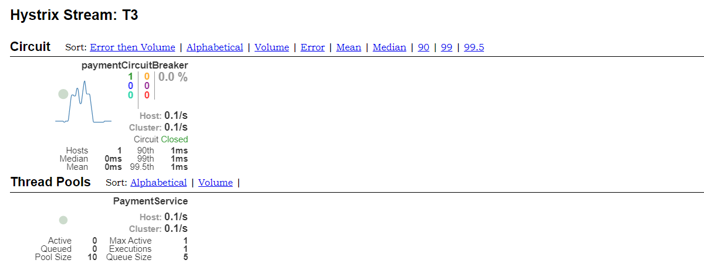

### 7.1.11 Gateway网关

**Gateway（基于异步非阻塞）**：基于Spring5.0+SpringBoot2.0+Project Reactor等技术开发的网关，旨在为微服务架构提供一种简单有效的统一的API路由管理方式。Gateway作为SpringCloud生态系统中的网关，目标是替代Zuul，在SptingCloud2.0以上版本中，没有对新版本的Zuul2.0以上最新高性能版本进行集成，仍然还是使用的Zuul 1.x非Reactor模式的老版本。而为了提升网关的性能，SpringCloud Gateway是基于**WebFlux框架**实现的，而WebFlux框架底层则使用了高性能的Reactor模式通信框架**Netty**。**简言之，Gateway使用的Webflux中的reactor-netty响应式编程组件，底层使用了Netty通讯框架**。

**Gateway的作用**：反向代理、鉴权、流量控制、熔断、日志监控...

**微服务架构中的网关**：

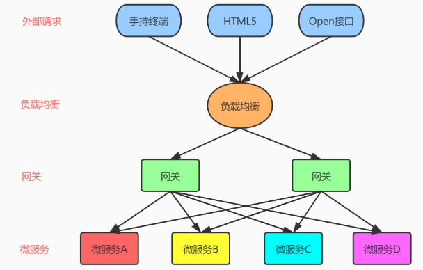

**Gateway具有的特性**：基于Spring5.0+SpringBoot2.0+Project Reactor构建

1. 动态路由：能够匹配任何请求属性
2. 可以对路由指定Predicate（断言）和Filter（过滤器）
3. 集成Hystrix的断路器功能
4. 集成SpringCloud服务发现功能
5. 易于编写的Predicate（断言）和Filter（过滤器）
6. 请求限流功能
7. 支持路径重写

**Gateway与Zuul的区别**：Gateway基于异步非阻塞架构，而Zuul 1.x基于阻塞架构，Zuul 2.x基于Netty的非阻塞和支持长连接

**Gateway的三大核心概念**：

1. 路由（Route）：路由是构建网关的基本模块，它由ID、目标URI、一系列的断言和过滤器组成，如果断言为true则匹配该路由。
2. 断言（Predicate）：参考的是java8的java.util.function.Predicate开发人员可以匹配HTTP请求中的所有内容（例如请求头或请求参数），如果请求与断言相匹配则进行路由。

3. 过滤器（Filter）：指的是Spring框架中GatewayFilter的实例，使用过滤器，可以在请求被路由前或者之后对请求进行修改。

**Gateway的工作流程**：路由转发（包含断言）和执行过来长期链。

1. 客户端向SpringCloud Gateway发出请求，然后在Gateway Handler Mapping中找到与请求相匹配的路由，将其发送到Gateway Web Handler。
2. Handler再通过指定的过滤器链来将请求发送到我们实际的服务执行业务逻辑，然后返回。
3. Filter在"pre"类型的过滤器可以做参数校验、权限校验、流量监控、日志输出、协议转换等；在"post"类型的过滤器中可以做响应内容、响应头的修改，日志的输出，流量监控等有着非常重要的作用。

**Gateway的使用**：

1. 引入依赖（**不需要引入spring-boot-starter-web和spring-boot-starter-actuator**）：除了网关不需引入actuator，其他都需要引入actuator

   ```xml
   <dependency>
       <groupId>org.springframework.cloud</groupId>
       <artifactId>spring-cloud-starter-gateway</artifactId>
   </dependency>
   ```

2. 主启动类上添加@EnableEurekaClient、@EnableDiscoveryClient

3. 进行配置

   ```yml
   server:
     port: 9527
   spring:
     application:
       name: cloud-gateway
     cloud:
       gateway:
         routes:
           - id: payment_routh # 路由的ID，没有固定规则但要求唯一，建议配合服务名
             uri: http://localhost:8001 # 匹配后提供服务的路由地址
             predicates:
               - Path=/payment/get/** # 断言,路径相匹配的进行路由
           - id: payment_routh2
             uri: http://localhost:8001
             predicates:
               - Path=/payment/lb/** # 断言,路径相匹配的进行路由
   eureka:
     instance:
       hostname: cloud-gateway-service
     client:
       service-url:
         register-with-eureka: true
         fetch-registry: true
         defaultZone: http://eureka7001.com:7001/eureka
   ```

**Gateway网关路由有两种配置方式**：

1. 在yml中配置

2. 在配置文件中注入RouteLocator的Bean

   ```java
   @Configuration
   public class GatewayConfig {
       /**
        * 配置了一个id为path_route的路由规则，当访问地址http://localhost:9527/guonei时会自动转发到http://news.baidu.com/guonei
        */
       @Bean
       public RouteLocator customRouteLocator(RouteLocatorBuilder routeLocatorBuilder) {
           RouteLocatorBuilder.Builder routes = routeLocatorBuilder.routes();
           routes.route("path_route", r -> r.path("/guonei").uri("http://news.baidu.com/guonei")).build();
           return routes.build();
       }
   }
   ```

#### 7.1.11.1 动态路由

动态路由：默认情况下Gateway会根据注册中心的服务列表，以注册中心上微服务名为路径创建动态路由进行转发，从而实现动态路由的功能。

修改配置文件：

```yml
spring:
  application:
    name: cloud-gateway
  cloud:
    gateway:
      discovery:
        locator:
          enabled: true # 开启从注册中心动态创建路由的功能,利用微服务名进行路由
      routes:
        - id: payment_routh # 路由的ID，没有固定规则但要求唯一，建议配合服务名
#          uri: http://localhost:8001 #匹配后提供服务的路由地址
          uri: lb://cloud-payment-service # 匹配动态路由
          predicates:
            - Path=/payment/get/** #断言,路径相匹配的进行路由
        - id: payment_routh2
#          uri: http://localhost:8001
          uri: lb://cloud-payment-service # 匹配动态路由
          predicates:
            - Path=/payment/lb/** #断言,路径相匹配的进行路由
```

#### 7.1.11.2 常用断言

常用的断言如下：

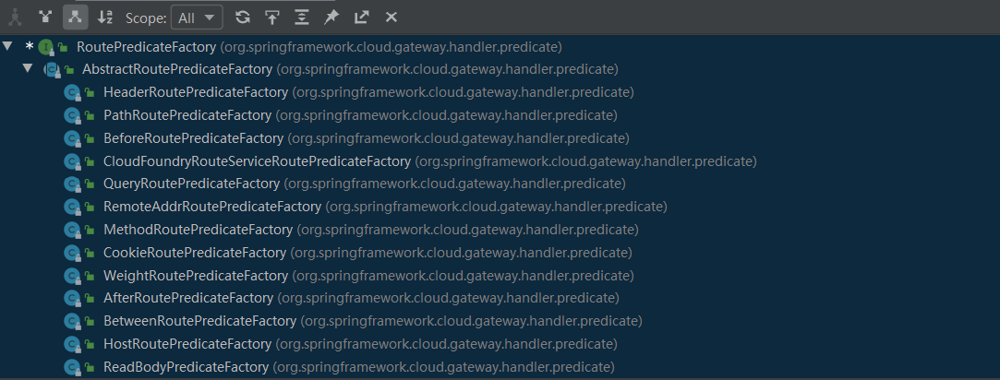

具体配置：[官方地址](https://docs.spring.io/spring-cloud-gateway/docs/current/reference/html/#gateway-request-predicates-factories)

```yml
spring:
  cloud:
    gateway:
      routes:
      - id: after_route
        uri: https://example.org
        predicates:
          # Path Route Predicate
          - Path=/payment/lb/** #断言,路径相匹配的进行路由
        
         # After Route Predicate
         # - After=2021-01-15T22:15:25.348+08:00[Asia/Shanghai] # 这种日期格式可以由ZonedDateTime.now()获得
        
         # Before Route Predicate
         # - Before=2017-01-20T17:42:47.789-07:00[America/Denver]
        
         # Between Route Predicate
         # - Between=2017-01-20T17:42:47.789-07:00[America/Denver], 2017-01-21T17:42:47.789-07:00[America/Denver]
        
         # Cookie Route Predicate：需要两个参数，一个是Cookie name，一个是正则表达式。路由规则会通过对应的Cookie name值和正则表达式
         # 去匹配，如果匹配上就会执行路由，如果没有匹配上则不执行
         # 使用curl工具（类似于postman）进行测试：curl http://localhost:9527/payment/lb --cookie "username=zzyy"
         # - Cookie=username,zzyy
        
         # Header Route Predicate：需要两个参数，一个是属性名称和一个正则表达式，这个属性值和正则表达式匹配则执行
         # 使用curl工具（类似于postman）进行测试：curl http://localhost:9527/payment/lb -H "X-Request-Id:1234"
         # - Header=X-Request-Id, \d+
        
         # Host Route Predicate
         # 使用curl工具（类似于postman）进行测试：curl http://localhost:9527/payment/lb -H "Host:abc.somehost.org"
         # - Host=**.somehost.org,**.anotherhost.org
        
         # Method Route Predicate
         # 使用curl工具（类似于postman）进行测试：curl http://localhost:9527/payment/lb -X GET
         # - Method=GET,POST
         
         # Query Route Predicate
         # 使用curl工具（类似于postman）进行测试：curl http://localhost:9527/payment/lb?username=122
         - Query=username,\d+
```

#### 7.1.11.3 过滤

[官方地址](https://docs.spring.io/spring-cloud-gateway/docs/current/reference/html/#gatewayfilter-factories)

**Gateway的过滤器**：可用于修改进入的HTTP请求和返回的HTTP响应，路由过滤器只能指定路由进行使用。SpringCloud Gateway内置了多种路由过滤器，它们都由GatewayFilter的工厂类来产生。

- 生命周期：pre、post
- 种类：GatewayFilter、GlobalFilter

```yml
spring:
  cloud:
    gateway:
      routes:
      - id: after_route
        uri: https://example.org
        predicates:
          # Path Route Predicate
          - Path=/payment/lb/** #断言,路径相匹配的进行路由
        filters:
          - AddRequestHeader=X-Request-red, blue
```

**自定义全局过滤器GlobalFilter**：实现GlobalFilter和Ordered两个接口。

```java
@Component
@Slf4j
public class MyLogGateWayFilter implements GlobalFilter, Ordered {
    @Override
    public Mono<Void> filter(ServerWebExchange exchange, GatewayFilterChain chain) {
        log.info("*********come in MyLogGateWayFilter: "+new Date());
        String username = exchange.getRequest().getQueryParams().getFirst("username");
        if(StringUtils.isEmpty(username)){
            log.info("*****用户名为Null, 非法用户,(┬＿┬)");
            //给人家一个回应
            exchange.getResponse().setStatusCode(HttpStatus.NOT_ACCEPTABLE);
            return exchange.getResponse().setComplete();
        }
        return chain.filter(exchange);
    }

    /**
     * @return 加载过滤器优先级的顺序,数字越小,优先级越高
     */
    @Override
    public int getOrder() {
        return 0;
    }
}
```

### 7.1.12 Config分布式服务配置

提供类似SpringCloud Config功能的还有阿里巴巴的**Necos**、携程的**Apollo**。

[官方地址](https://docs.spring.io/spring-cloud-config/docs/current/reference/html/)

**Config产生背景**：微服务意味着要将单体应用中的业务拆分成一个个子服务，每个服务的粒度相对较小，因此系统中会出现大量的服务。由于每个服务都需要必要的配置信息才能运行，所以一套集中式的、动态的配置管理设施是必不可少的。

SpringCloud Config为微服务架构中的微服务提供集中化的外部配置支持，配置服务器为各个不同微服务应用的所有环境提供了一个**中心化的外部配置**。

**SpringCloud Config能干什么**？

1. 集中管理配置文件
2. 不同环境不同配置，动态化的配置更新，分环境部署比如dev/test/prod/beta/release
3. 运行期间动态调整配置，不再需要在每个服务部署的机器上编写配置文件，服务会向配置中心统一拉取配置自己的信息
4. 当配置发生变动时，服务不需要重启即可感知到配置的变化并应用新的配置
5. 将配置信息以REST接口的形式暴露：post、curl访问刷新均可....

**SpringCloud Config与Github整合配置**：由于SpringCloud Config默认使用Git来存储配置文件（也有其它方式，比如支持svn和本地文件，但最推荐的还是Git，而且使用的是http/https访问的形式）

#### 7.1.12.1 服务端

SpringCloud Config服务端的使用：

1. 引入依赖

   ```xml
   <dependency>
       <groupId>org.springframework.cloud</groupId>
       <artifactId>spring-cloud-config-server</artifactId>
   </dependency>
   ```

2. 创建Git仓库：springcloud-config

3. 配置yml

   ```yml
   server:
     port: 3344
   
   spring:
     application:
       name: cloud-config-center # 注册进Eureka服务器的微服务名
     cloud:
       config:
         server:
           git:
             uri: https://github.com/progzc/springcloud-config.git # 存放配置文件的github路径
             search-paths:
               - springcloud-config
         label: main
   
   eureka:
     client:
       service-url:
         defaultZone: http://localhost:7001/eureka
   ```

4. 主启动类上使用@EnableConfigServer、@EnableEurekaClient

**配置文件读取规则**：

- /{application}/{profile}[/{label}]

  ```yml
  http://config-3344.com:3344/config/dev/main
  ```

- /{application}-{profile}.yml

  ```yml
  # 验证失败-Why?
  http://config-3344.com:3344/config-dev.yml 
  ```

- **/{label}/{application}-{profile}.yml**

  ```yml
  # 推荐采用这种方法配置文件读取规则
  http://config-3344.com:3344/main/config-dev.yml
  ```

- /{application}-{profile}.properties

- /{label}/{application}-{profile}.properties

#### 7.1.12.2 客户端

SpringCloud Config客户端的使用：

1. 引入依赖

   ```xml
   <dependency>
       <groupId>org.springframework.cloud</groupId>
       <artifactId>spring-cloud-starter-config</artifactId>
   </dependency>
   ```

2. 配置bootstrap.yml

   **application.yml是用户级的资源配置项；bootstrap.yml是系统级的，优先级更高**。

   - SpringCloud会创建一个"Bootstrap Context"，作为Spring应用的"Application Context"的父上下文。初始化的时候，"Bootstrap Context"负责从外部源加载配置属性并解析配置。这两个上下文共享一个从外部获取的"Environment"。
   - Bootstrap属性有高优先级，默认情况下，它们不会被本地配置覆盖。"Bootstrap Context"和"Application Context"有着不同的约定，所以新增了一个"bootstrap.yml"文件，保证"Bootstrap Context"和"Application Context"配置的分离。
   - 客户端模块的application.yml要改为bootstrap.yml。

   ```yml
   server:
     port: 3355
   
   spring:
     application:
       name: config-client
     cloud:
       # 配置客户端访问的中心配置文件地址：http://config-3344.com:3344/main/config-dev.yml
       config:
         label: main # 分支名称
         name: config # 配置文件名称
         profile: dev # 读取后缀
         uri: http://localhost:3344 # 服务端地址
   
   eureka:
     client:
       service-url:
         defaultZone: http://eureka7001.com:7001/eureka
   ```

3. controller从服务读取配置中心（Github）上的配置文件内容

   ```java
   @RestController
   public class ConfigClientController {
       @Value("${config.info}")
       private String configInfo;
   
       @GetMapping("/configInfo")
       public String getConfigInfo() {
           return configInfo;
       }
   }
   ```

#### 7.1.12.3 客户端动态刷新

**背景**：修改配置中心（Github）上的配置文件后，服务端可以动态加载变更后的配置文件，但是客户端不能动态加载变更后的配置文件（只能重新启动才能加载更新后的文件），这在生产环境下是不允许的，因此有必要实现客户端的动态刷新。

使客户端动态刷新的步骤：避免了服务重启

1. 修改客户端的bootstrap.yml文件

   ```yml
   # 添加暴露监控端点
   management:
     endpoints:
       web:
         exposure:
           include: "*"
   ```

2. 在客户端业务类（本例是Controller）上添加@RefreshScope注解

3. 运维人员每次修改配置中心文件后，需要发送Post请求给客户端，通知其进行刷新

   ```bash
   curl http://localhost:3355/actuator/refresh -X POST
   ```

   **带来的问题**：若存在很多客户端，那么每次更新配置文件后都需要发送很多次POST请求给对应的客户端，这样的解决方式不优雅，可以采用Bus消息总线解决这一问题。

### 7.1.13 Bus消息总线

关于RabbitMq的常见命令：

```bash
systemctl start rabbitmq-server # 启动RabbitMQ服务器进程
systemctl enable rabbitmq-server # 在引导时自动启动RabbitMQ
systemctl status rabbitmq-server # 检查RabbitMQ服务器的状态
systemctl stop rabbitmq-server # 停止RabbitMQ服务器进程
rabbitmq-plugins enable rabbitmq_management # 启动RabbitMQ Web管理控制台
chown -R rabbitmq:rabbitmq /var/lib/rabbitmq/ # 将RabbitMQ文件的所有权提供给RabbitMQ用户
rabbitmqctl add_user admin StrongPassword # 创建admin用户名及密码
rabbitmqctl set_user_tags admin administrator # 分组
rabbitmqctl set_permissions -p / admin “.*” “.*” “.*” # 给admin用户授权
rabbitmqctl change_password  admin  'Newpassword' # 修改admin用户密码
```

**SpringCloud Bus**：用来将分布式系5统的节点与轻量级消息系统链接起来的框架（与SpringCloud Config结合可以实现配置的分布式动态刷新），它整合了Java的事件处理机制和消息中间件的功能，SpringCloud Bus目前支持RabbitMQ和Kafka。

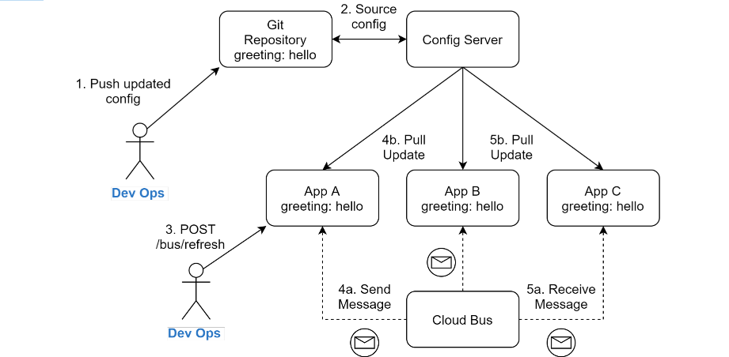

**SpringCloud Bus的能干什么**：Bus能管理和传播分布式系统间的消息，就像一个分布式执行器，可用于广播状态更改、事件推送等，也可以当作微服务间的通信通道。

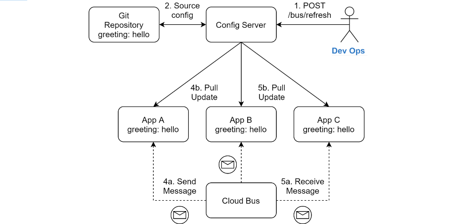


**什么是总线**：在微服务架构的系统中，通常会使用轻量级的消息代理来构建一个共用的消息主题，并让系统中所有微服务实例都连接上来。由于该主题中产生的消息会被所有实例监听和消费，所以称它为消息总线。在总线上的各个实例，都可以方便地广播一些需要让其他连接在该主题上的实例都知道的消息。

**总线的基本原理**：ConfigClient实例都监听MQ中同一个Topic（默认是SpringCloudBus），当一个服务刷新数据的时候，它会把这个消息放入到Topic中，这样其他监听同一个Topic的服务就能得到通知，然后去更新自身的配置。

**有两种通知机制**：

1. 利用消息总线触发一个客户端/bus/refresh，进而刷新所有客户端的配置
2. 利用消息总线触发一个服务端ConfigServer的/bus/refresh端点，进而刷新所有客户端的配置（优于第一种通知机制）

#### 7.1.13.1 动态刷新之全局广播

动态刷新全局广播的实现步骤：

1. 引入依赖

   ```xml
   <!--服务端引入依赖-->
   <dependency>
       <groupId>org.springframework.cloud</groupId>
       <artifactId>spring-cloud-starter-bus-amqp</artifactId>
   </dependency>
   <dependency>
       <groupId>org.springframework.cloud</groupId>
       <artifactId>spring-cloud-config-server</artifactId>
   </dependency>
   <dependency>
       <groupId>org.springframework.cloud</groupId>
       <artifactId>spring-cloud-starter-netflix-eureka-client</artifactId>
   </dependency>
   <!--客户端引入依赖-->
   <dependency>
       <groupId>org.springframework.cloud</groupId>
       <artifactId>spring-cloud-starter-bus-amqp</artifactId>
   </dependency>
   <dependency>
       <groupId>org.springframework.cloud</groupId>
       <artifactId>spring-cloud-starter-config</artifactId>
   </dependency>
   <dependency>
       <groupId>org.springframework.cloud</groupId>
       <artifactId>spring-cloud-starter-netflix-eureka-client</artifactId>
   </dependency>
   ```

2. 服务端配置application.yml，客户端配置bootstrap.yml

   ```yml
   # 服务端配置application.yml
   server:
     port: 3344
   
   spring:
     application:
       name: cloud-config-center # 注册进Eureka服务器的微服务名
     cloud:
       config:
         server:
           git:
             uri: https://github.com/progzc/springcloud-config.git # 存放配置文件的github路径
             search-paths:
               - springcloud-config
         label: main
     rabbitmq:
       host: 8.129.65.158 # 不要配置成http://8.129.65.158
       port: 5672 # 15672是web管理界面的端口，5672是MQ访问的端口
       username: admin
       password: admin123
   
   eureka:
     client:
       service-url:
         defaultZone: http://eureka7001.com:7001/eureka
   
   # 暴露监控端点
   management:
     endpoints:
       web:
         exposure:
           include: "bus-refresh"
   #-------------------------------------------------------分割线-----------------------------------------------------------
   # 客户端配置bootstrap.yml
   server:
     port: 3355 # 客户端1配置3355，客户端2配置3366
   
   spring:
     application:
       name: config-client
     cloud:
       # 配置客户端访问的中心配置文件地址：http://config-3344.com:3344/main/config-dev.yml
       config:
         label: main # 分支名称
         name: config # 配置文件名称
         profile: dev # 读取后缀
         uri: http://localhost:3344 # 服务端地址
     rabbitmq:
       host: 8.129.65.158 # 不要配置成http://8.129.65.158
       port: 5672 # 15672是web管理界面的端口，5672是MQ访问的端口
       username: admin
       password: admin123
   
   eureka:
     client:
       service-url:
         defaultZone: http://eureka7001.com:7001/eureka
   
   # 暴露监控端点
   management:
     endpoints:
       web:
         exposure:
           include: "*"
   ```

3. 服务端主启动类上添加@EnableConfigServer、@EnableEurekaClient；客户端上添加@EnableEurekaClient

4. 修改Github上的配置文件config-dev

5. 使用curl像服务端发送POST请求，则会动态刷新客户端

   ```bash
   curl http://localhost:3344/actuator/bus-refresh -X POST
   ```

#### 7.1.13.2 动态刷新之定点通知

**定点通知**：修改Github上的配置文件后，不想全部通知（即全局广播），只想通知某些特定的客户端。

实现步骤与全局广播大体相同，区别在最后一步：使用curl像服务端发送POST请求，并指定生效的客户端

```bash
# /bus/refresh请求不再发送到具体的服务实例上，而是发给config server并通过destination参数类指定需要更新配置的服务或实例
# destination参数为"微服务名:端口号"
curl http://localhost:3344/actuator/bus-refresh/{destination} -X POST

# 举例：更新Github上的配置文件后，只想通知3355，不想通知3366，可以这样操作
curl http://localhost:3344/actuator/bus-refresh/config-client:3355 -X POST
```

### 7.1.14 Stream消息驱动

[官方地址](https://spring.io/projects/spring-cloud-stream#overview)、[中文指导手册](https://m.wang1314.com/doc/webapp/topic/20971999.html)

**SpringCloud Stream**：屏蔽底层消息中间件的差异，降低切换成本，统一消息的编程模型。**通过定义绑定器作为中间层，完美地实现了应用程序与消息中间件细节之间的隔离；通过向应用程序暴露统一的Channel通道，使得应用程序不需要再考虑各种不同的消息中间件实现**。Stream中的消息通信方式遵循了发布-订阅模式，通过Topic主题进行广播（在RabbitMq中Topic就是Exchange，在Kafka中就是Topic）

官方定义SpringCloud Stream是一个构建消息驱动微服务的框架。应用程序通过inputs或者outputs来与SpringCloud Stream中binder对象交互。通过我们配置来binding（绑定），而SpringCloud Stream的**binder对象**负责与消息中间件交互。所以，我们只需要搞清楚如何与SpringCloud Stream交互就可以方便使用消息驱动的方式。

通过使用Spring Integration来连接消息代理中间件以实现消息事件驱动。SpringCloud Stream为一些供应商的消息中间件产品提供了个性化的自动化配置实现，引用了**发布-订阅**、**消费组**、**分区**的三个核心概念。**目前仅支持RabbitMq、Kafka**。

**Stream中的几个主要概念**：

1. Binder：很方便的连接中间件，屏蔽差异
2. Channel：通道，是队列Queue的一种抽象，在消息通讯系统中就是实现存储和转发的媒介，通过对Channel对队列进行配置
3. Source/Sink：简单的可理解为参照对象是Spring Cloud Stream自身，从Stream发布消息就是输出，接受消息就是输入

**编码API和常用注解**：

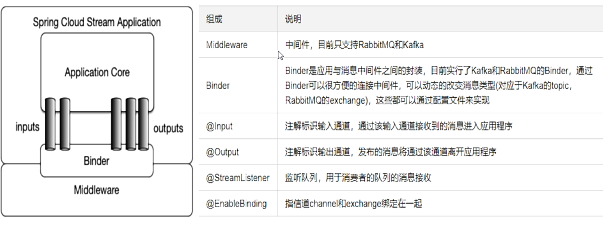

#### 7.1.14.1 生产者与消费者

常用的生产者与消费者模型：

1. 引入依赖：生产者、消费者引入依赖相同

   ```xml
   <dependency>
       <groupId>org.springframework.cloud</groupId>
       <artifactId>spring-cloud-starter-stream-rabbit</artifactId>
   </dependency>
   <dependency>
       <groupId>org.springframework.cloud</groupId>
       <artifactId>spring-cloud-starter-netflix-eureka-client</artifactId>
   </dependency>
   ```

2. 配置application.yml：生产者与消费者配置大体相似（**生产者与消费者配置不同的地方使用###注释**）

   ```yml
   server:
     port: 8801 ### 生产者为8001，消费者为8802
   
   spring:
     application:
       name: cloud-stream-provider ### 生产者为cloud-stream-provider，消费者为cloud-stream-consumer
     cloud:
       stream:
         binders: # 在此处配置要绑定的rabbitmq的服务信息；
           defaultRabbit: # 表示定义的名称，用于于binding整合
             type: rabbit # 消息组件类型
             environment: # 设置rabbitmq的相关的环境配置
               spring:
                 rabbitmq:
                   host: 8.129.65.158 # 不要配置成http://8.129.65.158
                   port: 5672 # 15672是web管理界面的端口，5672是MQ访问的端口
                   username: admin
                   password: admin123
         bindings: # 服务的整合处理
           # 与消费者唯一的区别在这里
           output: ### 这个名字是一个通道的名称，生产者为output，消费者为input
             destination: studyExchange # 表示要使用的Exchange名称定义
             content-type: application/json # 设置消息类型，本次为json，文本则设置“text/plain”
             binder: defaultRabbit # 设置要绑定的消息服务的具体设置
     # 解决Rabbit health check failed
     rabbitmq:
       host: 8.129.65.158 # 不要配置成http://8.129.65.158
       port: 5672
       username: admin
       password: admin123
   
   eureka:
     client: # 客户端进行Eureka注册的配置
       service-url:
         defaultZone: http://eureka7001.com:7001/eureka
     instance:
       lease-renewal-interval-in-seconds: 2 # 设置心跳的时间间隔（默认是30秒）
       lease-expiration-duration-in-seconds: 5 # 如果现在超过了5秒的间隔（默认是90秒）
       instance-id: send-8801.com  ### 在信息列表时显示主机名称,生产者为send-8801.com，消费者为receive-8802.com
       prefer-ip-address: true     # 访问的路径变为IP地址
   ```

3. 生产者与消费者主启动类上使用@EnableEurekaClient

4. 生产者业务类中使用@EnableBinding(Source.class)+MessageChannel bean

   ```java
   // @EnableBinding底层包含@Component
   @EnableBinding(Source.class) //定义消息的推送管道
   public class MessageProviderImpl implements IMessageProvider {
       @Resource
       private MessageChannel output; // 消息发送管道
   
       @Override
       public String send() {
           String serial = UUID.randomUUID().toString();
           output.send(MessageBuilder.withPayload(serial).build());
           System.out.println("*****serial: " + serial);
           return null;
       }
   }
   ```

5. 消费者业务类上使用@EnableBinding(Sink.class)+@StreamListener(Sink.INPUT)+Message bean

   ```java
   // @EnableBinding底层包含@Component
   @EnableBinding(Sink.class) //定义消息的接收管道
   public class ReceiveMessageListenerController {
       @Value("${server.port}")
       private String serverPort;
   
       @StreamListener(Sink.INPUT)
       public void input(Message<String> message) {
           System.out.println("消费者1号，接受："+message.getPayload()+"\t port:"+serverPort);
       }
   }
   ```

#### 7.1.14.2 重复消费

**重复消费**：若存在多个消费者，则需要注意重复消费的问题（**这是由于默认分组（即组流水号）是不同的**）。

**解决方法**：可以使用Stream中的**消息分组**来解决（**自定义配置分为同一个组，解决重复消费问题**）

- 在Stream中处于同一个group中的多个消费者是竞争关系，能够保证消息只会被其中一个应用消费一次。同一个组内会发生竞争关系，只有其中一个可以消费。
- 不同组是可以全面消费的（重复消费）。

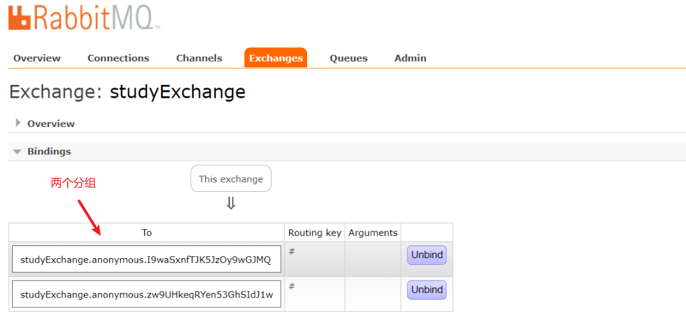

**解决方法**：若不想重复消费，则需在yml配置文件中配置相同的分组名称。

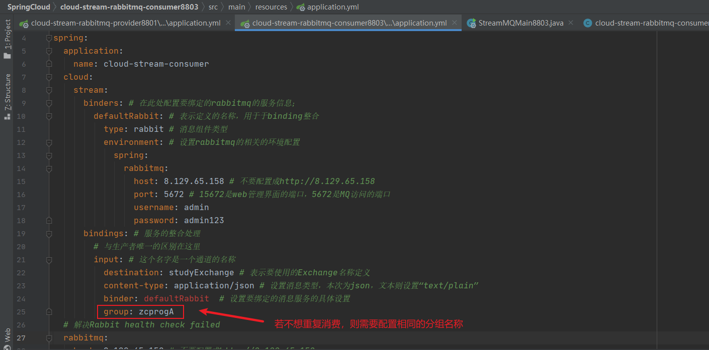

#### 7.1.14.3 消息的持久化

在yml中配置group分组后，可以解决消息的持久化，即当消费者宕机后重新启动时，会从RabbitMQ中消费消息，不会造成消息的丢失。

### 7.1.15 Sleuth分布式请求链路跟踪

[官方地址](https://docs.spring.io/spring-cloud-sleuth/docs/current-SNAPSHOT/reference/html/)

**Sleuth产生背景**：在微服务框架中，一个由客户端发起的请求在后端系统中会经过多个不同的服务节点调用来协同产生最后的请求结果，每一个前段请求都会形成一条复杂的分布式服务调用链路，链路中的任何一环出现高延时或错误都会引起整个请求最后的失败。

**SpringCloud Sleuth**：提供了一套完整的服务跟踪的解决方案，在分布式系统中提供追踪解决方案并且兼容支持了**zipkin dashboard**。

**zipkin**：SpringCloud从F版起已不需要自己构建Zipkin Server了，只需要调用jar包即可。在[下载地址](https://dl.bintray.com/openzipkin/maven/io/zipkin/java/zipkin-server/)下载`zipkin-server-2.12.9-exec.jar`，下载完成后直接运行`java -jar zipkin-server-2.12.9-exec.jar`，浏览器输入`http://localhost:9411/zipkin/`，可以看见zipkin的控制台。

**Sleuth原理**：一条链路通过Trace Id唯一标识，Span标识发起的请求信息，各Span通过Parent Id关联起来。

- Trace：类似于树结构的Span集合，表示一条调用链路，存在唯一标识
- Span：表示调用链路来源，通俗的理解span就是一次请求信息

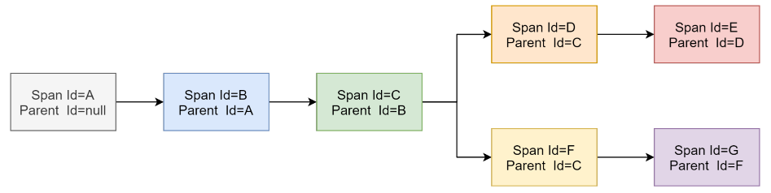


搭建链路监控的步骤：

1. 引入依赖：消费者和服务提供方引入同样的依赖

   ```xml
   <!--包含了sleuth+zipkin-->
   <dependency>
       <groupId>org.springframework.cloud</groupId>
       <artifactId>spring-cloud-starter-zipkin</artifactId>
   </dependency>
   ```

2. 配置application.yml

   ```yml
   # 消费者配置
   spring:
     application:
       name: cloud-order-service
     zipkin:
       base-url: http://localhost:9411
     sleuth:
       sampler:
         probability: 1 # 采样率，值介于0~1之间，1则表示全部采集
   
   # 服务提供方配置
   spring:
     application:
       name: cloud-payment-service
     zipkin:
       base-url: http://localhost:9411
     sleuth:
       sampler:
         probability: 1 # 采样率，值介于0~1之间，1则表示全部采集
   ```

3. 正常写业务逻辑即可

**查看调用链路**：需要事先启动zipkin

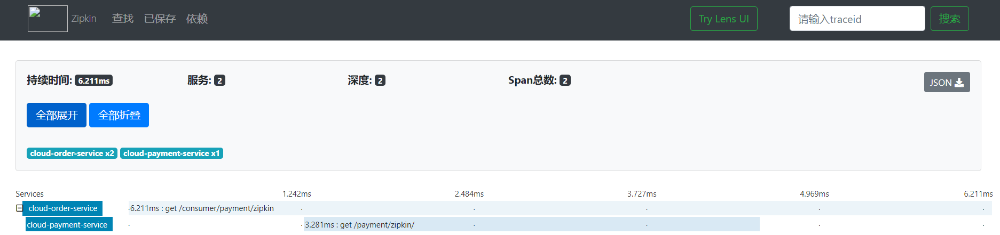

### 7.1.16 SpringCloud Alibaba

[官方地址](https://spring.io/projects/spring-cloud-alibaba)、[中文参考文档](https://github.com/alibaba/spring-cloud-alibaba/blob/master/README-zh.md)

**产生背景**：

1. 2018年12月12日，SpringCloud Netflix项目进入维护模式。
2. 2018年10月31日，SpringCloud Alibaba正式入驻了SpringCloud官方孵化器，并在Maven中央仓库发布了第一个版本。

**SpringCloud Alibaba能干什么**：

1. **服务的限流降级**：默认支持Servlet、Feign、RestTemplate、Dubbo和RocketMQ限流降级功能的接入，可以在运行时通过控制台实时修改限流降级规则，还支持查看限流降级Metrics监控。

2. **服务注册与发现**：适配SpringCloud服务注册与发现标准，默认集成了Ribbon的支持。
3. **分布式配置管理**：支持分布式系统中的外部化配置，配置更改时自动刷新。
4. **消息驱动能力**：基于SpringCloud Stream为微服务应用构建消息驱动能力。
5. **阿里云对象存储**：阿里云提供的海量、安全、低成本、高可靠的云存储服务。支持在任何应用、任何时间、任何地点存储和访问任意类型的数据。
6. **分布式任务调度**：提供秒级、精准、高可靠、高可用的定时（基于Cron表达式）任务调度服务，同时提供分布式的任务执行模型，如网格任务。网格任务支持海量子任务均匀分配到所有Worker（schedulerx-client）上执行。
7. **阿里云短信服务**：覆盖全球的短信服务，友好、高效、智能的互联化通讯能力，帮助企业迅速搭建客户触达通道。

### 7.1.17 Nacos服务注册和配置中心

[官方地址](https://nacos.io/zh-cn/)、[Spring官网](https://spring-cloud-alibaba-group.github.io/github-pages/greenwich/spring-cloud-alibaba.html#_spring_cloud_alibaba_nacos_discovery)

Nacos：Dynamic Naming and Configuration Service，前四个字母分别为Naming和Configuration的前两个字母，最后的s为Service。Nacos是一个更易于构建云原生应用的动态服务发现，配置管理和服务管理中心。**简言之，Nacos就是注册中心+配置中心的组合，即Nacos= Eureka+Config+Bus**。

#### 7.1.17.1 服务注册与发现

Nacos用作服务注册与发现的步骤：

1. 启动nacos-server

2. 引入依赖

   ```xml
   <!--消费者与服务提供方引入相同的依赖-->
   <dependency>
       <groupId>com.alibaba.cloud</groupId>
       <artifactId>spring-cloud-starter-alibaba-nacos-discovery</artifactId>
   </dependency>
   ```

3. 配置application.yml

   ```yml
   # 服务提供方
   server:
     port: 9001
   spring:
     application:
       name: nacos-payment-provider
     cloud:
       nacos:
         discovery:
           server-addr: 127.0.0.1:8848 #配置Nacos地址
   management:
     endpoints:
       web:
         exposure:
           include: '*'
   # 服务消费者
   server:
     port: 83
   spring:
     application:
       name: nacos-order-consumer
     cloud:
       nacos:
         discovery:
           server-addr: 127.0.0.1:8848 #配置Nacos地址
   service-url: # 自定义属性
     nacos-user-service: http://nacos-payment-provider # 消费者将要访问的微服务名称（注册成功进nacos的微服务提供者）
   ```

4. 消费者与服务提供方主启动类上添加@EnableDiscoveryClient

5. 消费者使用@LoadBalanced+RestTemplate，nacos集成了Ribbon，天生自带轮询的负载均衡算法

#### 7.1.17.2 不同注册中心的对比

**Nacos与其他注册中心的对比**：

- Nacos与其他注册中心最大的区别是Nacos支持AP（A的定义是所有的请求都会收到响应）和CP（C是所有节点在同一时间点看到的数据是一致的）模式的切换。

  - 如何选择何种模式？临时实例（Eureka、Zookeeper）、持久化实例（Consul、CoreDNS）、即可用作临时实例，也可用作服务实例（Nacos）

    - 如果不需要存储服务级别的信息且服务实例是通过nacos-client注册，并能够保持心跳上报，那么就可以选择AP模式。当前主流的服务如SpringCoud和Dubbo服务，都适用于AP模式，AP模式为了服务的可用性而减弱了一致性，因此AP模式下只支持注册临时实例。
    - 如果需要在服务级别编辑或者存储配置信息，那么CP是必须，K8S服务和DNS服务则适用于CP模式。CP模式下则支持注册持久化实例，此时则是以Raft协议为集群运行模式，**该模式下注册实例之前必须先注册服务，如果服务不存在，则会返回错误**。

  - Nacos中AP和CP模式的切换

    ```bash
    curl -X PUT '$NACOS_SERVER:8848/nacos/v1/ns/operator/switches?entry=serverMode&value=CP'
    ```

|                  | Nacos                      | Eureka      | Consul            | CoreDNS | Zookeeper   |
| ---------------- | -------------------------- | ----------- | ----------------- | ------- | ----------- |
| **一致性协议**   | CP+AP                      | AP          | CP                | /       | CP          |
| 健康检查         | TCP/HTTP/MySQL/Client Beat | Client Beat | TCP/HTTP/gRPC/Cmd | /       | Client Beat |
| 负载均衡         | 权重/DSL/metadata/CMDB     | Ribbon      | Fabio             | RR      | /           |
| 雪崩保护         | 支持                       | 支持        | 不支持            | 不支持  | 不支持      |
| **自动注销实例** | 支持                       | 支持        | 不支持            | 不支持  | 支持        |
| 访问协议         | HTTP/DNS/UDP               | HTTP        | HTTP/DNS          | DNS     | TCP         |
| 监听支持         | 支持                       | 支持        | 支持              | 不支持  | 支持        |
| 多数据中心       | 支持                       | 支持        | 支持              | 不支持  | 不支持      |
| 跨注册中心       | 支持                       | 不支持      | 支持              | 不支持  | 不支持      |
| SpringCloud集成  | 支持                       | 支持        | 支持              | 不支持  | 支持        |
| Dubbo集成        | 支持                       | 不支持      | 不支持            | 不支持  | 支持        |
| k8s集成          | 支持                       | 不支持      | 支持              | 支持    | 不支持      |

#### 7.1.17.3 配置中心

Nacos也可以作为服务配置中心的服务端（类似于SpringCloud Config的服务端；且Nacos也可作为配置中心，功能类似于Github），步骤如下：

1. 引入依赖

   ```xml
   <!--nacos-config-->
   <dependency>
       <groupId>com.alibaba.cloud</groupId>
       <artifactId>spring-cloud-starter-alibaba-nacos-config</artifactId>
   </dependency>
   <!--nacos-discovery-->
   <dependency>
       <groupId>com.alibaba.cloud</groupId>
       <artifactId>spring-cloud-starter-alibaba-nacos-discovery</artifactId>
   </dependency>
   ```

2. 配置bootstrap.yml和application.yml

   - Nacos中的dataid的组成格式与SpringBoot配置文件中的匹配规则：[官方地址](https://nacos.io/zh-cn/docs/quick-start-spring-cloud.html)

     组成格式：`${prefix}-${spring.profiles.active}.${file-extension}`

     - `prefix` 默认为 `spring.application.name` 的值，也可以通过配置项 `spring.cloud.nacos.config.prefix`来配置。
     - `spring.profiles.active` 即为当前环境对应的 profile，详情可以参考 [Spring Boot文档](https://docs.spring.io/spring-boot/docs/current/reference/html/boot-features-profiles.html#boot-features-profiles)。 **注意：当 `spring.profiles.active` 为空时，对应的连接符 `-` 也将不存在，dataId 的拼接格式变成 `${prefix}.${file-extension}`**
     - `file-exetension` 为配置内容的数据格式，可以通过配置项 `spring.cloud.nacos.config.file-extension` 来配置。目前只支持 `properties` 和 `yaml` 类型。

   - 例如，下面的配置说明dataid为：`nacos-config-client-dev.yaml`

   ```yml
   # 配置bootstrap.yml,从配置中心进行配置拉取
   # bootstrap.yml优先级高于application.yml
   server:
     port: 3377
   spring:
     application:
       name: nacos-config-client
     cloud:
       nacos:
         discovery:
           server-addr: localhost:8848 # 服务注册中心地址
         config:
           server-addr: localhost:8848 # 配置中心地址
           file-extension: yaml # 指定yaml格式的配置
   # application.yml
   spring:
     profiles:
       active: dev
   ```

3. 主启动类上使用@EnableDiscoveryClient

4. 业务类上使用SpringCloud原生注解@RefreshScope，实现配置自带更新。

   ```java
   @RestController
   @RefreshScope
   public class ConfigClientController {
       @Value("${config.info}")
       private String configInfo;
   
       @GetMapping("/config/info")
       public String getConfigInfo() {
           return configInfo;
       }
   }
   ```

#### 7.1.17.4 分类管理

背景：多环境多项目管理

- 问题1：实际开发中，通常一个系统会准备dev开发环境、test测试环境、prod生产环境，如何保证指定环境启动时服务能正确读取到Nacos上相应环境的配置文件呢？
- 问题2：一个大型分布式微服务系统会有很多微服务子项目，每个微服务项目又都会有相应的开发环境、测试环境、预发环境、正式环境...，那怎么对这些微服务配置进行管理呢？

**Namespace+Group+Data ID三者关系**：类似于Java里面的package名和包名

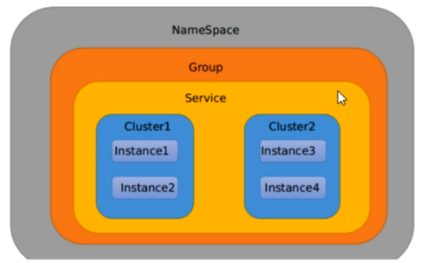

1. 最外层的Namespace是可以用于区分部署环境的；默认的Namespace为public
   - 例如，我们现在有三个环境：开发、测试、生产环境，我们就可以创建三个Namespace，不同的Namespace之间是隔离的
2. Group和Data ID逻辑上区分两个目标对象；默认的Group为DEFAULT_GROUP，默认的DataID为DEFAULT
   - Group可以把不同的服务划分到同一个分组里面去

3. Service就是微服务；一个Service可以包含多个Cluster（集群），Nacos默认Cluster是DEFAULT，Cluster是指对指定微服务的一个虚拟划分，比方说为了容灾，将Service微服务分别部署在了杭州机房和广州机房，这时就可以给杭州机房的Service微服务起一个集群名称（HZ），给广州机房的Service微服务起一个集群名称（GZ），还可以尽量让同一个机房的微服务互相调用，以提升性能。
4. Instance：就是微服务的实例

**如何进行分类配置**？三种方案加载配置

- 方案一：DataID
  - 在applicaiton.yml中指定spring.profiles.active和配置文件的DataID来使不同环境下读取不同的配置

- 方案二：Group
  - 通过Group实现环境区分
  - 在bootstrap.yml中下增加一条group的配置即可，可配置为DEV_GROUP或TEST_GROUP

- 方案三：Namespace
  - 通过Namespace实现环境区分
  - 在bootstrap.yml中增加一条namespace的配置即可，配置为Namespace ID，如`cab22b95-ed96-4f37-bc08-63cd981bc461`

#### 7.1.17.5 Nacos集群和持久化

**Nacos的持久化**：就是将注册信息存储到MySQL中。

**Nacos支持三种部署模式**：

1. 单机模式：用于测试和单机使用
2. 集群模式：用于生产环境，确保高可用
3. 多集群模式：用于多数据中心场景

Nacos默认自带的是嵌入式数据库derby，生产上使用Nacos集群+高可用MySQL实现部署，**derby切换到MySQL的配置步骤**：

1. nacos-server-1.1.4\nacos\conf目录下找到sql脚本，在MySQL中创建nacos_config数据库，执行nacos-mysql.sql脚本

   ```Mysql
   CREATE DATABASE nacos_config;
   USE nacos_config;
   ```

2. nacos-server-1.1.4\nacos\conf目录下找到application.properties，添加如下内容

   ```properties
   ### If use MySQL as datasource:
   spring.datasource.platform=mysql
   ### Count of DB:
   db.num=1
   
   ### Connect URL of DB:
   db.url.0=jdbc:mysql://127.0.0.1:3306/nacos_config?characterEncoding=utf8&connectTimeout=1000&socketTimeout=3000&autoReconnect=true&useUnicode=true&useSSL=false&serverTimezone=UTC
   db.user.0=root
   db.password.0=root
   ```

3. 重启Nacos

**Nacos集群搭建**：1个Nginx+3个Nacos注册中心+1个MySQL

1. Linux下安装Nginx

2. Linux下安装MySQL 5.7.14：[安装教程](https://www.cnblogs.com/yss818824/p/12349719.html)、[设置MySQL字符编码](https://blog.csdn.net/leen0304/article/details/80534609?utm_medium=distribute.pc_relevant_t0.none-task-blog-BlogCommendFromMachineLearnPai2-1.control&depth_1-utm_source=distribute.pc_relevant_t0.none-task-blog-BlogCommendFromMachineLearnPai2-1.control)

3. Linux下安装nacos

4. 创建nacos_config数据库，并执行`nacos/config/nacos-mysql.sql`脚本

5. 配置`nacos/config/application.properties`

   ```xml
   ### If use MySQL as datasource:
   spring.datasource.platform=mysql
   ### Count of DB:
   db.num=1
   ### Connect URL of DB:
   db.url.0=jdbc:mysql://127.0.0.1:3306/nacos_config?characterEncoding=utf8&connectTimeout=1000&socketTimeout=3000&autoReconnect=true&useUnicode=true&useSSL=false&serverTimezone=UTC
   db.user.0=root
   db.password.0=root
   ```

6. 配置集群`nacos/conf/cluster.conf`

   ```properties
   # 192.168.111.144不能写成localhost，也不能写成127.0.0.1
   # 192.168.111.144必须是`hostname -i`命令的值
   192.168.111.144:3333
   192.168.111.144:4444
   192.168.111.144:5555
   ```

7. 编辑Nacos的启动脚本`nacos/bin/startup.sh`，使它能够接受不同的启动端口

   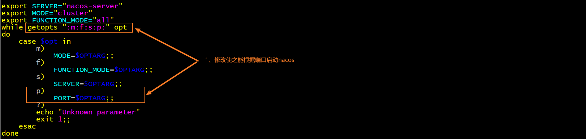

   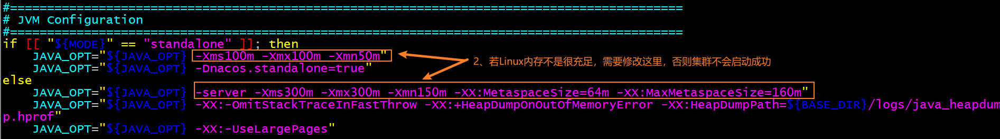

   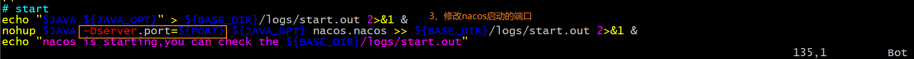

8. 修改Nginx配置文件`/usr/local/nginx/conf/nginx.conf`，进行负载均衡配置；修改完成后启动Nginx

9. 启动`./startup.sh -p 3333`、`./startup.sh -p 4444`、`./startup.sh -p 5555`；

   启动完成后查看nacos集群的启动情况：`ps -ef|grep nacos|grep -v grep|wc -l`

10. 端口、进程之间的相互查询：
    - 根据端口查进程号：`lsof -i:port`、`netstat -nap|grep port`、
    - 根据进程号查找端口：`netstat -nap|grep pid`
    - 根据程序名称查进程号：`pidof -x program_name`、`ps -ef|grep program_name`、`ps aux`

### 7.1.18 Sentinel熔断与限流

[官方地址](https://github.com/alibaba/Sentinel/wiki/%E4%BB%8B%E7%BB%8D)

**Sentinel**：以流量为切入点，从流量控制、熔断降级、系统负载保护等多个维度保护服务的稳定性，**功能上类似于Hystrix**，区别在于：

1. Sentinel提供单独独立的组件；而Hystrix需要程序员手动搭建监控平台。
2. Sentinel可以进行界面化的细粒度统一配置；而Hystrix没有一套web界面可以给我们进行更加细粒度化的配置了（流控、速率控制、服务熔断、服务降级...）

**Sentinel的主要特性**：

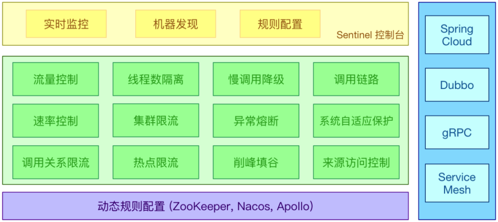

**Sentinel分为两部分**：

- 核心库（Java客户端）不依赖任何框架/库，能够运行于所有java运行时环境，同时对Dubbo/SpringCloud等框架也有较好的支持
- 控制台（Dashboard）基于SpringBoot开发，打包后可以直接运行，不需要额外的Tomcat等应用容器
  - 运行`java -jar sentinel-dashboard-1.7.0.jar`
  - 浏览器输入`localhost:8080`，默认用户名和密码都是sentinel

#### 7.1.18.1 基本使用

Sentinel的基本使用步骤：

1. 运行`sentinel-dashboard-1.7.0.jar`，访问`http://localhost:8080`

2. 引入依赖

   ```xml
   <!--用于Sentinel持久化-->
   <dependency>
       <groupId>com.alibaba.csp</groupId>
       <artifactId>sentinel-datasource-nacos</artifactId>
   </dependency>
   <!--用于服务发现与中注册-->
   <dependency>
       <groupId>com.alibaba.cloud</groupId>
       <artifactId>spring-cloud-starter-alibaba-nacos-discovery</artifactId>
   </dependency>
   <!--引入Sentinel-->
   <dependency>
       <groupId>com.alibaba.cloud</groupId>
       <artifactId>spring-cloud-starter-alibaba-sentinel</artifactId>
   </dependency>
   <!--引入OpenFeign-->
   <dependency>
       <groupId>org.springframework.cloud</groupId>
       <artifactId>spring-cloud-starter-openfeign</artifactId>
   </dependency>
   ```

3. 配置application.yml

   ```yaml
   server:
     port: 8401
   
   spring:
     application:
       name: cloudalibaba-sentinel-service
     cloud:
       nacos:
         discovery:
           server-addr: 8.129.65.158:8090 # 配置Nginx地址(反向代理转发到Nacos)
       sentinel:
         transport:
           dashboard: localhost:8080 # 配置Sentinel dashboard地址
           port: 8719 # 默认8719，假如被占用了会自动从8719开始依次+1扫描。直至找到未被占用的端口
         # Sentinel的持久化配置
         datasource:
           ds1:
             nacos:
               server-addr: 8.129.65.158:8090 # 配置Nginx地址(反向代理转发到Nacos)
               dataId: cloudalibaba-sentinel-service
               groupId: DEFAULT_GROUP
               data-type: json
               rule-type: flow
   
   management:
     endpoints:
       web:
         exposure:
           include: '*'
   ```

4. 主启动类添加@EnableDiscoveryClient，启动web项目
5. 使用Sentinel进行**流控、降级、热点key、熔断**的设置
   
   - Sentinel采用**懒加载**机制，需要先执行一次或多次访问，才能在Sentinel中跟踪到簇点链路

#### 7.1.18.2 流控/降级/热点/系统

1. **流控规则**

   - 资源名：唯一名称，默认请求路径

   - 针对来源：Sentinel可以针对调用者进行限流，填写微服务名，默认default（不区分来源）
   - 阈值类型/单机阈值：
     - QPS（每秒钟的请求数量）：当调用该api的QPS达到阈值时，进行限流
     - 线程数：当调用该api的线程数达到阈值时，进行限流
   - 是否集群：未选中表示不需要集群
   - 流控模式：
     - 直接：api达到限流条件时，直接限流
     - 关联：当关联的资源达到阈值时，就限流自己
     - 链路：只记录指定链路上的流量（指定资源从入口资源进来的流量，如果达到阈值，就进行限流），属于api级别的针对来源
   - 流控效果：
     - 快速失败：直接失败，抛异常（默认响应为：`Blocked by Sentinel (flow limiting)`，可查看`com.alibaba.csp.sentinel.slots.block.flow.controller.DefaultController`）
     - Warm Up：即预热/冷启动方式，根据codeFactor（冷加载因子，默认3）的值，从阈值/codeFactor，经过预热时长，才达到设置的QPS阈值（可查看`com.alibaba.csp.sentinel.slots.block.flow.controller.WarmUpController`）
       - 应用场景：秒杀系统在开启的瞬间，会有很多流量上来，很有可能把系统打死，预热方式就是为了保护系统，慢慢的把流量放进来，慢慢把阈值增长到设定的值。
     - 排队等待：匀速排队（对应的是漏桶算法），让请求以匀速的速度通过，阈值类型必须设置为QPS，否则无效（可查看`com.alibaba.csp.sentinel.slots.block.flow.controller.RateLimiterController`）
       - 应用场景：主要用于处理间隔性突发的流量（**削峰填谷**），例如消息队列。想象以下这样的场景，在某一秒有大量的请求到来，而接下来的几秒则处于空闲状态，我们希望系统能够在接下来的空闲期间逐渐处理这些请求，而不是在第一秒直接拒绝多余的请求。

   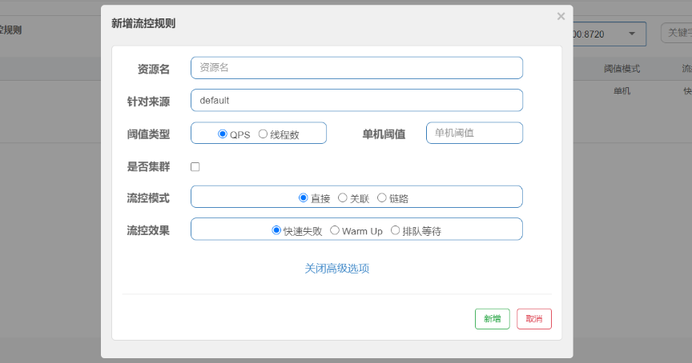

2. **降级规则**

   Sentinel熔断降级会在调用链路中某个资源出现不稳定状态时（例如调用超时或异常比例升高），对这个资源的调用进行限制，让请求快速失败，避免影响到其他的资源而导致级联错误；当资源被降级后，在接下来的降级时间窗口之内，对资源的调用都自动熔断，默认行为是先抛出DegradeException；Sentinel的断路器没有半开状态。

   - RT（平均响应时间，毫秒级）：**平均响应时间超出阈值**且**在1s内通过的请求>=5**，这两个条件同时满足后触发降级，窗口期过后关闭断路器。RT最大4900（更大的需要通过`-Dcsp.sentinel.statistic.max.rt=XXX`才能生效）。
   - 异常比例（秒级）：**QPS>=5**且**每秒异常比例超过阈值**时，触发降级；时间窗口结束后，关闭降级。
   - 异常数（分钟级）：**近1min异常数超过阈值**时，触发降级；时间窗口结束后，关闭降级。
     - 由于统计时间窗口是分钟级别的，若时间窗口小于60s，则结束熔断状态后仍可能再进入熔断状态，因此时间窗口一定要>=60s。

   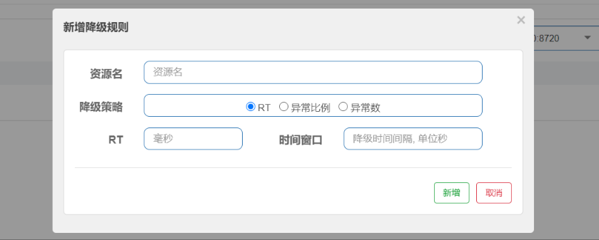

3. **热点key限流**

   相比于普通的流控规则，热点规则可以进行更细粒度（可以对请求参数）的限流。

   **参数例外项**：可以设置当参数是某个特殊值时，它的限流值和平时不一样。

   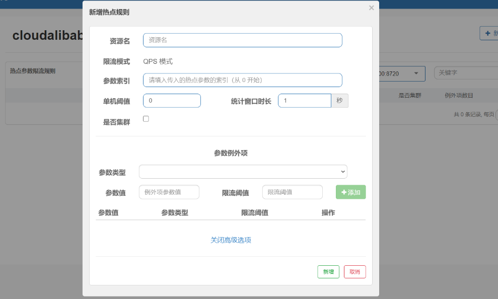

4. **系统规则**

   **系统规则一般较少使用，因为不符合web应用的初衷**。

   系统保护规则是从应用级别的入口流量进行控制，从单台机器的load、CPU使用率、平均RT、入口QPS和并发线程数等几个维度监控应用指标，让系统尽可能跑在最大吞吐量的同时保证系统整体的稳定性。

   系统保护规则是应用整体维度的，而不是资源维度的，并且**仅对入口流量生效**。入口流量指的是进入应用的流量（`EntryType.IN`），比如Web服务或 Dubbo服务端接收的请求，都属于入口流量。

   系统规则支持以下的模式：

   - **Load自适应**（仅对Linux/Unix-like机器生效）：系统的load作为启发指标，进行自适应系统保护。当系统load 超过设定的启发值，且系统当前的并发线程数超过估算的系统容量时才会触发系统保护（BBR 阶段）。系统容量由系统的`maxQps * minRt`估算得出。设定参考值一般是`CPU cores * 2.5`。
   - **CPU usage**（1.5.0+ 版本）：当系统CPU使用率超过阈值即触发系统保护（取值范围 0.0-1.0），比较灵敏。
   - **平均 RT**：当单台机器上所有入口流量的平均RT达到阈值即触发系统保护，单位是毫秒。
   - **并发线程数**：当单台机器上所有入口流量的并发线程数达到阈值即触发系统保护。
   - **入口 QPS**：当单台机器上所有入口流量的QPS达到阈值即触发系统保护。

   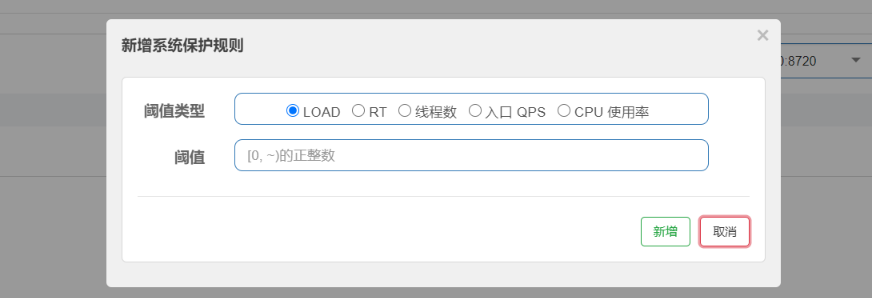

#### 7.1.18.3 @SentinelResource

[@SentinelResource注解](https://github.com/alibaba/Sentinel/wiki/%E6%B3%A8%E8%A7%A3%E6%94%AF%E6%8C%81)

对比Sentinel和Hystrix，Sentinel的@SentinelResource类似于Hystrix的@HystrixCommand。

**注意点**：

- 允许按照Url限流或按照资源名限流。**二者的区别在于**：按照URL限流，限流生效后会返回Sentinel自带默认的限流处理信息（`Blocked by Sentinel (flow limiting)`）；而按照资源名限流，可以自定义限流处理信息（通过blockHandlerClass属性指定类，通过blockHandler指定类中的静态方法）。如果方法上存在@SentinelResource，推荐按照资源名限流。
- @SentinelResource的blockHandler属性主管Sentinel配置异常，不管RuntimeException；fallback属性主管RuntimeException（但除了exceptionsToIgnore属性指定的异常）；若同时违背Sentinel配置异常，且程序中抛出RuntimeException，则**blockHandler属性生效**。

```java
@GetMapping("/rateLimit/customerBlockHandler")
@SentinelResource(value = "customerBlockHandler",
        blockHandlerClass = CustomerBlockHandler.class,
        blockHandler = "handleException2")
public CommonResult customerBlockHandler() {
    return new CommonResult(200, "按客戶自定义", new Payment(2020L, "serial003"));
}

// 注意：CustomerBlockHandler中必须是静态方法
public class CustomerBlockHandler {
    // 必须是静态方法
    public static CommonResult handleException(BlockException exception) {
        return new CommonResult(4444, "按客户自定义，global handlerException----1");
    }
    // 必须是静态方法
    public static CommonResult handleException2(BlockException exception) {
        return new CommonResult(4444, "按客户自定义，global handlerException----2");
    }
}
```

#### 7.1.18.4 服务熔断

服务熔断：整合Nacos+Sentinel+Ribbon+OpenFeign

不同熔断框架的比较：

|                    | Sentinel                                                 | Hystrix                | resilience4j                     |
| ------------------ | -------------------------------------------------------- | ---------------------- | -------------------------------- |
| **隔离策略**       | 信号量隔离（并发线程数限流）                             | 线程池隔离/信号量隔离  | 信号量隔离                       |
| **熔断降级策略**   | 基于响应时间、异常比率、异常数                           | 基于异常比率           | 基于异常比率、响应时间           |
| **实时统计实现**   | 滑动窗口（LeapArray）                                    | 滑动窗口（基于RxJava） | Ring Bit Buffer                  |
| **动态规则配置**   | 支持多种数据源                                           | 支持多种数据源         | 有限支持                         |
| **扩展性**         | 多个扩展点                                               | 插件的形式             | 接口的形式                       |
| **基于注解的支持** | 支持                                                     | 支持                   | 支持                             |
| **限流**           | 基于QPS，支持基于调用关系的限流                          | 有限的支持             | Rate Limiter                     |
| **流量整型**       | 支持预热模式、匀速器模式、预热排队模式                   | 不支持                 | 简单的Rate Limiter模式           |
| **系统自适应保护** | 支持                                                     | 不支持                 | 不支持                           |
| **控制台**         | 提供开箱即用的控制台，可配置规则、查看秒级监控、机器发现 | 简单的监控查看         | 不提供控制台、可对接其他监控系统 |

#### 7.1.18.5 持久化

**Sentinel的持久化**：可以将限流配置规则持久化进Nacos保存，只要刷新8401某个rest地址，sentinel控制台的流控规则就能看到，只要Nacos里面的配置不删除，针对8401上Sentinel上的流控规则持续有效。

**Sentinel持久化步骤**：

1. 引入依赖

   ```xml
   <dependency>
       <groupId>com.alibaba.csp</groupId>
       <artifactId>sentinel-datasource-nacos</artifactId>
   </dependency>
   ```

2. 在application.yml中配置Sentinel的持久化信息

   ```yaml
   server:
     port: 8401
   
   spring:
     application:
       name: cloudalibaba-sentinel-service
     cloud:
       nacos:
         discovery:
           server-addr: 8.129.65.158:8090 # 配置Nginx地址(反向代理转发到Nacos)
       sentinel:
         transport:
           dashboard: localhost:8080 # 配置Sentinel dashboard地址
           port: 8719 # 默认8719，假如被占用了会自动从8719开始依次+1扫描。直至找到未被占用的端口
         # Sentinel的持久化配置
         datasource:
           ds1:
             nacos:
               server-addr: 8.129.65.158:8090 # 配置Nginx地址(反向代理转发到Nacos)
               dataId: cloudalibaba-sentinel-service
               groupId: DEFAULT_GROUP
               data-type: json
               rule-type: flow
   
   management:
     endpoints:
       web:
         exposure:
           include: '*'
   ```

3. 在Nacos中配置限流策略：本质是将限流策略写入到Nacos中，启动时将限流策略从服务端加载进Sentinel

   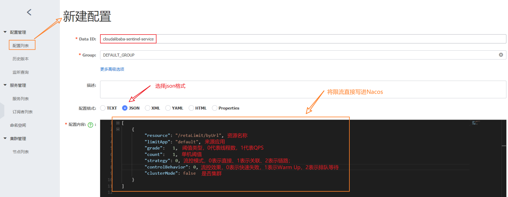

### 7.1.19 Seata分布式事务

[官方地址](http://seata.io/zh-cn/)

**分布式事务**：一次业务操作需要跨多个数据源或需要跨多个系统进行远程调用，就会产生分布式事务问题。

**Seata**：一款开源的分布式事务解决方案，致力于在微服务架构下提供高性能和简单易用的分布式事务服务。**Seata默认是AT模式**。

分布式事务处理过程的-**ID+三组件模型**：

- 一个ID：即Transaction ID XID，全局唯一的事务ID。
- 三组件：
  - Transaction Coordinator(TC) ：**事务协调器**，维护全局事务的运行状态，负责协调并驱动全局事务的提交或回滚
  - Transaction  Manager(TM) ：**事务管理器**，控制全局事务的边界，负责开启一个全局事务，并最终发起全局提交或全局回滚的决议
  - Resource Manager(RM) ：**资源管理器**，控制分支事务，负责分支注册，状态汇报，并接收事务协调器的指令，驱动分支(本地)事务的提交和回滚

**Seata的工作原理**：

1. TM向TC申请开启一个全局事务，全局事务创建成功并生成一个全局唯一的XID
2. XID在微服务调用链路的上下文中传播
3. RM向TC注册分支事务，将其纳入XID对应全局事务的管辖
4. TM向TC发起针对XID的全局提交或回滚决议
5. TC调度XID下管辖的全部分支事务完成提交或回滚请求

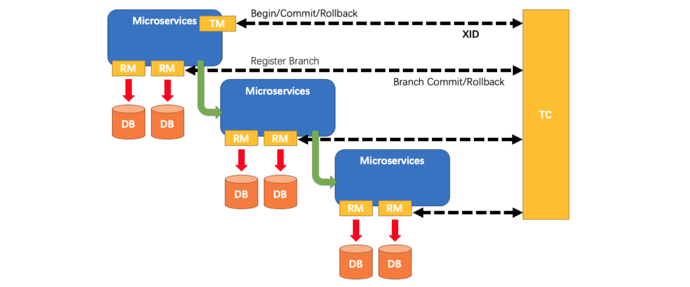

**Seata的使用步骤**：

1. 下载并解压`seata-server-0.9.0`，打开`seata-server-0.9.0\seata\conf\file.conf`，修改**自定义事务组名称**+**事务日志存储模式为db**+**数据库连接信息**。

   ```bash
   service {
     # 自定义事务组名称
     vgroup_mapping.my_test_tx_group = "fsp_tx_group"
     default.grouplist = "127.0.0.1:8091"
     enableDegrade = false
     disable = false
     max.commit.retry.timeout = "-1"
     max.rollback.retry.timeout = "-1"
   }
   
   store {
     # 修改事务日志存储模式为db
     mode = "db"
     file {
       dir = "sessionStore"
       max-branch-session-size = 16384
       max-global-session-size = 512
       file-write-buffer-cache-size = 16384
       session.reload.read_size = 100
       flush-disk-mode = async
     }
     db {
       datasource = "dbcp"
       db-type = "mysql"
       driver-class-name = "com.mysql.jdbc.Driver"
       # 修改数据库连接信息，包括连接地址、用户名、密码
       url = "jdbc:mysql://127.0.0.1:3306/seata"
       user = "root"
       password = "root"
       min-conn = 1
       max-conn = 3
       global.table = "global_table"
       branch.table = "branch_table"
       lock-table = "lock_table"
       query-limit = 100
     }
   }
   ```

2. 先创建Seata数据库，然后执行`seata-server-0.9.0\seata\conf\db_store.sql`脚本。

3. 修改`seata-server-0.9.0\seata\conf\registry.conf`，指明注册中心为nacos，及修改nacos连接信息

   ```bash
   # 指明注册中心为nacos，及修改nacos连接信息
   registry {
     type = "nacos"
     nacos {
       serverAddr = "localhost:8848"
       namespace = ""
       cluster = "default"
     }
   }
   ```

4. 先启动Nacos，再启动seata-server.bat

5. 业务说明及创建数据库、数据表

   - 业务说明：创建三个服务（订单服务、库存服务、账户服务）
     - 当用户下单时，会在**订单服务**中创建一个订单，然后通过远程调用**库存服务**来扣减下单商品的库存
     - 接着通过远程调用**账户服务**来扣减用户账户里面的余额
     - 最后在**订单服务**中修改订单状态为已完成

   ```mysql
   # 创建订单数据库
   CREATE DATABASE seata_order;
   # 创建库存数据库
   CREATE DATABASE seata_storage;
   # 创建账户数据库
   CREATE DATABASE seata_account;
   #----------------------------------------------------分割线--------------------------------------------------------------
   # 在seata_order数据库下创建t_order数据表
   CREATE TABLE t_order(
       `id` BIGINT(11) NOT NULL AUTO_INCREMENT PRIMARY KEY,
       `user_id` BIGINT(11) DEFAULT NULL COMMENT '用户id',
       `product_id` BIGINT(11) DEFAULT NULL COMMENT '产品id',
       `count` INT(11) DEFAULT NULL COMMENT '数量',
       `money` DECIMAL(11,0) DEFAULT NULL COMMENT '金额',
       `status` INT(1) DEFAULT NULL COMMENT '订单状态：0：创建中; 1：已完结'
   ) ENGINE=INNODB AUTO_INCREMENT=7 DEFAULT CHARSET=utf8;
   SELECT * FROM t_order;
   # 在seata_storage数据库下创建t_storage表
   CREATE TABLE t_storage(
       `id` BIGINT(11) NOT NULL AUTO_INCREMENT PRIMARY KEY,
       `product_id` BIGINT(11) DEFAULT NULL COMMENT '产品id',
      `total` INT(11) DEFAULT NULL COMMENT '总库存',
       `used` INT(11) DEFAULT NULL COMMENT '已用库存',
       `residue` INT(11) DEFAULT NULL COMMENT '剩余库存'
   ) ENGINE=INNODB AUTO_INCREMENT=2 DEFAULT CHARSET=utf8; 
   INSERT INTO seata_storage.t_storage(`id`,`product_id`,`total`,`used`,`residue`)
   VALUES('1','1','100','0','100');
   SELECT * FROM t_storage;
   # 在seata_account数据库下创建t_account表
CREATE TABLE t_account(
       `id` BIGINT(11) NOT NULL AUTO_INCREMENT PRIMARY KEY COMMENT 'id',
       `user_id` BIGINT(11) DEFAULT NULL COMMENT '用户id',
       `total` DECIMAL(10,0) DEFAULT NULL COMMENT '总额度',
       `used` DECIMAL(10,0) DEFAULT NULL COMMENT '已用余额',
       `residue` DECIMAL(10,0) DEFAULT '0' COMMENT '剩余可用额度'
   ) ENGINE=INNODB AUTO_INCREMENT=2 DEFAULT CHARSET=utf8; 
   INSERT INTO seata_account.t_account(`id`,`user_id`,`total`,`used`,`residue`) VALUES('1','1','1000','0','1000');
   SELECT * FROM t_account;
   ```

6. 按照上述3库分别建对应的回滚日志表，即分别在seata_order、seata_storage、seata_account数据库中执行`seata-server-0.9.0\seata\conf\db_undo_log.sql`脚本。
7. 创建**订单**、**库存**、**账户**三个模块，添加`@GlobalTransactional(name = "fsp-create-order", rollbackFor = Exception.class)`注解

#### 7.1.19.1 Seata的工作原理

[分布式事务的工作原理](https://blog.csdn.net/qq_35067322/article/details/110914143)、[Seata官网的介绍](https://seata.io/zh-cn/docs/overview/what-is-seata.html)

**分布式事务的执行流程**：

1. TM开启分布式事务（TM向TC注册全局事务记录）
2. 换业务场景，编排数据库，服务等事务内资源（RM向TC汇报资源准备状态）
3. TM结束分布式事务，事务**一阶段**结束（TM通知TC提交/回滚分布式事务）
4. TC汇总事务信息，决定分布式事务是提交还是回滚
5. TC通知所有RM提交/回滚资源，事务**二阶段**结束。

**Seata AT模式的工作原理**：基于两阶段提交协议的演变

1. 一阶段：业务数据和回滚日志记录在同一个本地事务中提交，释放本地锁和连接资源。

   - 解析SQL：得到SQL的类型（UPDATE）、表（product），条件（where name='TXC'）等相关的信息

   - **查询前镜像**：根据解析得到的条件信息，生成查询语句，定位数据

   - 执行业务SQL

   - **查询后镜像**：根据前镜像的结果，通过**主键**定位数据

   - **插入回滚日志**：把前后镜像数据以及业务SQL相关的信息组成一条回滚日志记录，插入到`UNDO_LOG`表中

   - 提交前，向TC注册分支，申请得到记录的**全局锁**

   - 本地事务提交：业务数据的更新和前面步骤中生成的`UNDO LOG`一并提交

   - 将本地事务提交的结果上报给TC

     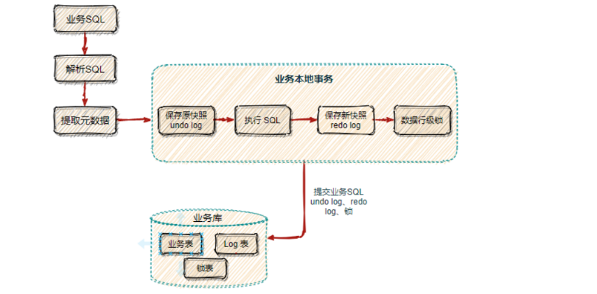

2. 二阶段：

   - 提交异步化，非常快速地完成

     - 收到TC的分支提交请求，把请求放入一个异步任务的队列中，马上返回提交成功的结果给TC

     - 异步任务阶段的分支提交请求将异步和批量地删除相应`UNDO LOG`记录

       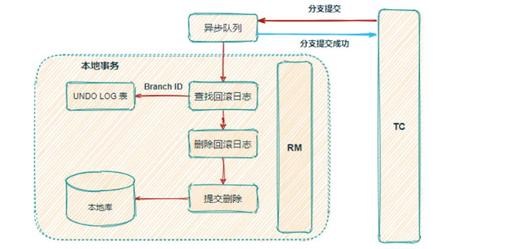

   - 回滚通过一阶段的回滚日志进行反向补偿

     - 收到TC的分支回滚请求，开启一个本地事务，执行如下操作

     - 通过XID和Branch ID查找到相应的`UNDO LOG`记录

     - 数据校验：拿`UNDO LOG`中的后镜与当前数据进行比较，如果有不同，说明数据被当前全局事务之外的动作做了修改。这种情况，需要根据配置策略来做处理

     - 根据`UNDO LOG`中的前镜像和业务SQL的相关信息生成并执行回滚的语句

     - 提交本地事务，并把本地事务的执行结果（即分支事务回滚的结果）上报给TC

       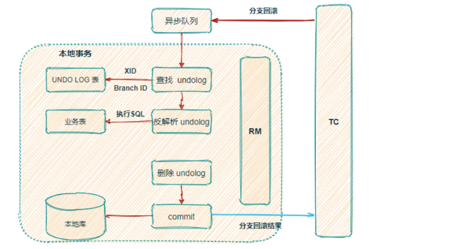

**多个全局事务的执行**：

1. 一阶段本地事务提交前，需要确保先拿到**全局锁**
2. 拿不到**全局锁**，不能提交本地事务
3. 拿**全局锁**的尝试被限制在一定范围内，超出范围将放弃，并回滚本地事务，释放本地锁

多个全局事务执行举例：

1. 两个全局事务tx1和tx2，分别对a表的m字段进行更新操作，m的初始值1000。
2. tx1先开始，开启本地事务，拿到本地锁，更新操作m=1000-100=900。本地事务提交前，先拿到该记录的全局锁，本地提交释放本地锁。
3. tx2后开始，开启本地事务，拿到本地锁，更新操作m=900-100=800。本地事务提交前，尝试拿该记录的全局锁 ，tx1全局提交前，该记录的全局锁被 tx1持有，tx2需要重试等待全局锁 。
4. tx1二阶段全局提交，释放全局锁 。tx2拿到全局锁提交本地事务。
5. 如果tx1的二阶段全局回滚，则tx1需要重新获取该数据的本地锁，进行反向补偿的更新操作，实现分支的回滚。此时，如果tx2仍在等待该数据的全局锁，同时持有本地锁，则tx1的分支回滚会失败。分支的回滚会一直重试，直到 tx2的全局锁等锁超时，放弃全局锁并回滚本地事务释放本地锁，tx1的分支回滚最终成功。


#### 7.1.19.2 本例的系统架构原理图

本例的系统架构原理图如下：（实际未加Sentinel）


## 7.2 SpringBoot

### 7.2.1 加速依赖包的导入

在`apache-maven-3.5.2\conf\settings.xml`中配置使用阿里云服务器加速导入依赖包的速度：

```xml
<mirrors>
	<mirror>
    	<id>aliyunmaven</id>
    	<mirrorOf>*</mirrorOf>
    	<name>阿里云公共仓库</name>
    	<url>https://maven.aliyun.com/repository/public</url>
	</mirror>
</mirrors>
 
<profiles>
	<profile>
 		<id>jdk-1.8</id>
		<activation>
			<activeByDefault>true</activeByDefault>
			<jdk>1.8</jdk>
		</activation>
		<properties>
			<maven.compiler.source>1.8</maven.compiler.source>
			<maven.compiler.target>1.8</maven.compiler.target>
			<maven.compiler.compilerVersion>1.8</maven.compiler.compilerVersion>
		</properties>
	</profile>
</profiles>
```

> 参考博客文章：[解决阿里镜像无法下载jar包的问题](https://blog.csdn.net/HeyWeCome/article/details/104543411)

### 7.2.2 SpringBoot的配置

#### 7.2.2.1 启动类配置

**启动类使用注解**：@SpringBootApplication=@SpringBootConfiguration（标注当前类是配置类）+@EnableAutoConfiguration（启用自动配置功能）+@ComponentScan（组件扫描）

- 默认扫描的包：启动类所在包及其下面的所有子包。
- 手动配置扫描的包：
  - 方法一：@SpringBootApplication(scanBasePackages="包名")
  - 方法二：在启动类上使用@ComponentScan("包名")

**SpringBoot的自动配置**：在`spring-boot-autoconfigure`包。

**控制器使用注解**：@RestController=@Controller+@ResponseBody

### 7.2.3 容器功能

#### 7.2.3.1 组件添加

**配置类**：@Configuration，配置类本身也是组件。

- `@Configuration(proxyBeanMethods = false)`：proxyBeanMethods默认为true（**Full模式**，全配置：这种模式可以解决**组件依赖**的问题），表示通过**配置类实例调用方法**获取返回对象时，保持返回对象的单实例（若容器中存在该对象的实例，直接返回即可）；proxyBeanMethods设置为false（**Lite模式**，轻量级配置），则返回对象是多实例的。
  - Full模式：每次方法调用会从容器中检查，性能较差，但可以保证对象的单例性；配置类组件之间无依赖关系用Lite模式加速容器启动过程，减少判断。
  - Lite模式：每次方法调用不会从容器中检查，性能较好，但是通过方法调用返回的对象是多例的；配置类组件之间有依赖关系，方法会被调用得到之前单实例组件，用Full模式。

**配置组件**：@Bean、@Component、@Controller、@Service、@Repository

**导入组件**：`@Import({User.class, DBHelper.class})`（可以将注解放在配置类上或组件上），自动导入的组件名字为**全类名**。

**条件装配**：@Conditional，满足Conditional指定的条件，则进行组件注入。`org.springframework.boot.autoconfigure.condition`包中有大量的条件装配注解。如：

- @ConditionalOnBean
- @ConditionalOnMissingBean

#### 7.2.3.2 原生配置文件导入

**导入资源**：在配置类上添加注解@ImportResource("classpath:beans.xml")可以导入类路径下的beans.xml中的组件。

#### 7.2.3.3 配置绑定

- 方法一：在**容器中的组件**，可以利用注解进行配置绑定，`@Component`（组件上）+`@ConfigurationProperties(prefix = "mycar")`（组件上）

- 方法二：在**配置类上**开启指定组件的属性配置功能（一般用于想为第三方包配置），

  `@Configuration`（配置类上）+`@EnableConfigurationProperties(Car.class)`（配置类上）+`@ConfigurationProperties(prefix = "mycar")`（组件上）

  - `@EnableConfigurationProperties(Car.class)`有两个作用：一是开启Car的属性配置；二是将Car自动注册到组件中。

### 7.2.4 自动配置原理⭐

#### 7.2.4.1 引导加载自动配置类

@SpringBootApplication=@SpringBootConfiguration+@ComponentScan+@EnableAutoConfiguration

- @SpringBootConfiguration：代表当前是一个配置类。

  ```java
  @Configuration
  public @interface SpringBootConfiguration
  ```

- @ComponentScan：Spring的注解，指定扫描哪些类。

- @EnableAutoConfiguration：

  ```java
  // 批量导入启动类所在包（未指定包的情况下，默认是启动类所在的包及其子包）下的组件
  @AutoConfigurationPackage
  // 1. 利用getAutoConfigurationEntry(annotationMetadata);给容器中批量导入一些组件
  // 2. 调用List<String> configurations = getCandidateConfigurations(annotationMetadata, attributes)获取到所有需要导入到容器中的配置类（127个）
  // 2.1 利用工厂加载 Map<String, List<String>> loadSpringFactories(@Nullable ClassLoader classLoader)；得到所有的组件
  // 2.2 从META-INF/spring.factories位置来加载一个文件。默认扫描我们当前系统里面所有META-INF/spring.factories位置的文件，spring-boot-autoconfigure-2.3.4.RELEASE.jar包里面也有META-INF/spring.factories
  @Import(AutoConfigurationImportSelector.class) 
  public @interface EnableAutoConfiguration
  
  // 利用Registrar给容器中导入一系列组件，将指定的一个包下的所有组件导入进来？MainApplication所在包下
  @Import(AutoConfigurationPackages.Registrar.class) 
  public @interface AutoConfigurationPackage
  ```

#### 7.2.4.2 按需开启自动配置

虽然127个场景的所有自动配置启动的时候（**@Import(AutoConfigurationImportSelector.class) 的作用**）默认全部加载。xxxxAutoConfiguration，按照条件装配规则（@Conditional），最终会按需配置。

#### 7.2.4.3 修改默认的配置

SpringBoot默认会在底层配好所有的组件，但是如果用户自己配置了以用户的优先（通过条件装配）。

**SpringBoot的自动配置原理总结**：

1. SpringBoot先加载所有的自动配置类xxxxxAutoConfiguration。
2. 自动配置类按照条件进行生效，默认都会绑定配置文件指定的值，从xxxxProperties里面取；而xxxxProperties又会从application.properties中取。
3. 生效的配置类就会给容器中装配很多组件，只要容器中有这些组件，相当于这些功能就有了。
4. 定制化配置：
   - 方法一：用户直接自己@Bean替换底层的组件。
   - 方法二：修改组件的配置文件属性的默认值。

#### 7.2.4.4 项目的创建

根据自动配置原理，不同场景下的整合遵循以下步骤即可：

1. 引入场景依赖：[查看SpringBot官网](https://docs.spring.io/spring-boot/docs/2.4.1/reference/html/using-spring-boot.html#using-boot)
2. 查看该场景下的自动配置：
   - 自己分析，引入场景对应的自动配置一般都生效了
   - 在application.yaml配置文件中开启自动配置报告（debug=true），Negative matches（未生效）\Positive matches（已生效）
3. 是否需要修改自动配置的默认值：
   - 参照文档修改默认值：
     - [查看SpringBoot官网](https://docs.spring.io/spring-boot/docs/current/reference/html/appendix-application-properties.html#common-application-properties)
     - 自己分析xxxxProperties绑定了配置文件的哪些属性
   - 自定义加入或者替换组件：@Bean、@Component...

使用**Spring Initailizr**开发向导可以加速项目的创建。

### 7.2.5 热更新

#### 7.2.5.1 热重启

SpringBoot支持使用`spring-boot-devtools`（**本质是Restart**，并非真正意义上的热更新）进行热更新（[查看SpringBoot官网](https://docs.spring.io/spring-boot/docs/2.4.1/reference/html/using-spring-boot.html#using-boot-devtools)）：

1. 引入依赖，请查看官网。
2. 项目或者页面修改以后，使用`Ctrl+F9`。

另一种进行热重启的方法是使用springload。

#### 7.2.5.1 热加载

使用**JRebel**可以实现真正意义上的热更新（**本质是Reload**），但该软件是付费的， JRebel的安装和使用请查看[JRebel插件使用详解](https://blog.csdn.net/lianghecai52171314/article/details/105637251)。安装完JRebel并启用之后，当修改完java代码，可以通过`Ctrl+shift+F9`进行热更新（不需要重启，直接进行重载可以节省大量时间）。

**推荐使用JRebel进行热更新**。

### 7.2.6 配置文件（yml）

**YAML（YAML Ain't Markup Language）用法如下**：.yml格式不支持@PropertySource注解导入配置

1. key: value（kv之间有空格）
2. 大小写敏感
3. 使用缩进表示层级关系
4. 缩进不允许使用tab，只允许空格（IDEA对此进行了优化）
5. 缩进的空格数不重要，只要相同层级的元素左对齐即可
6. '#'表示注释
7. 字符串无需加引号，如果要加，''与""表示字符串内容会被转义（**单引号会将\n作为字符输出**）/不转义（**双引号会将\n作为换行输出**）

**自定义类配置的属性绑定的提示功能**：

```xml
<dependency>
	<groupId>org.springframework.boot</groupId>
	<artifactId>spring-boot-configuration-processor</artifactId>
	<optional>true</optional>
</dependency>

<build>
    <plugins>
        <plugin>
            <groupId>org.springframework.boot</groupId>
            <artifactId>spring-boot-maven-plugin</artifactId>
            <configuration>
                <excludes>
                    <!--spring-boot-configuration-processor与业务功能无关，只是开发时提供便利，故需要排除掉-->
                    <exclude>
                        <groupId>org.springframework.boot</groupId>
                        <artifactId>spring-boot-configuration-processor</artifactId>
                    </exclude>
                </excludes>
            </configuration>
        </plugin>
    </plugins>
</build>
```

### 7.2.7 Web开发

#### 7.2.7.1 静态资源访问

##### 7.2.7.1.1 静态资源目录

只要静态资源放在类路径下：`/static`（或`/public`或`/resources`或`/META-INF/resources`），则访问访问为：**当前项目根路径/ + 静态资源名**。

**原理**： 静态映射/**；请求进来，先去找Controller看能不能处理。不能处理的所有请求又都交给静态资源处理器（`ResourceHttpRequestHandler`）；静态资源也找不到则响应404页面。

改变默认的静态资源目录：

```properties
spring.web.resources.static-locations=[classpath:/aaa/,classpath:/bbb/]
```

配置之后，只有类路径下的aaa目录和bbb目录下存放的静态资源可以被直接访问到。

##### 7.2.7.1.2 静态资源访问前缀

静态资源访问默认无前缀，直接为`/**`，可以配置静态资源访问前缀：

```properties
spring.mvc.static-path-pattern=/resources/**
```

配置静态资源访问前缀之后，则访问静态资源的路径为：当前项目+static-path-pattern+静态资源名=静态资源文件夹`/static`（或`/public`或`/resources`或`/META-INF/resources`）下找。

##### 7.2.7.1.3 jar包里的静态资源

访问jar包里的静态资源：会自动映射为/webjars/\*\*

```xml
<!--例如：引入jquery包-->
<dependency>
	<groupId>org.webjars</groupId>
	<artifactId>jquery</artifactId>
	<version>3.5.1</version>
</dependency>
```

访问jquery包下的静态资源路径为：http://localhost:8080/webjars/jquery/3.5.1/jquery.js，后面的地址（jquery/3.5.1/jquery.js）要按照依赖里面的包路径来填写。

#### 7.2.7.2 欢迎页

**访问项目的根路径，会默认访问欢迎页**，欢迎页有两种形式：

1. 存放在静态资源目录下的index.html（**Bug：若配置了静态资源访问前缀，则会导致welcome page失效**）。
2. Controller能处理/index（这种方法需要请求路径中包含/index）。

#### 7.2.7.3 网站小图标

将favicon.ico放在静态资源目录下即可（**Bug：若配置了静态资源访问前缀，则会导致网站小图标失效**）。

若禁用了浏览器缓存，会导致网站小图标不显示。

#### 7.2.7.4 静态资源配置管理

关于静态资源的配置管理，需要注意以下几点：

- SpringBoot启动默认加载xxxAutoConfiguration类（自动配置类）

- SpringMVC功能的自动配置类WebMvcAutoConfiguration，默认生效。

  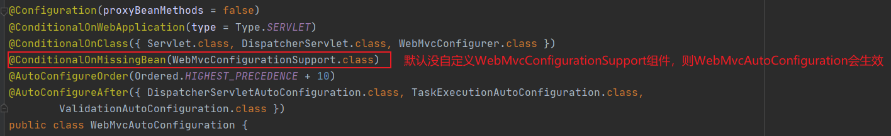

- WebMvcAutoConfiguration自动配置类中加载了spring.mvc（对应WebMvcProperties类）、spring.resources（对应ResourceProperties类）、spring.web（对应WebProperties类）的属性配置。

  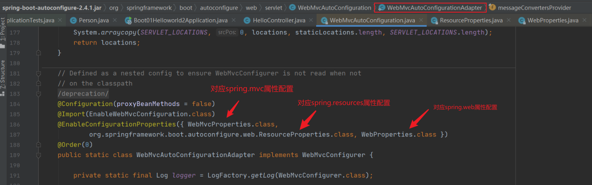

- 可以配置禁用所有的静态资源、配置静态资源的缓存时间。

  ```properties
  # 禁用所有静态资源(默认为true，表示不禁用)
  spring.resources.add-mappings: false
  
  # 配置静态资源的缓存时间(以秒为单位)，配置之后会在第一次访问静态资源后，将其缓存在浏览器中
  spring.resources.cache.period: 11000
  
  # 访问/webjars/**的请求，等价于访问"classpath:/META-INF/resources/webjars/"jar包下类路径中的静态资源
  
  # addResourceLocations(getResourceLocations(this.resourceProperties.getStaticLocations()))方法即配置了默认的静态资源访问路径
  ```

  

  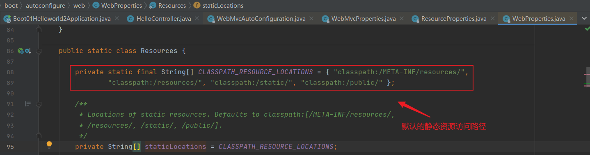

- 欢迎页的访问：在WebMvcAutoConfiguration.EnableWebMvcConfiguration#welcomePageHandlerMapping方法会返回WelcomePageHandlerMapping对象，WelcomePageHandlerMapping对象中配置了欢迎页的访问路径。

  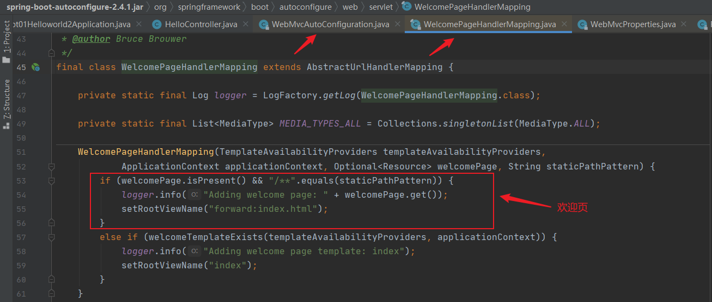

#### 7.2.7.5 请求参数处理⭐

##### 7.2.7.5.1 RSET使用与原理

**请求映射**：满足以下两个条件

1. @xxxMapping注解：@GetMapping、@PostMapping、@PutMapping、@DeleteMapping
2. Rest风格支持（**使用HTTP请求方式动词来表示对资源的操作**）
   - 以前：/getUser获取用户、/deleteUser删除用户、/editUser修改用户、/saveUser保存用户
   - 现在：/user  GET请求获取用户、DELETE请求删除用户、PUT请求修改用户、POST请求保存用户

**Rest原理（表单提交要使用REST的时候）**：如使用PostMan直接发送Put、delete等方式请求，无需Filter。

- 表单提交会带上_method=PUT
- 请求过来被HiddenHttpMethodFilter拦截（需配置开启HiddenHttpMethodFilter）

- - 请求是否正常，并且是POST

- - - 获取到_method的值。
    - 兼容以下请求：PUT/DELETE/PATCH
    - 原生request（post），采用**装饰模式**requesWrapper重写了getMethod方法，返回的是传入的值。
    - 过滤器链放行的时候用wrapper，以后的方法调用getMethod是调用**requesWrapper的。

**表单使用POST方式提交DELETE/PUT请求**：

1. 第一步：表单method=post，隐藏域 _method=put

   ```html
   <form action="/user" method="post">
       <input name="_method" type="hidden" value="DELETE"/>
       <input value="REST-DELETE提交" type="submit"/>
   </form>
   <form action="/user" method="post">
       <input name="_method" type="hidden" value="put"/>
       <input value="REST-PUT提交" type="submit"/>
   </form>
   ```

2. 第二步：配置HiddenMethodFilter

   ```properties
   # 开启页面表单的REST功能
   spring.mvc.hiddenmethod.filter.enabled=true
   ```

   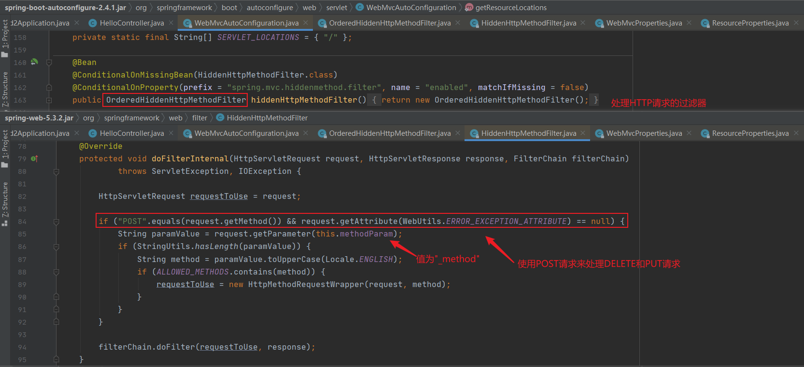

##### 7.2.7.5.2 请求映射原理

**请求映射原理如下**：

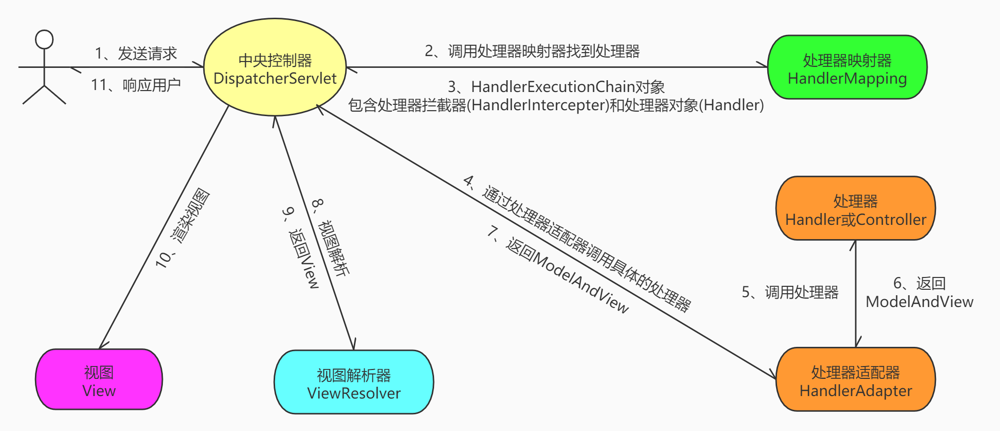

- SpringMVC功能分析都从`org.springframework.web.servlet.DispatcherServlet`的doDispatch方法开始。

  

- DispatcherServlet的doDispatch方法中通过调用HandlerMapping（包含多种HandlerMapping）获得HandlerExecutionChain对象（HandlerExecutionChain对象中包含了HandlerInterceptor和handler，其中的handler包含了Controller.method()的信息）。

  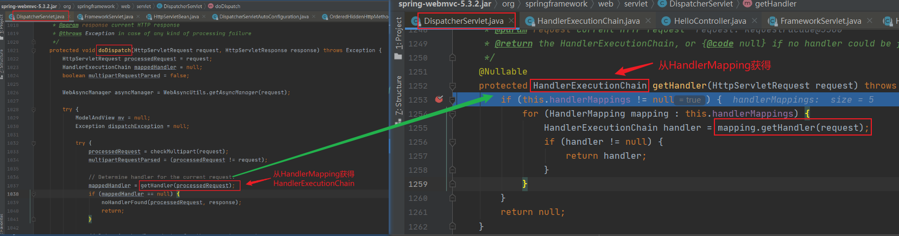

  所有的请求映射都在HandlerMapping中，HandlerMapping具体又包括：

  - 配置欢迎页的WelcomePageHandlerMapping，访问 /能访问到index.html
  - 配置了默认的RequestMappingHandlerMapping，保存了所有@RequestMapping和handler的映射规则，Controller中的所有映射都会保存在此
  - 请求进来，挨个尝试所有的HandlerMapping看是否有请求信息：
    - 如果有就找到这个请求对应的HandlerMapping，并通过该HandlerMapping返回HandlerExecutionChain对象
    - 如果没有就在下一个HandlerMapping里寻找
  - 可以自定义HandlerMapping来进行映射处理

  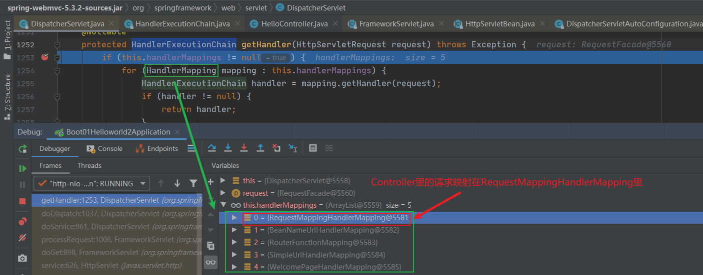

- 为当前handler找一个适配器HandlerAdapter（一般就是找RequestMappingHandlerAdapter），由适配器执行目标方法并确定方法参数的每一个值。

  ```java
  // Actually invoke the handler.
  // DispatcherServlet的doDispatch方法中执行
  mv = ha.handle(processedRequest, response, mappedHandler.getHandler());
  
  // RequestMappingHandlerAdapter的handleInternal方法中执行目标方法
  // 执行前先使用参数解析器进行解析
  mav = invokeHandlerMethod(request, response, handlerMethod); 
  ```

  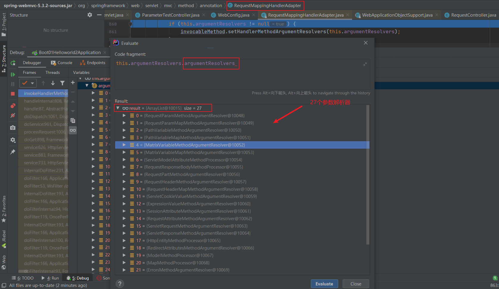

- HandlerMethodArgumentResolver是一个接口，有两个方法：当前解析器是否支持解析这种参数；支持就进行调用解析。HandlerMethodArgumentResolver有27个实现子类，对应**27个参数解析器**。

  ```java
  // InvocableHandlerMethod的getMethodArgumentValues方法为获取具体参数值的过程
  ```

- HandlerMethodReturnValueHandler也是一个接口，拥有15个实现子类，对应**15个返回值处理器**。

  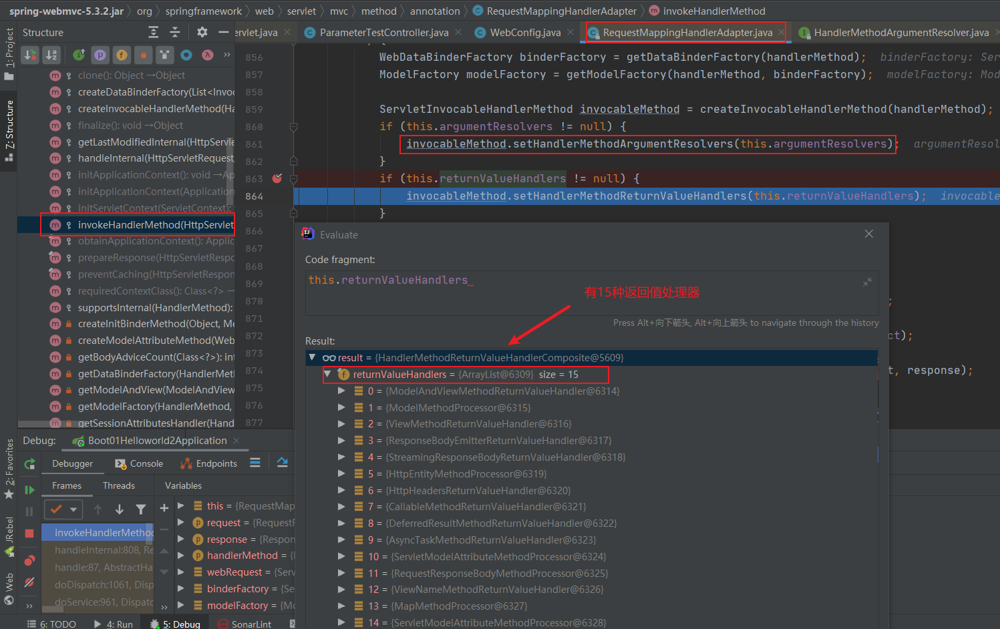

##### 7.2.7.5.3 普通参数/基本注解

请求参数传递的几种方式：

1. **基本注解**：@RequestBody、@RequestParam、@PathVariable、@RequestHeader、@CookieValue、@RequestAttribute、@MatrixVariable、@ModelAttribute、@RequestPart

   ```java
   // @RequestBody、@RequestParam、@PathVariable、@RequestHeader、@CookieValue的使用测试
   @RestController
   public class ParameterTestController {
       // car/2/owner/zhangsan?age=18&inters=basketball&&inters=game
       @GetMapping("/car/{id}/owner/{username}")
       public Map<String,Object> getCar(
               @PathVariable("id") Integer id, // 获取请求路径中的id值
               @PathVariable("username") String name, // 获取请求路径中的username值
               @PathVariable Map<String,String> pv, // 获取请求路径中的所有参数及值
   
               @RequestHeader("User-Agent") String userAgent, // 获取所有的请求头中User-Agent的信息
               @RequestHeader Map<String,String> header, // 获取所有的请求头信息
   
               @RequestParam("age") Integer age, // 获得单个参数的值
               @RequestParam("inters") List<String> inters, // 获得数组
               @RequestParam Map<String,String> params, // 把所有请求参数封装到Map中
   
               @CookieValue("token") String _ga, // 获取Cookie中_ga的值
               @CookieValue("token") Cookie cookie) // 获取_ga的Cookie
       {
   
           Map<String,Object> map = new HashMap<>();
           map.put("id",id);
           map.put("name",name);
           map.put("pv",pv);
           map.put("userAgent",userAgent);
           map.put("headers",header);
           map.put("age",age);
           map.put("inters",inters);
           map.put("params",params);
           map.put("token",_ga);
           System.out.println(cookie.getName()+"===>"+cookie.getValue());
           System.out.println(map);
           return map;
       }
   
       @PostMapping("/save")
       public Map postMethod(@RequestBody String content){
           Map<String,Object> map = new HashMap<>();
           map.put("content",content);
           return map;
       }
   }
   //------------------------------------------我是分割线-------------------------------------------------------------------
   // @MatrixVariable的使用测试，SpringBoot默认是禁用了矩阵变量的功能，因此使用前需要先进行配置
   @Configuration(proxyBeanMethods = false)
   public class WebConfig implements WebMvcConfigurer {
   
       @Bean
       public HiddenHttpMethodFilter hiddenHttpMethodFilter(){
           HiddenHttpMethodFilter methodFilter = new HiddenHttpMethodFilter();
           methodFilter.setMethodParam("_m");
           return methodFilter;
       }
   
       // 方法一
       @Bean
       public WebMvcConfigurer webMvcConfigurer(){
           return new WebMvcConfigurer() {
               @Override
               public void configurePathMatch(PathMatchConfigurer configurer) {
                   UrlPathHelper urlPathHelper= new UrlPathHelper();
                   // 不移除;后面的内容，矩阵变量功能就可以生效
                   urlPathHelper.setRemoveSemicolonContent(false);
                   configurer.setUrlPathHelper(urlPathHelper);
               }
           };
       }
   
       // 方法二
   //    @Override
   //    public void configurePathMatch(PathMatchConfigurer configurer){
   //        UrlPathHelper urlPathHelper= new UrlPathHelper();
   //        // 不移除;后面的内容，矩阵变量功能就可以生效
   //        urlPathHelper.setRemoveSemicolonContent(false);
   //        configurer.setUrlPathHelper(urlPathHelper);
   //
   //    }
   }
   
   @RestController
   public class ParameterTestController {
       //1、语法： 请求路径：/cars/sell;low=34;brand=byd,audi,yd
       //2、SpringBoot默认是禁用了矩阵变量的功能
       //   手动开启：原理。对于路径的处理，使用UrlPathHelper进行解析。
       //   removeSemicolonContent（移除分号内容）支持矩阵变量的
       //3、矩阵变量必须有url路径变量才能被解析
       /**
        * 一个面试题：页面开发，cookie被禁用了，Session里面的内容怎么使用？
        * 正常情况下：session.set(a,b)--->jsessionid--->cookie--->每次发请求携带
        * 解决方法：url重写：/abc;jsessionid=xxxx，把cookie的值使用矩阵变量的方式进行传递
        */
       @GetMapping("/cars/{path}")
       public Map carsSell(@MatrixVariable("low") Integer low,
                           @MatrixVariable("brand") List<String> brand,
                           @PathVariable("path") String path){
           Map<String,Object> map = new HashMap<>();
   
           map.put("low",low);
           map.put("brand",brand);
           map.put("path",path);
           return map;
       }
   
       // /boss/1;age=20/2;age=10
       @GetMapping("/boss/{bossId}/{empId}")
       public Map boss(@MatrixVariable(value = "age",pathVar = "bossId") Integer bossAge,
                       @MatrixVariable(value = "age",pathVar = "empId") Integer empAge){
           Map<String,Object> map = new HashMap<>();
           map.put("bossAge",bossAge);
           map.put("empAge",empAge);
           return map;
       }
   }
   //------------------------------------------我是分割线-------------------------------------------------------------------
   // 测试请求转发以及@RequestAttribute的使用
   @Controller
   public class RequestController {
   
       @GetMapping("/goto")
       public String goToPage(HttpServletRequest request){
           request.setAttribute("msg", "成功了");
           request.setAttribute("code", 200);
           // 转发到/success请求
           return "forward:/success";
       }
   
       @ResponseBody
       @GetMapping("/success")
       public Map success(@RequestAttribute("msg") String msg,
                          @RequestAttribute("code") Integer code,
                          HttpServletRequest request){
           Object msg1 = request.getAttribute("msg");
           Object code1 = request.getAttribute("code");
           Map<String, Object> map = new HashMap<>();
           map.put("reqMethod_msg", msg1);
           map.put("reqMethod_code", code1);
           map.put("annotation_msg",msg);
           return map;
       }
   }
   ```

2. **Servlet API**：WebRequest、**ServletRequest**、MultipartRequest、 HttpSession、javax.servlet.http.PushBuilder、Principal、InputStream、Reader、HttpMethod、Locale、TimeZone、ZoneId

   ServletRequestMethodArgumentResolver支持以上参数的解析。

   ```java
   @Override
   public boolean supportsParameter(MethodParameter parameter) {
   	Class<?> paramType = parameter.getParameterType();
   		return (WebRequest.class.isAssignableFrom(paramType) ||
                   ServletRequest.class.isAssignableFrom(paramType) ||
                   MultipartRequest.class.isAssignableFrom(paramType) ||
                   HttpSession.class.isAssignableFrom(paramType) ||
                   (pushBuilder != null && pushBuilder.isAssignableFrom(paramType)) ||
                   Principal.class.isAssignableFrom(paramType) ||
                   InputStream.class.isAssignableFrom(paramType) ||
                   Reader.class.isAssignableFrom(paramType) ||
                   HttpMethod.class == paramType ||
                   Locale.class == paramType ||
                   TimeZone.class == paramType ||
                   ZoneId.class == paramType);
   }
   ```

3. **复杂参数**：Map、Model（**map、model里面的数据会被放在request的请求域request.setAttribute**）、Errors/BindingResult、RedirectAttributes（重定向携带数据）、ServletResponse（response）、SessionStatus、UriComponentsBuilder、ServletUriComponentsBuilder

4. **自定义对象参数**：可以自动类型转换与格式化，可以级联封装。
   - WebDataBinder binder = binderFactory.createBinder(webRequest, attribute, name)
   - WebDataBinder：web数据绑定器，将请求参数的值绑定到指定的JavaBean里面
   - WebDataBinder利用它里面的Converters将请求数据转成指定的数据类型。再次封装到JavaBean中
   - GenericConversionService：在设置每一个值的时候，找它里面的所有converter那个可以将这个数据类型

##### 7.2.7.5.4 数据响应

1. **响应json**

   使用jackson.jar+@ResponseBody。

   ```xml
   <!--spring-boot-starter-web里已经引入了spring-boot-starter-json，底层采用jackson-->
   <dependency>
     <groupId>org.springframework.boot</groupId>
     <artifactId>spring-boot-starter-json</artifactId>
     <version>2.4.1</version>
     <scope>compile</scope>
   </dependency>
   ```

   原理：

   - 返回值处理器判断是否支持这种类型返回值supportsReturnType
   - 返回值处理器调用handleReturnValue进行处理
   - RequestResponseBodyMethodProcessor可以处理返回值标了@ResponseBody注解的。

   - - 利用MessageConverters进行处理将数据写为json

   - - - 内容协商（浏览器默认会以请求头的方式告诉服务器他能接受什么样的内容类型）
       - 服务器最终根据自己自身的能力，决定服务器能生产出什么样内容类型的数据，
       - SpringMVC会挨个遍历所有容器底层的HttpMessageConverter，看谁能处理？

   - - - - 1、得到MappingJackson2HttpMessageConverter可以将对象写为json
         - 2、利用MappingJackson2HttpMessageConverter将对象转为json再写出去

   **SpringMVC支持的返回值类型**：ModelAndView、Model、View、ResponseEntity 、ResponseBodyEmitter、StreamingResponseBody、HttpEntity、HttpHeaders、Callable、DeferredResult、ListenableFuture、CompletionStage、WebAsyncTask

2. **内容协商**

   根据客户端接收能力不同，返回不同媒体类型的数据：

   ```xml
   <!--引入依赖支持内容协商,这个依赖支持响应输出XML和json数据类型-->
   <dependency>
       <groupId>com.fasterxml.jackson.dataformat</groupId>
       <artifactId>jackson-dataformat-xml</artifactId>
   </dependency>
   
   <!--导入了jackson处理xml的包，xml的converter就会自动进，原理如下-->
   // WebMvcConfigurationSupport类中
   jackson2XmlPresent = ClassUtils.isPresent("com.fasterxml.jackson.dataformat.xml.XmlMapper", classLoader);
   if (jackson2XmlPresent) {
   	Jackson2ObjectMapperBuilder builder = Jackson2ObjectMapperBuilder.xml();
   	if (this.applicationContext != null) {
   		builder.applicationContext(this.applicationContext);
   	}
   	messageConverters.add(new MappingJackson2XmlHttpMessageConverter(builder.build()));
   }
   ```

   - 默认通过获取客户端（PostMan、浏览器）Accept请求头字段（如：application/xml）来决定输出什么媒体类型的数据。

   - 为了方便内容协商，也可以开启基于请求参数的内容协商功能：基于参数的内容协商优先级高于基于请求头字段的内容协商。

     ```properties
     # 开启请求参数内容协商模式
     spring.mvc.contentnegotiation.favor-parameter=true
     ```

     - 请求响应json格式数据：http://localhost:8080/test/person?format=json
     - 请求响应xml格式数据：http://localhost:8080/test/person?format=xml

   - 自定义消息响应格式（以请求头的方式）：给容器种添加WebMvcConfigurer Bean，并重写extendMessageConverters方法（需要自定义HttpMessageConverter）

   - 自定义消息响应格式（以参数的方式）：给容器种添加WebMvcConfigurer Bean，并重写configureContentNegotiation方法（需要先自定义请求头方式的消息响应）

     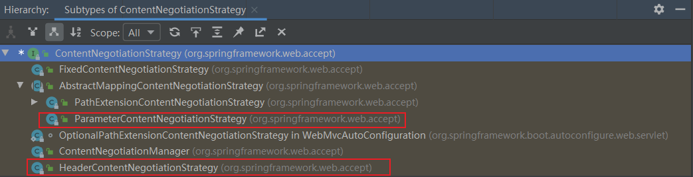

#### 7.2.7.6 模板引擎

**常用的模板引擎**：[thymeleaf](https://www.thymeleaf.org/index.html)、freemaker、velocity

thymeleaf：现代化、服务端Java模板引擎

##### 7.2.7.6.1 thymeleaf语法

1. 表达式语法

   | 表达式名字 |  语法  |                用途                |
   | :--------: | :----: | :--------------------------------: |
   |  变量取值  | ${...} |  获取请求域、session域、对象等值   |
   |  选择变量  | *{...} |          获取上下文对象值          |
   |    消息    | #{...} |           获取国际化等值           |
   |    链接    | @{...} |              生成链接              |
   | 片段表达式 | ~{...} | jsp:include 作用，引入公共页面片段 |

2. 字面量
   - 文本值：'one text' , 'Another one!' ,…
   - 数字：0 , 34 , 3.0 , 12.3 ,…
   - 布尔值：true , false
   - 空值：null
   - 变量：one，two，.... 变量不能有空格

3. 文本操作
   - 字符串拼接: +
   - 变量替换: |The name is ${name}|

4. 数学运算
   
   - 运算符：+ , - , * , / , %
5. 布尔运算
   - 运算符：and , or
   - 一元运算：! , not
6. 比较运算
   - 比较：> , < , >= , <= ( gt , lt , ge , le )
   - 等式：== , != ( eq , ne )

7. 条件运算
   - If-then：(if) ? (then)
   - If-then-else：(if) ? (then) : (else)
   - Default:：(value) ?: (defaultvalue)

8. 特殊操作
   
   - 无操作：_

##### 7.2.7.6.2 常见用法

1. 设置属性值-th:attr

   ```html
   <!--设置单个值-->
   <form action="subscribe.html" th:attr="action=@{/subscribe}">
     <fieldset>
       <input type="text" name="email" />
       <input type="submit" value="Subscribe!" th:attr="value=#{subscribe.submit}"/>
     </fieldset>
   </form>
   
   <!--设置多个值-->
   
   
   <!--替代写法-->
   <input type="submit" value="Subscribe!" th:value="#{subscribe.submit}"/>
   <form action="subscribe.html" th:action="@{/subscribe}">
   ```

2. 迭代

   ```html
   <tr th:each="prod : ${prods}">
   	<td th:text="${prod.name}">Onions</td>
       <td th:text="${prod.price}">2.41</td>
   	<td th:text="${prod.inStock}? #{true} : #{false}">yes</td>
   </tr>
   
   <tr th:each="prod,iterStat : ${prods}" th:class="${iterStat.odd}? 'odd'">
     <td th:text="${prod.name}">Onions</td>
     <td th:text="${prod.price}">2.41</td>
     <td th:text="${prod.inStock}? #{true} : #{false}">yes</td>
   </tr>
   ```

3. 条件运算

   ```html
   <a href="comments.html"
   th:href="@{/product/comments(prodId=${prod.id})}"
   th:if="${not #lists.isEmpty(prod.comments)}">view</a>
   
   <div th:switch="${user.role}">
     <p th:case="'admin'">User is an administrator</p>
     <p th:case="#{roles.manager}">User is a manager</p>
     <p th:case="*">User is some other thing</p>
   </div>
   ```

##### 7.2.7.6.3 使用方法

引入依赖：

```xml
<dependency>
    <groupId>org.springframework.boot</groupId>
    <artifactId>spring-boot-starter-thymeleaf</artifactId>
</dependency>
```

自动配置：

- thymeleaf的配置值都在ThymeleafProperties

  ```java
  public static final String DEFAULT_PREFIX = "classpath:/templates/"; // 放置位置
  public static final String DEFAULT_SUFFIX = ".html"; // 文件命名
  ```

- 配置好了模板引擎SpringTemplateEngine

- 配置了试图解析器ThymeleafViewResolver

```java
@Configuration(proxyBeanMethods = false)
@EnableConfigurationProperties(ThymeleafProperties.class)
@ConditionalOnClass({ TemplateMode.class, SpringTemplateEngine.class })
@AutoConfigureAfter({ WebMvcAutoConfiguration.class, WebFluxAutoConfiguration.class })
public class ThymeleafAutoConfiguration { }
```

##### 7.2.7.6.4 视图解析原理

1. 目标方法处理的过程中，所有数据都会被放在ModelAndViewContainer 里面（包括数据和视图地址）
2. 方法的参数是一个自定义类型对象（从请求参数中确定的），把他重新放在ModelAndViewContainer
3. 任何目标方法执行完成以后都会返回 ModelAndView（数据和视图地址）
4. processDispatchResult  处理派发结果（页面改如何响应）
   - render(mv, request, response); 进行页面渲染逻辑
   - 根据方法的String返回值得到View对象（定义了页面的渲染逻辑）
     - 所有的视图解析器尝试是否能根据当前返回值得到View对象
     - 得到了redirect:/main.html-->Thymeleaf new RedirectView()
     - ContentNegotiationViewResolver 里面包含了下面所有的视图解析器，内部还是利用下面所有视图解析器得到视图对象
     - view.render(mv.getModelInternal(), request, response);   视图对象调用自定义的render进行页面渲染工作
       - RedirectView 如何渲染（重定向到一个页面）
         - 获取目标url地址
         - response.sendRedirect(encodedURL)

5. 视图解析的过程：
   - 返回值以forward:开始：new InternalResourceView(forwardUrl)；转发request.getRequestDispatcher(path).forward(request, response)
   - 返回值以redirect:开始：new RedirectView()-->render就是重定向 
   - 返回值是普通字符串：new ThymeleafView()

#### 7.2.7.7 拦截器

**拦截器的使用**：

1. 定义拦截器，实现HandlerInterceptor接口：

   ```java
   public class LoginInterceptor implements HandlerInterceptor {
       @Override
       public boolean preHandle(HttpServletRequest request, HttpServletResponse response, Object handler) throws Exception {
           String requestURI = request.getRequestURI();
           log.info("preHandle拦截的请求路径是{}",requestURI);
           HttpSession session = request.getSession();//登录检查逻辑
           Object loginUser = session.getAttribute("loginUser");
           if(loginUser != null){
               return true;//放行
           }
           request.setAttribute("msg","请先登录");//拦截住。未登录。跳转到登录页
   //        re.sendRedirect("/");
           request.getRequestDispatcher("/").forward(request,response);
           return false;
       }
   
       @Override
       public void postHandle(HttpServletRequest request, HttpServletResponse response, Object handler, ModelAndView modelAndView) throws Exception {
           log.info("postHandle执行{}",modelAndView);
       }
   
       @Override
       public void afterCompletion(HttpServletRequest request, HttpServletResponse response, Object handler, Exception ex) throws Exception {
           log.info("afterCompletion执行异常{}",ex);
       }
   }
   ```

2. 配置拦截器：

   ```java
   @Configuration
   public class AdminWebConfig implements WebMvcConfigurer {
       @Override
       public void addInterceptors(InterceptorRegistry registry) {
           registry.addInterceptor(new LoginInterceptor())
                   .addPathPatterns("/**")  // 所有请求都被拦截包括静态资源
                   .excludePathPatterns("/","/login","/css/**","/fonts/**","/images/**","/js/**"); //放行的请求
       }
   }
   ```

**拦截器的原理**：

- 根据当前请求，找到HandlerExecutionChain（包含可以处理请求的handler以及handler的所有拦截器）
- 先来顺序执行所有拦截器的preHandle方法
  - 如果当前拦截器prehandler返回为true。则执行下一个拦截器的preHandle
  - 如果当前拦截器返回为false。直接倒序执行所有已经执行了的拦截器的afterCompletion

- 如果任何一个拦截器返回false。直接跳出不执行目标方法
- 所有拦截器都返回True，执行目标方法
- 倒序执行所有拦截器的postHandle方法
- 前面的步骤有任何异常都会直接倒序触发afterCompletion；页面成功渲染完成以后，也会倒序触发afterCompletion

#### 7.2.7.8 文件上传

**文件上传的使用**：

MultipartFile：会自动封装上传过来的文件。

MultipartAutoConfiguration：文件上传相关的自动配置。

StandardServletMultipartResolver：文件上传解析器。

```java
@Configuration(proxyBeanMethods = false)
@ConditionalOnClass({ Servlet.class, StandardServletMultipartResolver.class, MultipartConfigElement.class })
@ConditionalOnProperty(prefix = "spring.servlet.multipart", name = "enabled", matchIfMissing = true)
@ConditionalOnWebApplication(type = Type.SERVLET)
@EnableConfigurationProperties(MultipartProperties.class)
public class MultipartAutoConfiguration {
```

MultipartProperties：文件上传配置的具体属性。

```properties
spring.servlet.multipart.max-file-size=10MB // 配置单个文件的最大大小（默认为1MB）
spring.servlet.multipart.max-request-size=100MB // 配置总的上传文件的大小（默认为100MB）
```

```java
@PostMapping("/upload")
public String upload(@RequestParam("email") String email,
                     @RequestParam("username") String username,
                     // 单文件上传
                     @RequestPart("headerImg") MultipartFile headerImg,
                     // 多文件上传
                     @RequestPart("photos") MultipartFile[] photos) throws IOException {
    log.info("上传的信息：email={}，username={}，headerImg={}，photos={}",
            email,username,headerImg.getSize(),photos.length);
    if(!headerImg.isEmpty()){
        //保存到文件服务器，OSS服务器
        String originalFilename = headerImg.getOriginalFilename();
        headerImg.transferTo(new File("H:\\cache\\"+originalFilename));
    }
    if(photos.length > 0){
        for (MultipartFile photo : photos) {
            if(!photo.isEmpty()){
                String originalFilename = photo.getOriginalFilename();
                photo.transferTo(new File("H:\\cache\\"+originalFilename));
            }
        }
    }
    return "main";
}
```

**文件上传的原理**：

- 请求进来使用文件上传解析器判断（isMultipart）并封装（resolveMultipart，返回MultipartHttpServletRequest）文件上传请求
- 使用参数解析器（RequestPartMethodArgumentResolver）来解析请求中的文件内容封装成MultipartFile
- 将request中文件信息封装为一个Map（MultiValueMap<String, MultipartFile>）
- 使用FileCopyUtils实现文件流的拷贝

#### 7.2.7.9 异常处理

##### 7.2.7.9.1 错误处理

**默认错误处理规则**：

- 默认情况下，Spring Boot提供/error处理所有错误的映射。
  - 对于机器客户端，它将生成JSON响应，其中包含错误，HTTP状态和异常消息的详细信息
  - 对于浏览器客户端，响应一个"whitelabel"错误视图，以HTML格式呈现相同的数据

**定制错误处理规则**：

ErrorMvcAutoConfiguration：自动配置异常处理规则。

```java
@Configuration(proxyBeanMethods = false)
@ConditionalOnWebApplication(type = Type.SERVLET)
@ConditionalOnClass({ Servlet.class, DispatcherServlet.class })
// Load before the main WebMvcAutoConfiguration so that the error View is available
@AutoConfigureBefore(WebMvcAutoConfiguration.class)
@EnableConfigurationProperties({ ServerProperties.class, WebMvcProperties.class })
public class ErrorMvcAutoConfiguration {
```

- 方式一：将自定义错误页面放在静态资源目录的/error文件夹下或者模板引擎文件夹template的/error文件夹下，自定义错误页面的文件名为4xx.html、5xx.html；匹配原则：有精确的错误状态码页面就匹配精确，没有就找4xx.html；如果都没有就触发白页。

  - BasicErrorController：处理错误的映射，默认是/error，可以进行配置。

    ```properties
    server.error.path=/error // 默认处理的映射是/error
    ```

  - DefaultErrorAttributes：定义响应的错误页面包含哪些内容。
  - DefaultErrorViewResolver：解析视图，以HTTP的状态码作为视图名称，找到定义的错误页面（/error/4xx.html、error/5xx.html）。

- 方式二（推荐）：@ControllerAdvice（跳转到视图）/@RestControllerAdvice（直接输出响应）+@ExceptionHandler，底层由**ExceptionHandlerExceptionResolver**进行处理。

- 方式三：@ResponseStatus+自定义异常，底层由**ResponseStatusExceptionResolver**进行处理，底层调用response.sendError(statusCode, resolvedReason)把@Responsestatus注解的信息由tomcat发送到/error。

- 方式四：Spring底层提供的异常，如类型转换异常，底层由**DefaultHandlerExceptionResolver**进行处理，底层调用response.sendError(HttpServletResponse.SC_BAD_REQUEST, ex.getMessage())由tomcat发送到/error。

- 方式五：自定义异常解析器：实现HandlerExceptionResolver，重写resolveException方法；自定义的异常优先级最低，可以使用@Order(value = Ordered.HIGHEST_PRECEDENCE)提高优先级（也可以是数字，数字越小，优先级越高）。

- 方式六：ErrorViewResolver，最底层的异常解析器，只要最后没能被处理的异常，都会交给ErrorViewResolver进行处理，ErrorViewResolver会调用response.sendError将error请求转发给basicErrorController，然后去寻找/error/4xx.html或/error/5xx.html。

##### 7.2.7.9.2 处理流程

异常处理的流程：

1. 执行目标方法，目标方法运行期间有任何异常都会被catch、而且标志当前请求结束；并且用dispatchException
2. 进入视图解析流程（页面渲染？）processDispatchResult(processedRequest, response, mappedHandler, mv, dispatchException)
3. mv=processHandlerException；处理handler发生的异常，处理完成返回ModelAndView

#### 7.2.7.10 注入Web原生组件

**原生组件**主要指：Servlet（监听请求）、Filter（过滤器）、Listener（监听器）。

##### 7.2.7.10.1 使用原生Servlet API

   - @ServletComponentScan(basePackages="指定扫描包")：配置在启动类上，指定原生Servlet组件都放在哪里

   - @WebServlet(urlPatterns="/my")：效果是直接响应，没有经过Spring的拦截器（Filter-->Servlet-->Interceptor-->Controller）

     ```java
     // 启动类上使用@ServletComponentScan(basePackages="指定扫描包")
     @WebServlet(urlPatterns = "/my")
     public class MyServlet extends HttpServlet {
         @Override
         protected void doGet(HttpServletRequest req, HttpServletResponse resp) throws ServletException, IOException {
             resp.getWriter().write("66666");
         }
     }
     ```

   - @WebFilter(urlPatterns={"/css/"**,**"/images/\"})

     ```java
     @Slf4j
     @WebFilter(urlPatterns = {"/css/*","/images/*"})
     public class MyFilter implements Filter {
         @Override
         public void init(FilterConfig filterConfig) throws ServletException {
             log.info("MyFilter初始化完成");
         }
     
         @Override
         public void doFilter(ServletRequest servletRequest, ServletResponse servletResponse, FilterChain filterChain) throws IOException, ServletException {
             log.info("MyFilter工作");
             filterChain.doFilter(servletRequest, servletResponse);
         }
     
         @Override
         public void destroy() {
             log.info("MyFilter销毁");
         }
     }
     ```

   - @WebListener

     ```java
     @WebListener
     public class MyListener implements ServletContextListener {
         @Override
         public void contextInitialized(ServletContextEvent sce) {
             log.info("MyListener监听到项目初始化完成");
         }
     
         @Override
         public void contextDestroyed(ServletContextEvent sce) {
             log.info("MyListener监听到项目销毁");
         }
     }
     ```

##### 7.2.7.10.2 使用RegistrationBean

RegistrationBean即：ServletRegistrationBean、FilterRegistrationBean、ServletListenerRegistrationBean

```java
@Configuration
public class MyRegistConfig {
    @Bean
    public ServletRegistrationBean myServlet(){
        MyServlet myServlet = new MyServlet();
        return new ServletRegistrationBean(myServlet,"/my","/my02");
    }

    @Bean
    public FilterRegistrationBean myFilter(){
        MyFilter myFilter = new MyFilter();
//        return new FilterRegistrationBean(myFilter,myServlet());
        FilterRegistrationBean filterRegistrationBean = new FilterRegistrationBean(myFilter);
        filterRegistrationBean.setUrlPatterns(Arrays.asList("/my","/css/*"));
        return filterRegistrationBean;
    }

    @Bean
    public ServletListenerRegistrationBean myListener(){
        MyListener myListener = new MyListener();
        return new ServletListenerRegistrationBean(myListener);
    }
}
```

   - 扩展：DispatchServlet 如何注册进来？

     - 容器中自动配置了DispatcherServlet属性绑定到WebMvcProperties；对应的配置文件配置项是spring.mvc

     - 通过 ServletRegistrationBean\<DispatcherServlet\> 把 DispatcherServlet  配置进来。

     - 默认映射的是/路径。

       ```properties
       spring.mvc.servlet.path=/mvc/ //默认是/路径
       ```

   - 多个Servlet都能处理到同一层路径，精确优先原则

#### 7.2.7.11 嵌入式Servlet容器

**默认支持的WebServer**：ServletWebServerApplicationContext容器启动寻找ServletWebServerFactory并引导创建服务器。

- Tomcat、Jetty、Netty、Undertow...（可以在ServletWebServerFactoryAutoConfiguration查看默认的Web服务器）

##### 7.2.7.11.1 切换Web服务器

切换Web服务器的方法：

```xml
<dependency>
    <!--spring-boot-starter-web默认引入了tomcat-->
    <groupId>org.springframework.boot</groupId>
    <artifactId>spring-boot-starter-web</artifactId>
    <exclusions>
        <exclusion>
            <groupId>org.springframework.boot</groupId>
            <artifactId>spring-boot-starter-tomcat</artifactId>
        </exclusion>
    </exclusions>
</dependency>
<dependency>
    <groupId>org.springframework.boot</groupId>
    <artifactId>spring-boot-starter-undertow</artifactId>
</dependency>
```

**工作原理**：

- SpringBoot应用启动后发现当前是Web应用，web场景包-导入tomcat
- web应用会创建一个web版的ioc容器ServletWebServerApplicationContext 
- ServletWebServerApplicationContext启动的时候寻找ServletWebServerFactory（Servlet 的web服务器工厂-->Servlet的web服务器）
- SpringBoot底层默认有很多的WebServer工厂：`TomcatServletWebServerFactory` 、`JettyServletWebServerFactory`、`UndertowServletWebServerFactory`
- 底层直接会有一个自动配置类ServletWebServerFactoryAutoConfiguration
- ServletWebServerFactoryAutoConfiguration导入了ServletWebServerFactoryConfiguration（配置类），ServletWebServerFactoryConfiguration配置类根据动态判断系统中到底导入了那个Web服务器的包（默认是web-starter导入tomcat包），容器中就有 TomcatServletWebServerFactory
- TomcatServletWebServerFactory创建出Tomcat服务器并启动；TomcatWebServer的构造器拥有初始化方法initialize-->this.tomcat.start();内嵌服务器，就是手动把启动服务器的代码调用（tomcat核心jar包存在） 

##### 7.2.7.11.2 定制Web服务器信息

- 方法一：直接修改配置文件

  ```properties
  server.xxx
  ```

- 方法二：实现WebServerFactoryCustomizer\<ConfigurableServletWebServerFactory\>

  ```java
  @Component
  public class CustomizationBean implements WebServerFactoryCustomizer<ConfigurableServletWebServerFactory> {
      @Override
      public void customize(ConfigurableServletWebServerFactory server) {
          server.setPort(9000);
      }
  }
  ```

- 方法三：直接自定义ConfigurableServletWebServerFactory

  ```java
  @Bean
  public ConfigurableServletWebServerFactory webServerFactory() {
      TomcatServletWebServerFactory factory = new TomcatServletWebServerFactory();
      factory.setPort(9000);
      factory.setSessionTimeout(10, TimeUnit.MINUTES);
      factory.addErrorPages(new ErrorPage(HttpStatus.NOT_FOUND, "/notfound.html"));
      return factory;
  }
  ```

#### 7.2.7.12 定制Web功能

定制Web功能的方法：

- 方法一：修改配置文件

- 方法二：实现xxxxxCustomizer

- 方法三：编写自定义的配置类xxxConfiguration+@Bean替换或增加容器中默认组件

- 方法四：可以实现WebMvcConfigurer接口（**@EnableWebMvc要慎用**）

  ```java
  // 添加@EnableWebMvc后会全面接管SpringMVC，静态资源、视图解析器、欢迎页...全部失效
  // @EnableWebMvc要慎用
  @EnableWebMvc
  @Configuration
  public class AdminWebConfig implements WebMvcConfigurer {
      @Bean
      public WebMvcRegistrations webMvcRegistrations(){
          return new WebMvcRegistrations() {
              @Override
              public RequestMappingHandlerMapping getRequestMappingHandlerMapping() {
                  return null;
              }
          };
      }
      // 定义静态资源行为
      @Override
      public void addResourceHandlers(ResourceHandlerRegistry registry) {
          // 访问/aa/**所有请求都去classpath:/static/下进行匹配
          registry.addResourceHandler("/aa/**")
                  .addResourceLocations("classpath:/static/");
      }
  }
  ```

**@EnableWebMvc全面接管SpringMVC的原理**：

1. WebMvcAutoConfiguration默认的SpringMVC的自动配置功能类：静态资源、欢迎页...

2. 若使用 @EnableWebMvc，会@Import(DelegatingWebMvcConfiguration.class)

   ```java
   @Configuration(proxyBeanMethods = false)
   public class DelegatingWebMvcConfiguration extends WebMvcConfigurationSupport
   ```

3. DelegatingWebMvcConfiguration的作用，只保证SpringMVC最基本的使用：

   - 把所有系统中的WebMvcConfigurer拿过来。所有功能的定制都是这些WebMvcConfigurer合起来一起生效
   - 自动配置了一些非常底层的组件：RequestMappingHandlerMapping...这些组件依赖的组件都是从容器中获取

4. WebMvcAutoConfiguration里面的配置要能生效必须@ConditionalOnMissingBean(WebMvcConfigurationSupport.class)
5. 由2和4知：@EnableWebMvc导致了WebMvcAutoConfiguration没有生效

### 7.2.8 数据访问

#### 7.2.8.1 数据源的自动配置

- 第一步：导入依赖

  为什么导入JDBC场景，官方不导入驱动？官方不知道我们接下要操作什么数据库，因此没有导入mysql-connector-java（需要自行导入），但是对mysql-connector-java进行了版本指定。

  ```xml
  <dependency>
  	<groupId>org.springframework.boot</groupId>
      <artifactId>spring-boot-starter-data-jdbc</artifactId>
  </dependency>
  <!--spring-boot-starter-data-jdbc底层导入-->
  // com.zaxxer:HikariCP:3.4.5 支持数据源
  // org.springframework:spring-jdbc:5.3.1 支持jDBC
  // org.springframework:spring-tx:5.3.1 支持事务
  
  <!--导入mysql驱动-->
  <dependency>
      <groupId>mysql</groupId>
      <artifactId>mysql-connector-java</artifactId>
  </dependency>
  ```

- 第二步：进行自动配置

  - DataSourceAutoConfiguration：数据源的自动配置

    - 修改数据源相关的配置：spring.datasource（**具体配置项在DataSourceProperties中**）

      ```properties
      spring.datasource.type=com.zaxxer.hikari.HikariDataSource
      spring.datasource.driver-class-name=com.zaxxer.hikari.HikariDataSource // 默认是Hikari连接池
      spring.datasource.url=jdbc:mysql://localhost:3306/db_account
      spring.datasource.username=root
      spring.datasource.password=123456
      ```

    - 数据库连接池的配置：自己容器中没有DataSource才自动配置的；底层配置好的连接池是HikariDataSource

  - DataSourceTransactionManagerAutoConfiguration：事务管理器的自动配置

  - JdbcTemplateAutoConfiguration：JdbcTemplate的自动配置，可以来对数据库进行crud

    - 可以修改这个配置项@ConfigurationProperties(prefix = "spring.jdbc")来修改JdbcTemplate（**具体配置项JdbcProperties中**）

      ```properties
      spring.jdbc.template.query-timeout=3
      ```

    - 使用@Autowired自动注入JdbcTemplate，然后开始使用即可

  - JndiDataSourceAutoConfiguration：jndi的自动配置
  - XADataSourceAutoConfiguration：分布式事务相关的自动配置

#### 7.2.8.2 使用Druid数据源

Druid的官方地址：https://github.com/alibaba/druid/

整合配置Druid有两种方式：自定义配置以及starter方式

##### 7.2.8.2.1 自定义配置

   - 引入依赖：

     ```xml
     <dependency>
     	<groupId>com.alibaba</groupId>
     	<artifactId>druid</artifactId>
     	<version>1.1.17</version>
     </dependency>
     ```

   - 在Config中进行配置：

     ```java
     @Configuration
     public class MyDataSourceConfig {
         // 会自动与yml中的配置属性自动绑定
         @ConfigurationProperties("spring.datasource")
         @Bean
         public DataSource dataSource() throws SQLException {
             DruidDataSource druidDataSource = new DruidDataSource();
             // 加入监控功能和防火墙功能
             druidDataSource.setFilters("stat,wall");
             return druidDataSource;
         }
     
         // 配置Druid的监控页面
         @Bean
         public ServletRegistrationBean statViewServlet(){
             StatViewServlet statViewServlet = new StatViewServlet();
             ServletRegistrationBean<StatViewServlet> servletRegistration = new ServletRegistrationBean<>(statViewServlet, "/druid/*");
             servletRegistration.addInitParameter("loginUsername","admin");
             servletRegistration.addInitParameter("loginPassword","123456");
             return servletRegistration;
         }
     
         // 用于采集web-jdbc关联监控的数据
         public FilterRegistrationBean webStatFilter(){
             WebStatFilter webStatFilter = new WebStatFilter();
             FilterRegistrationBean<WebStatFilter> filterRegistration = new FilterRegistrationBean<>(webStatFilter);
             filterRegistration.setUrlPatterns(Arrays.asList("/*"));
             filterRegistration.addInitParameter("exclusions", "*.js,*.gif,*.jpg,*.png,*.css,*.ico,/druid/*");
             return filterRegistration;
         }
     }
     ```

##### 7.2.8.2.2 引入starter

- 第一步：引入依赖

  ```xml
  <dependency>
      <groupId>com.alibaba</groupId>
      <artifactId>druid-spring-boot-starter</artifactId>
      <version>1.1.17</version>
  </dependency>
  ```

- 第二步：进行配置

  - DruidDataSourceAutoConfigure：starter引入的自动配置，优先于DataSourceAutoConfiguration生效，因为DruidDataSourceAutoConfigure采用了注解@AutoConfigureBefore(DataSourceAutoConfiguration.class)

    - `spring.datasource.druid`：具体配置项在DruidStatProperties中

    - `spring.datasource.druid.aop-patterns`：配置Spring监控，具体配置项在DruidSpringAopConfiguration中

    - `spring.datasource.druid.stat-view-servlet`：配置监控页（默认开启），具体配置项在DruidStatViewServletConfiguration中

    - `spring.datasource.druid.web-stat-filter`：配置Web监控（默认开启），具体配置项在DruidWebStatFilterConfiguration中

    - `DruidFilterConfiguration`：所有Druid自己filter的配置

      ```java
      private static final String FILTER_STAT_PREFIX = "spring.datasource.druid.filter.stat";
      private static final String FILTER_CONFIG_PREFIX = "spring.datasource.druid.filter.config";
      private static final String FILTER_ENCODING_PREFIX = "spring.datasource.druid.filter.encoding";
      private static final String FILTER_SLF4J_PREFIX = "spring.datasource.druid.filter.slf4j";
      private static final String FILTER_LOG4J_PREFIX = "spring.datasource.druid.filter.log4j";
      private static final String FILTER_LOG4J2_PREFIX = "spring.datasource.druid.filter.log4j2";
      private static final String FILTER_COMMONS_LOG_PREFIX = "spring.datasource.druid.filter.commons-log";
      private static final String FILTER_WALL_PREFIX = "spring.datasource.druid.filter.wall";
      private static final String FILTER_WALL_CONFIG_PREFIX = FILTER_WALL_PREFIX + ".config";
      ```

  - 在yml中进行配置：[官方配置参考](https://github.com/alibaba/druid/tree/master/druid-spring-boot-starter)

    ```yml
    spring:
      datasource:
        url: jdbc:mysql://localhost:3306/db_account
        username: root
        password: 123456
        driver-class-name: com.mysql.jdbc.Driver
        
        druid:
          aop-patterns: com.atguigu.admin.*  #监控SpringBean
          filters: stat,wall # 底层开启功能，stat（sql监控），wall（防火墙）
    
          stat-view-servlet: # 配置监控页功能
            enabled: true
            login-username: admin
            login-password: admin
            resetEnable: false
    
          web-stat-filter: # 监控web
            enabled: true
            urlPattern: /*
            exclusions: '*.js,*.gif,*.jpg,*.png,*.css,*.ico,/druid/*'
    
          filter:
            stat: # 对上面filters里面的stat的详细配置
              slow-sql-millis: 1000
              logSlowSql: true
              enabled: true
            wall:
              enabled: true
              config:
                drop-table-allow: false
    ```

#### 7.2.8.3 整合MyBatis

MyBatis的官方地址：https://mybatis.org/mybatis-3/zh/getting-started.html

MyBatis starter的官方地址：https://github.com/mybatis/spring-boot-starter

**关于Starter**：

- SpringBoot官方的Starter：spring-boot-starter-*
- 第三方的： *-spring-boot-starter

引入依赖：

```xml
<dependency>
    <groupId>org.mybatis.spring.boot</groupId>
    <artifactId>mybatis-spring-boot-starter</artifactId>
    <version>2.1.4</version>
</dependency>
```

##### 7.2.8.3.1 配置模式

- MybatisAutoConfiguration：MyBatis的自动配置类，MybatisAutoConfiguration类中自动配置好了SqlSessionFactory、SqlSessionTemplate（组合了SqlSession）

  - `mybatis`：具体配置项在MybatisProperties中

    ```yml
    # 配置mybatis规则
    mybatis:
      # #全局配置文件位置，可以在mybatis.configuration中配置，而不需要在mybatis-config.xml中进行配置了
      # config-location: classpath:mybatis/mybatis-config.xml
      mapper-locations: classpath:mybatis/mapper/*.xml  #sql映射文件位置
      configuration:
        map-underscore-to-camel-case: true
    ```

- 编写mapper接口，标注@Mapper注解（*或者可以在启动类上使用@MapperScan("mapper文件所在包") 扫描mapper接口*）

- 编写sql映射文件并绑定mapper接口

  ```xml
  <?xml version="1.0" encoding="UTF-8" ?>
  <!DOCTYPE mapper
          PUBLIC "-//mybatis.org//DTD Mapper 3.0//EN"
          "http://mybatis.org/dtd/mybatis-3-mapper.dtd">
  <mapper namespace="com.atguigu.admin.mapper.AccountMapper">
  <!--public Account getAcct(Long id); -->
      <select id="getAcct" resultType="com.atguigu.admin.bean.Account">
          select * from  account_tbl where  id=#{id}
      </select>
  </mapper>
  ```

##### 7.2.8.3.2 注解模式

```java
@Mapper
public interface CityMapper {
    @Select("select * from city where id=#{id}")
    public City getById(Long id);
    @Insert("insert into city(`name`,`state`,`country`) values(#{name},#{state},#{country})")
    @Options(useGeneratedKeys="true",keyProperty="id")
    public void insert(City city);
}
```

##### 7.2.8.3.3 混合模式

**混合模式**：可以同时使用XML配置模式或注解模式

#### 7.2.8.4 整合MyBatis-Plus

MyBatis-Plus官方地址：https://baomidou.com/guide/

MyBatis-Plus：简称MP，是一个MyBatis的增强工具，在MyBatis的基础上只做增强不做改变，为简化开发、提高效率而生。

建议安装MyBatis X插件：支持快速跳转、自动生成代码、自动生成XML

引入依赖：

```xml
<dependency>
	<groupId>com.baomidou</groupId>
	<artifactId>mybatis-plus-boot-starter</artifactId>
	<version>3.4.1</version>
</dependency>
```

自动配置：

- MybatisPlusAutoConfiguration：MyBatis-Plus的自动配置类，自动配置好了SqlSessionFactory、SqlSessionTemplate
  - `mybatis-plus`：具体配置项在MybatisPlusProperties中
    - MybatisPlusProperties中配置了mapperLocations的默认值（classpath\*:/mapper/\*\*/\*.xml），表示任意包的类路径下的所有mapper文件夹下任意路径下的所有xml都是sql映射文件（建议以后sql映射文件，统一放在mapper下）
  - @Mapper：在MybatisPlusAutoConfiguration的静态内部类中配置了扫描@Mapper的接口

- 编写的Mapper接口只需要继承BaseMapper就可以拥有CRUD的能力

#### 7.2.8.5 整合Redis

Redis官网：https://www.redis.net.cn/、https://redis.io/、http://www.redis.cn/

引入依赖：

```xml
<dependency>
    <groupId>org.springframework.boot</groupId>
    <artifactId>spring-boot-starter-data-redis</artifactId>
</dependency>
```

自动配置：

- RedisAutoConfiguration：Redis的自动配置类

  - `spring.redis`：具体配置项在RedisProperties中

    ```yml
    # 默认采用Lettuce客户端
    spring:
      redis:
          host: r-bp1nc7reqesxisgxpipd.redis.rds.aliyuncs.com
          port: 6379
          password: lfy:Lfy123456
    ```

  - 支持两种Redis客户端：LettuceConnectionConfiguration、JedisConnectionConfiguration

  - 自动注入了RedisTemplate<Object, Object>（K、V都是Object）、StringRedisTemplate（K，V都是String）

**阿里云Redis环境搭建**：

1. 购买阿里云按量付费Redis、选用经典网络。
2. 申请Redis的公网连接地址
3. 修改白名单，允许0.0.0.0/0 访问

starter默认采用Lettuce作为客户端，**切换为Jedis使用如下方法**：

- 第一步：排除lettuce依赖，引入Jedis客户端依赖

  ```xml
  <dependency>
  	<groupId>org.springframework.boot</groupId>
  	<artifactId>spring-boot-starter-data-redis</artifactId>
      <exclusions>
      	<exclusion>
          	<groupId>io.lettuce</groupId>
          	<artifactId>lettuce-core</artifactId>
      	</exclusion>
  	</exclusions>
  </dependency>
  
  <!--导入jedis-->
  <dependency>
      <groupId>redis.clients</groupId>
      <artifactId>jedis</artifactId>
  </dependency>
  ```

- 第二步：配置使用Jedis

  ```yml
  spring:
    redis:
        client-type: jedis
        jedis:
          pool:
            max-active: 10
  ```

### 7.2.9 单元测试

JUnit官网：https://junit.org/junit5/docs/current/user-guide/

**单元测试版本信息**：

- SpringBoot 2.2.0版本开始引入JUnit5作为单元测试模式库

- SpringBoot 2.4以上版本移除了默认对Vintage的依赖；如果需要兼容JUnit4需要自行引入Vintage（如不引入则不能使用JUnit4的功能@Test）

  ```xml
  <!--兼容Junit4-->
  <dependency>
      <groupId>org.junit.vintage</groupId>
      <artifactId>junit-vintage-engine</artifactId>
      <scope>test</scope>
      <exclusions>
          <exclusion>
              <groupId>org.hamcrest</groupId>
              <artifactId>hamcrest-core</artifactId>
          </exclusion>
      </exclusions>
  </dependency>
  ```

**JUnit 5的组成**：由JUnit Platform+JUnit Jupiter+JUnit Vintage组成

- JUnit Platform：Junit Platform是在JVM上启动测试框架的基础，不仅支持Junit自制的测试引擎，其他测试引擎也都可以接入。
- JUnit Jupiter：JUnit Jupiter提供了JUnit5的新的编程模型，是JUnit5新特性的核心。内部包含了一个测试引擎，用于在Junit Platform上运行。
- JUnit Vintage：由于JUint已经发展多年，为了照顾老的项目，JUnit Vintage提供了兼容JUnit4.x,Junit3.x的测试引擎。

**引入依赖**：使用JUnit5

```xml
<!--SpringBoot 2.4版本以后，默认使用JUnit 5-->
<dependency>
  <groupId>org.springframework.boot</groupId>
  <artifactId>spring-boot-starter-test</artifactId>
  <scope>test</scope>
</dependency>
```

SpringBoot项目测试：

- JUnit 5：@SpringBootTest+@Test（`org.junit.jupiter.api.Test`）
- JUnit 4：@SpringBootTest+@RunWith(SpringRunner.class)+@Test（`org.junit.Test`）

SpringBoot整合JUnit 5后：

1. 编写测试方法：@Test标注（注意需要使用JUnit5版本的注解）
2. JUnit类具有Spring的功能，@Autowired、@Transactional（标注测试方法，测试完成后自动回滚）

#### 7.2.9.1 常用注解

JUnit5与JUnit4注解变化：[JUnit官网](https://junit.org/junit5/docs/current/user-guide/#writing-tests-annotations)

- **@Test**：表示方法是测试方法。但是与JUnit4的@Test不同，他的职责非常单一不能声明任何属性，拓展的测试将会由Jupiter提供额外测试
- @ParameterizedTest：表示方法是参数化测试，下方会有详细介绍
- **@RepeatedTest**：表示方法可重复执行，下方会有详细介绍
- **@DisplayName**：为测试类或者测试方法设置展示名称
- **@BeforeEach** :表示在每个单元测试之前执行
- **@AfterEach**：表示在每个单元测试之后执行
- **@BeforeAll**：表示在所有单元测试之前执行，修饰的必须是静态方法
- **@AfterAll**：表示在所有单元测试之后执行，修饰的必须是静态方法
- @Tag：表示单元测试类别，类似于JUnit4中的@Categories
- **@Disabled**：表示测试类或测试方法不执行，类似于JUnit4中的@Ignore
- **@Timeout**：表示测试方法运行如果超过了指定时间将会返回错误
- @ExtendWith：为测试类或测试方法提供扩展类引用，类似于JUnit 4的@RunWith

#### 7.2.9.2 断言

断言（Assertions）是测试方法中的核心部分，用来对测试需要满足的条件进行验证（**检查业务逻辑返回的数据是否合理。所有的测试运行结束以后，会有一个详细的测试报告**）。这些断言方法都是`org.junit.jupiter.api.Assertions`的静态方法。JUnit 5内置的断言可以分成如下几个类别：

1. 简单断言

   |      方法       |                 说明                 |
   | :-------------: | :----------------------------------: |
   |  assertEquals   |  判断两个对象或两个原始类型是否相等  |
   | assertNotEquals | 判断两个对象或两个原始类型是否不相等 |
   |   assertSame    |  判断两个对象引用是否指向同一个对象  |
   |  assertNotSame  |  判断两个对象引用是否指向不同的对象  |
   |   assertTrue    |     判断给定的布尔值是否为 true      |
   |   assertFalse   |     判断给定的布尔值是否为 false     |
   |   assertNull    |    判断给定的对象引用是否为 null     |
   |  assertNotNull  |   判断给定的对象引用是否不为 null    |

2. 数组断言

   通过assertArrayEquals方法来判断两个对象或原始类型的数组是否相等。

   ```java
   @Test
   @DisplayName("array assertion")
   public void array() {
   	assertArrayEquals(new int[]{1, 2}, new int[] {1, 2});
   }
   ```

3. 组合断言

   assertAll方法接受多个`org.junit.jupiter.api.Executable`函数式接口的实例作为要验证的断言，可以通过lambda表达式很容易的提供这些断言。

   ```java
   @Test
   @DisplayName("assert all")
   public void all() {
    assertAll("Math",
       () -> assertEquals(2, 1 + 1),
       () -> assertTrue(1 > 0)
    );
   }
   ```

4. 异常断言

   在JUnit4时期，想要测试方法的异常情况时，需要用@Rule注解的ExpectedException变量还是比较麻烦的。而JUnit5提供了一种新的断言方式Assertions.assertThrows()，配合函数式编程就可以进行使用。

   ```java
   @Test
   @DisplayName("异常测试")
   public void exceptionTest() {
       ArithmeticException exception = Assertions.assertThrows(
   		ArithmeticException.class, () -> System.out.println(1 % 0));//扔出断言异常
   }
   ```

5. 超时断言

   JUnit5还提供了Assertions.assertTimeout() 为测试方法设置了超时时间。

   ```java
   @Test
   @DisplayName("超时测试")
   public void timeoutTest() {
       //如果测试方法时间超过1s将会异常
       Assertions.assertTimeout(Duration.ofMillis(1000), () -> Thread.sleep(500));
   }
   ```

6. 快速失败

   通过fail方法直接使得测试失败。

   ```java
   @Test
   @DisplayName("fail")
   public void shouldFail() {
   	fail("This should fail");
   }
   ```

#### 7.2.9.2 前置条件

JUnit 5中的前置条件（Assumptions）类似于断言，不同之处在于不满足的断言会使得测试方法失败，而不满足的前置条件只会使得测试方法的执行终止。前置条件可以看成是测试方法执行的前提，当该前提不满足时，就没有继续执行的必要。

```java
@DisplayName("前置条件")
public class AssumptionsTest {
 private final String environment = "DEV";
 
 @Test
 @DisplayName("simple")
 public void simpleAssume() {
    assumeTrue(Objects.equals(this.environment, "DEV"));
    assumeFalse(() -> Objects.equals(this.environment, "PROD"));
 }
 
 @Test
 @DisplayName("assume then do")
 public void assumeThenDo() {
    assumingThat(
       Objects.equals(this.environment, "DEV"),
       () -> System.out.println("In DEV")
    );
 }
}
```

#### 7.2.9.3 嵌套测试

JUnit 5可以通过Java中的内部类和@Nested注解实现嵌套测试，从而可以更好的把相关的测试方法组织在一起。在内部类中可以使用@BeforeEach和@AfterEach注解，而且嵌套的层次没有限制（**内层可以驱动外层，外层不能驱动内层**）。

```java
@DisplayName("A stack")
class TestingAStackDemo {
    Stack<Object> stack;
    @Test
    @DisplayName("is instantiated with new Stack()")
    void isInstantiatedWithNew() {
        new Stack<>();
    }

    @Nested
    @DisplayName("when new")
    class WhenNew {

        @BeforeEach
        void createNewStack() {
            stack = new Stack<>();
        }

        @Test
        @DisplayName("is empty")
        void isEmpty() {
            assertTrue(stack.isEmpty());
        }

        @Test
        @DisplayName("throws EmptyStackException when popped")
        void throwsExceptionWhenPopped() {
            assertThrows(EmptyStackException.class, stack::pop);
        }

        @Test
        @DisplayName("throws EmptyStackException when peeked")
        void throwsExceptionWhenPeeked() {
            assertThrows(EmptyStackException.class, stack::peek);
        }

        @Nested
        @DisplayName("after pushing an element")
        class AfterPushing {

            String anElement = "an element";

            @BeforeEach
            void pushAnElement() {
                stack.push(anElement);
            }

            @Test
            @DisplayName("it is no longer empty")
            void isNotEmpty() {
                assertFalse(stack.isEmpty());
            }

            @Test
            @DisplayName("returns the element when popped and is empty")
            void returnElementWhenPopped() {
                assertEquals(anElement, stack.pop());
                assertTrue(stack.isEmpty());
            }

            @Test
            @DisplayName("returns the element when peeked but remains not empty")
            void returnElementWhenPeeked() {
                assertEquals(anElement, stack.peek());
                assertFalse(stack.isEmpty());
            }
        }
    }
}
```

#### 7.2.9.4 参数化测试

**参数化测试**是JUnit 5很重要的一个新特性，它使得用不同的参数多次运行测试成为了可能，也为我们的单元测试带来许多便利。利用@ValueSource等注解，指定入参，我们将可以使用不同的参数进行多次单元测试，而不需要每新增一个参数就新增一个单元测试，省去了很多冗余代码。

- **@ValueSource**：为参数化测试指定入参来源，支持八大基础类以及String类型，Class类型
- @NullSource：表示为参数化测试提供一个null的入参
- @EnumSource：表示为参数化测试提供一个枚举入参
- @CsvFileSource：表示读取指定CSV文件内容作为参数化测试入参
- **@MethodSource**：表示读取指定方法的返回值作为参数化测试入参（注意方法返回需要是一个流）

```java
@ParameterizedTest
@ValueSource(strings = {"one", "two", "three"})
@DisplayName("参数化测试1")
public void parameterizedTest1(String string) {
    System.out.println(string);
    Assertions.assertTrue(StringUtils.isNotBlank(string));
}

@ParameterizedTest
@MethodSource("method")    //指定方法名
@DisplayName("方法来源参数")
public void testWithExplicitLocalMethodSource(String name) {
    System.out.println(name);
    Assertions.assertNotNull(name);
}

static Stream<String> method() {
    return Stream.of("apple", "banana");
}
```

#### 7.2.9.5 迁移

从JUnit 4迁移到JUnit 5的注意事项：

- 注解在`org.junit.jupiter.api`中，断言在`org.junit.jupiter.api.Assertions`中，前置条件在`org.junit.jupiter.api.Assumptions`中
- 把@Before和@After替换成@BeforeEach和@AfterEach
- 把@BeforeClass和@AfterClass 替换成@BeforeAll和@AfterAll
- 把@Ignore替换成@Disabled
- 把@Category替换成@Tag
- 把@RunWith、@Rule和@ClassRule替换成@ExtendWith

### 7.2.10 指标监控

[官方文档](https://docs.spring.io/spring-boot/docs/current/reference/html/production-ready-features.html#production-ready-enabling)

#### 7.2.10.1 SpringBoot Actuator

未来每一个微服务在云上部署以后，我们都需要对其进行监控、追踪、审计、控制等。SpringBoot就抽取了Actuator场景，使得我们每个微服务快速引用即可获得生产级别的应用监控、审计等功能。

引入依赖：

```xml
<dependency>
    <groupId>org.springframework.boot</groupId>
    <artifactId>spring-boot-starter-actuator</artifactId>
</dependency>
```

访问地址：http://localhost:8080/actuator/\*\*

配置信息：

```yml
# 开启所有端点信息
management:
  endpoints:
    enabled-by-default: true #暴露所有端点信息
    web:
      exposure:
        include: '*'  #以web方式暴露

# 开启所有health、info、beans端点信息       
management:
  endpoints:
    enabled-by-default: false #不暴露所有端点信息
    web:
      exposure:
        include: '*'  #以web方式暴露
  endpoint:
    health:
      show-details: always
      enabled: true
    info:
      enabled: true
    beans:
      enabled: true
    metrics:
      enabled: true
```

访问地址：http://localhost:8080/actuator/\+EndpointName/+DetailPath

```xml
例如：
http://localhost:8080/actuator/beans
http://localhost:8080/actuator/configprops
http://localhost:8080/actuator/metrics
http://localhost:8080/actuator/metrics/jvm.gc.pause
http://localhost:8080/actuator/metrics/jvm.buffer.memory.used
```

#### 7.2.10.2 Actuator Endpoint

**最常用的端点如下**：Health（监控状况）、Metrics（运行时指标）、Loggers（日志记录）

| ID                 | 描述                                                         |
| ------------------ | ------------------------------------------------------------ |
| `auditevents`      | 暴露当前应用程序的审核事件信息。需要一个`AuditEventRepository组件`。 |
| `beans`            | 显示应用程序中所有Spring Bean的完整列表。                    |
| `caches`           | 暴露可用的缓存。                                             |
| `conditions`       | 显示自动配置的所有条件信息，包括匹配或不匹配的原因。         |
| `configprops`      | 显示所有`@ConfigurationProperties`。                         |
| `env`              | 暴露Spring的属性`ConfigurableEnvironment`                    |
| `flyway`           | 显示已应用的所有Flyway数据库迁移。 需要一个或多个`Flyway`组件。 |
| `health`           | 显示应用程序运行状况信息。                                   |
| `httptrace`        | 显示HTTP跟踪信息（默认情况下，最近100个HTTP请求-响应）。需要一个`HttpTraceRepository`组件。 |
| `info`             | 显示应用程序信息。                                           |
| `integrationgraph` | 显示Spring `integrationgraph` 。需要依赖`spring-integration-core`。 |
| `loggers`          | 显示和修改应用程序中日志的配置。                             |
| `liquibase`        | 显示已应用的所有Liquibase数据库迁移。需要一个或多个`Liquibase`组件。 |
| `metrics`          | 显示当前应用程序的“指标”信息。                               |
| `mappings`         | 显示所有`@RequestMapping`路径列表。                          |
| `scheduledtasks`   | 显示应用程序中的计划任务。                                   |
| `sessions`         | 允许从Spring Session支持的会话存储中检索和删除用户会话。需要使用Spring Session的基于Servlet的Web应用程序。 |
| `shutdown`         | 使应用程序正常关闭。默认禁用。                               |
| `startup`          | 显示由`ApplicationStartup`收集的启动步骤数据。需要使用`SpringApplication`进行配置`BufferingApplicationStartup`。 |
| `threaddump`       | 执行线程转储。                                               |

1. Health Endpoint：健康检查端点，我们一般用于在云平台，平台会定时的检查应用的健康状况，我们就需要Health Endpoint可以为平台返回当前应用的一系列组件健康状况的集合。重要的几点：

   - health endpoint返回的结果，应该是一系列健康检查后的一个汇总报告
   - 很多的健康检查默认已经自动配置好了，比如：数据库、redis等
   - 可以很容易的添加自定义的健康检查机制

   ```yml
   management:
     endpoint:
       health:
         # 配置显示Health Endpoint的详细信息，默认为never
         show-details: always
   ```

2. Metrics Endpoint：提供详细的、层级的、空间指标信息，这些信息可以被pull（主动推送）或者push（被动获取）方式得到
   - 通过Metrics对接多种监控系统
   - 简化核心Metrics开发
   - 添加自定义Metrics或者扩展已有Metrics

#### 7.2.10.3 定制EndPoint

**定制health信息**：实现HealthIndicator接口或继承AbstractHealthIndicator

**定制info信息**：实现InfoContributor接口

**定制metrics信息**：

**定制EndPoint**：@Endpoint(id="端点名称")、@ReadOperation、@WriteOperation

#### 7.2.10.4 可视化

使用spring-boot-admin进行指标监控的可视化：[官方地址](https://github.com/codecentric/spring-boot-admin)、[使用指南](https://codecentric.github.io/spring-boot-admin/2.3.1/#getting-started)

### 7.2.11 高级特性

#### 7.2.11.1 Profile功能

**Profile功能**：[官方地址](https://docs.spring.io/spring-boot/docs/current/reference/html/spring-boot-features.html#boot-features-profiles)

1. **多环境适配**

   - 默认配置文件application.yaml，任何时候都会加载

   - 指定环境配置文件application-{env}.yaml；默认配置与环境配置同时生效；同名配置项，环境配置优先

     ```properties
     # 默认配置文件中激活pro环境配置文件
     spring.profiles.active=prod
     ```

   - 激活指定环境

     - 配置文件激活
     - 命令行激活：`java -jar xxx.jar --spring.profiles.active=prod`，修改配置文件的任意值，命令行优先

2. **@Profile条件装配**

   ```java
   // 使用场景一：Bean组件的条件装配
   @Profile("prod")
   @Component
   @ConfigurationProperties("person")
   @Data
   public class Boss implements Person{
       // ...
   }
   
   // 使用场景二：配置文件的条件装配
   @Configuration(proxyBeanMethods = false)
   @Profile("prod")
   public class ProductionConfiguration {
       // ...
   }
   ```

3.  **分组**

   ```properties
   spring.profiles.group.production[0]=proddb
   spring.profiles.group.production[1]=prodmq
   !--激活proddb和prodmq文件
   spring.profiles.active=production
   ```

#### 7.2.11.2 配置文件优先级

配置文件优先级：[官方地址](https://docs.spring.io/spring-boot/docs/current/reference/html/spring-boot-features.html#boot-features-external-config)

**外部配置源**：Properties文件、YAML文件、环境变量、命令行参数

**配置文件查找位置顺序**：指定环境优先；外部优先；后面的可以覆盖前面的同名配置项

1. classpath根路径

2. classpath根路径下config目录

3. jar包当前目录

4. jar包当前目录的config目录

5. /config子目录的直接子目录（即一级子目录）（**在Whidows下不生效，在Linux下会生效**）

**配置文件加载顺序**：指定环境优先；外部优先；后面的可以覆盖前面的同名配置项

1. 当前jar包内部的application.properties和application.yml

2. 当前jar包内部的application-{profile}.properties 和 application-{profile}.yml

3. 引用的外部jar包的application.properties和application.yml

4. 引用的外部jar包的application-{profile}.properties 和 application-{profile}.yml

#### 7.2.11.3 自定义starter

**自定义starter**：starter-->spring.factories-->xxxAutoConfiguration-->xxxProperties/xxxService-->yml/properties配置

1. 定义sarter模块：引入xxx-autoconfigure模块

2. xxx-autoconfigure模块内容：

   - 编写xxxProperties：@ConfigurationProperties("配置文件属性前缀")（**注意xxxProperties由xxxAutoConfiguration决定是否注入**）
   - 编写xxxService：编写的业务逻辑，使用@Autowired注入xxxProperties（**注意xxxService由xxxAutoConfiguration决定是否注入**）

   - 编写自动配置类：xxxAutoConfiguration
     - @Configuration：表示该类为配置类
     - @ConditionalOnMissingBean（或者其他的条件注解）：决定是否将配置类中的声明的Bean注入到容器中
     - @Bean：将xxxService注入到容器中（由@ConditionalOnMissingBean决定该Bean是否生效）
     - @EnableConfigurationProperties：该注解本质是@Import，可以将xxxProperties注入到容器中

   - 使用META-INF/spring.factories中EnableAutoConfiguration的值，使得项目启动加载指定的自动配置类

     ```properties
     org.springframework.boot.autoconfigure.EnableAutoConfiguration=\
     xxxAutoConfiguration全限定类名
     ```

#### 7.2.11.4 SpringBoot启动原理


## 7.3 WebFlux响应式编程


# 8 Algorithm

队列：`offer：入队`、`poll：出队`。

栈：`peek：取`、`pop：出栈`、`push：入栈`。

Java中栈和队列都可以用LinkedList来模拟；此外，栈还可以用Stack来模拟。

|                             题目                             |                    思路                     |       时间复杂度       |     空间复杂度      |
| :----------------------------------------------------------: | :-----------------------------------------: | :--------------------: | :-----------------: |
| [0088.合并两个有序数组](https://leetcode-cn.com/problems/merge-sorted-array/) |                   三指针                    |         O(m+n)         |        O(1)         |
|    [0066.加一](https://leetcode-cn.com/problems/plus-one)    |               数组的反向遍历                |          O(n)          |        O(1)         |
| [0053.最大连续子序列/子序列和](https://leetcode-cn.com/problems/maximum-subarray/) |          动态规划/贪心算法/分治法           |          O(n)          |        O(1)         |
| [0026.删除排序数组中的重复项](https://leetcode-cn.com/problems/remove-duplicates-from-sorted-array/description/) |                  快慢指针                   |          O(n)          |        O(1)         |
| [0020.有效的括号](https://leetcode-cn.com/problems/valid-parentheses/description) |                栈/正则表达式                |       O(n)/很快        |      O(1)/O(n)      |
|  [0001.两数之和](https://leetcode-cn.com/problems/two-sum)   |                   哈希表                    |          O(n)          |        O(n)         |
| [0021.合并两个有序链表](https://leetcode-cn.com/problems/merge-two-sorted-lists) |                    递归                     |         O(n+m)         |       O(n+m)        |
| [0160.相交链表](https://leetcode-cn.com/problems/intersection-of-two-linked-lists/) |                双指针/哈希表                |     O(m+n)/O(m+n)      |      O(1)/O(m)      |
| [0101.对称二叉树](https://leetcode-cn.com/problems/symmetric-tree/) |             递归(DFS)/迭代(BFS)             |       O(n)/O(n)        |   O(height)/O(n)    |
| [0104.二叉树的最大深度](https://leetcode-cn.com/problems/maximum-depth-of-binary-tree/description/) |             递归(DFS)/迭代(BFS)             |       O(n)/O(n)        |    O(hight)/O(n)    |
| [0108.将有序数组转换为二叉搜索树](https://leetcode-cn.com/problems/convert-sorted-array-to-binary-search-tree/) |                  递归(LDR)                  |          O(n)          |      O(log(n))      |
| [0121.买卖股票的最佳时机](https://leetcode-cn.com/problems/best-time-to-buy-and-sell-stock/description/) |               数组遍历/双指针               |       O(n)/O(n)        |      O(1)/O(1)      |
| [0122.买卖股票的最佳时机 II](https://leetcode-cn.com/problems/best-time-to-buy-and-sell-stock-ii/description/) |              贪心算法/动态规划              |       O(n)/O(n)        |      O(1)/O(1)      |
| [0125.验证回文串](https://leetcode-cn.com/problems/valid-palindrome/description/) |            双指针及常用api的使用            |          O(n)          |        O(1)         |
| [0136.只出现一次的数字](https://leetcode-cn.com/problems/single-number/) |                   位运算                    |          O(n)          |        O(1)         |
|  [0155.最小栈](https://leetcode-cn.com/problems/min-stack/)  |                   辅助栈                    |          O(1)          |        O(n)         |
| [0167.两数之和II输入有序数组](https://leetcode-cn.com/problems/two-sum-ii-input-array-is-sorted/) |              双指针/二分查找法              |    O(n)/O(nlog(n))     |      O(1)/O(1)      |
| [0169.多数元素](https://leetcode-cn.com/problems/majority-element/) |            投票法/哈希表/排序法             |  O(n)/O(n)/O(nlog(n))  | O(1)/O(n)/O(log(n)) |
| [0172.阶乘后的零](https://leetcode-cn.com/problems/factorial-trailing-zeroes/) |                    迭代                     |       O(log(n))        |        O(1)         |
| [0190.颠倒二进制位](https://leetcode-cn.com/problems/reverse-bits/) |                 位运算+移位                 |          O(1)          |        O(1)         |
| [0191.位1的个数](https://leetcode-cn.com/problems/number-of-1-bits/) |                   位运算                    |          O(1)          |        O(1)         |
| [0198.打家劫舍](https://leetcode-cn.com/problems/house-robber/) |                  动态规划                   |          O(n)          |        O(1)         |
| [0203.移除链表元素](https://leetcode-cn.com/problems/remove-linked-list-elements/) |               哨兵节点+双指针               |          O(n)          |        O(1)         |
| [0206.反转链表](https://leetcode-cn.com/problems/reverse-linked-list/) |                递归/迭代/栈                 |    O(n)/O(n)/O(2n)     |   O(n)/O(1)/O(n)    |
| [0219.存在重复元素 II](https://leetcode-cn.com/problems/contains-duplicate-ii/) |                散列表/哈希表                |       O(n)/O(2n)       |      O(n)/O(n)      |
| [0226.翻转二叉树](https://leetcode-cn.com/problems/invert-binary-tree/) |                  递归/迭代                  |       O(n)/O(n)        |   O(log(n))/O(n)    |
| [0232.用栈实现队列](https://leetcode-cn.com/problems/implement-queue-using-stacks/) |                     栈                      |  O(n)/O(1)/O(1)/O(1)   |        O(1)         |
|  [0263.丑数](https://leetcode-cn.com/problems/ugly-number/)  |                    迭代                     |          O(n)          |        O(1)         |
| [0283.移动零](https://leetcode-cn.com/problems/move-zeroes/) |                   双指针                    |          O(n)          |        O(1)         |
| [0342.4的幂](https://leetcode-cn.com/problems/power-of-four/) |           位运算/位运算+数学运算            |       O(1)/O(1)        |      O(1)/O(1)      |
| [0349.两个数组的交集](https://leetcode-cn.com/problems/intersection-of-two-arrays/) |                   散列表                    |          O(n)          |        O(n)         |
| [0371.两整数之和](https://leetcode-cn.com/problems/sum-of-two-integers/) |                   位运算                    |          O(1)          |        O(1)         |
| [0437.路径总和III](https://leetcode-cn.com/problems/path-sum-iii/)⭐ |           前缀和+哈希表/双重递归            | O(n)/O(nlog(n))~O(n^2) |     O(n)/O(2n)      |
| [0455.分发饼干](https://leetcode-cn.com/problems/assign-cookies/) |                排序+贪心算法                |       O(nlog(n))       |        O(1)         |
| [0575.分糖果](https://leetcode-cn.com/problems/distribute-candies/) |                   散列表                    |          O(n)          |        O(n)         |
| [0821.字符的最短距离](https://leetcode-cn.com/problems/shortest-distance-to-a-character)⭐ |                正遍历+反遍历                |          O(n)          |        O(n)         |
| [1332.删除回文子序列](https://leetcode-cn.com/problems/remove-palindromic-subsequences/) |            审题的重要性（逻辑）             |          O(1)          |        O(1)         |
| [1260.二维网格迁移](https://leetcode-cn.com/problems/shift-2d-grid/description/)⭐ |                    取模                     |         O(m*n)         |       O(m*n)        |
| [0874.模拟行走机器人](https://leetcode-cn.com/problems/walking-robot-simulation/)⭐ |      逻辑+散列表（**将坐标映射为值**）      |         O(n+k)         |        O(k)         |
| [0002.两数相加](https://leetcode-cn.com/problems/add-two-numbers/) |                  链表遍历                   |          O(n)          |        O(n)         |
| [0003.无重复字符的最长子串](https://leetcode-cn.com/problems/longest-substring-without-repeating-characters/)⭐ |             散列表（滑动窗口）              |          O(n)          |        O(n)         |
| [0005.最长回文字串](https://leetcode-solution-leetcode-pp.gitbook.io/leetcode-solution/medium/5.longest-palindromic-substring)⭐ |       动态规划/中心扩展/Manacher算法        |   O(n^2)/O(n^2)/O(n)   |  O(n^2)/O(1)/O(n)   |
| [0011.盛最多水的容器](https://leetcode-cn.com/problems/container-with-most-water/description/) |         双指针（优化后比官解更快）          |          O(n)          |        O(1)         |
|   [0015.三数之和](https://leetcode-cn.com/problems/3sum/)    |                 排序+双指针                 |         O(n^2)         |      O(log(n))      |
| [0017.电话号码的字母组合](https://leetcode-cn.com/problems/letter-combinations-of-a-phone-number)⭐ |          **回溯法+StringBuilder**           |       O(3^m*4^n)       |       O(m+n)        |
| [0019.删除链表的倒数第N个节点](https://leetcode-cn.com/problems/remove-nth-node-from-end-of-list/) |                  快慢指针                   |          O(n)          |        O(1)         |
| [0022.括号生成](https://leetcode-cn.com/problems/generate-parentheses) |          **回溯法+StringBuilder**           |     O(4^n/n^(1/2))     |        O(n)         |
| [0024.两两交换链表中的节点](https://leetcode-cn.com/problems/swap-nodes-in-pairs/) |                  递归/迭代                  |       O(n)/O(n)        |      O(n)/O(1)      |
| [0029.两数相除](https://leetcode-cn.com/problems/divide-two-integers/)⭐ |                  两数相除                   |                        |                     |
| [0031.下一个排列](https://leetcode-cn.com/problems/next-permutation/)⭐ |              解题的逻辑要清晰               |          O(n)          |        O(1)         |
| [0033.搜索旋转排序数组](https://leetcode-cn.com/problems/search-in-rotated-sorted-array/) |                   二分法                    |       O(log(n))        |        O(1)         |
| [0039.组合总和](https://leetcode-cn.com/problems/combination-sum/) |                 **回溯法**                  |        O(n*2^n)        |        O(n)         |
| [0040.组合总和II](https://leetcode-cn.com/problems/combination-sum-ii/) |                 **回溯法**                  |        O(n*2^n)        |        O(n)         |
| [0046.全排列](https://leetcode-cn.com/problems/permutations/) |                 **回溯法**                  |        O(n*n!)         |        O(n)         |
| [0047.全排列 II](https://leetcode-cn.com/problems/permutations-ii/)⭐ |             **先排序，再回溯**              |        O(n*n！)        |        O(n)         |
| [0048.旋转图像](https://leetcode-cn.com/problems/rotate-image/) |        原地旋转/水平翻转+对角线翻转         |     O(n^2)/O(n^2)      |      O(1)/O(1)      |
| [0049.字母异位词分组](https://leetcode-cn.com/problems/group-anagrams/)⭐ |         **排序+哈希表**/计数+哈希表         |      O(nklog(k))       |        O(nk)        |
| [0055.跳跃游戏](https://leetcode-cn.com/problems/jump-game/) |                  贪心算法                   |          O(n)          |        O(1)         |
| [0056.合并区间](https://leetcode-cn.com/problems/merge-intervals/) |             定制排序+链表转数组             |       O(nlog(n))       |      O(log(n))      |
| [0060.第k个排列](https://leetcode-cn.com/problems/permutation-sequence/)⭐ |                                             |                        |                     |
| [0061.旋转链表](https://leetcode-cn.com/problems/rotate-list/) |                    遍历                     |          O(n)          |        O(1)         |
| [0062.不同路径](https://leetcode-cn.com/problems/unique-paths/) |                  迭代/递归                  |    O(mn)/O(2^m+2^n)    |     O(mn)/O(n)      |
| [0073.矩阵置零](https://leetcode-cn.com/problems/set-matrix-zeroes/) |       **压缩状态法**/散列表+两次遍历        |      O(mn)/O(mn)       |     O(1)/O(m+n)     |
| [0075.颜色分类](https://leetcode-cn.com/problems/sort-colors/) |              **双指针**/计数法              |       O(n)/O(2n)       |      O(1)/O(1)      |
|   [0078.子集](https://leetcode-cn.com/problems/subsets/)⭐    |         **迭代枚举+位运算/回溯法**          |  O(n\*2^n)/O(n\*2^n)   |      O(n)/O(n)      |
| [0079.单词搜索](https://leetcode-cn.com/problems/word-search/)⭐ |    **回溯法**(类似于图的遍历，暴力搜索)     |                        |                     |
| [0080.删除排序数组中的重复项 II](https://leetcode-cn.com/problems/remove-duplicates-from-sorted-array-ii/)⭐ |          遍历（**代码控制在5行**）          |          O(n)          |        O(1)         |
| [0086.分隔链表](https://leetcode-cn.com/problems/partition-list/) |              哑节点+拆分再联结              |          O(n)          |        O(1)         |
| [0090.子集 II](https://leetcode-cn.com/problems/subsets-ii/)⭐ | **排序+回溯法**/**迭代**/位运算(很难，放弃) |        O(n*2^n)        |        O(n)         |
| [0091.解码方法](https://leetcode-cn.com/problems/decode-ways/) |                  动态规划                   |          O(n)          |        O(1)         |
| [0092.反转链表 II](https://leetcode-cn.com/problems/reverse-linked-list-ii/)⭐ |            **迭代**/**两次递归**            |       O(1)/O(n)        |      O(1)/O(n)      |
| [0094.二叉树的中序遍历](https://leetcode-cn.com/problems/binary-tree-inorder-traversal/) |             迭代(中序遍历)/递归             |       O(n)/O(n)        |      O(n)/O(n)      |
| [0098.验证二叉搜索树](https://leetcode-cn.com/problems/validate-binary-search-tree/) |             迭代(中序遍历)/递归             |                        |                     |
| [0146.LRU缓存机制](https://leetcode-cn.com/problems/lru-cache/)⭐ |       继承LinkedHashMap/HashMap+链表        |       O(1)/O(1)        |      O(n)/O(n)      |

**算法题总结**：

**常见的算法**：

- 动态规划：

  - 最大上升子序列问题

- 多指针：多用于字符串、数组、链表

  - 双指针/快慢指针
  - 三指针

- 迭代：二叉树常用BFS、链表反转

  - 使用栈/队列

- 递归：二叉树常用DFS、链表反转

  - 链表、二叉树使用打不开思路时可以考虑递归，将复杂问题简单化

- 回溯：暴力穷举（结束条件+路径+决策），注意剪枝（减少路径）

  LeetCode上关于回溯的题目归纳如下：

  |    类型    |                           题目归纳                           |
  | :--------: | :----------------------------------------------------------: |
  | 子集、组合 | [子集](https://leetcode-cn.com/problems/subsets/)、[子集 II](https://leetcode-cn.com/problems/subsets-ii/)、[组合](https://leetcode-cn.com/problems/combinations/)、[组合总和](https://leetcode-cn.com/problems/combination-sum/)、[组合总和 II](https://leetcode-cn.com/problems/combination-sum-ii/) |
  |   全排列   | [全排列](https://leetcode-cn.com/problems/permutations/)、[全排列 II](https://leetcode-cn.com/problems/permutations-ii/)、[字符串的全排列](https://leetcode-cn.com/problems/zi-fu-chuan-de-pai-lie-lcof/)、[字母大小写全排列](https://leetcode-cn.com/problems/letter-case-permutation/) |
  |    搜索    | [解数独](https://leetcode-cn.com/problems/sudoku-solver/)、[单词搜索](https://leetcode-cn.com/problems/word-search/)、[N皇后](https://leetcode-cn.com/problems/eight-queens-lcci/)、[分割回文串](https://leetcode-cn.com/problems/palindrome-partitioning/)、[二进制手表](https://leetcode-cn.com/problems/binary-watch/) |

- 贪心算法：侧重于逻辑，某些也可以考虑使用动态规划解决。

  LeetCode上典型的贪心算法题目归纳如下：

  | 题目                                                         | 解法     |
  | ------------------------------------------------------------ | -------- |
  | [55. 跳跃游戏](https://leetcode-cn.com/problems/jump-game/)  | 贪心算法 |
  | [45. 跳跃游戏 II](https://leetcode-cn.com/problems/jump-game-ii/) | 贪心算法 |

- 栈/队列：FILO/FIFO，栈使用Stack(尽量弃用)/LinkedList；队列使用LinkedList。

  - 队列：`offer：入队`、`poll：出队`。
- 栈：`peek：取`、`pop：出栈`、`push：入栈`。
  
- 单调栈问题：

  LeetCode上关于单调栈的题目归纳如下：

  | 题目                                                         | 解法                                                         |
  | ------------------------------------------------------------ | ------------------------------------------------------------ |
  | [42. 接雨水（困难）](https://leetcode-cn.com/problems/trapping-rain-water/) | [暴力解法、优化、双指针、单调栈](https://leetcode-cn.com/problems/trapping-rain-water/solution/bao-li-jie-fa-yi-kong-jian-huan-shi-jian-zhi-zhen-/) |
  | [739. 每日温度（中等）](https://leetcode-cn.com/problems/daily-temperatures/) | [暴力解法 + 单调栈](https://leetcode-cn.com/problems/daily-temperatures/solution/bao-li-jie-fa-dan-diao-zhan-by-liweiwei1419/) |
  | [496. 下一个更大元素 I（简单）](https://leetcode-cn.com/problems/next-greater-element-i/) | [暴力解法、单调栈](https://leetcode-cn.com/problems/next-greater-element-i/solution/bao-li-jie-fa-dan-diao-zhan-by-liweiwei1419-2/) |
  | [316. 去除重复字母（困难）](https://leetcode-cn.com/problems/remove-duplicate-letters/) | [栈 + 哨兵技巧（Java、C++、Python）](https://leetcode-cn.com/problems/remove-duplicate-letters/solution/zhan-by-liweiwei1419/) |
  | [901. 股票价格跨度（中等）](https://leetcode-cn.com/problems/online-stock-span/) | [「力扣」第 901 题：股票价格跨度（单调栈）](https://blog.csdn.net/lw_power/article/details/103957702) |
  | [402. 移掉K位数字](https://leetcode-cn.com/problems/remove-k-digits/) |                                                              |
  | [581. 最短无序连续子数组](https://leetcode-cn.com/problems/shortest-unsorted-continuous-subarray/) |                                                              |

**提高效率的操作**：

- 哈希表（HashMap/数组的索引和值也可看作是一种键值对）
- 散列表（HashSet）
- 位运算：<<、>>、>>>、&、|、~、^
  - n&(n-1)
  - 若a=b，a^b=0；若a任意，a^0=a
- 二分搜索/分治法
- 考虑是否先排序：是否可使用工具类排序
  - 结果去重，一般应先进行排序，详见回溯法相关题目
- 空间换时间：典型代表是dp算法
- 程序语言的限制：若字符串拼接较多，使用StringBuilder代替String
- 正则表达式的使用

**减少临界条件判断**：

- 哑节点（也称哨兵节点）：链表、二叉树用得比较多。

**注意事项**：

- 对于引用对象，需要考虑是否能改变原对象，不然要先进行拷贝。

**难点**：

- 红黑树：解决查询时二叉树退化成链表的问题；关键是插入和删除时二叉树的旋转。


> 参考博客文章：[力扣加加](https://leetcode-solution-leetcode-pp.gitbook.io/leetcode-solution/)、[力扣官网](https://leetcode-cn.com/)

# 9 JVM

## 9.1 走近Java

### 9.1.1 Java技术体系

**Java技术体系**：

1. Java程序设计语言
2. 各种硬件平台上的Java虚拟机实现
3. Class文件格式
4. Java类库API
5. 商业机构和开源社区的第三方Java类库

**JDK： **Java程序设计语言、Java虚拟机和Java类库API这三部分组成。

**JRE**： Java类库API中的Java SE API子集和Java虚拟机两部分组成，是支持java程序允许的标准环境。

按照技术所服务的领域来划分：

1. Java Card：支持Java小程序运行在小内存设备上的平台。
2. Java ME：支持Java程序运行在移动终端上的平台（**Android并不属于J2ME，Android程序使用Kotlin开发**）。
3. Java SE：支持面向桌面级应用的Java平台。
4. Java EE：支持使用多层架构的企业应用（**在JDK 10以后被Oracle放弃**）。

### 9.1.2 Java虚拟机

Java虚拟机发展：

1. 虚拟机的始祖：Classic VM/Exact VM。

   - 优点：准确式内存管理、热点探测、两级即时编译器、编译器与解释器混合工作模式（Exact VM）。

   - 缺点：编译器和解释器不能同时执行（Classic VM）。

2. 武林盟主：HotSpot VM。

   - 优点：准确式内存管理、热点探测、编译器与解释器协同工作。
   - **HotSpot VM在JDK 8中移除了永久代**。

3. 小家碧玉：Mobile VM/Embedded VM。
   - 针对移动端或嵌入式市场（J2ME）的虚拟机
   - 现在主要用于老人机以及功能手机上。

4. 天下第二：BEA JRockit VM/IBM J9 VM。
   - JRockit VM：内部不包含解释器实现，全部代码都靠即时编译器编译后执行；被Oracle收购，已停止开发。
   - J9 VM：职责分离与模块化。

5. 软硬合璧：BEA Liquid VM/Azul VM。
   - 与特定硬件平台绑定、软硬件配合的专有虚拟机。
   - Liquid VM：不需要操作系统，已停止开发。
   - Azul VM：运行在专有硬件Vega系统上的虚拟机，已停止开发。
6. 挑战者：Apache Harmony/Google Android Dalvik VM。
   - Apache Harmony：未通过TCK认证。
   - Dalvik VM：不能直接执行Java的Class文件，但它执行的DEX文件可以通过Class文件转化而来（因此可以使用Java语法编写应用程序，可以直接使用绝大部分的Java API）；Android 5.0以后，支持提前编译的ART虚拟机全面替换了Dalvik VM。

7. 百家争鸣：KVM/JCVM/Squawk VM//JavaInJava/Maxine VM/Jikes RVM/IKVM.NET...
   - 没有商用价值，仅用于研究、验证某种技术和观点，或是作为一些规范的标准实现。

### 9.1.3 Java技术的未来

Java技术的未来预见：

1. 无语言倾向。
   - 目前，JavaScript主要用于互联网、Python主要用于人工智能、Golang主要用于微服务。
   - Oracle Labs的黑科技Graal VM（跨语言全栈虚拟机）。

2. 新一代即时编译器（Graal编译器）。

3. 向Native迈进。
   - 从大型单体应用架构向小型微服务应用架构发展。
   - 使用提前编译替代即时编译。

4. HotSpot VM的进一步发展。
5. 语言语法特性改进。

### 9.1.3 编译JDK

JDK和OpenJDK的区别：

1. **授权的协议不同**：OpenJDK采用GPLv2（General Public License）议放出，而SUN JDK则采用JRL（Java Research License）协议放出。两者协议虽然都是开放源代码的，但是在使用上的不同在于GPLv2允许在商业上使用，而JRL只允许个人研究使用。OpenJDK不包含Deployment（部署）功能：部署的功能包括：Browser Plugin、Java Web Start、以及Java控制面板，这些功能在OpenJDK中是找不到的。
2. **源代码完整性不同**：在采用GPL协议的OpenJDK中，SUN JDK的一部分源代码因为产权的问题无法开放给OpenJDK使用，其中最主要的部份就是JMX中的可选元件SNMP部份的代码。因此这些不能开放的源代码将它作成plug，以供OpenJDK编译时使用。
3. **部分源代码用开源代码替换**：由于产权的问题，很多产权不是SUN的源代码被替换成一些功能相同的开源代码，比如说字体栅格化引擎，使用Free Type代替。
4. **OpenJDK只包含最精简的JDK**： OpenJDK不包含其他的软件包，比如Rhino Java DB JAXP...，并且可以分离的软件包也都是尽量的分离，但是这大多数都是自由软件，你可以自己下载加入。

## 9.2 Java内存区域与内存溢出异常

### 9.2.1 运行时数据区域

根据《Java虚拟机规范》，Java虚拟机所管理的内存将会包含以下几个运行时数据区域：

1. **程序计数器**：可以看作是当前线程所执行的字节码的行号指示器。
   
   - 线程私有。
   - 字节码解释器通过改变程序计数器的值来选取下一条需要执行的字节码指令。
   - 程序计数器是程序控制流的指示器，分支、循环、跳转、异常处理、线程恢复等都依赖于程序计数器来完成。
   - 若正在执行的是本地方法，则计数器数值为空（Undefined）。
2. **虚拟机栈**：描述Java方法执行的线程内存模型。每个方法被执行时，Java虚拟机都会同步创建一个栈帧用于存储局部变量表、操作数栈、动态连接、方法出口等信息；每一个方法被调用直至执行完毕的过程，就对应着一个栈帧在虚拟机栈中从入栈到出栈的过程。
   - 线程私有。
   - 通常所说的"栈内存"就指的是虚拟机栈，或者更确切来说是指虚拟机栈中局部变量表部分。
   - 局部变量表中存储：计数数据类型、对象引用类型。
   - 虚拟机栈出现的两种异常：StackOverflowError异常和OutOfMemoryError异常。

3. **本地方法栈**：类似于虚拟机栈。区别是虚拟机栈为虚拟机执行Java方法服务，而本地方法栈则是为虚拟机使用到的本地方法服务。
   - 本地方法栈出现的两种异常：StackOverflowError异常和OutOfMemoryError异常。
4. **Java堆**：作用是存放对象实例（堆是虚拟机所管理内存中最大的一块）。
   - 所有线程共享。
   - 堆是垃圾收集器管理的内存区域（也被称为GC堆）。
   - 所有线程共享的Java堆中可以划分出多个线程私有的分配缓冲区以提升对象分配时的效率。
   - 堆可以处于物理上不连续的内存空间中，但在逻辑上它应该被视为连续的。
   - 堆可以被扩展。
   - 堆上出现的异常：OutOfMemoryError异常。

5. **方法区**：用于存储被虚拟机加载的类型信息、常量、静态变量、即时编译器编译后的代码缓存等数据。
   - 线程共享。
   - 《Java虚拟机规范》中把**方法区描述为堆的一个逻辑部分，但是别名为"Non-Heap"**。
   - 《Java虚拟机规范》对方法区的约束是非常宽松的，除了和Java堆一样不需要连续的内存和可以选择固定大小或者可扩展外，甚至还可以选择不实现垃圾收集。方法区的垃圾收集确实比较少见，但并非数据进入方法区后就如"永久代"的名字一样永久存在了。**方法区的内存回收目标主要是针对常量池的回收和对类型的卸载**。
   - 方法区上出现的异常：OutOfMemoryError异常。

6. **运行时常量池**：属于方法区的一部分，用于存放编译器生成的各种字面量和符号引用。
   - Java并不要求常量一定只有编译器才能产生，运行期间也可以将新的常量放如池中（如：String的intern()方法）。
   - 常量池上出现的异常：OutOfMemoryError异常。

7. **直接内存**：不是虚拟机运行时数据区的一部分，也不是《Java虚拟机规范》中定义的内存区域。
   - 直接内存主要用于本地方法的堆外内存。
   - 直接内存不会收到Java堆大小的限制，但是会受到本机物理内存和操作系统级的限制。
   - 直接内存上出现的异常：OutOfMemoryError异常。

### 9.2.2 HotSpot虚拟机对象探秘

**对象的创建过程（Java虚拟机遇到一条字节码new指令时）**：

1. 检查这个指令的参数是否能在常量池中定位到一个类的符号引用（若没有，则先执行类加载过程）。
2. 检查符号引用代表的类是否被加载（若没有，则先执行类加载过程）。
3. 虚拟机为新生对象分配内存（若Java堆规整，则采用"指针碰撞"分配方式；若Java堆不规整，则采用"空闲列表"分配方式）。
   - 如：当采用Serial、ParNew等带压缩整理的收集器时，Java堆是规整的；当采用CMS这种基于清除算法的收集器时，Java堆是不规整的。
   - 解决内存分配时的线程安全问题：
     - 方法一：对分配内存空间的动作进行同步处理（CAS+失败重试保证原子性）。
     - 方法二：把内存分配的动作按照线程划分在不同的空间之中进行（本地线程分配缓存，TLAB），虚拟机是否使用TLAB，可以通过`-XX:+/-UseTLAB`参数来设定。

4. 虚拟机将分配到的内存空间都初始化为零值。
5. 虚拟机对对象进行必要的设置（如：对象属于哪个类的实例、如何找到类的元数据信息、对象的哈希码、对象的GC分代年龄、对象头信息...）。
6. 执行Class文件中的<init()>方法。

**对象在堆中的内存存储布局**：

1. 对象头：包含两类信息。
   - 一类是用于存储对象自身的运行时数据（如：哈希码、GC分代年龄、锁状态标志、线程持有的锁、偏向线程ID、偏向时间戳...）
   - 另一类是类型指针，即对象指向它的类型元数据的指针，虚拟机通过这个指针来确定该对象是哪个类的实例。

2. 实例数据：在程序里定义的各种类型的字段内容（包括父类中继承的）。

3. 对齐填充：作用是占位符（并不必然存在）。
   - 任何对象的大小都必须是8字节的整数倍。

**对象的访问定位方式**：

1. 方式一：使用句柄
   - Java堆中会划分出一块内存作为句柄池。对象引用（存储在虚拟机栈中）中存储的是对象的句柄地址，而句柄中则包含了对象实例数据与类型数据各自具体的地址。
2. 方式二：使用直接指针（可以减少一次间接访问的开销），HotSpot虚拟机采用直接指针的方式进行对象访问。
   - 对象引用（存储在虚拟机栈中）中存储的是对象地址。

### 9.2.3 实战：OutOfMemoryError异常

实战的目的：

1. 通过代码验证《Java虚拟机规范》中描述的各个运行时区域储存的内容。
2. 在工作中，能够根据实际内存溢出异常的提示信息快速定位是哪个区域的内存溢出；知道怎么的代码可能会导致这些区域内存溢出；出现这些异常后该如何处理。

#### 9.2.3.1 Java堆溢出

注意事项：

- 将堆的最小值-Xms参数与最大值-Xmx参数设置为一样即可避免堆自动扩展。

- 通过`-XX:+HeapDumpOnOutOfMemoryError`可以让虚拟机在出现内存溢出异常时Dump出当前的内存堆转储快照以便进行事后分析。

```java
// VM options
// -verbose:gc -Xms20m -Xmx20m -XX:+HeapDumpOnOutOfMemoryError
// java.lang.OutOfMemoryError: Java heap space
public class HeapOOM {
    static class OOMObject {
    }
    public static void main(String[] args) {
        List<OOMObject> list = new ArrayList<OOMObject>();
        while (true) {
            list.add(new OOMObject());
        }
    }
}
```

分析工具：

- Eclipse可以使用MAT工具（Eclipse Memory Analyzer）分析Dump出的堆转储快照。
- IDEA可以使用JProfiler分析Dump出的堆转储快照。

#### 9.2.3.2 虚拟机栈和本地方法栈溢出

注意事项：

- -Xoss可以设置本地方法栈大小，但由于HotSpot并不区分虚拟机栈和本地方法栈，实际上没有任何效果。
- HotSpot的栈容量由-Xss来设置。
- **无论是由于栈帧太大还是虚拟机栈容量太小，当新的栈帧内存无法分配的时候，HotSpot虚拟机抛出的都是StackOverflowError异常。**
- 通过不断创建线程，也可导致HotSpot虚拟机抛出OutOfMemoryError异常。

```java
// VM options
// -verbose:gc -Xss128k
// java.lang.StackOverflowError
public class JavaVMStackSOF_1 {
    private int stackLength = 1;
    public void stackLeak() {
        stackLength++;
        stackLeak();
    }
    public static void main(String[] args) throws Throwable {
        JavaVMStackSOF_1 oom = new JavaVMStackSOF_1();
        try {
            oom.stackLeak();
        } catch (Throwable e) {
            System.out.println("stack length:" + oom.stackLength);
            throw e;
        }
    }
}
```

#### 9.2.3.3 方法区和运行时常量池溢出

注意事项：

- String::intern()是一个本地方法，作用是：
  - 若字符串常量池中已经包含一个等于此String对象的字符串，则返回代表池中这个字符串的String对象的引用。
  - 若字符串常量池中不包含一个等于此String对象的字符串，则将此String对象包含的字符串添加到常量池中，并且返回此String对象的引用。

- 在JDK 6之前的HotSpot虚拟机中，常量池分配在永久代中（方法区），可以通过`-XX:PermSize`或`-XX:MaxPermSize`限制永久代的大小达到间接限制其中常量池的容量；但是在JDK 8中完全使用元空间来替代了永久代，此时字符串常量池从方法区移动到了Java堆中。

```java
// VM options
// -XX:PermSize=6M -XX:MaxPermSize=6M
// 在JDK 6中会出现OutOfMemoryError异常；在JDK 8中不会出现异常。
public class RuntimeConstantPoolOOM_1 {
    public static void main(String[] args) {
        // 使用Set保持着常量池引用，避免Full GC回收常量池行为
        Set<String> set = new HashSet<String>();
        // 在short范围内足以让6MB的PermSize产生OOM了
        short i = 0;
        while (true) {
            set.add(String.valueOf(i++).intern());
        }
    }
}
```

#### 9.2.3.4 本机直接内存溢出

注意事项：

- 直接内存的容量大小可以通过`-XX:MaxDirectMemorySize`参数来指定；若不指定，则默认与Java堆最大值（由-Xmx指定）一致。

```java
// VM options
// -Xmx20M -XX:MaxDirectMemorySize=10M
// java.lang.OutOfMemoryError
public class DirectMemoryOOM {
    private static final int _1MB = 1024 * 1024;
    public static void main(String[] args) throws Exception {
        Field unsafeField = Unsafe.class.getDeclaredFields()[0];
        unsafeField.setAccessible(true);
        Unsafe unsafe = (Unsafe) unsafeField.get(null);
        while (true) {
            unsafe.allocateMemory(_1MB);
        }
    }
}
```

## 9.3 垃圾收集器与内存分配策略

### 9.3.1 垃圾收集

**1. 哪些区域需要进行垃圾收集？**

- **程序计数器、虚拟机栈和本地方法栈**3个区域随线程而生、随线程而灭，不需要进行垃圾回收（当方法结束或线程结束时，内存就会自动被回收了）。
- Java堆和方法区只有处于运行时期，虚拟机才会知道程序会创建哪些对象、创建多少对象，这部分内存分配和回收是动态的，所以Java堆和方法区需要进行垃圾收集。

**2. 垃圾收集需要解决的几个问题**：

1. 哪些内存需要回收？
2. 什么时候回收？
3. 如何回收？

### 9.3.2 对象已死

**1. 如何确定哪些对象已死？主要有两种方法**：

1. **引用计数算法**：在对象中添加一个引用计数器，每当有一个地方引用它时，计数器就加一；当引用失效时，计数器就减一；任何时刻计数器为零的对象就是不可能再被使用的。
   - 优点：效率很高。
   - 缺点：需要占用额外的内存空间来计数；无法解决对象之间的循环引用问题。**故主流的Java虚拟机均未使用"引用计数法"来管理内存**。

2. **可达性分析算法**：通过一系列称为"GC Roots"的根对象作为起始节点集，从这些节点开始，根据引用关系向下搜索，搜索过程所走过的路径称为"引用链"，如果某个对象到GC Roots间没有任何引用链相连（或者用图论的话说就是**从GC Roots到这个对象不可达时，则证明此对象是不可能再被使用的**）。**主流的Java虚拟机均未使用"可达性分析算法"来管理内存**。GC Roots包括以下几种：
   - 虚拟机栈中引用的对象（方法堆栈中使用到的参数、局部变量、临时变量）。
   - 本地方法栈中本地方法引用的对象。
   - 在方法区中类静态属性引用的对象、常量引用的对象。
   - 虚拟机内部的引用：如基本数据类型对应的Class对象、一些常驻的异常对象、系统加载器...。
   - 所有被同步锁持有的对象。

**2. 引用的类型**：

- 强引用：类似于`Object obj = new Object()`这种引用关系。**在任何情况下，只要强引用关系存在，垃圾收集器就永远不会回收掉被引用的对象。**
- 软引用（SoftReference类）：用来描述一些还有用，但非必须的对象。**在系统将要发生内存溢出异常时，虚拟机会将被软引用关联的对象列进回收范围之中进行二次回收。**
- 弱引用（WeakReference类）：用来描述非必须的对象，强度比软引用更弱。**无论内存是否足够，只被软引用关联的对象在垃圾收集器开始工作时都会被回收。**
- 虚引用（PhantomReference类）：也称为"幽灵引用"或"幻影引用"。**为一个对象设置虚拟引用的唯一目的只是为了在这个对象被收集器回收时收到一个系统通知。**

**3. 如何判断一个对象非死不可？**

采用两次标记过程：

1. 第一次标记：对象在进行可达性分析后发现没有与GC Roots相连接的引用链，对象会被第一次标记；标记后会进行一次筛选，将**有必要执行finalize()方法的对象**放入一个名为F-Queue的队列中。
   - 没有必要执行finalize()方法的情况：对象没有覆盖finalize()方法，或finalize()方法已经被虚拟机调用过。没有必要执行finalize()方法的对象不会进行第二次标记，在第一次标记后就会被收集器收集。
2. 第二次标记：收集器在F-Queue队列中进行小规模的标记，若对象在finalize()方法中仍然未将该对象重新与引用链上的任何一个对象建立起关联，那么对象就会被回收。
   - 任何一个对象的finalize()方法只会被系统自动调用一次。

**4. 关于回收方法区**：

- 《Java虚拟机规范》中提到过可以不要求虚拟机在方法区中实现垃圾收集（如：JDK 11中的ZGC收集器就不支持类卸载）。
- 方法区垃圾收集的"性价比"比较低，而堆内存进行一次垃圾收集通常可以回收70%-99%的内存空间。
- 方法区的垃圾回收主要包括两部分内容：
  1. 废弃的常量。
  2. 不再使用的类型。判断一个类型不再使用必须满足以下三个条件：
     - 该类所有的实例（包括任何派生子类的实例）都已经被回收。
     - 加载该类的类加载器已经被回收。
     - 该类对应的Class对象没有在任何地方被引用，无法在任何地方通过反射访问该类的方法。

- 类型不再使用才**被允许**回收，但不是一定被回收，HotSpot提供了`-Xnoclassgc`参数来控制是否对类型进行回收。

### 9.3.3 垃圾收集算法

所介绍的垃圾收集算法均是基于可达性分析算法实现。

#### 9.3.3.1 分代收集理论

分代收集理论建立在以下假说之上：

1. 弱分代假说：绝大多数对象都是朝生夕灭的。
2. 强分代假说：熬过越多次垃圾收集过程的对象就越难以消亡。
3. 跨代引用假说：跨代引用相对于同代引用来说仅占极少数。

分代收集理论：兼顾了**垃圾收集的时间开销**和**内存的空间有效利用**。

1. 针对弱分代区，以较低代价回收到大量的空间。
2. 针对强分代区，以较低频率来回收该区域的内存。
3. 针对对象之间存在的跨代引用，可以在强分代区划分出若干块**记忆集**，用以标识出老年代的哪一块内存会存在跨代引用。
4. **典型的分代收集算法："标记-复制算法"、"标记-清除算法"、"标记-整理算法"。**

常见的分代名词：

1. 部分收集（Partial GC）：指目标不是整个Java堆的垃圾收集。
   - 新生代收集（Minor GC/Young GC）：指目标只是新生代的垃圾收集。
   - 老年代收集（Major GC/Old GC）：指目标只是老年代的垃圾收集。
     - 目前只有CMS收集器具有单独收集老年代的行为。
     - "Major GC"有些资料上也指整堆收集。
   - 混合收集（Mixed GC）：指目标是收集整个新生代以及部分老年代的垃圾收集。
     - 目前只有G1收集器有这种行为。

2. 整堆收集（Full GC）：收集整个Java堆和方法区的垃圾收集。

#### 9.3.3.2 标记-清除算法

"标记-清除"（Mark-Sweep）算法：首先标记出所有需要回收的对象，在标记完成后，统一回收掉所有被标记的对象。

缺点：

1. 执行效率不高：若Java堆中有大量对象，且其中大部分都需要被回收，这时必须进行大量标记和清除的动作，导致标记和清除两个过程的执行效率都随着对象数量增长而降低。
2. 内存空间的碎片化问题：标记清除后会存在大量不连续的内存碎片，导致当程序分配较大对象时又会提前触发另一次垃圾收集动作。

#### 9.3.3.3 标记-复制算法

"标记-复制"（Mark-Copy）算法：也简称为复制算法。标记-复制算法的思想是半区复制：将可用内存按容量划分为大小相等的两块，每次只使用其中一块。当这一块的内存用完了，就将还存活着的对象复制到另外一块上面，然后再把已使用过的内存空间一次清理掉。

缺点：

1. 若内存中多数对象都是存活的，将产生大量的内存间**复制开销**。
2. 将可用内存缩小为原来的一半，**空间浪费比较多**。

优点：

1. 若内存中多数对象都是可回收的，标记-复制算法比较简单和高效。
2. 没有空间碎片。

**Appel式回收：基于标记-复制算法，将新生代分为一块较大的Eden区和两块较小的Survivor区，大小比为`Eden:Survivor1:Survivor2=8:1:1`。**

#### 9.3.3.4 标记-整理算法

"标记-整理"（Mark-Compact）算法：和标记-清除算法类似，不同的是，标记后不是直接对可回收对象进行清理，而是让所有存活的对象都向内存空间一端移动，然后直接清理掉边界以外的内存。

缺点：

1. 若是在每次回收都有大量存活对象的老年代，使用标记-整理算法会带来很大的移动开销。
2. 移动时需要Stop the World。

优点：

1. 会解决空间碎片化问题。

对比"标记-清除"算法和"标记-整理"算法：

1. "标记-清除"算法不需要移动对象，会导致内存分配时更复杂；"标记-整理"算法需要移动对象，会导致内存回收时更复杂。
2. "标记-清除"算法不需要停顿时间；"标记-整理"算法需要停顿时间。
3. 综合考虑**移动**和**停顿**，从整个程序的吞吐量来说，移动对象更划算（**原因是内存分配和访问相比垃圾收集频率要高得多**）。

### 9.3.4 HotSpot的算法细节实现

**根节点枚举**：即查找GC Roots。

- 需要Stop The World。原因：不会出现分析过程中，根节点集合的对象引用关系还在不断变化的情况。
- CMS、G1、ZGC等收集器的根节点枚举都必须要停顿。
- OopMap使得HotSpot可以快速完成GC Roots枚举，缩短Stop The World的持续时间。
- 安全点（作用是解决如何停顿用户线程）使收集器等待时间不至于过长，也不能过于频繁以至于过分增大运行时的内存负担。
- 安全区域（作用是确保在一段代码片段中，引用关系不会发生变化。）

记忆集：一种用于记录从非收集区域指向收集区域的指针集合的抽象数据结构，作用是缩短GC Roots扫描范围。常见的记忆集实现方式：

1. 字长精度。
2. 对象精度。
3. 卡精度：每个记录精确到一块内存区域，该区域内有对象含有跨代指针。
   - 卡表是基于卡精度的一种方式，是目前最常用的一种记忆集的实现。
   - 在HotSpot里，卡表的状态是由"写屏障"技术维护的。
   - 卡表的缺点：
     - "写屏障"开销。
     - 在高并发下存在"伪共享"问题：解决方法是写屏障增加一次判断，只有当卡表元素未被标记过时才将其变脏。

**可达性分析**：即对象图的遍历。

- 需要Stop The World，且比根节点枚举停顿的时间要长得多。
- 采用**三色标记（Tri-color Marking）算法**来进行对象图的遍历，以降低用户线程的停顿。
  - 白色：表示对象尚未被垃圾收集器访问过。在分析结束时，仍然是白色的对象不可达。
  - 黑色：表示对象已经被垃圾收集器访问过，且对象的所有引用都扫描过。黑色对象是安全存活的；且黑色对象不可能直接（不经过灰色对象）指向某个白色对象。
  - 灰色：表示对象已经被垃圾收集器访问过，但这个对象上至少存在一个引用还没有被扫描过。

**并发的可达性**：并发过程中使用三色标记算法进行对象图的遍历，会带来2个问题：

1. 把原本消亡的对象错误标记为存活（问题不致命）。

2. 把原本存活的对象错误标记为已消亡（问题致命）。

   - 出现对象消亡的两个必要条件：
     - 条件一：赋值器插入了一条或多条从黑色对象到白色对象的新引用。
     - 条件二：赋值器删除了全部从灰色对象到该白色对象的直接或间接引用。

   - 解决对象消亡的措施：
     - 增量更新：破坏条件一（如CMS）。黑色对象一旦新插入了指向白色对象的引用之后，它就变回灰色对象了。
     - 原始快照：破坏条件二（如G1）。无论引用关系删除与否，都会按照刚刚开始扫描的那一刻的对象图快照来进行搜索。

### 9.3.5 经典垃圾收集器

#### 9.3.5.1 Serial收集器

Serial收集器：JDK1.3.1之前是HotSpot虚拟机新生代收集器的唯一选择，**原理是标记-复制算法**。

- 单线程工作。
- **常用于新生代。**
- 进行垃圾收集时，会Stop The World。
- 适用于内存资源受限的环境、单核处理器或处理器核心数较少的环境；**对于运行在客户端模式下的虚拟机来说是一个很好的选择**。

#### 9.3.5.2 ParNew收集器

ParNew收集器：是Serial收集器的多线程版本，JDK 7之前首选的新生代收集器；**原理是标记-复制算法**。

- 多线程并发收集，可以使用`-XX:ParallelGCThreads`参数来限制垃圾收集的线程数。
- **常用于新生代。**
- 进行垃圾收集时，会Stop The World。
- 适用于运行在服务端模式下的虚拟机；除了Serial收集器外，ParNew收集器是唯一能与CMS配合使用的收集器。

- 合并入CMS，成为专门处理新生代的组成部分；是HotSpot中第一款退出历史舞台的垃圾收集器。

#### 9.3.5.3 Parallel Scavenge收集器

Parallel Scavenge收集器：与ParNew收集器类似，被称作"吞吐量优先收集器"；**原理是标记-复制算法**。

- 多线程并发收集。

- 常用于新生代。

- 具有自适应调节策略。

- 适用于精确控制吞吐量的应用（控制最大垃圾收集的停顿时间：`-XX:MaxGCPauseMillis`；设置垃圾收集时间占总时间比率：`-XX:GCTimeRatio`）。

  - `吞吐量=运行用户代码时间/(运行用户代码时间+运行垃圾收集时间)`

  - `-XX:MaxGCPauseMillis`：停顿时间的缩短是以牺牲吞吐量和新生代空间为代价换取的。
  - `-XX:GCTimeRatio`：值范围为0~100的整数，默认为99。例如：把`-XX:GCTimeRatio`设置为19，则垃圾搜集时间占总时间的5%(=1/(1+19))。
  - `-XX:+UseAdaptiveSizePolicy`：一个开关参数，激活之后就不用设置新生代大小（`-Xmm`）、Eden与Survivor区的比例（`-XX:SurvivorRatio`）及晋升老年代对象的大小（`-XX:PretenureSizeThreshold`）等细节参数了（但需要设置最大堆的大小（`-Xmx`））。虚拟机会根据当前系统的运行情况收集性能监控信息、动态调整这些参数以提供最合适的停顿时间或者最大的吞吐量，这种方式称为**垃圾收集的自适应调节策略**。

#### 9.3.5.4 Serial Old收集器

Serial Old收集器：是Serial收集器的老年代版本；**原理是标记-整理算法**。

- 单线程工作。
- 用于老年代。
- 适用于客户端模式下的HotSpot虚拟机使用；若用于服务端，则一般是作为CMS收集器发生失败后的后备预案（在并发收集失败时使用）。

#### 9.3.5.5 Parallel Old收集器

Parallel Old收集器：是Parallel Scavenge收集器的老年代版本；**原理是标记-整理算法**。

-  多线程并发收集。
- 用于老年代。
- 使用Parallel Scavenge收集器+Parallel Old收集器，作为名副其实的"吞吐量优先"的垃圾收集系统。

#### 9.3.5.6 CMS收集器

CMS（Concurrent Mark Sweep）收集器：以获取最短回收停顿时间为目标的收集器；**原理是标记-清除算法**。

- 多线程并发收集。
- 适用于B/S系统的服务端，重点在于提高系统的响应速度。
- 原理：
  1. 初始标记：Stop The World。标记GC Roots能直接关联到的对象，速度很快。
  2. 并发标记：不需要停顿。对象图的遍历。
  3. 重新标记：Stop The World，停顿时间比初始标记长，但远比并发标记短。修正并发标记时因用户程序继续运行导致标记变动。
  4. 并发清除：不需要停顿。清除掉标记阶段判断的已经死亡的对象。

- 缺点：
  - 对处理器资源敏感。CMS默认启动的回收线程数=(处理器核心数量+3)/4；CMS最好用于处理器核数在4个以上的应用。
  - 无法处理浮动垃圾，可能会出现收集失败，导致另一次完全Stop The World的Full GC的产生（一般是使用Serial Old收集器作为后备预案）。
    - `-XX:CMSInitiatingOccu-pancyFraction`：设置CMS的触发百分比。
  - 会有大量空间碎片产生，导致大对象分配时提前触发一次Full GC。
    - `-XX:+UseCMSCompactAtFullCollection`：开发参数，用于Full GC时开启内存碎片的合并整理过程（JDK 9已废弃）。
    - `-XX:CMSFullGCsBeforeCompaction`：默认值是0。表示执行若干次不整理的Full GC后，下一次Full GC时会进行整理（JDK 9已废弃）。

#### 9.3.5.7 G1收集器

G1（Garbage First）收集器：开创了收集器面向局部收集的设计思路和基于Region的内存布局形式。

- 面向于服务端应用的垃圾收集器。


### 9.3.6 低延迟收集器

#### 9.3.6.1 Shenandoah收集器


#### 9.3.6.2 ZGC收集器


### 9.3.7 选择合适的收集器

#### 9.3.7.1 Epsilon收集器


#### 9.3.7.2 收集器的权衡


#### 9.3.7.3 虚拟机及垃圾收集器日志


### 9.3.8 实战：内存分配与回收策略


> 参考博客文章：[周志明-深入理解Java虚拟机]()

# 10 Effective Java

## 10.1 引言

本书主要用来更好地使用java基本类库：`java.lang`、`java.util`、`java.util.concurrent`和`java.io`。

## 10.2 创建和销毁对象

1. **考虑用静态工厂方法代替构造器**
   - 静态工厂方法有名称，更易阅读。
   - 静态工厂方法不必在每次调用它们的时候都创建一个新对象。
   - 静态工厂方法可以返回原返回类型的任何子类型的对象。
   - 静态工厂方法在创建参数化类型实例的时候会使代码变得更加简洁。

2. **遇到多个构造器参数（4个及以上）时要考虑用构建器**
   - 重叠构造器模式：安全性比较好，但当有许多参数时客户端代码会很难编写并且难以阅读。
   - JavaBean模式：可读性比较好，但阻止了把类做成不可变类的可能。
   - Builder模式：安全性和可读性都更好。
     - builder可以对其参数强加约束条件。
     - builder可以有多个可变参数，而构造器只能有一个可变参数。
     - builder可以自动填充某些域，例如可以在每次创建对象时自动增加序列号。
     - 由于需要创建构建器，builder模式会带来额外的性能开销。

3. **用私有构造器或者枚举类型强化Singleton属性**
   - 方法一：把构造器保持为私有的，并导出公有的静态成员。
   - 方法二：把构造器保持为私有的，公有的成员是一个静态工厂方法。
   - 方法三：单个元素的枚举类型（**实现单例的最佳方法**）。

4. **通过私有构造器强化不可实例化的能力**
   - 通过将构造器变为私有的，不仅会导致该类无法实例化，也会导致该类不能被子类化。

5. **避免创建不必要的对象**
   - 例如，使用`String s = "stringette";`而不是`String s = new String("stringette");`。后者每次都会创建新的实例，而前者对于所有在同一台虚拟机中运行的代码，只要它们包含相同的字符串字面量，该对象就会被重用。
   - 尽量将常用方法中的变量初始化抽取到静态代码块中进行。
   - 要优先使用基本类型而不是装箱基本类型，要当心无意识的自动装箱。

```java
// 错误的示范
public static void main(String[] args){
    // 注意这里，若为Long类型，计算时会先拆箱成long再计算，导致会创建出很多无用的Long实例
    Long sum = 0L;
    for (long i=0; i < Integer.MAX_VALUE; i++){
        sum+=i;
    }
    System.out.println(sum);
}
```

6. **消除过期的对象引用**

   - 清空对象引用应该是一种例外，而不是一种规范行为。消除过期引用的最好方法是让包含该引用的变量结束其生命周期。

   - 内存泄漏的几个常见来源：

     - 只要类是自己管理内存，程序员就应该警惕内存泄漏问题。 

     - 内存泄漏的另一个常见来源就是缓存（使用WeakHashMap）。
     - 内存泄漏的第三个常见来源是监听器和其他回调。

7. **避免使用终结方法**
   - 终结方法的缺点在于不能保证会被及时地执行，从一个对象变得不可达开始，到它的终结方法被执行，所花费的这段时间是任意长的。
   - java语言规范不仅不保证终结方法会被及时地执行，而且根本就不保证它们会被执行，故不应该依赖终结方法来更新重要的持久状态。
   - `System.gc和System.runFinalization`不保证终结方法一定会执行；唯一能保证终结方法被执行的是`System.runFinalizersOnExit`，但该方法有致命缺陷。
   - 若类确实需要终止，只需提供一个显式的终止方法（典型例子是InputStream、OutputStream、java.sql.Connection上的close方法、java.util.Timer上的cancel方法）。
   - 如果类（不是Object）有终结方法，并且子类覆盖了终结方法，子类的终结方法就必须手工调用**超类的终结方法**。

## 10.3 对于所有对象都通用的方法

8. **覆盖equals时请遵守通用约定**

   - 若不覆盖equals方法，则类的每个实例都只与它自身相等。
     - 类的每个实例本质上都是唯一的。
     - 不关心类是否提供了"逻辑相等"的测试功能。
     - 若超类已经覆盖了equals（如AbstractSet），从超类继承过来的行为对于子类也是合适的。
     - 若类是私有的或是包级私有的，可以确定它的equals方法永远不会被调用。

   - 有一种"值类"不需要覆盖equals方法，即实例受控确保"每个类至多只存在一个对象"的类（如枚举类型）。对于这种类，逻辑相同与对象等同是一回事。

   - 当覆盖equals方法时，需要遵循以下规范：

     - 自反性：`x.equals(x)`返回true。

     - 对称性：若`y.equals(x)`返回true，则`x.equals(y)`也应返回true（**`java.sql.Timestamp`继承自`java.util.Date`，`java.sql.Timestamp`的equals方法违反了对称性，故请不要混合使用`Timestamp`和`Date`对象**）

       ```java
       public class CaseInsensitiveString {
           private final String s;
           public CaseInsensitiveString(String s) {
               if(s == null)
                   throw new NullPointerException();
               this.s = s;
           }
           // 违反对称性
           @Override        
           public boolean equals(Object o) {
               if(o instanceof CaseInsensitiveString)
                   return s.equalsIgnoreCase(
                           ((CaseInsensitiveString) o).s);
               if(o instanceof String)
                   return s.equalsIgnoreCase((String) o);
               return false;
           }
       }
       
       // 举例
       CaseInsensitiveString cis = new CaseInsensitiveString("Polish");
       String s = "polish";
       System.out.println(cis.equals(s)); // 输出true
       System.out.println(s.equals(cis)); // 输出false
       ```

     - 传递性：若`x.equals(y)`返回true且`y.equals(z)`返回true，则`x.equals(z)`也返回true。

     - 一致性：多次调用结果一致。

       - 无论类是否是可变的，都不要使equals方法依赖于不可靠的资源。

     - 非空性：对于任何非null的引用值x，`x.equals(null)`必须返回false（使用instanceof而不是==null，前者包含了后者的情况）。

   - 实现高质量的equals方法的诀窍：

     - 使用==操作符检查"参数是否为这个对象的引用"（这不过是一种性能优化，如果比较操作有可能很昂贵，就值得这么做）。
     - 使用instanceof操作符检查"参数是否为正确的类型"。
     - 在类型检查通过的情况下，把参数转换为正确的类型。
     - 对于该类中的每个"关键"域，检查参数中的域是否与该对象中对应的域相匹配。
       - 对于既不是float也不是double类型的基本类型域（存在Float.NaN、-0.0f以及类似的double常量），可以使用==操作符进行比较；
       - 对于对象引用域，可以递归地调用equals方法；
       - 对于float域，可以使用Float.compare方法；对于double域，则使用Double.compare方法；
       - 对于数组域，则要将以上原则用于数组的元素上（可以使用Arrays.equals方法）。

     - 当编写完成了equals方法后，应该检查是否是对称的、传递的、一致的。

   注意事项：

   - 覆盖equals时总要覆盖hashCode。
   - 不要企图让equals方法过于智能（如：File不应试图把指向同一个文件的符号链接当作相等的对象来看待）。
   - 不要将equals方法参数声明中的Object对象替换为其他的类型（因为这并不是覆盖Object的方法，这相当于重载了equals方法）。

9. **覆盖equals时总要覆盖hashCode**

   - equals相等的对象，hashCode也必须相等
   - equals不相等的对象，hashCode可相等也可不相等（推荐不相等，这样可以提高散列表的性能）
     - 若equals相等但hashCode相等，则哈希桶会退化为链表，使得查找从线性时间变为了平方级时间。

   注意事项：

   - 计算int类型散列码的方法：
     1. 定义一个非零的常数值，如int result = 17；
     2. 对于boolean类型，计算`f ? 1 : 0`;
     3. 对于byte、char、short、int类型，计算`(int)f`;
     4. 对于long类型，计算`(int)(f^(f>>>32))`;
     5. 对于float类型，先计算`Float.floatToIntBits(f)`转换为int；
     6. 对于double类型，先计算`Double.doubleToLongBits(f)`转换为long，再计算`(int)(f^(f>>>32))`;
     7. 对于对象引用，递归计算hashCode；
     8. 对于null，返回0；
     9. 对于数组，可以对每个元素计算hashCode（或者采用Arrays.hashCode方法计算数组的散列码)；
     10. 每一步计算完后：`result = 31 * result + c;`，其中31是一个奇素数。31有个很好的特性，即用以位和减法来代替乘法，可以得到更好的性能，`31 * i == (i<<5) - i`，现代的VM可以自动完成这种优化。

   - 若一个类是不可变的，并且计算散列码的开销也比较大，就应该考虑把散列码缓存在对象内部（通过增加一个hashCode域），而不是每次请求的时候都重新计算散列码。
   - 如果这种类型的大多数对象会被用作散列键，则可以在创建实例的时候就计算散列码；否则可以选择**延迟初始化**（即第一次调用hashCode方法时才初始化）散列码。
   - 不要试图从散列码计算中排除掉一个对象的关键部分来提高性能（这可能会使散列桶的搜索成几何倍数增长）。
   - 一般来说不要使用java类库中的类（如String、Integer、Date...）的hashCode方法返回的确切值规定为该实例值得一个函数，这样会限制将来对散列函数的改进。

10. **始终要覆盖toString**
    - toString方法应该返回对象中包含的所有值得关注的信息。
    - 是否指定文档中返回值的格式（如：BigInteger、BigDecimal和绝大多数的基本类型包装类）；可以在toString方法中使用String.format方法指定格式。

11. **谨慎地覆盖clone**（比较晦涩）
    - Object的clone方法是受保护的，若不借助于反射，不能仅仅因为一个对象实现了Cloneable，就可以调用clone方法。
    - Cloneable是一个没有任何内容的接口，其作用是：若一个类实现了Cloneable，Object的clone方法就返回该对象的逐减拷贝，否则就会抛出`CloneNotSupportedException`异常（Cloneable改变了超类中受保护方法的行为，这是接口的一种极端行为，不值得效仿）。
    - 如果覆盖了非final类中的方法，则应该返回一个通过调用super.clone而得到的对象。
    - 若对象中包含的域引用了可变的对象，使用简单的clone实现可能会导致灾难性的后果（**clone架构与引用可变对象的final域的正常用法是不相兼容的**）。
    - Object的clone方法被声明为可抛出`CloneNotSupportedException`异常，但是覆盖的clone方法则应该省略这个声明。
    - 若决定用线程安全的类实现Cloneable接口，要记得它的clone方法必须得到很好的同步。
    - **所有实现了Cloneable接口的类都应该用一个公有的方法覆盖clone，此公有方法首先调用super.clone，然后修正任何需要修正的域**。
    - **最好的实现对象拷贝的方法是提供一个拷贝构造器或拷贝工厂**；此外，拷贝对象工厂还可以选择拷贝的实现类型（如：可以把一个HashSet拷贝成TreeSet）。
    - 若父类没有提供受保护的clone方法，其子类就不可能实现Cloneable接口。

12. **考虑实现Comparable接口**
    
    - compareTo是Comparable接口的唯一方法。
    - 使用`Arrays.sort()`方法可为实现Comparable接口的对象数组进行排序。
    - 与equals相同的是，compareTo方法同样应该遵守自反性、对称性、传递性、与equals方法等同性（非必须遵守）；与equals不同的是，在跨越不同类时，compareTo可不做比较（若两个被比较的对象引用不同类的对象，compareTo可以抛出ClassCastException异常）。
    - **有序集合**（如TreeSet）使用了由compareTo方法而不是equals方法所施加的等同性测试；而Collection、Set、Map接口的**非有序集合**（如HashSet）的通用约定是按照equals方法来定义（因此，若compareTo方法与equals方法不遵守等同性，可能会带来一些未预想的结果）。
      - 例**：HashSet是通过equals来进行比较的；而TreeSet是通过compareTo来比较的**。
    - 若没有实现Comparable接口，又需要实现排序的需求，可以编写自己的Comparator。
    - 若一个类有多个关键域，选择什么样的顺序来比较这些域非常关键（因为若某个域比较产生了非零的结果，则整个比较操作结束，并会返回结果）。

## 10.4 类和接口

13. **使类和成员的可访问性最小化**
    - 尽可能使每个类或者成员不被外界访问。
    - 私有成员和包级私有成员都是一个类的实现中的部分，一般不会影响它的导出的API；受保护的成员是类的导出的API的一部分，必须永远得到支持（导出的类的受保护成员也代表了该类对于某个实现细节的公开承诺，受保护的成员应该尽量少用）。
    - 如果方法覆盖了超类中的一个方法，子类中的访问级别就不允许低于超类中的访问级别（如：接口中的方法隐含是公有访问级别的，那么其实现类中的所有方法都必须是公有的）。
    - 实例域绝不能是公有的；常量应该设置成公有的静态final域（若final域包含可变对象的引用，这会带来灾难性的后果）；**确保公有静态final域所引用的对象都是不可变的**。
    - 长度为0的数组总是可变的。所以，类具有公有的静态final数组域，或者返回这种域的访问方法，都几乎总是错误。

14. **在公有类中使用访问方法而非公有域**
    - 对于可变的类来说，应该用包含私有域和公有设值方法（setter）的类来代替（因为若公有类暴露了它的数据域，要想在将来改变其内部表示法是不可能的）。
    - 公有类永远都不应该暴露可变的域。

15. **使可变形最小化。**

    - java类库中包含许多不可变的类，如String、基本类型的包装类、BigInteger和BigDecimal。
    - 使类成为不可变类，需要满足以下5条规则：
      - 不要提供任何会修改对象状态的方法。
      - 保证类不会被扩展（如：将类添加final关键字）。
      - 使所有的域都是final的。
      - 使所有的域都成为私有的（防止客户端获得被域引用的可变对象，虽然禁止final域引用可变对象，这里相当于双重保险）。
      - 确保对于任何可变组件的互斥访问。
    - 不可变对象本质上是线程安全的，它们不要求同步。
    - 不可变对象可以被自由地共享，所以不需要也不应该为不可变的类提供clone方法或者拷贝构造器。
    - 不可变类的唯一缺点是：对于每个不同的值都需要一个单独的对象，而这会带来性能问题。
    - 禁止类被子类化的方法：
      - 方法一：在class前添加final关键字
      - 方法二：让类的所有构造器都变成私有的或者包级私有的，并添加公有的静态工厂来替代公有的构造器。

    - 坚决不要为每个get方法编写一个相应的set方法，除非有很好的理由要让类成为可变的类。

16. **复合优先于继承**
    - 包内的继承非常安全；跨越包边界的继承则非常危险。
    - 与方法调用不同，继承打破了封装性（子类依赖于其超类中特定功能的实现细节，若超类随着发行版本变化，子类会遭到破坏）。
    - 若在继承一个类时，仅仅是增加方法而未覆盖方法，你可能会认为这是安全的；但假如超类在版本更新时新增了一个与子类签名相同但返回类型不同的方法，那么子类将无法通过编译。
    - 组合的常见使用是**装饰者模式**。
    - 只有当两个类之间确实存在"is-a"关系时，才应该使用继承（如：Stack不应继承Vector；Properties不应继承Vector，这些都是java类库中设计的不合理的地方）。

17. **要么为继承而设计，并提供文档说明，要么就禁止继承**

    针对可以继承的超类：

    - 该类的文档必须精确地描述覆盖每个方法所带来的影响（应该描述一个给定的方法做了什么工作，而不是描述它是如何做到的）。
    - 对于为了继承而设计的类，唯一的测试方法就是编写子类。
    - 为了允许继承，构造器决不能调用可被覆盖的方法（因为子类中覆盖的方法将会在子类的构造器运行之前就先被调用，若该覆盖版本的方法依赖于子类构造器所执行的任何初始化工作，这将会带来错误）。
    - 无论是clone方法还是readObject方法，都不可以调用可覆盖的方法，不管是以直接还是间接的方式。

18. **接口优于抽象类**
    - 抽象类需要子类继承（extends），而接口需要子类实现（implements）。
    - 由于java只支持单继承，因此抽象类作为类型定义受到了很大的限制。
    - 接口允许我们构造非层次结构的类型框架。
    - 抽象类的一个重要作用就是用来作为**骨架实现**（如集合框架中的AbstractCollection、AbstractSet、AbstractList、AbstractMap），抽象类可以实现（implements）接口为程序员提供一些实现上的帮助。
      - 骨架实现的第一个好处在于，它们为抽象类提供了实现上的帮助，但又不强加"抽象类被用作类型定义时"所特有的严格限制。
      - 骨架实现的第二个好处在于，可以模拟多重继承。
    - 使用抽象类来定义允许多个实现的类型，与使用接口相比有一个明显的优势：抽象类的演变要比接口的演变要容易的多（这是因为抽象类中可以增加方法实现，却不用子类做任何改变）。因此，接口优于抽象类有一个例外，即当演变的容易性比灵活性和功能更为重要的时候。

19. **接口只用于定义类型**
    - 常量接口（可以避免用类名来修饰常量名）：没有任何方法，只包含静态的final域，每个域都导出一个常量。需要指出的是，常量接口是对接口的不良实现，会将实现细节导出到API中。**尽量避免使用常量接口**。
    - 替代常量接口的一个好的办法是使用**不可实例化的工具类**。工具类要求客户端需要用类名来修饰这些常量名，可以通过利用"静态导入"（import static）机制，避免用类名来修饰常量名（如：`import static com.java.science.PhysicalConstants.*;`）。

20. **类层次优于标签类**
    
- 标签类过于冗长，容易出错，并且效率低下。
  
21. **用函数对象表示策略**
    
- 最典型的示例是**策略模式**，如利用Comparator的实现类来实现元素的排序。当一个策略只使用一次时，通常使用匿名类来声明和实例化这个具体策略类；当一个具体的策略是设计用来重复使用时，它的类通常就要被实现为私有的静态成员类，并通过公有的静态final域被导出。
  
22. **优先考虑静态成员类**

    - 嵌套类的四种形式：静态成员类、非静态成员类、匿名类、局部类；后三种统一被称为内部类。
    - 静态成员类：
      - 可以访问外围类的所有成员（包括私有的成员）。
      - 静态成员类是外部类的一个静态成员，与其他静态成员遵守同样的可访问性规则（若静态成员类被声明为私有的，则只能在外部类的内部才能访问）。

    - 非静态成员类：
      - 非静态成员类的每个实例都隐含着与外围类的一个外围实例相关联；而静态成员类的实例可以在它外围类的实例之外独立存在。
      - 每个非静态内部类都将包含一个额外的指向外围对象的引用，保存这份引用需要消耗时间和空间，并且会导致外围实例在符合垃圾回收时却仍然得以保留。

    - 匿名内部类：
      - 第一种常见用法是动态地创建**函数对象**（如：Comparator）。
      - 第二种常见用法是创建**过程对象**（如：Runnable、Thread、TimerTask）。
      - 第三种常见用法是在静态工厂方法的内部。

    - 局部类：

## 10.5 泛型

泛型：声明中具有一个或者多个类型参数的类或接口，就是泛型类或者接口。

23. **请不要在新代码中使用原生态类型**

    - 原生态类型：即不带任何实际类型参数的泛型名称（如：List<E>相对应的原生态类型是List）。
    - 使用泛型的好处：
      - 可以在编译时就检查出错误（**若使用原生态类型，就会失掉泛型在安全性和表述性方面的所有优势**）。
      - 从集合中取出元素时不用进行手工转换了。

    - 无限制的通配符类型：？
    - "不要在新代码中使用原生态类型"，这条规则有两个例外：
      - 在**类文字**中必须使用原生态类型（如：List.class、String[].class、int.class都合法）。
      - 由于泛型信息会在运行时擦除，因此在参数化类型而非无限制通配符类型上使用**instanceof操作符**是非法的。

24. **消除非受检警告**
    - 要尽可能消除每一个非受检的警告。
    - 若你发现自己在长度不止一行的方法或构造器中使用了SuppressWarnings注解，可以将它移到一个局部变量的声明中；且每当使用SuppressWarnings("unchecked")注解时，都要添加一条注释，说明为什么这么做是安全的。

25. **列表优先于数组**
    - 数组与泛型对比：
      - 数组是协变的（如：若Sub是Super的子类型，则Sub[]是Super[]的子类型），而泛型是不可变的（如：List<Type1>既不是List<Type2>的子类型，也不是List<Type2>的超类型）。
      - 数组是具体化的，只有在运行时才知道并检查它们的元素类型约束；泛型只在编译时强化它们的类型信息，并在运行时丢弃其元素类型信息。因此，数组和泛型不能混用（**有一个例外，创建无限制通配符类型的数组是合法的**）。

26. **优先考虑泛型**
    - 重点是如何编写泛型类，可以参考类库中的一些类。

27. **优先考虑泛型方法**
    - 泛型方法调用时会进行类型推导。

28. **利用有限制通配符来提升API的灵活性**
    - E的某种子类型：如`? extends E`（生产者）。
    - E的某种超类：如`? super E`（消费者）。

29. **优先考虑类型安全的异构容器**
    - 


## 10.6 枚举和注解

30. 用enum代替int常量


31. 用实例域代替序数


32. 用EnumSet代替位域


33. 用EnumMap代替序数索引


34. 用接口模拟可伸缩的枚举


35. 注解优先于命名模式


36. 坚持使用Override注解


37. 用标记接口定义类型


## 10.7 方法

38. 检查参数的有效性


39. 必要时进行保护性拷贝


40. 谨慎设计方法签名


41. 慎用重载


42. 慎用可变参数


43. 返回零长度的数组或集合，而不是null


44. 为所有导出的API元素编写文档注释


## 10.8 通用程序设计


## 10.9 异常


## 10.10 并发


## 10.11 序列化


> 参考博客文章：[《Effective Java (2th)》]()

# 11 Redis

## 11.1 背景

### 11.1.1 互联网项目的架构演进

**架构模型的演进**：单机MySQL—>Memcached + MySQL读写分离（垂直拆分）—> 分库分表+ MySQL集群（水平拆分）—>负载均衡 + 分库分表 + MySQ集群（水平拆分）+ 图片/文件/流媒体...服务器

MySQL引擎：以前采用MyISAM（表锁）、现在采用InnoDB（行锁）。

NoSQL（Not only SQL）特点：

1. 数据之间没有关系，方便扩展。
2. 大数据量高性能（Redis每秒写8万次，每秒读11万次）。
3. 数据类型多样型（不需要事先设计数据库，随取随用）。

大数据的3V+3高：数据3V（海量Volume、多样Variety、实时Velocity）；程序要3高（高并发、高可拓、高性能）。

### 11.1.2 NoSQL的四大分类

- KV键值对：新浪（**Redis**）、美团（Redis+Tair）、阿里/百度（Redis + Memcache）。
- 文档型数据库**：MongoDB**（是一个介于关系型数据库和非关系型数据库的中间的产品）、ConthDB。
- 列存储数据库**：HBase**、分布式文件系统。
- 图形关系数据库**：Neo4J**、InfoGrid，主要用于社交网络、推荐系统。

### 11.1.3 Redis介绍

Redis（Remote Dictionary Server）：远程字典服务。

**Redis的作用**：内存存储、持久化（rdb和aof）；**高速缓存**；发布订阅系统；地图信息分析；计时器、计数器（**浏览量**）...

> 本项目使用Redis做**高速缓存**及使用Hyperloglog统计博客文章**浏览量**、统计页面**访客数**。

**Redis的特性**：数据类型多样化；持久化；集群；事务...

**Redis的基本指令**（指令不区分大小写，但key-value区分大小写）：

- SELECT 3：切换到第3个数据库（Redis默认有16个数据库，默认使用的是第0个）。
- DBBASE：查看数据库大小。
- KEYS pattern：查看满足pattern正则表达式的key。
- FLUSHDB：清空当前数据库。
- FLUSHALL：清空全部数据库。

**为什么Redis这么块**：Redis是单线程的（CPU不是Redis的性能瓶颈，机器的内存和网络带宽才是）。

1. 误区一：高性能的服务器一定是多线程的？（错误）

2. 误区二：多线程（CPU上下文切换也很耗时）一定比单线程效率高（错误）

   原因：Redis是将所有的数据全部存放在内存中，使用单线程操作效率最高；多线程存在CPU上下文切换（很耗时）。因此，对于内存系统而言，没有上下文切换效率更高。

## 11.2 基本使用

### 11.2.1 常用的命令

命令的使用需要在Redis官网或者菜鸟网站上查询即可。

- EXISTS key：判断某个键是否存在。
- DEL key：移除某个键。
- EXPIRE key seconds：设置某个键的存货时间（单位是秒）。
- TTL key：查看某个键的剩余存活时间。
- SET key value：设置键值对。
- GET key：获取键位key的值。
- TYPE key：查看某个key的数据类型。

### 11.2.2 五种基本数据类型

五大基本数据类型是**String**、**List**、**Set**、**Hash**、**Zset**

- String（字符串）

```yaml
APPEND key value  # 在原来的值上拼接字符串(若key不存在，则相当于新建一个key-value)
STRLEN key  # 获得字符串的长度
incr key / decr key  # 自增1/自减1
INCRBY key num / DECRBY key num  # 自增num/自减num
GETRANGE key start end  # 截取字符串(GETRANGE key 0 -1可以截取全部字符串)
SETRANGE key offset value  # 替换(从offset索引处开始替换，替换的长度位value的长度)
SETEX key seconds value  # 设置过期时间
SETNX key value  # 若key不存在再设置key-value(在分布式锁中会常常使用);若存在则创建失败
mset key value [key value...]  # 设置多个key-value
mget key [key...]  # 获取多个key
msetnx key value [key value...]  # 不存在再设置key-value(原子性的操作:要么一起成功,要么一起失败)
getset key value  # 若存在就获取该key对应的value;若不存在就返回nil,再设置key-value

# 使用场景:
# 1. 计数器
# 2. 统计多单位的数量
# 3. 粉丝数
# 4. 对象缓存存储
```

- List（链表）：可以把List当成栈、队列、阻塞队列

```yaml
LPUSH key value [value...]  # 将一个值或者多个值插入到链表的头部(左)
RPUSH key value [value...]  # 将一个值或者多个值插入到链表的尾部(右)
LRANGE key start stop  # 截取哪几个value（LRANGE key 0 -1 截取链表的所有元素）（不会改变链表）
LPOP key  # 移除链表的头部元素(第一个元素)
BLPOP key timeout # LPOP的阻塞版本
RPOP key  # 移除链表的尾部元素(最后一个元素)
LINDEX key index  # 获取链表中索引位index(index从0开始)的元素
LLEN key  # 返回链表的长度
LREM key count value  # 移除链表中指定个数的value元素，精确匹配
LTRIM key start stop  # 通过下表截取指定的长度（会改变链表）
RPOPLPUSH source destination  # 移除源链表的尾部元素，并添加到目标链表的头部元素中
LSET key index value  # 改变链表中索引位index的元素的值，设置为value(要求链表必须先存在,若不存在会报错)
LINSERT key BEFORE|AFTER pivot value  # 在链表中哪个元素之前/或之后插入一个元素

# 使用场景：
# 1. 消息排队
# 2. 消息队列
# 3. 栈
```

- Set（集合）：Set中的值不能重复

```yaml
SADD key value  # 添加一个元素到Set集合中
SMEMBERS key  # 查看Set集合中的所有元素
SISMEMBER key value  # 判断某个元素是否在Set集合中
SCARD key  # 获取Set集合中的元素个数
SREM key value  # 移除Set集合中的某个元素
SRANDMEMBER key [count]  # 随机抽取出count个元素(若未设置count,则随机抽取出1个元素)
SPOP key  # 随机删除Set集合中的一个元素
SMOVE source destination member  # 将source集合中的member元素移除，并添加到destination集合中
SDIFF key1 key2  # 以key1集合为标准，比较两个集合的差集
SINTER key1 key2  # 比较两个集合的交集（如查找共同好友）
SUNION key1 key2  #  求两个集合的并集

# 使用场景：
# 1. 共同关注、共同爱好、推荐好友
```

- Hash（哈希）：key的value值是Map集合，相当于是key-Map

```yaml
HSET key field value  # 在hash表中设置一个field-value
HGET key field  # 获取hash表的一个字段值
HMSET key field value [field value...]  # 在hash表中设置多个field-value
HMGET key field [field...]  # 获取hash表的多个字段值
HGETALL key  # 获取hash表的field-value
HDEL key field  # 删除hash表中的某个字段
HLEN key  # 获取hash表的字段数量
HEXISTS key field  # 判断hash表中的某个字段是否存在
HkEYS key  # 获取hash表中所有字段
HVALS key  # 获取hash表中所有字段值
HINCRBY key field num  # 使hash表中的字段值自增num
HDECRBY key field num  # 使hash表中的字段值自减num
HSETNX key field value  # 若hash表中某个字段不存在，则设置字段值；若存在，则设置失败

# 使用场景：
# 1. Hash一般用于存储需要经常变动的信息（如用户信息）
# 2. Hash更适合于对象的存储，String更加适合于字符串的存储
```

- Zset（有序集合）

```yaml
ZADD key score member [score member...]  # 添加一个或多个元素到有序集合中，并为元素设置score
ZRANGE key start end  # 截取部分元素（如ZRANGE key 0 -1表示截取所有元素）
ZRANGEBYSCORE key min max  # 显示score值在min到max之间的member
ZRANGEBYSCORE key min max WITHSCORES  # 显示score值在min到max之间的member,并附带score值
ZREM key member  # 移除有序集合中的某个元素
ZCARD key  # 获取有序集合中的元素个数
ZREVRANGE key start stop  # 有序集合中索引从start到stop的元素按照从大到小排序
ZCOUNT key min max  # 有序集合中score值在min到max之间的元素数量

# 使用场景：
# 1. 主要用在需要排序的场景：如排行榜、取TOP N测试...
```

### 11.2.3 三种特殊数据类型

- Geospatial（地理位置）

```yaml
# 规则：两级无法直接添加（有效的经度从-180度到180度，有效的纬度从-85.05112878度到85.05112878度）
# 一般会下载城市数据，直接通过Java程序导入
GETADD key longitude latitude member [longitude latitude member...]  # 将经度、纬度、城市名称添加到地理空间中
GEOPOS key member  # 获取指定名称的经纬度信息
GEODIST key member1 member2 km  # 获取两个城市之间的直线距离，指定距离单位是km（默认单位即是km）
# 以给定的经纬度为中心，找出某一半径(单位是km)内的元素
# WITHDIST表示显示到中心的距离、WITHCOORD表示显示他人的定位信息、COUNT num表示只显示num个结果
GEORADIUS key longitude latitude radius km [WITHDIST] [WITHCOORD] [COUNT num] 
# 以给定的城市为中心，找出某一半径(单位是km)内的元素
GEORADIUSBYMEMBER key member radius km
GEOHASH key member1 member2  # 将二维的经纬度转换为一维的字符串（如果两个字符串越接近，那么则距离越近）

# GEO底层的实现原理其实就是ZSet，可以使用Zset命令来操作GEO
ZRANGE key 0 -1  # 查看地图中的所有元素
ZREM key member  # 移除地图中的某个元素

# 使用场景：
# 1. 朋友的定位
# 2. 附近的人
# 3. 打车距离计算...
```

- Hyperloglog（基数统计）

Hyperloglog基数统计的优点：占用的内存固定，只需要12KB内存（2），从内存角度来比较的话使用Hyperloglog作为统计计数是首选。

Hyperloglog基数统计的错误率：0.81%（**针对于统计UV任务，可以忽略不计**）

```yaml
PFADD key element [element...]  # 添加元素到key中
PFCOUNT key  # 统计key中元素的数量
PFMERGE destkey sourcekey [sourcekey...]  # 合并sourcekey1和sourcekey2中的元素（去掉重复值，即并集）

# 使用场景：
# 1. 统计网页的UV(一个人访问一个网站多次，但是还是算作一个人)
# 1.1 传统的解决方式：使用Set保存用户的id（IP地址），然后统计set中的元素数量作为标准判断！但弊端是会保存大量的用户id（IP地址），会造成资源的浪费，而我们的目的是为了计数，而不是保存用户的id。
# 1.2 现在采用Redis Hyperloglog基数统计的方式（如果允许容错）就可以更加优雅地解决我们的问题。
```

- Bitmaps（位图）：操作二进制位来进行记录，只有0和1两个状态（查询的时间复杂度：O(1)）

```yaml
SETBIT key offset value  # 对key所储存的字符串值,设置或清除指定偏移量上的位(bit)
GETBIT key offset  # 对key所储存的字符串值,获取指定偏移量上的位(bit)
BITCOUNT key  # 统计给定字符串中,被设置为1的比特位的数量

# 使用场景：
# 1. 使用位储存统计用户信息（如活跃/不活跃；登录/未登录...）
# 2. 统计365天打卡信息（某天是否打卡、总的打卡天数...）
```

- 布隆过滤器

## 11.3 事务

### 11.3.1 事务的处理

**Redis事务的本质**：一组命令（如多个set命令）的集合。一个事务中的所有命令都会被序列化，在事务执行的过程中，会按照顺序执行。

**Redis事务的特性**：一次性、顺序性、排他性。

> 注意事项：
>
> 1. Redis事务没有隔离级别的概念（需回顾Spring中的隔离级别）。
> 2. 所有的命令在事务中，并未被直接执行，只有发起执行命令（EXEC）的时候才会执行。
> 3. **Redis单条命令是原子性的，但是Redis事务不是原子性的。**
>    - 开启（MULTI）事务后，若将命令加入队列时报错（这种错误是**编译型错误**）；执行（EXEC）事务后，所有入队的命令都不会执行。
>    - 开启（MULTI）事务后，若将命令加入队列时成功；执行（EXEC）事务后，部分入队的指令出错（这种错误是**运行时错误**），则未出错的命令依旧会执行成功（**体现了Redis的事务不是原子性的**）。
> 4. 虽然Redis自带的事务并不具备原子性，但是我们可以在java程序中通过异常处理来回滚（详见`12.4.1`）。

**Redis事务的处理**：开启事务（MULTI）-->命令入队（...）-->（EXEC）

```yaml
# 开启事务
MULTI
# 取消事务
DISCARD
# 执行事务
EXEC
```

### 11.3.2 悲观锁/乐观锁

**悲观锁**：很悲观，认为在什么时候都会出问题，无论做什么都会加锁。

**乐观锁**：很乐观，认为什么时候都不会出问题，所以不会上锁。更新数据的时候去判断一下，在此期间是否有人修改过这个数据（先获取version，更新的时候比较version）。

**使用watch可以当作Redis的乐观锁操作，使用unwatch可以取消监视。**

```yaml
# 举个例子
# 步骤一：线程1
watch money  # 监视money（类似于添加乐观锁）
multi  # 开启事务
DECRBY money 20
INCRBY out 20 # 为了模拟多线程操作，先不提交线程1的事务
# 步骤二：线程2
INCRBY money 10  # 线程2修改了money的值
# 步骤三：提交线程1的事务
EXEC  # 执行后输出（nil），表示线程1的事务执行失败了，这是由于watch监视到了线程2对money的改动，起到了乐观锁的作用

# 使用unwatch可以取消监视
# 结合使用watch和unwatch可以实现自旋锁的功能
```

## 11.4 操作Redis

### 11.4.1 使用Jedis操作Redis

使用步骤如下：

```java
// 1. 导入依赖包
...
// 2. 使用Jedis操作Redis（这里截取部分关键代码）
    Jedis jedis = New Jedis("127.0.0.1", 6379);
	// jedis的所有命令就是之前学习客户端操作的哪些指令
	System.out.println(jedis.ping()); // 输出PONG表示已连接上
	// 其他指令不一一讲解
	...
// 3. 使用jedis操作Redis事务
// 注意事项：虽然Redis自带的事务并不具备原子性，但是我们可以在程序中通过异常处理来回滚
public class TestMulti {
    public static void main(String[] args) {
        //创建客户端连接服务端，redis服务端需要被开启
        Jedis jedis = new Jedis("127.0.0.1", 6379);
        jedis.flushDB();

        JSONObject jsonObject = new JSONObject(); // 此处需要重点回顾Jackson与FastJson
        jsonObject.put("hello", "world");
        jsonObject.put("name", "java");
        Transaction multi = jedis.multi(); //开启事务
        String result = jsonObject.toJSONString();
        try{
            multi.set("json", result); //向redis存入一条数据
            multi.set("json2", result); //再存入一条数据
            int i = 100/0; //这里引发了异常，用0作为被除数
            multi.exec(); //如果没有引发异常，执行进入队列的命令
        }catch(Exception e){
            e.printStackTrace();
            multi.discard(); // 如果出现异常，回滚(放弃事务)
        }finally{
            System.out.println(jedis.get("json"));
            System.out.println(jedis.get("json2"));
            jedis.close(); //最终关闭客户端
        }
    }
}
```

### 11.4.2 使用Springboot操作Redis

**注意**：在SpringBoot2.x之后，原来使用的JEDIS被替换成了Lettuce。

**原因**：Jedis采用的是直连，多个线程操作的话，是不安全的；若为了避免不安全，使用Jedis pool连接池，又会造成性能的降低（类似BIO模式）。而Lettuce采用Netty，实例可以在多个线程中共享，不存在线程不安全的情况，可以减少线程数据，提高性能（类似NIO模式）。

`RedisAutoConfiguration.java`中的部分源码分析：

```java
	@Bean
    @ConditionalOnMissingBean(name = {"redisTemplate"}) // 可以自定义一个redisTemplate来替换这个默认的Bean
    public RedisTemplate<Object, Object> redisTemplate(RedisConnectionFactory redisConnectionFactory) throws UnknownHostException {
        // 默认的RedisTemplate没有过多的设置，Redis对象都是需要序列化的！
		// 两个泛型都是Object、Object的类型，我们后面使用需要强制转换<String, Object>
        RedisTemplate<Object, Object> template = new RedisTemplate();
        template.setConnectionFactory(redisConnectionFactory);
        return template;
    }

    @Bean
    @ConditionalOnMissingBean // 由于String是Redis中最常使用的类型，所以单独封装了一个stringRedisTemplate Bean
    public StringRedisTemplate stringRedisTemplate(RedisConnectionFactory redisConnectionFactory) throws UnknownHostException {
        StringRedisTemplate template = new StringRedisTemplate();
        template.setConnectionFactory(redisConnectionFactory);
        return template;
    }
```

使用步骤下：

```java
// 1. 导入依赖
// 2. 配置连接
// 3. 测试或使用
//   3.1 实际使用时，一般会根据Spring提供的redisTemplate进行自定义（例如默认的RedisTemplate采用的时JDK序列化的方式，这种方式中文在Redis客户端中的显示不友好（会乱码），一般会自定义使用Jackson或者fastjson进行序列化）。
// 	 3.2 值得注意的是，Jackson或者fastjson进行序列化需要Entity类实现Serializable接口。
//   3.3 除此之外，一般会封装一个RedisUtils工具类。
```

#### 11.4.2.1 自定义redisTemplate

在`RedisConfig.java`中配置自定义redisTemplate Bean，部分代码如下：

```java
@Configuration
@EnableCaching // 开启Spring缓存注解
public class RedisConfig {

    /**
     * 通过改造Spring提供的RedisTemplate实现自定义RedisTemplate
     * @return redisTemplate Bean
     */
    @Bean
    public RedisTemplate<String, Object> redisTemplate(RedisConnectionFactory redisConnectionFactory){
        // 为了开发方便，一般直接使用<String, Object>
        RedisTemplate<String, Object> redisTemplate = new RedisTemplate<>();
        redisTemplate.setConnectionFactory(redisConnectionFactory);

        // 处理编码问题
        Jackson2JsonRedisSerializer<Object> jackson2JsonRedisSerializer = new Jackson2JsonRedisSerializer<>(Object.class);
        ObjectMapper objectMapper = new ObjectMapper();
        objectMapper.setVisibility(PropertyAccessor.ALL, JsonAutoDetect.Visibility.ANY);
        objectMapper.enableDefaultTyping(ObjectMapper.DefaultTyping.NON_FINAL);
        jackson2JsonRedisSerializer.setObjectMapper(objectMapper);
        StringRedisSerializer stringRedisSerializer = new StringRedisSerializer();

        redisTemplate.setKeySerializer(stringRedisSerializer); // key采用String的序列化方式
        redisTemplate.setHashKeySerializer(stringRedisSerializer); // hash的key也采用String的序列化方式
        redisTemplate.setValueSerializer(jackson2JsonRedisSerializer); // value序列化方式采用jackson
        redisTemplate.setHashValueSerializer(jackson2JsonRedisSerializer); // hash的value序列化方式采用jackson
        redisTemplate.afterPropertiesSet(); // 初始化redisTemplate

        return redisTemplate;
    }

    @Bean
    public ValueOperations<String, String> valueOperations(RedisTemplate<String, String> redisTemplate) {
        return  redisTemplate.opsForValue(); // 简化原生String类型的API调用
    }

    @Bean
    public ListOperations<String, Object> listOperations(RedisTemplate<String, Object> redisTemplate) {
        return redisTemplate.opsForList(); // 简化原生List类型的API调用
    }

    @Bean
    public SetOperations<String, Object> setOperations(RedisTemplate<String, Object> redisTemplate) {
        return redisTemplate.opsForSet(); // 简化原生Set类型的API调用
    }

    @Bean
    public ZSetOperations<String, Object> zSetOperations(RedisTemplate<String, Object> redisTemplate) {
        return redisTemplate.opsForZSet(); // 简化原生ZSet类型的API调用
    }

    @Bean
    public HashOperations<String, String, Object> hashOperations(RedisTemplate<String, Object> redisTemplate) {
        return redisTemplate.opsForHash(); // 简化原生Hash类型的API调用
    }
```

**注意事项**：

1. 使用Jackson2JsonRedisSerializer反序列化带泛型的数据时会报错，而使用GenericJackson2JsonRedisSerializer可以正常反序列化；这是因为GenericJackson2JsonRedisSerializer序列化时，会保存序列化的对象的包名和类名，反序列化时以这个作为标示就可以反序列化成指定的对象。
2. Jackson2JsonRedisSerializer要比GenericJackson2JsonRedisSerializer效率要高。
3. 使用StringRedisSerializer进行序列化的值，在Java和Redis中保存的内容一致；使用Jackson2JsonRedisSerializer进行序列化的值，在Redis中保存的内容，比Java中多了一对双引号。

本项目使用Jackson2JsonRedisSerializer进行序列化，针对带泛型的数据反序列化时不能将map解析成对象这一问题，**解决方案是：序列化存储时，使用工具类将对象转成json字符串；反序列化时再使用工具类将字符串转换为对象**。

> 参考文章：[Jackson2JsonRedisSerializer与GenericJacksonRedisSerializer对比](https://www.cnblogs.com/nieaojie625/p/13772906.html)、[Redis序列化问题](https://gitee.com/fengzxia/spring-boot-redis-cache/blob/master/Jackson%20Serializer%E7%BC%93%E5%AD%98%E6%95%B0%E6%8D%AE%E5%BA%8F%E5%88%97%E5%8C%96%E9%97%AE%E9%A2%98.md)

#### 11.4.3.2 自定义RedisUtils工具类

在`RedisUtils.java`中封装Redis工具类：

```java
@Component
public class RedisUtils {
    @Autowired
    private RedisTemplate<String,Object> redisTemplate;
    @Autowired
    private ValueOperations<String, String> valueOperations;
    @Autowired
    private HashOperations<String, String, Object> hashOperations;
    @Autowired
    private ListOperations<String, Object> listOperations;
    @Autowired
    private SetOperations<String, Object> setOperations;
    @Autowired
    private ZSetOperations<String, Object> zSetOperations;
    /**  默认过期时长，单位：秒 */
    public final static long DEFAULT_EXPIRE = 60 * 60 * 24;
    /**  不设置过期时长 */
    public final static long NOT_EXPIRE = -1;

    /**
     * 设置值与过期时间
     * @param key
     * @param value
     * @param expire
     */
    public void set(String key,Object value, long expire) {
        valueOperations.set(key, JsonUtils.toJson(value));
        if(expire != NOT_EXPIRE){
            redisTemplate.expire(key, expire, TimeUnit.SECONDS);
        }
    }

    /**
     * 设置值，默认过期时间1天
     * @param key
     * @param value
     */
    public void set(String key, Object value){
        set(key, value, DEFAULT_EXPIRE);
    }

    /**
     * 获取对象，同时设置过期时间
     * @param key
     * @param clazz
     * @param expire
     * @param <T>
     * @return
     */
    public <T> T getObj(String key, Class<T> clazz, long expire) {
        String value = valueOperations.get(key);
        if(expire != NOT_EXPIRE){
            redisTemplate.expire(key, expire, TimeUnit.SECONDS);
        }
        return value == null ? null : JsonUtils.toObj(value, clazz);
    }

    /**
     * 获取对象，不设置过期时间
     * @param key
     * @param clazz
     * @param <T>
     * @return
     */
    public <T> T getObj(String key, Class<T> clazz) {
        return getObj(key, clazz, NOT_EXPIRE);
    }

    /**
     * 获取值，同时设置过期时间
     * @param key
     * @param expire
     * @return
     */
    public String get(String key, long expire) {
        String value = valueOperations.get(key);
        if(expire != NOT_EXPIRE){
            redisTemplate.expire(key, expire, TimeUnit.SECONDS);
        }
        return value;
    }

    /**
     * 获取值，不设置过期时间
     * @param key
     * @return
     */
    public String get(String key) {
        return get(key, NOT_EXPIRE);
    }

    /**
     * 删除
     * @param key
     */
    public void delete(String key) {
        redisTemplate.delete(key);
    }

    /**
     * 更新过期时间
     * @param key
     */
    public void updateExpire(String key) {
        redisTemplate.expire(key,DEFAULT_EXPIRE,TimeUnit.SECONDS);
    }   
}
```

## 11.5 高级使用

### 11.5.1 Redis.conf

在Windows下的配置文件是redis.windows.conf，Linux下的配置文件是Redis.conf。**值得注意的是**：Windows平台的Redis官方已经放弃维护了（目前是微软在维护），且Redis官方也推荐在Linux环境下使用，在Windows环境下使用Redis可能会出现一些未知的错误。

```yaml
# Redis.conf配置文件详解
# 1. 配置文件相关
### 1.1 配置文件对大小写不敏感
### 1.2 可以使用include引入其他的配置文件，例如：include /path/to/local.conf

# 2. 网络相关
### 2.1 绑定IP：bind 127.0.0.1
### 2.2 一般开启保护模式：protected-mode yes
### 2.3 开启端口：port 6379

# 3. 通用设置
### 3.1 是否以守护线程方式运行，默认未no，需要手动开启未yes：daemonize yes
### 3.2 若以后台方式运行(即以守护线程方式运行)，则需要指定一个pid文件：pidfile /var/run/redis_6379.pid
### 3.3 配置日志级别(debug/verbose/notice/warning)：loglevel notice
### 3.4 配置输出的日志的文件名及位置（若为空，则为标准的输出）：logfile ""
### 3.5 默认的数据库数量为16个：databases 16
### 3.6 是否总是显示Logo（即启动Redis时的彩蛋Banner）：always-show-logo yes

# 4. 快照配置
### 4.1 配置持久化(会持久化到.rdb/.aof中)规则：
		save 900 1  # 若900s内，至少有1个key进行了修改，则会即时进行持久化操作
		save 300 10  # 若300s内，至少有10个key进行了修改，则会即时进行持久化操作
		save 60 10000  # 若60s内，至少有10000个key进行了修改，则会即时进行持久化操作
### 4.2 持久化之后，是否需要Redis继续工作：stop-writes-on-bgsave-error yes
### 4.3 是否压缩rdb文件，需要消耗一些CPU资源：rdbcompression yes
### 4.4 保存rdb文件的时候，是否进行错误的检查校验：rdbchecksum yes
### 4.5 rdb文件保存的目录：dir ./
### 4.6 rdb文件的名称：dbfilename dump.rdb

# 5. 主从复制的配置（在12.5.4详细介绍）
### 5.1 在从机的配置文件中配置主机的ip地址和端口号：replicaof <masterip> <masterport>
### 5.2 若主机有密码，在从机的配置文件中需配置密码：masterauth <master-password>

# 6. 安全配置
### 6.1 默认没有密码，但可以设置登录密码（更多地通过命令设置密码:config set requirepass;登录时使用命令: auth 密码）：requirepass 密码

# 7. 客户端限制配置
### 7.1 设置能连接上Redis的最大客户端的数量：maxclients 10000
### 7.2 配置Redis的最大内存容量（默认单位是字节）：maxmemory <bytes>
### 7.3 配置内存到达上限时的处理策略：maxmemory-policy noeviction
##### 7.3.1 volatile-lru策略：只对设置了过期时间的key进行LRU(默认值)
##### 7.3.2 allkeys-lru策略：删除lru算法的key
##### 7.3.3 volatile-random策略：随机删除即将过期的key
##### 7.3.4 allkeys-random策略：随机删除
##### 7.3.5 volatile-ttl策略：删除即将过期的
##### 7.3.6 noeviction策略：永不过期，返回错误

# 8. aof配置
### 8.1 默认不开启aof模式，默认使用rdb方式持久化；在大部分所有的情况下，rdb完全够用：appendonly no
### 8.2 持久化的文件名字：appendfilename "appendonly.aof"
### 8.3 持久化同步机制: 
		appendfsync always  # 每次修改都会同步，消耗性能
		appendfsync everysec  # 每秒执行一次同步，可能会丢失这1s的数据（默认是这种机制）
		appendfsync no  # 不执行同步，这个时候操作系统自己同步数据，速度最快	
### 8.4 配置重写规则
		auto-aof-rewrite-percentage 100  # 
		auto-aof-rewrite-min-size 64mb  # 若aof文件大于64m，会fock一个新的进程来将文件进行重写
```

> 参考博客文章：[Redis的缓存淘汰策略LRU与LFU](https://www.jianshu.com/p/c8aeb3eee6bc)

### 11.5.2 持久化

Redis是内存数据库，如果不将内存中的数据库状态保存到磁盘，那么一旦服务器进程退出，服务器中的数据库状态也会消息，故而使用Redis必须学会持久化（**持久化是面试和工作的重点**）。

#### 11.5.2.1 RDB（Redis DataBase）

**RDB持久化**：在指定的时间间隔内将内存中的数据集快照写入磁盘（即Snapshot快照），恢复时会将快照文件直接读到内存里。Redis会单独创建（fork）一个子进程来进行持久化，会先将数据写入到一个临时文件中，待持久化过程都结束了，再用这个临时文件替换上次持久化好的文件（文件默认名称是`dump.rdb`）。整个过程中，主进程是不进行任何IO操作的，这就确保了极高的性能。**如果需要进行大规模数据的恢复，且对数据恢复的完整性不是很敏感，那么RDB方式要比AOF方式更加的高效。RDB的缺点是最后一次持久化后的数据可能丢失。我们默认的就是RDB，一般情况下不需要修改这个配置**。在生产环境一般会对rdb文件进行备份。在主从复制中，RDB一般用在从机上面进行备用。

**RDB持久化触发机制**：

1. save规则满足的情况下，会自动触发rdb规则，生成rdb文件。
2. 执行FLUSHALL命令，也会触发rdb规则，生成rdb文件。
3. 退出Redis，也会产生rdb文件。

**RDB恢复机制**：

1. 只需要将rdb文件放在Redis的启动目录，那么启动的时候就会自动检查dump.rdb，并恢复其中的数据。
2. 查看rdb文件需要存在的位置：config get dir

**RDB持久化优点**：

1. 适合大规模的数据恢复。
2. 对数据的完整性要求不高。

**RDB持久化的缺点**：

1. 需要一定的时间间隔进程操作。若Redis意外宕机了，这个最后一次修改的数据就没有了。
2. fork进程的时候，会占用一定的内容空间。

#### 11.5.2.2 AOF（Append Only File）

**AOF持久化**： Redis同样会单独创建（fork）一个子进程来进行持久化，将所有的命令都记录下来，恢复的时候将文件（文件默认名称是`appendonly.aof`）全部执行一遍即可。以日志的形式来记录每个写操作，将Redis执行过的所有指令记录下来（**读操作不记录**），只允许追加文件但不可以改写文件。Redis启动之初会读取该文件重新构建数据。AOF持久化默认是不开启的，需要手动进行配置（设置：`appendonly yes`）（详见`12.5.1`）。

**注意**：若`appendonly.aof`有错误，那么Redis是启动不起来的，我们需要使用Redis的`redis-check-aof`工具来修复这个文件（Linux下的修复命令为`redis-check-aof --fix appendonly.aof`）。修复成功后，重启就可以恢复了。

**AOF持久化的优点**：

1. 每一次修改都同步，文件的完整性会更加好。
2. 每秒同步一次，可能会丢失1s的数据。
3. 永不同步，效率最高。

**AOF持久化的缺点**;

1. 相对于数据文件来说，AOF远远大于RDB，修复的速度也比RDB慢。
2. AOF运行效率要比RDB慢，故而Redis默认的配置是RDB持久化。

#### 11.5.2.3 总结

1. RDB持久化方式能够在指定的时间间隔内对数据进行快早存储。
2. AOF持久化方式记录每次对服务器写的操作，当服务器重启的时候会重新执行这些命令来恢复原始的数据，AOF命令以Redis协议追加保存每次写的操作到文件末尾。Redis还能对AOF文件进行后台重写，使AOF文件的体积不至于过大。
3. 只做缓存，如果只希望数据在服务器运行的时候存在，也可以不使用任何持久化。
4. 同时开启两种持久化方式：
   - 在这种情况下，当Redis重启的时候会优先载入AOF文件来恢复原始的数据，因为在通常情况下AOF文件保存的数据集要比RDB文件保存的数据集要完整。
   - RDB的数据不实时，同时使用两者时服务器重启也只会查找AOF文件，那要不要只使用AOF呢？建议不要，因为RDB更适合用于备份数据库（AOF在不断变化不好备份）、快速重启，而且不会有AOF可能潜在的Bug，留着作为一个万一的手段。

5. 性能建议：
   - 因为RDB文件只用作后备用途，建议只在**Slave上持久化RDB**文件，而且只要15分钟备份一次就够了，只需要save 900 1这条规则。
     - 如果在Master上持久化RDB文件，当快照比较大时对性能影响非常大，会间断性暂停服务。
   - 如果使用AOF，好处是在最恶劣情况下也只会丢失不超过两秒的数据，启动脚本较简单只load自己的AOF文件就可以了，代价一是带来了持续的IO，二是AOF rewrite的最后将rewrite过程中产生的新数据写到新文件造成的阻塞几乎是不可避免的。只要硬盘许可，应该尽量减少AOF rewrite的频率。AOF重写的基础大小默认值64M太小了，可以设到5G以上，默认超过原大小100%时重写可以改到适当的数值。
   - 如果不使用AOF，仅靠master-slave-replication实现高可用也可以，能省掉一大笔IO，也减少了rewrite时带来的系统波动。代价是如果master/slave同时挂掉，会丢失十几分钟的数据，启动脚本也要比较两个master/slave中的RDB文件，载入较新的那个，微博就是这种架构。

### 11.5.3 发布订阅

Redis发布订阅（pub/sub）是一种消息通信模式（类似于RabbitMQ\Kafka等消息中间件）：发送者（pub）发送消息、订阅者（sub）接收消息。

Redis客户端可以订阅任意数量的频道。

```yaml
SUBSCRIBE channel [channel...]  # 订阅一个或多个频道（订阅端）
PSUBSCRIBE pattern [pattern...]  # 使用模式匹配订阅一个或多个符合给定模式的频道（订阅端）
UNSUBSCRIBE channel [channel...]  # 取消订阅一个或多个频道（订阅端）

PUBLISH channel message  # 将信息message发送到指定的频道channel（发布端）

# 使用场景（针对复杂的场景就会使用消息中间件如RabbitMQ/kafka）：
# 1. 订阅关注系统：例如微信公众号、微博的关注系统
# 2. 构建即时通信应用：例如网络聊天室、实时消息系统、实时提醒
```

**发布订阅的原理**：Redis是使用C语言实现的，可以分析源码里的pubsun.c文件，了解发布和订阅机制的底层实现。

1. 通过SUBSCRIBE命令订阅某个频道后，redis-server里维护了一个字典，字典的键就是一个个channel，而字典的值则是一个链表，链表中保存了所有订阅这个channel的客户端。SUBSCRIBE命令就是将客户端添加到给定channel的订阅链表中。
2. 通过PUBLISH命令向订阅者发送消息，redis-server会使用给定的频道作为键，在它所维护的channel字典中查找记录了订阅这个频道的所有客户端的链表，遍历这个链表，将消息发布给所有订阅者。
3. 在Redis中，可以设定对某一个key值进行消息发布及消息订阅；当一个key值上进行了消息发布后，所有订阅它的客户端都会收到相应的消息。这一功能最明显的用法就是用作实时消息系统，如普通的即时聊天、群聊等功能。

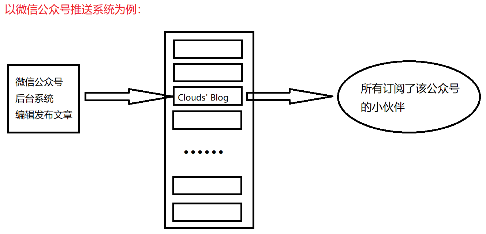

### 11.5.4 主从复制

**主从复制的概念**：是指将一台Redis服务器的数据，复制到其他的Redis服务器。前者称为主节点（master/leader），后者称为从节点（slave/follower）；数据的复制的单向的，只能由主节点到从节点；master以写为主，salve以读为主。默认情况下，每台Redis服务器都是主节点；且一个主节点可以有多个从节点（或没有从节点），但一个从节点只能有一个主节点。

**主从复制的作用**：

1. 数据冗余：主从复制实现了**数据的热备份**，是持久化之外的一种数据冗余方式。
2. 故障恢复：当主节点出现问题时，可以由从节点提供服务，实现快速的故障恢复；实际上是一种**服务的冗余**。
3. 负载均衡：在主从复制基础上，配合**读写分离**，可以由主节点提供写服务，由从节点提供读服务（即写Redis数据时应用连接主节点，读Redis数据时应用连接从节点），分担服务器负载。尤其是在写少读多的场景下，通过多个从节点分担读负载，可以大大提高Redis服务器的并发量。
4. 高可用基石：除了上述作用外，主从复制还是哨兵模式和集群能够实施的基础。

**为什么要使用Redis集群**：

1. 从结构上，单个Redis服务器会发生单点故障；并且一台服务器需要处理所有的请求负载，压力较大。
2. 从容量上，单个Redis服务器内存容量有限，就算一台Redis服务器内存容量为256G，也不能将所有内存用作Redis存储内存（一般来说，单台Redis最大使用内存不应超过20G）。

**主从复制使用场景**：例如电商网站上的商品，一般都是一次上传、无数次浏览（即读写少多），这是应该使用主从复制来进行读写分离。主从复制至少需要3台Redis服务器（1主2从）搭建集群。

Redis集群的搭建步骤如下：

```yaml
# 主从复制只需配置从库，不用配置主库（默认即是主库）
info replication  # 查看当前库主从复制的信息

# 1. 复制多个Redis.conf文件并编辑相应配置
### 1.1 修改端口号
### 1.2 修改pidfile（与端口号同步）
### 1.3 修改logfile
### 1.4 修改dbfilename
# 2. 启动多个Redis服务：redis-server config文件
# 3. 主从配置，搭建集群：
### 3.1 在需要作为从机的服务器上使用命令行配置：SLAVEOF host port
### 3.2 也可以在从机的配置文件中配置主机的ip地址和端口号：replicaof <masterip> <masterport>
### 3.3 若主机有密码，在从机的配置文件中需配置密码：masterauth <master-password>

# Linux相关知识
## 1. 启动后可以采用ps -ef|grep redis查看进程信息
## 2. 在进程中可以使用shutdown（是Redis的命令）
## 3. 在linux系统中（非程序进程中）可以使用shutdown关机、使用"kill 端口号"杀死进程
```

**集群使用注意事项**：

1. 真实的主从配置应该在配置文件中配置（这样才是永久生效的），使用命令`SLAVEOF host port`配置是暂时的。
2. 主机可以写，从机不可写只能读。主机中的所有信息和数据，都会自动被从机保存。
3. 若主机断开连接，从机依旧会连接到主机，但是没有写操作；若主机重新回来，从机依旧可以直接获取到主机写的信息。
4. 通过命令行配合的主从关系，若从机断开连接，重新会变回主机；只要再次变为从机，立马就会从主机中获取值。

**主从复制的原理**：

1. slave启动成功连接到master后会发送一个sync同步命令。
2. master接到命令后会启动后台的存盘进程，同时收集所有接收到的用于修改数据集的命令；在后台进程执行完毕之后，master将传送整个数据文件到salve，并完成一次完全同步。
3. 全量复制：slave在接收到数据库文件数据后，将其存盘并加载到内存中。
4. 增量复制：master继续将新的所有收集到的修改命令依次传给slave，完成同步。
5. 只要重新连接master，一次完全同步（全量复制）将被自动执行。

**宕机后手动配置主机**：层层链路模式下（**主机1-->从机1，主机1-->从机2，从机1-->从机2**：即从机1既是主机1的从机，也是从机2的主机；从机2既是主机1的从机，又是从机1的从机），若主机1断开，系统并不会主动挑选从机1作为主机，需要在从机1中使用命令"谋权篡位"成为新的主机（命令：`SLAVEOF no one`）；若主机1修复，不会重新连接从机1和从机2。（**了解即可，工作中会使用哨兵模式解决这一问题**）

### 11.5.5 哨兵模式

**哨兵（Sentinel）模式**：`12.5.4`所述主从切换的瓶颈在于，当主机宕机后，需要手动将一台从机配置成主机，这就需要人工干预，费时费力，还会造成一段时间内服务不可用。在工作方式中，会优先使用哨兵模式来解决这一问题。**哨兵模式会依据投票数自动将从机变为主机**。**哨兵是一个独立的进程，会独立运行**；哨兵通过发送命令，等待Redis服务器的响应，从而监控运行的多个Redis实例（**哨兵可以类比于调度中心**）。

**哨兵模式原理**：若主服务器宕机，哨兵1先检测到这个结果，系统并不会马上进行failover过程，仅仅是哨兵1主观地认为主服务器不可用，这个现象称为**主观下线**。当后面的哨兵也检测到主服务器不可用，并且数量达到一定值时，那么哨兵之间就会进行一次投票，投票的结果由一个哨兵发起，进行failover（故障转移）操作。切换成功后，就会通过发布订阅模式，让各个哨兵把自己监控的从服务器实现切换主机，这个过程称之为**客观下线**。**若宕机的主机在客观下机后又重新恢复，只能归并到新的主机下，当作从机使用了**。


配置哨兵的步骤如下：

```yaml
# 12.5.4节中Redis集群搭建[续]
# 4. 配置哨兵：
### 4.1 创建哨兵的配置文件：sentinel.conf
### 数字1表示当1个哨兵统一认为master主节点失联，那么这时客观上就认为主节点失联了
### 4.2 配置哨兵：SENTINEL MONITOR 主节点名称名 被监控机器的IP地址 被监控机器的端口号 1 
# 5. 启动哨兵：redis-sentinel 配置文件名
```

**哨兵模式的优点**：

1. 哨兵集群，基于主从复制模式，所有的主从配置优点，它全有。
2. 主从可以切换、故障可以转移，系统的可用性会更好。
3. 哨兵模式就是主从模式的升级，手动到自动，更加健壮。

**哨兵模式的缺点**

1. Redis不好在线扩容，集群容量一旦到达上限，在线扩容就十分麻烦。
2. 实现哨兵模式的配置很麻烦，里面有很多选择。

哨兵模式的全部配置如下：

```yaml
# 1. 哨兵sentinel实例运行的端口：port 26379
# 2. 哨兵sentinel的工作目录：dir /tmp
# 3. 配置哨兵监控Redis节点：sentinel monitor <master-name> <ip> <redis-port> <quorum>
# 4. 设置哨兵连接主从的密码：sentinel auth-pass <master-name> <password>
# 5. 指定多少毫秒之后，主节点没有答应哨兵时，此时哨兵主观上认为主节点下线：
	sentinel down-after-milliseconds <master-name> <milliseconds>
# 6. 设置在发生failover主从切换时，最多可以有多少个salve可以同时对新的master进行同步：
	sentinel parallel-syncs <master-name> <numslaves>
# 7. 设置故障转移的超时时间：sentinel failover-timeout <master-name> <milliseconds>
# 8. 设置通知脚本（当出现故障时可以发送邮件通知相关人员）：sentinel notification-script <master-name> <script-path>
# 9. 当master由于failover而发生改变时，这个脚本将会执行通知客户端关于master地址已经发生改变：
	sentinel client-reconfig-script <master-name> <script-path>
```

### 11.5.6 缓存穿透与雪崩

> **缓存穿透（查不到）** ：用户想要查询一个数据，发现Redis内存数据库中没有，也就是缓存没有命中；于是向持久层数据库查询，发现也没有，于是本次查询失败。当用户很多的时候，缓存都没有命中，于是都去请求了持久层数据库，这会给持久层数据库造成很大的压力，这个时候就相当于出现了缓存穿透。

**缓存穿透的解决方案**：

1. **使用布隆过滤器**：布隆过滤器是一种数据结构，对所有可能查询的参数以hash形式存储，在控制层先进行校验，不符合则丢弃，从而避免了对底层存储系统的查询压力。

2. **缓存空对象**：当存储层不命中后，即使返回的空对象也将其缓存起来，同时会设置一个过期时间，之后再访问这个数据将会从缓存中获取，保护了后端数据源。这种方法存在两个问题：一是浪费存储空间、二是缓存层和存储层的数据会有一段时间窗口的不一致，对于需要保持一致性的业务会有影响。

> **缓存击穿（量太大）**：缓存击穿是指当某个key在过期的瞬间，有大量的请求并发访问，这类数据一般是热点数据，由于缓存过期，会同时访问数据库来查询最新数据，并且回写缓存，会导致数据库瞬间压力过大。

**缓存击穿的解决方案**：

1. **设置热点数据永不过期**：从缓存层面来看，没有设置过期时间，所以不会出现热点key过期后产生的问题。
2. **加互斥锁**：使用分布式锁，保证对于每个key同时只有一个线程去查询后端服务，其他线程没有获得分布式锁的权限，因此只需要等待即可。这种方式将高并发的压力转移到了分布式锁，因此对分布式锁的考验很大。

> **缓存雪崩**：指在某一个时间段，缓存集中过期失效，这是产生雪崩的原因之一；缓存服务器的某个节点宕机或断网，这是产生雪崩的原因之二。

**缓存雪崩的解决方案**：

1. **Redis高可用**：既然Redis有可能挂掉，那就多增设几台Redis，这样一台挂掉之后其他的还可以继续工作，其实就是搭建Redis集群（异地多活）。
2. **限流降级**：在缓存失效后，通过加锁或者队列来控制读数据库写缓存的线程数量。比如对某个key只允许一个线程查询数据和写缓存，其他线程等待（消息中间件如RabbitMQ、Kafka都可以实现）。
3. **数据预热**：在正式部署前，先把可能的数据预先访问一遍，这样部分可能大量访问的数据就会加载到缓存中。在即将发生大并发访问前手动触发加载缓存不同的key，设置不同的过期时间，让缓存失效的时间点尽量均匀。

# 12 消息中间件MQ

## 12.1 基本概念

**MQ**： Message Queue（消息队列），是在消息的传输过程中保存消息的容器，多用于分布式系统之间进行通信。实现MQ大致有两种主流方式：AMQP、JMS。

分布式系统通信的两种方式：直接远程调用、借助第三方完成间接通信。

**AMQP**： Advanced Message Queuing Protocol（高级消息队列协议），是一个网络**协议**，是应用层协议的一个开放标准，为面向消息的中间件设计。基于此协议的客户端与消息中间件可传递消息，并不受客户端/中间件不同产品，不同的开发语言等条件的限制。2006年，AMQP 规范发布，类比HTTP。

**JMS**： Java Message Service，Java消息服务应用程序**接口**，是一个Java平台中关于面向消息中间件的API，属于JavaEE规范的一种（类比于JDBC）。

**MQ的优势和劣势**：

|                  优势                  |                             劣势                             |
| :------------------------------------: | :----------------------------------------------------------: |
|   **应用解耦：**提升容错性与可维护性   |         系统可用性降低：引入了中间件，系统稳定性变差         |
| **异步提速：**提升用户体验和系统吞吐量 | 系统复杂性提高：从同步远程调用变成异步调用<br />（重复消费问题、消息丢失问题、消息传递的顺序性） |
|     **削峰填谷：**提高系统的稳定性     | 一致性问题：A通过MQ给B/C/D三个系统发送消息数据，若B/C处理成功，D处理失败，怎么办？ |

**常见的MQ产品的比较**：

|                |                           RabbitMQ                           |                    ActiveMQ                    |         RocketMQ         |                     Kafka                      |
| :------------: | :----------------------------------------------------------: | :--------------------------------------------: | :----------------------: | :--------------------------------------------: |
|   公司/社区    |                            Rabbit                            |                     Apache                     |         阿里巴巴         |                     Apache                     |
|    开发语言    |                            Erlang                            |                      Java                      |           Java           |                   Scala&Java                   |
|    协议支持    |          基于AMQP协议，并支持XMPP，SMTP，STOMP协议           | 基于JMS接口，OpenWire，STOMP，REST，XMPP，AMQP | 基于JMS接口，自定义协议  |       自定义协议，社区封装了http协议支持       |
| 客户端支持语言 | 官方支持Erlang，Java，Ruby等，社区产出多种API，几乎支持所有语言 |    Java，C，C++，Python，PHP，Perl，.net等     |   Java，C++（不成熟）    | 官方支持Java，社区产出多种API，如PHP，Python等 |
|   单击吞吐量   |                         万级（其次）                         |                  万级（最差）                  |      十万级（最好）      |                 十万级（次之）                 |
|    消息延迟    |                            微秒级                            |                     毫秒级                     |          毫秒级          |                    毫秒以内                    |
|    功能特性    |    并发能力强，性能极其好，延时低，社区活跃，管理界面丰富    |          老牌产品，成熟度高，文档较多          | MQ功能比较完备，扩展性佳 | 只支持主要的MQ功能，毕竟是为大数据领域准备的。 |

**RabbitMQ**：由Rabbit公司基于AMQP标准开发的一个消息中间件。基础架构如下：

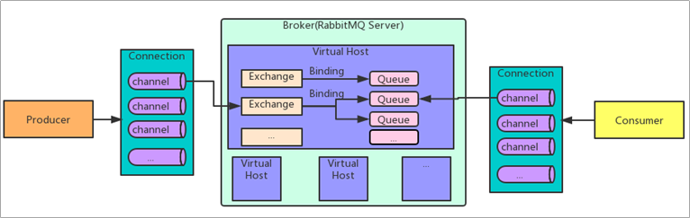

- Broker：接收和分发消息的应用，RabbitMQ Server就是Message Broker

- Virtual host：出于多租户和安全因素设计的，把AMQP的基本组件划分到一个虚拟的分组中，类似于网络中的namespace概念。当多个不同的用户使用同一个RabbitMQ Server提供的服务时，可以划分出多个vhost，每个用户在自己的vhost创建exchange/queue等。

- Connection： publisher/consumer和broker之间的TCP连接。

- channel：如果每次访问RabbitMQ都建立一个Connection，在消息量大时建立TCP Connection的开销将是巨大的，效率也较低。channel是在Connection内部建立的逻辑连接，如果应用程序支持多线程，通常每个thread创建单独的channel进行通讯，AMQP method包含了channel id帮助客户端和message broker识别channel，所以channel之间是完全隔离的。channel作为轻量级的Connection极大减少了操作系统建立TCP Connection的开销。

- Exchange： message到达broker的第一站，根据分发规则，匹配查询表中的routing key，分发消息到queue中去。常用的类型有：direct(point-to-point)、topic(publish-subscribe)、fanout(multicast)。

- Queue：消息最终被送到这里等待consumer取走。

- Binding： Exchange和Queue之间的虚拟连接，Binding中可以包含routing key。Binding信息被保存到Exchange中的查询表中，用于message的分发依据。

## 12.2 支持模式

### 12.2.1 简单模式

**简单模式（Hello World）**：一个生产者，一个消费者（无须设置交换机，会使用默认的交换机）。

- P：生产者，也就是要发送消息的程序。
- C：消费者，消息的接收者，会一直等待消息到来。
- Queue：消息队列，图中红色部分。类似一个邮箱，可以缓存消息；生产者向其中投递消息，消费者从其中取出消息。

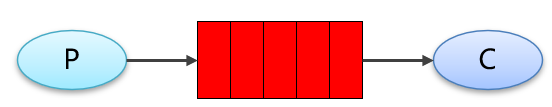

### 12.2.2 工作队列模式

**工作队列模式（work queues）**：一个生产者，多个消费者**竞争**消费同一个队列中的消息（无须设置交换机，会使用默认的交换机）。

- 应用场景：对于任务过重或任务较多情况使用工作队列可以提高任务处理的速度。

```yaml
# 生产者执行过程：
# 创建连接-->创建频道-->声明队列-->发送消息-->关闭频道-->关闭连接

# 消费者执行过程：
# 创建连接-->创建频道-->声明队列-->频道设置（一次接受处理多少个消息）-->创建消费者（收到消息后的回调处理）-->消费消息
```

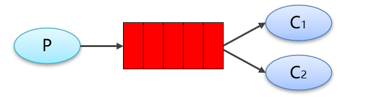

### 12.2.3 发布订阅模式

**发布订阅模式（Publish/Subscribe）**：一个生产者+路由器+多个消费者（都会收到消息）（**需要设置FANOUT类型的交换机**）。

- P：生产者，也就是要发送消息的程序，但是不再发送到队列中，而是发给X（交换机）。
- C：消费者，消息的接收者，会一直等待消息到来。
- Queue：消息队列，接收消息、缓存消息。
- X：交换机（Exchange）。一方面，接收生产者发送的消息；另一方面，知道如何处理消息，例如递交给某个特别队列、递交给所有队列、或是将消息丢弃。到底如何操作，取决于Exchange的类型。Exchange有常见以下3种类型：
  - Fanout：广播，将消息交给所有绑定到交换机的队列。
  - Direct：定向，把消息交给符合指定routing key的队列。
  - Topic：通配符，把消息交给符合routing pattern（路由模式） 的队列。

- 注意事项：
  - 交换机只负责转发消息，不具备存储消息的能力，因此如果没有任何队列与Exchange绑定，或者没有符合路由规则的队列，那么消息会丢失！

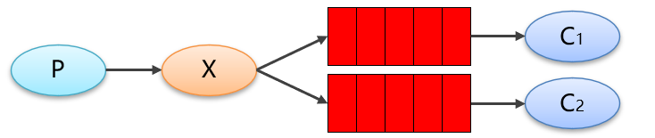

```yaml
# 生产者执行过程：
# 创建连接-->创建频道-->声明交换机-->声明队列-->队列绑定交换机-->发送消息-->关闭频道-->关闭连接

# 消费者执行过程：
# 创建连接-->创建频道-->声明交换机-->声明队列-->队列绑定交换机-->创建消费者（收到消息后的回调处理）-->消费消息
```

- 发布订阅/工作队列模式区别：

  - 工作队列模式不用定义交换机，而发布/订阅模式需要定义交换机。
  - 工作队列模式的生产方是面向队列发送消息（底层使用默认交换机），而发布/订阅模式的生产方是面向交换机发送消息。

  - 工作队列模式不需要设置队列和交换机的绑定（底层会将队列绑定到默认的交换机），而发布/订阅模式需要设置队列和交换机的绑定。

### 12.2.4 路由模式

**路由模式（Routing）**：一个生产者+路由器+多个消费者（定向）（**需要设置DIRECT类型的交换机**）。

- P：生产者，向Exchange发送消息，发送消息时，会指定一个routingKey。
- X： Exchange（交换机），接收生产者的消息，然后把消息递交给与routingKey完全匹配的队列。
- C1：消费者，其所在队列指定了需要routingKey为error的消息。
- C2：消费者，其所在队列指定了需要routingKey为info、error、warning的消息。

- 路由模式的特点：
  - 队列与交换机的绑定，不能是任意绑定了，而是要指定一个routingKey（路由key）。
  - 消息的发送方在向Exchange发送消息时，也必须指定消息的routingKey。
  - Exchange不再把消息交给每一个绑定的队列，而是根据消息的routingKey进行判断，只有队列的routingKey与消息的routingKey完全一致，才会接收到消息。
- 注意事项：
  - Routing模式要求队列在绑定交换机时要指定routingKey，消息会转发到符合routingKey的队列。

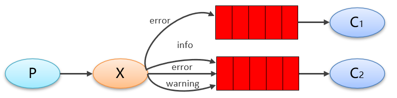

```yaml
# 生产者执行过程：
# 创建连接-->创建频道-->声明交换机-->声明队列-->队列绑定交换机(需指定routingKey)-->发送消息(需指定routingKey)-->关闭频道-->关闭连接

# 消费者执行过程：
# 创建连接-->创建频道-->声明交换机-->声明队列-->队列绑定交换机(需指定routingKey)-->创建消费者（收到消息后的回调处理）-->消费消息
```

### 12.2.5 通配符模式

**通配符模式（Topics）**：一个生产者+路由器+多个消费者（通配符）（**需要设置TOPIC类型的交换机**）。

- 通配符模式的routingKey一般都是由一个或多个单词组成，多个单词之间以"."分隔，例如：`item.insert`，通配符规则如下：
  - #：匹配一个或多个单词（例如：`item.#`能够匹配`item.insert.abc`或者`item.insert`）。
  - \*：恰好匹配一个单词（例如：`item.*`只能匹配`item.insert`）。

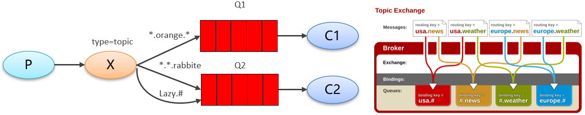

```yaml
# 生产者执行过程：
# 创建连接-->创建频道-->声明交换机-->声明队列-->队列绑定交换机(需采用通配符/或指定的routingKey)-->发送消息(需采用通配符/或指定的routingKey)-->关闭频道-->关闭连接

# 消费者执行过程：
# 创建连接-->创建频道-->声明交换机-->声明队列-->队列绑定交换机(需采用通配符/或指定的routingKey)-->创建消费者（收到消息后的回调处理）-->消费消息
```

- 通配符/发布订阅/路由模式的区别：
  - 通配符模式可以实现发布订阅模式和路由模式的功能，发布订阅模式和路由模式可以看作是通配符模式的特殊子集。
  - 通配符模式在配置routingKey时可以使用通配符，显得更加灵活。

### 12.2.6 远程过程调用模式

**远程过程调用模式（Remote procedure call, RPC）**：

### 12.2.7 发布确认模式

**发布确认模式（Publisher Confirms）**：详见`12.4.1`。

## 12.3 整合SpringBoot

> 参考博客文章：[SpringBoot整合RabbitMq](https://blog.csdn.net/qq_35387940/article/details/100514134)、[死信队列](https://my.oschina.net/10000000000/blog/1626278)、[SpringBoot RabbitMq参数配置详解](https://blog.csdn.net/girlgolden/article/details/97915368)

## 12.4 高级特性

**如何保证消息的可靠性传输**：

1. 持久化（Exchange/Queue/message都需要持久化）+镜像队列机制（集群节点）。
2. 生产者消息确认机制（confirm模式+return模式）。
3. 消费者消息确认机制Ack。
4. Broker高可用（集群）。

### 12.4.1 消息的可靠性投递

**控制消息的可靠性投递的两种方式**：

- confirm模式
- return模式

**RabbitMq的消息投递的路径**：

Producer-->RabbitMq broker-->Exchange-->Queue-->Consumer

- 消息从Producer到Exchange则会返回一个confirmCallback（无论成功失败与否，若成功，则ack=true；若失败，则ack=false）。
- 消息从Exchange到Queue投递失败则会返回一个returnCallback（投递失败才会回调）。

**生产推送消息的消息确认机制**：

生产者推送消息到RabbitMq，可能会触发ConfirmCallback和ReturnCallBack回调。具体分以下四种情况：

- 消息推送到Server，但是在Server里找不到交换机，此时会回调**ConfirmCallback**，并可在ConfirmCallback打印出错原因cause。
- 消息推送到Server，在Server里找到交换机了，但是没找到队列，此时会回调**ConfirmCallback**和**ReturnCallBack**，并可在ReturnCallBack打印出错消息message。
- 消息推送到Server，但是在Server里找不到交换机和队列，此时会回调**ConfirmCallback**，并可在ConfirmCallback打印出错原因cause。
- 消息推送到Server，并推送成功，此时会回调**ConfirmCallback**。

### 12.4.2 消息的可靠性消费

**消费者接收到消息的消息确认机制**：主要有如下三种模式。

- 自动确认（AcknowledgeMode.NONE，默认的消息确认机制）：RabbitMQ成功将消息发出（即将消息成功写入TCP Socket）中立即认为本次投递已经被正确处理，不管消费者端是否成功处理本次投递。

- 根据情况确认（AcknowledgeMode.AUTO）：
- 手动确认（AcknowledgeMode.MANUAL）：均表示消息已经被处理。
  - basicAck：用于肯定确认，表示消息已经被正确处理。
  - basicNack：用于否定确认、表示消息没有被正确处理。
    - `channel.basicNack(deliveryTag, false, true)`：第一个参数依然是当前消息的数据的唯一id；第二个参数是指是否针对多条消息；如果是true，也就是说一次性针对当前通道的消息的tagID小于当前这条消息的，都拒绝确认；第三个参数是指是否重新入列，也就是指不确认的消息是否重新丢回到队列里面去。**使用不确认后重新入列这个确认模式要谨慎，因为这里也可能因为考虑不周出现消息一直被重新丢回去的情况，导致积压。**
  - basicReject：用于否定确认，表示消息没有被正确处理（与basicNack相比有一个限制：一次只能拒绝单条消息 ）。
    - `channel.basicReject(deliveryTag, true)`：拒绝消费当前消息，如果第二参数传入true，就是将数据重新丢回队列里，那么下次还会消费这消息。设置false，就是告诉服务器，我已经知道这条消息数据了，因为一些原因拒绝它，而且服务器也把这个消息丢掉就行， 下次不想再消费这条消息了。使用拒绝后重新入列这个确认模式要谨慎，因为一般都是出现异常的时候，catch异常再拒绝入列，选择是否重新入列。**如果使用不当会导致一些每次都被你重入列的消息一直消费-入列-消费-入列这样循环，会导致消息积压**。

### 12.4.3 消费端限流

- 配置`spring.rabbitmq.listener.simple.prefetch=1`，表示消费端每次从MQ拉取一条消息来消费，只有确认消费完毕后，才会拉取下一条消息。 
- 消费端需要设置手动确认模式（AcknowledgeMode.MANUAL）。

### 12.4.4 TTL

**TTL（Time To Live，存活时间/过期时间）**： 当消息到达存活时间后，还没有被消费，会被自动清除。

- RabbitMQ可以对整个队列（Queue）设置过期时间（队列里的消息过期后会被清除）。
  - `QueueBuilder.ttl(int ttl)`：使用建造者模式创建队列，并设置队列里消息的过期时间（即`x-message-ttl`）。
  - `QueueBuilder.expires(int expires)`：使用建造者模式创建队列，并设置队列的过期时间（即`x-expires`）。
- RabbitMQ也可以对消息设置过期时间（消息过期后，只有消息在队列顶端，才会判断其是否过期，然后才会移除掉过期消息）。
  - `rabbitTemplate.convertAndSend(String exchange, String routingKey, final Object message,final MessagePostProcessor messagePostProcessor)`：在MessagePostProcessor 对象里设置message的过期消息。

- 若队列和消息都设置了过期时间，则以时间短的为准。

### 12.4.5 死信队列

**死信队列**：Dead Letter Exchange(DLX)，死信交换机。当消息成为Dead message后，可以被重新发送到另一个交换机，这个交换机就是DLX。

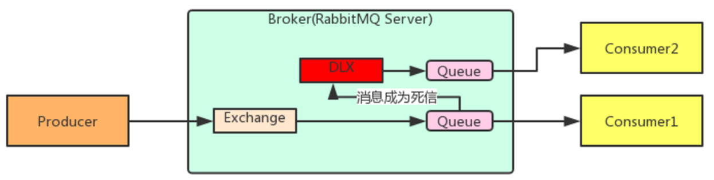

**消息成为死信的三种情况**：队列达到最大长度、消息被拒绝且requeue为false、消息过期。

1. 队列消息长度到达限制。
   - `new QueueBuilder().maxLength(int count)`：`x-max-length`。
2. 消费者拒接消费消息（basicNack/basicReject），并且不把消息重新放入原目标队列（requeue=false）。
   - `channel.basicReject(long deliveryTag, boolean requeue)`。
   - `channel.basicNack(long deliveryTag, boolean multiple, boolean requeue)`。
3. 原队列存在消息过期设置，消息到达超时时间未被消费。

**队列绑定死信交换机和死信路由**：当消息成为死信时，如果该队列绑定了死信交换机，则死信会被死信交换机路由到死信队列。

- `new QueueBuilder().deadLetterExchange(String dlx)`：使用建造者模式给队列设置死信交换机（`x-dead-letter-exchange`）。
- `new QueueBuilder().deadLetterRoutingKey(String dlrk)`：使用建造者模式给队列设置死信路由键（`x-dead-letter-routing-key`）。

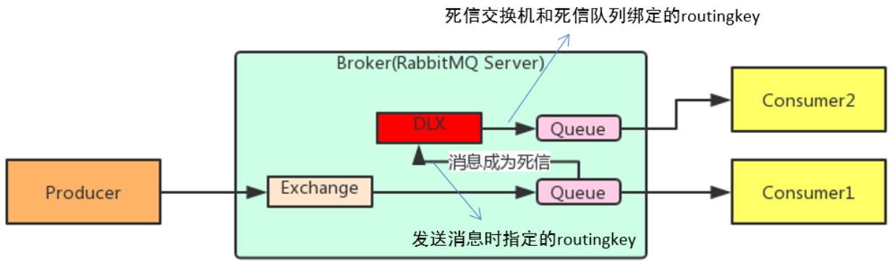

### 12.4.6 延迟队列

**延迟队列**：消息进入队列后不会立即被消费，只有到达指定时间后，才会被消费。

**常见应用场景**：

- 下单后，30分钟未支付，取消订单，回滚库存。
- 新用户注册成功7天后，发送短信问候。

**实现方式**：RabbitMQ没有提供延迟队列功能，但可以使用**TTL+死信队列**实现延迟队列。

### 12.4.8 消息追踪

- 使用Firehose插件来实现消息追踪。
- 使用rabbitmq_tracing插件来实现消息追踪。

## 12.5 RabbitMq应用

### 12.5.1 消息可靠性保证

如何能够保证消息的 100% 发送成功？

虽然任何系统都不能保证消息的100%投递成功，但是可以保证消息最高最可靠的发送给目标方。在RabbitMQ中采用**消息补充机制**来保证消息的可靠性。

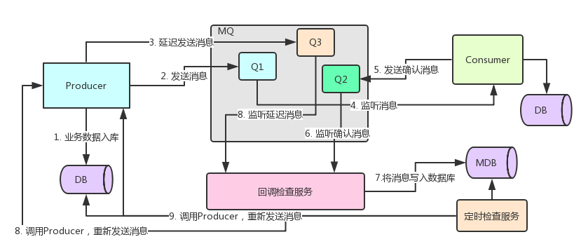

**步骤分析**：

参与部分：消息生产者、消息消费者、数据库、三个队列（Q1、Q2、Q3）、交换机、回调检查服务、定时检查服务。

1. 消息的生产者将业务数据存到数据库中。
2. 发送消息给队列Q1。
3. 消息的生产者等待一定的时间后，再发送一个延迟消息给队列Q3。
4. 消息的消费方监听Q1队列消息，成功接收后。
5. 消息的消费方会发送 一条确认消息给队列Q2。
6. 回调检查服务监听队列Q2发送的确认消息。
7. 回调检查服务接收到确认消息后，将消息写入到消息的数据库表中。
8. 回调检查服务同时也会监听队列Q3延迟消息， 如果接收到消息会和数据库比对消息的唯一标识。
9. 如果发现没有接收到确认消息，那么回调检查服务就会远程调用消息生产者，重新发送消息。
10. 重新执行2-7步骤，保证消息的可靠性传输。
11. 如果发送消息和延迟消息都出现异常，定时检查服务会监控消息库中的消息数据，如果发现不一致的消息然后远程调用消息的生产者重新发送消息。

### 12.5.2 消息幂等性处理

**幂等性**指一次和多次请求某一个资源，对于资源本身应该具有同样的结果。也就是说，其任意多次执行对资源本身所产生的影响均与一次执行的影响相同。在MQ中指，消费多条相同的消息，得到与消费该消息一次相同的结果。

下图使用**乐观锁机制**保证消息的幂等操作。

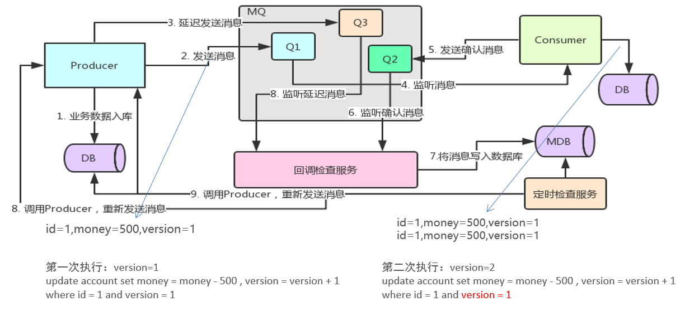

### 12.5.3 集群

使用集群的目的**：保证可靠性**、**增加消息吞吐量**。

集群的配置：集群配置+负载均衡（HAProxy）。

- 单机多实例部署：https://www.rabbitmq.com/clustering.html。
- 多机单实例部署

## 12.6 RabbitMq源码

- 大量使用建造者模式：QueueBuilder、ExchangeBuilder、BindingBuilder、MessageBuilder（可设置消息持久化）
- 常用注解：**@RabbitListener**（@RabbitListener可以标注在类上面，需配合@RabbitHandler注解一起使用；若@RabbitListener标注在方法上，则不需要@RabbitHandler）、**@RabbitHandler**（可配置多个@RabbitHandler，适配与发送消息的类型相同的方法）、@Payload、@Headers、@QueueBinding、@Exchange、@Queue
- 常用类：RabbitTemplate（其中convertAndSend底层源码默认消息是持久化的）、SimpleMessageListenerContainer（设置手动确认）、CachingConnectionFactory、ChannelAwareMessageListener（接口）、MessagePostProcessor可设置过期时间
- 配置类：RabbitProperties、MessageProperties

# 13 Nginx

**Nginx**是一个**高性能的HTTP和反向代理服务器**，特点是占有内存小，并发能力强，事实上Nginx的并发能力确实在同类型的网页服务器中表现较好。Nginx专为性能优化而开发，性能是其最重要的考量，实际上非常非常注重效率，能经受高负载的考验，有报告表明能支持高达**50000**个并发连接数。

**Nginx的主要作用**：正向代理、反向代理、负载均衡、动静分离。

## 13.1 系统安装

在云服务器上可以选择安装Linux CentOS 7系统。

### 13.1.1 配置yum源

由于国外服务器下载一般速度较慢，这里配置阿里云yum源，以下为具体步骤：

1. 进入`cd /etc/yum.repos.d`，创建备份文件夹`mkdir repos_backup`

2. 将yum.repos.d文件夹下所有以.repo结尾的文件移动到repos_backup文件夹中备份：`mv *.repo ./repos_backup `

3. 下载CentOS7的yum源到yum.repos.d文件夹中：`wget -O /etc/yum.repos.d/CentOS-Base.repo http://mirrors.aliyun.com/repo/Centos-7.repo`

4. 清空旧的yum缓存：`yum clean all`

5. 生成新的yum仓库缓存：`yum makecache`

6. 配置一个第三方的额外仓库源（epel源），这个源的作用是，如果阿里云源找不到这个软件，就在这里找：

   `wget -O /etc/yum.repos.d/epel.repo http://mirrors.aliyun.com/repo/epel-7.repo`

SecureCRT连接云服务器ECS实例出现**信号灯超时问题**的解决办法：

`Options->Session Options->Terminal->Anti-idle->勾选Send protocol NO-OP`（后面的设置时间默认的是60秒，要求小于自动断开连接的时限）

### 13.1.2 Nginx的安装

Nginx的安装步骤如下：**Nginx1.8需要搭配CentOS 7安装，在CentOS 8上安装会出错**

1. 进入到目标文件夹下：`cd /usr/src`

2. 安装准备环境：

   `yum install gcc gcc-c++ automake pcre pcre-devel zlip zlib-devel openssl openssl-devel`

3. 下载[Nginx](http://nginx.org/)安装包：`wget http://nginx.org/download/nginx-1.8.1.tar.gz`

4. 解压安装包：`tar  xvf nginx-1.8.1.tar.gz`

5. 进入解压后的文件夹：`cd nginx-1.8.1`

6. 编译检查：

   ```bash
   ./configure  --prefix=/usr/local/nginx  --sbin-path=/usr/local/nginx/sbin/nginx --conf-path=/usr/local/nginx/conf/nginx.conf --error-log-path=/var/log/nginx/error.log  --http-log-path=/var/log/nginx/access.log  --pid-path=/var/run/nginx/nginx.pid --lock-path=/var/lock/nginx.lock  --user=nginx --group=nginx --with-http_ssl_module --with-http_stub_status_module --with-http_gzip_static_module --http-client-body-temp-path=/var/tmp/nginx/client/ --http-proxy-temp-path=/var/tmp/nginx/proxy/ --http-fastcgi-temp-path=/var/tmp/nginx/fcgi/ --http-uwsgi-temp-path=/var/tmp/nginx/uwsgi --http-scgi-temp-path=/var/tmp/nginx/scgi --with-pcre
   ```

7. 编译生成脚本及配置文件：`make`

8. 安装Nginx：`make install`

9. 安装完成后，Nginx的启动位置在`/usr/local/nginx/sbin`，配置文件在`/usr/local/nginx/conf`（可修改端口号）

10. 进入到Nginx的启动位置，启动Nginx：`./nginx`

    查看占用端口号：`netstat -anl|grep 端口号`

    下图表明Nginx已经启动成功：

    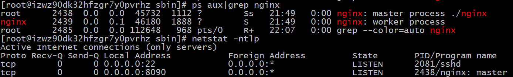
    Nginx启动成功后，浏览器却访问不了，原因在于防火墙，解决步骤：

    1. 查看开放的端口号：`firewall-cmd --list-all`
    2. 增加开放的端口号：`sudo firewall-cmd --add-port=80/tcp --permanent`
    3. 重启防火墙：`firewall-cmd --reload`
    4. 启动防火墙：`systemctl start firewalld.service`

> 参考博客文章：[编译安装Nginx 1.8.1及配置](https://www.cnblogs.com/zhang-shijie/p/5294162.html)、[Nginx启动成功，浏览器不能访问](https://www.cnblogs.com/chenleideblog/p/10499807.html)

## 13.2 常用命令

使用Nginx操作的常用命令需要进入到Nginx的目录：`cd /usr/local/nginx/sbin`

- 查看Nginx的版本号：`./nginx -v`
- 启动Nginx：`./nginx`
- 关闭Nginx：`./nginx -s stop`

- 修改nginx.conf后，在不关闭Nginx的情况下，可以使用重新加载Nginx：`./nginx -s reload`

## 13.3 配置文件

Nginx的配置文件位置：`/usr/local/nginx/conf/nginx.conf`

**Nginx的配置文件由三部分组成**：

1. **全局块**：从配置文件开始到events块之间的内容，主要会设置一些影响Nginx服务器整体运行的配置指令。

- `worker_processes 1;`：worker_processes值越大，可以支持的并发处理量也越多。

2. **events块**：涉及的指令主要影响Nginx服务器与用户的网络连接。

- `worker_connections 1024;`：支持的最大连接数。

3. **http块**：服务器配置中最频繁的部分，代理、缓存和日志定义等绝大多数功能和第三方模块的配置都在这里。

   - **http全局块**：配置的指令包括文件引入、MIME-TYPE定义、日志自定义、连接超时时间、单链接请求数上限等。
   - **server块**：每个http块可以包含多个server块，而每个server块就相当于一个虚拟主机。
     - 全局server块：本虚拟主机的监听位置和本虚拟主机的名称或IP配置。
     - location块：一个server块可以配置多个location块。

```bash
#user  nobody;
worker_processes  1; # 设置等于CPU的核数

#error_log  logs/error.log;
#error_log  logs/error.log  notice;
#error_log  logs/error.log  info;

#pid        logs/nginx.pid;


events {
    worker_connections  1024; # 先设置worker_processes，然后再根据并发数设置worker_connections
}


http {
    include       mime.types;
    default_type  application/octet-stream;

    #log_format  main  '$remote_addr - $remote_user [$time_local] "$request" '
    #                  '$status $body_bytes_sent "$http_referer" '
    #                  '"$http_user_agent" "$http_x_forwarded_for"';

    #access_log  logs/access.log  main;

    sendfile        on;
    #tcp_nopush     on;

    #keepalive_timeout  0;
    keepalive_timeout  65;

    #gzip  on;

    server {
        listen       8090;
        server_name  localhost;

        #charset koi8-r;

        #access_log  logs/host.access.log  main;

        location / {
            root   html;
            index  index.html index.htm;
        }

        #error_page  404              /404.html;

        # redirect server error pages to the static page /50x.html
        #
        error_page   500 502 503 504  /50x.html;
        location = /50x.html {
            root   html;
        }

        # proxy the PHP scripts to Apache listening on 127.0.0.1:80
        #
        #location ~ \.php$ {
        #    proxy_pass   http://127.0.0.1;
        #}

        # pass the PHP scripts to FastCGI server listening on 127.0.0.1:9000
        #
        #location ~ \.php$ {
        #    root           html;
        #    fastcgi_pass   127.0.0.1:9000;
        #    fastcgi_index  index.php;
        #    fastcgi_param  SCRIPT_FILENAME  /scripts$fastcgi_script_name;
        #    include        fastcgi_params;
        #}

        # deny access to .htaccess files, if Apache's document root
        # concurs with nginx's one
        #
        #location ~ /\.ht {
        #    deny  all;
        #}
    }


    # another virtual host using mix of IP-, name-, and port-based configuration
    #
    #server {
    #    listen       8000;
    #    listen       somename:8080;
    #    server_name  somename  alias  another.alias;

    #    location / {
    #        root   html;
    #        index  index.html index.htm;
    #    }
    #}


    # HTTPS server
    #
    #server {
    #    listen       443 ssl;
    #    server_name  localhost;

    #    ssl_certificate      cert.pem;
    #    ssl_certificate_key  cert.key;

    #    ssl_session_cache    shared:SSL:1m;
    #    ssl_session_timeout  5m;

    #    ssl_ciphers  HIGH:!aNULL:!MD5;
    #    ssl_prefer_server_ciphers  on;

    #    location / {
    #        root   html;
    #        index  index.html index.htm;
    #    }
    #}
}
```

> 参考博客文章：[Nginx中文文档](https://www.nginx.cn/doc/index.html)、[Nginx中文手册](https://www.nginx.cn/nginx-how-to)

## 13.4 反向代理

**关于正向代理与反向代理**：见下图

- **正向代理**：如果把局域网外的Internet想象成一个巨大的资源库，则局域网中的客户端要访问Internet，则需要通过代理服务器来访问，这种代理服务就称为正向代理。典型的例子是我们可以通过正向代理访问Google。

- **反向代理**：其实客户端对代理是无感知的，因为客户端不需要任何配置就可以访问，我们只需要将请求发送到反向代理服务器，由反向代理服务器去选择目标服务器获取数据后，再返回给客户端，此时反向代理服务器和目标服务器对外就是一个服务器，暴漏的是代理服务器地址，隐藏了真实服务器IP地址。

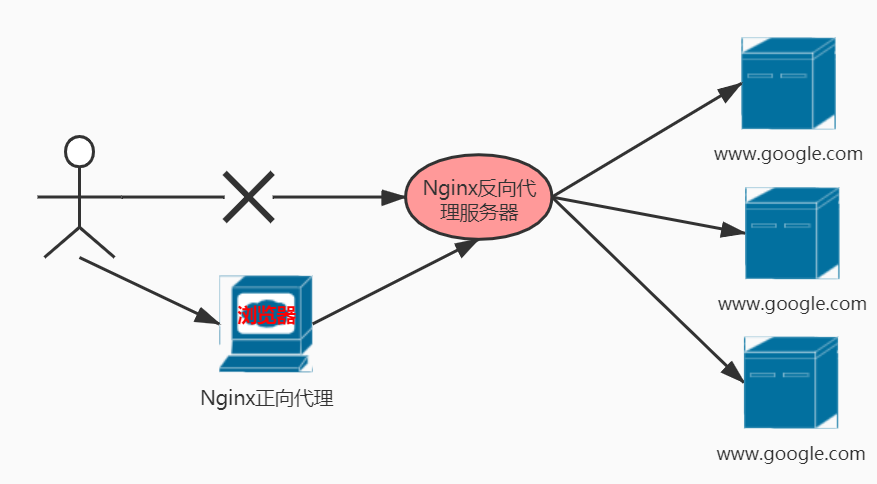

两个实例：

- 将访问到`www.abc.com`反向代理到http://127.0.0.1:8080。

```yaml
# 1.对外开放访问的端口：
firewall-cmd --add-port=80/tcp --permanent
firewall-cmd --add-port=8080/tcp --permanent
# 2.在windows系统的host文件进行域名和ip对应关系的配置: 192.168.17.129 www.abc.com
# 3.在nginx配置文件中进行配置：
server{
	listen 80;
	server_name 192.168.17.129;
	location / {
		root html;
		proxy_pass http://127.0.0.1:8080;
		index index.html index.htm;
	}
}
```

- 使用nginx反向代理，根据访问的路径跳转到不同端口的服务中。location后的符号说明：
  - =：用于表示必须与uri严格匹配。
  - ~：用于表示uri包含正则表达式，并且区分大小写。
  - ~*：用于表示uri包含正则表达式，并且不区分大小写。
  - ^~：用于表示uri不包含正则表达式，要求Nginx服务器找到表示uri和请求字符串匹配度最高的location后，立即使用此location处理请求，而不再使用location块中的正则uri和请求字符串做匹配。

```yaml
server{
	listen 9001;
	server_name 192.168.17.129;
	location ~ /edu/ {
		proxy_pass http://127.0.0.1:8080;
	}
	location ~ /vod/ {
		proxy_pass http://127.0.0.1:8081;
	}
}
```

## 13.5 负载均衡

**负载均衡**：单个服务器解决不了，我们增加服务器的数量，然后将请求分发到各个服务器上，将原先请求集中到单个服务器上的情况改为将请求分发到多个服务器上，**将负载分发到不同的服务器**，也就是我们所说的负载均衡。

**Nginx负载均衡的策略**：

1. **轮询（默认）**：将请求按顺序轮流地分配到后端服务器上，它均衡地对待后端的每一台服务器，而不关心服务器实际的连接数和当前的系统负载。如果后端服务器宕机，能自动剔除。
2. **加权轮询法（weight）**：不同的后端服务器可能机器的配置和当前系统的负载并不相同，因此它们的抗压能力也不相同。给配置高、负载低的机器配置更高的权重，让其处理更多的请；而配置低、负载高的机器，给其分配较低的权重，降低其系统负载。**简言之，weight代表权重，默认为1，权重越高被分配的客户端越多**。
3. **源地址哈希法（ip_hash）**：根据获取客户端的IP地址，通过哈希函数计算得到一个数值，用该数值对服务器列表的大小进行取模运算，得到的结果便是客服端要访问服务器的序号。采用源地址哈希法进行负载均衡，同一IP地址的客户端，当后端服务器列表不变时，它每次都会映射到同一台后端服务器进行访问。**源地址哈希法可以解决session共享的问题**。

4. **最小连接数法（fair）**：按后端服务器的响应时间来分配请求，响应时间短的优先分配。

```yaml
# 轮询法
upstream myserver  {
  server 192.168.17.129.8080;
  server 192.168.17.129.8081;
}

# 加权轮询法
upstream myserver  {
  server 192.168.17.129.8080 weight=1;
  server 192.168.17.129.8081 weight=5;
}

# 源地址哈希法
upstream myserver  {
  ip_hash;
  server 192.168.17.129.8080;
  server 192.168.17.129.8081;
}

# 最小连接数法
upstream myserver  {
  fair;
  server 192.168.17.129.8080;
  server 192.168.17.129.8081;
}
```

一个实例：

- 浏览器地址栏输入地址 http://192.168.17.129/edu/a.html，负载均衡效果，平均 8080和8081端口中。

```yaml
upstream myserver  {
  server 192.168.17.129.8080;
  server 192.168.17.129.8081;
}
server{
	listen 9001;
	server_name 192.168.17.129;
	location / {
		proxy_pass http://myserver;
		root html;
		index index.html index.hml;
	}
}
```

## 13.6 动静分离

**动静分离**：为了加快网站的解析速度，可以把动态页面和静态页面由不同的服务器来解析，加快解析速度，降低原来单个服务器的压力。

**动静分离分为两种方式**：

1. 把静态文件独立成单独的域名，放在独立的服务器上，是目前主流推崇的方案。
2. 动态和静态文件混合在一起，通过nginx来分开。

**主要设置**：

1. 通过location指定不同的后缀名实现不同的请求转发。
2. 通过expires参数设置，可以使浏览器缓存过期时间，减少与服务器之前的请求和流量。expires具体含义：给一个资源设定一个过期时间，也就是说无需去服务端验证，直接通过浏览器自身确认是否过期即可，所以不会产生额外的流量。此种方法非常适合不经常变动的资源（如果经常更新的文件，不建议使用 Expires 来缓存）。例如：expires设置为3d，表示在这3天之内访问这个URL，发送一个请求，比对服务器该文件最后更新时间没有变化，则不会从服务器抓取，返回状态码 304，如果有修改，则直接从服务器重新下载，返回状态码200。

```yaml
server{
	listen 80;
	server_name 192.168.17.129;
    # 访问192.168.17.129:80/data/www/下的资源
	location /www/ {
		root /data/;
		index index.html index.hml;
	}
    # 访问192.168.17.129:80/data/image目录下的所有资源/下的资源
    location /image/ {
		root /data/;
        # 列出image目录下的所有资源
		autoindex on;
	}
}
```

## 13.7 高可用

**Nginx高可用**：

- 采用**主从服务器**
- 需要**keepalived**（相当于一个路由，通过脚本检测当前Nginx是否还存活）
- 需要**虚拟 ip**

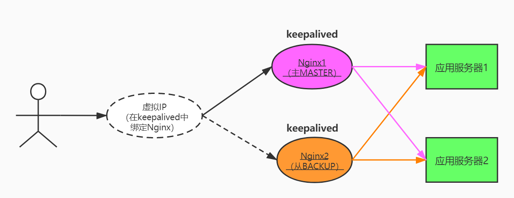

**配置步骤**：

1. 安装keepalived：`yum install keepalived –y`

2. 配置keepalived：配置文件位置：`/etc/keepalived/keepalived.conf`

   ```yaml
   global_defs {
      notification_email {
        acassen@firewall.loc
        failover@firewall.loc
        sysadmin@firewall.loc
      }
      notification_email_from Alexandre.Cassen@firewall.loc
      smtp_server 192.168.200.1
      smtp_connect_timeout 30
      router_id LVS_DEVEL # 配置主机的名字（在/etc/hosts中添加127.0.0.1 LVS_DEVEL）
      vrrp_skip_check_adv_addr
      vrrp_strict
      vrrp_garp_interval 0
      vrrp_gna_interval 0
   }
   vrrp_script chk_http_port{
      script "/usr/local/src/nginx_check.sh" # 检测脚本的位置
      interval 2 # 检测脚本的时间间隔为2s
      weight 2 # 当脚本的条件成立，就将当前权重增加2
   }
   
   vrrp_instance VI_1 {
       state MASTER # 备份服务器上将MASTER改为BACKUP
       interface eth0 # 使用ifconifg查看网卡名字
       virtual_router_id 51 # 主备服务器的virtual_router_id必须相同
       priority 100 # 主备服务器不同的优先级，主机值较大，备份机值较小
       advert_int 1 # 每个1秒发送一个心跳检测主服务器是否还存活
       authentication {
           auth_type PASS # 权限
           auth_pass 1111 # 密码
       }
       virtual_ipaddress {
           192.168.200.16 # 虚拟IP地址
       }
   }
   ```

3. 配置脚本文件：位置在`/usr/local/src/nginx_check.sh`

   ```bash
   #!/bin/bash
   A=`ps -C nginx –no-header |wc -l`
   if [ $A -eq 0 ];then
   	/usr/local/nginx/sbin/nginx
   	sleep 2
   	if [ `ps -C nginx --no-header |wc -l` -eq 0 ];then
   		killall keepalived
   	fi
   fi
   ```

## 13.8 工作原理

**工作原理**：Nginx采用Master和Worker工作机制。客户端（Client）发送请求给Master，Master通知Woker（默认数量为1）去争抢连接，抢到连接的Woker就会处理该请求以及转发服务器的响应消息。

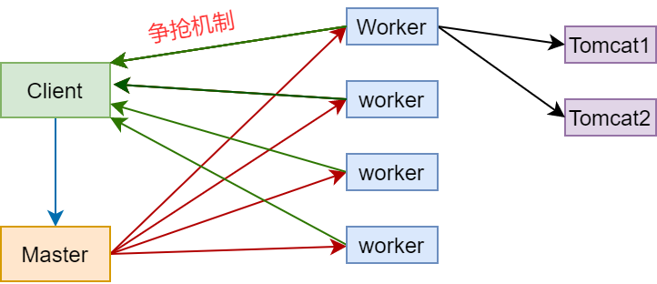

**采用Master-Worker工作机制的好处**：

1. 可以使用Master-Worker工作机制进行热部署（`nginx -s reload`）。
2. 每个Woker是独立的进程，如果有其中的一个Woker出现问题，其他Woker独立的，继续进行争抢，实现请求过程，不会造成服务中断。
   - 对于每个Worker来说，属于独立的进程，不需要加锁，省掉了**锁带来的开销**。
   - 采用独立的进程，Worker之间不会互相影响；当一个Worker进程异常退出（或被强制关闭）后，其他Worker进程还在工作，**不会导致服务的中断，Mater进程会很快启动新的Worker**（热部署的本质）。

**worker的数量设置多少合适**？`worker_processes 1; # 设置等于CPU的核数`

Nginx同redis类似都采用了**IO多路复用**机制，每个worker都是一个独立的进程，每个进程里都只有一个主线程，通过异步非阻塞的方式来处理请求，从而使每个worker的线程可以把一个CPU的性能发挥到极致，所以**woker的数量和服务器CPU的核数应该相等**（设置少了会浪费CPU资源；设置多了会造成CPU频繁切换上下文带来的开销）。

**worker的连接数怎么设置**？首先确定worker_processes，然后根据并发量来计算worker_connections（**静态资源与动态资源的计算方式不同**）。

worker_connections表示每个worker进程所能建立连接的最大值。一个Nginx所能建立的最大连接数，应该是`worker_connections*worker_processes `。

- 对于HTTP请求本地资源来说，能够支持的最大并发数量是`worker_connections*worker_processes`，若是支持HTTP1.1的浏览器每次访问需要占用两个连接，故普通的**静态资源访问的最大并发数是`worker_connections*worker_processes/2`**。
- 若HTTP作为反向代理来说，最大的并发连接数是`worker_connections*worker_processes/4`，因为作为反向代理服务器，每个并发会建立与客户端的连接和与后端服务器的连接，会占用两个连接。

**常见的两个问题**：

1. 发送一个请求，占用了 woker 的几个连接数？
   - 访问静态资源（不需要从Tomcat获取数据），占用2个连接数；访问动态资源（需要从Tomcat获取数据）占用4个连接数。
2. Nginx有一个master，有4个woker，每个woker支持最大的连接数1024，支持的最大并发数是多少？
   - 如果是访问静态资源（不需要从Tomcat获取数据），支持的最大并发数是2048；如果是访问动态资源（需要从Tomcat获取数据），支持的最大并发数是1024。

# 14 Zookeeper


# 15 ElasticSearch

# 16 面试点总结

**必须掌握的手写代码**：

1. 双重检查+volatile单例模式
2. 死锁+阻塞队列实现的死锁
3. KMP算法的实现

**分布式锁的实现方式**：

1. 数据库乐观锁

2. 基于Redis的分布式锁：https://blog.csdn.net/yb223731/article/details/90349502

   - 加锁：`set(String key, String value, String nxxx, String expx, long time)`

   - 解锁：使用Lua脚本（保证事务的原子性）

     ```lua
     if redis.call('get', KEYS[1]) == ARGV[1] then return redis.call('del', KEYS[1]) else return 0 end
     ```

3. 基于zookeeper的分布式锁

**分布式事务的实现方式**：https://zhuanlan.zhihu.com/p/183753774

1. 2PC（Two-phase commit protocol）：二阶段提交
2. 3PC
3. TCC
4. 本地消息表
5. 消息事务

## 16.0 经典好文

[从String看JDK1.6/1.7/1.8中JVM内存模型](https://blog.csdn.net/guoxiaolongonly/article/details/80425548)

[JVM对于声明为final的局部变量(local var)做了哪些性能优化?](https://www.cnblogs.com/jixp/articles/6752132.html)

[匿名内部类引用局部变量必须使用final修饰](https://blog.csdn.net/qq_39291919/article/details/108859888)

[JDK8对隐式final的支持](https://www.oschina.net/question/3775878_2278471)

[Java闭包详解](https://blog.csdn.net/quanaianzj/article/details/81540677)

## 16.1 自增变量

知识点**：《JVM虚拟机规范》关于指令的部分**

- 赋值=，最后计算
- =右边的从左到右加载值依次压入操作数栈
- 实际先算哪个，看运算符优先级
- 自增、自减操作都是直接修改变量的值，不经过操作数栈
- 最后的赋值之前，临时结果也是存储在操作数栈中。

## 16.2 单例模式

知识点**：设计模式**

- 饿汉式
  - 直接实例化饿汉式（简洁直观）
  - 枚举类（最简洁）
  - 静态代码块饿汉式（适合复杂实例化）

- 懒汉式：延迟创建对象
  - 线程不安全（适合单线程）
  - 线程安全（采用volatile+双重检查加锁，适合多线程）
  - 静态内部类（适合多线程）

## 16.3 类初始化和实例初始化

知识点**：JVM虚拟机中的类加载机制+《JVM虚拟机规范》中关于<clinit>和<init>方法的说明、invokespecial指令**

初始化过程：同时需要考虑**"重写+多态"**的问题。

1. 父类静态变量/静态代码块（按出现顺序执行）
2. 子类静态变量/静态代码块（按出现顺序执行）
3. 父类成员变量/非静态代码块（按出现顺序执行）
4. 父类构造器
5. 成员变量/非静态代码块（按出现顺序执行）
6. 子类构造器

类加载注意事项：

- 一个类要创建实例需要先加载并初始化该类（main方法所在的类需要先加载和初始化）
- 一个子类要初始化需要先初始化父类
- 一个类初始化就是执行<clinit>()方法
  - <clinit>()方法由静态类变量显示赋值代码和静态代码块组成。
  - 类变量显示赋值代码和静态代码块从上到下顺序执行。
  - <clinit>()方法只执行一次

哪些方法不可以被重写：

- final方法
- 静态方法
- private等子类中不可见方法

对象的多态性：

- 子类如果重写了父类的方法，通过子类对象调用的一定是子类重写过的代码。
- 非静态方法默认的调用对象是this
- this对象在构造器或者说<init>方法中就是正在创建的对象。

重写（Override）和重载（Overload）的区别：

- 重写针对的是具有继承关系的子类，其方法标识必须和父类完全一样（方法名/形参列表/返回值类型必须完全一样，而抛出的异常列表/修饰符不一定完全一样，但子类重写方法的修饰符不能低于父类的方法访问权限）
- 重载针对的是同一个类中同名方法的多种表现形式。

## 16.4 方法的参数传递机制

知识点**：方法的参数传递机制**

方法的参数传递机制：

- 形参是基本数据类型 ：传递数据值。
- 实参是引用数据类型：传递地址值；特殊类型对象的不可变性（**如String、包装类对象**）。

## 16.5 递归与迭代

典型题目：求n步台阶，一共有多少种走法。

## 16.6 成员变量与局部变量

关于变量的几个注意事项：

- 就近原则
- 变量的分类：成员变量（包括类变量和实例变量）、局部变量。
- 非静态代码块的执行：每次创建实例对象都会执行。
- 方法的调用规则：调用一次就执行一次。

**局部变量与成员变量的区别**：

1. **声明的位置不同**

   局部变量：方法体{}中，形参，代码块{}中。

   成员变量：类中方法外

   - 类变量：有static修饰
   - 实例变量：没有static修饰

2. **修饰符不同**：

   局部变量：final

   成员变量：public、protected、private、final、static、volatile、transient。

3. **值存储位置不同**：

   局部变量：栈

   实例变量：堆

   类变量：方法区

4. **作用域不同**：

   局部变量：从声明处开始，到所属的}结束。

   实例变量：在当前类中"this."（有时this.可以缺省），在其他类中"对象名."访问。

   类变量：在当前类中"类名."（有时类名.可以省略），在其他类中"类名."或"对象名."访问。

5. **声明周期不同**：

   局部变量：每一个线程，每一次调用执行都是新的生命周期。

   实例变量：随着对象的创建而初始化，随着对象的被回收而消亡，每一个对象的实例变量是独立的。

## 16.7 Spring Bean作用域区别

配置方式：

1. XML：<bean/>标签中的scope属性。
2. 注解：@Scope(value="singleton")。

**Spring Bean的5种作用域及区别**：

| 作用域              | 说明                                                         |
| ------------------- | ------------------------------------------------------------ |
| singleton（默认的） | 在Spring IOC容器种仅存在一个Bean实例，Bean以单实例的方式存在。 |
| prototype           | 每次调用getBean()时都会返回一个新的实例。                    |
| request             | 每次HTTP请求都会创建一个新的Bean，该作用域仅适用于WebApplicationContext环境。 |
| session             | 同一个HTTP Session共享一个Bean，不同的HTTP Session使用不同的Bean，该作用域仅适用于该作用域仅适用于WebApplicationContext环境。 |
| global-session      | 同一个全局的HTTP Session共享一个Bean，该作用域仅适用于集群环境。 |

## 16.8 Spring支持的事务传播属性和事务隔离级别

事务的传播行为：一个方法运行在了一个开启了事务的方法中时，当前方法是使用原来的事务还是开启一个新的事务。

**Spring支持七种事务传播行为**：使用@Transactional的propagation属性来设置事务的传播行为。

- **Propagation.REQUIRED**：默认值，如果有事务在运行，当前的方法就在这个事务内运行；否则，就启动一个新的事务，并在自己的事务内运行。
- **Propagation.REQUIRES_NEW**：当前的方法必须启动新事务，并在它自己的事务内运行；如果有事务正在运行，应该将它挂起。
- Propagation.SUPPORTS：如果有事务在运行，当前的方法就在这个事务内运行，否则它可以不运行在事务中。
- Propagation.NOT_SUPPORTED：当前的方法不应该运行在事务中，如果有运行的事务，将它挂起。
- Propagation.MANDATORY：当前的方法必须运行在事务内部，如果没有正在运行的事务，就抛出异常。
- Propagation.NEVER：当前的方法不应该运行在事务中，如果有运行的事务，就抛出异常。
- Propagation.NESTED：如果有事务在运行，当前的方法就应该在这个事务的嵌套事务内运行，否则，就启动一个新的事务，并在它自己的事务内运行。

**Spring支持四种事务隔离级别**：使用@Transactional的isolation属性来设置事务的传播行为。

- Isolation.READ_UNCOMMITTED：读未提交（可能会出现脏读问题，MySQL支持，Oracle不支持）。
- Isolation.READ_COMMITTED：读已提交（可能会出现不可重复读，MySQL支持，Oracle默认）。
- Isolation.REPEATABLE_READ：可重复读（可能会出现幻读，MySQL默认，Oracle不支持）。
- Isolation.SERIALIZABLE：可串行化（会带来并发下效率低下的问题，MySQL支持，Oracle支持）。

- Isolation.DEFAULT：选择数据库的默认隔离级别。

## 16.9 SpringMVC中如何解决POST请求中文乱码

**解决Post请求乱码问题**：

- 配置CharacterEncodingFilter过滤器：
  - 设置encoding为UTF-8
  - 设置forceRequestEncoding为true
  - 设置forceResponseEncoding为true（可解决响应乱码问题）

**解决Get请求乱码问题**：

- 配置web服务器：server.tomcat.uri-encoding=utf-8

## 16.10 简述SpringMVC的工作流程

**SpringMVC工作流程如下**：

1. 用户发送请求，中央控制器（DispatcherServlet）进行拦截。
2. 调用处理器映射器（HandlerMapping）找到对应的处理器。
3. 处理器映射器返回HandlerExecutionChain对象（包含所有的处理器拦截器HandlerIntercepter以及处理器对象Handler）给中央控制器。
4. 中央控制器选择执行对应的处理器适配器（HandlerAdapter）。
5. 处理器适配器调用具体的处理器（Handler或Controller）。
6. 处理器返回ModelAndView给处理器适配器。
7. 处理器适配器将ModelAndView返回给中央控制器。
8. 中央控制器调用视图解析器（ViewResolver）解析ModelAndView。
9. 视图解析器将view返回给中央控制器。
10. 中央控制器对view进行渲染。
11. 中央控制器将响应发送给用户。


## 16.11 MyBatis中当实体类的属性和表中的字段不一致时如何解决？

有3种解决方案：选择其一即可。

1. 写SQL起别名。

2. 在MyBatis的全局配置文件中开启驼峰命名规则，可以将数据库中的下划线映射为驼峰命名。

   ```yaml
   mybatis-plus.configuration.map-underscore-to-camel-case: true
   ```

3. 在Mapper映射文件中使用resultMap来自定义映射规则。

## 16.12 Linux常用服务类相关命令

**Linux中常用的服务类相关命令如下**：

**CentOS6**：

```yaml
# 注册在系统中的标准化程序，有方便统一的管理方式：
# service 服务名 start
# service 服务名 stop
# service 服务名 restart
# service 服务名 reload
# service 服务名 status

# 查看服务的方法：/etc/init.d/服务名

# 通过chkconfig命令设置自启动：
# 查看服务：chkconfig  --list|grep xxx
# 设置服务：chkconfig --level 5 服务名 on
```

**CentOS7**：

```yaml
# 注册在系统中的标准化程序，有方便统一的管理方式：
# systemctl start 服务名
# systemctl restart 服务名
# systemctl stop 服务名
# systemctl reload 服务名
# systemctl status 服务名

# 查看服务的方法：/usr/lib/systemd/system

# 查看服务的命令：
# systemctl list-unit-files
# systemctl --type service

# 通过systemctl命令设置自启动：
# 自启动：systemctl enable service_name
# 不自启动：systemctl disable service_name
```

## 16.13 Git分支相关命令及实际应用

Git分支相关命令：

```yaml
# 创建分支：git branch <分支名>

# 查看所有本地分支：git branch
# 查看所有远程分支：git branch -r
# 查看所有本地及远程分支：git branch -a

# 切换分支：git checkout <分支名>
# 创建并切换到该分支：git checkout -b <分支名>

# 合并分支
# 第一步，先切换到主干分支：git checkout master
# 第二步, 再进行合并分支：git merge <分支名>

# 删除分支
# 第一步，先切换到主干分支：git checkout master
# 第二步, 再进行删除分支：git branch -d <分支名>
```

## 16.14 Redis持久化

Redis有两种持久化类型：

- RDB(Redis DataBase)：全量更新。在指定的时间间隔内将内存中的数据集快照写入（单独fork一个子进程）磁盘（Snapshot快照），恢复时将快照文件直接读到内存里。
- AOF（Append Of File）：增量更新（以日志的形式来记录每个写操作，恢复时要进行重放）。单独创建(fork)一个子进程来进行持久化，会先将数据写到一个临时文件中，待持久化过程都结束了，再用这个临时文件替换上次持久化好的文件。整个过程中，主进程不进行任何IO操作，这就确保了极高的性能。如果需要进行大规模数据的恢复，且对于数据恢复的完整性不是非常敏感，那么RDB方式要比AOF方式更加高效，RDB的缺点是最后一次持久化后的数据可能丢失。

## 16.15 MySQL什么时候适合索引？

**索引的优缺点**：索引本质是一种数据结构。

- 优点：检查**查询**快；**排序**快。
- 缺点：会降低**更新表**(如INSERT、UPDATE、DELETE)的速度；占用更多的磁盘**空间**。

**什么时候需要创建索引**：

1. **主键**自动建立唯一索引。
2. 频繁作为**查询**条件的字段应该创建索引。
3. 查询中与其他表关联的字段，**外键**关系建立索引。
4. 单键/组合索引的选择问题，**组合索引**性价比更高。
5. 查询中**排序**的字段，排序字段若通过索引去访问将大大提高排序速度。
6. 查询**统计**或者**分组**字段（Group by比 Order by更耗费性能）。

**什么时候不需要创建索引**：

1. 表记录太少。
2. 经常增删改的表或者字段。
3. where条件里用不到的字段。
4. 过滤性不好的字段。

## 16.16 JVM垃圾回收机制

垃圾回收都是在堆中进行。

分代收集算法：

1. 次数上频繁收集的Young区：Minor GC
2. 次数上较少收集Old区：Full GC
3. 不发生收集的Perm区

判断对象是否存活的方法：引用计数法（已废弃，不可解决循环引用问题）、根可达性算法。

四大收集算法：

- 复制算法：常用于**年轻代**；优点是不产生空间碎片、效率高；缺点是耗费内存空间。
- 标记清除（清除未标记的）：常用于**老年代**；优点是不需要额外空间；缺点是时间效率低（扫描两次，标记一次，清除一次），产生空间碎片。

- 标记压缩：常用于**老年代**；优点是不产生空间碎片；缺点是时间效率低（两次扫描，并需要移动对象）。

- 标记清除压缩：标记清除和标记压缩的结合，当进行多次标记清除后才进行标记压缩。

## 16.17 Redis在项目中的使用场景

Redis在项目中的使用场景：

| 数据类型            | 使用场景                                                     |
| ------------------- | ------------------------------------------------------------ |
| String              | 封锁IP地址，利用Incrby记录登录次数；分布式锁                 |
| Hash                | 存储用户信息                                                 |
| List                | 实现最新消息的排行、模拟消息队列（电商中的秒杀）             |
| Set                 | 可以自动去重：如微博中求两个人的共同好友（求交集SINTER、求差集SDIFF、求并集SUNION） |
| Zset                | 可以进行排序：京东商品的综合排名                             |
| Geospatial地理位置  | 朋友的定位、附近的人、打车距离计算                           |
| Hyperloglog基数统计 | 统计计数：网站PV、网站UV                                     |
| Bitmap位图          | 使用位存储统计用户信息、统计365天打卡信息                    |
| bf布隆过滤器        | 布隆过滤器：一种不怎么精确的set结构                          |

## 16.18 ElasticSearch和Solr的区别

ElasticSearch和Solr的区别：都是基于Lucene搜索服务器基础上开发的优秀的高性能（原因在于都是基于**分词技术**构建的**倒排索引**方式进行查询）企业级搜索服务器。

1. 当实时建立索引的时候，Solr会产生IO阻塞，而ElasticSearch则不会，ElasticSearch查询性能高高于Solr。
2. 在不断动态添加数据的时候，Solr的检索效率会变得低下，而ElasticSearch则没有什么变化。
3. Solr利用Zookeeper进行分布式管理，而ElasticSearch自身带有分布式系统管理功能。Solr一般都要部署到Web服务器上，比如Tomcat，启动Tomcat的时候需要配置Tomcat与Solr的关联（Solr本质是一个web项目）。
4. Solr支持更多的格式数据（xml、json、csv等），而ElasticSearch仅支持json文件格式。
5. Solr是传统搜索应用的有力解决方案，但是ElasticSearch更适用于新兴的实时搜索应用。
   - 单纯的对已有数据进行检索的时候，Solr效率更好，高于ElasticSearch。

6. Solr官网提供的功能更多，而ElasticSearch本身更加注重于核心功能，高级功能更多地借助于第三方插件。

## 16.19 单点登录的实现过程

单点登录：一处登录，多处使用。

前提**：单点登录多使用在分布式系统中**。

举例：京东商城就采用了单点登录，其将token放入到了cookie中。若将浏览器的cookie禁用，则在登录京东则会失败，无论如何都登录不了。

## 16.20 购物车

购物车实现过程：

1. 购物车与用户的关系：一个用户必须对应一个购物车、单点登录一定在购物车之前。
2. 跟购物车有关的操作有哪些：
   - 添加购物车
     - 用户未登录状态：将数据保存到什么地方？京东选择存储在Redis；也可以存储在Cookie中。
     - 用户登录状态：将数据保存到Redis缓存中（**采用Hash数据结构存储**），也要存储在数据库中。
   - 展示购物车
     - 未登录状态的展示：直接从Cookie中取得数据展示即可。
     - 登录状态的展示：必选显示数据库/Redis+Cookie中的购物车数据（总和）。

## 16.21 消息队列

在分布式系统中是如何处理高并发的？

1. 异步。由于在高并发的环境下，来不及同步处理用户发送的请求，则会导致请求发生阻塞。比如说，大量的INSERT、UPDATE之类的请求同时到达数据库MySQL，直接导致无数的行锁表锁，甚至会导致请求堆积很多，从而触发too many  connections错误，使用消息队列可以结局啊异步通信。
2. 并行：发送给多个消息队列。
3. 排队：买买买。

消息队列在电商中的使用场景：支付付款。

消息队列的弊端：

- 消息的不确定性：采用延迟队列+轮询技术来解决该问题。

## 16.22 谈谈你对volatile的理解

volatile是java虚拟机提供的轻量级的同步机制：

- 保证可见性

- 不保证原子性：使用synchronized、或使用原子变量类（底层使用unsafe类调用cas操作）可以解决原子性问题。

- 禁止指令重排

  - 关于指令重排：计算机在执行程序时，为了提高性能，编译器和处理器常常会对指令做重排，一般分为以下3种：

    源代码——>**编译器优化的重排**——>**指令并行的重排**——>**内存系统的重排**——>最终执行的指令。

  - 单线程环境里可以确保程序最终执行结果和代码顺序执行的结果一致；多线程环境中，线程会交替执行，由于编译器优化重排的存在，两个线程中使用的变量能否保证一致性是无法确定的，结果无法预测。
  - 处理器在进行**重排序时必须要考虑指令之间的数据依赖性**。

你在哪些地方用到过volatile?

- 单例模式双重检查加锁（不加valetile可能会导致空指针异常，使用双重检查是为了提高性能问题（当对象创建完成后，不再进入同步状态））
- 用于状态标记量
- 读写锁手写缓存
- JUC包大量的使用了volatile

## 16.23 关于指令重排

volatile可以禁止指令重排优化，从而避免多线程环境下程序出现乱序执行的现象。下面重点理解以下指令重排。

**内存屏障（Memory Barrier）**：又称内存栅栏，是一个CPU指令，其作用有两个，**一是保证特定操作的执行顺序**；**二是保证某些变量的内存可见性**（利用该特性实现volatile的内存可见性）。由于编译器和处理器都能执行指令重排优化，如果在指令间插入一条Memory Barrier则会告诉编译器和CPU，不管什么指令都不能和这条Memory Barrier指令重排序，也就是说通过插入内存屏障禁止在内存屏障前后的指令执行重排序优化。内存屏障另外一个作用是强制刷出各种CPU的缓存数据，因此任何CPU上的线程都能读取到这些数据的最新版本。

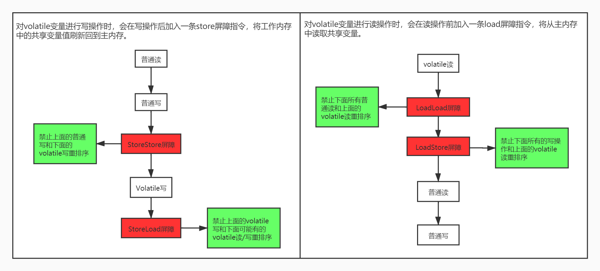

## 16.24 关于JMM

JMM（Java内存模型）：一种抽象的概念，本身并不真实存在，它描述的是一种规则或规范，通过这组规范定义了程序中各个变量（包括实例变量、静态字段和构成数组对象的元素）的访问方式。

**JMM关于同步的规定**：

1. 线程解锁前，必须把共享变量的值刷新回主内存。
2. 线程加锁前，必须读取主内存的最新值到自己的工作内存。
3. 加锁与解锁是同一把锁。

**JMM内存模型的特点**：简要过程如下图。

- 由于JVM运行程序的实体是线程，而每个线程创建时JVM都会为其创建一个**工作内存**（有些地方称为栈空间），工作内存是每个线程的私有数据区域，而Java内存模型中规定所有变量都存储在**主内存**，主内存是**共享内存区域**，所有线程都可以访问。
- 线程对变量的操作（读取赋值等）必须在工作内存中进行，首先要将变量从主内存拷贝到自己的工作内存空间，然后对变量进行操作，操作完成后再将变量写回主内存，不能直接操作主内存中的变量，各个线程中的工作内存中存储着主内存中的变量副本拷贝，因此不同的线程间无法访问对方的工作内存，线程间的通信（传值）必须通过主内存来完成。
- 工作内存和主内存同步延迟现象导致的**可见性问题**可以使用synchronized或volatile关键字解决，它们都可以使一个线程修改后的变量立即对其他线程可见；对于指令重排导致的**可见性问题和有序性问题**，可以利用volatile关键字解决，因为volatile的另外一个作用就是禁止重排序优化。

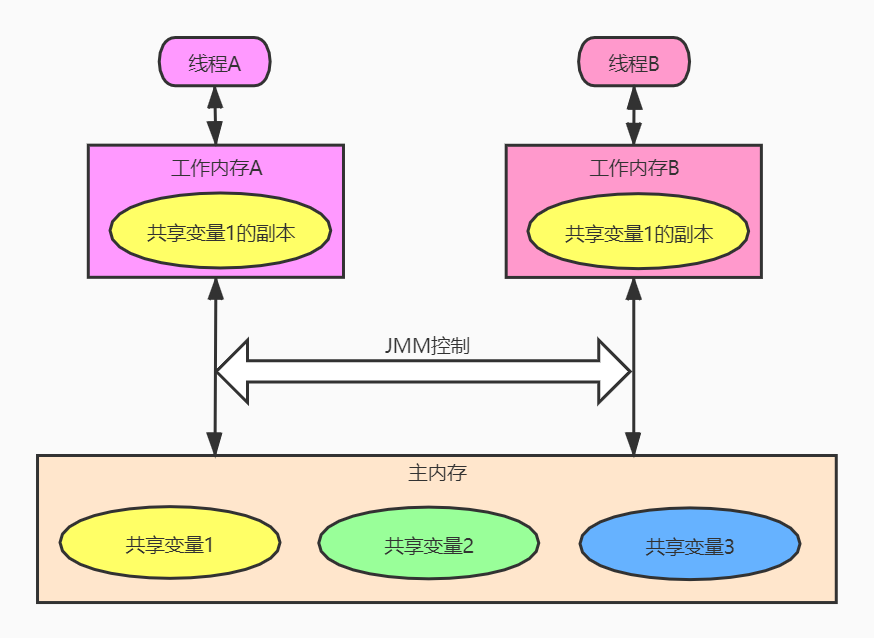

**JMM是大多数线程开发必须遵循的规范**：可见性、原子性、有序性（volatile满足可见性和有序性，但不保证原子性）。

## 16.25 谈谈CAS

CAS：Compare and Swap，比较并交换。先拿期望值与真实值进行比较，若相同，则将真实值设置为新值。（**结合JMM，则CAS可以理解为比较当前工作内存中的值（期望值）和主内存中的值（真实值），若相同则执行规定操作，否则继续比较直到主内存和工作内存中的值一致为止。**CAS有3个操作数，内存值V，预期值A，要修改的更新值B，当且仅当预期值A和内存值V相同时，将内存值V修改为B，否则什么也不做）。

CAS保证原子性的原理：

1. Unsafe类：是CAS的核心类，由于java方法无法直接访问底层系统，需要通过本地（native）方法来访问，Unsafe相当于一个后门，基于该类可以直接操作特定内存的数据。Unsafe类存在于sun.misc包中，其内部方法操作可以像C的指针一样直接操作内存，因为Java中CAS操作的执行依赖于Unsafe类的方法（**Unsafe的所有方法都是native修饰的，也就是说unsafe类中的方法都直接调用操作系统底层资源执行相应的任务**）。

2. 变量valueOffset，表示该变量值在内存中的偏移地址，因为Unsafe就是根据内存偏移地址获取数据的。
3. 变量value采用volatile修饰，保证了多线程之间的内存可见性。


关于CAS：全称Compare-And-Swap，是**一条CPU并发原语（即底层汇编），其功能是判断内存某个位置的值是否为预期值，如果是则更改为新的值，这个过程是原子的**。CAS并发原语体现在Java中就是sun.misc.Unsafe类中的各个方法，调用Unsafe类中的CAS方法，JVM会帮我们实现出CAS汇编指令，这是一种**完全依赖于硬件**的功能，通过它实现了原子操作。再次强调，**由于CAS是一种系统原语，原语属于操作系统用语范畴，是由若干条指令组成的，用于完成某个功能的一个过程，并且原语的执行必须是连续的，在执行过程中不允许被中断，也就是说CAS是一条CPU的原子指令，不会造成所谓的数据不一致问题**。

```yaml
# AtomicInteger的compareAndSet方法底层源码实现步骤：
# 1. 调用unsafe的compareAndSwapInt(this,valueOffset,expect,update)方法。
# 2. unsafe根据AtomicInteger对象本身(this)以及该对象的内存偏移地址(valueOffset)找出主内存中的真实值(var5)。
# 3. 利用该对象的期望值与真实值进行比较，若相同，则更新真实值；若不同，则继续取值然后再比较，直到更新完成。
```

**使用synchronized和原子变量类都能保证安全性，其区别在于**：

1. synchronized采用加锁机制，同一时间只允许一个线程访问，**一致性得到了保障，但是并发性下降**。
2. 原子变量类没有加锁，是采用CAS依靠硬件保证安全性（Unsafe+"自旋"，并未使用加锁机制），既**保证了一致性，又提高了并发性**。

**CAS的缺点**：

1. 如果CAS不成功，会一致进行循环，开销很大。
2. 只能保证一个共享变量的原子操作。对于多个共享变量操作时，循环CAS就无法保证操作的原子性，这个时候就可以使用加锁来保证原子性。
3. 存在ABA问题。

## 16.26 ABA问题与原子戳引用

**连环面试**：AtomicInteger-->CAS-->Unsafe-->CAS底层思想-->ABA问题-->原子引用更新-->如何规避ABA问题？

**原子变量类(如AtomicInteger)的ABA问题（狸猫换太子）**：原子变量类的底层采用CAS实现原子操作，而CAS会导致ABA问题。CAS算法实现的一个重要前提是需要取出内存中某时刻的数据并在当下时刻比较并替换，那么在这个时间差内会导致数据的变化。如线程1从主内存为止V中取出A，这时线程2也从内存中取出A，并且线程2进行了一些操作将主内存位置V中的A值变成了B，然后线程2又将B变成A，这时线程1进行CAS操作发现内存位置V中的值仍然为A，然后线程1操作成功。尽管线程1的CAS操作成功，但是并不代表这个过程就是没有问题的。

```java
// 原子变量类的使用
public class AtomicIntegerDemo {
    /**
     * CAS:Compare and swap [比较并交换]
     */
    public static void main(String[] args) {
        AtomicInteger atomicInteger = new AtomicInteger(5);
        //true 2019
        System.out.println(atomicInteger.compareAndSet(5, 2019) + "\t" + atomicInteger.get());
        //false 2019
        System.out.println(atomicInteger.compareAndSet(5, 2222) + "\t" + atomicInteger.get());
    }
}

// 原子引用类的使用
@Getter
@Setter
@AllArgsConstructor
@ToString
class User {
    private String name;
    private int age;
}
public class AtomicReferenceDemo {
    public static void main(String[] args) {
        User zs = new User("zs", 22);
        User ls = new User("ls", 22);
        AtomicReference<User> userAtomicReference = new AtomicReference<>();
        userAtomicReference.set(zs);
        System.out.println(userAtomicReference.compareAndSet(zs, ls) + "\t" + userAtomicReference.get().toString());
        System.out.println(userAtomicReference.compareAndSet(zs, ls) + "\t" + userAtomicReference.get().toString());
    }
}
```

**如何解决ABA问题**：原子引用(AtomicReference)+修改版本号（类似于时间戳）。JUC中的**AtomicStampedReference**约等于AtomicReference+版本号，可以使用AtomicStampedReference来规避ABA问题。

- AtomicReference：用于对引用的原子更新。
- AtomicMarkableReference：带版本戳的原子引用类型，版本戳为boolean类型。
- AtomicStampedReference：带版本戳的原子引用类型，版本戳为int类型。

```java
// ABA问题的再现及使用带版本戳的原子引用解决ABA问题
public class ABADemo {
    private static AtomicReference<Integer> atomicReference = new AtomicReference<>(100);
    private static AtomicStampedReference<Integer> stampedReference = new AtomicStampedReference<>(100, 1);

    public static void main(String[] args) {
        System.out.println("===以下是ABA问题的产生===");
        new Thread(() -> {
            atomicReference.compareAndSet(100, 101);
            atomicReference.compareAndSet(101, 100);
        }, "t1").start();

        new Thread(() -> {
            //先暂停1秒 保证完成ABA
            try {
                TimeUnit.SECONDS.sleep(1);
            } catch (InterruptedException e) {
                e.printStackTrace();
            }
            System.out.println(atomicReference.compareAndSet(100, 2019) + "\t" + atomicReference.get());
        }, "t2").start();
        try {
            TimeUnit.SECONDS.sleep(2);
        } catch (InterruptedException e) {
            e.printStackTrace();
        }

        System.out.println("===以下是ABA问题的解决===");
        new Thread(() -> {
            int stamp = stampedReference.getStamp();
            System.out.println(Thread.currentThread().getName() + "\t 第1次版本号" + stamp + "\t值是" + stampedReference.getReference());
            //暂停1秒钟t3线程
            try {
                TimeUnit.SECONDS.sleep(1);
            } catch (InterruptedException e) {
                e.printStackTrace();
            }

            stampedReference.compareAndSet(100, 101, stampedReference.getStamp(), stampedReference.getStamp() + 1);
            System.out.println(Thread.currentThread().getName() + "\t 第2次版本号" + stampedReference.getStamp() + "\t值是" + stampedReference.getReference());
            stampedReference.compareAndSet(101, 100, stampedReference.getStamp(), stampedReference.getStamp() + 1);
            System.out.println(Thread.currentThread().getName() + "\t 第3次版本号" + stampedReference.getStamp() + "\t值是" + stampedReference.getReference());
        }, "t3").start();

        new Thread(() -> {
            int stamp = stampedReference.getStamp();
            System.out.println(Thread.currentThread().getName() + "\t 第1次版本号" + stamp + "\t值是" + stampedReference.getReference());
            //保证线程3完成1次ABA
            try {
                TimeUnit.SECONDS.sleep(3);
            } catch (InterruptedException e) {
                e.printStackTrace();
            }
            boolean result = stampedReference.compareAndSet(100, 2019, stamp, stamp + 1);
            System.out.println(Thread.currentThread().getName() + "\t 修改成功否" + result + "\t最新版本号" + stampedReference.getStamp());
            System.out.println("最新的值\t" + stampedReference.getReference());
        }, "t4").start();
    }
}
```

## 16.27 List不安全之并发修改异常

List不安全之并发修改异常：

问题：使用**ArrayList**在多线程下添加元素会导致java.util.ConcurrentModificationException异常。

原因：并发争抢导致。一个线程正在写入，另一个线程过来抢夺，出现数据不一致情况，导致并发修改异常。

解决方法：

1. 使用Vector（效率低下）。

2. 使用Collections.synchronizedList(new ArrayList<>())（效率低下）。

3. 使用CopyOnWriteArrayList（写时复制：思想是读写分离）。

   ```java
   // 写时复制的原理：
   // CopyOnWriteArrayList容器即写时复制容器，往一个容器添加元素的时候，不直接往当前容器Object[]添加，而是先将当前容器Object[]进行copy,
   // 复制出一个新的容器Object[] newElements,然后新的容器Object[] newElements里添加元素，添加元素之后，再将原容器的引用指向新的容器
   // setArray(newElements)。这样做的好处是可以对CopyOnWriteArrayList容器进行并发的读，而不需要加锁，因为当前容器不会添加任何元素，所以
   // CopyOnWriteArrayList容器也是一种读写分离的思想，读和写在不同的容器。
   
   // CopyOnWriteArrayList的add方法源码如下
   public boolean add(E e) {
   	final ReentrantLock lock = this.lock;
   	lock.lock();
   	try {
   		Object[] elements = getArray();
   		int len = elements.length;
   		Object[] newElements = Arrays.copyOf(elements, len + 1);
   		newElements[len] = e;
   		setArray(newElements);
   		return true;
   	} finally {
   		lock.unlock();
   	}
   }
   ```

## 16.28 Set不安全之并发修改异常

List不安全之并发修改异常：

问题：使用**HashSet**在多线程下添加元素会导致java.util.ConcurrentModificationException异常。

原因：并发争抢导致。一个线程正在写入，另一个线程过来抢夺，出现数据不一致情况，导致并发修改异常。

解决方法：

1. 使用Collections.synchronizedSet(new HashSet<>())（效率低下）。

2. 使用CopyOnWriteArraySet（**底层还是使用CopyOnWriteArrayList**）。

   ```java
   // 源码：CopyOnWriteArraySet添加元素时实际调用的是CopyOnWriteArrayList对象的addIfAbsent方法
   public boolean addIfAbsent(E e) {
   	Object[] snapshot = getArray();
   	return indexOf(e, snapshot, 0, snapshot.length) >= 0 ? false : addIfAbsent(e, snapshot);
   }
   ```

## 16.29 Map不安全之并发修改异常

Map不安全之并发修改异常：

问题：使用**HashMap**在多线程下添加元素会导致java.util.ConcurrentModificationException异常。

原因：并发争抢导致。一个线程正在写入，另一个线程过来抢夺，出现数据不一致情况，导致并发修改异常。

解决方法：

1. 使用Hashtable（效率低下）。

2. 使用Collections.synchronizedMap(new HashMap<>())（效率低下）。

3. 使用ConcurrentHashMap（JDK1.7采用分段锁技术, 将哈希桶分割成Segment，Segement本质是ReentrantLock；JDK1.8采用synchronized+CAS）。. 

## 16.30 公平锁/非公平锁

**公平锁**：指多个线程按照申请锁的顺序来获取锁（类似于队列：FIFO）。**具体解释**：公平锁，就是很公平，在并发环境下，每个线程在获取锁时会先查看此锁维护的等待队列，若为空，或者当前线程是等待队列的第一个，就占有锁，否则就会加入到等待队列中，以后会按照FIFO的规则从队列中取到自己。

**非公平锁**：指多个线程获取锁的顺序并不是按照申请锁的顺序，有可能后申请的线程比先申请的线程优先获取锁；在高并发的情况下，有可能造成优先级反转或者饥饿的现象。**具体解释**：非公平锁比较粗鲁，上来就直接尝试占有锁，如果尝试失败，就再采用类似公平锁那种方式。**非公平锁的优点在于吞吐量比公平锁大**。

- ReentrantLock默认是非公平锁（即`new ReentrantLock()`等价于`new ReentrantLock(false)`），但是ReentrantLock可以设置成公平锁（`new ReentrantLock(true)`）
- 对于synchronized而言，也是一种非公平锁。

## 16.31 可重入锁(递归锁)

**可重入锁**：又名递归锁，指的是同一线程外层函数获得锁之后，内层递归函数仍然能获取该锁的代码；在同一个线程在外层方法获取锁的时候，在进入内层方法会自动获取锁。**简言之，线程可以进入任何一个它已经拥有的锁所同步着的代码块**。可重入锁的最大作用就是避免死锁。

- synchronized是一种典型的可重入锁。
- ReentrantLock也是一种典型的可重入锁。ReentrantLock在使用时，lock与unlock需要配对使用（lock与unlock二者数量一致）。

```java
public class ReentrantLockDemo {
    public static void main(String[] args) {
        Phone phone = new Phone();
        syncTest(phone);
        System.out.println();
        Thread t3 = new Thread(phone);
        Thread t4 = new Thread(phone);
        t3.start();
        t4.start();
    }

    private static void syncTest(Phone phone) {
        new Thread(() -> {
            try {
                phone.sendSMS();
            } catch (Exception e) {
                e.printStackTrace();
            }
        }, "t1").start();
        new Thread(() -> {
            try {
                phone.sendSMS();
            } catch (Exception e) {
                e.printStackTrace();
            }
        }, "t2").start();
    }
}

class Phone implements Runnable {
    //Synchronized TEST
    Lock lock = new ReentrantLock();

    public synchronized void sendSMS() {
        System.out.println(Thread.currentThread().getId() + "\t" + "sendSMS()");
        sendEmail();
    }

    //Reentrant TEST
    public synchronized void sendEmail() {
        System.out.println(Thread.currentThread().getId() + "\t" + "sendEmail()");
    }

    @Override
    public void run() {
        get();
    }

    public void get() {
        lock.lock();
        try {
            System.out.println(Thread.currentThread().getId() + "\t" + "get()");
            set();
        } finally {
            lock.unlock();
        }
    }

    public void set() {
        lock.lock();
        try {
            System.out.println(Thread.currentThread().getId() + "\t" + "set()");
        } finally {
            lock.unlock();
        }
    }
}
```

## 16.32 自旋锁的实现

**自旋锁**：指尝试获取锁的线程不会立即阻塞，而是采用循环的方式去尝试获取锁，这样的**好处**是减少线程上下文切换的消耗，**缺点**是循环会消耗CPU。

- 自旋锁可以由**"while循环+CAS+原子引用实现"**。

```java
// 自旋锁的实现
public class SpinLockDemo {
    AtomicReference<Thread> atomicReference = new AtomicReference<>();

    public static void main(String[] args) {
        SpinLockDemo spinLockDemo = new SpinLockDemo();
        new Thread(() -> {
            spinLockDemo.myLock();
            try {
                TimeUnit.SECONDS.sleep(5);
            } catch (Exception e) {
                e.printStackTrace();
            }
            spinLockDemo.myUnlock();
        }, "AA").start();

        try {
            TimeUnit.SECONDS.sleep(1);
        } catch (Exception e) {
            e.printStackTrace();
        }

        new Thread(() -> {
            spinLockDemo.myLock();
            try {
                TimeUnit.SECONDS.sleep(1);
            } catch (Exception e) {
                e.printStackTrace();
            }
            spinLockDemo.myUnlock();
        }, "BB").start();
    }

    public void myLock() {
        Thread thread = Thread.currentThread();
        System.out.println(Thread.currentThread().getName() + "\t" + " come in ...");
        while (!atomicReference.compareAndSet(null, thread)) {
        }
    }

    public void myUnlock() {
        Thread thread = Thread.currentThread();
        atomicReference.compareAndSet(thread, null);
        System.out.println(Thread.currentThread().getName() + "\t" + " unlock ...");
    }
}
```

## 16.33 独占锁(写锁)/共享锁(读锁)/互斥锁

多个线程同时读一个资源类没有任何问题，所以为了满足并发量，读取共享资源应该可以同时进行。但是，若有一个线程想去写共享资源来，就不应该再有其他线程可以对该资源进行读或写。**简言之，读-读能共存；读-写不能共存；写-写不能共存**。

- 读写锁：`new ReentrantReadWriteLock().writeLock()`
- 读锁：`new ReentrantReadWriteLock().readLock()`
- **ReentrantReadWriteLock相比于ReentrantLock更加细粒度，效率更高**。

```java
public class ReadWriteLockDemo {
    public static void main(String[] args) {
        MyCache cache = new MyCache();
        //写
        for (int i = 1; i <= 5; i++) {
            final int tempInt = i;
            new Thread(() -> {
                cache.put(tempInt + "", tempInt + "");
            }, String.valueOf(i)).start();
        }
        //读
        for (int i = 1; i <= 5; i++) {
            final int tempInt = i;
            new Thread(() -> {
                cache.get(tempInt + "");
            }, String.valueOf(i)).start();
        }
    }
}

/**
 * ReentrantReadWriteLock相比于ReentrantLock更加细粒度，效率更高
 */
class MyCache {
    //缓存更新快，需要用volatile修饰
    private volatile Map<String, Object> map = new HashMap<>();
    private ReadWriteLock rwLock = new ReentrantReadWriteLock();
//    private Lock lock = new ReentrantLock();

    public void put(String key, Object value) {
        rwLock.writeLock().lock();
//        lock.lock();
        try {
            System.out.println(Thread.currentThread().getName() + "\t" + "正在写入： " + key);
            //模拟网络传输
            try {
                TimeUnit.MILLISECONDS.sleep(300);
            } catch (Exception e) {
                e.printStackTrace();
            }
            map.put(key, value);
            System.out.println(Thread.currentThread().getName() + "\t" + "写入完成");
        } catch (Exception e) {
            e.printStackTrace();
        } finally {
            rwLock.writeLock().unlock();
//            lock.unlock();
        }
    }

    public void get(String key) {
        rwLock.readLock().lock();
//        lock.lock();
        try {
            System.out.println(Thread.currentThread().getName() + "\t" + "正在读取： " + key);
            //模拟网络传输
            try {
                TimeUnit.MILLISECONDS.sleep(300);
            } catch (Exception e) {
                e.printStackTrace();
            }
            Object result = map.get(key);
            System.out.println(Thread.currentThread().getName() + "\t" + "读取完成： " + result);
        } catch (Exception e) {
            e.printStackTrace();
        } finally {
            rwLock.readLock().unlock();
//            lock.unlock();
        }
    }
}
```

## 16.34 CountDownLatch(倒计时器/减法计数器)

**CountDownLatch**：倒计时器。

-  倒计时器的创建：`CountDownLatch countDownLatch = new CountDownLatch(6)`
- 执行减一：`countDownLatch.countDown();`
- 若倒计时未归零则继续执行：`countDownLatch.await();`

```java
// CountDownLatch的使用测试
public class CountDownLatchDemo {
    public static void main(String[] args) throws InterruptedException {
        leaveClassroom();
        county();
    }

    private static void county() throws InterruptedException {
        CountDownLatch countDownLatch = new CountDownLatch(6);
        for (int i = 1; i <= 6; i++) {
            new Thread(() -> {
                System.out.println(Thread.currentThread().getName() + "\t 国被灭");
                countDownLatch.countDown();
            }, CountryEnum.list(i).getRetMsg()).start();
        }
        countDownLatch.await();
        System.out.println(Thread.currentThread().getName() + "\t ******秦国一统华夏");
    }

    private static void leaveClassroom() throws InterruptedException {
        CountDownLatch countDownLatch = new CountDownLatch(6);
        for (int i = 1; i <= 6; i++) {
            new Thread(() -> {
                System.out.println(Thread.currentThread().getName() + "\t上完自习，离开教室");
                countDownLatch.countDown();
            }, String.valueOf(i)).start();
        }
        countDownLatch.await();
        System.out.println(Thread.currentThread().getName() + "\t******班长最后关门走人");
    }
}

// 枚举类的使用
public enum CountryEnum {
    ONE(1, "齐"),
    TWO(2, "楚"),
    THREE(3, "燕"),
    FOUR(4, "赵"),
    FIVE(5, "魏"),
    SIX(6, "韩");
    @Getter
    private Integer retCode;
    @Getter
    private String retMsg;

    private CountryEnum(Integer retCode, String retMsg) {
        this.retCode = retCode;
        this.retMsg = retMsg;
    }

    public static CountryEnum list(int idx) {
        CountryEnum[] countryEnums = CountryEnum.values();
        for (CountryEnum countryEnum : countryEnums) {
            if (idx == countryEnum.getRetCode())
                return countryEnum;
        }
        return null;
    }
}
```

## 16.35 CyclicBarrier(栅栏/加法计数器)

**CyclicBarrier**：字面意思是可循环使用的屏障，官方称之为**栅栏**。它要做的事情是，让一组线程到达一个屏障（也可以叫同步点）时被阻塞，直到最后一个线程到达屏障时，屏障才会开门，所有被屏障拦截的线程才会继续干活，线程进入屏障通过CyclicBarrier的await方法。

- 栅栏的创建：`CyclicBarrier(int parties)或CyclicBarrier(int parties, Runnable barrierAction)`
- 执行减一（先到先等）：`cyclicBarrier.await();`

```java
public class CyclicBarrierDemo {
    public static void main(String[] args) {
        CyclicBarrier cyclicBarrier = new CyclicBarrier(7, () -> {
            System.out.println("*****召唤神龙");
        });
        for (int i = 1; i <= 7; i++) {
            final int tempInt = i;
            new Thread(() -> {
                System.out.println(Thread.currentThread().getName() +
                        "\t 收集到第" + tempInt + "颗龙珠");
                try {
                    cyclicBarrier.await();
                } catch (Exception e) {
                    e.printStackTrace();
                }
            }, String.valueOf(i)).start();
        }
    }
}
```

CyclicBarrier与CountDownLatch比较：

1. CountDownLatch：一个线程(或者多个)，等待另外N个线程完成某个事情之后才能执行；CyclicBarrier：N个线程相互等待，任何一个线程完成之前，所有的线程都必须等待。
2. CountDownLatch一次性的；CyclicBarrier可以重复使用。
3. CountDownLatch基于AQS；CyclicBarrier基于锁和Condition。本质上都是依赖于volatile和CAS实现的。

## 16.36 Semaphore(信号量)

**Semaphore**：信号量，主要用于两个目的。**一个是用于多个共享资源的互斥使用，另一个是用于并发线程数的控制**。若Semaphore的构造器的permits参数设置为1，则Semaphore会退化成synchronized。**Semaphore可以用于实现数据库连接池**。

- 信号量的创建：`Semaphore(int permits)（默认是非公平锁）`、`Semaphore(int permits, boolean fair)`
- 加一：`semaphore.acquire();`
- 减一：`semaphore.release();`

```java
public class SemaphoreDemo {
    public static void main(String[] args) {
        Semaphore semaphore = new Semaphore(3);
        for (int i = 1; i <= 6; i++) {
            new Thread(() -> {
                try {
                    semaphore.acquire();
                    System.out.println(Thread.currentThread().getName() +
                            "\t抢到车位");
                    try {
                        TimeUnit.SECONDS.sleep(3);
                    } catch (Exception e) {
                        e.printStackTrace();
                    }
                    System.out.println(Thread.currentThread().getName() +
                            "\t停车3秒后离开车位");
                } catch (InterruptedException e) {
                    e.printStackTrace();
                } finally {
                    semaphore.release();
                }
            }, String.valueOf(i)).start();
        }
    }
}
```

## 16.37 阻塞队列(3种生产者/消费者模式的实现)

**阻塞队列**：顾名思义，首先它是一个队列，而一个阻塞队列在数据结构中所起的作用如下：

1. 当阻塞队列是空时，从队列中**获取元素**的操作将会被阻塞。
2. 当阻塞队列是满时，往队列里**添加元素**的操作将会被阻塞。
3. 试图从空的阻塞队列中**获取元素的线程**将会被阻塞，直到其他的线程往空的队列插入新的元素。
4. 试图往已满的阻塞队列中**添加新元素的线程**同样也将会被阻塞，直到其他的线程从列中移除一个或多个元素或者完全清空队列后使队列重新变得空闲起来并后续新增。

**为什么需要使用阻塞队列？**

- 在多线程领域，所谓阻塞就是在某些情况下会挂起线程（即阻塞），一旦条件满足，被挂起的线程又会自动被唤醒。**使用阻塞队列的好处使我们不需要关心什么时候需要阻塞线程，什么时候需要唤醒线程，因为给这一切BlockingQueue都给我们封装好了**。
- 在concurrent包发布以前，在多线程环境下，我们每个程序员都必须去自己控制这些细节，尤其还要兼顾效率和线程安全，而这会给我们的程序带来不小的复杂度。

**阻塞队列接口的实现类**：

1. **ArrayBlockingQueue**：由数组结构组成的有界阻塞队列。（可以设置公平/非公平，默认非公平）
2. **LinkedBlockingQueue**：由链表结构组成的有界（但大小默认值为Integer.MAX_VALUE）阻塞队列。（两个独立锁ReentrantLock提高并发）
3. **SynchronousQueue**：不存储元素的阻塞队列，也即**单个元素的队列**。（不存储数据，可用于传递数据）
4. PriorityBlockingQueue：支持**优先级排序的无界阻塞队列**。（compareTo排序实现优先级排序，或指定Comparator定制排序）
5. DelayQueue：使用优先级队列实现的**延迟无界阻塞队列**。（缓存失效、定时任务）
   - 应用场景：
     - 缓存系统的设计：可以用 DelayQueue 保存缓存元素的有效期，使用一个线程循环查询DelayQueue，一旦能从DelayQueue中获取元素时，表示缓存有效期到了。
     - 定时任务调度： 使用DelayQueue保存当天将会执行的任务和执行时间，一旦从DelayQueue中获取到任务就开始执行，从比如TimerQueue 就是使用DelayQueue实现的。
6. LinkedTransferQueue：由链表结构组成的**无界阻塞队列**。（多了tryTransfer和transfer方法）
7. LinkedBlockingDeque：由链表结构组成的**双向阻塞队列**。（双端队列多了一个操作队列的入口）

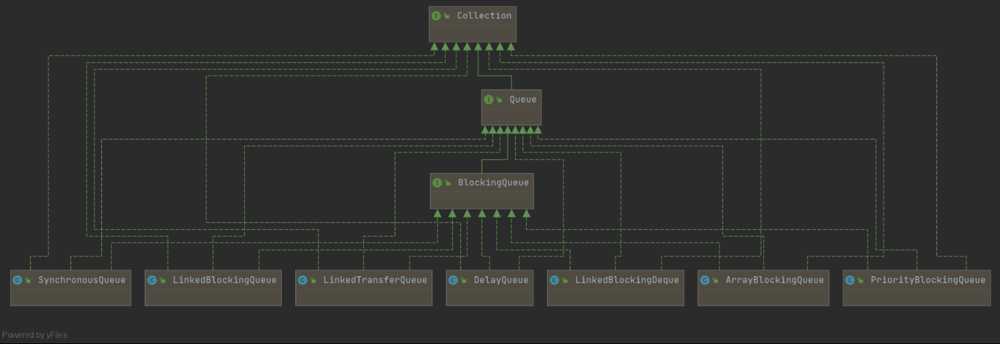

**阻塞队列的核心方法**：

|  方法类型  | 抛出异常  |  特殊值  | 阻塞(一般多线程时使用) |      超时阻塞      |
| :--------: | :-------: | :------: | :--------------------: | :----------------: |
| 插入到队尾 |  add(e)   | offer(e) |         put(e)         | offer(e,time,unit) |
|  移除队首  | remove()  |  poll()  |         take()         |  poll(time,unit)   |
|  检查队首  | element() |  peek()  |         不可用         |       不可用       |

| 类型     | 解释                                                         |
| :------- | ------------------------------------------------------------ |
| 抛出异常 | 当阻塞队列满时，再往队列里add插入元素会会抛出IllegalStateException；<br />当阻塞队列空时，再往队列里remove移除元素会抛出NoSuchElementException；<br />当阻塞队列空时，再从队列里element获取元素会抛出NoSuchElementException。 |
| 特殊值   | 插入方法，成功返回true，失败返回false；<br />移除方法，成功返回出队列的元素，队列里面没有就返回null。 |
| 一直阻塞 | 当阻塞队列满时，生产者线程继续往队列里put元素，队列会一直阻塞生产线程直到put数据或响应中断退出；<br />当阻塞队列空时，消费者线程试图从队列里take元素，队列会一直阻塞消费者线程直到队列可用。 |
| 超时退出 | 当阻塞队列满时，队列会阻塞生产者线程一定的时间，超时后返回失败；<br />当阻塞队列空时，队列会阻塞消费者线程一定的时间，超时后返回失败。 |

**阻塞队列的使用场景**：

- 生产者消费者模式（**传统版本和阻塞队列版本**）

  - 传统版本1：synchronized+wait+notify（**线程操作资源类**、**判断干活唤醒通知**、**严防并发状态下的虚假唤醒（使用while循环判断）**）

    ```java
    // 传统版本的生产者消费者模式：使用synchronized+wait+notifyAll实现
    // 实现多个生产者和消费者对资源类的消费和生产，资源类的最大生产数量为5
    public class ProdConsTradiDemo1 {
        public static void main(String[] args) {
            ShareData1 shareData = new ShareData1();
            // 实现多个生产者和消费者对资源类的消费和生产，资源类的最大生产数量为5
            for (int j = 0; j < 10; j++) {
                new Thread(() -> {
                    for (int i = 0; i < 5; i++) {
                        try {
                            shareData.increment();
                        } catch (Exception e) {
                            e.printStackTrace();
                        }
                    }
                }, "Producer" + j).start();
            }
    
            for (int j = 0; j < 10; j++) {
                new Thread(() -> {
                    for (int i = 0; i < 5; i++) {
                        try {
                            shareData.decrement();
                        } catch (Exception e) {
                            e.printStackTrace();
                        }
                    }
                }, "Consumer" + j).start();
            }
        }
    }
    
    class ShareData1 {
        private int number = 0;
        public synchronized void increment() {
            //1 判断
            while (number == 5) {
                // 等待不能生产
                try {
                    this.wait();
                } catch (InterruptedException e) {
                    e.printStackTrace();
                }
            }
            //2 干活
            number++;
            System.out.println(Thread.currentThread().getName() + "\t" + number);
            //3 通知唤醒
            this.notifyAll();
        }
    
        public synchronized void decrement() {
            //1 判断
            while (number == 0) {
                //等待，不能消费
                try {
                    this.wait();
                } catch (InterruptedException e) {
                    e.printStackTrace();
                }
            }
            //2 干活
            number--;
            System.out.println(Thread.currentThread().getName() + "\t" + number);
            //3 通知唤醒
            this.notifyAll();
        }
    }
    ```
  
- 传统版本2：Lock+condition.await+condition.singalAll
  
  ```java
    // 传统版本的生产者消费者模式：使用Lock+Condition实现
    // 实现多个生产者和消费者对资源类的消费和生产，资源类的最大生产数量为1
    public class ProdConsTradiDemo2 {
        public static void main(String[] args) {
            ShareData2 shareData = new ShareData2();
            
            for (int j = 0; j < 10; j++) {
                new Thread(() -> {
                    for (int i = 0; i < 5; i++) {
                        try {
                            shareData.increment();
                        } catch (Exception e) {
                            e.printStackTrace();
                        }
                    }
                }, "Producer" + j).start();
            }
    
            for (int j = 0; j < 10; j++) {
                new Thread(() -> {
                    for (int i = 0; i < 5; i++) {
                        try {
                            shareData.decrement();
                        } catch (Exception e) {
                            e.printStackTrace();
                        }
                    }
                }, "Consumer" + j).start();
            }
        }
    }
    
    class ShareData2 {
        private int number = 0;
        private Lock lock = new ReentrantLock();
        private Condition condition = lock.newCondition();
    
        public void increment() throws InterruptedException {
            lock.lock();
            try {
                //1 判断
                while (number == 1) {
                    //等待，不能生产
                    condition.await();
                }
                //2 干活
                number++;
                System.out.println(Thread.currentThread().getName() + "\t" + number);
                //3 通知唤醒
                condition.signalAll();
            } catch (Exception e) {
                e.printStackTrace();
            } finally {
                lock.unlock();
            }
        }
    
        public void decrement() throws InterruptedException {
            lock.lock();
            try {
                //1 判断
                while (number == 0) {
                    //等待，不能生产
                    condition.await();
                }
                //2 干活
                number--;
                System.out.println(Thread.currentThread().getName() + "\t" + number);
                //3 通知唤醒
                condition.signalAll();
            } catch (Exception e) {
                e.printStackTrace();
            } finally {
                lock.unlock();
            }
        }
    }
  ```
  
- 阻塞队列版本：
  
  ```java
    // 使用阻塞队列实现生产者消费者模式
    public class ProdConsBlockQueueDemo {
        public static void main(String[] args) {
            MyResource myResource = new MyResource(new ArrayBlockingQueue<>(10));
            new Thread(() -> {
                System.out.println(Thread.currentThread().getName() + "\t生产线程启动");
                try {
                    myResource.myProd();
                } catch (Exception e) {
                    e.printStackTrace();
                }
            }, "prod").start();
    
            new Thread(() -> {
                System.out.println(Thread.currentThread().getName() + "\t消费线程启动");
                try {
                    myResource.myCons();
                } catch (Exception e) {
                    e.printStackTrace();
                }
            }, "cons").start();
    
            try {
                TimeUnit.SECONDS.sleep(5);
            } catch (Exception e) {
                e.printStackTrace();
            }
    
            System.out.println("5秒钟后，叫停");
            myResource.stop();
        }
    }
    
    class MyResource {
        // 使用volatile保证可见性
        private volatile boolean FLAG = true; //默认开启，进行生产+消费
        private AtomicInteger atomicInteger = new AtomicInteger();
        private BlockingQueue<String> blockingQueue;
    
        public MyResource(BlockingQueue<String> blockingQueue) {
            this.blockingQueue = blockingQueue;
        }
    
        public void myProd() throws Exception {
            String data = null;
            boolean retValue;
            while (FLAG) {
                data = atomicInteger.incrementAndGet() + "";//++i
                retValue = blockingQueue.offer(data, 2L, TimeUnit.SECONDS);
                if (retValue) {
                    System.out.println(Thread.currentThread().getName() + "\t" + "插入队列" + data + "成功");
                } else {
                    System.out.println(Thread.currentThread().getName() + "\t" + "插入队列" + data + "失败");
                }
                TimeUnit.SECONDS.sleep(1);
            }
            System.out.println(Thread.currentThread().getName() + "\tFLAG==false，停止生产");
        }
    
        public void myCons() throws Exception {
            String res;
            while (FLAG) {
                res = blockingQueue.poll(2L, TimeUnit.SECONDS);
                if (null == res || res.equalsIgnoreCase("")) {
                    FLAG = false;
                    System.out.println(Thread.currentThread().getName() + "\t超过2秒钟没有消费，退出消费");
                    return;
                }
                System.out.println(Thread.currentThread().getName() + "\t消费队列" + res + "成功");
            }
        }
    
        public void stop() {
            this.FLAG = false;
        }
    }
  ```
  
- 线程池

- 消息中间件

## 16.38 synchronized和ReentrantLock的区别

**synchronized和ReentrantLock的区别**：

（两种传统的阻塞队列（synchronized+wait+notify和Lock+condition.await+condition.singalAll）实现方法有何区别？该问题同上）

- **原始构成不同**：
  - synchronized是关键字属于JVM层面（底层通过monitorenter和monitorexit指令来完成，其实wait/notify等方法也依赖于monitor对象，只有再同步块或方法中才能调wait/notify等方法）。
  - ReentrantLock是具体类（java.util.concurrent.locks）是api层面的锁。

- **使用方法不同**：
  - synchronized不需要用户去手动释放锁，当synchronized代码执行完后系统会自动让线程释放对锁的占用。
  - ReentrantLock则需要用户去手动释放锁，若没有主动释放锁，就有可能导致出现死锁现象，需要lock()和unlock()方法配合try/finally语句来完成。

- **等待是否可中断**：
  - synchronized不可中断，除非抛出异常或者正常运行完成。
  - ReentrantLock可中断（比synchronized更加灵活），有两种方法：
    - 设置超时方法：tryLock(long timeout, TimeUnit unit)。
    - lockInterruptibly()放代码块中，调用interrupt()方法可中断。

- **加锁是否公平**：
  - synchronized是非公平锁。
  - ReentrantLock默认非公平锁，但可以设置成公平锁（构造方法可以传入boolean值，true为公平锁，false为非公平锁）。

- **锁绑定多个条件Condition**：
  - synchronized没有Condition，synchronized要么随机唤醒一个，要么唤醒全部。
  - ReentrantLock用来实现分组唤醒需要被唤醒的线程们，可以精确唤醒，而不是像synchronized要么随机唤醒一个线程要么唤醒全部线程。

```java
// ReentrantLock可中断测试
public class ReentrantLockInterruptDemo {
    ReentrantLock lock1 = new ReentrantLock();
    ReentrantLock lock2 = new ReentrantLock();
    Object syn1 = new Object();
    Object syn2 = new Object();

    public static void main(String[] args) throws Exception {
        new ReentrantLockInterruptDemo().exeInterupt();
    }

    /**
     * ReentrantLock响应中断
     * @throws Exception
     */
    public void exeInterupt() throws Exception {
        Thread t1 = new Thread(new DemoThread(lock1, lock2));
        Thread t2 = new Thread(new DemoThread(lock2, lock1));
        t1.start();
        t2.start();
        System.out.println(t1.getName() + "中断");
        //主线程睡眠1秒，避免线程t1直接响应run方法中的睡眠中断
        Thread.sleep(1000);
        t1.interrupt();
        //阻塞主线程，避免所有线程直接结束，影响死锁效果
        Thread.sleep(10000);
    }

    /**
     * ReentrantLock实现死锁
     */
    static class DemoThread implements Runnable {
        ReentrantLock lock1;
        ReentrantLock lock2;
        public DemoThread(ReentrantLock lock1, ReentrantLock lock2) {
            this.lock1 = lock1;
            this.lock2 = lock2;
        }
        @Override
        public void run() {
            try {
                //可中断的获取锁
                lock1.lockInterruptibly();
                //睡眠200毫秒，保证两个线程分别已经获取到两个锁，实现相互的锁等待
                TimeUnit.MILLISECONDS.sleep(200);
                //可中断的获取锁
                lock2.lockInterruptibly();
            } catch (InterruptedException e) {
                e.printStackTrace();
            } finally {
                lock1.unlock();
                lock2.unlock();
                System.out.println("线程" + Thread.currentThread().getName() + "正常结束");
            }
        }
    }
}

// ReentrantLock实现精准通知测试
public class SyncAndReenLockDemo {
    /**
     * 多线成之间按顺序调用，实现A->B->C三个线程启动，要求如下:
     * AA打印5次，BB打印10次，CC打印15次
     * 紧接着
     * AA打印5次，BB打印10次，CC打印15次
     * ...
     * 持续10轮
     */
    public static void main(String[] args) {
        ShareResource shareResource = new ShareResource();
        new Thread(() -> {
            for (int i = 0; i < 10; i++) {
                shareResource.print5();
            }
        }, "A").start();
        new Thread(() -> {
            for (int i = 0; i < 10; i++) {
                shareResource.print10();
            }
        }, "B").start();
        new Thread(() -> {
            for (int i = 0; i < 10; i++) {
                shareResource.print15();
            }
        }, "C").start();
    }
}

class ShareResource {
    private int number = 1;
    private Lock lock = new ReentrantLock();
    private Condition c1 = lock.newCondition();
    private Condition c2 = lock.newCondition();
    private Condition c3 = lock.newCondition();

    public void print5() {
        lock.lock();
        try {
            //1. 判断
            while (number != 1) {
                c1.await();
            }
            //2. 干活
            for (int i = 0; i < 5; i++) {
                System.out.println(Thread.currentThread().getName() + "\t" + (i + 1));
            }
            //3. 通知
            number = 2;
            c2.signal();
        } catch (Exception e) {
            e.printStackTrace();
        } finally {
            lock.unlock();
        }
    }

    public void print10() {
        lock.lock();
        try {
            //1. 判断
            while (number != 2) {
                c2.await();
            }
            //2. 干活
            for (int i = 0; i < 10; i++) {
                System.out.println(Thread.currentThread().getName() + "\t" + (i + 1));
            }
            //3. 通知
            number = 3;
            c3.signal();
        } catch (Exception e) {
            e.printStackTrace();
        } finally {
            lock.unlock();
        }
    }

    public void print15() {
        lock.lock();
        try {
            //1. 判断
            while (number != 3) {
                c3.await();
            }
            //2. 干活
            for (int i = 0; i < 15; i++) {
                System.out.println(Thread.currentThread().getName() + "\t" + (i + 1));
            }
            //3. 通知
            number = 1;
            c1.signal();
        } catch (Exception e) {
            e.printStackTrace();
        } finally {
            lock.unlock();
        }
    }
}
```

## 16.39 Callable接口

Runnable和Callable接口的区别：

- 所在包不同：Runnable接口来自`java.lang`包；Callable接口来自`java.util.concurrent包`。

- **方法名**不同：Runnable接口是run方法，Callable接口是call方法。
- 是否有**返回值**：Runnable接口的run方法无返回值，而Callable接口的call方法有返回值。
- 是否抛出**异常**：Runnable接口的run方法不抛出异常，而Callable接口的call方法抛出Exception异常。

```java
// 通过执行FutureTask的run方法，实现执行Callable的call方法，这体现了一种适配器的设计模式
public class CallableDemo {
    public static void main(String[] args) throws ExecutionException, InterruptedException {
        FutureTask<Integer> futureTask = new FutureTask<>(new MyThread());
        new Thread(futureTask, "AA").start();
        int result01 = 100;
        int result02 = futureTask.get(); // 一般放到最后
        System.out.println("result=" + (result01 + result02));
    }
}

class MyThread implements Callable<Integer> {
    @Override
    public Integer call() throws Exception {
        System.out.println("callable come in ...");
        return 1024;
    }
}
```

## 16.40 线程池使用及优势

线程池做的工作主要是控制运行的线程的数量，处理过程种将任务放入队列，然后在线程创建后启动这些任务；若线程数量超过了最大数量，超出数量的线程会排队等候，等其他线程执行完毕，再从队列中取出任务来执行。

**主要特点是**：线程复用（**降低资源消耗**）；控制最大并发数（**提高响应速度**）；管理线程（**提高线程的可管理性**）。

1. **降低资源消耗**。通过重复利用已创建的线程降低线程创建和销毁造成的销毁。
2. **提高响应速度**。当任务到达时，任务可以不需要等到线程创建就能立即执行。
3. **提高线程的可管理性**。线程是稀缺资源，若无限制创建，不仅会消耗系统资源，还会降低系统的稳定性，使用线程池可进行统一的分配、调优和监控。

## 16.41 关于线程池

Executor框架：

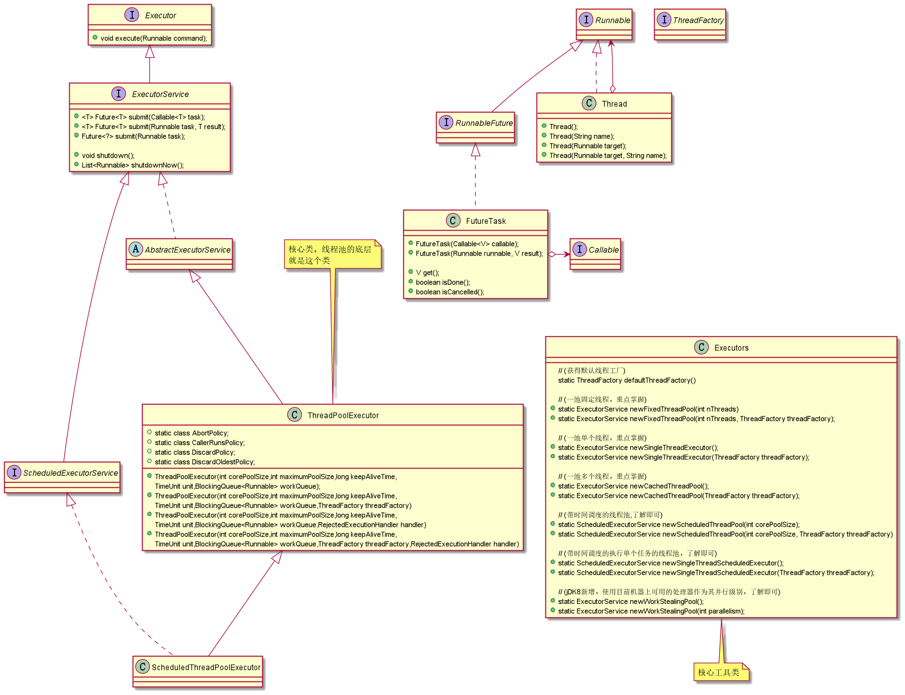

**创建线程的方式**：

1. 继承Thread类

2. 实现Runnable接口（没有返回值，不抛异常）

3. 实现Callable接口（有返回值，会抛异常）

4. 使用线程池获得线程

   - 通过Executors工具类（总共有6种方法，常用的有三种方法）

     - **一池固定线程**：执行长期任务，性能好很多
       - `static ExecutorService newFixedThreadPool(int nThreads);`
       - `static ExecutorService newFixedThreadPool(int nThreads, ThreadFactory threadFactory);`
     - **一池单线程**：一个任务一个任务执行的场景
       - `static ExecutorService newSingleThreadExecutor();`
       - `static ExecutorService newSingleThreadExecutor(ThreadFactory threadFactory);`

     - **一池多线程**：线程数量不固定，适用于执行很多短期异步的小程序或者负载较轻的服务器
       - `static ExecutorService newCachedThreadPool();`
       - `static ExecutorService newCachedThreadPool(ThreadFactory threadFactory);`

     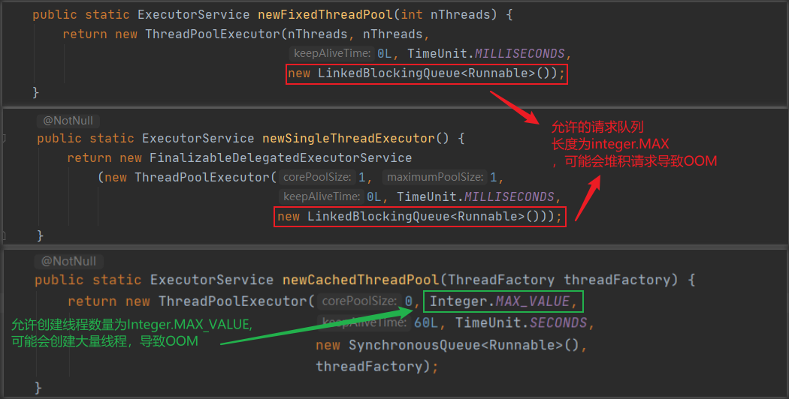
     
     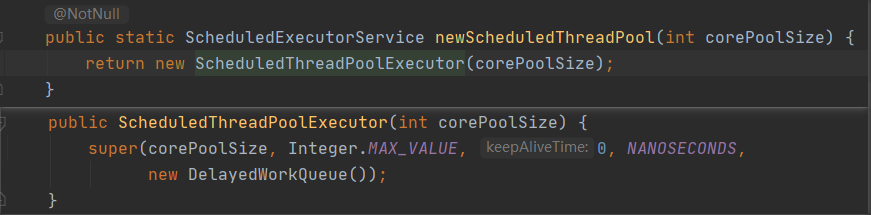

   - 通过ThreadPoolExecutor类

     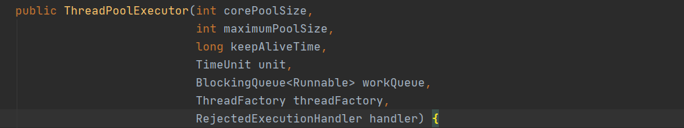

**ThreadPoolExecutor线程池的七大参数**：

1. corePoolSize：线程池中的常驻核心线程数。
2. maximumPoolSize：线程池能够容纳同时执行的最大线程数，此值必须大于等于1。
3. keepAliveTime：多余的空闲线程的存活时间。当前线程池数量超过corePoolSize时，当空闲时间达到keepAliveTime时，多余空闲线程会被销毁直到只剩下corePoolSize个线程为止。
4. unit：keepAliveTime的单位。
5.  workQueue：任务队列，存储被提交但尚未被执行的任务。
6. threadFactory：表示生成线程池中工作线程的线程工厂，用于创建线程，一般使用默认的即可。
7. handler：拒绝策略（有四种），表示当队列满了并且工作线程大于等于线程池的最大线程数(maximumPoolSize)时如何来拒绝任务。
   - **AbortPolicy**（默认，中止策略）：直接抛出RejectedExecutionException异常阻止系统正常运行。
   - CallerRunsPolicy（调用者运行策略）："调用者运行"的一种调节机制，该策略既不会抛弃任务，也不会抛出异常，而是将某些任务回退到调用者。
   - DiscardOldestPolicy（抛弃最旧的）：抛弃队列中等待最久的任务，然后把当前任务加入队列中尝试再次提交当前任务。
   - DiscardPolicy（直接抛弃）：直接丢弃任务，不予任何处理也不抛出异常，如果允许任务丢失，这是最好的一种方案。

**线程池的底层工作原理**：

1. 在创建了线程池后，等待提交过来的任务请求。
2. 当调用execute()方法添加一个请求任务时，线程池会做如下判断：
   - 如果正在运行的线程数量小于corePoolSize，那么马上创建线程运行这个任务。
   - 如果正在运行的线程数量大于或等于corePoolSize，那么将这个任务放入队列。
   - 如果这时队列满了且正在运行的线程数量还小于maxiumPoolSize，那么还是要创建非核心线程**立刻执行**这个任务。
   - 如果队列满了且正在运行的线程数量大于或等于maxiumPoolSize，那么线程池会启动饱和拒绝策略来执行。
3. 当一个线程完成任务时，它会从队列中取下一个任务来执行。
4. 当一个线程无事可做超过一定的时间（keepAliveTime）时，线程池会判断：若当前运行的线程数大于corePoolSize，那么这个线程就被停掉。

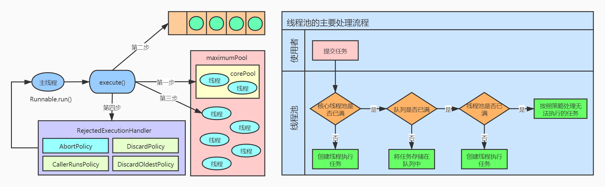

**如何合理的配置线程池？**

**CPU密集型**：该任务需要大量的运算，而没有阻塞，CPU一直全速运行。CPU密集型任务只有在真正的多核CPU上才可能得到加速（通过多线程）。

**IO密集型**：即该任务需要大量的IO，即大量的阻塞。在单线程上运行IO密集型的任务会导致浪费大量的CPU运算能力浪费在等待。在IO密集型任务中使用多线程可以大大加速程序的运行，即使在单核CPU上，这种加速主要就是利用了被浪费掉的阻塞时间。

**设置线程池的规则**：

- CPU密集型：maximumPoolSize=CPU核数+1
- IO密集型：一般有两种计算方式，可以根据实际效果选用。
  - maximumPoolSize=CPU核数\*2
  - maximumPoolSize=CPU核数/(1-阻塞系数)，阻塞系数在0.8~0.9之间

## 16.42 死锁编码及定位分析

**死锁**：指两个或两个以上的进程在执行过程中，因争夺资源而造成的一种互相等待的现象，若无外力干涉那它们都将无法推进下去，如果系统资源充足，进程的资源请求都能够得到满足，死锁出现的可能性就很低，否则就会因争夺有限的资源而陷入死锁。**简言之，多个线程同时被阻塞，它们中的一个或者全部都在等待某个资源释放，由于线程被无限期地阻塞，因此程序不可能正常终止。**

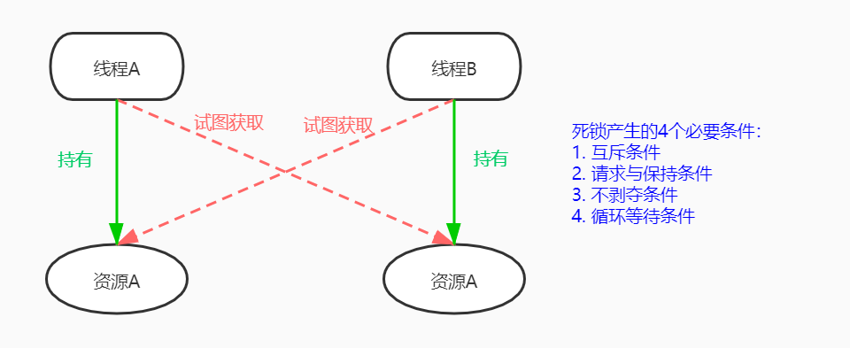

**死锁产生的四个必要调节**：

1. **互斥条件**：该资源任意一个时刻只由一个线程占用。
2. **请求与保持条件**：一个线程因请求资源而阻塞时，对已获得的资源保持不放。
3. **不剥夺条件**：线程已获得的资源在未使用之前不能被其他线程强行剥夺，只有自己使用完毕后才释放资源。
4. **循环等待条件**：若干进程之间形成一种头尾相接的循环等待资源关系。

**死锁编码**：

```java
public class DeadLockDemo {
    private static Object resource1 = new Object();
    private static Object resource2 = new Object();

    public static void main(String[] args) {
        new Thread(() -> {
            synchronized (resource1) {
                System.out.println(Thread.currentThread().getName() + " get resource1");
                try {
                    Thread.sleep(1000);
                } catch (InterruptedException e) {
                    e.printStackTrace();
                }
                System.out.println(Thread.currentThread().getName() + " waiting resource2");
                synchronized (resource2) {
                    System.out.println(Thread.currentThread().getName() + " get resource2");
                }
            }
        }, "线程1").start();
        new Thread(() -> {
            synchronized (resource2) {
                System.out.println(Thread.currentThread().getName() + " get resource2");
                try {
                    Thread.sleep(1000);
                } catch (InterruptedException e) {
                    e.printStackTrace();
                }
                System.out.println(Thread.currentThread().getName() + " waiting resource1");
                synchronized (resource1) {
                    System.out.println(Thread.currentThread().getName() + " get resource1");
                }
            }
        }, "线程2").start();
    }
}
```

**死锁的排查**：

1. 使用`jps -l`查看对应的java程序运行的进程，定位进程号。

   ```yaml
   # Linux下，查看进程：ps -ef|grep xxxx
   # Linux下，查看进程：ps -l
   
   # Windows下的java运行程序，有类似于Linux下ps的命令：jps
   # 简记：jsp = JVM ps
   # Windows下查看java进程：jps -l
   ```

2. 使用`jstack 进程号`找到死锁。

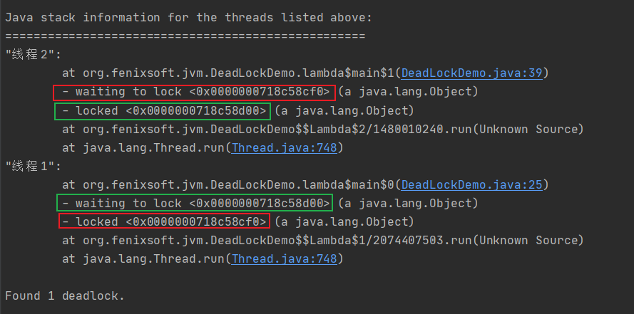

## 16.43 关于GC Roots

**垃圾**：内存中已经不再被使用到的空间就是垃圾。

**如何判断一个对象是垃圾**？

1. 引用计数法：计数为0的对象就是垃圾。
2. 枚举根节点（GC Roots，在GC Set集合中）做可达性分析（**复制/标记清除/标记压缩**都使用可达性算法判断垃圾）：不可达对象就是垃圾。

**哪些对象可以作为GC Roots的根**？

1. 虚拟机栈（栈帧中的局部变量区，也称作局部变量表）中引用的对象。
2. 本地方法栈中JNI（Native方法）引用的对象。
3. 方法区中的类静态属性引用的对象。
4. 方法区中常量引用的对象。

## 16.44 JVM参数类型

常用的几个命令：`javac hello.java`（编译）、`java hello`（执行）、`javap hello`（反编译）

**JVM的参数类型**：分为三类

- 标配参数：`-version`、`-help`、`-showversion`

- X参数(了解)

  - `-Xint`：解释执行。
  - `-Xcomp`：第一次使用就编译成本地代码。
  - `-Xmixed`：混合模式（先编译再执行），JVM默认是混合模式。

- **XX参数**：

  - Boolean类型：`-XX:+或者-某个属性值`（+表示开启，-表示关闭）
    - `-XX:+PrintGCDetails`：打印GC收集细节。
    - `-XX:-PrintGCDetails`：不打印GC收集细节。
    - `jps -l`：查看正在运行的java程序的进程号。
    - `jinfo -flag PrintGCDetails 进程号`：查看正在运行的java程序是否已开启打印GC收集细节。
  - KV设值类型：`-XX:属性key=属性值value`
    - `-xx:MetaspaceSize=128m`：设置元空间大小为128Mb。
    - `-XX:MaxTenuringThreshold=15`：设置Young区经过多少次存活才能进入Old区。
    - `jps -l`：查看正在运行的java程序的进程号。
    - `jinfo -flag MetaspaceSize 进程号`：查看正在运行的java程序的元空间大小。
  - jinfo的使用：**`jinfo -flag 配置项 进程编号`**、**`jinfo -flags 进程编号`**（打印出主要的配置参数）
    - `jinfo -flag InitialHeapSize 进程号`：查看初始堆的大小。
    - `jinfo -flag UseSerialGC 进程号`
    - `jinfo -flag UseParallelGC 进程号`
    - `jinfo -flag MaxHeapSize 进程号`

  **既然JVM的参数类型分为三类，那么对于两个经典的参数`-Xms`和`-Xmx`又作何解释**？

  - `-Xms`等价于`-XX:InitialHeapSize`（`-Xms`相当于别名）。
  - `-Xmx`等价于`-XX:MaxHeapSize`（`-Xms`相当于别名）。

## 16.45 查看JVM初始默认值

**查看JVM初始默认值**：`java -XX:+PrintFlagsInitial`

**查看修改和更新（包括人工修改或JVM根据机器硬件自动修改）的内容**：`java -XX:+PrintFlagsFinal`（修改的内容前面有一个冒号）

**查看垃圾回收器的种类以及其他常见值**：`java -XX:+PrintCommandLineFlags -version`

**运行java命令的同时设置并打印出参数**：`java -XX:+PrintFlagsFinal -Xss128k 类名`

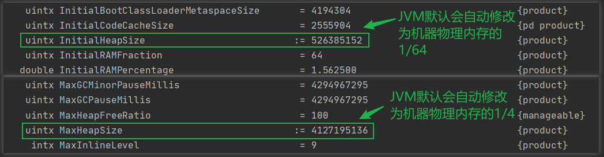

## 16.46 通过程序获得堆栈信息

**java 8的内存空间如下**：

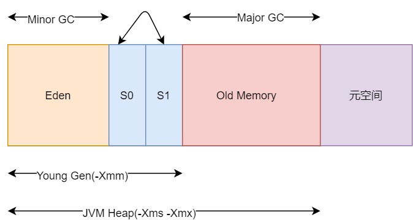

```java
// 通过程序获得堆栈信息
public class HelloGC {
    public static void main(String[] args) {
        // java虚拟机中的内存总量
        long totalMemory = Runtime.getRuntime().totalMemory();
        // java虚拟机试图使用的最大内存量
        long maxMemory = Runtime.getRuntime().maxMemory();
        System.out.println("TOTAL_MEMORY(-Xms)=" + totalMemory + "(字节)" + (totalMemory / 1024 / 2014) + "MB");
        System.out.println("MAX_MEMORY(-Xmx)=" + maxMemory + "(字节)" + (maxMemory / 1024 / 2014) + "MB");
    }
}
```

## 16.47 JVM常用的基本配置参数

**典型的配置**：`-Xms128m -Xmx4096m -Xss1024k -XX:MetaspaceSize=512m -XX:+PrintCommandLineFlags -XX:PrintGCDetails -XX:+UseSerialGC`

**常用的基础参数如下**：

- `-Xms`：等价于`-XX:InitialHeapSize`，初始大小堆内存，默认为物理内存1/64。
- `-Xmx`：等价于`-XX:MaxHeapSize`，最大分配堆内存，默认为物理内存1/4。
- `-XX:MaxDirectMemorySize`：最大本地直接内存大小，默认为0。
- `-Xss`：等价于`-XX:ThreadStackSize`，设置单个线程栈的大小，一般默认为512k~1024k，window下依赖于虚拟内存的大小。
- `-Xmn`：设置年轻代的大小，一般不需要调整(`年轻代:老年代=1:2`、年轻代中`Eden:S0:S1=8:1:1`）。
- `-XX:MetaspaceSize`：`-Xms10m -Xmx10m -XX:MetaspaceSize=1024m -XX:+PrintFlagsFinal`。
  - 元空间的本质和永久代类似，都是JVM规范中方法区的实现，不过元空间与永久代之间最大的区别在于：元空间并不在虚拟机中，而是使用本地内存。默认情况下，元空间的大小仅受本地内存限制。**不过，JVM给元空间设置的大小默认为21M左右**。
- `-XX:+PrintGCDetails`：输出详细GC收集日志信息。
- `-XX:SurvivorRatio`：设置年轻代中Eden区与Survivor的比例，默认为8。
- `-XX:NewRatio`：设置老年代与年轻代在堆中的比例，默认为2。
- `-XX:MaxTenuringThreshold`：设置年轻到到老年代的最大年龄，默认为15。

## 16.48 强/软/弱/虚引用的理解

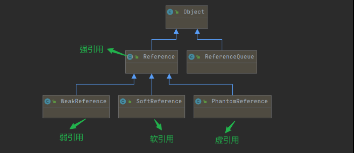

**强/软/弱/虚引用的理解**：

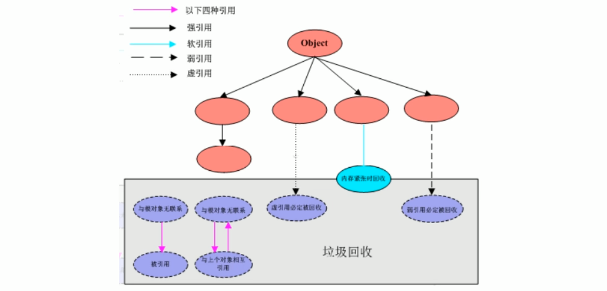

- **Reference（强引用）**：当内存不足，JVM开始垃圾回收；对于强引用的对象，就算是出现了OOM也不会对该对象进行回收，**死都不收**。强引用时造成Java内存泄漏的主要原因之一。
- **SoftReference（软引用）**：是一种相对强引用弱化了的引用，可以让对象豁免一些垃圾收集。**当系统内存充足时不会被回收，当系统内存不足时会回收**。软引用一般用作缓存（如MyBatis里的实现）。

- **WeakReference（弱引用）**：不管内存是否足够，**只要发生GC，就回收**。

- **PhantomReference（虚引用）**：顾名思义，虚引用即**形同虚设**，虚引用并不会决定对象的生命周期。

  - 如果一个对象仅持有虚引用，那么它就和没有任何引用一样，在任何时候都可能被垃圾回收器回收。
  - 虚引用不能单独使用，也不能通过它访问对象，**虚引用必须和引用队列（ReferenceQueue）联合使用**。
  - **虚引用的主要作用是跟踪对象被垃圾回收的状态。仅仅提供了一种确保对象被finalize以后，做某些事情的机制**。

  ```java
  // 比较new WeakReference<>(o1, referenceQueue)和new PhantomReference(o1, referenceQueue)的区别
  public class ReferenceQueueDemo {
      public static void main(String[] args) throws InterruptedException {
          Object o1 = new Object();
          ReferenceQueue<Object> referenceQueue = new ReferenceQueue<>();
          WeakReference<Object> weakReference = new WeakReference<>(o1, referenceQueue);
          System.out.println(o1); // java.lang.Object@330bedb4
          System.out.println(weakReference.get()); // java.lang.Object@330bedb4
          System.out.println(referenceQueue.poll()); // null
  
          System.out.println("==========");
          o1 = null;
          System.gc();
          Thread.sleep(500);
          System.out.println(o1); // null
          System.out.println(weakReference.get()); // null
          System.out.println(referenceQueue.poll()); // java.lang.ref.WeakReference@2503dbd3
      }
  }
  
  public class PhantomReferenceDemo {
      public static void main(String[] args) throws InterruptedException {
          Object o1 = new Object();
          ReferenceQueue<Object> referenceQueue = new ReferenceQueue<>();
          PhantomReference phantomReference = new PhantomReference(o1, referenceQueue);
          System.out.println(o1); // java.lang.Object@330bedb4
          System.out.println(phantomReference.get()); // null
          System.out.println(referenceQueue.poll()); // null
  
          System.out.println("===========");
  
          o1 = null;
          System.gc();
          Thread.sleep(500);
          System.out.println(o1); // null
          System.out.println(phantomReference.get()); // null
          System.out.println(referenceQueue.poll()); // java.lang.ref.PhantomReference@2503dbd3
      }
  }
  ```

**软引用/弱引用的使用场景**：假如有一个应用需要读取大量的本地图片，若每次都从硬盘读取会严重影响性能，而一次性全部加载到内存又可能造成内存溢出。此时可以使用软引用解决这个问题：**用一个HashMap来保存图片的路径和相应图片对象关联的软引用之间的映射关系，在内存不足时，JVM会自动回收这些缓存图片所占用的空间，从而有效地避免了OOM的问题**。

```java
Map<String,SoftReference<Bitmap>> imageCache = new HashMap<String, SoftReference<Bitmap>>();
```

## 16.49 关于WeakHashMap

**关于WeakHashMap**：

- WeakHashMap继承于AbstractMap，实现了Map接口。和HashMap一样，WeakHashMap 也是一个散列表，它存储的内容也是键值对(key-value)映射，而且键和值都可以是null。 
- 和HashMap一样，WeakHashMap是不同步的。可以使用 Collections.synchronizedMap 方法来构造同步的 WeakHashMap。
- 不过**WeakHashMap的键是"弱键"**，里面存放了键对象的弱引用，当某个键不再正常使用时，会从WeakHashMap中被自动移除。当一个键对象被垃圾回收，那么相应的值对象的引用会从Map中删除。WeakHashMap能够节约存储空间，可用来缓存那些非必须存在的数据。

**实现原理**：通过WeakReference和ReferenceQueue实现

1. 创建WeakHashMap，将"键-值对"添加到WeakHashMap中。实际上，WeakHashMap是通过数组table保存Entry(键值对)；每一个Entry实际上是一个单向链表，即Entry是键值对链表。
2. 当某"弱键"不再被其它对象引用，并被GC回收时。在GC回收该"弱键"时，这个"弱键"也同时会被添加到ReferenceQueue(queue)队列中。
3. 当下一次我们需要操作WeakHashMap时，会先同步table和queue。table中保存了全部的键值对，而queue中保存被GC回收的键值对；同步它们，就是删除table中被GC回收的键值对。 这就是"弱键"如何被自动从WeakHashMap中删除的步骤了。 

**WeakHashMap的使用**：

```java
public class WeakHashMapDemo {
    public static void main(String[] args) {
        myHashMap();
        System.out.println("===============");
        myWeakHashMap();
    }

    private static void myHashMap() {
        HashMap<Integer, String> map = new HashMap<>();
        Integer key = new Integer(1);
        String value = "HashMap";
        map.put(key, value);
        System.out.println(map); // {1=HashMap}

        key = null;
        System.out.println(map); // {1=HashMap}
        System.gc();
        System.out.println(map + "\t" + map.size()); // {1=HashMap}	1
    }

    private static void myWeakHashMap() {
        WeakHashMap<Integer, String> map = new WeakHashMap<>();
        Integer key = new Integer(1);
        Integer key2 = new Integer(2);
        String value = "WeakHashMap";
        String value2 = "WeakHashMap2";
        map.put(key, value);
        map.put(key2, value2);
        map.put(new Integer(3), "WeakHashMap3");
        System.out.println(map); // {3=WeakHashMap3, 2=WeakHashMap2, 1=WeakHashMap}

        key = null;
        System.out.println(map); // {3=WeakHashMap3, 2=WeakHashMap2, 1=WeakHashMap}

        System.gc();
        System.out.println(map + "\t" + map.size()); // {2=WeakHashMap2}	1
    }
}
```

## 16.50 关于OOM

**java的异常体系**：

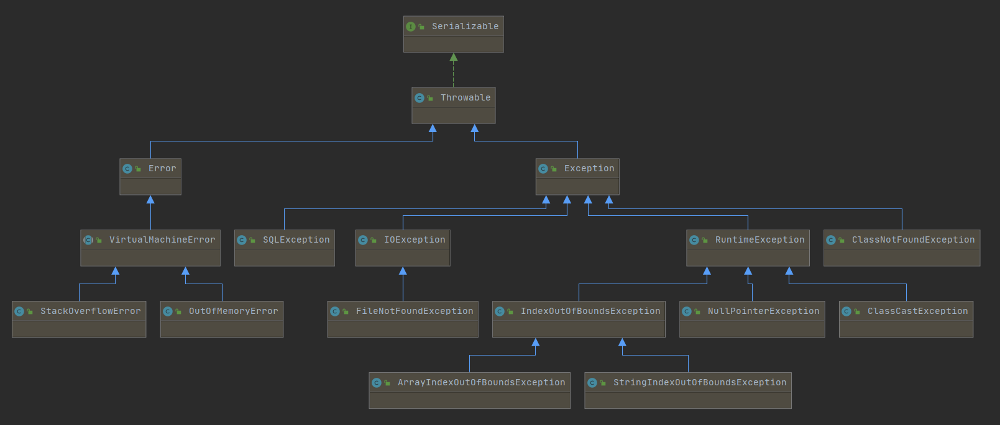

1. `java.lang.StackOverflowError`：栈内存溢出。

   ```java
   public class StackOverflowErrorDemo {
       public static void main(String[] args) {
           stackOverflowError();
       }
   
       private static void stackOverflowError() {
           stackOverflowError();
       }
   }
   ```

2. `java.lang.OutOfMemoryError: Java heap space`：堆内存溢出。

   ```java
   //-Xms10m -Xmx10m -XX:MaxDirectMemorySize=5m -XX:+PrintGCDetails
   public class JavaHeapSpaceDemo {
       public static void main(String[] args) {
           String str = "adf";
           while (true) {
               str += str + new Random().nextInt(1111111) + new Random().nextInt(222222);
               str.intern();
           }
       }
   }
   ```

3. `java.lang.OutOfMemoryError: GC overhead limit exceeded`：**GC回收时间过长**会抛出OutOfMemoryError。**过长的定义是超过98%的时间用来做GC，并且回收了不到2%的堆内存，连续多次GC都只回收了不到2%的极端情况下才会抛出**。假如不抛出GC overhead limit exceeded错误会发生什么情况呢？那就是GC清理的这么点内存很快就会再次填满，迫使GC再次执行，形成恶性循环。CPU的使用率一直是100%，而GC却没有任何成果。

   ```java
   //-Xms10m -Xmx10m -XX:MaxDirectMemorySize=5m -XX:+PrintGCDetails
   public class GCOverheadDemo {
       public static void main(String[] args) {
           int i = 0;
           List<String> list = new ArrayList<>();
           try {
   
               while (true) {
                   list.add(String.valueOf(++i).intern());
               }
           } catch (Exception e) {
               System.out.println("************i" + i);
               e.printStackTrace();
               throw e;
           }
       }
   }
   ```

4. `java.lang.OutOfMemoryError: Direct buffer memory`：直接内存溢出。

   ```java
   //-Xms10m -Xmx10m -XX:MaxDirectMemorySize=5m -XX:+PrintGCDetails
   public class DirectBufferMemoryDemo {
       public static void main(String[] args) {
           System.out.println("配置的maxDirectMemory: " + (sun.misc.VM.maxDirectMemory() / (double) 1024 / 1024) + "MB");
           try {
               Thread.sleep(300);
           } catch (Exception e) {
               e.printStackTrace();
           }
           ByteBuffer byteBuffer = ByteBuffer.allocateDirect(6 * 1024 * 1024);
       }
   }
   ```

5. `java.lang.OutOfMemoryError: unable to create new native thread`：高并发请求服务器时，经常出现该异常（准确地讲，native thread异常与对应的平台有关）。

   **导致的原因**：

   - 应用创建了太多线程，一个应用进程创建多个线程，超过了系统承载极限。
   - 服务器并不允许应用程序创建这么多线程，Linux系统默认允许单个进程可以创建的线程数是1024个。

   **解决办法**：

   - 降低应用程序创建线程的数量，分析应用是否真的需要创建这么多线程，如果不是，改代码将线程数降到最低。
   - 对于有的应用，确实需要创建很多线程，远超果Linux系统默认1024个线程的限制，可以通过修改Linux服务器配置，扩大Linux默认限制。

   ```java
   // 请再Linux下允许模拟该程序
   public class UnableCreateNewThreadDemo {
       public static void main(String[] args) {
           for (int i = 0; ; i++) {
               System.out.println("***********" + i);
               new Thread(() -> {
                   try {
                       Thread.sleep(Integer.MAX_VALUE);
                   } catch (InterruptedException e) {
                       e.printStackTrace();
                   }
               }, "" + i).start();
           }
       }
   }
   ```

6. `java.lang.reflect.InvocationTargetException`：元空间（主要存放：虚拟机加载的类信息、静态变量、即时编译后的代码）内存溢出。

   ```java
   // -XX:MetaspaceSize=8m -XX:MaxMetaspaceSize=20m
   public class MetaspaceOOMDemo {
       public static void main(String[] args) {
           // 模拟计数多少次以后发生异常
           int i = 0;
           try {
               while (true) {
                   i++;
                   Enhancer enhancer = new Enhancer();
                   enhancer.setSuperclass(OOMTest.class);
                   enhancer.setUseCache(false);
                   enhancer.setCallback(new MethodInterceptor() {
                       @Override
                       public Object intercept(Object o, Method method, Object[] objects, MethodProxy methodProxy) throws Throwable {
                           return methodProxy.invoke(o, args);
                       }
                   });
                   enhancer.create();
               }
           } catch (Throwable e) {
               System.out.println("********多少次后发生了异常：" + i);
               e.printStackTrace();
           }
       }
   
       static class OOMTest {
       }
   }
   ```

## 16.51 关于垃圾收集器

**垃圾回收算法与垃圾收集器的关系**：

GC算法（引用计数/复制/标记清除/标记整理）是内存回收的方法论，垃圾回收器就是算法的落地实现。因为目前为止还没有完美的收集器出现，更加没有万能的收集器，只是针对具体应用最合适的收集器。

**四种主要的垃圾收集器**：

- Serial：**串行**收集器，为单线程环境设计且只使用一个线程进行垃圾回收，会暂停所有的用户线程，所以不适合服务器环境。
- Parallel：**并行**收集器（默认），多个垃圾收集线程并行工作，此时用户线程是暂停的，适用于科学计算/大数据处理平台处理等弱交互场景。
- CMS：**并发标记清除**收集器，用户线程和垃圾收集线程同时执行（不一定是并行，可能交替执行），不需要停顿用户线程，互联网公司多用它，适用于对响应时间有要求的场景。
- Garbage First：**G1**收集器，将堆内存分割成不同的区域然后并发的对其进行垃圾回收。

**查看垃圾回收器的种类以及其他常见值**：`java -XX:+PrintCommandLineFlags -version`

**运行应用时指定垃圾回收器**：`java -XX:+UseParallelGC`

**运行应用后查看指定的垃圾回收器**：`jinfo -flag UserParallelGC 进程号`

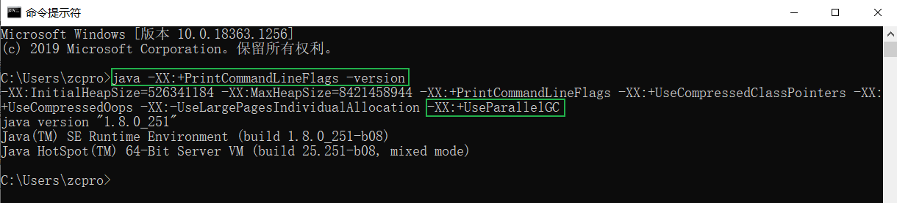

## 16.52 七大默认垃圾收集器

**参数说明**：

| 名称       | 解释                                                | 说明                   |
| ---------- | --------------------------------------------------- | ---------------------- |
| DefNew     | Default New Generation，**对应Serial收集器**        | 新生代串行回收         |
| Tenured    | Old，**对应Serial Old收集器**                       | 老年代串行回收         |
| ParNew     | Parallel New Generation，**对应Parallel收集器**     | 新生代并行回收         |
| PSYoungGen | Parallel Scavenge，**对应Parallel Scavenge收集器**  | 新生代吞吐量优先收集器 |
| ParOldGen  | Parallel Old Generation，**对应Parallel Old收集器** | 老年代并行回收         |

**Server/Client模式**：只需掌握Server模式，Client模式基本不会用。

- 32位Windows操作系统，不论硬件如何都默认使用Client的JVM模式。
- 32位其他操作系统，2G内存同时有2个CPU以上用Server模式，低于该配置还是Client模式。
- 64位操作系统只有Server模式。

**七大默认垃圾收集器**：若设置了新生代收集器，那么老年代收集器会自动选择关联。

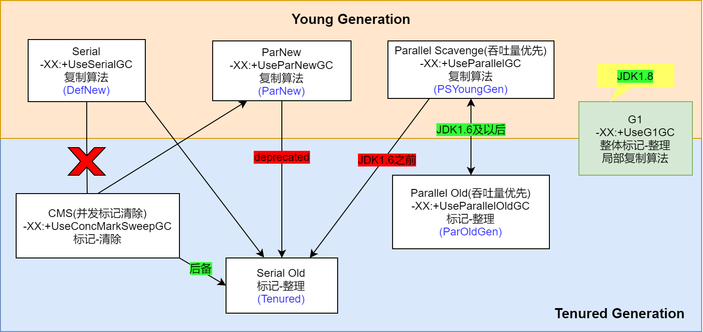

1. **Serial**：**串行收集器，用于新生代**。Serial收集器是最古老、最稳定以及效率最高的收集器，只使用一个线程去回收但其在进行垃圾收集过程中可能会产生较长的停顿（STW状态），虽然在收集过程中需要暂停所有其他工作线程，但是它简单高效，**对于限定单个CPU环境来说，没有线程交互的开销可以获得最高的单线程垃圾收集效率**。Serial收集器是java虚拟机运行在Client模式下默认的新生代垃圾收集器。

   - 对应的JVM参数：`-XX:+UseSerialGC`，开启后会使用Serial（Young区用）+Serial Old（Old区用）的收集器组合；表示新生代、老年代都会使用串行回收收集器，**新生代使用复制算法，老年代使用标记-整理算法**。

     ```java
     // DefNew+Tenured
     // -Xms10m -Xmx10m -XX:+PrintGCDetails -XX:+PrintCommandLineFlags -XX:+UseSerialGC
     ```

2. **ParNew**：**并行收集器，用于新生代**。**ParNew收集器是Serial收集器新生代的并行多线程版本**，最常见的应用场景是配合老年代的CMS收集器工作，其余的行为和Serial收集器完全一致，ParNew垃圾收集器在垃圾收集过程中同样也要暂停所有其他的工作线程。ParNew收集器是很多java虚拟机运行在Server模式下新生代的默认垃圾收集器。

   - 对应的JVM参数：`-XX:+UseParNewGC`，开启后会使用ParNew（Young区用）+Serial Old（Old区用），**新生代使用复制算法，老年代使用标记-整理算法**。ParNew（Young区用）+Serial Old（Old区用）is deprecated.

     ```java
     // ParNew+Tenured
     // -Xms10m -Xmx10m -XX:+PrintGCDetails -XX:+PrintCommandLineFlags -XX:+UseParNewGC
     ```

3. **Parallel Scavenge**：**并行收集器（吞吐量优先），用于新生代**。类似ParNew，使用复制算法，是一个并行的垃圾收集器，俗称吞吐量优先收集器。简言之，Parallel Scavenge是串行收集器在新生代和老年代的并行化。

   - 可控的吞吐量：`吞吐量=运行用户代码时间/(运行用户代码时间+垃圾收集时间)`，比如程序运行100分钟，垃圾收集器1分钟，吞吐量就是99%。高吞吐量一位置高效利用CPU的时间，多用于在后台运算而不需要太多交互的任务。

   - 自适应调节策略也是Parallel Scavenge收集器与ParNew收集器的一个重要区别。**自适应调节策略**：虚拟机会根据当前系统的运行情况收集性能监控信息，动态调整这些参数以提供最合适的停顿时间（`-XX:MaxGCPauseMillis`）或最大的吞吐量。

   - 对应的JVM参数：

     - `-XX:+UseParallelGC`或`-XX:+UseParallelOldGC`（可相互激活），开启后会使用Parallel Scavenge（Young区用）+Parallel Old（Old区用），**新生代采用复制算法，老年代采用标记整理算法**。
     - `-XX:ParallelGCThreads=数字N`表示启动多少个GC线程；CPU>8时，N=5/8，CPU<8时，N=CPU实际核数。

     ```java
     // PSYoungGen+ParOldGen
     // -Xms10m -Xmx10m -XX:+PrintGCDetails -XX:+PrintCommandLineFlags -XX:+UseParallelGC
     // -Xms10m -Xmx10m -XX:+PrintGCDetails -XX:+PrintCommandLineFlags -XX:+UseParallelOldGC
     ```

4. **Serial Old**：**串行收集器，用于老年代**。Serial Old是Serial垃圾收集器的老年代版本，同样是个单线程的收集器，使用**标记-整理**算法。

   - Client模式下，java虚拟机中默认的老年代垃圾收集器是Serial Old。
   - Server模式下，主要有两个用途（了解，版本已经到8及以后）
     - 在JDK1.5之前版本中与新生代的Parallel Scavenge收集器搭配使用，使用Parallel Scavenge（Young区）+Serial Old（Old区）。
     - 作为老年代中使用CMS收集器的后备垃圾收集方案。

5. **Parallel Old**：**并行收集器，用于老年代**。Parallel Old收集器是Parallel Scavenge的老年代版本，使用多线程的标记-整理算法，Parallel Old收集器在JDK1.6才开始提供。在JDK1.6之前，使用Parallel Scavenge（Young区）+Serial Old（Old区）。

   - Parallel Old正是为了在老年代同样提供吞吐量优先的垃圾收集器，如果系统对吞吐量要求比较高，JDK1.8后可以优先考虑新生代Parallel Scavenge和老年代Parallel Old收集器的搭配策略。在JDK1.8后，使用Parallel Scavenge（Young区）+Parallel Old（Old区）。

   - 对应的JVM参数：`-XX:+UseParallelOldGC`，开启后会使用Parallel Scavenge（Young区用）+Parallel Old（Old区用），**新生代采用复制算法，老年代采用标记整理算法**。

     ```java
     // PSYoungGen+ParOldGen
     // -Xms10m -Xmx10m -XX:+PrintGCDetails -XX:+PrintCommandLineFlags -XX:+UseParallelOldGC
     // -Xms10m -Xmx10m -XX:+PrintGCDetails -XX:+PrintCommandLineFlags -XX:+UseParallelGC
     ```

6. **CMS**：**CMS收集器**（Concurrent Mark Sweep：并发标记清除），**用于老年代**。CMS收集器是一种以获得最短回收停顿时间为目标的收集器，适合应用在互联网站或者B/S系统的服务器上，这类应用尤其重视服务器的响应速度，希望系统**停顿时间最短**。CMS非常适合堆内存大、CPU核数多的服务端应用，也是G1出现之前大型应用的首选收集器。

   - CMS垃圾收集分为4步：黑白灰三色标记法
     - 初始标记：STW，标记GC Roots能直接关联到的对象，速度很快。
     - 并发标记：不需要停顿，对图的遍历。
     - 重新标记：STW，停顿时间比初始标记长，但远比并发标记短，修正并发标记时因用户程序继续运行导致标记变动。
     - 并发清除：不需要停顿，清除掉标记阶段的已经死亡的对象。

   - 对应的JVM参数：

     - `-XX:+UseConcMarkSweepGC`：开启后会自动将`-XX:+UseParNewGC`打开，使用ParNew（Young区用）+CMS（Old区用）+Serial Old的收集器组合，Serial Old将作为CMS出错的后备收集器，**新生代采用复制算法，老年代采用标记清除算法**。
     - `-XX:CMSFullGCsBeforeCompaction`：默认为0，即每次都进行内存整理。该参数可以用来指定多少次CMS收集之后，再进行一次压缩的Full GC。

     ```java
     // ParNew+CMS+Tenured
     // -Xms10m -Xmx10m -XX:+PrintGCDetails -XX:+PrintCommandLineFlags -XX:+UseConcMarkSweepGC
     ```

   - CMS为什么可能会失败？由于并发标记，CMS在收集时会与用户线程同时进行，会增加对堆内存的占用，也就是说，CMS必须要在老年代堆内存用尽之前完成垃圾回收，否则CMS回收失败时，将触发担保机制，Serial Old收集器将会以STW的方式进行一次GC，从而造成较大停顿时间。

7. G1：Garbage First，**G1收集器，用于新生代+老年代**。一款面向服务端应用的收集器，在实现**高吞吐量**的同时，尽可能满足垃圾收集**暂停时间**的要求。**整体上采用标记整理算法，局部上采用复制算法**。

   - 以前收集器的特点：

     1. 年轻代和老年代是各自独立且连续的内存块（Youg(Eden:S0:S1=8:1:1):Old=1:2）。
     2. 年轻代收集使用单Eden+S0+S1进行复制算法。
     3. 老年代收集必须扫描整个老年代区域。
     4. 都是以尽可能少而快速地执行GC为设计原则。

   - **G1收集器的特点**：

     1. 与CMS一样，能与应用程序并发执行（**初始标记+并发标记+修正标记+筛选回收**）。
     2. 将堆内存划分为Region（最多设置2048个区域），每块大小在1M~32M。整理空闲空间更快，且**不会产生空间碎片**（小区域收集+形成连续的内存块）。
        - G1堆内存没有了Young区、Old区的物理隔离，但是在每个Region依然划分为Eden或Survior或Old或Humongous（逻辑上的分代概念），而这些区域不需要物理连续。
     3. 与预测和控制**指定停顿时间**。
     4. 高吞吐量性能。

   - 对应的JVM参数：

     - `-XX:+UseG1GC`：开启G1收集器。

     - `-XX:G1HeapRegionSize=n`：设置G1收集器Region的大小，值是2的幂，范围为1MB~32MB。目标是根据最小的java堆大小划分为出约2048个区域。
     - `-XX:MaxGCPauseMillis=n`：最大GC停顿时间，这是个软目标，JVM将尽可能（但不保证）停顿小于这个时间。
     - `-XX:InitiatingHeapOccupancyPercent=n`：堆占用了多少的时候就触发GC，默认为45。
     - `-XX:ConcGCThreads=n`：并发GC使用的线程数。
     - `-XX:G1ReservePercent=n`：设置作为空闲空间的预留内存百分比，以降低目标空间溢出的风险，默认值是10。

     ```java
     // G1
     // -Xmx32g -XX:+PrintGCDetails -XX:+PrintCommandLineFlags -XX:+UseG1GC -XX:MaxGCPauseMillis=100
     ```

   - **G1相比CMS的优势**：

     - 化整为零，避免全内存扫描，只需要按照区域来进行扫描即可；且**不会产生内存碎片**。

     - G1可精确控制停顿，该收集器是把整个堆（新生代、老年代）划分成多个固定大小的区域，每次根据允许停顿的时间去收集垃圾最多的区域。

**如何选择垃圾收集器？**

- 组合的选择：
  - 单CPU或小内存，单机程序：`-XX:+UseSerialGC`
  - 多CPU，需要最大吞吐量，如后台计算型应用：`-XX:+UseParallelGC`或`-XX:UseParallelOldGC`
  - 多CPU，追求低停顿时间，需快速响应如互联网应用：`-XX:+UseConcMarkSweepGC`+`-XX:+ParNewGC`

|                        参数                        | 新生代垃圾收集器  |        新生代算法        |    老年代垃圾收集器    |        老年代算法         |
| :------------------------------------------------: | :---------------: | :----------------------: | :--------------------: | :-----------------------: |
|                 `-XX:UseSerialGC`                  |      Serial       |           复制           |       Serial Old       |         标记整理          |
|                 `-XX:+UseParNewGC`                 |      ParNew       |           复制           |       Serial Old       |         标记整理          |
| `-XX:+UseParallelGC`/<br />`-XX:+UseParallelOldGC` | Parallel Scavenge |           复制           |      Parallel Old      |         标记整理          |
|             `-XX:+UseConcMarkSweepGC`              |      ParNew       |           复制           | CMS+Serial Old（后备） | 标记清除+标记整理（后备） |
|                   `-XX:+UseG1GC`                   |  整体上标记整理   | 局部复制（避免内存碎片） |                        |                           |

## 16.53 JVM项目调优

可以使用Undertow来代替Tomcat，使用JMeter进行高并发压力测试。

```java
// 使用war或jar包测试
// java -jar -Xms1024m -Xmx1024m -XX:+UseG1GC xxxx.war
```

## 16.54 生产环境服务器变慢，诊断思路和性能评估？

生产环境服务器变慢，诊断思路和性能评估？

1. 整机：
   - `top`：可查看进程号，程序占用CPU、内存大小，以及系统负载率。
   - `uptime`：top的精简版。

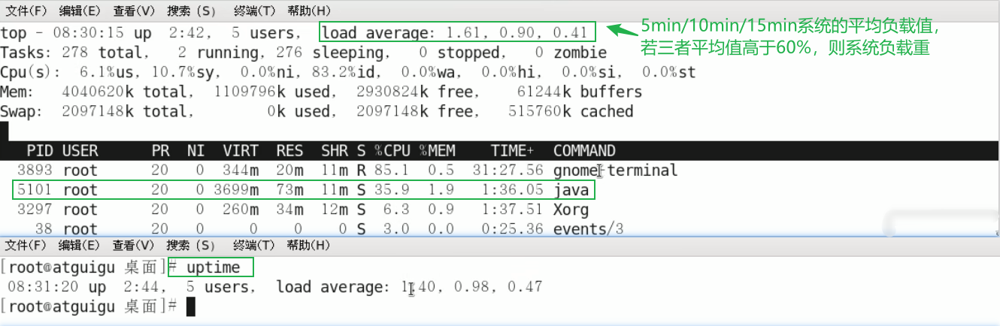

2. CPU：
   - `vmstat -n 2 3`：每2秒采集一次，共计采样3次。
   - `mpstat -P ALL 2`：查看所有CPU核的信息。
   - `pidstat -u 1 -p 进程编号`：每个进程使用CPU的用量分解信息。

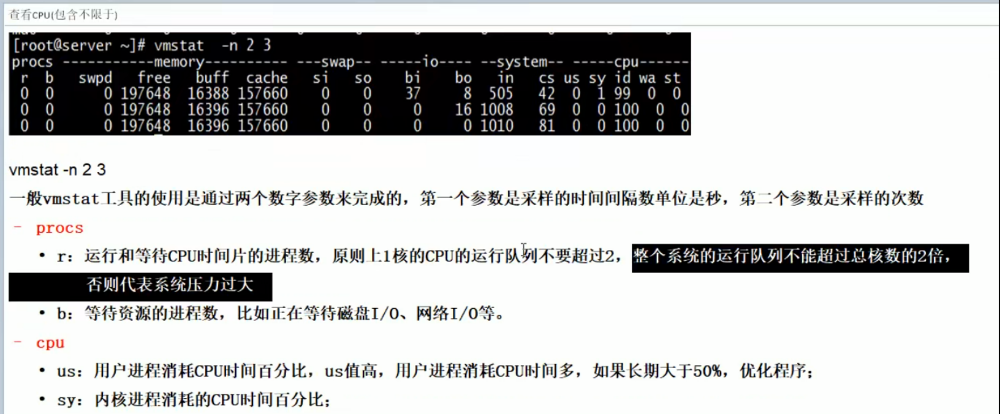

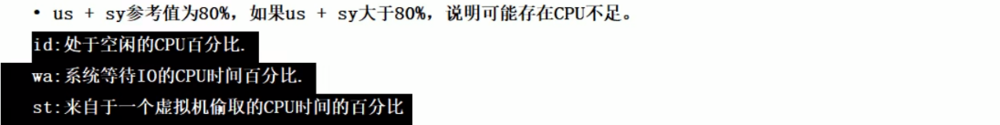

3. 内存：

   - `free`

   - `free -g`

   - `free -m`

     ```yaml
     # 应用程序可用内存/系统物理内存>70%内存充足
     # 应用程序可用内存/系统物理内存<20%内存不足，需要增加内存
     # 20%<应用程序可用内存/系统物理内存<70%
     ```

   - `pidstat -p 进程号 -r 采样间隔秒数`：查看进程所占内存信息。

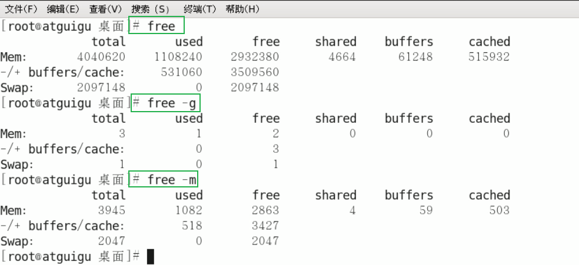

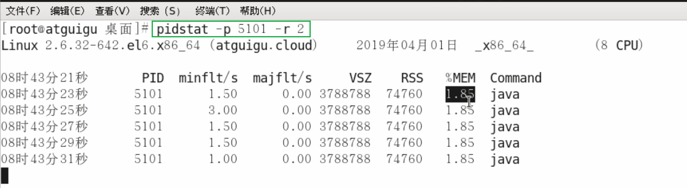

4. 硬盘
   - `df`：查看磁盘剩余空间数。
   - `df -h`：查看磁盘剩余空间数，更加友好。


5. 磁盘IO
   - `iostat -xdk 2 3`：磁盘IO性能评估。
   - `pidstat -d 采用间隔秒数 -p 进程号`：磁盘IO性能评估。

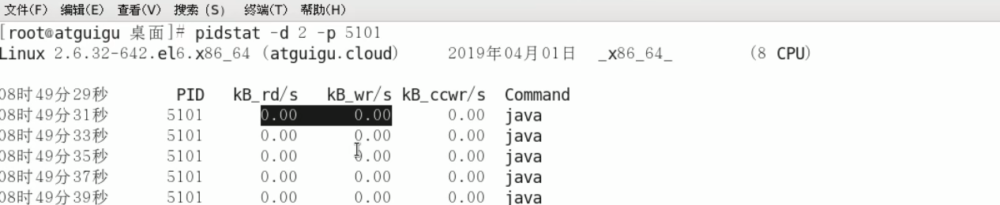

6. 网络IO
   - `ifstat 1`：需要先安装ifstat。

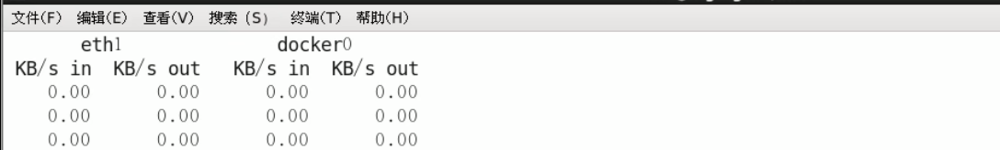

## 16.55 CPU占用过高的定位分析思路

**Linux怎么查找哪个线程使用的CPU时间最长**？

1. 找出cpu耗用厉害的进程pid：`top`，然后按下shift+p查找出cpu利用最厉害的pid号
2. 根据上面第一步拿到的pid号：`top -H -p pid号`。然后按下shift+p，查找出cpu利用率最厉害的线程号
3. 将获取到的线程号（10进制）转换成小写16进制
4. 使用jstack定位哪段代码出了问题：`jstack 进程ID|grep 16进制线程ID小写英文 -A60`

**CPU占用过高怎么解决**？

结合Linux和JDK命令一起分析。

1. 先用`top`命令找出CPU占比最高的进程号。
2. 使用`ps -ef|grep java|grep -v grep`或者`jps -l`进一步定位，得知是怎么样的一个后台程序出问题了。
3. 使用`ps -mp 进程号 -o THREAD,tid,time`定位到具体的线程。
   - -m显示所有的线程
   - -p pid进程使用CPU的时间
   - -o 该参数后是用户自定义格式
4. 将需要的线程ID转换为16进制格式（英文小写格式）。
5. `jstack 进程ID|grep 16进制线程ID小写英文 -A60`，定位具体哪段代码出了问题。

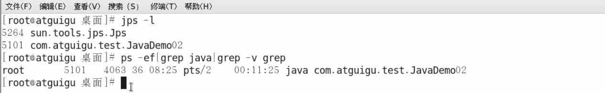

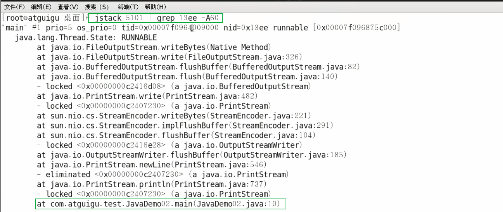

## 16.56 JVM监控和性能分析工具

JDK自带的JVM监控和性能分析工具有哪些？一般你是怎么用的。

1. jps：虚拟机进程状况工具。
2. jinfo：Java配置信息工具。
3. jmap：内存映像工具（使用MAT工具查看内存映像）。
4. jstat：统计信息监控工具。
5. jstack：堆栈异常跟踪工具。
6. jvisualvm:
7. jconsole：

## 16.57 如何利用GitHub检索

出问题了检索工具：Google+StackOverFlow+Github

**常用词**：

- watch：会持续收到该项目的动态。
- fork：复制某个项目到自己的Github仓库中。
- star：可以理解为点赞。
- clone：将项目下载至本地。
- follow：关注你感兴趣的作者，会受到它们的动态。

**in关键词限制搜素范围**：`xxx关键词 in:name或description或readme`

- 查找名称和readme中包含seckill的项目：`seckill in:name,readme`

**stars或fork数量关键词查询**：`xxx关键词 stars 通配符`

- 查找stars数大于等于5000的SpringBoot项目：`SpringBoot stars:>=5000`
- 查找forks数大于500的SpringCloud项目：`SpringCloud forks:>500`

- 查找forks数在100到200之间并且stars数在80到100之间的SpringBoot项目：`SpringBoot forks:100..200 stars:80..100`

**awesome加强搜素**：`awesome xxx关键词`，一般用来收集学习、工具、书籍类相关的项目。

- 搜素优秀的redis相关的项目，包括框架、教程：`awesome redis`

**高亮显示某一行代码**：

- 一行：地址后面紧跟#L数字
- 多行：地址后面紧跟#L数字-L数字

**项目内搜索**：英文t

- Github快捷键查看：https://docs.github.com/en/free-pro-team@latest/github/getting-started-with-github/keyboard-shortcuts

**搜索某个地区内的大佬**：`location:地名 language:编程语言`

- 北京地区的Java方向的用户：`location:beijing language:java`

## 16.58 String.intern()返回引用

*此面试题出自《深入理解Java虚拟机》*

**String::intern()**是一个本地方法，它的作用是如果字符串常量池中已经包含一个等于此String对象的字符串，则返回代表池中这个字符串的String对象的引用；否则，会将此String对象包含的字符串添加到常量池中，并返回此String对象的引用。

```java
public class StringPoolDemo {
    public static void main(String[] args) {
        String str1 = new StringBuilder("ja").append("va").toString();
        System.out.println(str1.intern() == str1); // JDK1.6：false；JDK1.7及以上：false

        String str2 = new StringBuilder("软件").append("工程").toString();
        System.out.println(str2.intern() == str2); // JDK1.6: false; JDK1.7及以上：true
        String str3 = new String(new StringBuilder("物联网").append("工程").toString());
        System.out.println(str3.intern() == str3); // JDK1.6: false; JDK1.7及以上：true
        String str4 = new String("物联网");
        System.out.println(str4.intern() == str4); // JDK1.6: false; JDK1.7及以上：false
    }
}
```

- 在JDK1.6中，intern()方法会将**首次遇到**的**字符串实例**复制到永久代的字符串常量池中存储，返回的也是永久代里面这个字符串实例的引用，而由StringBuilder创建的字符串对象实例在Java堆上，所以必然不可能是同一个引用。
  - str2.intern() == str2的结果为什么为false，这里可以这么看，在"软件工程"这个对象构建完成之后，常量池里面其实存放的只有"软件","工程"这两个字符串，而"软件工程"这个字符串是存放于堆内存中的。JDK1.6执行了intern后会把"软件工程"复制到常量池中，并返回常量池中的对象。常量池中的"软件工程"跟堆内存中的软件工程并不是同一个。
- 在JDK1.7及以上中，intern()方法不需要拷贝字符串的实例到永久代了，既然字符串常量池已经移到堆中，那只需要在常量池里记录一下**首次出现的实例引用**即可，因此intern()方法返回的引用和由StringBuilder创建的那个字符串实例就是同一个。
  - str4直接用new String("物联网")创建，"物联网"这字符串在一出现就自动创建成对象存放到常量池中，所以常量池里面存放的是"物联网"字符串的引用，并不是str4创建的对象的引用。
  - str2是通过StringBuilder构建的，在new StringBuilder("软件").append("工程").toString方法运行后,"软件工程"这个字符串对象才第一次出现。执行了intern方法后str5才被放到常量池中，此时str2跟str2.intern是同一个对象。
  - str3是作为对照组出现，这里为了确认StringBuilder在toString方法执行后会不会把最终字符串放进常量池。很显然并没有，所以str3的intern才会跟str3是同一个对象。同时它也能验证出str4的new String()方式在初始化的时候就会把"物联网"字符串放进常量池中，同理我们可以得出在str2构建的时候常量池里面加入了"软件"、"工程"这两个字符串。
- 至于，JDK1.7中对`str1.intern() == str1`返回false，这是因为"java"这个字符串在执行StringBuilder.toString()之前就已经出现过了（**它是在加载`sun.misc.Version`这个类时进入常量池的**），字符串常量池中已经有它的引用，不符合intern()方法要求的"首次遇到"的原则。

## 16.59 LockSupport

**可重入锁**：同一个线程可以多次获得同一把锁。

**LockSupport**：是用来创建锁和其他同步类的基本线程阻塞原语。**相当于线程等待唤醒机制（wait/notify）的加强改良版**。

- park()：作用是阻塞线程（**消耗凭证，消耗不到凭证就会阻塞**）。
- unpark()：解除线程阻塞（**发放凭证，相当于通知唤醒**）。

**三种让线程等待和唤醒的方法**：

1. 使用Object中的wait()方法让线程等待，使用Object中的notify()方法唤醒线程。

   - wait方法和notify方法，两个都去掉同步代码块，会出现`java.lang.IllegalMonitorStateException`异常。**Object类中的wait、notify、notifyAll用于线程等待和唤醒的方法，都必须在synchronized内部执行，必须用到关键字synchronized**。
   - 将notify放到wait方法前面，程序无法唤醒**。先wait后notify、notifyAll方法，等待中的线程才会被唤醒，否则无法唤醒**。

2. 使用JUC包中的Condition的await()方法让线程等待，使用signal()方法唤醒线程（**lcok与synchronized有相同的局限性**）。

   - 线程要先获得并持有锁，必须在锁块（lock）中。
   - 必须要先等待后唤醒，线程才能够被唤醒。

3. LockSupport类可以阻塞当前线程以及唤醒指定被阻塞的线程。

   - LockSupport类使用了一种名为Permit（许可）的概念来做到阻塞和唤醒线程的功能，每个线程都有一个许可（permit），permit只有两个值1和0，默认是0。可以把许可看成是一种(0,1)信号量（Semaphore），但与Semaphore不同的是，许可的累加上限是1。

   ```java
   // 通知可以在阻塞前，这时阻塞会失效
   private static void lockSupportPackUnpack() {
       Thread a = new Thread(() -> {
           try {
               TimeUnit.SECONDS.sleep(3L);
           } catch (InterruptedException e) {
               e.printStackTrace();
           }
           System.out.println(Thread.currentThread().getName() + "\t" + "-----come in");
           LockSupport.park(); // 被阻塞，等待通知等待放行，需要通过需要许可证
           System.out.println(Thread.currentThread().getName() + "\t" + "-----被唤醒");
       }, "a");
       a.start();
   
       Thread b = new Thread(() -> {
           LockSupport.unpark(a);
           System.out.println(Thread.currentThread().getName() + "\t" + "-----通知了");
       }, "b");
       b.start();
   }
   ```

**为什么LockSupport可以先唤醒线程后阻塞线程**？

- unpark获得了一个凭证，之后再调用park方法，就可以名正言顺的凭证消费，故不会阻塞。

**为什么唤醒两次后阻塞两次，但最终结果还会阻塞线程**？

- 凭证的数量最多为1，连读调用两次unpark和调用一次unpark效果一样，只会增加一个凭证；而调用两次park却需要消费两个凭证，证不够，不能放行。

## 16.60 AQS(AbstractQueuedSynchronizer)

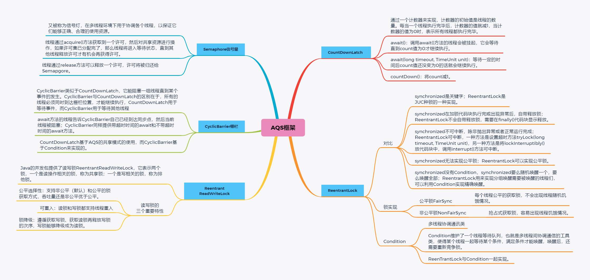

**AQS**：即AbstractQueuedSynchronizer，抽象的队列同步器。AQS是用来**构建锁或者其他同步器组件**的重量级基础框架及整个JUC体系的**基石**，通过内置的FIFO队列来完成资源获取线程的排队工作，并通过一个**int类型变量**表示持有锁的状态。

**AQS为什么是JUC内容中最重要的基石**？

- **和AQS有关的锁**：ReentrantLock、CountDownLatch、ReentrantReadWriteLock、Semaphore...
- **锁和AQS**：
  - 锁是面向锁的**使用者**，使用者定义了程序员和锁交互的使用层API，隐藏了实现细节，程序元只需调用即可。
  - AQS是面向锁的**实现者**，实现者提出统一的规范并简化了锁的实现，屏蔽了同步状态管理、阻塞线程排队和通知、唤醒机制等。

**AQS的工作原理**：底层结构是**int变量+双向的CLH队列**

- 抢到资源的线程直接使用处理业务逻辑，抢不到资源的必然涉及一种排队等候机制，抢占资源失败的线程继续去等待，但等候线程仍然保留获取锁的可能且获取锁的流程仍在继续。
- 若共享资源被占用，就需要一定的阻塞等待唤醒机制来保证锁分配，这个机制主要用的是CLH队列的变体实现的，将暂时获取不到锁的线程加入到队列中，这个队列就是AQS的抽象表现，它将请求共享资源的线程封装成**FIFO队列的结点（Node）**，通过**CAS**、**自旋**以及**LockSupport.park()**的方式，维护**state**变量（volatile的int变量）的状态，使并发达到同步的控制效果。

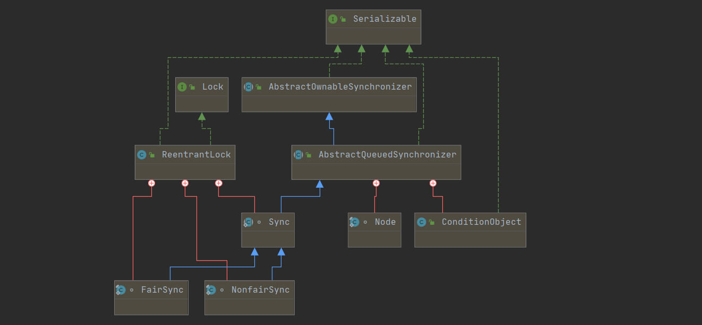

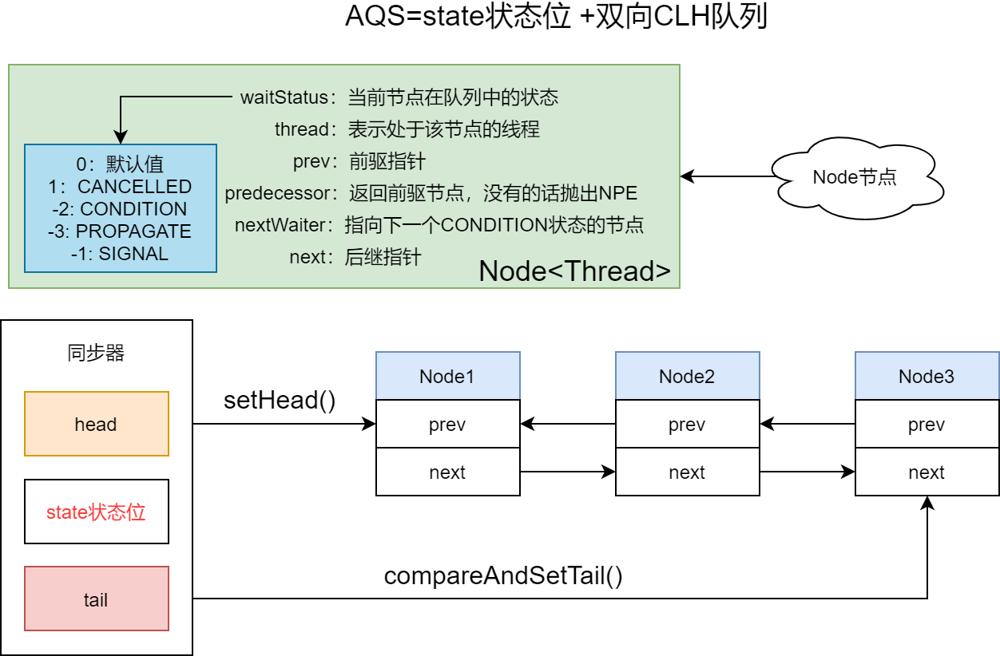

## 16.61 Spring AOP顺序

Sring=IOC+AOP+TX

**关于版本**：SpringBoot1(Spring4)-->SpringBoot2(Spring5)

**AOP的常用注解**： 

- @Before：前置通知（目标方法之前执行）。
- @After：后置通知（目标方法之后执行（始终执行））。
- @AfterReturning：返回后通知（执行方法结束前执行，异常不执行）。
- @AfterThrowing：异常通知（出现异常时候执行）。
- @Around：环绕通知（环绕目标方法执行）。

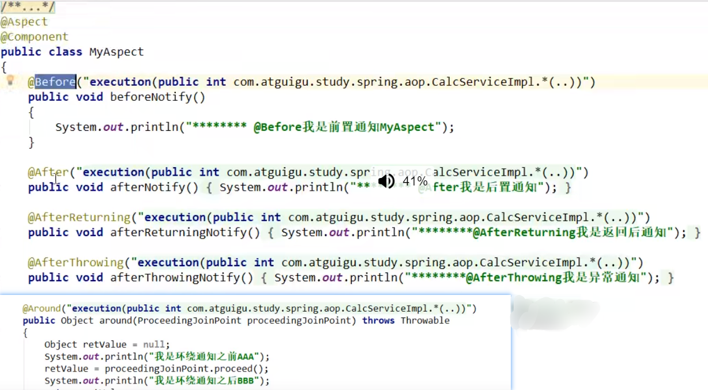

**执行顺序**：

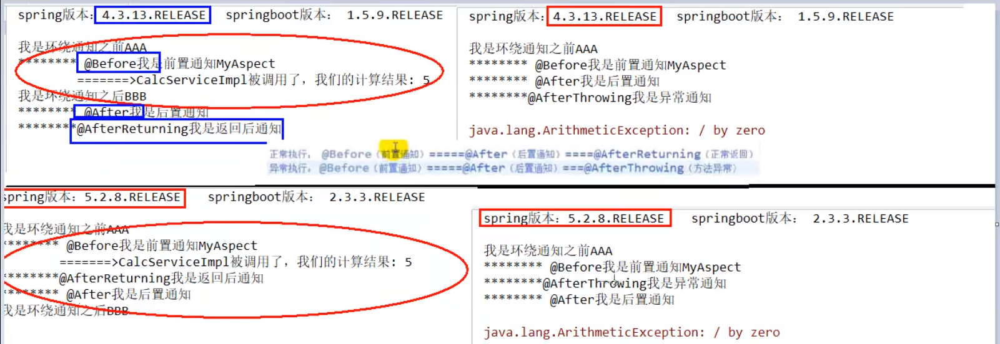

- Spring4

  ````java
  //正常执行：@Around(环绕通知)-->@Before(前置通知)-->业务逻辑-->@Around环绕通知-->@After后置通知-->@AfterReturning(返回后通知)
  //异常执行：@Around(环绕通知)-->@Before(前置通知)-->业务逻辑-->@After后置通知-->@AfterThrowing(异常通知)
  ````

- Spring5

  ```java
  //正常执行：@Around(环绕通知)-->@Before(前置通知)-->业务逻辑-->@AfterReturning(返回后通知)-->@After后置通知-->@Around环绕通知
  //异常执行：@Around(环绕通知)-->@Before(前置通知)-->业务逻辑-->@AfterThrowing(异常通知)-->@After后置通知
  ```

## 16.62 Spring循环依赖

**循环依赖**：多个Bean之间相互依赖，形成了一个闭环，比如：A依赖于B、B依赖于C、C依赖于A。

**两种注入方式对循环依赖的影响**：

- **构造注入**可能产生循环依赖问题
- **setter注入**则没有循环依赖问题

**Spring中的循环的问题**：

- 默认的单例（singleton）的场景是支持循环依赖的，不会报错。
- 原型（Prototype）的场景是不支持循环依赖的，会报错（`BeanCurrentlyInCreationException`）。

**问题解决**：Spring内部是通过**三级缓存**来解决循环依赖问题的。只有单例的Bean才会通过三级缓存提前暴露来解决循环依赖的问题；而非单例的Bean，每次从容器中获取都是一个新的对象，都会重新创建，所以非单例的Bean是没有缓存的，不会将其放到三级缓存中。

- **第一级缓存（单例池）singletonObjects**：存放已经经历了完整生命周期的Bean对象。
- **第二级缓存earlySingletonObjects**：存放早期暴露出来的Bean对象，Bean的生命周期未结束（属性还未填充完毕）。
- **第三季缓存singletonFactories**：存放可以生成Bean的工厂。

**单例模式下，AB循环依赖解决的运行过程**：

1. A创建过程中需要B，于是A将自己放到三级缓存里面，去实例化B。
2. B实例化的时候发现需要A，于是B先查一级缓存，没有，再查二级缓存，还是没有，再查三级缓存，找到了A然后把三级缓存里面的这个A放到二级缓存里面，并删除三级缓存里面的A。
3. B顺序初始化完毕，将自己放到一级缓存里面（此时B里面的A依然是创建中状态），然后回来接着创建A，此时B已经创建结束，直接从一级缓存里面拿到B，然后完成创建，并将A自己放到一级缓存里面。

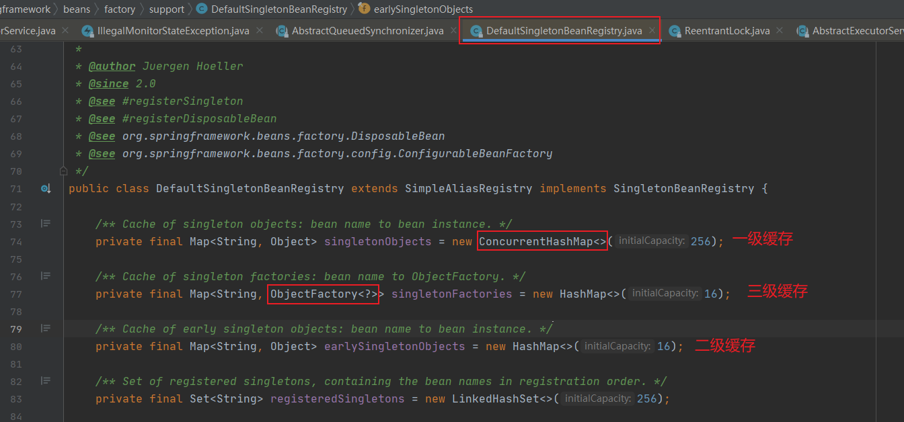

## 16.63 Redis的落地应用

**查看Redis的版本**：

- Linux下：`redis- server -v`。
- 进入到Redis后：`info`。

**Redis的数据类型**：String、List、Hash、Set、Zset、Bitmap、HyperLogLog、Geo、Stream。

**注意事项**：

- Redis命令不区分大小写，而key是区分大小写的。
- 查看具体命令的用法：`help @命令名称`（例`help @string`）。

**主要应用**：

1. String：
   - 分布式锁：`setnx key value`、`set key value [EX seconds] [PX milliseconds] [NX|XX]`（实际项目中会使用**[redisson](https://github.com/redisson/redisson)**）
   - 商品编号、订单号采用INCR命令生成。
   - 喜欢的文章、阅读量。

2. Hash：存储商品信息。

3. List：微信文章订阅公众号。
4. Set：
   - 微信抽奖小程序。
   - 微信朋友圈点赞。
   - 微博好友的关注社交关系。
   - QQ内堆可能认识的人。

5. Zset：
   - 根据商品销售对商品进行排序显示。
   - 抖音热搜。

## 16.64 Redis分布式锁

**单机版的锁**：JVM层面的锁。

**分布式锁**：分布式微服务架构拆分后，各个微服务之间为了避免冲突和数据故障而加入的一种锁。

**分布式锁的实现**：一般互联网公司习惯用Redis做分布式锁（redisson）。

- MySQL
- Zookeeper
- Redis

**解决方案的Bug**：

1. 加synchronized、ReentrantLock，前者不见不散，后者可以做到过期不候。使用**JMeter**进压力测试，单机锁无法解决超卖问题（若是电商）。

2. 使用redis的`SETNX`命令可以创建分布式锁：

   - 加锁：`# SET key value [EX seconds|PX milliseconds|KEEPTTL] [NX|XX] [GET]`

   - 解锁：使用Lua脚本（来自于[Redis官网](https://redis.io/commands/set)）

     ```lua
     if redis.call("get",KEYS[1]) == ARGV[1]
     then
         return redis.call("del",KEYS[1])
     else
         return 0
     end
     ```

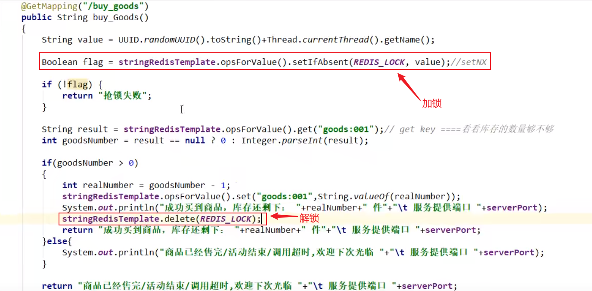

3. 方案二如果出异常的话，可能无法释放锁，必须要在代码层面finally释放锁。

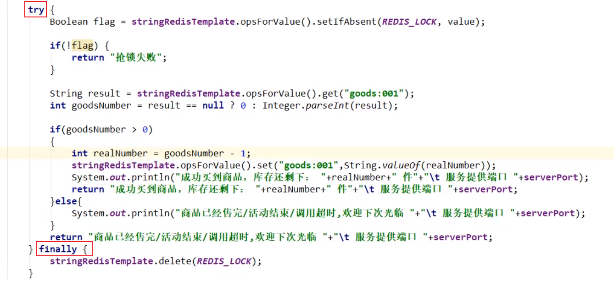

4. 若方案三在finally块前宕机了怎么办？解决方案是**对加减锁有过期时间的设定**。


5. 方案四的问题在于设置锁以及给锁添加过期时间这两个步骤合起来并**不具备原子性**。


6. 方案五的问题在于，若业务执行时间超过key设定的过期时间，就会导致**张冠李戴，删除了别了的锁**。解决方案是**删除锁前先判断**。

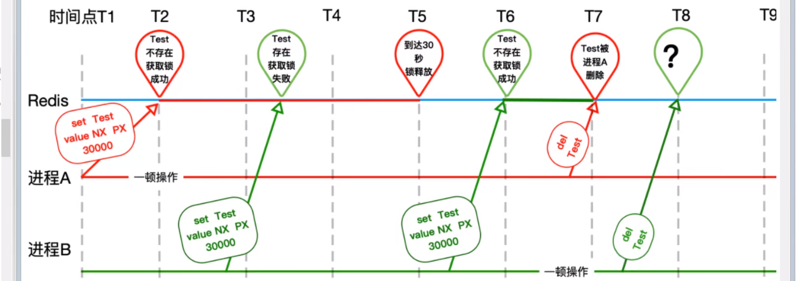

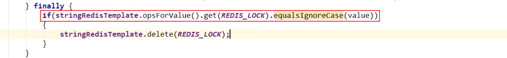

7. 方案六的问题在于：finally块的判断+del解锁不是一个原子性的操作，可能会导致误解锁。解决方案是使用**Lua脚本**（天生是原子性的）解锁或使用**redis事务（MULTI、EXEC、DISCARD、WATCH）**。

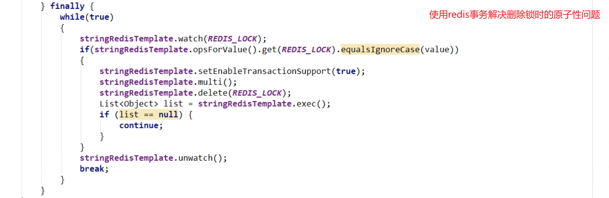

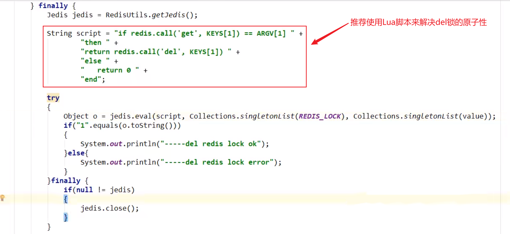

8. 方案七的问题一在于缓存的生命周期设置为10s，**无法确保redisLock过期时间大于业务执行时间的问题**；问题二在于**redis异步复制（redis集群基于AP思想）可能会造成锁的丢失**（主节点没来得及把刚刚set进来的这条数据给从节点，就宕机了）。Redis分布式锁如何实现续期？**可以采用RedLock之Redisson落地实现**。
   - CAP：Zookeeper是基于CP思想（**为了保证数据一致性牺牲了高可用**）、Redis集群基于AP思想（**为了保证高可用牺牲了数据的一致性**）。
     - C(Consistency，表示**选择一致性**)：为了保证数据库的一致性，我们必须等待失去联系的节点恢复过来，在这个过程中，那个节点是不允许对外提供服务的，这时候系统处于不可用状态(失去了A属性))。
     - A(Availability，表示**选择可用性**)：那个失去联系的节点依然可以向系统提供服务，不过它的数据就不能保证是同步的了（失去了C属性）。
     - P(Partition，表示分**布式系统**)：在分布式环境中，由于网络的问题可能导致某个节点和其它节点失去联系，这时候就形成了P(Partition)，也就是由于网络问题，将系统的成员隔离成了2个区域，互相无法知道对方的状态，这在分布式环境下是非常常见的。

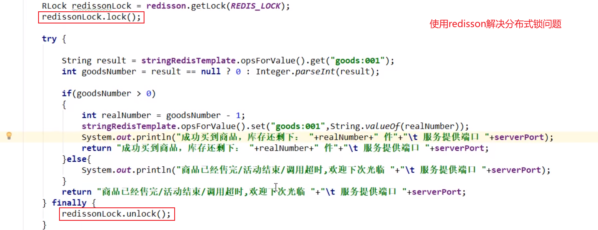

9. 方案八的问题在于程序的健壮性。若解锁的时候线程不是同一个，并且锁的状态变得不持有，就会出现`IllegalMonitorStateException`异常。解决办法是加2层判断。

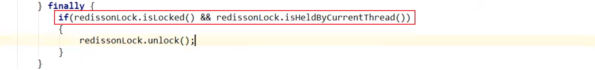

## 16.65 Redis内存淘汰策略

**redis默认内存是多少**？**在哪里查看及如何设置修改**？**内存设置为多大合适**？

- 默认内存：若未设置内存大小或者设置了最大内存大小为0，在64位操作系统下不限制内存大小，在32位操作系统下最多使用3GB内存。
- 设置内存大小：
  - 在`redis.config`配置文件中：设置maxmemory参数，maxmemory是bytes字节类型，注意转换。
  - 使用命令行设置：`config set maxmemory 字节数`，查看设置的内存大小：`config get maxmemory`。
  - 使用`info memory`可以查询redis内存相关信息。
- 一般推荐redis设置内存为最大物理内存的四分之三（类似于HashMap的负载因子为0.75）。


**redis内存打满了怎么办（若redis内存使用超出了设置的最大值会怎么样）**?**怎么避免出现内存打满**？

redis内存打满后**会出现OOM**。

- 尽量只将热点数据存储在redis中。
- 设置最大内存和缓存淘汰策略。


**三种不同的删除策略如下**：若一个键是过期的，那么到了过期时间后键并不会立即就从内存中被删除。

1. **定时删除**：为key设置过期时间，到期立即删除。
   
   - 能保证内存中数据的最大新鲜度，但是对CPU不友好（会产生大量的性能消耗，同时也会影响数据的读取操作），用处理器性能换取存储时间（拿时间换空间）。
   
2. **惰性删除**：数据到达过期时间，不做处理；等下次访问该数据时，若未过期，返回数据，若发现已经过期，删除并返回不存在；若过期后一直未访问，过期数据会一直滞留在内存中，产生类似于"内存泄漏"的问题。
   
- 惰性删除对memory不友好，用存储空间换取CPU性能（拿空间换时间）。
  
3. **定期删除**：是定时删除和惰性删除的折衷，每隔一段时间执行一次删除过期键（随机抽样）操作，难点在于如何确定删除操作执行的**时长**和**频率**来减少删除操作对CPU时间的影响。
   
   ```sql
   -- 配置Redis定期删除的频率：每秒执行10次
   hz 10
   -- 执行过程如下
   -- 1. 在 Redis 启动的时候读取配置文件 hz 的值，默认为 10
   -- 2. 每秒执行 hz 次，
   ----a. 每次执行会一次执行：serverCron()--> databaseCron()--> activeExpireCyle()三个函数
   -- 3. activeExpireCyle() 对每个 expires[*]（过期库，*代表对应的数据库，一共0~15个，每一个过期库都会和 Redis 的数据库对应）进行逐一检查，每次执行250ms/hz，默认情况就是 25ms
   -- 4. 对某个expires[*]检测时，随机挑选 N（默认 20）个key检查
   ----a. 如果key超时，删除 key
   ----b. 如果一轮中删除的 key 的数量>N*25%，循环该过程
   ----c. 如果一轮中删除的 key 的数量<N*25%，检查下一个expires[*]
   ```
   
   - 定期**抽样**key，判断是否过期（过期就删除），存在"漏网之鱼"。

总结：Redis采用的是**惰性删除+定期删除**两种策略结合使用。

**为了解决三种删除策略的弊端，redis引入了缓存淘汰策略**：逐出算法（LRU/LFU/Random/TTL）

redis缓存策略：在`redis.config`配置文件中设置`maxmemory-policy 淘汰策略`，默认的淘汰策略是`noeviction`，生产上一般使用`allkeys-lru`。总结：**两个维度**（过期键中筛选和所有键中筛选）以及**四个方面**（lru、lfu、random、ttl）

1. noeviction：不会驱逐任何key（默认）。
2. volatile-ttl：删除马上要过期的key。
3. **allkeys-lru**：对所有key使用**LRU算法（Least Recently Used最近最少使用，针对时间）**进行删除。
4. volatile-lru；对所有设置了过期时间的key使用**LRU算法（Least Recently Used最近最少使用，针对时间）**进行删除。
5. allkeys-random：对所有key随机删除。
6. volatile-random：对所有设置了过期时间的key随机删除。
7. allkeys-lfu：对所有key使用**LFU算法（Least Frequently Used最不经常使用，针对访问次数）**进行删除。
8. volatile-lfu：对所有设置了过期时间的key使用**LFU算法（Least Frequently Used最不经常使用，针对访问次数）**进行删除。

配置方法：

- 在`redis.config`配置文件中：设置`maxmemory-policy allkeys-lru`。
- 在命令行中配置：`config set maxmemory-policy allkeys-lru`。
- 用命令行查看：`config get maxmemory-policy`或`info memory`。

> 参考博客文章：[雨雀-Redis删除/淘汰策略](https://www.yuque.com/nashihuakai/qlwgtg/kalb6f)、[Redis配置文件参数详解](https://www.cnblogs.com/caonw/p/11727417.html)

## 16.66 LRU算法的实现

LRU算法：Least Recently Used最近最少使用，即淘汰最长时间没有被使用的。

LFU算法：Least Frequently Used最不经常使用，即淘汰一段时间内，使用次数最少的。

**方法一**：LRU算法的需要使用**哈希表+链表**结构完成，而**LinkedHashMap天生支持LRU缓存**，所有可以直接继承LinkedHashMap来解决。

```java
static class LRUCacheHashMap extends LinkedHashMap<Integer, Integer> {
    private int capacity;
    public LRUCacheHashMap(int capacity) {
        super(capacity, 0.75F, true);
        this.capacity = capacity;
    }
    public int get(int key) {
        return super.getOrDefault(key, -1);
    }
    public void put(int key, int value) {
        super.put(key, value);
    }
    @Override
    protected boolean removeEldestEntry(Map.Entry<Integer, Integer> eldest) {
        return size() > capacity;
    }
}
```

**方法二**：自己使用HashMap+链表来实现。

```java
public class LRUCache {
    class DLinkedNode {
        int key;
        int value;
        DLinkedNode prev;
        DLinkedNode next;
        public DLinkedNode() {}
        public DLinkedNode(int _key, int _value) {key = _key; value = _value;}
    }

    private Map<Integer, DLinkedNode> cache = new HashMap<Integer, DLinkedNode>();
    private int size;
    private int capacity;
    private DLinkedNode head, tail;

    public LRUCache(int capacity) {
        this.size = 0;
        this.capacity = capacity;
        // 使用伪头部和伪尾部节点
        head = new DLinkedNode();
        tail = new DLinkedNode();
        head.next = tail;
        tail.prev = head;
    }

    public int get(int key) {
        DLinkedNode node = cache.get(key);
        if (node == null) {
            return -1;
        }
        // 如果 key 存在，先通过哈希表定位，再移到头部
        moveToHead(node);
        return node.value;
    }

    public void put(int key, int value) {
        DLinkedNode node = cache.get(key);
        if (node == null) {
            // 如果 key 不存在，创建一个新的节点
            DLinkedNode newNode = new DLinkedNode(key, value);
            // 添加进哈希表
            cache.put(key, newNode);
            // 添加至双向链表的头部
            addToHead(newNode);
            ++size;
            if (size > capacity) {
                // 如果超出容量，删除双向链表的尾部节点
                DLinkedNode tail = removeTail();
                // 删除哈希表中对应的项
                cache.remove(tail.key);
                --size;
            }
        }
        else {
            // 如果 key 存在，先通过哈希表定位，再修改 value，并移到头部
            node.value = value;
            moveToHead(node);
        }
    }

    private void addToHead(DLinkedNode node) {
        node.prev = head;
        node.next = head.next;
        head.next.prev = node;
        head.next = node;
    }

    private void removeNode(DLinkedNode node) {
        node.prev.next = node.next;
        node.next.prev = node.prev;
    }

    private void moveToHead(DLinkedNode node) {
        removeNode(node);
        addToHead(node);
    }

    private DLinkedNode removeTail() {
        DLinkedNode res = tail.prev;
        removeNode(res);
        return res;
    }
}
```

## 16.67 过滤器（Filter）与拦截器（Interceptor）

过滤器与拦截器的区别：

1. **原理不同**：过滤器是基于函数回调，而拦截器是基于java的反射机制
2. **规范不同**：过滤器是servlet规范规定的，只能用于web程序中；而拦截器是在spring容器中，它不依赖servlet容器
3. **拦截范围不同：**过滤器可以拦截几乎所有的请求（包含对静态资源的请求），而拦截器只拦截action请求（不拦截静态资源请求）
4. **触发时间不同**：拦截器是被包裹在过滤器之中
5. 过滤器不能访问action上下文及值栈里的对象，而拦截器都是可以的。
6. 拦截器可以获取spring容器里的对象，而过滤器是不行的
7. 拦截器在action的生命周期内是可以多次调用，而过滤器只在容器初始化时被调用一次

| Filter                                                       | Interceptor                                                  | Summary                                                      |
| :----------------------------------------------------------- | :----------------------------------------------------------- | :----------------------------------------------------------- |
| Filter 接口定义在 javax.servlet 包中                         | 接口 HandlerInterceptor 定义在org.springframework.web.servlet 包中 |                                                              |
| Filter 定义在 web.xml 中                                     |                                                              |                                                              |
| Filter在只在 Servlet 前后起作用。Filters 通常将 请求和响应（request/response） 当做黑盒子，Filter 通常不考虑servlet 的实现。 | 拦截器能够深入到方法前后、异常抛出前后等，因此拦截器的使用具有更大的弹性。允许用户介入（hook into）请求的生命周期，在请求过程中获取信息，Interceptor 通常和请求更加耦合。 | 在Spring构架的程序中，要优先使用拦截器。几乎所有 Filter 能够做的事情， interceptor 都能够轻松的实现 |
| Filter 是 Servlet 规范规定的。                               | 而拦截器既可以用于Web程序，也可以用于Application、Swing程序中。 | 使用范围不同                                                 |
| Filter 是在 Servlet 规范中定义的，是 Servlet 容器支持的。    | 而拦截器是在 Spring容器内的，是Spring框架支持的。            | 规范不同                                                     |
| Filter 不能够使用 Spring 容器资源                            | 拦截器是一个Spring的组件，归Spring管理，配置在Spring文件中，因此能使用Spring里的任何资源、对象，例如 Service对象、数据源、事务管理等，通过IoC注入到拦截器即可 | Spring 中使用 interceptor 更容易                             |
| Filter 是被 Server(like Tomcat) 调用                         | Interceptor 是被 Spring 调用                                 | 因此 Filter 总是优先于 Interceptor 执行                      |

## 16.68 重定向与请求转发的区别

重定向与请求转发的区别：

| 序号 | 问题                               | 重定向   | 请求转发 |
| ---- | ---------------------------------- | -------- | -------- |
| 1    | 第二次请求谁请求的？               | 浏览器   | 服务器   |
| 2    | 浏览器发送了几次请求？             | 2次以上  | 1次      |
| 3    | servlet可以共享request吗？         | 不可以   | 可以     |
| 4    | 地址栏是否发生改变？               | 是       | 不是     |
| 5    | 浏览器地址栏显示的哪一次访问地址？ | 最后一次 | 第一次   |
| 6    | 可以跳转到什么资源？               | 任意资源 | 项目内部 |
| 7    | 第二次的请求路径是？               | 绝对路径 | 内部路径 |

> 参考博客文章：[重定向与请求转发的区别](https://blog.csdn.net/u010452388/article/details/80398929)

## 16.69 Socket与Servlet区别

Socket与Servlet区别的区别：

- Socket：使用TCP/IP或者UDP协议在服务器与客户端之间进行传输的技术，是网络编程的基础。
- Servlet：使用http协议在服务器与客户端之间通信的技术，是Socket的一种应用。

关于TCP/IP与HTTP：

- TCP/IP协议：关注的是客户端与服务器之间的数据传输是否成功（三次握手，传输失败会重发）

- HTTP协议：是在TCP/IP协议之上进一步封装的一层协议，关注的事数据传输的格式是否规范，底层的数据传输还是运用了Socket和TCP/IP

## 16.70 雪花算法

**集群高并发情况下，如何保证分布式唯一全局ID生成**？

**为什么需要分布式全局唯一ID以及分布式ID的业务需求**？

在复杂分布式系统中，往往需要对大量的数据和消息进行唯一标识。如在美团点评的金融、支付、餐饮、酒店；猫眼电影等产品的系统中数据日渐增长，对数据分库分表后需要有一个唯一ID来标识一条数据或信息；特别一点的如订单、骑手、优惠券也都需要有唯一ID做标识。此时一个能够生成全局唯一ID的系统是非常必要的。

**ID生成规则部分硬性要求**：

1. **全局唯一**：不能出现重复的ID号，既然是唯一标识，这是最基本的要求。
2. **趋势递增**：在MySQL的InnoDB引擎中使用的是聚簇索引，由于多数RDBMS使用BTree的数据结构来存储索引数据，在主键的选择上面我们应该尽量使用有序的主键保证写入性。
3. **单调递增**：保证下一个ID一定大于上一个ID，例如事务版本号、IM增量消息、排序等特殊需求。
4. **信息安全**：如果ID是连续的，恶意用户的爬取工作就非常容易做了，直接按照顺序下载指定URL即可；如果是订单号就更危险了，竞争对手可以直接知道我们一天的订单量。所以在一些应用情况下，需要ID无规则不规则，让竞争对手不好猜。
5. **含时间戳**：这样就能够在开发中快速了解这个分布式id的生成时间。

**ID号生成系统的可用性要求**：

1. 高可用：发一个获取分布式ID的请求，服务器就要保证99.999%的情况下给我创建一个唯一分布式ID。
2. 低延迟：发一个获取分布式ID的请求，服务器就要快、极速。
3. 高QPS：假如并发一口气10万个创建分布式ID请求同时杀过来，服务器要顶的住且一下子成功创建10万个分布式ID。

**通用解决方案**：均有缺陷

- UUID：唯一性OK；但是无序，入数据库性能差
  - 为什么UUID会导致入库性能变差？
    - UUID无序，无法预测它的生成顺序，不能生成递增有序的数字。
    - 主键，ID作为主键在特定的环境会存在一些问题：UUID都很长（36位），MySQL官方推荐主键要尽量越短越好。
    - 索引，B+数索引的分裂：每一次新的UUID数据的插入，为了查询的优化，MySQL都会对索引底层的B=数进行修改，因为UUID数据是无序的，所以每一次UUID数据的插入都会对主键的B+树进行很大的修改，这一点很不好；插入完全无序，不但会导致一些中间节点产生分裂，也会白白创造出很多不饱和的节点，这样大大降低了数据库插入的性能。
- 数据库自增主键：数据库集群水平扩展困难；不满足低延时和高QPS。
- 基于Redis生成全局ID策略：Redis是单线程的，天生保证原子性，可以使用原子操作INCR和INCRY来实现
  - 集群Redis需要设置增长步长
  - 集群Redis维护麻烦

**雪花算法**：snowflake，Twitter的分布式自增ID算法。

- 特点：

  - 每秒能产生26万个自增可排序的ID
  - 能够按照时间有序生成
  - 生成的ID是一个64bit大小的整数，为一个Long型（转换成字符串后长度最多为19）
  - 分布式系统内不会产生ID碰撞（由datacenter和workerID作区分），并且效率较高

- ID结构：

  - 1bit：符号位，1表示负数，0表示正数；生成的ID一般都是用整数，所以最**高位固定为0**
  - 41bit：时间戳，用来记录时间戳，毫秒级
  - 10bit：工作机器id，用来记录工作机器id，可以部署在1024个节点。包括5位的datacenterId和5位workerId
  - 12bit：序列号，用来记录同毫秒内产生的不同id，12bit表示同一时间戳（毫秒）内产生4096个ID序号

  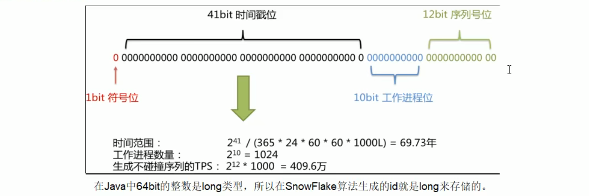

- 源码：
  - Github：[snowflake](https://github.com/twitter-archive/snowflake)，采用scala语言编写
  - Github：[hutool](https://github.com/looly/hutool)工具包

- 优缺点：

  - 优点：
    - 毫秒数在高位，自增序列在低位，整个ID都是趋势递增的。
    - 不依赖数据库等第三方系统，以服务的方式部署，稳定性更高，生成ID的性能也是非常高的。
    - 可以根据自身业务特性分配bit位，非常灵活。

  - 缺点：
    - 依赖机器时钟，如果机器时钟回拨，会导致重复ID生成。
    - 在单机上是递增的，但是由于涉及到分布式环境，每台机器上的时钟不可能完全同步，有时候会出现不是全局递增的情况（此缺点可以认为无所谓，一般分布式ID只要求趋势递增，并不会严格要求递增，90%的需求都只要求趋势递增）

**解决雪花算法的时钟回拨问题**：

- 美团：[美团Leaf](https://github.com/Meituan-Dianping/Leaf/blob/master/README_CN.md)、[Leaf-美团技术文章](https://tech.meituan.com/2017/04/21/mt-leaf.html)
- 百度：[百度UidGenerator](https://github.com/baidu/uid-generator)

## 16.71 静态内部类和成员内部类

静态内部类和成员内部类的区别：

（1）静态内部类的使用：

```java
/**
 * 静态内部类：与外部类相互独立
 * 1.创建静态内部类的对象：Out.Inner inner = new Out.Inner();
 * 2.静态内部类访问外部类：
 * --（1）可以直接访问外部类的静态变量和静态方法，即使是private修饰的
 * --（2）可以通过外部类的实例（不能直接）访问外部类的非静态变量和非静态方法，即使是private修饰的
 * 3.外部类访问静态内部类：
 * --（1）可以通过静态内部类（不能直接）访问其静态变量和静态方法，即使是private修饰的
 * --（2）可以通过静态内部类的实例（不能直接）访问其非静态变量和非静态方法，即使是private修饰的
 */
public class Out {
    private static int a = new Inner().d;
    private int b = Inner.c;
    private int e = new Inner().d;

    public static class Inner {
        private static int c;
        private int d;

        public void print() {
            System.out.println(a);
//            System.out.println(b); // 编译报错
            System.out.println(new Out().b);
        }
    }
}
```

（2）成员内部类的使用：

```java
/**
 * 成员内部类：
 * 1.创建成员内部类的对象：Out2.Inner2 inner2 = new Out2().new Inner2();
 * 2.成员内部类不能定义静态方法和变量（final修饰的除外）
 * (因为成员内部类是非静态的，类初始化的时候先初始化静态成员;
 * 如果允许成员内部类定义静态变量，那么成员内部类的静态变量初始化顺序是有歧义的)
 * 3.成员内部类访问外部类：
 * --（1）可以直接访问外部类的静态变量和静态方法，即使是private修饰的
 * --（2）可以直接访问外部类的非静态变量和非静态方法，即使是private修饰的
 * 4.外部类访问成员内部类：
 * --（1）可以通过成员内部类的实例（不能直接）访问其非静态变量和非静态方法，即使是private修饰的
 */
public class Out2 {
    private static int a = new Out2().new Inner2().c;
    private int b = new Inner2().c;

    public class Inner2 {
        private int c;

        public void print() {
            System.out.println(a);
            System.out.println(b);
        }
    }
}
```

> 参考博客文章：[静态内部类的加载时机](https://www.cnblogs.com/zouxiangzhongyan/p/10762540.html)

## 16.72 实现深拷贝的两种方式（原型模式）

方式一：所有嵌套对象均需实现`java.lang.Cloneable`接口，并重写`java.lang.Object#clone`方法。

方式二：实现`java.io.Serializable`接口，通过在内存中进行序列化与反序列化实现深拷贝，推荐使用这种方式实现深拷贝。

```java
@Test
public void test4() throws IOException, ClassNotFoundException {
    Student student = new Student();
    student.setId(1);
    student.setName("张三");

    Address addr = new Address();
    addr.setName("北京市海淀区xx街道");
    student.setAddress(addr);
    System.out.println(student);
    System.out.println(student.getAddress());

    ByteArrayOutputStream baos = new ByteArrayOutputStream();
    ObjectOutputStream oos = new ObjectOutputStream(baos);

    oos.writeObject(student);
    oos.close();
    baos.close();

    byte[] bytes = baos.toByteArray();
    ByteArrayInputStream bais = new ByteArrayInputStream(bytes);
    ObjectInputStream ois = new ObjectInputStream(bais);
    Student copy = (Student) ois.readObject();
    System.out.println(copy);
    System.out.println(copy.getAddress());
    ois.close();
    bais.close();
}
```

## 16.73 中断线程的几种方法

中断线程的几种方法：

1. 使用run方法：已废弃。

2. 使用退出标志。

   ```java
   public class ThreadInterruptTest1 {
       public static volatile boolean exit = false;//退出标志
   
       public static void main(String[] args) {
           new Thread(() -> {
               System.out.println("线程启动了");
               while (!exit) {
                   try {
                       Thread.sleep(1000);
                   } catch (InterruptedException e) {
                       e.printStackTrace();
                   }
               }
               System.out.println("线程结束了");
           }).start();
           try {
               Thread.sleep(1000 * 5);
           } catch (InterruptedException e) {
               e.printStackTrace();
           }
           exit = true;//5秒后更改退出标志的值,没有这段代码，线程就一直不能停止
       }
   }
   ```

3. 使用interrupt方法（实例方法）：**只是改变中断状态，不会中断一个正在运行的线程**。

   更确切地说，如果线程被Object.wait、Thread.join或Thread.sleep三种方法之一阻塞，此时调用该线程的interrupt()方法，那么该线程将抛出一个InterruptedException中断异常（该线程必须事先预备好处理此异常），从而提早地终结被阻塞状态。如果线程没有被阻塞，这时调用interrupt()将不起作用，直到执行到wait()、sleep()或join()时，才马上会抛出 InterruptedException。

   - **使用interrupt() + InterruptedException来中断线程**

   ```java
   public class ThreadInterruptTest2 {
       public static void main(String[] args) {
           Thread thread = new Thread(() -> {
               System.out.println("线程启动了");
               try {
                   Thread.sleep(1000 * 100);
               } catch (InterruptedException e) {
                   e.printStackTrace();
               }
               System.out.println("线程结束了");
           });
           thread.start();
   
           try {
               Thread.sleep(1000 * 5);
           } catch (InterruptedException e) {
               e.printStackTrace();
           }
           thread.interrupt();//作用是：在线程阻塞时抛出一个中断信号，这样线程就得以退出阻塞的状态
       }
   }
   ```

   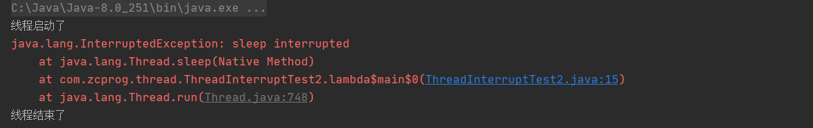

   - **使用interrupt() + isInterrupted()中断线程**：isInterrupted()是类方法

     三个方法：

     - interrupt()方法：**实例方法**，此方法不会中断一个正在运行的线程，它的作用是：在线程受到阻塞时抛出一个中断信号，这样线程就得以退出阻塞的状态。

       ```java
       public class ThreadInterruptTest5 {
           public static void main(String[] args) {
               Thread thread = new Thread() {
                   @Override
                   public void run() {
                       System.out.println("线程启动了");
                       //对于这种情况，即使线程调用了intentrupt()方法并且isInterrupted()，但线程还是会继续运行，根本停不下来！
                       while (true) {
                           System.out.println(isInterrupted());//调用interrupt之后为true
                       }
                   }
               };
               thread.start();
               //注意：此方法不会中断一个正在运行的线程，它的作用是：在线程受到阻塞时抛出一个中断信号，这样线程就得以退出阻塞的状态
               thread.interrupt();
               while (true) {
                   System.out.println("是否isInterrupted：" + thread.isInterrupted());//true
               }
           }
       }
       ```

     - isInterrupted()方法：**实例方法**，测试线程是否已经中断，但是不能清除状态标识。

     - interrupted()方法：**类方法**，测试当前线程是否已经中断。如果连续调用该方法，则第二次调用将返回false。在api文档中说明interrupted()方法具有清除状态的功能。执行后具有将状态标识清除为false的功能

   ```java
   public class ThreadInterruptTest3 {
       public static void main(String[] args) {
           Thread thread = new Thread() {
               @Override
               public void run() {
                   System.out.println("线程启动了");
                   // 或while (!Thread.currentThread().isInterrupted())
                   while (!isInterrupted()) {
                       System.out.println(isInterrupted());//调用 interrupt 之后为true
                   }
                   System.out.println("线程结束了");
               }
           };
           thread.start();
   
           try {
               Thread.sleep(2000);
           } catch (InterruptedException e) {
               e.printStackTrace();
           }
           thread.interrupt();
           System.out.println("线程是否被中断：" + thread.isInterrupted());//true
       }
   }
   ```

   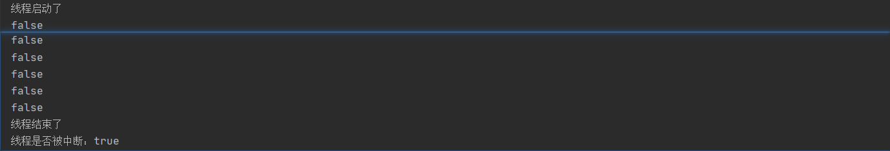

> 参考博客文章：**[java 中断线程的几种方式](https://www.cnblogs.com/myseries/p/10918819.html)**

## 16.74 notify和notifyAll的区别

**notify和notifyAll的区别**：谨慎使用notify，因为可能导致死锁。

- 如果线程调用了对象的 wait()方法，那么线程便会处于该对象的**等待池**中，等待池中的线程不会去竞争该对象的锁。
- 当有线程调用了对象的 notifyAll()方法（唤醒所有 wait 线程）或 notify()方法（只随机唤醒一个 wait 线程），被唤醒的的线程便会进入该对象的**锁池**中，锁池中的线程会去竞争该对象锁。也就是说，调用了notify后只要一个线程会由等待池进入锁池，而notifyAll会将该对象等待池内的所有线程移动到锁池中，等待锁竞争。
- 优先级高的线程竞争到对象锁的概率大，假若某线程没有竞争到该对象锁，它还会留在锁池中，唯有线程再次调用 wait()方法，它才会重新回到等待池中。而竞争到对象锁的线程则继续往下执行，直到执行完了 synchronized 代码块，它会释放掉该对象锁，这时锁池中的线程会继续竞争该对象锁。

## 16.75 sleep()和wait()的区别

**sleep和wait的区别**：

1. 来自不同的类：wait来自Object类；sleep来自Thread类，企业开发中一般不会用sleep进行休眠，而会使用`TimeUnit.SECONDS.sleep(20);`。
2. 关于锁的释放：wait会释放锁；sleep不会释放锁。
3. 使用范围不同：wait必须在同步代码块中使用；sleep可以在任何地方使用。
   - 为什么wait和notify要在同步代码块中使用？
     - 若不在同步代码块中使用，会抛出illegalMonitorStateException异常
     - 避免wait和notify之间产生竞态条件
4. 是否需要捕获异常：wait不需要捕获异常；sleep需要捕获异常。

## 16.76 泛型方法的调用

需要注意泛型方法与泛型类的不同，关于泛型方法的调用：

```java
public class GenericityMethod {
    public static void main(String[] args) {
        String result1 = GenericityMethod.<String>test1("调用静态泛型方法1");
        // 泛型方法的类型推断
        String result2 = GenericityMethod.test1("调用静态泛型方法2");
        System.out.println(result1);
        System.out.println(result2);

        GenericityMethod gm = new GenericityMethod();
        String result3 = gm.test2("调用非静态泛型方法1");
        // 泛型方法的类型推断
        String result4 = gm.<String>test2("调用非静态泛型方法2");
        System.out.println(result3);
        System.out.println(result4);
    }

    public static <T> T test1(T arg) {
        return arg;
    }

    public <T> T test2(T arg) {
        return arg;
    }
}
```

## 16.77 乐观锁/悲观锁/自旋锁/自适应自旋/锁消除/锁粗化/轻量级锁/偏向锁

**乐观锁**：乐观锁是一种乐观思想，即认为读多写少，遇到并发写的可能性低，每次去拿数据的时候都认为别人不会修改，所以不会上锁，但是在更新的时候会判断一下在此期间别人有没有去更新这个数据，采取在写时先读出当前版本号，然后加锁操作（比较跟上一次的版本号，如果一样则更新），如果失败则要重复读-比较-写的操作。java中的乐观锁基本都是通过 CAS 操作实现的，CAS是一种更新的原子操作，比较当前值跟传入值是否一样，一样则更新，否则失败。

**悲观锁**：悲观锁是就是悲观思想，即认为写多读少，遇到并发写的可能性高，每次去拿数据的时候都认为别人会修改，所以每次在读写数据的时候都会上锁，这样别人想读写这个数据就会block直到拿到锁。java中的悲观锁就是Synchronized；AQS框架下的锁则是先尝试CAS乐观锁去获取锁，获取不到，才会转换为悲观锁，如RetreenLock。

**自旋锁**：如果持有锁的线程能在很短时间内释放锁资源，那么那些等待竞争锁的线程就不需要做内核态和用户态之间的切换进入阻塞挂起状态，它们只需要等一等（自旋），等持有锁的线程释放锁后即可立即获取锁，这样就避免用户线程和内核的切换的消耗；如果持有锁的线程执行的时间超过自旋等待的最大时间仍没有释放锁，就会导致其它争用锁的线程在最大等待时间内还是获取不到锁，这时争用线程会停止自旋进入阻塞状态。

- 线程自旋是需要消耗CPU的，说白了就是让CPU在做无用功，如果一直获取不到锁，那线程也不能一直占用CPU自旋做无用功，所以需要设定一个自旋等待的最大时间。

**自适应自旋**：自旋的时间不是固定的，而是由前一次在同一个锁上的自旋时间及锁的拥有者的状态来决定的。如果在同一个锁对象上，自旋等待刚刚成功获得过锁，并且持有锁的线程正在运行中，那么虚拟机会认为这次自旋也很有可能再次成功，进而允许自旋等待相对更长的时间；如果对于某个锁，自旋很少成功获得过锁，那在以后要获取这个锁时将有可能直接省略掉自旋过程，以避免浪费处理器资源。

- JDK1.6中默认开启了自旋锁：`-XX:+UseSpinning`
- 设置自旋的次数：`-XX:PreBlockSpin=10`，JDK1.7后，去掉了此参数，由JVM控制。

**锁消除**：虚拟机（进行逃逸分析）对被检测到不可能存在共享数据竞争的锁进行消除。

**锁粗化**：如果虚拟机探测到有这样一串零碎的操作都对同一个对象加锁，将会把加锁同步的范围扩展（粗化）到整个操作序列的外部。

```java
// 一段看起来没有同步的代码
public String concatString(String s1, String s2, String s3){
    return s1 + s2 + s3;
}
// 编译器会将上一段代码转化为下面的代码，JDK1.5会采用StringBuffer进行拼接，JDK1.6会采用StringBuilder进行拼接
// StringBuffer的append方法是同步的，虚拟机会对连续的三个连续的append方法进行锁粗化
public String concatString(String s1, String s2, String s3){
    StringBuffer sb = new StringBuffer();
    sb.append(s1);
    sb.append(s2);
    sb.append(s3);
    return sb.toString();
}
```

**轻量级锁**：在无竞争的情况下（**针对大部分情况下锁的持有时间很短**）使用CAS操作去消除同步使用的互斥量。**轻量级锁是为了在线程交替执行同步块时提高性能**。

**偏向锁**：消除数据在无竞争情况下（**针对大部分情况下锁总是由同一线程多次获得**）的同步原语，进一步提高程序的运行性能。即在无竞争的情况下把整个同步都消除掉，连CAS操作都不去做了。**偏向锁则是在只有一个线程执行同步块时进一步提高性能**。

- 启动偏向锁：`-XX:+UseBiasedLocking`，默认开启

- 锁的递进：锁消除-->偏向锁-->轻量级锁-->自适应自旋锁-->自旋锁-->锁粗化
- **synchronized锁的竞争升级（单向）**：无锁状态-->偏向锁-->轻量级锁-->重量级锁
- 锁的优化措施：
  - 较少锁持有时间
  - 减小锁的粒度（例如：读写锁）
  - 锁分离（例如：读写锁）
  - 锁粗化：虚拟机会针对连续对同一个对象加锁这种情况进行优化（切忌在循环体中加锁）
  - 锁消除：虚拟机（进行逃逸分析）对被检测到不可能存在共享数据竞争的锁进行消除

## 16.78 java内存模型

Java内存模型：

1. 所有变量（包括实例变量与类变量，不包含局部变量、方法参数）都存储在主内存中（主内存类比于物理内存）。
2. 每条线程都有自己的工作内存，线程的工作内存中保存了被该线程使用的变量的主内存副本，线程对变量的所有操作（读取、赋值）都必须在工作内存中进行，而不能直接读写主内存中的数据。
3. 不同线程之间无法直接访问对方工作内存中的变量，线程间变量值的传递均需要通过主内存来完成；但volatile修饰的变量例外

4. 内存间交互的8种操作：每种操作均是原子性的；read和load、store和write需要成对出现
   - 锁定（lock）-->解锁（unlock）
   - 读取（read）-->载入（load）-->使用（use）-->赋值（assign）-->存储（store）-->写入（write）

5. java内存模型围绕在并发过程中如何处理的三个特征：
   - 原子性：可以保证原子性的1个关键字是synchronized（对应的JVM层面的字节码指令是monitorenter、monitorexit）
   - 可见性：可以保证可见性的3个关键字是volatile、synchronized、final
   - 有序性：可以保证有序性的2个关键字是volatile、synchronized

6. 先行发生原则

## 16.79 jps/jstat/jinfo/jmap/jhat/jstack/jconsole/jvisualvm

1. jps：虚拟机进程状况工具
   - `jps -l`：输出主类的全名，如果进程是jar包，则输出jar包路径
   - `jps -v`：输出虚拟机进程启动时的JVM参数
   - `jps -m`：输出虚拟机进程启动时传递给主类main()函数的参数
   - `jps -q`：只输出进程id，省略主类的名称

2. jstat：虚拟机统计信息（主要分为类加载、垃圾收集、运行期编译状况）监视工具
   - `jstat -gc 27032 250 20 `：查询进程27032的垃圾收集（堆和方法区）情况，每250ms查询一次，共查询20次
   - `jstat -gcutil 27032 `：显示堆和方法区的使用情况的百分占比
   - `jstat -class 27032`：类加载统计
   - `jstat -compiler 27032`：编译统计
   - `jstat -gcmetacapacity 27032`：元空间统计

3. jinfo：java配置信息工具

   - `jindo -flags 27032`：查看虚拟机配置信息，如使用哪种回收器、参数配置。

   - `jinfo -flag +PrintGCDetails 27032 `：配置开启PrintGCDetails
   - `jinfo -flag PrintGCDetails 27032`：查看是否已打开PrintGCDetails
   - `jinfo -flag HeapDumpOnOutOfMemoryError 27032`：查看是否内存溢出后是否会自动生成堆转储文件，默认未开启

4. jmap：java内存映像工具

   - `jmap -dump:format=b,file=example.dump 27032`：生成堆转储快照

   - `jmap -heap 27032`：显示java堆详细信息，如使用哪种回收器、参数配置、分代状况等
   - `jmap -histo 27032`：显示堆中对象统计信息，包括类、实例数量、合计容量

5. jhat：虚拟机堆转储快照分析工具，搭配jmap使用（比较简陋）
   - `jhat example.dump`：内置了一个HTTP/Web服务器，生成堆快照分析结果
   - 推荐使用Memory Analyzer Tool、IBM HeapAnalyzer等工具

6. jstack：java堆栈跟踪工具，生成当前时刻的线程快照
   - `jstack -l 27032`：除堆栈外，显示关于锁的附加信息（可以排查死锁问题）

7. jconsole：可以打开Java监视和管理控制台
   - 可以在**线程**页签查看是否存在死锁

8. jvisualvm：可以打开Java VisualVM可视化分析工具
   - 可以在**线程**页签查看是否存在死锁

> 参考博客文章：[jstat命令详解](https://www.cnblogs.com/sxdcgaq8080/p/11089841.html)

## 16.80 wait/notify/notifyAll/sleep/join/yield 

线程通信的方法：

1.  来自`java.lang.Object`：wait（立即阻塞）、notify、notifyAll
2. 来自`java.lang.Thread`：sleep（立即阻塞，类方法）、join（立即阻塞）、yield（让出时间片，类方法）

## 16.81 不可变类

**创建不可变类的条件**：

1. 将类声明为final，所以它不能被继承
2. 将所有的成员声明为private的，这样就不允许直接访问这些成员
3. 对变量不要提供setter方法；提供getter方法，但不要直接返回对象本身，而是返回**深拷贝**对象（**避免成员变量逃逸**）
4. 将所有可变的成员声明为final，这样只能对它们赋值一次（非必须）
5. 通过构造器初始化所有成员，进行**深拷贝**

## 16.82 竞争条件

**竞态条件**：当两个线程竞争同一资源时，如果对资源的访问顺序敏感，就称存在竞态条件。导致竞态条件发生的代码区称作临界区。

**临界区解决方法有三种**：使用synchronized、使用Lock显式锁实现、使用volatile+CAS

实例：

```java
class Counter { 
    protected long count = 0; 
    public void add(long value) { 
        this.count = this.count + value; 
    }
}
```

观察线程A和B交错执行会发生什么，两个线程分别加了2和3到count变量上，两个线程执行结束后count变量的值应该等于5。然而由于两个线程是交叉执行的，两个线程从内存中读出的初始值都是0。然后各自加了2和3，并分别写回内存。最终的值并不是期望的5，而是最后写回内存的那个线程的值，上面例子中最后写回内存的是线程A，但实际中也可能是线程B。如果没有采用合适的同步机制，线程间add()方法就是一个临界区，它会产生竞态条件。

## 16.82 代理模式/静态代理/动态代理/Cglib代理

> 参考博客文章：[Java的三种代理模式](https://www.cnblogs.com/leeego-123/p/10995975.html)


## 16.83 JDK/JRE/JVM之间的关系

JDK/JRE/JVM三者之间的关系如下：

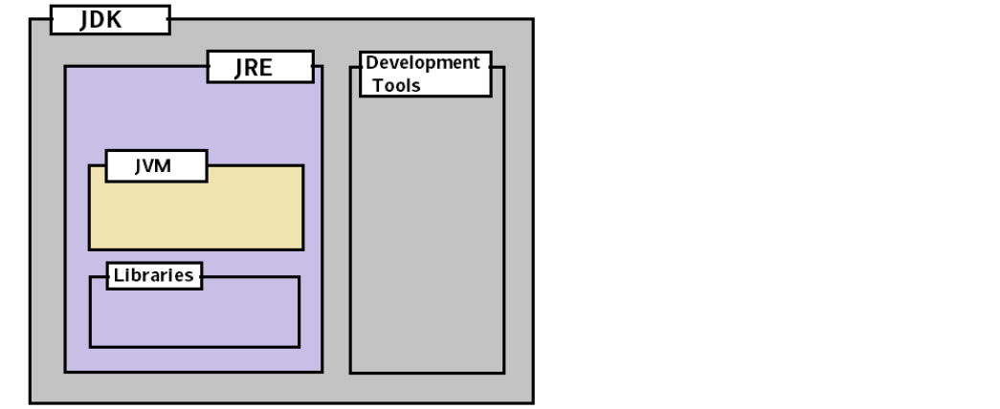

## 16.84 关于ThreadLocal


> 参考博客文章：[ThreadLocal源码解读](https://www.cnblogs.com/fsmly/p/11020641.html)


## 16.85 B-Tree/B+Tree/聚集索引/辅助索引/磁盘块/页块


> 参考博客文章：[BTree和B+Tree详解](https://blog.csdn.net/hao65103940/article/details/89032538)


## 16.86 数据库的三大范式

数据库的三大范式：不可拆分、消除依赖、消除依赖

1. 第一范式：确保每列保持原子性，即列不可再分（如**中国北京市**应该分割成**中国+北京市**两列）

   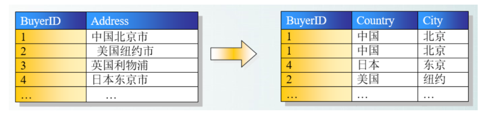

2. 第二范式：确保表中的每列都和主键相关

   

3. 第三范式：确保每列都和主键列**直接**相关，不存在对非主键列的传递依赖

   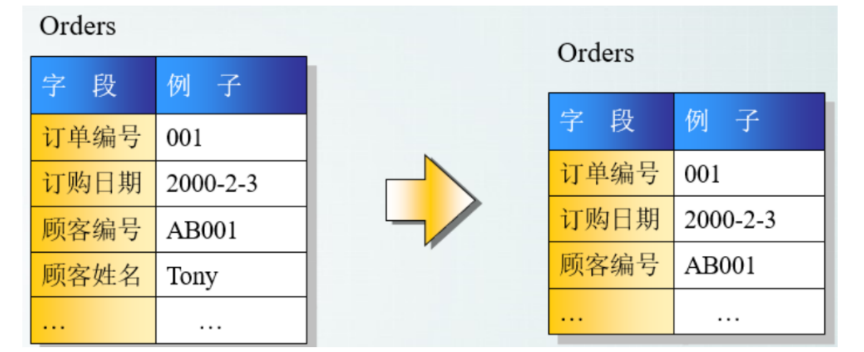

## 16.87 MySQL如何保证一致性、原子性、持久性

MySQL如何保证一致性、原子性、持久性？

1. 保证一致性：数据库+应用层
   - 数据库：一致性是目的，原子性、隔离性、持久性是手段
   - 应用层：程序逻辑
2. 保证原子性：利用Innodb的undo log日志（类似于Seata的undo_log表，查询前镜像）
3. 保证持久性：利用Innodb的redo log日志（类似于Seata的undo_log表，查询后镜像）

> 参考博客文章：**[详细分析MySQL事务日志(redo log和undo log)](https://www.cnblogs.com/f-ck-need-u/archive/2018/05/08/9010872.html)**、[MySQL如何保证一致性、原子性、持久性](https://cloud.tencent.com/developer/article/1600883)

## 16.88 写SQL的几点注意事项

写SQL的几点注意事项：

1. 查询语句中不要使用select *。
2. 尽量减少子查询，使用关联查询（left join、right join、inner join）替代。
   - 利用自联结（join，即inner join）可以解决很多排序、去重、筛选问题。
3. 减少使用IN或者NOT IN，使用exists，not exists或者关联查询语句替代（exists的条件就像一个bool条件，当能返回结果集则为true，不能返回结果集则为 false）。
   - MySQL中的in语句是把外表和内表作hash连接，而exists语句是对外表作loop循环，每次loop循环再对内表进行查询。一直大家都认为exists比in语句的效率要高，这种说法其实是不准确的。需要根据环境区分使用：
     - 如果查询的两个表大小相当，那么用in和exists差别不大
     - 如果两个表中一个较小，一个是大表，则子查询表大的用exists，子查询表小的用in
4. or的查询尽量用union或者union all代替(在确认没有重复数据或者不用剔除重复数据时，union all会更好)。
5. 应尽量避免在where子句中使用!=或<>操作符，否则将引擎放弃使用索引而进行全表扫描。
6. 应尽量避免在where子句中对字段进行null值判断，否则将导致引擎放弃使用索引而进行全表扫描，如：select id from t where num
   is null可以在num上设置默认值0，确保表中num列没有null值，然后这样查询：select id from t where num=0。
7. 禁止不带任何限制数据范围条件的查询语句（例：当用户在查询订单历史的时候，我们可以控制在一个月的范围内）。
8. 合理选择使用枚举，如："省份"、"性别"最好使用ENUM类型存储。
9. 不要忘记引号，会因隐式类型转换导致索引失效，导致查询效率降低；另一方面，索引失效又会导致行锁升级为表锁。

> 参考博客：**[Mysql中用exists代替in](https://www.cnblogs.com/xianlei/p/8862313.html)**

## 16.89 drop/delete/truncate

SQL中drop/delete/truncate的区别：

- 是否删除表的结构：delete和truncate只删除表的数据而不删除表的结构，drop会删除表的数据和结构
- 删除速度：drop> truncate >delete
- 是否与事务相关：
  - delete语句是DML，这个操作会放到Rollback Segement中，事务提交之后才生效；若有触发器，则会被触发。
  - truncate、drop是DDL，这个操作立即生效，原数据不放到Rollback Segment中，不能回滚；操作不能触发触发器。

## 16.90 MySQL的默认隔离级别？MySQL如何解决幻读问题？

MySQL的默认隔离级别：Repeatable-Read，可重复度

MySQL如何解决幻读问题：next-key锁

- next-key锁包含两部分：记录锁（行锁）+间隙锁
  - 记录锁，即行锁：加在索引上的锁（若索引失效会导致行锁升级为表锁）
  - 间隙锁：加在索引之间

> 参考博客文章：[MySQL是如何解决幻读的](https://www.cnblogs.com/wudanyang/p/10655180.html)

## 16.100 MySQL中如何优化大表

**优化大表的思路**：SQL语句及索引的优化、数据库表结构的优化、系统配置的优化、硬件的优化。

MySQL中表的记录在500万条以下时，性能很好，当记录超过500万条时，性能会随着记录的增加急剧下降。优化大表的措施：

1. 读写分离：主库负责写，从库负责读。
2. 垂直拆分（分表）：将一个表拆分为多个表
   - 优点：垂直拆分可以使列数据变小，在查询时减少读取的磁盘块数，减少I/O次数。
   - 缺点：主键会出现冗余，导致应用层涉及到较多的join查询。

3. 水平拆分（分布式）：保持数据表结构不变，通过某种策略存储**数据分片**（如限制单表的最大记录为200万条），这样每一片数据分散到不同的表或库中，达到了**分布式**的目的。
   - 优点：为了支持高并发，水平拆分时，需要进行分库（表不要存放在一台机器上）
   - 缺点：带来分布式事务的解决难题

数据库分片（水平拆分/垂直拆分，即分库分表）的两种常见解决方案：

1. 客户端代理：通过修改或封装JDBC层来实现，如阿里巴巴的TDDL（Taobao Distributed Data Layer）
2. 中间件代理：在应用和数据中间加了一个代理层，分片逻辑统一维护在中间件服务中，如MyCat、Atlas

## 16.101 视图/存储过程/函数/触发器

视图：逻辑上存在、物理上不存在的表，对视图的增删改不会隐藏基本表的数据

存储过程：类似于批处理脚本，可以返回记录集

函数：自定义函数，可返回值

触发器：解决自动填充问题、自定义哈希索引算法。

## 16.102 数据库并发策略/锁种类

数据库并发处理策略：

1. 乐观锁：典型代表是Innodb引擎，行锁

   ```sql
   -- oracle中使用for update显示添加行锁
   INSERT|UPDATE|DELETE|SELECT ... FOR UPDATE
   ```

2. 悲观锁：典型代表是MyISAM，表锁（并发环境下要弃用）

3. 时间戳：不加锁，通过时间戳来控制并发出现的问题

MySQL中锁的种类：

1. 表锁
2. 页锁：很可能会导致死锁
3. 行锁

## 16.103 交叉连接/内连接/外连接

交叉连接：不带任何条件（不带条件的自连接属于交叉连接）

内连接：只有条件的交叉连接（带条件的自连接属于内连接）

外连接：包括左外连接、右外连接

## 16.104 DDL/DML/DCL/DQL

DDL：数据库定义（增、删、改），create table、drop table、alter table、craete index、drop index

DML：数据库操纵（增、删、改），insert、delete、update

DCL：数据库控制，grant、rollback、commit

DQL：数据库查询，select、from、where、group by、order by

## 16.105 Spring Bean的生命周期

Spring中Bean的生命周期如下：

1. 


> 参考博客文章：[SpringBean的生命周期](https://www.cnblogs.com/zrtqsk/p/3735273.html)


## 16.106 如何使Spring中单例Bean线程安全

Spring中单例Bean是线程安全吗？

Spring中单例Bean并非是线程安全的，若需要使单例Bean在多线程下安全，有两种方法：

1. 可以将Bean的作用域设置为prototype
2. 使用ThreadLocal来解决多线程下的变量的安全性

## 16.107 怎么重载的Spring Bean的生命周期方法

重载Spring Bean的生命周期方法：

- @PostConstruct：相当于XML配置文件中init-method指定初始化方法。
- @PreDestroy：相当于XML配置文件中destroy-method指定初始化方法。

## 16.108 切面/通知/切点/连接点/切点表达式

Spring AOP的总结：

1. 主要概念：

   - 切面（@Aspect）：切面是通知和切点的集合，通知（**在何时，完成什么工作**）和切点（**在何处**）共同定义了切面的全部功能，**即切面中定义在何时、何处完成什么工作**。
   - 通知（@Around/@Before/@After/@AfterReturning/@AfterThrowing）：切面的工作被称为通知。
   - 切点（@Pointcut(""切点表达式)）：如果说通知定义了"**干什么**"和"**何时**"。那么切点就定义了"**何处**"。切点会匹配通知所要织入的一个或者多个连接点。
   - 连接点：程序中可以插入切面的地方（切点必然属于连接点，连接点只有当被置入时才是切点）。

   ```java
   // Spring AOP使用示例
   @Component
   @Aspect
   public class SecurityAspect {
       @Autowired
       private AuthService authService;
       
       //匹配com.aop.service.impl.ProductServiceImpl类下的方法名以delete开头、参数类型为Long的public方法
       @Pointcut("execution(public * com.aop.service.impl.ProductServiceImpl.delete*(Long))")
       public void matchCondition() {}
   
       //使用matchCondition这个切入点进行增强
       @Before("matchCondition()")
       public void before() {
           System.out.println("before 前置通知......");
           authService.checkAccess();
       }
   }
   ```

2. 其他概念：

   - 关注点：应用中一个模块的行为，一个关注点可能会被定义成一个我们想实现的一个功能。

   - 横切关注点：是一个关注点，此关注点是整个应用多个模块都会使用的功能，并影响整个应用（如日志，安全和数据传输）。

   - 引入：允许我们向现有的类中添加方法或属性。

   - 织入：将切面应用到目标对象来创建代理对象的过程（织入可以在**编译时**，**加载时**，或**运行时**完成）。

3. 切点表达式：

   - execution表达式：

     ```java
     // execution表达式的语法如下：
     execution(modifiers-pattern? ret-type-pattern declaring-type-pattern? name-pattern(param-pattern) throws-pattern?)
     
     // ?：表示该项可省略,否则代表不可省略
     // *通配符：该通配符主要用于匹配单个单词，或者是以某个词为前缀或后缀的单词
     // ..通配符：该通配符表示0个或多个项，主要用于declaring-type-pattern和param-pattern中，如果用于declaring-type-pattern中，则表示匹配当前包及其子包，如果用于param-pattern中，则表示匹配0个或多个参数
         
     // modifiers-pattern: 方法的可见性，如public,protected，可省略
     // ret-type-pattern：方法的返回值类型，如int,void等
     // declaring-type-pattern：方法所在类的全路径名，如com.spring.Aspect，可省略
     // name-pattern：方法名类型，如buisinessService()
     // param-pattern：方法的参数类型，如java.lang.String
     // throws-pattern：方法抛出的异常类型，如java.lang.Exception，可省略
         
     // 示例
     // 表示匹配返回值为任意类型，在com.spring.service.BusinessObject类中，并且参数个数为零的方法
     execution(* com.spring.service.BusinessObject.*())
     // 表示匹配返回值为任意类型，在com.spring.service包中，以Business为前缀的类，并且是类中参数个数为零方法
     execution(* com.spring.service.Business*.*())
     // 表示匹配返回值为任意类型，在com.spring.service包及其子包下的任意类的名称为businessService的方法，而且该方法不能有任何参数
     execution(* com.spring.service..*.businessService())
     // 表示匹配返回值为任意类型，在com.spring.service.BusinessObject包下的businessService方法，且方法的第一个参数是String类型
     execution(* com.spring.service.BusinessObject.businessService(java.lang.String,..))
     ```

   - within表达式（匹配包类型）

     ```java
     //匹配ProductServiceImpl类里面的所有方法
     @Pointcut("within(com.aop.service.impl.ProductServiceImpl)")
     public void matchType() {}
     
     //匹配com.aop.service包及其子包下所有类的方法
     @Pointcut("within(com.aop.service..*)")
     public void matchPackage() {}
     ```

   - this/target/bean表达式（匹配对象类型）

     ```java
     //匹配AOP对象的目标对象为指定类型的方法，即ProductServiceImpl的aop代理对象的方法
     @Pointcut("this(com.aop.service.impl.ProductServiceImpl)")
     public void matchThis() {}
     
     //匹配实现ProductService接口的目标对象
     @Pointcut("target(com.aop.service.ProductService)")
     public void matchTarget() {}
     
     //匹配所有以Service结尾的bean里面的方法
     @Pointcut("bean(*Service)")
     public void matchBean() {}
     ```

   - args表达式（匹配参数）

     ```java
     //匹配第一个参数为Long类型的方法
     @Pointcut("args(Long, ..) ")
     public void matchArgs() {}
     ```

   - @annotation/@within/@target/@args表达式（匹配注解）

     ```java
     //匹配标注有AdminOnly注解的方法
     @Pointcut("@annotation(com.aop.annotation.AdminOnly)")
     public void matchAnno() {}
     
     //匹配标注有Beta的类底下的方法，要求annotation的Retention级别为CLASS
     @Pointcut("@within(com.google.common.annotations.Beta)")
     public void matchWithin() {}
     
     //匹配标注有Repository的类底下的方法，要求annotation的Retention级别为RUNTIME
     @Pointcut("@target(org.springframework.stereotype.Repository)")
     public void matchTarget() {}
     
     //匹配传入的参数类标注有Repository注解的方法
     @Pointcut("@args(org.springframework.stereotype.Repository)")
     public void matchArgs() {}
     ```

4. Spring AOP中的代理

   - Spring AOP：使用@EnableAspectJAutoProxy启动，proxyTargetClass属性为true，则强制选用Cglib代理；默认为false，表示选用JDK代理。

     - **Sping5.x中**：
       - 当被代理的对象实现了接口，默认会采用JDK动态代理（使用Proxy和InvocationHandler两个类）
       - 当被代理的对象未实现接口，则会切换为使用Cglib代理
     - **Spring Boot2.x中**：
       - 为了解决使用JDK动态代理可能导致的类型转化异常，默认使用Cglib代理
       - 若需要默认使用JDK动态代理，可以通过设置`spring.aop.proxy-target-class=false`

     - Cglib代理（**通过字节码技术底层继承被代理类来实现，若被代理类使用final修饰，则代理会失败**）和JDK代理（**反射技术**）的效率比较

       - Cglib代理创建的代理对象在实际运行时**性能**要比JDK代理高
       - Cglib代理在创建代理对象时所**花费时间**比JDK代理多
       - 选用：对于Singleton的代理对象或者具有实例池的代理，因为无需频繁的创建代理对象，所以比较适合采用Cglib动态代理，反之则比较适用JDK动态代理。

     - Spring中的自动代理类

       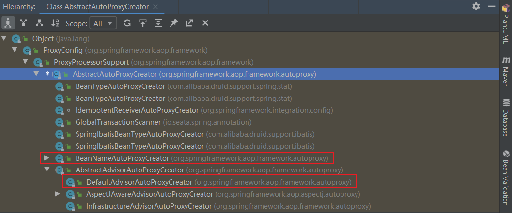

     ```java
     // Spring AOP中的DefaultAopProxyFactory源码
     public class DefaultAopProxyFactory implements AopProxyFactory, Serializable {
     	@Override
     	public AopProxy createAopProxy(AdvisedSupport config) throws AopConfigException {
     		// 判断配置是否有效，配置中有代理类信息，判断有没有用户自己定义的解析接口
     		if (config.isOptimize() || config.isProxyTargetClass() || hasNoUserSuppliedProxyInterfaces(config)) {
     			Class<?> targetClass = config.getTargetClass();
     			if (targetClass == null) {
     				throw new AopConfigException("TargetSource cannot determine target class: " +
     						"Either an interface or a target is required for proxy creation.");
     			}
     			// 如果被代理的对象是接口或者Proxy的类，返回默认的JDK动态代理对象
     			if (targetClass.isInterface() || Proxy.isProxyClass(targetClass)) {
     				return new JdkDynamicAopProxy(config);
     			}
     			// 如果该对象没有实现接口就使用Cglib就行代理
     			return new ObjenesisCglibAopProxy(config);
     		}
     		else {
     			return new JdkDynamicAopProxy(config);
     		}
     	}
         
     	private boolean hasNoUserSuppliedProxyInterfaces(AdvisedSupport config) {
     		Class<?>[] ifcs = config.getProxiedInterfaces();
     		return (ifcs.length == 0 || (ifcs.length == 1 && SpringProxy.class.isAssignableFrom(ifcs[0])));
     	}
     }
     ```

   - Spring + AspectJ：使用静态代理，在编译时增强，需要特定的编译器。

     - 下载[aspectj-1.9.6.jar](https://www.eclipse.org/downloads/download.php)，安装aspectj
     - 在IDEA中配置本地的aspectj的jar包，将IDEA的编译模式设置为Ajc
     - mavon中引入aspectjweaver和aspectjrt的坐标

> 参考博客文章：[Spring AOP用法详解](https://www.cnblogs.com/liantdev/p/10125284.html)、**[Spring AOP切点表达式用法总结](https://www.cnblogs.com/zhangxufeng/p/9160869.html)**、[Spring AOP](https://blog.csdn.net/qq_41981107/article/details/87920537)、[比较分析Spring AOP和AspectJ之间的差别](https://blog.csdn.net/a128953ad/article/details/50509437)、[Spring和SpringBoot中AOP的代理模式](https://blog.csdn.net/weixin_41325595/article/details/103576207)、[从@EnableAspectJAutoProxy分析Spring AOP原理](https://blog.csdn.net/zhoushimiao1990/article/details/89853368)、[Spring AOP中强制使用CGLIB代理](https://blog.csdn.net/dushenzhi/article/details/52663310)、**[Spring AOP中的JDK和CGLib动态代理哪个效率更高？](https://blog.csdn.net/xlgen157387/article/details/82497594)**、[AspectJ静态代理的使用](https://blog.csdn.net/yellow__star/article/details/102510545)

## 16.109 SpringBoot有哪几种读取配置的方式

SpringBoot有如下几种读取配置的方式：@PropertySource、@Value、@Environment、@ConfigurationProperties

## 16.110 Eureka和Zookeeper用作服务注册与发现的区别

Eureka和Zookeeper用作服务注册与发现的区别：

- **实现思想不同**
  - Zookeeper采用了CP（一致性和分区容错性）机制：当master节点因网络故障与其他节点失去联系时，剩余节点会重新选择leader。
  - Eureka采用了AP（高可用和分区容错性）机制：可以容忍注册中心返回的是几分钟之前的信息，但不能容忍直接宕掉。

- **节点类型不同**
  - Zookeeper节点分为Leader和Follower，当Leader挂掉后，需要重新选举Leader。
  - Eureka各个节点平等，几个节点挂掉后，剩余的节点仍然正常提供注册和查询服务。

- **处理分区问题的方式不同**
  - Zookeeper采取**选举机制**（过半存活原则）解决分区问题：选取leader的时间过长（30s~120s），选举期间Zookeeper不可用，会导致服务瘫痪。
  - Eureka采取**自我保护机制**解决分区问题：若在15分钟内超过85%的节点没有正常的心跳，那么Eureka就认为客户端与注册中心发生了故障，不再从注册列表中移除因为长时间没有收到心跳而应该过期的服务。

- 类型不同
  - Zookeeper只是一个进程。
  - Eureka本质是一个工程。

## 16.111 服务熔断和降级的区别

**服务雪崩**：服务A调用服务B，由于服务B的响应超时（可能是处理时间过长，也可能是网络故障）导致大量请求堆积到服务A上，导致服务A也不可用，这种现象称为雪崩。

**服务熔断**：服务A调用服务B，当服务B在一定时间内超时的次数达到一定比例时，会导致服务B不可用。

- 服熔断的三种状态机：
  - Closed：熔断器关闭状态，调用失败次数积累，到了阈值（或一定比例）则启动熔断机制。
  - Open：熔断器打开状态，此时对下游的调用都内部直接返回错误，不走网络，但设计了一个时钟选项，默认的时钟达到了一定时间（这个时间一般设置成平均故障处理时间，也就是MTTR），到了这个时间，进入半熔断状态。
  - Half-Open：半熔断状态，允许定量的服务请求，如果调用都成功（或一定比例）则认为恢复了，关闭熔断器，否则认为还没好，又回到熔断器打开状态。

**服务降级**：服务A调用服务B，由于服务B的调用负荷条件满足时（如QPS过高），会对服务B进行降级（调用其他方法或返回默认值）。

**服务熔断和服务降级的比较**：

- 相同点
  - 目的一致：都是从可用性可靠性着想，为防止系统的整体缓慢甚至崩溃，采用的技术手段。
  - 最终表现类似：对于两者来说，最终让用户体验到的是某些功能暂时不可达或不可用。
  - 粒度均是服务级别：当然，业界也有不少更细粒度的做法，比如做到数据持久层（允许查询，不允许增删改）。
  - 自治性要求很高：熔断模式一般都是服务基于策略的自动触发，降级虽说可人工干预，但在微服务架构下，完全靠人显然不可能，开关预置、配置中心都是必要手段。
- 不同点
  - 触发原因不同：服务熔断一般是某个服务（下游服务）故障引起，而服务降级一般是从整体负荷考虑。
  - 管理目标层次不同：熔断其实是一个框架级的处理，每个微服务都需要（无层级之分），而降级一般需要对业务有层级之分（比如降级一般是从最外围服务开始）。

## 16.112 RPC和REST调用的区别

RPC和REST调用的区别：

- 实现原理不同：RPC（面向方法）基于TCP协议；REST（面向资源）基于HTTP协议。RPC的服务提供方和调用方之间依赖性强；而REST是轻量级的接口，服务的提供和调用不存在代码之间的耦合。

- 使用场景不同：
  - RPC适用于内网服务调用，对外提供服务请走REST
  - IO密集的服务调用用RPC（长连接），低频服务用REST（短连接）

> 参考博客文章：[服务之间的调用之RPC/Restful深入理解](https://blog.csdn.net/u014590757/article/details/80233901)、[SpringCloud相关](https://yanglinwei.blog.csdn.net/article/details/106408086)

## 16.113 面试盲点

- 怎么重写hashcode方法？hashcode和equals方法的区别？hashcode方法的应用？hashcode是负数怎么办？

  - 前两个问题见《Effective Java》。

  - Hashmap中的hashcode为负数怎么办？

    ```java
    @Test
    public void test2() {
        // 假设存到HashMap的key是-2
        int h = Integer.hashCode(-2);
        // JDK 1.8中HashMap中对计算得到的h值进行一次扰动
        int hashcode = h ^ (h >>> 16);
        System.out.println(hashcode); // -65535
        // 数组长度
        int length = 16;
        // 决定放到HashMap数组结构中的哪个槽上
        // 当hashcode>=0时，才满足hashcode & (length - 1)= hashcode % length
        // 当hashcode<0时，hashcode % length会出现负值的情况，所以源码中采用的是hashcode & (length - 1)
        // hashcode & (length - 1)取值不会出现负数的现象
        int slot1 = hashcode & (length - 1); // 当length是2的幂次方时，等价于hashCode%length ？
        int slot2 = hashcode % length;
        System.out.println(slot1); // 1
        System.out.println(slot2); // -15
    }
    ```

- ThreadLocal会导致内存泄漏吗？

  > 参考博客文章：[Java中的ThreadLocal详解](https://www.cnblogs.com/fsmly/p/11020641.html)


- 红黑树的查找时间效率？
  - 二叉搜索树最差的查找效率是O(n)，此时二叉搜索树会退化成链表；二叉搜索树的平均查找效率是O(log(n))。
  - 红黑树的最差查找效率是O(2log(n))；红黑树的平均查找效率是O(log(n))。

- Spring容器的创建过程？源码

  > 参考博客文章：[Spring IOC容器的创建过程](https://www.cnblogs.com/dubhlinn/p/10764845.html)


- Arrays.sort()底层是哪种排序？

  - 当数组长度小于47时，使用的是**插入排序**；
  - 当数组长度大于等于47并且小于286时，使用的是**快速排序**；
  - 当数组长度大于等于286时，使用的是**归并排序**。

  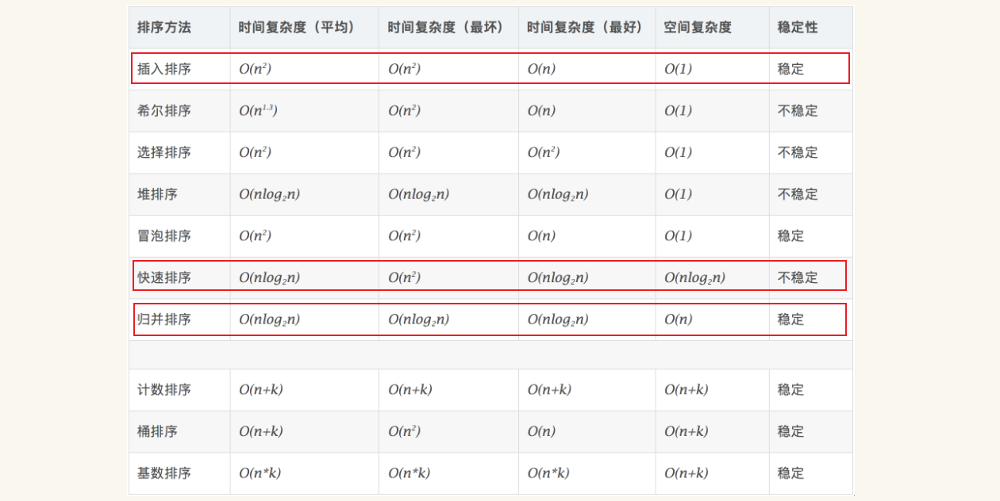

> 参考博客文章：[十大经典排序算法](https://www.cnblogs.com/onepixel/articles/7674659.html#!comments)

- Redis底层的数据结构

- 怎么设计一个zset数据结构？

  


> 参考博客文章：[Redis底层数据结构详解](https://www.cnblogs.com/ysocean/p/9080942.html)


- TCP/IP、HTTP协议（四次握手/三次挥手的原理）


- 各种算法的时间复杂度/空间复杂度
  - String的length()：O(1)
  - LinkedList：O(n)


> 参考博客文章：[Java的Arrays.sort()方法到底用的是什么排序算法](https://www.cnblogs.com/baichunyu/p/11935995.html)、[Object类的hashcode()方法源码分析](https://blog.csdn.net/changrj6/article/details/100043822)

- MySQL中ACID事务特性的实现原理？
  - 通过原子性/隔离性/持久性+业务代码逻辑**保证一致性**。
  - 利用InnoDB的undo_log回滚日志来**保证原子性**。
  - 利用InnoDB的redo_log（体积小，刷盘快；在末尾追加，属于顺序IO）+binlog日志来**保证持久性**。
  - 利用InnoDB的锁（行锁+间隙锁）+MVCC（多版本并发控制）**保证隔离性**。

> 参考博客文章：**[MySQL中事务ACID实现原理](https://www.cnblogs.com/rjzheng/p/10841031.html)**

- MySQL的死锁问题？

  - 关键的配置：
    - innodb_lock_wait_timeout
    - wait-for graph算法

  - 行锁：共享锁、排他锁

    - 共享锁（读锁）：lock in share mode

    - 排他锁（写锁）：for update

      ```sql
      select * from t for update 会等待行锁释放之后，返回查询结果。
      select * from t for update nowait 不等待行锁释放，提示锁冲突，不返回结果
      select * from t for update wait 5 等待5秒，若行锁仍未释放，则提示锁冲突，不返回结果
      select * from t for update skip locked 查询返回查询结果，但忽略有行锁的记录
      ```

  -  行锁的分类：
    - Record lock：索引记录锁，只锁对应的索引中的某个索引记录。
    - Gap lock：间隙锁，只锁对应的索引至某个索引项记录之前的间隙，InnoDB使用间隙锁在Repeatable-Read的事务隔离级别下避免发生幻读。
    - Next key lock：锁住对应的索引中某个索引记录以及此记录之前的间隙。Next key lock=Record lock+Gap lock

  - 注意事项：

    - 行锁必须有索引（一般是主键）才能实现，否则会自动锁全表，那么就不是行锁

      ```sql
      -- 由于InnoDB预设是Row-Level Lock，所以只有「明确」的指定主键，MySQL才会执行Row lock (只锁住被选取的资料例) ，否则MySQL将会执行Table Lock (将整个资料表单给锁住)。
      
      -- 举个例子: 假设有个表单products ，里面有id跟name二个栏位，id是主键。
      -- 例1: (明确指定主键，并且有此笔资料，Row lock)
      SELECT * FROM products WHERE id='3' FOR UPDATE;
      SELECT * FROM products WHERE id='3' and type=1 FOR UPDATE;
      -- 例2: (明确指定主键，若查无此笔资料，无lock)
      SELECT * FROM products WHERE id='-1' FOR UPDATE;
      -- 例3: (无主键，table lock)
      SELECT * FROM products WHERE name='Mouse' FOR UPDATE;
      -- 例4: (主键不明确，table lock)
      SELECT * FROM products WHERE id<>'3' FOR UPDATE;
      -- 例5: (主键不明确，table lock)
      SELECT * FROM products WHERE id LIKE '3' FOR UPDATE;
      -- 注: FOR UPDATE仅适用于InnoDB，且必须在交易区块(BEGIN/COMMIT)中才能生效。
      ```

    - 两个事务不能锁同一个索引

    - insert/delete/update在事务中都会自动默认加上排它锁，select默认加上共享锁

  - MySQL 如何处理死锁？有如下两种方式：由于性能原因，一般都是使用死锁检测来进行处理死锁。

    - 等待，直到超时（innodb_lock_wait_timeout=50s）
    - 发起死锁检测，主动回滚一条事务，让其他事务继续执行（innodb_deadlock_detect=on）

  - 怎样避免产生死锁：
    - 使用事务，不使用`lock tables`。
    - 保证没有长事务。
    - 操作完之后立即提交事务，特别是在交互式命令行中。
    - 如果在用 `(SELECT ... FOR UPDATE or SELECT ... LOCK IN SHARE MODE)`，尝试降低隔离级别。
    - 修改多个表或者多个行的时候，将修改的顺序保持一致。
    - 创建索引，可以使创建的锁更少。
    - 最好不要用 `(SELECT ... FOR UPDATE or SELECT ... LOCK IN SHARE MODE)`。
    - 如果上述都无法解决问题，那么尝试使用 `lock tables t1, t2, t3` 锁多张表。

> 参考博客文章：[MySQL InnoDB引擎的行锁和表锁](https://blog.csdn.net/luzhensmart/article/details/81675527?utm_medium=distribute.pc_relevant.none-task-blog-BlogCommendFromMachineLearnPai2-1.control&dist_request_id=1328642.24613.16156254318796483&depth_1-utm_source=distribute.pc_relevant.none-task-blog-BlogCommendFromMachineLearnPai2-1.control)、[MySQL死锁(锁与事务)](https://www.cnblogs.com/111testing/p/11371236.html)、[行锁与表锁详解](https://blog.csdn.net/nicajonh/article/details/78814987)、[MySQL死锁-产生原因和解决方法](https://blog.csdn.net/tr1912/article/details/81668423)、[MySQL死锁系列-常见加锁场景分析](https://www.cnblogs.com/sunlong88/p/13389895.html)

- 进程间通信的方式有哪些？
  - 管道：半双工+父子进程
  - FIFO：不相关的进程也可以进行数据交换
  - 消息队列：一个消息链表存储在内核中
  - 信号量：提供了一个不同进程或者进程的不同线程之间访问同步的手段
  - 共享内存：允许多个进程共享一个给定的存储区，但要保证同步
  - UNIX域套接字：
  - 套接字（Socket）：

> 参考博客文章：[进程间的通信方式有哪些?](https://blog.csdn.net/hyb612/article/details/89629189)

- 如何将一条SQL语句用JDK1.8中的流操作代替？

  例如：SQL语句`SELECT avg(age) FROM person GROUP BY age ORDER BY age DESC `

  ```java
  // 使用Java流操作处理如下
  
  ```


## 16.114 常考容器类源码

### 16.114.1 HashMap

HashMap结构：JDK1.7是数组+链表，JDK1.8是数组+单向链表/（红黑树+双向链表（利于扩容））。

决定放在哪个槽：`h & (length -1)`，h为经过扰动后的哈希值，JDK1.7为两次扰动，JDK1.8为一次扰动。

哈希冲突的解决办法：开放寻址法（线性探测/二次方探测/随机数探测）、链地址法、重哈希、溢出区。

为什么length要求是2的幂次方数（扩容为什么是2倍）？

- 原因一：充分利用数组的每个下标位，不会造成数组的空间浪费。
- 原因二：扩容后，数据迁移时，数据要么在原来位置，要么在原来位置+扩容长度位置，不需要重新hash，效率更好。
  - 具体步骤：取扩容前计算的哈希值h，与扩容后的length做&运算，若高位为0，则放在原来数组下标位置；若高位为1，则放在原来数组下标+扩容长度位置。

添加元素时的扩容机制：

- 什么时候扩容：
  - JDK1.7（先扩容，再添加）：判断是否到达阈值（0.75*capacity），同时产生了哈希冲突，满足这两个条件就会扩容为原来的2倍。
  - JDK1.8（先添加，再扩容）：先添加元素，然后再判断是否到达阈值，达到了就扩容。

- 如何扩容：
  - JDK1.7：添加元素使用头插法（头插法在多线程环境下会形成环形链表，导致死循环问题），将单向链表的数据进行迁移。
  - JDK1.8：添加元素使用尾插法（尾插法在多线程环境下会有数据丢失（覆盖）的问题），如果对应角标位是单向链表，将单向链表进行数据迁移；如果对应角标位是红黑树，将双向链表进行数据迁移（如果发现迁移完数据后，双向链表的结构小于/等于6，会将红黑树重新转回单向链表的结构）。

### 16.114.2 ConcurrentHashMap

初始容量：

- JDK1.7：Segment数组的长度默认为16，每个Segment内包含HashEntry[]数组，HashEntry[]数组长度默认为2。因此，JDK1.7的ConcurrentHashMap的默认容器长度是32。
- JDK1.8：若设置capacity为32，则最终创建的数组长度为64。采用Unsafe类+CAS+自旋保证初始化安全；初始化initTable()方法采用双重检测加锁机制+CAS+volatile可见性保证安全性。
  - sizeCtl含义：
    - `sizeCtl`为0，代表数组未初始化， 且数组的初始容量为16。
    - `sizeCtl`为正数，如果数组未初始化，那么其记录的是数组的初始容量，如果数组已经初始化，那么其记录的是数组的扩容阈值
    - `sizeCtl`为-1，表示数组正在进行初始化。
    - `sizeCtl`小于0，并且不是-1，表示数组正在扩容， -(1+n)，表示此时有n个线程正在共同完成数组的扩容操作。

组成形式：

- JDK1.7：由Segment[]+HashEntry[]组成，Segment实际上是可重复入锁，而HashEntry是存放数据的Entry。
  - 如何通过一个键的hash值同时确定在Segment[]数组和HashEntry[]数组中的位置？
    - key的高位确定Segment的位置；key的低位确定HashEntry的位置。
- JDK1.8：Node[]+链表/红黑树

添加安全：

- JDK1.7（分段锁+Unsafe+自旋）：分段锁（tryLock）加锁成功，则直接设置值，采用头插法插入HashEntry中；加锁失败，则会一直自旋（最多自旋64次），自旋的过程中会完成对象的创建，自旋的过程中若加锁成功，则会采用头插法插入HashEntry中；若自旋64次依然无法tryLock成功，则会直接采用阻塞锁。
- JDK1.8：  synchronized对桶加锁，采用尾插法

扩容安全：

- JDK1.7（分段锁+Unsafe+自旋）：与添加时类似。针对Segment扩容，采用头插法进行迁移。
- JDK1.8：多线程协助扩容。

> 参考博客文章：[ConcurrentHashMap源码解析](https://blog.csdn.net/programmer_at/article/details/79715177)

### 16.114.3 CopyOnWriteArrayList


### 16.114.4 CopyOnWriteArraySet


### 16.114.5 AbstractQueuedSynchronizer


### 16.114.6 ReentrantLock


> 参考博客文章：[AQS源码视频解析](https://www.bilibili.com/video/BV19J411Q7R5)

### 16.114.7 ReentrantReadWriteLock


### 16.114.8 Semaphore


### 16.114.9 CountDownLatch


### 16.114.10 CyclicBarrier


### 16.114.11 synchronized锁升级过程

对象在内存中的存储结构：

1. 对象头
   - 标记字段（4/8字节）：哈希值、GC分代、偏向锁标志位、锁标志位
   - 类型指针（4/8字节）:
   - 数组长度（4/8字节）：
2. 实例数据：
3. 填充数据：对象在内存中存储的字节数必须是8的整数倍。

锁的升级过程：**无锁**——**偏向锁**——锁撤销——锁膨胀——**轻量级锁**（自旋锁/自适应自旋锁）——**重量级锁**。

> 参考博客文章：[synchronized的锁升级过程](https://www.cnblogs.com/myseries/p/12213997.html)

### 16.114.12 LongAdder

核心思想：分段的CAS


# 17 Undertow+JMeter压力测试

## 17.1 JMeter

JMeter的使用可以参考：[JMeter相关知识整理地址](https://blog.csdn.net/qq_34659777/article/details/85765309)


# 18 Linux

## 18.1 上传下载文件

**使用sftp上传下载文件**：使用`Alt+P`快捷键打开ftp窗口

- 上传：`put C:/Users/zcpro/Documents/aaaa.conf`，会上传到`/root/aaaa.conf`，然后使用mv命令移动到目标文件夹即可。

- 下载：`get /etc/keepalived/keepalived.conf`，会下载到`C:\Users\zcpro\Documents`。

**使用lrzsz上传下载文件**：需要先安装lrzsz（`yum install lrzsz`）

- 上传：`rz`

- 下载：`sz keepalived.conf `

## 18.2 文件权限

### 18.2.1 常用指令

#### 18.2.1.1 su指令

- `su-`：从普通用户切换为root用户

#### 18.2.1.2 exit指令

- `exit`：从root用户切换为普通用户

#### 18.2.1.3 pwd指令

- `pwd`：显示当前所在目录

#### 18.2.1.4 touch指令

**touch指令**：修改文件时间或建置新档 。

```bash
touch [-acdmt] 文件
选项与参数：
-a ：仅修订 access time；
-c ：仅修改文件的时间，若该文件不存在则不建立新文件；
-d ：后面可以接欲修订的日期而不用目前的日期，也可以使用 --date="日期或时间"
-m ：仅修改 mtime ；
-t ：后面可以接欲修订的时间而不用目前的时间，格式为[YYYYMMDDhhmm]
```

- `touch a.txt`：创建一个空文件a.txt
- `touch -d "2 days ago" bashrc`：将日期调整为两天前
- `touch -t 201406150202 bashrc`：将bashrc日期改为2014/06/15 2:02

#### 18.2.1.5 clear指令

- `clear`：清屏

#### 18.2.1.6 date指令

- `date`：显示当前日期与时间
- `date +%Y/%m/%d`：按照指定格式输出日期
- `date +%H:%M`：按照指定格式输出时间

#### 18.2.1.7 cal指令

- `cal`：显示日历
- `cal 2020`：显示2020全年的日历
- `cal 10 2015`：显示2015年10月的日历

#### 18.2.1.8 bc指令

- `bc`：使用计算器
- `scale=3`：设置计算结构保留的小数位
- `quit`：退出程序

#### 18.2.1.9 Tab键与快捷键

**Tab键的几个强大功能**：

- 命令补全功能：`ca[tab][tab] `（会显示所有以ca开头的命令）
- 命令参数补全：`date --[tab][tab]   `（会显示所有可用的参数）

- 文件补全：`ls -al ~/.bash[tab][tab]`（会显示所有以 .bash 为开头的文件名）

**Ctrl+c快捷键**：中断目前程序

**Ctrl+d快捷键**：键盘输入结束，相当于exit指令

#### 18.2.1.10 指令求助

- 使用--help：如`date --help`会显示date的用法

- 使用man指令：如`man date`会在线显示date的用法

- 使用info指令：如`info info`查看info指令的用法

#### 18.2.1.11 关机与重启

- `sync  `：将数据同步写入硬盘中

- `shutdown  `：关机

  ```bash
  /sbin/shutdown [-krhc] [时间] [警告讯息]
  选项与参数：
  -k ： 不要真的关机，只是发送警告讯息出去！
  -r ： 在将系统的服务停掉之后就重新启动(常用)
  -h ： 将系统的服务停掉后，立即关机。 (常用)
  -c ： 取消已经在进行的 shutdown 指令内容。
  时间 ： 指定系统关机的时间！时间的范例底下会说明。若没有这个项目，则默认 1 分钟后自动进行。
  ```

- `reboot`、`halt`、`poweroff`：重启

### 18.2.2 ls指令

```bash
ls [-aAdfFhilnrRSt] 文件名或目录名称
ls [--color={never,auto,always}] 文件名或目录名称..
ls [--full-time] 文件名或目录名称..
选项与参数：
-a ：全部的文件，连同隐藏档( 开头为 . 的文件) 一起列出来(常用)
-A ：全部的文件，连同隐藏档，但不包括 . 与 .. 这两个目录
-d ：仅列出目录本身，而不是列出目录内的文件数据(常用)
-f ：直接列出结果，而不进行排序 (ls 预设会以档名排序！)
-F ：根据文件、目录等信息，给予附加数据结构，例如：
*:代表可执行文件； /:代表目录； =:代表 socket 文件； |:代表 FIFO 文件；
-h ：将文件容量以人类较易读的方式(例如 GB, KB 等等)列出来；
-i ：列出 inode 号码，inode 的意义下一章将会介绍；
-l ：长数据串行出，包含文件的属性与权限等等数据；(常用)
-n ：列出 UID 与 GID 而非使用者与群组的名称 (UID 与 GID 会在账号管理提到！)
-r ：将排序结果反向输出，例如：原本档名由小到大，反向则为由大到小；
-R ：连同子目录内容一起列出来，等于该目录下的所有文件都会显示出来；
-S ：以文件容量大小排序，而不是用档名排序；
-t ：依时间排序，而不是用档名。
--color=never ：不要依据文件特性给予颜色显示；
--color=always ：显示颜色
--color=auto ：让系统自行依据设定来判断是否给予颜色
--full-time ：以完整时间模式 (包含年、月、日、时、分) 输出
--time={atime,ctime} ：输出 access 时间或改变权限属性时间 (ctime)，而非内容变更时间 (modification time)
```

- `ls`：list的意思，显示文件的文件名和相关属性
- `ls -al`：列出所有的文件（包括隐藏文件）详细的权限与属性
- `ls -l --full-time`：列出所有的文件详细的权限与属性（包括完整的时间格式），`ls -l`可缩写为`ll`

### 18.2.3 cp指令

```bash
cp [-adfilprsu] 来源文件(source) 目标文件(destination)
cp [options] source1 source2 source3 .... directory
选项与参数：
-a ：相当于 -dr --preserve=all 的意思，至于 dr 请参考下列说明；(常用)
-d ：若来源文件为链接文件的属性(link file)，则复制链接文件属性而非文件本身；
-f ：为强制(force)的意思，若目标文件已经存在且无法开启，则移除后再尝试一次；
-i ：若目标文件(destination)已经存在时，在覆盖时会先询问动作的进行(常用)
-l ：进行硬式连结(hard link)的连结档建立，而非复制文件本身；
-p ：连同文件的属性(权限、用户、时间)一起复制过去，而非使用默认属性(备份常用)；
-r ：递归持续复制，用于目录的复制行为；(常用)
-s ：复制成为符号链接文件 (symbolic link)，亦即『快捷方式』文件；
-u ：destination 比 source 旧才更新 destination，或 destination 不存在的情况下才复制。
--preserve=all ：除了 -p 的权限相关参数外，还加入 SELinux 的属性, links, xattr 等也复制了。
最后需要注意的，如果来源档有两个以上，则最后一个目的文件一定要是『目录』才行！
```

- `cp .bashrc .bashrc_test`：将.bashrc 这个文件拷贝成为.bashrc_test档名  

### 18.2.4 chgrp/chown/chmod指令

```bash
# chgrp改变所属群组
chgrp [-R] dirname/filename ...
选项与参数：
-R : 进行递归(recursive)的持续变更，亦即连同次目录下的所有文件、目录都更新成为这个群组之意。常常用在变更某一目录内所有的文件之情况

# chown改变文件拥有者
chown [-R] 账号名称 文件或目录
chown [-R] 账号名称:组名 文件或目录
选项与参数：
-R : 进行递归(recursive)的持续变更，亦即连同次目录下的所有文件都变更

# 设定文件或目录权限
chmod [-R] xyz 文件或目录
选项与参数：
xyz : 就是刚刚提到的数字类型的权限属性，为rwx属性数值的相加。
-R : 进行递归(recursive)的持续变更，亦即连同次目录下的所有文件都会变更
```

- `chmod 777 .bashrc`：将.bashrc 这个文件所有的权限都设定启用

### 18.2.5 cd/mkdir/rmdir

```bash
cd [相对路径或绝对路径]

mkdir [-mp] 目录名称
选项与参数：
-m ：配置文件案的权限喔！直接设定，不需要看预设权限 (umask) 的脸色～
-p ：帮助你直接将所需要的目录(包含上层目录)递归建立起来！

rmdir [-p] 目录名称
选项与参数：
-p ：连同『上层』『空的』目录也一起删除
```

- `cd /var/spool/mail`：进入/var/spool/mail目录
- `mkdir -p test1/test2/test3/test4`：建立一个多级目录
- `rmdir -p test1/test2/test3/test4`：删除一个多级目录

### 18.2.6 rm指令

```bash
rm [-fir] 文件或目录
选项与参数：
-f ：就是 force 的意思，忽略不存在的文件，不会出现警告讯息；
-i ：互动模式，在删除前会询问使用者是否动作
-r ：递归删除啊！最常用在目录的删除了！这是非常危险的选项！！！
```

- `rm -i bashrc.text`：删除文件前先确认
- `rm -i bashrc*`：透过通配符*的帮忙，将开头为bashrc的文件通通删除
- `rm -r  bashrc`：递归删除bashrc目录下的文件（会询问）
- `rm -rf  bashrc`：递归删除bashrc目录下的文件（不会询问）
- `rm -rf /*`：自杀

### 18.2.7 mv指令

```bash
mv [-fiu] source destination
mv [options] source1 source2 source3 .... directory
选项与参数：
-f ：force 强制的意思，如果目标文件已经存在，不会询问而直接覆盖；
-i ：若目标文件 (destination) 已经存在时，就会询问是否覆盖！
-u ：若目标文件已经存在，且 source 比较新，才会更新 (update)
```

- `mv mvtest mvtest2`：将目录mvtest重命名为mvtest
- `mv mvtest.txt mvtest2.txt `：将文件mvtest.txt重命名为mvtest2.txt
- `mv mvtest.txt mvtest2`：将文件mvtest.txt移动到mvtest2目录中

### 18.2.8 cat/tac/nl指令

**cat指令**：从第一行开始显示内容。

**tac指令**：从最后一行开始显示，可以看出tac是cat的倒写。

**nl指令**：显示的时候，顺道输出行号！

```bash
cat [-AbEnTv]
选项与参数：
-A ：相当于 -vET 的整合选项，可列出一些特殊字符而不是空白而已；
-b ：列出行号，仅针对非空白行做行号显示，空白行不标行号！
-E ：将结尾的断行字符 $ 显示出来；
-n ：打印出行号，连同空白行也会有行号，与 -b 的选项不同；
-T ：将 [tab] 按键以 ^I 显示出来；
-v ：列出一些看不出来的特殊字符

nl [-bnw] 文件
选项与参数：
-b ：指定行号指定的方式，主要有两种：
-b a ：表示不论是否为空行，也同样列出行号(类似 cat -n)；
-b t ：如果有空行，空的那一行不要列出行号(默认值)；
-n ：列出行号表示的方法，主要有三种：
-n ln ：行号在屏幕的最左方显示；
-n rn ：行号在自己字段的最右方显示，且不加 0 ；
-n rz ：行号在自己字段的最右方显示，且加 0 ；
-w ：行号字段的占用的字符数。
```

- `cat /etc/issue`：显示 /etc/issue 这个文件的内容
- `nl /etc/issue`：用nl列出 /etc/issue 的内容

### 18.2.9 more/less指令

**more指令**：一页一页的显示文件内容。

**less指令**：与more类似，不同的是less可以向前翻页（使用PgUp和PgDn进行上下翻页）。

```bash
# more指令
空格键 (space)：代表向下翻一页；
Enter ：代表向下翻『一行』；
/字符串 ：代表在这个显示的内容当中，向下搜寻『字符串』这个关键词；
:f ：立刻显示出文件名以及目前显示的行数；
q ：代表立刻离开 more ，不再显示该文件内容。
b 或 [ctrl]-b ：代表往回翻页，不过这动作只对文件有用，对管线无用。

# less指令
空格键 ：向下翻动一页；
[pagedown]：向下翻动一页；
[pageup] ：向上翻动一页；
/字符串 ：向下搜寻『字符串』的功能；
?字符串 ：向上搜寻『字符串』的功能；
n ：重复前一个搜寻 (与 / 或 ? 有关！)
N ：反向的重复前一个搜寻 (与 / 或 ? 有关！)
g ：前进到这个资料的第一行去；
G ：前进到这个数据的最后一行去 (注意大小写)；
q ：离开 less 这个程序；
```

- `more /etc/man_db.conf`：一页一页翻动
- `less /etc/man_db.conf`：一页一页翻动

### 18.2.10 head/tail指令

**head指令**：只看头几行。

**tail指令**：只看尾巴几行。

```bash
head [-n number] 文件
选项与参数：
-n ：后面接数字，代表显示几行的意思
```

- `head /etc/man_db.conf`：默认的情况下，显示前面10行
- `head -n 20 /etc/man_db.conf`：显示前面20行
- `head -n -100 /etc/man_db.conf`：显示后面100行

```bash
tail [-n number] 文件
选项与参数：
-n ：后面接数字，代表显示几行的意思
-f ：表示持续侦测后面所接的档名，要等到按下[ctrl]-c 才会结束 tail 的侦测
```

- `tail /etc/man_db.conf`：默认的情况，显示后面10行
- `tail -n 20 /etc/man_db.conf`：显示后面20行
- `tail -f /var/log/messages`：持续侦测/var/log/messages的内容

### 18.2.11 od指令

**od指令**：查看非纯文本指令。

```bash
od [-t TYPE] 文件
选项或参数：
-t ：后面可以接各种『类型 (TYPE)』的输出，例如：
a ：利用默认的字符来输出；
c ：使用 ASCII 字符来输出
d[size] ：利用十进制(decimal)来输出数据，每个整数占用 size bytes ；
f[size] ：利用浮点数(floating)来输出数据，每个数占用 size bytes ；
o[size] ：利用八进制(octal)来输出数据，每个整数占用 size bytes ；
x[size] ：利用十六进制(hexadecimal)来输出数据，每个整数占用 size bytes ；
```

- `od -t c /usr/bin/passwd`：将/usr/bin/passwd的内容使用ASCII方式来展现！
- `od -t oCc /etc/issue`：将/etc/issue这个文件的内容以8进位列出储存值与ASCII的对照表

### 18.2.12 which/whereis/locate指令

**which指令**：脚本文件名的搜寻 。

**whereis指令**：文件档名的搜寻。

**locate指令**：限定搜寻。

```bash
which [-a] command
选项或参数：
-a ：将所有由 PATH 目录中可以找到的指令均列出，而不止第一个被找到的指令名称
```

- `which ifconfig`：搜寻ifconfig这个指令的完整文件名
- `which which`：搜寻which这个指令的完整文件名

```bash
whereis [-bmsu] 文件或目录名
选项与参数：
-l :可以列出 whereis 会去查询的几个主要目录而已
-b :只找 binary 格式的文件
-m :只找在说明文件 manual 路径下的文件
-s :只找 source 来源文件
-u :搜寻不在上述三个项目当中的其他特殊文件
```

- `whereis ifconfig`：请找出ifconfig这个档名
- `whereis passwd`：只找出跟passwd有关的『说明文件』档名(man page)
- `whereis -m passwd`：只有在man里面的档名才抓出来！

```bash
locate [-ir] keyword
选项与参数：
-i ：忽略大小写的差异；
-c ：不输出档名，仅计算找到的文件数量
-l ：仅输出几行的意思，例如输出五行则是 -l 5
-S ：输出 locate 所使用的数据库文件的相关信息，包括该数据库纪录的文件/目录数量等
-r ：后面可接正规表示法的显示方式
```

- `locate -l 5 passwd`：找出系统中所有与 passwd 相关的档名，且只列出 5 个
- `locate -S`：列出 locate 查询所使用的数据库文件之文件名与各数据数量

### 18.2.13 find指令

**find指令**：查找符合条件的文件。

```bash
find [PATH] [option] [action]
选项与参数：
1. 与时间有关的选项：共有 -atime, -ctime 与 -mtime ，以 -mtime 说明
-mtime n ：n 为数字，意义为在 n 天之前的『一天之内』被更动过内容的文件；
-mtime +n ：列出在 n 天之前(不含 n 天本身)被更动过内容的文件档名；
-mtime -n ：列出在 n 天之内(含 n 天本身)被更动过内容的文件档名。
-newer file ：file 为一个存在的文件，列出比 file 还要新的文件档名

2. 与使用者或组名有关的参数：
-uid n ：n 为数字，这个数字是用户的账号 ID，亦即 UID ，这个 UID 是记录在
/etc/passwd 里面与账号名称对应的数字。这方面我们会在第四篇介绍。
-gid n ：n 为数字，这个数字是组名的 ID，亦即 GID，这个 GID 记录在
/etc/group，相关的介绍我们会第四篇说明～
-user name ：name 为使用者账号名称喔！例如 dmtsai
-group name：name 为组名喔，例如 users ；
-nouser ：寻找文件的拥有者不存在 /etc/passwd 的人！
-nogroup ：寻找文件的拥有群组不存在于 /etc/group 的文件！
当你自行安装软件时，很可能该软件的属性当中并没有文件拥有者，这是可能的！在这个时候，就可以使用 -nouser 与 -nogroup 搜寻。

3. 与文件权限及名称有关的参数：
-name filename：搜寻文件名为 filename 的文件；
-size [+-]SIZE：搜寻比 SIZE 还要大(+)或小(-)的文件。这个 SIZE 的规格有：
c: 代表 byte， k: 代表 1024bytes。所以，要找比 50KB
还要大的文件，就是『 -size +50k 』
-type TYPE ：搜寻文件的类型为 TYPE 的，类型主要有：一般正规文件 (f), 装置文件 (b, c),
目录 (d), 连结档 (l), socket (s), 及 FIFO (p) 等属性。
-perm mode ：搜寻文件权限『刚好等于』 mode 的文件，这个 mode 为类似 chmod
的属性值，举例来说， -rwsr-xr-x 的属性为 4755 ！
-perm -mode ：搜寻文件权限『必须要全部囊括 mode 的权限』的文件，举例来说，们要搜寻 -rwxr--r-- ，亦即 0744 的文件，使用 -perm -0744，当一个文件的权限为 -rwsr-xr-x ，亦即 4755 时，也会被列出来，因为 -rwsr-xr-x 的属性已经囊括了 -rwxr--r-- 的属性了。
-perm /mode ：搜寻文件权限『包含任一 mode 的权限』的文件，举例来说，我们搜寻-rwxr-xr-x ，亦即 -perm /755 时，但一个文件属性为 -rw-------也会被列出来，因为他有 -rw.... 的属性存在！

4. 额外可进行的动作：
-exec command ：command 为其他指令，-exec 后面可再接额外的指令来处理搜寻到的结果。
-print ：将结果打印到屏幕上，这个动作是预设动作！
```

- `find / -mtime 0`：将过去系统上面 24 小时内有更动过内容 (mtime) 的文件列出
- `find /etc -newer /etc/passwd`：寻找 /etc 底下的文件，如果文件日期比 /etc/passwd 新就列出
- `find /home -user dmtsai`：搜寻 /home 底下属于 dmtsai 的文件
- `find / -nouser`：搜寻系统中不属于任何人的文件
- `find / -name passwd`：找出档名为 passwd 这个文件
- `find / -name "*passwd*"`：找出文件名包含了 passwd 这个关键词的文件
- `find /run -type s`：找出 /run 目录下，文件类型为Socket的檔名有哪些？
- `find / -perm /7000`：搜寻文件当中含有 SGID 或 SUID 或 SBIT 的属性

- `find /usr/bin /usr/sbin -perm /7000 -exec ls -l {} \;`：将上个范例找到的文件使用 ls -l 列出来～
- `find / -size +1M`：找出系统中，大于1MB的文件

### 18.2.14 gzip/tar指令

**gzip指令**：压缩指令。

**tar指令**：打包或解压指令。

```bash
gzip [-cdtv#] 檔名
选项与参数：
-c ：将压缩的数据输出到屏幕上，可透过数据流重导向来处理；
-d ：解压缩的参数；
-t ：可以用来检验一个压缩文件的一致性～看看文件有无错误；
-v ：可以显示出原文件/压缩文件案的压缩比等信息；
-# ：# 为数字的意思，代表压缩等级，-1 最快，但是压缩比最差、-9 最慢，但是压缩比最好！预设是 -6
```

- `gzip -v services`：将services文件压缩成services.gz

```bash
tar [-z|-j|-J] [cv] [-f 待建立的新檔名] filename... <==打包与压缩
tar [-z|-j|-J] [tv] [-f 既有的 tar 檔名] <==察看檔名
tar [-z|-j|-J] [xv] [-f 既有的 tar 檔名] [-C 目录] <==解压缩
选项与参数：
-c ：建立打包文件，可搭配 -v 来察看过程中被打包的档名(filename)
-t ：察看打包文件的内容含有哪些档名，重点在察看『档名』就是了；
-x ：解打包或解压缩的功能，可以搭配 -C (大写) 在特定目录解开
特别留意的是， -c, -t, -x 不可同时出现在一串指令列中。
-z ：透过 gzip 的支持进行压缩/解压缩：此时档名最好为 *.tar.gz
-j ：透过 bzip2 的支持进行压缩/解压缩：此时档名最好为 *.tar.bz2
-J ：透过 xz 的支持进行压缩/解压缩：此时档名最好为 *.tar.xz
特别留意， -z, -j, -J 不可以同时出现在一串指令列中
-v ：在压缩/解压缩的过程中，将正在处理的文件名显示出来！
-f filename：-f 后面要立刻接要被处理的档名！建议 -f 单独写一个选项啰！(比较不会忘记)
-C 目录 ：这个选项用在解压缩，若要在特定目录解压缩，可以使用这个选项。

其他后续练习会使用到的选项介绍：
-p(小写) ：保留备份数据的原本权限与属性，常用于备份(-c)重要的配置文件
-P(大写) ：保留绝对路径，亦即允许备份数据中含有根目录存在之意；
--exclude=FILE：在压缩的过程中，不要将 FILE 打包！
```

- `tar -cvf xxx.tar ./*`：将当前目录下的所有文件打包成xxx.tar
- `tar -zcvf xxx.tar.gz ./*`：将当前目录下的所有文件打包并压缩成xxx.tar.gz
- `tar -xvf xxx.tar`：解压xxx.tar文件
- `tar -zxvf xxx.tar.gz -C /usr/aaa`：解压xxx.tar文件到/usr/aaa目录

### 18.2.15 echo指令

**echo指令**：读取变量或设定。

- `echo $variable`：读取变量variable的值或设置变量（若变量不存在）
- `echo $PATH`：读取变量PATH的值或设置变量（若变量不存在）
- `echo ${PATH} `：读取变量PATH的值或设置变量（若变量不存在）

### 18.2.16 >/>>

**\>指令**：重定向输出，覆盖原内容。

**\>\>指令**：重定向输出，有追加功能。

- `cat /etc/passwd > a.txt`：将输出定向到a.txt
- `cat /etc/passwd >> a.txt`：输出并且追加到a.txt中

### 18.2.17 管线/cut/grep命令

**|指令**：管线命令。

- `ls -al /etc | less`：分页显示文件

**cut指令**：撷取命令，将一段数据经过分析后，取出我们所想要的 。

```bash
cut -d'分隔字符' -f fields <==用于有特定分隔字符
cut -c 字符区间 <==用于排列整齐的讯息
选项与参数：
-d ：后面接分隔字符。与 -f 一起使用；
-f ：依据 -d 的分隔字符将一段讯息分区成为数段，用 -f 取出第几段的意思；
-c ：以字符 (characters) 的单位取出固定字符区间；
```

- `export | cut -c 12-`：将 export 输出的讯息，取得第 12 字符以后的所有字符串

**gerp指令**：分析一行讯息， 若当中有我们所需要的信息，就将该行拿出来。

```bash
grep [-acinv] [--color=auto] '搜寻字符串' filename
选项与参数：
-a ：将 binary 文件以 text 文件的方式搜寻数据
-c ：计算找到 '搜寻字符串' 的次数
-i ：忽略大小写的不同，所以大小写视为相同
-n ：顺便输出行号
-v ：反向选择，亦即显示出没有 '搜寻字符串' 内容的那一行！
--color=auto ：可以将找到的关键词部分加上颜色的显示喔！
```

- `last | grep 'root'`：将 last 当中，有出现 root 的那一行就取出来
- `last | grep -v 'root'`：与范例一相反，只要没有 root 的就取出！
- `last | grep 'root' |cut -d ' ' -f1`：在last的输出讯息中，只要有root就取出，并且仅取第一栏

- `grep --color=auto 'MANPATH' /etc/man_db.conf`：取出 /etc/man_db.conf 内含 MANPATH 的那几行

## 18.3 进程

### 18.3.1 ps指令

**ps指令**：查看进程的信息。

```bash
ps指令选项与参数：
-A: 所有的process均显示出来，与-e具有同样的效用;
-a: 不与 terminal 有关的所有process;
-u: 有效使用者(effective user)相关的process;
x: 通常与a这个参数一起使用,可列出较完整信息
输出格式规划：
l: 较长、较详细的将该PID的的信息列出
j: 工作的格式 (jobs format)
-f: 做一个更为完整的输出
```

- `ps aux`：查看系统所有进程数据（执行的命令不会显示文件夹）
- `ps -l`：只查阅自己的bash相关进程
- `ps -lA`：查看系统所有的进程数据（执行的命令不会显示文件夹）
- `ps axjf`：查看系统的进程数状态
- `ps aux|grep nginx`：查看与Nginx相关的进程
- `ps -ef|grep nginx`：查看与Nginx相关的进程

### 18.3.2 top指令

**top指令**：动态观察进程的变化，相当于windows系统的资源管理器。

```bash
# top [-d 数字] | top [-bnp]
选项与参数：
-d ：后面可以接秒数，就是整个进程画面更新的秒数。预设是 5 秒；
-b ：以批次的方式执行 top ，还有更多的参数可以使用喔！常会搭配数据流重导向来将批次的结果输出成为文件。
-n ：与 -b 搭配，意义是，需要进行几次 top 的输出结果。
-p ：指定某些个 PID 来进行观察监测而已。
在 top 执行过程当中可以使用的按键指令：
	? ：显示在 top 当中可以输入的按键指令；
	P ：以 CPU 的使用资源排序显示；
	M ：以 Memory 的使用资源排序显示；
	N ：以 PID 来排序喔！
	T ：由该 Process 使用的 CPU 时间累积 (TIME+) 排序。
	k ：给予某个 PID 一个讯号 (signal)
	r ：给予某个 PID 重新制订一个 nice 值。
	q ：离开 top 软件的按键。
```

- `top`：观察动态进程的变化
- `top -b -n 2 > /tmp/top.txt`：将top的信息进行2次，然后将结果输出到 /tmp/top.txt
- `top -d 5 -b 2`：将top的信息进次2次，每次间隔5秒
- `top -d 2 -p 14836`：查看进程号为14836的资源利用信息
- `echo $$`：查看当前bash的PID

### 18.3.2 pstree指令

**pstree指令**：查看进程树。

```bash
pstree [-A|U] [-up]
选项与参数：
-A ：各进程树之间的连接以 ASCII 字符来连接；
-U ：各进程树之间的连接以万国码的字符来连接。在某些终端接口下可能会有错误；
-p ：并同时列出每个 process 的 PID；
-u ：并同时列出每个 process 的所属账号名称。
```

- `pstree -A`：列出目前系统上面所有的进程树的相关性
- `pstree -Aup`：列出目前系统上面所有的进程树的相关性，同时秀出PID与users

### 18.3.3 kill指令

**kill指令**：根据进程号杀掉进程。

```bash
kill -signal PID
1 SIGHUP 启动被终止的进程，可让该 PID 重新读取自己的配置文件，类似重新启动
2 SIGINT 相当于用键盘输入 [ctrl]-c 来中断一个进程的进行
9 SIGKILL 代表强制中断一个进程的进行，如果该进程进行到一半， 那么尚未完成的部分可能会有『半产品』产生，类似 vim 会有.filename.swp保留下来
15 SIGTERM 以正常的结束进程来终止该进程。由于是正常的终止， 所以后续的动作会将他完成。不过，如果该进程已经发生问题，就是无法使用正常的方法终止时， 输入这个signal也是没有用的。
19 SIGSTOP 相当于用键盘输入 [ctrl]-z 来暂停一个进程的进行
```

- `kill 2868`：杀掉2868进程
- `kill -9 2868`：强制杀掉2868进程

### 18.3.4 killAll指令

**killAll指令**：根据指令名称杀掉进程。

```bash
killall [-iIe] [command name]
选项与参数：
-i ：interactive 的意思，交互式的，若需要删除时，会出现提示字符给用户；
-e ：exact 的意思，表示『后面接的 command name 要一致』，但整个完整的指令不能超过 15 个字符。
-I ：指令名称(可能含参数)忽略大小写
```

- `killall -1 rsyslogd`：给予rsyslogd这个指令启动的PID一个SIGHUP的讯号
- `killall -9 httpd`：强制终止所有以httpd启动的进程 （其实并没有此进程在系统内）
- `killall -i -9 bash`：依次询问每个 bash 程序是否需要被终止运作！

### 18.3.5 free指令

**free指令**：观察内存使用的情况。

```bash
free [-b|-k|-m|-g|-h] [-t] [-s N -c N]
选项与参数：
-b ：直接输入 free 时，显示的单位是 Kbytes，我们可以使用 b(bytes), m(Mbytes)
k(Kbytes), 及 g(Gbytes) 来显示单位喔！也可以直接让系统自己指定单位 (-h)
-t ：在输出的最终结果，显示物理内存与 swap 的总量。
-s ：可以让系统每几秒钟输出一次，不间断的一直输出的意思！对于系统观察挺有效！
-c ：与 -s 同时处理～让 free 列出几次的意思～
```

- `free -m`：显示目前系统的内存容量

### 18.3.6 uname指令

**uname指令**：查阅系统与核心相关信息。

```bash
uname [-asrmpi]
选项与参数：
-a ：所有系统相关的信息，包括底下的数据都会被列出来；
-s ：系统核心名称
-r ：核心的版本
-m ：本系统的硬件名称，例如 i686 或 x86_64 等；
-p ：CPU 的类型，与 -m 类似，只是显示的是 CPU 的类型！
-i ：硬件的平台 (ix86)
```

- `uname -a`：输出系统的基本信息

### 18.3.7 uptime指令

**uptime指令**：观察系统启动时间与工作负载。

- `uptime`：观察系统启动时间与工作负载

### 18.3.8 netstat指令

**netstat指令**：追踪网络或插槽文件。

```bash
netstat -[atunlp]
选项与参数：
-a ：将目前系统上所有的联机、监听、Socket 数据都列出来
-t ：列出 tcp 网络封包的数据
-u ：列出 udp 网络封包的数据
-n ：不以进程的服务名称，以埠号 (port number) 来显示；
-l ：列出目前正在网络监听 (listen) 的服务；
-p ：列出该网络服务的进程 PID
```

- `netstat`：列出目前系统已经建立的网络联机与unix socket状态
- `netstat -tulnp`：找出目前系统上已在监听的网络联机及其PID

### 18.3.9 dmesg指令

**dmesg指令**：分析核心产生的信息。

- `dmesg | more`：输出所有的核心开机时的信息。
- `dmesg | grep -i vda`：搜寻开机的时候，硬盘的相关信息为何？

### 18.3.10 vmstat指令

**vmstat**指令：侦测系统资源变化。

```bash
vmstat [-a] [延迟 [总计侦测次数]] <==CPU/内存等信息
vmstat [-fs] <==内存相关
vmstat [-S 单位] <==设定显示数据的单位
vmstat [-d] <==与磁盘有关
vmstat [-p 分区槽] <==与磁盘有关
选项与参数：
-a ：使用 inactive/active(活跃与否) 取代 buffer/cache 的内存输出信息；
-f ：开机到目前为止，系统复制 (fork) 的进程数；
-s ：将一些事件 (开机至目前为止) 导致的内存变化情况列表说明；
-S ：后面可以接单位，让显示的数据有单位。例如 K/M 取代 bytes 的容量；
-d ：列出磁盘的读写总量统计表
-p ：后面列出分区槽，可显示该分区槽的读写总量统计表
```

- `vmstat 1 3`：统计目前主机CPU 状态，每秒一次，共计三次！
- `vmstat -d`：系统上面所有的磁盘的读写状态

### 18.3.11 lsof指令

**lsof指令**：列出被进程所开启的文件档名。

```bash
lsof [-aUu] [+d]
选项与参数：
-a ：多项数据需要『同时成立』才显示出结果时！
-U ：仅列出 Unix like 系统的 socket 文件类型；
-u ：后面接 username，列出该使用者相关进程所开启的文件；
+d ：后面接目录，亦即找出某个目录底下已经被开启的文件！
```

- `lsof`：列出目前系统上面所有已经被开启的文件与装置
- `lsof -u root -a -U`：仅列出关于root的所有进程开启的socket文件
- `lsof +d /dev`：请列出目前系统上面所有的被启动的周边装置
- `lsof -u root | grep bash`：秀出属于root的bash这支程序所开启的文件

### 18.3.12 pidof指令

pidof指令：找出某支正在执行的程序的PID

```bash
pidof [-sx] program_name
选项与参数：
-s ：仅列出一个 PID 而不列出所有的 PID
-x ：同时列出该 program name 可能的 PPID 那个进程的 PID
```

- `pidof systemd rsyslogd`：列出目前系统上面systemd以及rsyslogd这两个程序的PID

## 18.4 服务

### 18.4.1 systemctl指令

**systemctl指令**：管理单一服务 (service unit) 的启动/开机启动与观察状态。

```bash
systemctl [command] [unit]
command 主要有：
start ：立刻启动后面接的 unit
stop ：立刻关闭后面接的 unit
restart ：立刻关闭后启动后面接的 unit，亦即执行 stop 再 start 的意思
reload ：不关闭后面接的 unit 的情况下，重载配置文件，让设定生效
enable ：设定下次开机时，后面接的 unit 会被启动
disable ：设定下次开机时，后面接的 unit 不会被启动
status ：目前后面接的这个 unit 的状态，会列出有没有正在执行、开机预设执行否、登录等信息等！
is-active ：目前有没有正在运作中
is-enable ：开机时有没有预设要启用这个 unit
```

- `systemctl status atd.service`：看目前atd这个服务的状态为何？

- `systemctl stop atd.service`：正常关闭这个atd服务
- `systemctl mask cups.service`：强迫服务注销，会让启动的脚本变成空的，再也start不起来了
- `systemctl unmask cups.service`：取消服务的注销

```bash
systemctl [command] [--type=TYPE] [--all]
command:
list-units ：依据 unit 列出目前有启动的 unit。若加上 --all 才会列出没启动的。
list-unit-files ：依据 /usr/lib/systemd/system/ 内的文件，将所有文件列表说明。
--type=TYPE：就是之前提到的 unit type，主要有 service, socket, target 等
```

- `systemctl`：列出系统上面有启动的unit
- `systemctl list-unit-files`：列出所有已经安装的unit有哪些？

- `systemctl list-units --type=service --all`：只剩下 *.service 的项目才会出现喔！
- `systemctl list-units --type=service --all | grep cpu`：查询系统上是否有以 cpu 为名的服务？
- `systemctl poweroff`：系统关机
- `systemctl reboot` ：重新启动
-  `systemctl suspend`：进入暂停模式
- `systemctl hibernate`：进入休眠模式
- `systemctl rescue`：强制进入救援模式
- `systemctl emergency`：强制进入紧急救援模式

## 18.5 软件安装

### 18.5.1 configure指令

**configure指令**：侦测用户的作业环境，建立Makefile文件。

### 18.5.2 make指令

**make指令**：make 时，make 会在当时的目录下搜寻Makefile (or makefile) 这个文本文件，而Makefile里面则记录了原始码如何编译的详细信息！make会自动的判别原始码是否经过变动了，而自动更新执行档。**编译前，需要先执行configure指令**。

### 18.5.3 Tarball文件

**Tarball文件**：其实就是将软件的所有原始码文件先以tar打包，然后再以压缩技术来压缩，通常最常见的就是以gzip来压缩了。因为利用了tar与gzip的功能，所以tarball文件一般的扩展名就会写成 *.tar.gz 或者是简写为 *.tgz 。

### 18.5.4 安装软件

关于rpm和yum，有时候傻傻分不清楚，下面对比一下：

|  Distribution  | 软件管理机制 |   使用指令    | 在线升级机制（指令） |
| :------------: | :----------: | :-----------: | :------------------: |
| Red Hat/Fedora |     RPM      | rpm，rpmbuild |       YUM(yum)       |
| Debian/Ubuntu  |     DPKG     |     dpkg      |     APT(apt-get)     |

**RPM**：全名RedHat Package Manager。

**RPM与SRPM**：RPM 文件必须要在相同的Linux环境下才能够安装，而 SRPM 既然是原始码的格式，自然我们就可以透过修改SRPM内的参数配置文件，然后重新编译产生能适合我们Linux环境的RPM文件。

| 文件格式 |  档名格式   | 直接安装与否 |  内含程序类型  | 可否修改参数并编译 |
| :------: | :---------: | :----------: | :------------: | :----------------: |
|   RPM    |   xxx.rpm   |      可      |     已编译     |        不可        |
|   SRPM   | xxx.src.rpm |     不可     | 未编译之原始码 |         可         |

#### 18.5.4.1 RPM安装

```bash
rpm -ivh package_name
选项与参数：
-i ：install 的意思
-v ：察看更细部的安装信息画面
-h ：以安装信息列显示安装进度
```

- `rpm -ivh /mnt/Packages/rp-pppoe-3.11-5.el7.x86_64.rpm`：安装原版光盘上的rp-pppoe软件
- `rpm -ivh a.i386.rpm b.i386.rpm *.rpm`：一口气安装两个以上的软件时
- `rpm -ivh http://website.name/path/pkgname.rpm`：直接由网络上面的某个文件安装，以网址来安装

#### 18.5.4.2 RPM查询

**RPM查询**：查询的地方是在/var/lib/rpm/这个目录下的数据库文件；RPM也可以查询未安装的RPM文件内的信息。

```bash
rpm -qa <==已安装软件
rpm -q[licdR] 已安装的软件名称 <==已安装软件
rpm -qf 存在于系统上面的某个文件名 <==已安装软件
rpm -qp[licdR] 未安装的某个文件名 <==查阅 RPM 文件

选项与参数：
查询已安装软件的信息：
-q ：仅查询，后面接的软件名称是否有安装；
-qa ：列出所有的，已经安装在本机 Linux 系统上面的所有软件名称；
-qi ：列出该软件的详细信息 (information)，包含开发商、版本与说明等；
-ql ：列出该软件所有的文件与目录所在完整文件名 (list)；
-qc ：列出该软件的所有配置文件 (找出在 /etc/ 底下的檔名而已)
-qd ：列出该软件的所有说明文件 (找出与 man 有关的文件而已)
-qR ：列出与该软件有关的相依软件所含的文件 (Required 的意思)
-qf ：由后面接的文件名，找出该文件属于哪一个已安装的软件；
-q --scripts：列出是否含有安装后需要执行的脚本档，可用以 debug 喔！
查询某个 RPM 文件内含有的信息：
-qp[icdlR]：注意 -qp 后面接的所有参数以上面的说明一致。但用途仅在于找出
某个 RPM 文件内的信息，而非已安装的软件信息！注意！
```

- `rpm -q logrotate`：找出你的Linux是否有安装logrotate这个软件？
- `rpm -ql logrotate`：属于该软件所提供的所有目录与文件

- `rpm -qi logrotate`：列出logrotate这个软件的相关说明数据
- `rpm -qc logrotate`：找出logrotate的配置文件
- `rpm -qd logrotate`：找出logrotate的说明档
- `rpm -qR logrotate`：若要成功安装logrotate，他还需要什么文件的帮忙？
- `rpm -qf /bin/sh`：找出 /bin/sh 是那个软件提供的？
- `rpm -qpR filename.i386.rpm`：假设我有下载一个 RPM 文件，想要知道该文件的需求文件，该如何？

```bash
RPM验证与数字签名
rpm -Va
rpm -V 已安装的软件名称
rpm -Vp 某个 RPM 文件的档名
rpm -Vf 在系统上面的某个文件
选项与参数：
-V ：后面加的是软件名称，若该软件所含的文件被更动过，才会列出来；
-Va ：列出目前系统上面所有可能被更动过的文件；
-Vp ：后面加的是文件名，列出该软件内可能被更动过的文件；
-Vf ：列出某个文件是否被更动过～
```

- `rpm -V logrotate`：列出你的 Linux 内的 logrotate 这个软件是否被更动过？
- `rpm -Vf /etc/crontab`：查询一下，你的 /etc/crontab 是否有被更动过？

#### 18.5.3 RPM卸载

- `rpm -qa | grep pam`：找出与 pam 有关的软件名称
- `rpm -e pam`：移除掉pam软件
- `rpm --rebuilddb`：常常进行安装/移除/升级时，若导致RPM数据库/var/lib/rpm/内的文件破损，可以使用该命令重建数据库

#### 18.5.4.4 YUM查询

```bash
yum [option] [查询工作项目] [相关参数]
选项与参数：
[option]：主要的选项，包括有：
-y ：当 yum 要等待用户输入时，这个选项可以自动提供 yes 的响应；
--installroot=/some/path ：将该软件安装在 /some/path 而不使用默认路径
[查询工作项目] [相关参数]：这方面的参数有：
search ：搜寻某个软件名称或者是描述 (description) 的重要关键字；
list ：列出目前 yum 所管理的所有的软件名称与版本，有点类似 rpm -qa；
info ：同上，不过有点类似 rpm -qai 的执行结果；
provides：从文件去搜寻软件！类似 rpm -qf 的功能！
```

- `yum search raid`：搜寻磁盘阵列 (raid) 相关的软件有哪些？
- `yum info mdadm`：找出 mdadm 这个软件的功能为何
- `yum list`：列出yum服务器上面提供的所有软件名称
- `yum list updates  `：列出目前服务器上可供本机进行升级的软件有哪些？
- `yum provides passwd`：列出提供passwd这个文件的软件有哪些

#### 18.5.4.5 YUM安装/升级

```bash
yum [option] [安装与升级的工作项目] [相关参数]
选项与参数：
install ：后面接要安装的软件！
update ：后面接要升级的软件，若要整个系统都升级，就直接 update 即可
```

- `yum install pam-devel`：安装pam-devel

#### 18.5.4.6 YUM卸载

- `yum remove pam-devel`：卸载pam-devel

#### 18.5.4.7 YUM配置

```bash
# 代表软件库的名字！中括号一定要存在，里面的名称则可以随意取。但是不能有两个相同的软件库名称,否则yum会不晓得该到哪里去找软件库相关软件列表文件
[centosplus]
# name只是说明一下这个软件库的意义而已，重要性不高！
name=CentOS-$releasever - Plus - mirrors.aliyun.com
failovermethod=priority
# mirrorlist列出这个软件库可以使用的映射站台，如果不想使用，可以批注到这行
# mirrorlist=http://mirrorlist.centos.org/?release=$releasever&arch=$basearch&repo=os&infra=$infra
# 这个最重要，因为后面接的就是软件库的实际网址!mirrorlist是由yum程序自行去捉映像站台,baseurl则是指定固定的一个软件库网址！我们刚刚找到的网址放到这里来啦！
baseurl=http://mirrors.aliyun.com/centos/$releasever/centosplus/$basearch/
        http://mirrors.aliyuncs.com/centos/$releasever/centosplus/$basearch/
        http://mirrors.cloud.aliyuncs.com/centos/$releasever/centosplus/$basearch/
# gpgcheck=1就是指定需要查阅RPM文件内的数字签名！
gpgcheck=1
# enable=1就是让这个软件库被启动。如果不想启动可以使用 enable=0 喔！
enabled=0
# gpgkey就是数字签名的公钥文件所在位置！使用默认值即可
gpgkey=http://mirrors.aliyun.com/centos/RPM-GPG-KEY-CentOS-7
```

- `vim /etc/yum.repos.d/CentOS-Base.repo`：在`CentOS-Base.repo`中配置YUM源

- `yum repolist all`：列出目前yum server所使用的软件库有哪些？

```bash
yum clean [packages|headers|all]
选项与参数：
packages：将已下载的软件文件删除
headers ：将下载的软件文件头删除
all ：将所有软件库数据都删除！
```

- `yum clean all`：删除已下载过的所有软件库的相关数据 (含软件本身与列表)

> 参考博客文章：**[<<鸟哥的Linux私房菜>>]()**


